# 安卓开发基础

安卓是一种以 Linux 为基础的开放源代码操作系统，主要用于移动和便携设备。当前稳定主版本为安卓 15（API 35），由谷歌领导的开放手机联盟（Open
Handset Alliance，OHA）持续演进。安卓 15 延续了 Material Design 设计体系，并继续强化大屏与折叠屏体验、后台任务与电量管理、隐私安全保护，以及系统组件模块化更新能力。

近年来，安卓平台在隐私与安全方面持续增强：例如更精细的媒体访问权限、前台服务类型约束、后台启动限制，以及对应用兼容行为的分级控制。开发者在适配新版本时，通常需要重点关注 targetSdk 升级后带来的行为变更，并结合官方兼容性测试与发布前回归测试，确保应用在新系统上的稳定性与用户体验。

## 安卓入门

安卓系统是基于Linux平台的智能手机操作系统，是一个开源的平台，由操作系统、中间件、用户界面和应用软件等部分组成。安卓系统采用软件堆层（Software
Stack，又名软件叠层）的系统架构，由多个程序组合来完成一个共同的任务。安卓的系统架构主要分为三个层次，底层以Linux内核为基础，由C语言开发，是移动设备的操作系统，只提供基本功能；中间层包括函数库（Library）和虚拟机（Virtual
Machine），由C++开发；最上层是各种应用软件组成，包括通话程序、短信程序和游戏等。安卓系统作为一个移动开放平台，提供了与苹果移动系统不同的生态环境。任何手机厂商都可以免费使用安卓系统来定制自己的产品，而且安卓系统提供了标准的SDK，应用软件可以由第三方开发者独立完成，目前应用的开发语言使用Java。

### 安卓历史

安卓由 Android, Inc.开发于 2003
年，该公司于2005年被谷歌收购。在测试版发布之前，谷歌和手机开发联盟至少有两个软件的内部版本。测试版本已于2007年11月5日发布，而软件开发工具包于2007年11月12日发布。因为不存在用于测试操作系统的物理设备，后续的几个公共测试版本是通过软件模拟完成发布的。Android
1.0 的首次公开发布发生在 2008年10月通过T-Mobile G1（又名 HTC Dream）设备发布的。安卓 1.0 和 1.1
并未以特定代号发布，而代号“Astro Boy”和“Bender”在一些早期 1.0
之前的里程碑版本中被内部标记，并且从未用作操作系统
1.0 和 1.1 版本的实际代号。

从安卓1.5版本开始，谷歌选择使用甜点名称作系统版本的代号，其版本的名称分别为：纸杯蛋糕（Cupcake）、甜甜圈（Donut）、松饼（Eclair）、冻酸奶（Froyo）、姜饼（Gingerbread）、蜂巢（Honeycomb）、冰激凌三明治（Ice
Cream Sandwich）、果冻豆（Jelly
Bean）、奇巧（KitKat）、棒棒糖（Lollipop）、棉花糖（Marshmallow）、Nougat（牛轧糖）、奥利奥（Oreo）、馅饼（Pie），而且版本名称的英文名首字母按照字母的顺序，从C开始到P。谷歌于
2019 年 8 月宣布，他们将结束甜点名称方案，以便在未来版本中使用数字排序，数字顺序格式下的第一个版本是安卓10，于 2019 年 9
月发布。

2017 年，谷歌宣布将开始要求应用开发针对最新的安卓版本，最初的最低要求是 2017
年下半年发布的安卓8，到2018年8月新开发应用程序需要支持，2018
年 11 月之前更新现有应用程序，这种模式在随后的几年中一直延续。2020 年 11 月，谷歌宣布新应用需要在 2021 年 8
月之前以安卓10为目标，现有应用的任何更新都需要在 2021 年 11
月之前以安卓10为目标。安卓11系统在2020年9月9日正式发布，主要增强了聊天气泡、安全性、隐私性的保护、电源菜单，可以更好的支持瀑布屏、折叠屏、双屏和
Vulkan 扩展程序等。

<table>
<thead>
<tr class="header">
<th>名称</th>
<th>内部代号</th>
<th>版本号</th>
<th>
初始稳定

发布日期
</th>
<th>
支持

（安全修复）
</th>
<th>API级别</th>
</tr>
</thead>
<tbody>
<tr class="odd">
<td><a href="https://en.wikipedia.org/wiki/Android_1.0">安卓 1.0</a></td>
<td>不适用</td>
<td>1.0</td>
<td>2008 年 9 月 23 日</td>
<td>不</td>
<td>1</td>
</tr>
<tr class="even">
<td><a href="https://en.wikipedia.org/wiki/Android_1.1">安卓 1.1</a></td>
<td>小蛋糕</td>
<td>1.1</td>
<td>2009 年 2 月 9 日</td>
<td>不</td>
<td>2</td>
</tr>
<tr class="odd">
<td><a href="https://en.wikipedia.org/wiki/Android_Cupcake">安卓蛋糕</a></td>
<td>纸杯蛋糕</td>
<td>1.5</td>
<td>2009 年 4 月 27 日</td>
<td>不</td>
<td>3</td>
</tr>
<tr class="even">
<td><a href="https://en.wikipedia.org/wiki/Android_Donut">安卓甜甜圈</a></td>
<td>油炸圈饼</td>
<td>1.6</td>
<td>2009 年 9 月 15 日</td>
<td>不</td>
<td>4</td>
</tr>
<tr class="odd">
<td><a href="https://en.wikipedia.org/wiki/Android_Eclair">安卓 Eclair</a></td>
<td>泡芙</td>
<td>2.0</td>
<td>2009 年 10 月 27 日</td>
<td>不</td>
<td>5</td>
</tr>
<tr class="even">
<td></td>
<td></td>
<td>2.0.1</td>
<td>2009 年 12 月 3 日</td>
<td>不</td>
<td>6</td>
</tr>
<tr class="odd">
<td></td>
<td></td>
<td>2.1</td>
<td>2010 年 1 月 11 日</td>
<td>不</td>
<td>7</td>
</tr>
<tr class="even">
<td><a href="https://en.wikipedia.org/wiki/Android_Froyo">安卓系统</a></td>
<td>弗罗约</td>
<td>2.2 – 2.2.3</td>
<td>2010 年 5 月 20 日</td>
<td>不</td>
<td>8</td>
</tr>
<tr class="odd">
<td><a href="https://en.wikipedia.org/wiki/Android_Gingerbread">安卓姜饼</a></td>
<td>姜饼</td>
<td>2.3 – 2.3.2</td>
<td>2010 年 12 月 6 日</td>
<td>不</td>
<td>9</td>
</tr>
<tr class="even">
<td></td>
<td></td>
<td>2.3.3 – 2.3.7</td>
<td>2011 年 2 月 9 日</td>
<td>不</td>
<td>10</td>
</tr>
<tr class="odd">
<td><a href="https://en.wikipedia.org/wiki/Android_Honeycomb">安卓蜂窝</a></td>
<td>蜂窝</td>
<td>3.0</td>
<td>2011 年 2 月 22 日</td>
<td>不</td>
<td>11</td>
</tr>
<tr class="even">
<td></td>
<td></td>
<td>3.1</td>
<td>2011 年 5 月 10 日</td>
<td>不</td>
<td>12</td>
</tr>
<tr class="odd">
<td></td>
<td></td>
<td>3.2 – 3.2.6</td>
<td>2011 年 7 月 15 日</td>
<td>不</td>
<td>13</td>
</tr>
<tr class="even">
<td><a href="https://en.wikipedia.org/wiki/Android_Ice_Cream_Sandwich">Android 冰淇淋三明治</a></td>
<td>冰淇淋三明治</td>
<td>4.0 – 4.0.2</td>
<td>2011 年 10 月 18 日</td>
<td>不</td>
<td>14</td>
</tr>
<tr class="odd">
<td></td>
<td></td>
<td>4.0.3 – 4.0.4</td>
<td>2011 年 12 月 16 日</td>
<td>不</td>
<td>15</td>
</tr>
<tr class="even">
<td><a href="https://en.wikipedia.org/wiki/Android_Jelly_Bean">安卓果冻豆</a></td>
<td>果冻豆</td>
<td>4.1 – 4.1.2</td>
<td>2012 年 7 月 9 日</td>
<td>不</td>
<td>16</td>
</tr>
<tr class="odd">
<td></td>
<td></td>
<td>4.2 – 4.2.2</td>
<td>2012 年 11 月 13 日</td>
<td>不</td>
<td>17</td>
</tr>
<tr class="even">
<td></td>
<td></td>
<td>4.3 – 4.3.1</td>
<td>2013 年 7 月 24 日</td>
<td>不</td>
<td>18</td>
</tr>
<tr class="odd">
<td><a href="https://en.wikipedia.org/wiki/Android_KitKat">安卓奇巧</a></td>
<td>酸橙派</td>
<td>4.4 – 4.4.4</td>
<td>2013 年 10 月 31 日</td>
<td>不</td>
<td>19</td>
</tr>
<tr class="even">
<td></td>
<td></td>
<td>4.4W – 4.4W.2</td>
<td>2014 年 6 月 25 日</td>
<td>不</td>
<td>20</td>
</tr>
<tr class="odd">
<td><a href="https://en.wikipedia.org/wiki/Android_Lollipop">安卓棒棒糖</a></td>
<td>柠檬蛋白派</td>
<td>5.0 – 5.0.2</td>
<td>2014 年 11 月 4 日</td>
<td>不</td>
<td>21</td>
</tr>
<tr class="even">
<td></td>
<td></td>
<td>5.1 – 5.1.1</td>
<td>2015 年 3 月 2 日</td>
<td>不</td>
<td>22</td>
</tr>
<tr class="odd">
<td><a href="https://en.wikipedia.org/wiki/Android_Marshmallow">安卓棉花糖</a></td>
<td>澳洲坚果曲奇</td>
<td>6.0 – 6.0.1</td>
<td>2015 年 10 月 2 日</td>
<td>不</td>
<td>23</td>
</tr>
<tr class="even">
<td><a href="https://en.wikipedia.org/wiki/Android_Nougat">安卓牛轧糖</a></td>
<td>纽约芝士蛋糕</td>
<td>7.0</td>
<td>2016 年 8 月 22 日</td>
<td>不</td>
<td>24</td>
</tr>
<tr class="odd">
<td></td>
<td></td>
<td>7.1 – 7.1.2</td>
<td>2016 年 10 月 4 日</td>
<td>不</td>
<td>25</td>
</tr>
<tr class="even">
<td><a href="https://en.wikipedia.org/wiki/Android_Oreo">安卓奥利奥</a></td>
<td>燕麦曲奇</td>
<td>8.0</td>
<td>2017 年 8 月 21 日</td>
<td>不</td>
<td>26</td>
</tr>
<tr class="odd">
<td></td>
<td></td>
<td>8.1</td>
<td>2017 年 12 月 5 日</td>
<td>不</td>
<td>27</td>
</tr>
<tr class="even">
<td><a href="https://en.wikipedia.org/wiki/Android_Pie">安卓派</a></td>
<td>开心果冰淇淋</td>
<td>9</td>
<td>2018 年 8 月 6 日</td>
<td>是的</td>
<td>28</td>
</tr>
<tr class="odd">
<td><a href="https://en.wikipedia.org/wiki/Android_10">安卓 10</a></td>
<td>木瓜馅饼</td>
<td>10</td>
<td>2019 年 9 月 3 日</td>
<td>是的</td>
<td>29</td>
</tr>
<tr class="even">
<td><a href="https://en.wikipedia.org/wiki/Android_11">安卓 11</a></td>
<td>红色天鹅绒蛋糕</td>
<td>11</td>
<td>2020 年 9 月 8 日</td>
<td>是的</td>
<td>30</td>
</tr>
<tr class="odd">
<td><a href="https://en.wikipedia.org/wiki/Android_12">安卓 12</a></td>
<td>雪锥</td>
<td>12</td>
<td>2021 年 10 月 4 日</td>
<td>是的</td>
<td>31</td>
</tr>
<tr class="even">
<td><a href="https://en.wikipedia.org/wiki/Android_12#Android_12L">安卓 12L</a></td>
<td>雪锥 v2</td>
<td>12L</td>
<td>2022 年 3 月 7 日</td>
<td>是的</td>
<td>32</td>
</tr>
<tr class="odd">
<td><a href="https://en.wikipedia.org/wiki/Android_13">安卓 13</a></td>
<td>提拉米苏</td>
<td>13</td>
<td>2022 年 8 月 15 日</td>
<td>是的</td>
<td>33</td>
</tr>
<tr class="even">
<td><a href="https://en.wikipedia.org/wiki/Android_14">安卓 14</a></td>
<td>倒置蛋糕</td>
<td>14</td>
<td>2023 年 10 月 4 日</td>
<td>是的</td>
<td>34</td>
</tr>
<tr class="odd">
<td><a href="https://en.wikipedia.org/wiki/Android_15">安卓 15</a></td>
<td>香草冰淇淋</td>
<td>15</td>
<td>2024 年 10 月 15 日</td>
<td>是的</td>
<td>35</td>
</tr>
</tbody>
</table>

表 1‑1 安卓的各个版本

注：上表“支持（安全修复）”用于说明该版本在发布时段内是否仍可获得官方安全更新。

### 硬件要求

安卓的主要硬件平台是ARM 架构（ARMv7和ARMv8-A架构；以前也是 ARMv5），后来的安卓版本也正式支持x86 和MIPS 架构，但
MIPS 支持已被弃用并且在 NDK r17 中删除了支持。安卓1.0 到 1.5 需要带自动对焦相机的 2
兆像素相机，这对于使用安卓1.6的定焦相机来说很轻松。2012年，搭载Intel处理器的安卓设备开始出现，包括手机和平板电脑，在获得对64位平台的支持的同时，安卓首先在64位x86上运行，然后在ARM64上运行。自安卓5.0起，除32位变体外，还支持所有平台的64位变体。运行Android
7.1设备的最小RAM量要求取决于屏幕尺寸和密度以及CPU类型，范围为816MB–1.8GB（64位）和512MB–1.3GB（32位），这意味着实际上1GB是最常见的显示类型（安卓手表的最低大小为416MB）。安卓4.4的建议是至少有512MB的RAM，而对于低RAM的设备，340MB是所需的最小数量，不包括专用于各种硬件组件的内存，例如所述基带处理器。安卓4.4需要一个32位ARMv7、MIPS或x86架构处理器，与OpenGL
ES 2.0兼容图形处理单元(GPU)。安卓支持OpenGL ES
1.1、2.0、3.0、3.2和安卓7.0的Vulkan。某些应用程序可能明确需要特定版本的
OpenGL ES，并且需要合适的 GPU 硬件来运行此类应用程序。2021 年，安卓被移植到RISC-V。2021
年，高通表示将支持更多更新。

表 1‑2提供设备的有关共享特定特征（例如屏幕尺寸和密度）相对数量信息，数据快照代表截至 2021 年 11 月 26 日的 7
天内的所有活动设备。这可以帮助选择要优化的设备配置文件，该配置由屏幕尺寸和密度的组合定义。为简化为不同屏幕配置设计用户界面的方式，安卓将实际屏幕尺寸和密度的范围划分为多个类别，如下表。

|        | ldpi | mdpi | tvdpi | hdpi  | xhdpi | xxhdpi | 总数    |
| ------ | ---- | ---- | ----- | ----- | ----- | ------ | ----- |
| Small  | 0.1% |      |       |       | 0.2%  |        | 0.3%  |
| Normal |      | 0.2% | 0.2%  | 11.3% | 43.6% | 25.3%  | 80.6% |
| Large  |      | 1.3% | 2.6%  | 0.8%  | 4.6%  | 2.2%   | 11.5% |
| Xlarge |      | 4.2% | 0.1%  | 3.0%  | 0.4%  |        | 7.7%  |
| Total  | 0.1% | 5.7% | 2.9%  | 15.1% | 48.8% | 27.5%  |       |

表 1‑2 屏幕尺寸和密度分布（2021 年 11 月 26 日）

<table>
<tbody>
<tr class="odd">
<td>

图 1‑1
</td>
<td>
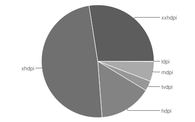

图 1‑2
</td>
</tr>
</tbody>
</table>

另外，Vulkan是一个跨平台的2D和3D绘图应用程序接口，最早由科纳斯组织（Khronos
Group）在2015年游戏开发者大会（GDC）上发表。科纳斯最先把Vulkan称为“下一代OpenGL行动”或“glNext”，但在正式宣布Vulkan之后这些名字就没有再使用了。就像OpenGL，Vulkan针对实时3D程序（如电子游戏）设计，Vulkan并计划提供高性能和低CPU管理负担，这也是Direct3D12和AMD的Mantle的目标。Vulkan兼容Mantle的一个分支，并使用了Mantle的一些组件。Vulkan旨在提供更低的CPU开销与更直接的GPU控制，其理念大致与Direct3D
12和Mantle类似。表 1‑3提供有关支持特定 Vulkan 版本的设备的相对数量的数据。不支持 Vulkan 的设备用 None
表示。注意，对一个特定版本的 Vulkan 的支持也意味着对任何较低版本的支持（例如，对 1.1 版的支持也意味着对
1.0.3 的支持），对一个特定版本的 OpenGL ES 的支持也意味着对任何较低版本的支持（例如，对 2.0 版的支持也意味着对 1.1
的支持）。

| Vulkan版本     | 分布     |
| ------------ | ------ |
| None         | 29.0%  |
| Vulkan 1.0.3 | 17.0%  |
| Vulkan 1.1   | 54.0%  |
| OpenGL ES 版本 | 分布     |
| GL 2.0       | 7.50%  |
| GL 3.0       | 9.95%  |
| GL 3.1       | 6.63%  |
| GL 3.2       | 75.92% |

表 1‑3 支持特定 Vulkan 版本

<table>
<tbody>
<tr class="odd">
<td>
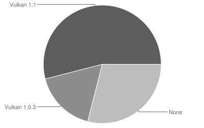

图 1‑3
</td>
<td>
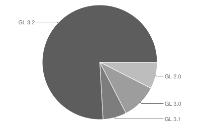

图 1‑4
</td>
</tr>
</tbody>
</table>

### 技术架构

安卓技术架构如图 1.2显示。安卓系统架构由5个部分组成，从顶层到底层是System Apps、Java API
Framework、Native Libraries、Android Runtime、Hardware Abstraction Layer
(HAL)、Linux kernel。对于一个安卓应用开发者，只需要了解System
Apps和Framework上面两个层次；如果是嵌入式和硬件移植的开发者，还需要了解Native
Libraries、Android Runtime、Hardware Abstraction Layer (HAL)和Linux
kernel这几个部分。这本书的内容主要涉及框架中上面两个层次的技术。

图 1‑5安卓技术框架

  - System Apps

安卓配置一个核心应用程序集合，包括电子邮件客户端、短信程序、日历、地图、浏览器、联系人、照相机、时钟、拨号和其他设置，所有应用程序都是用编程语言写的，自己开发的应用也在这个层次。

  - Framework

安卓提供开放的应用框架，应用开发者可以方便地设计丰富和新颖的应用程序。通过应用框架，开发者能够自由地利用设备硬件、使用访问位置信息、运行后台服务、设置闹钟，并且向状态栏添加通知等等功能。由于这个应用开发框架是完全开放的，应用开发者能够使用框架的核心功能。设计应用框架的目的在于方便组件的重用，简化应用程序的开发，而且应用程序都可以发布和使用应用框架中的功能。应用框架主要是由下面的功能组成的：

  - 视图系统（View
    System）包括丰富的、可扩展的视图集合，可用于构建一个应用程序。包括列表、网格、文本框、按钮，甚至是内嵌的网页浏览器。

  - 内容提供者（Content Providers）使应用程序能访问其他应用程序（如通讯录）的数据，或共享自己的数据。

  - 管理器（Managers），其中资源管理器（Resource）为应用程序提供可访问的非代码资源，如本地化字符串、图形和布局文件等；通知管理器（Notification）支持所有的应用程序能在状态栏显示自定义警告；活动管理器（Activity）管理用户界面应用程序的生命周期，提供通用的导航回退功能；窗口管理器（Window）；位置管理器（Location）支持移动设备上基于位置和地图的应用。

<!-- end list -->

  - Native Libraries

本地库是由安卓提供的一系列本地头文件和共享库文件，应用程序通过应用框架调用。本地库支持使用硬件传感器、访问存储器、处理用户输入、配置信息设置等功能。随着安卓的版本和安卓
API Level的不断更新，本地库的功能逐渐增长。到目前为止，包括C/C++库、ZLib压缩库、动态链接库、嵌入式3D图形加速标准OpenGL
ES库、分配和管理OpenGL ES的EGL库、嵌入式音频加速标准OpenSL ES库、
FreeType位图和矢量字体处理库、强大而轻量级的关系数据库引擎SQLite
、WebKit和OpenMAX AL等库。

  - Android Runtime

Android Runtime包括核心库、ART和Dalvik虚拟机。从安卓4.4开始，安卓就推出了新的Android
Runtime（Android RunTime, ART）,
替代之前版本的Dalvik。ART的功能是管理和运行Android应用程序和Android的一部分系统服务。与Dalvik相比较，ART提供了许多新的功能，来改善安卓平台和应用的性能。ART和它的前身Dalvik都是专门为安卓项目创建的，
ART遵循Dalvik可执行格式和Dex 字节码规范。ART 和Dalvik运行Dex字节码时是兼容的，因此基于Dalvik
开发的应用也可以在ART上运行。但有时候，基于Dalvik的技术无法在ART上实现。

  - Hardware Abstraction Layer (HAL)

硬件抽象层为硬件厂商定义了一个标准接口，安卓系统通过这个标准接口使用硬件实现的功能，底层的硬件驱动实现对于安卓系统透明。也就是说，安卓的上层应用只需调用这些标准接口来实现软件的功能，不必了解具体是哪家厂商的产品，如何实现。硬件抽象层使得安卓系统的上层软件功能与硬件实现隔离开，不同硬件的支持不会影响也不需要修改上层软件系统。当然，针对不同的厂商产品，需要开发对应的硬件抽象层。硬件抽象层的实现部分以.so的文件模式存储在共享库模块中。

  - Linux Kernel

安卓的Linux
Kernel提供操作系统的核心系统服务，包括安全管理、内存管理、进程管理、网络堆栈、电源管理和驱动模型等等，例如声音、显示、相机、蓝牙、WIFI等设备的驱动都在这一层实现。

### 开发流程

在Android Studio平台上开发安卓，与在其他平台上开发的流程基本一致。作为安卓应用的专用开发平台，Android
Studio平台把开发过程中所需的一些设计和开发的专用工具统一整合，例如用户界面图形设计工具、Android
SDK、安卓虚拟机等，安装后就具有的开发中所需要的工具，下面是在Android Studio中开发应用的流程，见**图
1.23**。

图 1‑6 App开发流程图

  - 安装

在这个阶段，需要下载Android
Studio安装包，安装安卓开发环境后，配置虚拟机和测试设备，并通过HelloWorld应用测试整个平台的各项功能，熟悉所安装版本平台的工具和项目的组织结构，为正式开发应用做好准备。

  - 开发

这个阶段需要创建应用的项目，了解开发应用的所有相关文件，以及保存的相应目录结构，这一阶段的任务分为三个部分。界面设计主要是用户界面的组件定义和布局设计，可以使用Android
Studio的图形工具实现，也可以直接使用XML语言来直接编写。无论哪种形式，最后界面的设计代码都以XML文件形式存储在资源文件目录res中；资源和数据组织主要是把图形、图标、网络链接等资源和数据通过资源文件存放在res合适的目录中。源程序代码主要实现用户界面的交互功能和后台的数据管理、网络通信等程序功能。通过代码，把界面设计的用户界面按照应用逻辑关联起来，实现整个应用的完整功能。AndroidManifest.xml文件是对总体进行配置的文件，在安卓应用程序开发的过程中，每一个安卓组件都需要在这个文件中进行配置后，才能够添加到应用中执行。

  - 编译调试

这个阶段，其中一个重点是配置编译的模式，进行软件测试，即是对应用进行总体编译、调试和测试，可以按照软件的测试标准书写编写用例，对软件的功能和性能进行测试，优化应用。另一个重点是在不同配置的虚拟机和硬件设备上对应用进行功能和性能测试，对其兼容性和健壮性进行测试，调整应用的用户界面友好程度和增强应用的版本兼容性。这些调试和测试过程，Android
Studio都提供有相应工具来帮助程序员进行。

## 安装设置

在进行安卓应用程序开发之前，需要搭建安卓应用程序开发环境。本书建议使用最新稳定版 Android Studio
（如 Koala 2024.1.1 及后续版本）来执行创建应用程序的任务。Android
Studio是用于开发安卓应用的官方集成开发环境，以 IntelliJ IDEA 为基础构建而成。除了IntelliJ
强大的代码编辑器和开发者工具，Android Studio 还提供更多可提高安卓应用构建效率的功能，例如：

  - 基于 Gradle 的灵活构建系统

  - 快速且功能丰富的模拟器

  - 统一的环境，适用于所有安卓设备的应用

  - “Apply Changes”功能可将代码和资源更改推送到正在运行的应用，而无需重启应用

  - 代码模板和 GitHub 集成，可协助打造常见的应用功能及导入示例代码

  - 大量的测试工具和框架

  - Lint 工具能够找出性能、易用性和版本兼容性等方面的问题

  - C++ 和 NDK 支持

目前可以在Android
Studio存档页面（https://developer.android.com/studio/archive）上找到最新版本。Android
Studio 是安卓开发的官方集成开发环境，提供开发安卓应用所需要的各种支持工具和软件包，安装完后具有下面的功能：

  - IntelliJ IDE + Android Studio 插件

  - 安卓SDK 工具包

  - 安卓平台工具

  - 安卓开发平台

由于Android Studio把安卓应用程序开发所需的运行环境、开发库、开发工具和界面都集成为一个包，所以安装比较简单。Android
Studio针对Windows、Mac、Linux、Chrome OS不同的操作系统，提供相应的安装包。在下载完成Android
Studio安装包之后，首先需要确认操作系统已经安装了 JDK，并建议使用 JDK 17 或以上版本。下面介绍Android
Studio基于Windows的安装步骤。不必立即下载和安装离线工具，必须至少启动一次 Android Studio 才能下载
Gradle 构建工具，如果连接速度足够快会发现使用标准配置更容易。步骤如下：

(1)如果下载了 .exe 文件，双击以启动。如果下载了 .zip 文件，解压 ZIP，将 android-studio 文件夹复制到您的
Program Files 文件夹中，然后打开 android-studio \> bin 文件夹并启动 studio64.exe（对于 64
位机器）或 studio.exe （对于 32 位机器）。

(2)按照 Android Studio 中的向导安装它推荐的任何 SDK 包。

(3)第一次开始新安装 Android Studio 时，根据需要选Android Studio预定的设置，当“Import Android
Studio Settings”对话框出现时，可以选择“do not import settings”，然后单击确定继续，见（图
1‑7）；在“Install Type”对话框中，可以选择“Custom”（选自己定制的设置）并单击“Next”，见（图
1‑8）；继续下面的配置，在 “Select UI Theme ”对话框中，选择喜欢的界面主题，然后单击 “Next”；在“Verify
Settings”对话框中，检查以确保您使用的是默认 SDK
路径，单击“Finish”以完成设置并开始下载组件，这个过程包括下载安卓的组件和工具包并进行安装，需要的时间稍微有点长直到完成配置过程；组件下载完成后，再次单击“Finish”以结束安装；出现Android
Studio启动界面，见图 1.4，关闭Android Studio启动界面，就完成了安装。

(4)设置Windows系统环境变量。注意在某些Windows系统中，Android
Studio安装脚本找不到JDK的路径，如果遇到这种情况，需要在环境变量中设置JDK路径。

<table>
<tbody>
<tr class="odd">
<td>

图 1‑7 导入设置
</td>
<td>

图 1‑8 配置选择
</td>
</tr>
</tbody>
</table>

<table>
<tbody>
<tr class="odd">
<td>
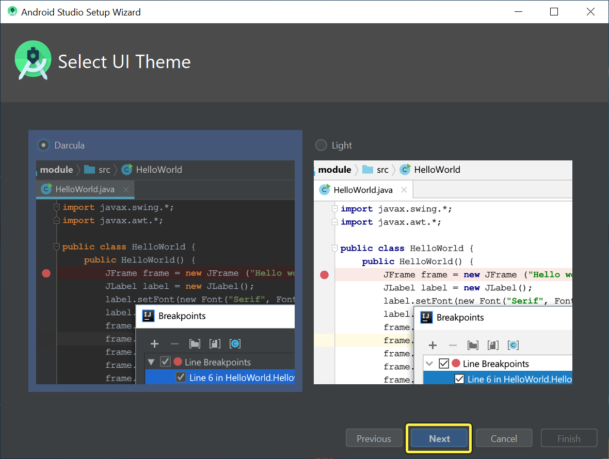

图 1‑9
</td>
<td>

图 1‑10
</td>
</tr>
</tbody>
</table>

图 1‑11Android Studio启动界面

Android Studio 提供向导和模板来验证系统要求，例如 Java
开发工具包和可用内存；并配置默认设置，例如优化的默认安卓虚拟设备仿真和更新的系统映像，也可以自定义
Android Studio 使用的其他配置设置，Android Studio 通过“Help”菜单提供对两个配置文件的访问：

  - studio.vmoptions为 Android Studio 的 Java 虚拟机自定义选项，例如堆栈大小和缓存大小，在 Linux
    机器上此文件可能命名为 studio64.vmoptions，具体取决于Android Studio 版本。

  - idea.properties：自定义 Android Studio 属性，例如插件文件夹路径或支持的最大文件大小。

这两个配置文件都存储在 Android Studio 的配置文件夹中，文件夹的名称取决于Android Studio 版本，以下是
Android Studio 4.1 及更高版本的Windows系统实例：

> C:\\Users\\YourUserName\\AppData\\Roaming\\Google\\AndroidStudio4.1

studio.vmoptions文件允许为 Android Studio 的 JVM 自定义选项。为了提高 Android
Studio的性能，最常见的调整选项是最大堆大小，也可以使用studio.vmoptions文件覆盖其他默认设置，例如初始堆大小、缓存大小和
Java 垃圾收集开关。要创建新studio.vmoptions文件或打开现有文件，使用以下步骤：

（1）单击“Help \> Edit Custom VM Options”，如果从未为 Android Studio 编辑过 VM 选项，IDE
会提示创建一个新 studio.vmoptions文件，单击“Yes”以创建文件。

（2）studio.vmoptions文件在 Android Studio 的编辑器窗口中打开，编辑该文件以添加自定义 VM
选项。创建的studio.vmoptions文件中默认添加到位于bin/Android Studio
安装文件夹内的目录中。虽然可以访问该文件以查看默认 VM
选项，但编辑studio.vmoptions文件时确保不会覆盖 Android Studio
的重要默认设置。默认情况下，Android Studio 的最大堆大小为
1280MB，如果正在处理大型项目或者系统具有大量内存，可以通过增加 Android Studio
进程（例如核心 IDE、Gradle 守护程序和Kotlin守护程序）的最大堆大小来提高性能。Android Studio
会自动检查可能的堆大小优化，并在检测到性能可以提高时通知您。

图 1‑12关于推荐内存设置的通知

如果使用具有至少5 GB内存的64位系统，还可以手动调整项目的堆大小，按照下列步骤操作：

（1）单击菜单栏中的“File \> Settings”；

（2）单击Appearance & Behavior \> System Settings \> Memory Settings。

图 1‑13

（3）调整堆大小以匹配所需的数量；

（4）单击“Apply”。

可以导出Settings.jar文件，包含项目的全部或一部分首选 IDE 设置，然后可以将 JAR
文件导入到其他项目中。idea.properties文件允许为Android
Studio自定义IDE属性，例如用户安装插件的路径和 IDE
支持的最大文件大小，idea.properties文件将与IDE的默认属性合并，因此可以仅指定覆盖属性，要创建新idea.properties文件或打开现有文件，使用以下步骤：

(1)单击“Help \> Edit Custom Properties”，如果之前从未编辑过IDE属性，Android Studio
会提示创建一个新idea.properties文件，单击“Yes”以创建文件；

(2)idea.properties文件在 Android Studio 的编辑器窗口中打开，编辑该文件以添加自定义 IDE
属性。以下idea.properties文件包含常用的自定义 IDE 属性：

> \#---------------------------------------------------------------------
> 
> \# Uncomment this option if you want to customize path to user
> installed plugins folder. Make sure
> 
> \# you're using forward slashes.
> 
> \#---------------------------------------------------------------------
> 
> \# idea.plugins.path=${idea.config.path}/plugins
> 
> \#---------------------------------------------------------------------
> 
> \# Maximum file size (kilobytes) IDE should provide code assistance
> for.
> 
> \# The larger file is the slower its editor works and higher overall
> system memory requirements are
> 
> \# if code assistance is enabled. Remove this property or set to very
> large number if you need
> 
> \# code assistance for any files available regardless their size.
> 
> \#---------------------------------------------------------------------
> 
> idea.max.intellisense.filesize=2500
> 
> \#---------------------------------------------------------------------
> 
> \# This option controls console cyclic buffer: keeps the console
> output size not higher than the
> 
> \# specified buffer size (Kb). Older lines are deleted. In order to
> disable cycle buffer use
> 
> \# idea.cycle.buffer.size=disabled
> 
> \#---------------------------------------------------------------------
> 
> idea.cycle.buffer.size=1024
> 
> \#---------------------------------------------------------------------
> 
> \# Configure if a special launcher should be used when running
> processes from within IDE.
> 
> \# Using Launcher enables "soft exit" and "thread dump" features
> 
> \#---------------------------------------------------------------------
> 
> idea.no.launcher=false
> 
> \#---------------------------------------------------------------------
> 
> \# To avoid too long classpath
> 
> \#---------------------------------------------------------------------
> 
> idea.dynamic.classpath=false
> 
> \#---------------------------------------------------------------------
> 
> \# There are two possible values of idea.popup.weight property:
> "heavy" and "medium".
> 
> \# If you have WM configured as "Focus follows mouse with Auto Raise"
> then you have to
> 
> \# set this property to "medium". It prevents problems with popup
> menus on some
> 
> \# configurations.
> 
> \#---------------------------------------------------------------------
> 
> idea.popup.weight=heavy
> 
> \#---------------------------------------------------------------------
> 
> \# Use default anti-aliasing in system, i.e. override value of
> 
> \# "Settings|Editor|Appearance|Use anti-aliased font" option. May be
> useful when using Windows
> 
> \# Remote Desktop Connection for instance.
> 
> \#---------------------------------------------------------------------
> 
> idea.use.default.antialiasing.in.editor=false
> 
> \#---------------------------------------------------------------------
> 
> \# Disabling this property may lead to visual glitches like blinking
> and fail to repaint
> 
> \# on certain display adapter cards.
> 
> \#---------------------------------------------------------------------
> 
> sun.java2d.noddraw=true
> 
> \#---------------------------------------------------------------------
> 
> \# Removing this property may lead to editor performance degradation
> under Windows.
> 
> \#---------------------------------------------------------------------
> 
> sun.java2d.d3d=false
> 
> \#---------------------------------------------------------------------
> 
> \# Workaround for slow scrolling in JDK6
> 
> \#---------------------------------------------------------------------
> 
> swing.bufferPerWindow=false
> 
> \#---------------------------------------------------------------------
> 
> \# Removing this property may lead to editor performance degradation
> under X Window.
> 
> \#---------------------------------------------------------------------
> 
> sun.java2d.pmoffscreen=false
> 
> \#---------------------------------------------------------------------
> 
> \# Workaround to avoid long hangs while accessing clipboard under Mac
> OS X.
> 
> \#---------------------------------------------------------------------
> 
> \# ide.mac.useNativeClipboard=True
> 
> \#---------------------------------------------------------------------
> 
> \# Maximum size (kilobytes) IDEA will load for showing past file
> contents -
> 
> \# in Show Diff or when calculating Digest Diff
> 
> \#---------------------------------------------------------------------
> 
> \# idea.max.vcs.loaded.size.kb=20480

码 1‑1

最新的 OpenJDK 的拷贝与 Android Studio及更高版本捆绑在一起，这是推荐用于安卓项目的 JDK 版本，要使用捆绑的
JDK，执行以下操作：

（1）在 Android Studio 中打开您的项目并选择“File \> Settings... \> Build, Execution,
Deployment \> Build Tools \> Gradle”；

（2）在“Gradle JDK”下，选择“Embedded JDK”选项；

（3）单击“OK”。

默认情况下，用于编译项目的 Java 语言版本是基于项目的compileSdkVersion（因为不同版本的安卓支持不同版本的
Java），如有必要可以通过将以下compileOptions 块添加到build.gradle文件来覆盖此默认Java版本
：

> android {
> 
> compileOptions {
> 
> sourceCompatibility JavaVersion.VERSION\\\_1\\\_6
> 
> targetCompatibility JavaVersion.VERSION\\\_1\\\_6
> 
> }
> 
> }

码 1‑2

代理充当HTTP客户端和Web服务器之间的中间连接点，为Internet连接增加安全性和隐私性，要支持在防火墙后运行Android
Studio，需要为 Android Studio设置代理。使用 Android Studio的HTTP 代理设置页面是为 Android
Studio 设置 HTTP 代理设置；从命令行或在未安装 Android Studio 的机器（例如持续集成服务器）上运行 Gradle 的
Android 插件时，需要在 Gradle 构建文件中设置代理设置。Android Studio 支持 HTTP
代理设置，因此可以在防火墙或安全网络后运行 Android Studio，在
Android Studio 中设置 HTTP 代理的步骤：

（1）从菜单栏中，单击“File \> Settings”；

（2）在左窗格中，单击“Appearance & Behavior \> System Settings \> HTTP Proxy”出现
HTTP 代理设置页面；

（3）选择“Auto-detect proxy settings”自动配置代理，或选择“Manual proxy
configuration”以输入每个设置；

（4）点击 “Apply”或“OK”以使更改生效。

若从命令行或在未安装 Android Studio 的计算机上运行安卓插件，应在 Gradle 构建文件中设置 “Android Plugin
for Gradle”代理设置。对于特定于应用的 HTTP 代理设置，根据各应用模块的要求在 build.gradle 文件中设置代理设置。

> plugins {
> 
> id 'com.android.application'
> 
> }
> 
> android {
> 
> ...
> 
> defaultConfig {
> 
> ...
> 
> systemProp.http.proxyHost=proxy.company.com
> 
> systemProp.http.proxyPort=443
> 
> systemProp.http.proxyUser=userid
> 
> systemProp.http.proxyPassword=password
> 
> systemProp.http.auth.ntlm.domain=domain
> 
> }
> 
> ...
> 
> }

码 1‑3

对于整个项目的 HTTP 代理设置，在 gradle/gradle.properties 文件中设置代理设置。

> \# Project-wide Gradle settings.
> 
> ...
> 
> systemProp.http.proxyHost=proxy.company.com
> 
> systemProp.http.proxyPort=443
> 
> systemProp.http.proxyUser=username
> 
> systemProp.http.proxyPassword=password
> 
> systemProp.http.auth.ntlm.domain=domain
> 
> systemProp.https.proxyHost=proxy.company.com
> 
> systemProp.https.proxyPort=443
> 
> systemProp.https.proxyUser=username
> 
> systemProp.https.proxyPassword=password
> 
> systemProp.https.auth.ntlm.domain=domain
> 
> ...

码 1‑4

## 管理项目

Android Studio 中的项目包含为应用定义工作区的所有内容，包括源代码和资源以及测试代码和构建配置。开始一个新项目时，Android
Studio 会为所有文件创建所需的项目结构，并使其在 IDE 左侧的“ Project” 窗口中可见，依次点击 “View \> Tool
Windows \> Project”，下面概述项目内的几个关键组件。

模块是源文件和编译设置的集合，可将项目划分为独立的功能单元，项目可以包含一个或多个模块，一个模块可以将另一个模块作为依赖项，可以独立构建、测试和调试每个模块。添加模块通常适用于以下情形：在项目中创建代码库或者为不同设备类型（例如手机和穿戴式设备）创建不同的代码和资源集，但将所有文件都限定在同一个项目中并共享一些代码时。依次点击 “File
\> New \> New Module” 即可向项目中添加新模块，Android Studio 提供了几种不同类型的模块：

  - 安卓应用模块

该模块为应用的源代码、资源文件和应用级设置提供容器，例如模块级构建文件和安卓清单文件，当创建新项目时，默认的模块名称是“app”。在“ Create
New Module ”窗口中，Android Studio
提供了以下类型的应用模块：手机和平板电脑模块、穿戴设备模、安卓电视模块、安卓眼镜模块。每个模块都提供适合相应应用或设备类型的基本文件和一些代码模板。

  - 功能模块

该模块表示应用中可利用Google Play的功能分发，例如借助功能模块可以为用户按需提供应用的某些功能或通过Google Play
实现免安装体验。

  - 库模块

该模块为可重用代码提供容器，可以将其作为依赖项用在其他应用模块中或将其导入其他项目中。从结构上讲，库模块与应用模块相同，但在构建时前者会创建代码归档文件而不是APK，因此无法安装在设备上。在“ Create
New Module” 窗口中，Android Studio 提供了以下库模块：

  - Android 库：这种类型的库可以包含 Android
    项目中支持的所有文件类型，包括源代码、资源和清单文件，构建结果是一个Android
    Archive (AAR) 文件，可以将其添加为安卓应用模块的依赖项。

  - Java 库：这种类型的库只能包含 Java 源文件，构建结果是一个 Java Archive (JAR)
    文件，可以将其添加为安卓应用模块或其他Java项目的依赖项。

<table>
<tbody>
<tr class="odd">
<td>

图 1‑14
</td>
<td>

图 1‑15
</td>
</tr>
</tbody>
</table>

默认情况下，Android Studio
会在视图中显示项目文件，此视图并不能反映磁盘上的实际文件层次结构，而是按模块和文件类型进行整理，以简化项目的关键源文件之间的导航方式，并隐藏某些不常用的文件或目录，与磁盘上的结构相比，一些结构变化包括以下方面：

  - 在顶级 Gradle Script 组中显示相应项目的所有与构建相关的配置文件。

  - 在模块级组中显示每个模块的所有清单文件，当针对不同的产品变种和构建类型使用不同的清单文件时。

  - 在一个组中显示所有备用资源文件，而非在每个资源限定符的单独文件夹，例如启动器图标的所有密度版本都可以并排显示。

在每个安卓应用模块中，文件显示在以下组中：

  - manifests

包含 [AndroidManifest.xml](https://developer.android.com/guide/topics/manifest/manifest-intro) 文件。

  - java

包含 Java 源代码文件，以软件包名称分隔各文件，包括 JUnit 测试代码。

  - res

包含所有非代码资源，例如 XML 布局、界面字符串和位图图像，这些资源划分到相应的子目录中。

如需查看项目的实际文件结构，包括在安卓视图中隐藏的所有文件，从项目窗口顶部的下拉列表中选择 “Project”。如果选择了“ Project”视图，可以看到更多文件和目录，其中最重要的目录如下：

> module-name/
> 
> 　build/
> 
> 　　　包含构建输出。
> 
> 　libs/
> 
> 　　　包含专用库。
> 
> 　src/
> 
> 　　　包含相应模块在以下子目录中的所有代码和资源文件：
> 
> 　　　androidTest/
> 
> 　　　　　包含在安卓设备上运行的插桩测试的代码。如需了解详情，参阅 [Android
> 测试文档](https://developer.android.com/tools/testing)。
> 
> 　　　main/
> 
> 　　　　　包含“主”源代码集文件：所有构建变体共享的 Android
> 代码和资源（其他构建变体的文件位于同级目录中，例如“debug”构建类型的文件位于 src/debug/ 中）。
> 
> 　　　　　AndroidManifest.xml
> 
> 　　　　　　描述应用及其各个组件的性质。
> 
> 　　　　java/
> 
> 　　　　　　包含 Java 源代码。
> 
> 　　　　jni/
> 
> 　　　　　　包含使用 Java 原生接口 (JNI) 的原生代码。如需了解详情，参阅 [Android NDK
> 文档](https://developer.android.com/ndk)。
> 
> 　　　　gen/
> 
> 　　　　　　包含 Android Studio 生成的 Java 文件，例如 R.java 文件和使用 AIDL 文件创建的接口。
> 
> 　　　　res/
> 
> 　　　　　　包含应用资源，例如可绘制对象文件、布局文件和界面字符串。
> 
> 　　　　assets/
> 
> 　　　　　　包含应按原样编译为 .apk 文件的文件。您可以使用 URI
> 按照与典型文件系统相同的方式导航此目录，并使用 [AssetManager](https://developer.android.com/reference/android/content/res/AssetManager) 以字节流的形式读取文件。例如，此目录非常适合存储纹理和游戏数据。
> 
> 　　　test/
> 
> 　　　包含在主机 JVM 上运行的本地测试代码。
> 
> 　　build.gradle（模块）
> 
> 这定义了特定于模块的构建配置。
> 
> build.gradle（项目）
> 
> 这定义了适用于所有模块的构建配置。该文件是项目不可或缺的一部分，因此应该将其与所有其他源代码一起保留在修订版本控制系统中。

码 1‑5

如需更改 Android Studio 项目的各种设置，依次点击 “File \> Project Structure” 打开 Project
Structure，该对话框包含以下各部分：

  - SDK Location：设置项目使用的 JDK、Android SDK 和 Android NDK 的位置。

  - Project：设置 [Gradle 和 Android Plugin for
    Gradle](https://developer.android.com/tools/building/plugin-for-gradle) 的版本以及代码库位置名称。

  - Modules：修改特定于模块的构建配置，包括目标和最低 SDK、应用签名以及库依赖项。

Modules设置部分可更改项目的每个模块的配置选项，每个模块的设置页面都分成以下标签页：

  - Properties：指定编译模块所用的 SDK 和构建工具的版本。

  - Signing：指定用于[为您的应用签名](https://developer.android.com/tools/publishing/app-signing#sign-auto)的证书。

  - Flavors：能够创建多个构建变种，其中的每个变种指定一组配置设置，例如模块的最低和目标 SDK
    版本以及[版本代码和版本名称](https://developer.android.com/tools/publishing/versioning)；例如可以定义两个变种，一个变种的最低
    SDK 为 15、目标 SDK 为 21，另一个变种的最低 SDK 为 19、目标 SDK 为 23。

  - Build Types：允许创建和修改构建配置，如[配置 Gradle
    构建](https://developer.android.com/tools/building/configuring-gradle)中所述。默认情况下每个模块都有debug和release构建类型，也可以根据需要定义更多类型。

  - Dependencies：列出该模块的库、文件和模块依赖项，可以在此窗格中添加、修改和删除依赖项。

## 第一个安卓应用

基于Windows的Android Studio安装完成，并且介绍了Android
Studio项目管理的一些设置方法，可以进行下一步创建安卓项目的工作了。在完成了安卓开发环境的安装和配置后，就可以使用Android
Studio开始开发安卓应用程序了，下面介绍第一个安卓应用程序的开发和运行过程，功能是在界面上显示“Hello
World”的字符，编写安卓应用程序需要完成四个步骤：

  - 创建一个新的项目

  - 运行应用程序

  - 定义简单的用户界面

  - 启动应用程序

### 创建项目

利用 Android Studio，可以轻松地为各种类型的设备（例如手机、平板电脑、电视和
穿戴设备）创建安卓应用。如果未打开任何项目，Android
Studio会显示欢迎屏幕，可在其中点击“New Project”创建新项目。

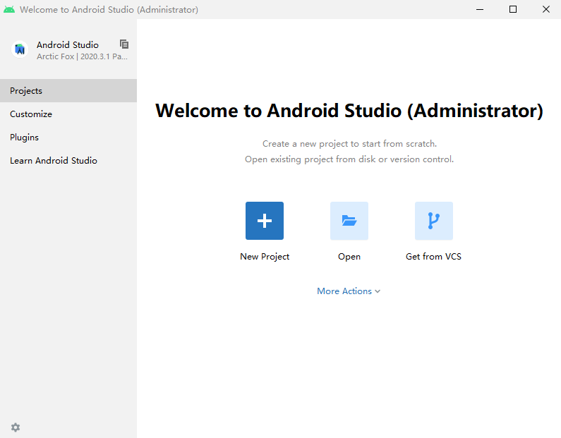

图 1‑16

如果已打开一个项目，则可以从主菜单中依次选择“File \> New \> New Project”以创建新项目。这时系统会显示 “Create
New Project”向导，该向导可选择要创建的项目类型，然后填充代码和资源以帮助着手开发项目，下面将介绍如何使用 “Create New
Project” 向导创建新项目。向导的 “Choose your
project”屏幕顶部显示了各种设备类型对应的项目类别标签页，可以从中选择要创建的项目类型。例如图
1 显示的项目会为所选的手机和平板电脑创建基本的安卓活动。

<table>
<tbody>
<tr class="odd">
<td>
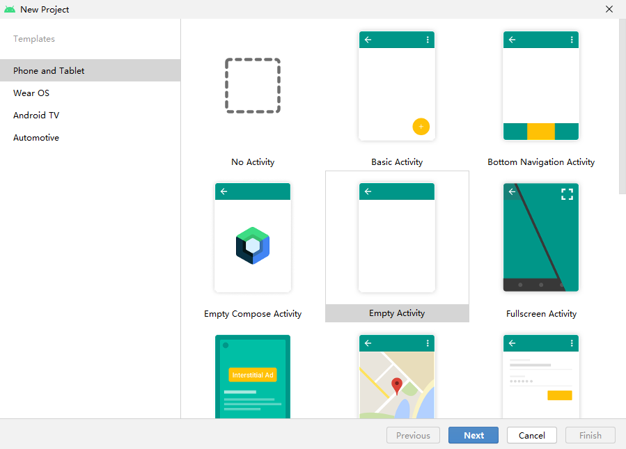

图 1‑17
</td>
<td>
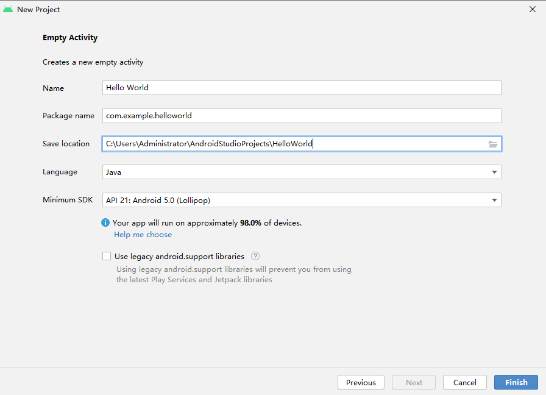

图 1‑18
</td>
</tr>
</tbody>
</table>

下一步就是配置一些设置并创建新项目，具体如下文和图 2 所示。

（1）指定项目名称；

（2）指定软件包名称，默认情况下此软件包名称也会成为应用 ID，此名称以后可以更改；

（3）指定项目的本地保存位置；

（4）选择希望 Android Studio 在为新项目创建示例代码时使用的语言，也可以使用其他语言创建项目；

（5）选择希望应用支持的最低 API 级别，当选择较低的 API 级别时，应用可以使用的最新Android API
会更少，但能够运行应用的安卓设备的比例会更大，当选择较高的
API级别时，情况正好相反；

（6）准备好创建项目后，点击 “Finish”。

Android Studio
会在创建新项目时加入一些基本的代码和资源，以帮助初学者上手。如果稍后决定增加对不同设备类型的支持，可以在项目中添加模块。如果想在模块之间共享代码和资源，可以通过创建安卓库来实现。

点击开发界面左边界的Project标签，打开安卓项目的内容，在左边的窗口可以看到刚才所创建项目的目录结构。展开相应的目录，双击java目录下的MainActivity，和res/layout目录下的activity\_main.xml文件，在右边的窗口可以看到文件的内容，见（图
1‑19）。

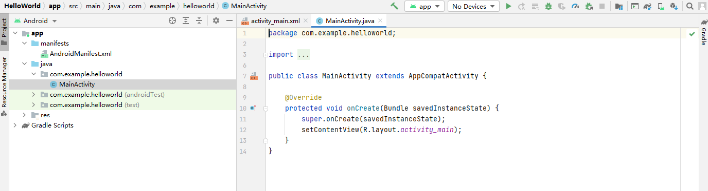

图 1‑19 Android Studio开发界面

### 编写应用

Android Studio
包含每个开发阶段要用到的工具，但最重要的功能是编写应用：编写代码、构建布局、创建图像，并在整个过程中保持高效。使用代码补全功能可以减少输入错误，并且无需查询类、方法和变量名称，因而能够加速应用开发。下面介绍的几项功能可帮助您更高效地编码。

  - 代码补全

使用代码补全功能可以减少输入错误，并且无需查询类、方法和变量名称，因而能够加速应用开发。代码编辑器提供了基本补全、智能补全和语句补全功能。

  - 创建自定义代码补全模板

利用实时模板，您可以输入代码段，以便快速插入和补全小代码块。要插入实时模板，输入模板缩写并按 Tab 键。Android Studio
会将与模板关联的代码段插入您的代码。例如，如果在输入 newInstance 缩写后按 Tab 键，会插入包含参数占位符的新
Fragment 实例的代码。或者，输入 fbc 可插入 findViewById() 方法以及类型转换和资源 ID
语法。如需查看支持的实时模板的列表并对这些模板进行自定义，依次点击 File \>
Settings \> Editor \> Live Templates。

  - 通过 Lint 进行快速修复

Android Studio 提供了一个名为 Lint
的代码扫描工具，可帮助您发现并更正代码结构质量的问题，而无需执行应用或编写测试。每次构建应用时，Android
Studio 都会运行 Lint 来检查您的源文件是否有潜在的错误，以及在正确性、安全性、性能、易用性、无障碍性和国际化方面是否需要优化改进。

  - 查看文档和资源详细信息

将光标放在方法/成员/类名称上并按 F1 键可查看 API 相关文档。也可查看图像和主题背景等其他资源的信息。例如，如果您将光标放在
Android 清单文件中的主题背景名称上并按 F1 键，您可以查看主题背景继承层次结构以及各种属性的颜色或图像。

  - 快速创建新文件

如果您要创建新文件，在“Project”窗口中点击所需的目录，然后按 Alt + Insert 组合键。Android Studio
会显示一个小窗口，其中列出了建议的文件类型，这些文件类型适合选定的目录。

Android Studio 包含以下功能和工具：

  - 创建支持所有屏幕密度的图像

Android Studio 包含一个名为Vector Asset Studio的工具，可帮助创建支持各种屏幕密度的图像。您可以上传自己的
SVG 文件进行修改，也可以从 Google 提供的众多 Material Design 图标中选择一个。开始创建依次点击“File \>
New \> Vector Asset”。

  - 预览图像和颜色

在代码中引用图像和图标时，左侧空白处会显示图像预览，以帮助您验证图像或图标引用。要查看完整尺寸的图像，点击左侧空白处的缩略图。或者，将光标放在资源的内嵌引用上并按
F1 键，以查看图像的详细信息，包括所有替代尺寸。

  - 创建新布局

Android Studio 提供了一个高级布局编辑器，可让将控件拖放到布局中，并在修改 XML
时预览布局。如需创建点击要向其添加布局的模块，然后依次点击
“File \> New \> XML \> Layout XML File”。

  - 翻译界面字符串

Translations Editor
工具提供了一个容纳所有已翻译资源的单一视图，可以从中轻松更改或添加译文，甚至可以查找缺失的译文，而无需打开
strings.xml 文件的每个版本。您甚至可以上传您的字符串文件以订购翻译服务。如需使用右键点击 strings.xml
文件的任意副本，然后点击 “Open Translations Editor”。

Android Studio
提供了众多遵循安卓设计与开发最佳做法的代码模板，可以指导正确打造功能强大且美观的应用，可以使用模板创建新应用模块、各种活动或者其他特定的安卓项目组件。

某些模板为常用环境（例如抽屉式导航栏或登录屏幕）提供了起始代码。当首次创建项目、在现有项目内添加新应用模块或者在应用模块内添加新活动时，可以从这些应用模块和活动模板中进行选择。除了活动以外，使用模板还可以向现有应用添加其他安卓项目组件，这些模板包含代码组件（例如服务和片段）与非代码组件（例如文件夹和
XML 文件），下面将探讨如何向项目中添加像活动一样的安卓项目组件，也将说明 Android Studio
中的常用活动模板，大多数模板都依赖于安卓支持库来包含基于 Material
Design 的界面原则。

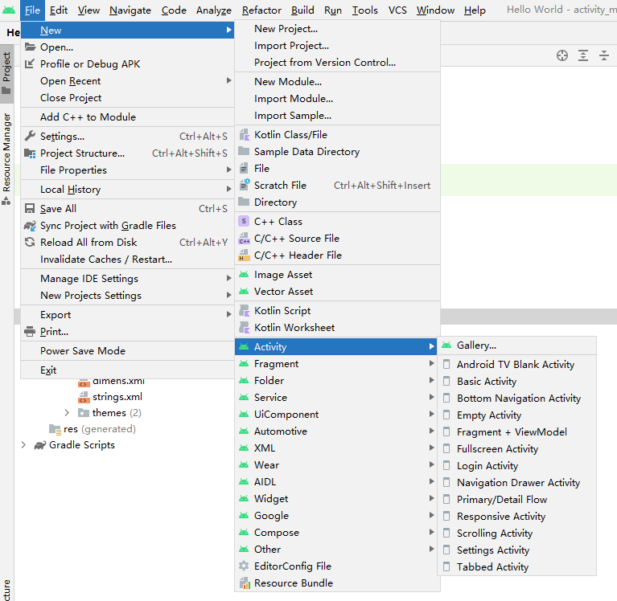

图 1‑20模板菜单

Android Studio 提供的模板越来越多，并且按模板添加的组件类型（例如活动 或 XML 文件）对模板进行分组，如图 1
所示，可通过“File \> New”菜单访问，也可以通过右键点击 Project 窗口来访问。如需使用模板添加
Android
项目组件，使用 Project 窗口。右键点击想要在其中添加新组件的文件夹，然后选择“New”，根据点击的文件夹中可以添加的组件，会看到一个模板类型列表。

在选择想要添加的模板时，对应的向导窗口将出现并要求提供组件的配置信息，例如名称。在输入配置信息后，Android Studio
将为您的新组件创建并打开文件。它还会运行 Gradle 编译操作来同步您的项目。尽管还可以使用
Android Studio
的 “File \> New”菜单来创建新的安卓项目组件，但在 Project 窗口中导航到所需的文件夹可以确保在正确的位置创建组件。

模板的最常见用途之一是向现有应用模块添加新活动，例如要为用户创建登录屏幕，使用“Login
Activity”模板添加一个活动，下面将介绍手机和平板电脑应用的常用活动模板。Android
Studio 还为各种不同的应用模块类型提供了模板，包括穿戴设备、安卓电视和云服务，可以在创建应用模块时查看适用于这些不同模块类型的模板。

以下手机和平板电脑模板提供了适用于特定使用环境的代码组件，例如登录帐号、显示一个带详情的项目列表或滚动显示一大段文本，每个模板都可以用作完整的应用模块或单独的活动。

  - 基本活动

<table>
<tbody>
<tr class="odd">
<td></td>
<td>
此模板可以创建一个带应用栏和浮动操作按钮的简单应用，供了常用的界面组件，以从这个模板入手创建项目，此模板包括：

<ul>
<li>
AppBar
</li>
<li>
FloatingActionButton
</li>
<li>
两个布局文件：一个用于活动，另一个用于分离文本内容
</li>
</ul></td>
</tr>
</tbody>
</table>

  - 底部导航活动

<table>
<tbody>
<tr class="odd">
<td></td>
<td>
此模板提供一个用于活动 的标准底部导航栏，借助此栏用户点按一下便可轻松浏览顶级视图并在这些视图之间切换，当应用有 3-5 个顶级目标时，可以使用此模板，此模板包括：

<ul>
<li>
AppBar
</li>
<li>
一个布局文件，带适用于底部导航的示例布局
</li>
</ul></td>
</tr>
</tbody>
</table>

  - 空活动

<table>
<tbody>
<tr class="odd">
<td></td>
<td>
此模板可以创建一个空活动 和一个带示例文本内容的布局文件，可以使用此模板从头开始构建应用模块或活动，此模板包括：

<ul>
<li>
一个带文本内容的布局文件
</li>
</ul></td>
</tr>
</tbody>
</table>

  - 全屏活动

<table>
<tbody>
<tr class="odd">
<td></td>
<td>
此模板可以创建一个能够在主要全屏视图与带有标准界面 (UI) 控件的视图之间切换的应用。全屏视图是默认视图，用户可以通过触摸设备屏幕激活标准视图，此模板包括：

<ul>
<li>
触摸监听程序实现，用于隐藏标准视图元素
</li>
<li>
按钮，位于标准视图中，但不执行任何操作
</li>
<li>
AppBar，用于标准视图
</li>
<li>
一个布局文件，带全屏视图和一个适用于标准视图元素的框架布局
</li>
</ul></td>
</tr>
</tbody>
</table>

  - 登录活动

<table>
<tbody>
<tr class="odd">
<td></td>
<td>
此模板将创建一个标准登录屏幕。界面包括电子邮件和密码字段以及一个登录按钮，被用作活动 模板的频率要比用作应用模块模板的频率高，此模板包括：

<ul>
<li>
AsyncTask 实现，用于独立于主界面线程处理网络操作
</li>
<li>
网络操作的进度指示器
</li>
<li>
带建议登录界面的单个布局文件：
</li>
<li>
电子邮件和密码输入字段
</li>
<li>
登录按钮
</li>
</ul></td>
</tr>
</tbody>
</table>

  - 主要/详情流，在 4.2 Canary 8 中进行了重命名和更新

<table>
<tbody>
<tr class="odd">
<td></td>
<td>
此模板可以创建拥有项目列表显示画面和单独项目详情显示画面的应用，点击列表屏幕上的项目可以打开一个带项目详情的屏幕，两种显示画面的布局取决于运行应用的设备，此模板还提供了一些 API代码，用于处理某些鼠标和键盘输入，例如对列表项的右键点击操作，以及常见的键盘快捷键，此模板包括：

<ul>
<li>
代表项目列表的 Fragment
</li>
<li>
用于显示单独项目详情的 Fragment
</li>
<li>
FloatingActionButton，显示在每个屏幕上
</li>
<li>
折叠式工具栏，用于项目详情屏幕
</li>
<li>
备用资源布局文件，用于不同的设备配置
</li>
<li>
ContextClickListener，用于处理对列表项的右键点击操作
</li>
<li>
OnUnhandledKeyEventListener，用于检测项目列表 Fragment 中的键盘快捷键
</li>
</ul></td>
</tr>
</tbody>
</table>

  - 抽屉式导航栏活动

<table>
<tbody>
<tr class="odd">
<td></td>
<td>
此模板可以创建一个带抽屉式导航栏菜单的基本活动，导航栏可以从应用的左侧或右侧展开，作为对常规应用栏的补充，此模板包括：

<ul>
<li>
带 DrawerLayout、对应事件处理程序和示例菜单选项的抽屉式导航栏实现
</li>
<li>
AppBar
</li>
<li>
FloatingActionButton
</li>
<li>
用于抽屉式导航栏和抽屉式导航栏标题的布局文件，进一步补充了基本活动 模板中的相关文件
</li>
</ul></td>
</tr>
</tbody>
</table>

  - 滚动活动

<table>
<tbody>
<tr class="odd">
<td></td>
<td>
此模板可以创建一个带折叠式工具栏和长文本内容滚动视图的应用，在页面中向下滚动时，工具栏（可以作为标题）将自动缩短，并且浮动操作按钮将消失，此模板包括：

<ul>
<li>
折叠式工具栏，用于替代常规的 AppBar
</li>
<li>
FloatingActionButton
</li>
<li>
两个布局文件：一个用于活动，另一个用于将文本内容分离到 NestedScrollView 中
</li>
</ul></td>
</tr>
</tbody>
</table>

  - 设置活动

<table>
<tbody>
<tr class="odd">
<td></td>
<td>
此模板可以为应用创建一个显示用户偏好设置或设置的活动，扩展了 PreferenceActivity 类，用作活动 模板的频率要比用作应用模块模板的频率高，此模板包括：

<ul>
<li>
Activity，可以扩展 PreferenceActivity
</li>
<li>
XML 文件（位于项目的 res/xml/ 目录中），用于定义显示的设置
</li>
</ul></td>
</tr>
</tbody>
</table>

  - 标签式活动

<table>
<tbody>
<tr class="odd">
<td></td>
<td>
此模板可以创建一个带多个部分、滑动导航和应用栏的应用，这些部分以 Fragment 形式定义，可以在两个 Fragment 之间左右滑动进行导航，此模板包括：

<ul>
<li>
AppBar
</li>
<li>
适配器，可以扩展 FragmentPagerAdapter 并为每个部分创建一个 Fragment
</li>
<li>
ViewPager 实例，用于在两个部分之间进行滑动的布局管理器
</li>
<li>
两个布局文件：一个用于活动，另一个用于各个 Fragment
</li>
</ul></td>
</tr>
</tbody>
</table>

### 编辑布局

在布局编辑器中，您可以通过将界面元素拖动到可视化设计编辑器中（而不是手动编写布局
XML），快速构建布局。设计编辑器支持在不同的安卓设备和版本上预览布局，并且可以动态调整布局大小，以确保它能够很好地适应不同的屏幕尺寸。使用
ConstraintLayout
构建布局时，布局编辑器的功能尤其强大。在此阶段示例HelloWorld应用程序的用户界面，基于res/layout目录中activity\_main.xml文件非常简单的布局，先修改自动生成的用户界面，看看应用程序布局是如何呈现的，而无需在任何物理或虚拟设备上运行它。

#### 打开界面设计器

（1）在安卓项目视图中，在app/res/layout中双击该activity\_main.xml文件以将其打开，由于Android
Studio载渲染布局文件所需的组件，因此打开可能需要几秒钟的时间。默认情况下，Android
Studio提供布局文件的图形视图，也可以切换到源代码视图，或同时排查看文本和图形表示，使用界面设计器右上角的图标窗格。

图 1‑21

此窗格显示与布局定义和组件树同步的矩形画布，因此对画布的任何更改都会相应地反映在那里。通常，布局文件有一个布局管理器作为根元素，例如LinearLayout、FrameLayout、ConstraintLayout等。在例子中，在activity\_main.xml中的根元素是ConstraintLayout，负责定位应用程序界面的元素。本实例通过简单的修改和操作，可以从使用
ConstraintLayout 构建响应式界面中了解有关设计界面的更多信息。

（2）要消除干扰并仅查看布局是如何表示的，单击左上角的“Select Design Surface”图标并选择“Design”：

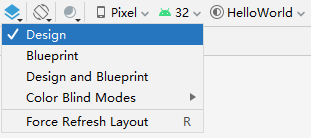

图 1‑22

（3）现在删除现有的文本元素，为此右键单击文本标签并从上下文菜单中选择删除。

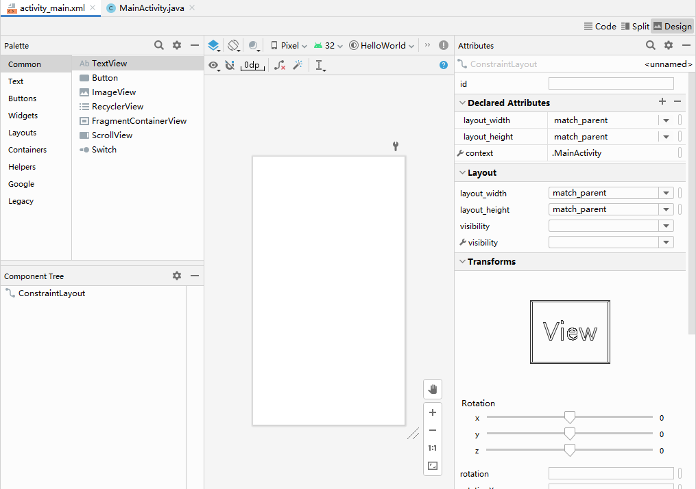

图 1‑23

#### 添加图像到界面布局

（1）这步是在布局中添加一个机器人图像。在安卓项目视图中，展开“app/res”文件夹并将要使用的图像拖到drawable文件夹中。可以下载了一张“Hello
Droid”图像，并将其保存为 50x50 像素的尺寸。

（2）返回到activity\_main.xml在Designer窗格中打开的文件，从Palette
中选择ImageView元素，然后将其拖到画布上希望图像出现的位置。

（3）在打开的Pick a Resource对话框中，选择添加的资源文件，然后单击OK：

图 1‑24

（4）接下来，需要修改imageView元素的默认 id以便以后能够引用。在Component Tree
中选择它，然后在右侧的Attributes窗格中，在id字段中输入新标识符：“helloImage”，按Enter；在打开的对话框中，确认要更新对图像元素
ID 的所有引用：

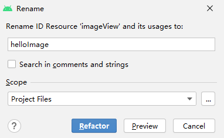

图 1‑25

#### 将文本添加到界面布局

现在让我们在布局中添加一些文本。

（1）在Palette窗格中，选择TextView元素并将其拖到图像下方的画布上。小部件显示一些默认文本：TextView。要更改它并将其链接到字符串，需要创建一个新的文本资源。

（2）在左侧的组件树中选择textView元素，在右侧的Attributes窗格中，单击文本属性旁边的“Pick a Resource”图标：

<table>
<tbody>
<tr class="odd">
<td>
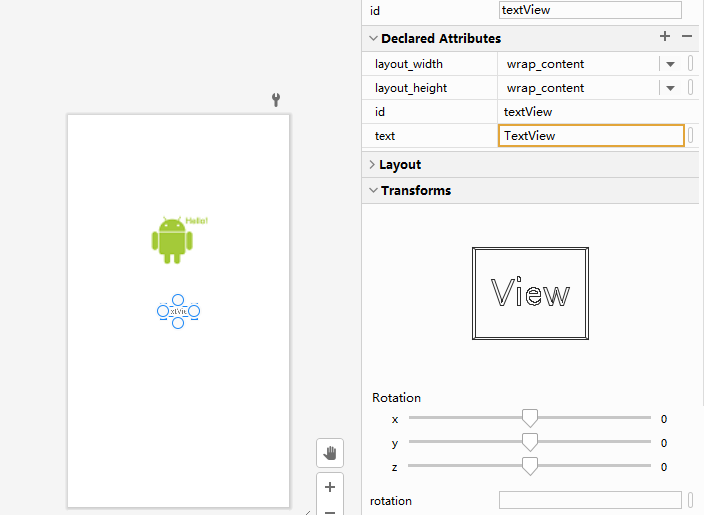

图 1‑26
</td>
<td>
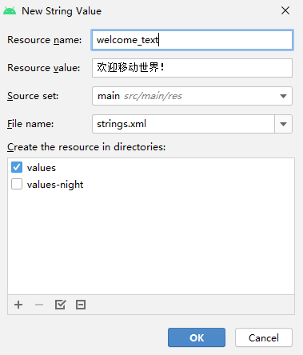

图 1‑27
</td>
</tr>
</tbody>
</table>

（3）在打开的对话框中，单击左上角的“Add resource to the module”图标添加按钮，然后选择“String Value”。

（4）在“New String Value”对话框中，输入资源名称 (welcome\_text) 和资源值 (欢迎移动世界！)：

（5）单击“OK”保存值，然后在“选择资源”对话框中单击“OK” 。

（6）现在以相同的方式修改元素 textView。在左侧的“Component Tree”
中选择textView，然后在Attributes窗格中将id设置为新值：clickCounter。

#### 为文本添加样式

现在让我们为文本添加一些样式，使其看起来更吸引人。

（1）稍微填充文本：找到填充属性，并将所有值设置为10dp：

<table>
<tbody>
<tr class="odd">
<td>
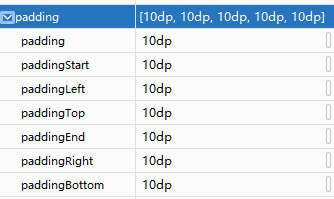

图 1‑28
</td>
<td>
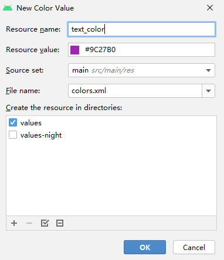

图 1‑29
</td>
</tr>
</tbody>
</table>

（2）更改字体颜色：找到textColor属性，然后单击旁边的“Pick a Resource”图标。在打开的对话框中，单击左上角的“Add
resource to the module”图标，然后选择“Color Value”。输入资源名称 ( text\_color) 和值
( \#9C27B0)：

（3）更改字体大小：找到TextSize属性并单击它旁边的“Pick a Resource”图标。在打开的对话框中，单击左上角的“Add
resource to the module”图标，然后选择“Dimension Value”，输入资源名称 ( text\_size) 和值
( 24sp)：

<table>
<tbody>
<tr class="odd">
<td>
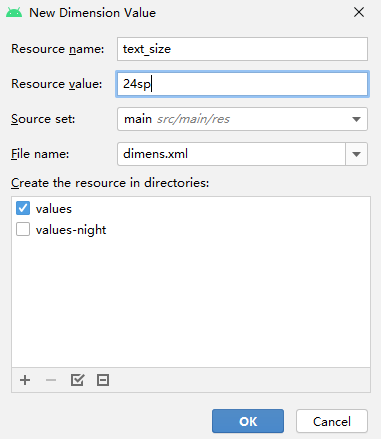

图 1‑30
</td>
<td>
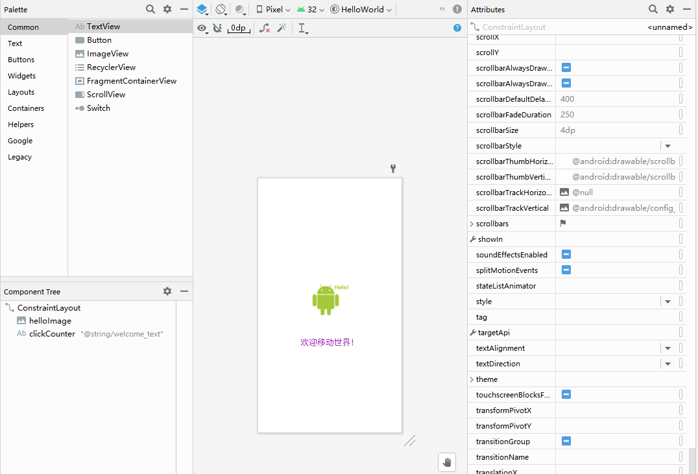

图 1‑31
</td>
</tr>
</tbody>
</table>

因此用户界面现在如下所示：

要检查应用程序界面在横向时的外观，单击Designer工具栏上的“Orientation for Preview”图标并选择Landscape：

<table>
<tbody>
<tr class="odd">
<td>
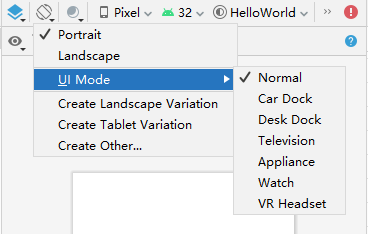

图 1‑32
</td>
<td>

图 1‑33
</td>
</tr>
</tbody>
</table>

要预览的布局在不同设备上的外观，从设备列表中选择另一个设备：

#### 使应用程序具有交互性

尽管此时示例应用程序功能齐全，但还不支持任何形式的交互，修改它以支持点击事件。

（1）在安卓项目视图中，找到“app\\java\\com.example.helloworld”下的MainActivity文件并双击打开它。

（2）MainActivity不是一个很有意义的类名，所以重命名。在Android项目视图中右键单击此文件并从上下文菜单选择“Refactor
| Rename”重命名或按Shift+F6。在打开的对话框中，更改类名HelloDroidActivity并单击Refactor：

图 1‑34

对此类的所有引用都将自动更新，应用程序的源代码将如下所示：

图 1‑35

（3）将HelloDroidActivity.java 中的代码替换为以下内容：

> package com.example. helloworld;
> 
> import android.os.Bundle;
> 
> import android.view.View;
> 
> import android.widget.ImageView;
> 
> import android.widget.TextView;
> 
> import androidx.appcompat.app.AppCompatActivity;
> 
> public class HelloDroidActivity extends AppCompatActivity {
> 
> private TextView message;
> 
> private int counter = 0;
> 
> @Override
> 
> protected void onCreate(Bundle savedInstanceState) {
> 
> super.onCreate(savedInstanceState);
> 
> setContentView(R.layout.activity\_main);
> 
> message = findViewById(R.id.clickCounter);
> 
> ImageView droid = findViewById(R.id.helloImage);
> 
> //Define and attach click listener
> 
> droid.setOnClickListener(new View.OnClickListener() {
> 
> @Override
> 
> public void onClick(View v) {
> 
> tapDroid();
> 
> }
> 
> });
> 
> }
> 
> private void tapDroid() {
> 
> counter++;
> 
> String countAsText;
> 
> /\*
> 
> \* In real applications you should not write switch like the one
> below.
> 
> \* Use resource of type "Quantity strings (plurals)" instead.
> 
> \* See
> https://developer.android.com/guide/topics/resources/string-resource\#Plurals
> 
> \*/
> 
> switch (counter) {
> 
> case 1:
> 
> countAsText = "1次";
> 
> break;
> 
> case 2:
> 
> countAsText = "2次";
> 
> break;
> 
> default:
> 
> countAsText = String.format("%d 次", counter);
> 
> }
> 
> message.setText(String.format("您点击 %s", countAsText));
> 
> }
> 
> }

码 1‑6

注意，在源代码中使用的标识符对应于布局定义文件中设置的标识符，否则代码将无法工作。

### 编译运行

现在编译应用程序并在虚拟设备上运行。安卓模拟器可在计算机上模拟安卓设备，这样就可以在各种设备上以及各个安卓API级别测试应用，而无需拥有每个实体设备。模拟器几乎可以提供真正的安卓设备所具备的所有功能，以模拟来电和短信、指定设备的位置、模拟不同的网速、模拟旋转及其他硬件传感器、访问
Google Play
商店，等等。从某些方面来看，在模拟器上测试应用比在实体设备上测试要更快、更容易。例如将数据传输到模拟器的速度比传输到通过USB连接的设备更快。模拟器随附了针对各种安卓手机、平板电脑、穿戴设备和安卓电视设备的预定义配置。可以通过图形界面来手动使用模拟器，也可以通过命令行和模拟器控制台以编程方式使用模拟器。

安卓模拟器除了需要满足 Android Studio 的基本系统要求之外，还需要满足下述其他要求：

  - SDK 工具 26.1.1 或更高版本

  - 64 位处理器

  - Windows：支持 UG（无限制访客）的 CPU

  - HAXM 6.2.1 或更高版本（建议使用 HAXM 7.2.0 或更高版本）

如果要在 Windows 和 Linux 上使用硬件加速，还需要满足以下额外要求：

  - 搭载 Intel 处理器的 Windows 或 Linux 系统：Intel 处理器需要支持 Intel VT-x、Intel
    EM64T (Intel 64) 和 Execute Disable (XD) Bit 功能

  - 搭载 AMD 处理器的 Linux 系统：AMD 处理器需要支持 AMD 虚拟化 (AMD-V) 和 Supplemental
    Streaming SIMD Extensions 3 (SSSE3)

  - 搭载 AMD 处理器的 Windows 系统：需要 Android Studio 3.2 或更高版本以及 2018 年 4 月发布的支持
    Windows Hypervisor Platform (WHPX) 功能的 Windows 10 或更高版本

如需与 Android 8.1（API 级别 27）及更高版本的系统映像配合使用，连接的摄像头必须能够捕捉 720p 的画面。

#### 配置安卓虚拟机

为了能够运行应用程序需要配置一个虚拟设备，步骤如下：

(1)在 Android Studio主工具栏中，单击设备列表并选择AVD Manager：

<table>
<tbody>
<tr class="odd">
<td>
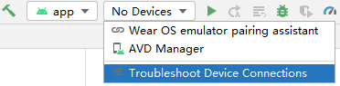

图 1‑36
</td>
<td>

图 1‑37
</td>
</tr>
</tbody>
</table>

(2)在向导的第一步，单击“Create Virtual Device”：

(3)在下一步中，需要选择虚拟设备将模拟的硬件，选择左侧的Phone，然后选择Pixel 2作为目标设备：

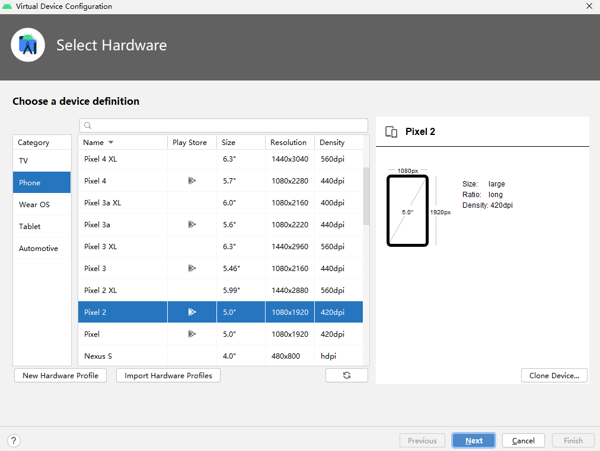

图 1‑38

(4)选择要在虚拟设备上模仿的系统映像，即操作系统版本、Android API 级别、应用程序二进制接口 (ABI) 和目标 SDK 版本：

图 1‑39

(5)单击要在虚拟设备上模拟的系统映像旁边的下载链接。对于本教程选择下载R系统映像。在打开的许可协议对话框中，阅读许可协议并接受它，然后单击下一步并等待下载完成。下载系统映像后，选择它并在向导的系统映像步骤中单击下一步。

(6)在最后一步，您可以修改您的虚拟设备名称并选择屏幕的启动大小和方向。选择纵向布局，然后单击完成：

图 1‑40

(7)新配置的设备出现在“Android Virtual Device Manager”中。

#### 运行应用程序

（1）在Android Studio主工具栏上，确保选择了自动创建的运行配置和刚刚配置的虚拟设备，然后单击。

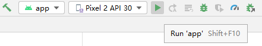

图 1‑41

安卓模拟器将在构建成功完成后启动，并启动我们的应用程序。

<table>
<tbody>
<tr class="odd">
<td>
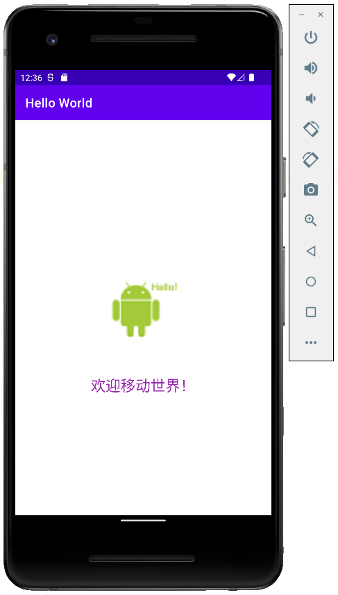

图 1‑42
</td>
<td>

图 1‑43
</td>
</tr>
</tbody>
</table>

（2）单击图像，查看应用程序如何处理点击事件、对它们进行计数并返回相应的消息。

## 构建配置

安卓构建系统会编译应用资源和源代码，然后将它们打包到 APK 或 Android App Bundle
中，供测试、部署、签名和分发。Android Studio 会使用高级构建工具包
Gradle 自动执行和管理构建流程，同时也允许您定义灵活的自定义 build 配置。每个 build
配置均会定义自己的一组代码和资源，并重复利用所有应用版本共用的部分。Android
Plugin for Gradle与该构建工具包搭配使用，提供专用于构建和测试安卓应用的流程和可配置设置。Gradle和安卓插件独立于
Android Studio 运行。这意味着可以在 Android Studio 内、计算机上的命令行或未安装 Android Studio
的计算机（如持续集成服务器）上构建 安卓应用；如果不使用 Android
Studio，可以学习如何从命令行构建和运行应用，无论是从命令行、在远程计算机上还是使用
Android Studio 构建项目，构建的输出都相同。

安卓构建系统非常灵活，可在不修改应用核心源代码文件的情况下执行自定义构建配置，这部分将介绍安坐构建系统的工作原理，以及如何帮助对多个构建配置进行自定义和自动化处理。

### 工具介绍

Gradle是用于多语言软件开发的构建自动化工具，控制从编译和打包到测试、部署和发布的任务中的开发过程。支持的语言包括
Java、Kotlin、Groovy、Scala、C / C++和JavaScript。Gradle
的另一个主要功能是收集有关全球软件库使用情况的统计数据。Gradle
建立在Apache Ant和Apache Maven的概念之上，并引入了一种基于Groovy和Kotlin的领域特定语言，与Maven
使用的基于XML的项目配置形成对比。Gradle 使用有向无环图通过提供依赖管理来确定任务可以运行的顺序。Gradle
在Java虚拟机上运行。Gradle
是为多项目构建而设计的，可以变得很大。基于一系列可以串行或并行运行的构建任务进行操作，通过确定构建树中已经是最新的部分来支持增量构建；任何仅依赖于这些部分的任务都不需要重新执行。它还支持构建组件的缓存，可能使用Gradle
Build Cache跨共享网络，生成名为Gradle Build Scans的基于 Web
的构建可视化。该软件可扩展为具有插件子系统的新功能和编程语言。Gradle在Apache
License 2.0下作为开源软件分发，于 2008 年首次发布。

Gradle 是基于 Groovy
的一种自动化构建工具，是运行在Java虚拟机上的一个程序，Groovy是基于Java虚拟机的一种语言，Gradle
和 Groovy 的关系就像 Android 和 Java 的关系一样。Gradle 构建脚本是使用 Groovy 或
Kotlin编写的。Apache Groovy是一种用于Java
平台的与Java语法兼容的面向对象的编程语言。它既是静态语言又是动态语言，具有类似于Python、Ruby和Smalltalk
的特性。它既可以用作Java 平台的编程语言和脚本语言，也可以编译为Java 虚拟机(JVM)字节码，并与其他 Java
代码和库无缝互操作。Groovy 使用大括号语法类似于 Java 的。Groovy
支持闭包、多行字符串和嵌入在字符串中的表达式。Groovy
的大部分功能在于其通过注释触发的AST转换。Groovy 1.0 于
2007 年 1 月 2 日发布，Groovy 2.0 于 2012 年 7 月发布。从版本 2 开始，Groovy 可以静态编译，提供接近
Java 的类型推断和性能。Groovy 2.4 是Pivotal Software赞助的最后一个主要版本，于 2015 年 3
月结束。\[5\] Groovy 此后将其治理结构更改为 Apache 软件基金会的项目管理委员会。

安卓应用程序采用Java语言作为开发语言，通过Android
SDK工具编译代码后，与应用文件所使用的资源文件和数据等部分一起，生成安卓包文件，即.apk文件。当用户下载安装一个安卓应用安装包时，文件就是APK文件。安卓应用开发过程中，把应用程序逻辑和用户界面设计完全分隔开，可以分别进行独立的设计和开发。应用程序逻辑使用Java代码实现；而用户界面设计可以使用图形工具或XML文件，定义图形界面的组件和具体布局。理论上，在这种模式下应用程序的逻辑改变，不会影响用户界面的设计，不需要修改；用户界面设计的布局调整，也不需要修改相应的Java代码。虽然实际开发中不能完全实现二者隔离，但大大减少了代码的修改工作量。

2019年5月7日，谷歌宣布Kotlin编程语言成为安卓应用程序开发人员的首选语言。自2017年10月发布Android Studio 3.0
以来，Kotlin已被纳入标准 Java 编译器的替代方案。Kotlin是一种跨平台、静态类型的通用编程语言，具有类型推断功能。Kotlin
旨在与Java完全互操作，并且Kotlin标准库的JVM版本依赖于Java类库，但类型推断允许其语法更加简洁。Kotlin主要针对JVM，但也编译为
JavaScript，例如用于使用 React 的前端 Web 应用程序或通过LLVM的本机代码；对于与安卓应用程序共享业务逻辑的原生 iOS
应用程序。但是为了便于安卓主要功能的讲解，本教程还是以Java语言作为代码示例。

### 构建流程

构建流程涉及许多将项目转换成 Android 应用软件包 (APK) 或 Android App Bundle (AAB)
的工具和流程。构建流程非常灵活，因此了解它的一些底层工作原理会很有帮助。

> 

图 1‑44典型安卓应用模块的构建流程。

典型 Android 应用模块的构建流程按照以下常规步骤执行（图 1‑44）：

（1）编译器将源代码转换成 DEX 文件（Dalvik 可执行文件，其中包括在安卓设备上运行的字节码），并将其他所有内容转换成编译后的资源。

（2）打包器将 DEX 文件和编译后的资源组合成 APK 或 AAB（具体取决于所选的 构建目标）。必须先为 APK 或 AAB
签名，然后才能将应用安装到安卓设备或分发到 应用商店。

（3）打包器使用调试或发布密钥库为 APK 或 AAB
签名，如果构建的是调试版应用（即专门用来测试和分析的应用），则打包器会使用调试密钥库为应用签名。Android
Studio 会自动使用调试密钥库配置新项目；如果构建的是打算对外发布的发布版应用，则打包器会使用发布密钥库（需要进行配置）为应用签名。

（4）在生成最终 APK 之前，打包器会使用 zipalign 工具对应用进行优化，以减少其在设备上运行时所占用的内存。

构建流程结束时，您将获得应用的调试版或发布版 APK/AAB，以用于部署、测试或向外部用户发布。

### 构建配置

Gradle 和 Android 插件可帮助完成以下面的构建配置：

  - 构建类型

构建类型定义 Gradle
在构建和打包应用时使用的某些属性，通常针对开发生命周期的不同阶段进行配置。例如，调试构建类型支持调试选项，并会使用调试密钥为应用签名；而发布构建类型则会缩减应用、对应用进行混淆处理，并使用发布密钥为应用签名以进行分发。如需构建应用，必须至少定义一个构建类型。Android
Studio 默认会创建调试 构建类型和发布构建类型。

  - 产品变种

产品变种代表可以向用户发布的不同应用版本，如免费版应用和付费版应用。可以自定义产品变种以使用不同的代码和资源，同时共享并重用所有应用版本共用的部分。产品变种是可选的，必须手动创建。

  - 构建变体

构建变体是构建类型与产品变种的交叉产物，也是 Gradle
用来构建应用的配置。利用构建变体，可以在开发期间构建产品变种的调试版本，或者构建产品变种的已签名发布版本以供分发。虽然无法直接配置构建变体，但可以配置组成它们的构建类型和产品变种。创建额外的构建类型或产品变种也会创建额外的构建变体。

  - 清单条目

可以在构建变体配置中为清单文件中的某些属性指定值。这些构建值会替换清单文件中的现有值。如果要为应用生成多个变体，让每一个变体都具有不同的应用名称、最低
SDK 版本或目标 SDK 版本，便可运用这一技巧。当存在多个清单时，Gradle 会合并清单设置。

  - 依赖项

构建系统会管理来自本地文件系统以及来自远程代码库的项目依赖项。这样一来就不必手动搜索、下载依赖项的二进制文件包以及将它们复制到项目目录中。

  - 签名

构建系统既允许在 build
配置中指定签名设置，也可以在构建流程中自动为应用签名。构建系统通过已知凭据使用默认密钥和证书为调试版本签名，以避免在构建时提示输入密码。除非为此构建明确定义签名配置，否则，构建系统不会为发布版本签名。如果您没有发布密钥，可以按为应用签名中所述生成一个。

  - 代码和资源缩减

构建系统允许您为每个构建变体指定不同的 ProGuard 规则文件。在构建应用时，构建系统会应用一组适当的规则以使用其内置的缩减工具（如
R8）缩减代码和资源。

  - 多 APK 支持

通过构建系统可以自动构建不同的 APK，并让每个 APK 只包含特定屏幕密度或应用二进制接口 (ABI)
所需的代码和资源。如需了解详情，参阅[构建多个
APK](https://developer.android.com/studio/build/configure-apk-splits)。注意，我们建议的方法是发布单个
AAB，因为它除了让您可以按屏幕密度和 ABI 进行拆分以外，还可以让您按语言进行拆分，同时还可以降低因必须上传多个工件到 Google
Play
所造成的复杂性。创建自定义构建配置需要对一个或多个配置文件（即 build.gradle 文件）做出更改。这些纯文本文件使用领域特定语言（Domain
Specific Language、DSL）以 [Groovy](http://groovy-lang.org/) 描述和操纵构建逻辑，其中
Groovy 是一种适用于 Java 虚拟机 (JVM) 的动态语言。无需了解 Groovy 便可开始配置构建，因为“Android
Plugin for Gradle”引入了需要的大多数 DSL 元素。开始新项目时，Android Studio会自动创建其中的部分文件，如图
1‑45所示，并为其填充合理的默认值。

> 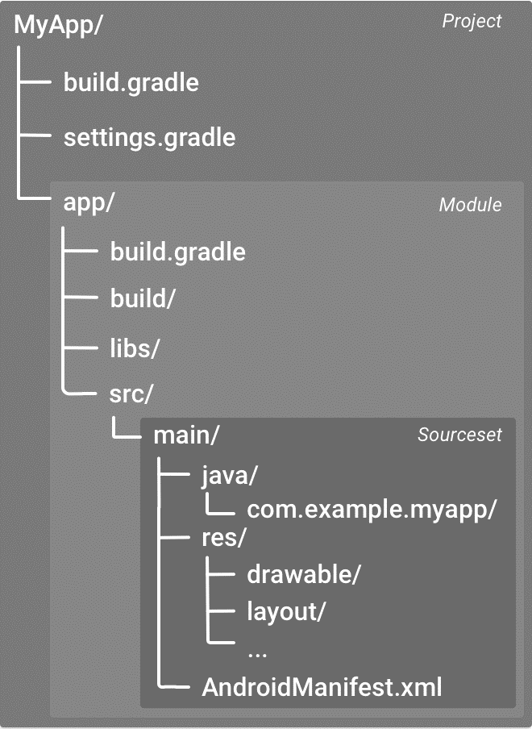

图 1‑45 安卓应用模块的默认项目结构。

有一些 Gradle 构建配置文件是安卓应用的标准项目结构的组成部分，必须了解其中每个文件的范围和用途及其应定义的基础 DSL
元素，才能着手配置构建。settings.gradle 文件位于项目的根目录下，用于指示 Gradle
在构建应用时应将哪些模块包含在内，对大多数项目而言该文件很简单只包含以下内容：

> dependencyResolutionManagement {
> 
> repositoriesMode.set(RepositoriesMode.FAIL\_ON\_PROJECT\_REPOS)
> 
> repositories {
> 
> google()
> 
> mavenCentral()
> 
> jcenter() // Warning: this repository is going to shut down soon
> 
> }
> 
> }
> 
> rootProject.name = "Hello World"
> 
> include ':app'

码 1‑7

多模块项目需要指定应包含在最终构建的每个模块。

顶层 build.gradle 文件位于项目的根目录下，用于定义适用于项目中所有模块的构建配置。默认情况下，顶层构建文件使用 buildscript 代码块定义项目中所有模块共用的
Gradle 代码库和依赖项，以下代码示例说明了创建新项目后可在顶层 build.gradle 文件中找到的默认设置和领域特定语言元素。

> // Top-level build file where you can add configuration options common
> to all sub-projects/modules.
> 
> buildscript {
> 
> repositories {
> 
> google()
> 
> mavenCentral()
> 
> }
> 
> dependencies {
> 
> classpath "com.android.tools.build:gradle:7.0.4"
> 
> // NOTE: Do not place your application dependencies here; they belong
> 
> // in the individual module build.gradle files
> 
> }
> 
> }
> 
> task clean(type: Delete) {
> 
> delete rootProject.buildDir
> 
> }

码 1‑8

“buildscript”块是为 Gradle 本身配置存储库和依赖项的地方，不应该在此处包含模块的依赖项，例如此块包含 Gradle
的安卓插件作为依赖项，因为它提供了 Gradle 构建 安卓应用程序模块所需的额外指令。“repositories”块配置
Gradle 用于搜索或下载依赖项的存储库。Gradle 预先配置了对远程存储库（例如Maven Central 和
Ivy）的支持，还可以使用本地存储库或定义自己的远程存储库。上面的代码将Maven
Central定义为 Gradle 用于查找其依赖项的存储库。

对于包含多个模块的安卓项目，可能有必要在项目级别定义某些属性并在所有模块之间共享这些属性。为此可以将额外的属性添加到顶层 build.gradle 文件内的 ext 代码块中。

> buildscript {...}
> 
> allprojects {...}
> 
> // This block encapsulates custom properties and makes them available
> to all
> 
> // modules in the project.
> 
> ext {
> 
> // The following are only a few examples of the types of properties
> you can define.
> 
> sdkVersion = 28
> 
> // You can also create properties to specify versions for
> dependencies.
> 
> // Having consistent versions between modules can avoid conflicts with
> behavior.
> 
> supportLibVersion = "28.0.0"
> 
> ...
> 
> }
> 
> ...

码 1‑9

模块级 build.gradle 文件位于每个 project/module/ 目录下，用于为其所在的特定模块配置构建设置。可以通过配置这些构建设置提供自定义打包选项，以及替换 main/ 应用清单或顶层 build.gradle 文件中的设置。以下安卓应用模块 build.gradle 文件示例简要说明了应该了解的一些基础
DSL 元素和设置。

> plugins {
> 
> id 'com.android.application'
> 
> }
> 
> android {
> 
> compileSdk 35
> 
> defaultConfig {
> 
> applicationId "com.example.helloworld"
> 
> minSdk 21
> 
> targetSdk 35
> 
> versionCode 1
> 
> versionName "1.0"
> 
> testInstrumentationRunner "androidx.test.runner.AndroidJUnitRunner"
> 
> }
> 
> buildTypes {
> 
> release {
> 
> minifyEnabled false
> 
> proguardFiles getDefaultProguardFile('proguard-android-optimize.txt'),
> 'proguard-rules.pro'
> 
> }
> 
> }
> 
> compileOptions {
> 
> sourceCompatibility JavaVersion.VERSION\_17
> 
> targetCompatibility JavaVersion.VERSION\_17
> 
> }
> 
> }
> 
> dependencies {
> 
> implementation 'androidx.appcompat:appcompat:1.7.0'
> 
> implementation 'com.google.android.material:material:1.12.0'
> 
> implementation 'androidx.constraintlayout:constraintlayout:2.2.0'
> 
> testImplementation 'junit:junit:4.+'
> 
> androidTestImplementation 'androidx.test.ext:junit:1.2.1'
> 
> androidTestImplementation 'androidx.test.espresso:espresso-core:3.6.1'
> 
> }

码 1‑10

Gradle 还包含两个属性文件，它们位于项目的根目录下，可用于指定 Gradle 构建工具包本身的设置：

  - gradle.properties

可以在其中配置项目全局 Gradle 设置，如 Gradle 守护程序的最大堆大小。

  - local.properties

为构建系统配置本地环境属性。

## 小结

本章首先简单介绍了安卓的基本概念和安卓系统的技术框架；详细介绍了安卓开发环境Android
Studio在不同操作系统中安装和配置的具体步骤；使用一个简单安卓应用说明了在Android
Studio中的开发和运行过程，以及在AVD上运行时配置的过程；在最后一节，介绍了安卓应用的构建配置。
