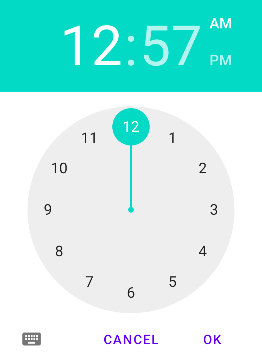

# 外观与感觉

## 事件处理

由于安卓应用使用Java程序编写，在应用程序运行中，用户对移动终端键盘、屏幕和位置的操作都转化成事件对象，安卓系统通过对这些事件的捕获后，执行相应的处理代码，实现与用户的交互完成预定的功能。这个过程是安卓的事件处理。安卓的事件处理机制有两种，基于监听接口和基于回调机制，这两种机制的原理和实现方法都有所不同。安卓的基于监听接口的事件处理机制，完全采用了Java的事件处理机制。

### 基于监听接口

图 3‑1事件流程处理

安卓的事件处理机制是一种委派式事件处理方式：
普通组件作为事件源将整个事件处理委托给特定的对象，其为事件监听器：当该事件源发生指定的事件时，就通知所委托的事件监听器，由事件监听器来处理这个事件。每个组件均可以针对特定的事件指定一个事件监听器，每个事件监听器也可监听一个或多个事件源，因为同一个事件源上可能发生多种事件，委派式事件处理方式可以把事件源上所有可能发生的事件分别授权给不同的事件监听器来处理：同时也可以让一类事件都使用同一个事件监听器来处理。在事件处理的过程中主要涉及三个主要部分：事件源、事件和监听器。

  - 事件源（Source）：

事件源，是指触摸屏、键盘或位置传感器操作针对的控件或容器。事件发生时，也就是出现某个控件被触摸操作、或移动终端位置移动，这个控件也就是事件源类负责发送事件发生的通知，并通过事件源查找自己的事件监听者队列，并将事件信息通知队列中的监听者来完成，同时事件源还在得到有关监听者信息时负责维护自己的监听者队列。

  - 事件（Event）：

事件是指对组件或容器的触摸屏、键盘或位置的一个操作用类描述，例如键盘事件类描述键盘事件的所有信息：键按下、释放、双击、组合键以及键码等相关键的信息。

  - 监听器(Listener）：

安卓的事件处理由事件监听器类和事件监听器接口来实现。事件发生后，事件源将相关的信息通知对应的监听器，事件源和监听者之间通过监听者接口完成这类的信息交换。事件监听者类就是事件监听者接口的具体实现，事件发生后该主体负责进行相关的事件处理，同时还负责通知相关的事件源，自己关注它的特定的事件，以便事件源在事件发生时能够通知该主体。

外部的操作，例如按下按键、触摸屏幕点击按钮或转动移动终端等动作，会触发事件源上的事件，对于点击按钮的操作来说事件源就是按钮，会根据这个操作生成一个按钮按下的事件对象，这对于系统来说就产生了一个事件。事件的产生会触发事件监听器，事件本身作为参数传入到事件处理器中。事件监听器是在通过代码在程序初始化时注册到事件源的，也就是说在按钮上设置一个可以监听按钮操作的监听器，并且通过这个监听器调用事件处理器，事件处理器针对这个事件所编写的代码，例如弹出一条信息，下面示例讲解简单的事件处理模型：

> \<?xml version="1.0" encoding="utf-8"?\>
> 
> \<LinearLayout
> xmlns:android="http://schemas.android.com/apk/res/android"
> 
> android:layout\_width="match\_parent"
> 
> android:layout\_height="match\_parent"
> 
> android:gravity="center\_horizontal"
> 
> android:orientation="vertical"\>
> 
> \<EditText
> 
> android:id="@+id/txt"
> 
> android:layout\_width="match\_parent"
> 
> android:layout\_height="wrap\_content"
> 
> android:cursorVisible="false"
> 
> android:textSize="12pt" /\>
> 
> \<Button
> 
> android:id="@+id/bn"
> 
> android:layout\_width="wrap\_content"
> 
> android:layout\_height="wrap\_content"
> 
> android:text="单击" /\>
> 
> \</LinearLayout\>

码 3‑1

上面的程序定义的按钮将作为事件源，接下来程序将会为该按钮绑定一个事件监听，监听器类必须由开发者来实现

> import androidx.appcompat.app.AppCompatActivity;
> 
> import android.os.Bundle;
> 
> import android.view.View;
> 
> import android.widget.Button;
> 
> import android.widget.EditText;
> 
> public class MainActivity extends AppCompatActivity {
> 
> @Override
> 
> protected void onCreate(Bundle savedInstanceState) {
> 
> super.onCreate(savedInstanceState);
> 
> setContentView(R.layout.activity\_main);
> 
> Button bn = (Button) findViewById(R.id.bn);
> 
> bn.setOnClickListener(new MyClickListener());
> 
> }
> 
> class MyClickListener implements View.OnClickListener {
> 
> @Override
> 
> public void onClick(View v) {
> 
> EditText txt = (EditText) findViewById(R.id.txt);
> 
> txt.setText("按钮被单击");
> 
> }
> 
> }
> 
> }

码 3‑2

上面程序中的粗体字代码定义了一个View.OnClickListener实现类，这个实现类将会作为事件监听器使用。程序为按钮注册事件监听器，当按钮被单击时该处理器被触发。从上面的程序可以看出，基于监听器的事件处理模型的编程步骤如下：

(1)获取普通界面组件（事件源），也就是被监听的对象。

(2)实现事件监听器类，该监听器类是一个特殊的类，必须实现XxxListener接口。

(3)调用事件源的setXxxListener 方法将事件监听器对象注册给普通组件（事件源）。

当事件源上发生指定事件时安卓会触发事件监听器，由事件监听器调用相应的方法（事件处理器）来处理事件。将码 3‑2与图
3‑1结合起来看，事件源就是程序中的按钮，其实开发者不需要太多的额外处理，应用程序中任何组件都可作为事件源；事件监听器是程序中的MyClickListener类，监听器类必须由程序员负责实现，实现监听器类的关键就是实现处理器方法；注册监听器是就是调用事件源的setXxxListener(XxxListener）方法即可。所谓事件监听器，其实就是实现了特定接口类的实例，在程序中实现事件监听器，通常有几种形式：

  - 内部类形式

将事件监听器类定义成当前类的内部类。

  - 外部类形式

将事件监听器类定义成一个外部类。

  - 活动本身作为事件监听器类

让活动本身实现监听器接口，并实现事件处理方法。

  - 匿名内部类形式

使用匿名内部类创建事件监听器对象，是目前使用最广泛的事件监听器形式。

  - 直接绑定到布局标签

直接在界面布局文件中为指定标签绑定事件处理方法。

对于很多安卓界面组件标签而言，都支持onClick属性，该属性的属性值就是一个方法名，定义了点击控件要执行的操作，示例如下：

> \<?xml version="1.0" encoding="utf-8"?\>
> 
> \<LinearLayout
> xmlns:android="http://schemas.android.com/apk/res/android"
> 
> xmlns:tools="http://schemas.android.com/tools"
> 
> android:layout\_width="match\_parent"
> 
> android:layout\_height="match\_parent"
> 
> android:gravity="center\_horizontal"
> 
> android:orientation="vertical"\>
> 
> \<EditText
> 
> android:id="@+id/txt"
> 
> android:layout\_width="match\_parent"
> 
> android:layout\_height="wrap\_content"
> 
> android:cursorVisible="false"
> 
> android:textSize="12pt"/\>
> 
> \<Button
> 
> android:id="@+id/bn"
> 
> android:layout\_width="wrap\_content"
> 
> android:layout\_height="wrap\_content"
> 
> android:text="单击"
> 
> android:onClick="clickHandler"/\>
> 
> \</LinearLayout\>

码 3‑3

码
3‑3在界面布局文件中为按钮绑定一个事件处理方法clickHanlder()，这就意味着开发者需要在该界面布局对应的活动中定义一个clickHandler()方法，该方法将会负责处理该按钮上的单击事件，对应的Java
代码如下：

> import androidx.appcompat.app.AppCompatActivity;
> 
> import android.os.Bundle;
> 
> import android.view.View;
> 
> import android.widget.EditText;
> 
> public class MainActivity extends AppCompatActivity {
> 
> @Override
> 
> protected void onCreate(Bundle savedInstanceState) {
> 
> super.onCreate(savedInstanceState);
> 
> setContentView(R.layout.activity\_main);
> 
> }
> 
> public void clickHandler(View source) {
> 
> EditText show = (EditText) findViewById(R.id.txt);
> 
> show.setText("按钮被单击");
> 
> }
> 
> }

码 3‑4

在安卓的开发中，对于点击事件的OnClickListener有下面三种实现方式，可以根据实际场景的需要选择合适的用法，下面以按钮来举例说明。

  - 方法一：使用匿名类定义

> Button bt\_Demo = (Button)findViewById(R.id.bt\_Demo);
> 
> bt\_Demo.setOnClickListener(new OnClickListener() {
> 
> @Override
> 
> public void onClick(View v) {
> 
> //具体点击操作的逻辑
> 
> }
> 
> });

码 3‑5

  - 方法二：使用外部类定义

> Button bt\_Demo = (Button)findViewById(R.id.bt\_Demo);
> 
> bt\_Demo.setOnClickListener(new ButtonListener());
> 
> private class ButtonListener implements OnClickListener{
> 
> @Override
> 
> public void onClick(View arg0) {
> 
> // TODO Auto-generated method stub
> 
> switch(arg0.getId()){
> 
> case R.id.btn\_Demo:
> 
> //具体点击操作的逻辑
> 
> break;
> 
> default:
> 
> break;
> 
> }
> 
> }
> 
> }

码 3‑6

  - 方法三：在活动中实现OnClickListener接口

> public class MyActivity extends Activity implements OnClickListener {
> 
> @Override
> 
> public void onCreate(Bundle savedInstanceState) {
> 
> super.onCreate(savedInstanceState);
> 
> setContentView(R.layout.main);
> 
> //按纽
> 
> Button btn\_Demo = (Button)findViewById(R.id.bt\_Demo);
> 
> bt\_Demo.setOnClickListener(this);
> 
> ｝
> 
> @Override
> 
> public void onClick(View v) {
> 
> switch(v.getId()){
> 
> case R.id.btn\_Demo:
> 
> //具体点击操作的逻辑
> 
> break;
> 
> default:
> 
> break;
> 
> }
> 
> }
> 
> ｝

码 3‑7

### 基于回调机制

安卓的另一种事件处理机制是回调机制。通常情况下，程序员写程序时需要使用系统工具类提供的方法来完成某种功能，但是某种情况下系统会反过来调用一些类的方法，例如对于用作组件或插件的类则需要编写一些供系统调用的方法，这些专门用于被系统调用的方法被称之为回调方法，也就是回过来系统调用的方法。

安卓平台中，每个视图都有自己的处理事件的回调方法，开发人员可以通过重写视图中的这些回调方法来实现需要的响应事件。当某个事件没有被任何一个视图处理时，便会调用活动中相应的回调方法。例如，有一个按钮按下的事件发生了，但编码过程中这个按钮并没有对这个事件做任何处理，所在的活动中的任何组件也并没有对这个事件做任何处理，这时系统会调用活动相应的回调方法onKeyDown()。

回调机制实质就是将事件的处理绑定在组件上，由界面组件自己处理事件，回调机制需要自定义视图来实现，自定义视图重写事件处理方法就可以了，例如活动和片段的生命周期中的各种状态发生变化时，调用的onResume等方法也是回调方法。

## 按钮控件

安卓提供的按钮控件有很多种，包括基本的Button、ImageButton、ToggleButton、CheckBox和RadioButton都是按钮的类型。Button类控件继承自TextView，因此也具有TextView的宽和高设置，文字显示等一些基本属性。Button类控件在应用程序中的定义，与其他图形控件一样，一般都在布局文件中进行定义、设置和布局设计。setText()和getText()是Button类控件最常用的方法，用于设置和获取Button显示的文本。

Button类控件一般会与单击事件联系在一起。对于基本的Button，可以采用两种方式处理单击事件。一种使用Button的setOnClickListener()方法为其设置OnClickListener，把具体的事件处理代码写在onClick(View
v)
方法中；另一种在XML布局文件中，使用android:OnClick属性为Button指定单击事件发生时执行的方法。如果在XML布局文件中，使用android:OnClick属性指定了点击事件的回调方法，这个方法在Java应用程序中必须是public的，而且只有一个View类型的参数。

在按钮类控件的使用过程中，属性设置和事件处理稍有不同，下面具体说明各按钮类控件如何对事件进行处理。在具体调试运行过程中，创建资源文件和活动的具体步骤与前面例子相同，请参考其编写完整的代码，运行察看效果。

### 按钮

按钮控件可以有文本或者图标，也可以文本和图标同时存在（如**图 3‑2**），当用户触摸时就会触发事件。

**图** **3‑2 各种按钮**

根据按钮控件的组成方式，创建按钮控件有三种方式：

  - 如果由文本组成，使用Button类创建

> \<Button
> 
> android:id="@+id/ccbtn1"
> 
> android:layout\_width="wrap\_content"
> 
> android:layout\_height="wrap\_content"
> 
> android:text="Basic Button" /\>

码 3‑8

  - 如果由图标组成，使用ImageButton类创建

显示一个带有可以按下图像的按钮。默认情况下， ImageButton 看起来像一个常规的
Button，具有在不同按钮状态期间更改颜色的标准按钮背景。按钮表面上的图像由XML
元素
\<ImageButton\>中的android:src属性或ImageView.setImageResource(int)方法定义。要删除标准按钮背景图像，定义自己的背景图像或将背景颜色设置为透明，要指示不同的按钮状态，聚焦、选中等，可以为每个状态定义不同的图像。例如，默认为红色图像，聚焦时为橙色，按下时为蓝色。一个简单的方法是使用
XML 可绘制选择器。例如：

> \<?xml version="1.0" encoding="utf-8"?\>
> 
> \<selector
> xmlns:android="http://schemas.android.com/apk/res/android"\>
> 
> \<item android:drawable="@drawable/button\_pressed"
> android:state\_pressed="true" /\> \<\!-- pressed --\>
> 
> \<item android:drawable="@drawable/button\_normal" /\> \<\!-- default
> --\>
> 
> \</selector\>

码 3‑9

StateListDrawable是一个Drawable对象，使用不同的图像来表示同一对象，具体取决于对象所处的状态。例如按钮可以以多种状态之一存在，按下、聚焦、悬停或不存在，可以为每个状态提供不同的背景图像。在
XML
文件中描述状态列表。每个图形都由\<selector\>元素中的一个\<item\>元素表示，每个都\<item\>使用一个“state\_属性”来指示使用图形的情况。在每次状态变化期间，都会从上到下遍历状态列表，使用与当前状态匹配的第一项，这意味着选择不是基于最佳匹配，而仅仅是满足状态最低标准的第一项。示例中的状态列表定义了按钮当处于不同状态时显示的图像。当按钮按下时，即当state\_pressed="true"，显示一个名为的图像button\_pressed；当按钮处于初始状态时，显button\_normal。会根据按钮的状态和
XML
中定义的相应图像自动更改图像。元素的顺序\<item\>很重要，因为是按顺序计算的，这就是为什么button\_normal按钮图像最后出现的原因，因为只会在android:state\_pressed并且android:state\_focused都被评估为false之后应用。

> \<ImageButton
> 
> android:id="@+id/ccbtn2"
> 
> android:layout\_width="80dp"
> 
> android:layout\_height="45dp"
> 
> android:layout\_centerInParent="true"
> 
> android:background="@drawable/imagebuttonselector" /\>

码 3‑10

将 XML 文件保存在项目res/drawable/文件夹中，然后将其作为 ImageButton 源的可绘制对象引用，在 android:
background属性中。

  - 如果文本和图标都有，使用Button类的android:drawableLeft属性

> \<Button
> 
>     android:layout\_width="wrap\_content"
> 
>     android:layout\_height="wrap\_content"
> 
>     android:text="@string/button\_text"
> 
>     android:drawableLeft="@drawable/button\_icon"
> 
>     ... /\>

码 3‑11

除了按钮上的文本和图标，按钮的外观（如背景图片和字体）可能会因为设备或者安卓版本的不同而有所不同，随着安卓版本的升级，其界面的样式也发生变化，而厂家的也会定制输入控件的默认样式。

如果要控制控件使用适用于整个应用程序的样式，例如要确保所有运行安卓4.0甚至更高版本的设备在应用程序使用Holo主题，需要在manifest的元素中声明android:theme="@android:style/Theme.Holo"。在XML布局文件中，可以使用Button的一些属性来定义按钮的外观。定制不同的背景，可以指定\<android:background\>属性为绘图或颜色的资源，也可以是自定义的背景。其他的属性，例如字体、大小、边框等，可以参照TextView和View的XML属性。下面是一个简单的例子，使用了一种无边框按钮。无边框按钮与基本按钮相似，但是无边框按钮没有无边框或背景，但在不同状态如点击时，会改变外观。如需创建无边框按钮，对按钮应用
borderlessButtonStyle 样式，见码 3‑12。

> \<Button
> 
>     android:id="@+id/button\_send"
> 
>     android:layout\_width="wrap\_content"
> 
>     android:layout\_height="wrap\_content"
> 
>     android:text="@string/button\_send"
> 
>     android:onClick="sendMessage"
> 
>     style="?android:attr/borderlessButtonStyle" /\>

码 3‑12 **按钮外观设置**

### 单选按钮

单选按钮就是RadioButton，在安卓开发中应用的非常广泛。RadioButton的外形是单个圆形的单选框，具有选择或不选择两种状态。在RadioButton没有被选中时，用户能够按下或点击来选中它。与复选框不同的是，用户一旦选中就不能够取消选中。

图 3‑3 单选按钮

一般来说，实现单选按钮需要由RadioButton和RadioGroup配合使用。RadioGroup是单选组合框，可以容纳多个RadioButton的容器。在没有RadioGroup的情况下，RadioButton可以全部都选中；当多个RadioButton被RadioGroup包含的情况下，RadioButton只可以选择一个。RadioButton的事件处理，可以使用setOnCheckedChangeListener()方法注册单选按钮的监听器，也可以采用在XML布局文件中指定处理方法的方式。下面这个例子，在XML布局文件中定义了一个具有四个RadioButton的RadioGroup，一个文本显示框TextView控件和一个按钮Button控件，见码
3‑13。当一个RadioButton被选中时，在TextView控件中显示选择项的文本，如果点击按钮，将清除选中的项目。

> \<?xml version="1.0" encoding="utf-8"?\>
> 
> \<LinearLayout
> xmlns:android="http://schemas.android.com/apk/res/android"
> 
> android:layout\_width="match\_parent"
> 
> android:layout\_height="match\_parent"
> 
> android:orientation="vertical" \>
> 
> \<RadioGroup
> 
> android:id="@+id/menu"
> 
> android:layout\_width="match\_parent"
> 
> android:layout\_height="wrap\_content"
> 
> android:checkedButton="@+id/lunch"
> 
> android:orientation="vertical" \>
> 
> \<RadioButton
> 
> android:id="@+id/breakfast"
> 
> android:text="@string/radio\_group\_1\_breakfast" /\>
> 
> \<RadioButton
> 
> android:id="@id/lunch"
> 
> android:text="@string/radio\_group\_1\_lunch" /\>
> 
> \<RadioButton
> 
> android:id="@+id/dinner"
> 
> android:text="@string/radio\_group\_1\_dinner" /\>
> 
> \<RadioButton
> 
> android:id="@+id/all"
> 
> android:text="@string/radio\_group\_1\_all" /\>
> 
> \<TextView
> 
> android:id="@+id/choice"
> 
> android:text="@string/radio\_group\_1\_selection" /\>
> 
> \</RadioGroup\>
> 
> \<Button
> 
> android:id="@+id/clear"
> 
> android:layout\_width="wrap\_content"
> 
> android:layout\_height="wrap\_content"
> 
> android:text="@string/radio\_group\_1\_clear" /\>
> 
> \</LinearLayout\>

码 3‑13 **radiobutton\_layout.xml**

在这个例子中没有指定事件处理的方法，因此在Java应用程序中，采用控件相对应的两个事件监听器RadioGroup.OnCheckedChangeListener和View.OnClickListener来处理对RadioGroup和RadioButton的事件，具体的事件处理代码写在onCheckedChanged()和onClick()接口方法中，分别实现根据选项更新TextView的显示和清除RadioButton选中的功能，见码
3‑14：

> import android.os.Bundle;
> 
> import android.view.View;
> 
> import android.widget.Button;
> 
> import android.widget.LinearLayout;
> 
> import android.widget.RadioButton;
> 
> import android.widget.RadioGroup;
> 
> import android.widget.TextView;
> 
> import androidx.appcompat.app.AppCompatActivity;
> 
> import com.example.ch03.materialdesign.R;
> 
> public class RadioGroupDemoActivity extends AppCompatActivity
> implements
> 
> RadioGroup.OnCheckedChangeListener, View.OnClickListener {
> 
> private TextView mChoice;
> 
> private RadioGroup mRadioGroup;
> 
> @Override
> 
> protected void onCreate(Bundle savedInstanceState) {
> 
> super.onCreate(savedInstanceState);
> 
> setContentView(R.layout.radio\_group);
> 
> mRadioGroup = (RadioGroup) findViewById(R.id.menu);
> 
> // test adding a radio button programmatically
> 
> RadioButton newRadioButton = new RadioButton(this);
> 
> newRadioButton.setText(R.string.radio\_group\_snack);
> 
> newRadioButton.setId(R.id.snack);
> 
> LinearLayout.LayoutParams layoutParams = new RadioGroup.LayoutParams(
> 
> RadioGroup.LayoutParams.WRAP\_CONTENT,
> 
> RadioGroup.LayoutParams.WRAP\_CONTENT);
> 
> mRadioGroup.addView(newRadioButton, 0, layoutParams);
> 
> // test listening to checked change events
> 
> String selection = getString(R.string.radio\_group\_selection);
> 
> mRadioGroup.setOnCheckedChangeListener(this);
> 
> RadioButton defauld = (RadioButton) findViewById(mRadioGroup
> 
> .getCheckedRadioButtonId());
> 
> mChoice = (TextView) findViewById(R.id.choice);
> 
> mChoice.setText(selection + defauld.getText());
> 
> // test clearing the selection
> 
> Button clearButton = (Button) findViewById(R.id.clear);
> 
> clearButton.setOnClickListener(this);
> 
> }
> 
> public void onCheckedChanged(RadioGroup group, int checkedId) {
> 
> String selection = getString(R.string.radio\_group\_selection);
> 
> RadioButton checked = (RadioButton) findViewById(checkedId);
> 
> String none = getString(R.string.radio\_group\_none);
> 
> mChoice.setText(selection
> 
> \+ (checkedId == View.NO\_ID ? none : checked.getText()));
> 
> }
> 
> public void onClick(View v) {
> 
> mRadioGroup.clearCheck();
> 
> }
> 
> }

码 3‑14 **RadioGroupDemoActivity.java**

完成应用程序编码后，同样不要忘记了要到AndroidManifest.xml中注册才能运行。从上面的例子可以看出，安卓控件的事件处理方法与一般的Java图形界面处理类似，只是控件和监听器有所不同，所采用的事件处理机制和原理以及实现步骤都基本相同。

图 3‑4 RadioGroupDemoActivity

### 复选框

复选框就是CheckBox，具备选中和未选中两种状态。复选框的外形是矩形框，可以通过单击选中或取消选中。在进行事件处理时，应用程序可以根据是否被选中来进行相应的操作，并且对复选框加载事件监听器，来对控件状态的改变做出响应。下面这个例子，通过XML布局文件在用户界面使用CheckBox控件来创建一个复选框，实现当复选框被点击时，弹出一个文本消息显示复选框的当前状态。

（1）创建XML布局文件checkbox\_layout.xml，定义三个CheckBox控件，并在其中使用android:onClick属性指定事件处理的方法名为doClick，见码
3‑15。

> \<?xml version="1.0" encoding="utf-8"?\>
> 
> \<LinearLayout
> xmlns:android="http://schemas.android.com/apk/res/android"
> 
> android:layout\_width="fill\_parent"
> 
> android:layout\_height="fill\_parent"
> 
> android:orientation="vertical" \>
> 
> \<CheckBox
> 
> android:id="@+id/chickenCB"
> 
> android:layout\_width="wrap\_content"
> 
> android:layout\_height="wrap\_content"
> 
> android:checked="true"
> 
> android:text="Chicken" /\>
> 
> \<CheckBox
> 
> android:id="@+id/fishCB"
> 
> android:layout\_width="wrap\_content"
> 
> android:layout\_height="wrap\_content"
> 
> android:text="Fish" /\>
> 
> \<CheckBox
> 
> android:id="@+id/steakCB"
> 
> android:layout\_width="wrap\_content"
> 
> android:layout\_height="wrap\_content"
> 
> android:checked="true"
> 
> android:onClick="doClick"
> 
> android:text="Steak" /\>
> 
> \</LinearLayout\>

码 3‑15 **checkbox\_01.xml**

（2）创建新类CheckBoxDemoActivity，实现XML文件中指定的，点击CheckBox控件后的事件处理方法doClick
(View v)，见码 3‑16。

> import android.os.Bundle;
> 
> import android.view.View;
> 
> import android.widget.CheckBox;
> 
> import android.widget.CompoundButton;
> 
> import android.widget.Toast;
> 
> import androidx.appcompat.app.AppCompatActivity;
> 
> import com.example.ch03.materialdesign.R;
> 
> public class CheckBoxDemoActivity extends AppCompatActivity {
> 
> @Override
> 
> public void onCreate(Bundle savedInstanceState) {
> 
> super.onCreate(savedInstanceState);
> 
> setContentView(R.layout.checkbox\_01);
> 
> // No handling in here for the Chicken checkbox
> 
> CheckBox fishCB = (CheckBox) findViewById(R.id.fishCB);
> 
> if (fishCB.isChecked())
> 
> fishCB.toggle(); // flips the checkbox to unchecked if it was
> 
> // checked
> 
> fishCB.setOnCheckedChangeListener(new
> CompoundButton.OnCheckedChangeListener() {
> 
> public void onCheckedChanged(CompoundButton arg0, boolean isChecked) {
> 
> Toast.makeText(
> 
> CheckBoxDemoActivity.this,
> 
> "The fish checkbox is now "
> 
> \+ (isChecked ? "checked" : "not checked"),
> 
> Toast.LENGTH\_SHORT).show();
> 
> }
> 
> });
> 
> }
> 
> public void doClick(View view) {
> 
> Toast.makeText(
> 
> this,
> 
> "The steak checkbox is now "
> 
> \+ (((CheckBox) view).isChecked() ? "checked"
> 
> : "not checked"), Toast.LENGTH\_SHORT).show();
> 
> }
> 
> }

码 3‑16 **CheckBoxDemoActivity.java**

完成应用程序编码后，不要忘记了需要到AndroidManifest.xml中注册才能运行。从上面的例子可以看出，事件处理方法可以采用与Button相同的模式，只是在处理过程中，可以针对CheckBox不同的状态进行不同编码，实现不同功能。也会触发OnCheckedChange事件，可以对应的使用OnCheckedChangeListener监听器来监听这个事件，重写其中的onCheckedChanged()，使用setOnCheckedChangeListener()方法设置监听器。

图 3‑5 CheckBox

### 切换按钮

如果设置选项只有两种状态，可以使用开关按钮ToggleButton（见**图 3‑6**左图）。安卓 4.0（API
级别14）提供了另外一种叫做Switch的开关按钮，这个按钮提供一个滑动控件，可以通过添加Switch对象来实现（见**图
3‑6**右图）。

**图** **3‑6 ToggleButton和Switch**

ToggleButton和Switch控件都是CompoundButton组合按钮的子类并且有着相同的功能，所以可以用同样的方法来实现它们功能。当用户选择ToggleButtons和Switch时，对象就会接收到相应的点击事件。要定义这个点击事件的响应操作，添加android:onClick属性到XML布局文件的开关按钮控件中去。例如码
3‑17定义了一个ToggleButton开关按钮并且设置了android:onClick事件点击响应属性。

> \<ToggleButton
> 
>     android:id="@+id/togglebutton"
> 
>     android:layout\_width="wrap\_content"
> 
>     android:layout\_height="wrap\_content"
> 
>     android:textOn="Vibrate on"
> 
>     android:textOff="Vibrate off"
> 
> android:onClick="onToggleClicked"/\>

码 3‑17 **在布局文件中定义ToggleButton**

在这个布局对应的Activity里，在android:onClick指定的onToggleClicked()方法中，定义事件处理代码，码
3‑18。

> public void onToggleClicked(View view) {
> 
>     // Is the toggle on?
> 
>     boolean on = ((ToggleButton) view).isChecked();
> 
>    
> 
>     if (on) {
> 
>         // Enable vibrate
> 
>     } else {
> 
>         // Disable vibrate
> 
>     }
> 
> }

码 3‑18 **onToggleClicked事件处理**

与其他图形控件一样，除了在布局文件中定义之外，也可以通过代码的方式，为控件注册一个事件监听器。码
3‑19中说明了为ToggleButton注册监听器的具体实现代码：首先创建一个CompoundButton.OnCheckedChangeListener对象，覆盖OnCheckedChangeListener接口的抽象方法onCheckedChanged()，在其中具体实现点击ToggleButton对象后的事件处理，然后通过调用此ToggleButton对象的setOnCheckedChangeListener()方法，将监听器绑定到按钮上，见码
3‑19。

> ToggleButton toggle = (ToggleButton) findViewById(R.id.togglebutton);
> 
> toggle.setOnCheckedChangeListener(new
> CompoundButton.OnCheckedChangeListener() {
> 
>     public void onCheckedChanged(CompoundButton buttonView, boolean
> isChecked) {
> 
>         if (isChecked) {
> 
>             // The toggle is enabled
> 
>         } else {
> 
>             // The toggle is disabled
> 
>         }
> 
>     }
> 
> });

码 3‑19**为ToggleButton注册事件监听器**

完整的应用程序可以参考CheckBox和RadioButton编写。

> \<LinearLayout
> 
> android:layout\_width="match\_parent"
> 
> android:layout\_height="wrap\_content"
> 
> android:orientation="vertical" \>
> 
> \<Switch
> 
> android:layout\_width="wrap\_content"
> 
> android:layout\_height="wrap\_content"
> 
> android:layout\_marginBottom="32dip"
> 
> android:text="Standard switch" /\>
> 
> \<Switch
> 
> android:layout\_width="wrap\_content"
> 
> android:layout\_height="wrap\_content"
> 
> android:layout\_marginBottom="32dip"
> 
> android:checked="true"
> 
> android:text="Default is on" /\>
> 
> \<Switch
> 
> android:layout\_width="wrap\_content"
> 
> android:layout\_height="wrap\_content"
> 
> android:layout\_marginBottom="32dip"
> 
> android:text="Customized text"
> 
> android:textOff="Stop"
> 
> android:textOn="Start" /\>
> 
> \</LinearLayout\>

码 3‑20 Switch按钮

## 提示控件

提示控件是指Toast，是在窗口表面弹出的一个简短的小消息，只填充消息所需要的空间，并且用户当前的活动依然保持可见性和交互性。这种通知可自动的淡入淡出，且不接受用户的交互事件。例如，如果用户正在编写一封邮件的时候，需要接通一个电话，这时界面会弹出一个提示，邮件保存为草稿，如图
3‑7。

图 3‑7 Toast显示

Toast是一个在屏幕上显示片刻的提示消息，但是Toast不能获得焦点，不能够与用户进行交互。可以自定义包括图像的Toast布局文件。Toast通知能够被活动或Service创建并显示。如果创建了一个源自Service的Toast通知，它会显示在当前的活动最上层。如果用户需要对通知做出响应，可以考虑使用安卓的另一种视图对象状态栏通知（Status
Bar Notification），这会在后面的章节介绍。

如果要使用Toast，可以直接用Toast类的方法Toast.makeText()方法实例化一个Toast对象。这个方法有三个参数，分别为Context、要显示的文本消息和Toast通知持续显示的时间。Toast.makeText()方法会返回一个按参数设置且被初始化的Toast对象，Toast对象的内容用show()方法显示。码
3‑21示例了在活动的onCreate()方法中如何创建和显示Toast信息，在其他视图中实现的代码类似。

> Context context = getApplicationContext();
> 
> CharSequence text = "Hello toast\!";
> 
> int duration = Toast.LENGTH\_SHORT;
> 
> Toast toast = Toast.makeText(context, text, duration);
> 
> toast.show();

码 3‑21 显示Toast通知

码 3‑21中最后两行代码也可以用链式组合方法写且避免创建Toast对象，代码如下：

> Toast.makeText(context, text, duration).show();

码 3‑22

标准的Toast通知水平居中显示在屏幕底部附近。如果要把Toast通知放到不同的位置显示，可以使用布局文件来设置Toast对象的具体布局，然后在活动加载布局文件后，通过ID获取Toast对象，使用show()方法显示其文本消息。下面使用一个简单的例子，来说明如何定义和使用Toast自定义的布局文件。要创建一个自定义的布局文件，可以在XML布局文件或程序代码中定义一个View布局，然后把View对象传递给setView()方法。**码
3‑23**中layout.custom\_toast.xml布局文件是专门为Toast对象的布局所作的定义，其中第二行代码android:id="@+id/toast\_layout\_root"定义了这个Toast布局的id。这个是一个包含一个图形和一个文本框的布局，其背景、对齐方式和文本颜色也进行了设置。

> \<?xml version="1.0" encoding="utf-8"?\>
> 
> \<LinearLayout
> xmlns:android="http://schemas.android.com/apk/res/android"
> 
> android:id="@+id/toast\_layout\_id"
> 
> android:layout\_width="fill\_parent"
> 
> android:layout\_height="fill\_parent"
> 
> android:background="\#000"
> 
> android:orientation="horizontal"
> 
> android:padding="5dp" \>
> 
> \<ImageView
> 
> android:id="@+id/image"
> 
> android:src="@drawable/ic\_launcher\_foreground"
> 
> android:layout\_width="wrap\_content"
> 
> android:layout\_height="fill\_parent"
> 
> android:contentDescription="@string/image\_content"
> 
> android:layout\_marginRight="5dp" /\>
> 
> \<TextView
> 
> android:id="@+id/text"
> 
> android:layout\_width="wrap\_content"
> 
> android:layout\_height="fill\_parent"
> 
> android:textColor="\#FFF"/\>
> 
> \</LinearLayout\>

**码** **3‑23 Toast自定义布局**

Toast的布局文件创建完成后，需要把这个布局应用到用户界面的Toast对象。在应用程序活动的onCreate()中，首先导入活动的布局资源文件，然后需要使用LayoutInflater的对象，通过其inflate()方法，利用布局文件名和布局的id来获取布局文件中定义的布局，下一步使用Toast对象的setView()方法使用这个布局，见**码
3‑24**。

> import android.os.Bundle;
> 
> import android.view.Gravity;
> 
> import android.view.LayoutInflater;
> 
> import android.view.View;
> 
> import android.view.View.OnClickListener;
> 
> import android.view.ViewGroup;
> 
> import android.widget.Button;
> 
> import android.widget.TextView;
> 
> import android.widget.Toast;
> 
> import androidx.appcompat.app.AppCompatActivity;
> 
> import com.example.ch03.materialdesign.R;
> 
> public class ToastCustomActivity extends AppCompatActivity {
> 
> private Button button;
> 
> public void onCreate(Bundle savedInstanceState) {
> 
> super.onCreate(savedInstanceState);
> 
> setContentView(R.layout.toast);
> 
> button = (Button) findViewById(R.id.mainbutton);
> 
> button.setOnClickListener(new OnClickListener() {
> 
> @Override
> 
> public void onClick(View view) {
> 
> // get your toast.xml layout
> 
> LayoutInflater inflater = getLayoutInflater();
> 
> View layout = inflater.inflate(R.layout.toast\_custom,
> 
> (ViewGroup) findViewById(R.id.toast\_layout\_id));
> 
> // set a message
> 
> TextView text = (TextView) layout.findViewById(R.id.text);
> 
> text.setText("This is a Custom Toast Message");
> 
> // Toast configuration
> 
> Toast toast = new Toast(getApplicationContext());
> 
> toast.setGravity(Gravity.CENTER\_VERTICAL, 0, 0);
> 
> toast.setDuration(Toast.LENGTH\_LONG);
> 
> toast.setView(layout);
> 
> toast.show();
> 
> }
> 
> });
> 
> }
> 
> }

**码** **3‑24 使用自定义Toast布局**

除非使用setView()方法设置自定义布局，否则不要使用公共的Toast类构造器。如果不使用自定义的布局，必须使用makeText(Context,
int, int)方法来创建Toast对象。**码 3‑24**中的setGravity(int, int,
int)方法，可以重新设置Toast对象的显示位置。这个方法有三个参数，分别为Gravity常量、X轴偏移量、Y轴偏移量。

图 3‑8 自定义提示控件

## 文本控件

安卓用于文本显示和编辑控件主要包括TextView和EditText两种，实际上安卓的很多控件都继承自TextView类，包括Button、CheckTextView、EditText等，但用于文本显示时常用的还是TextView和EditText，因此这里主要介绍这两个控件如何定义和使用。

### TextView

TextView是安卓中常用的组件之一，用于显示文字，类似Java图形界面里的Label标签。TextView中提供了大量的属性用于设置TextView的字体大小、字体颜色、字体样式等等。由于很多控件都是TextView的子类，它们也继承TextView的属性，这给应用程序的界面提供了多种显示组合和样式。TextView的属性可以直接在XML布局文件中设置，也可以在Java应用程序中设置和修改。例如，用户界面的布局文件textview\_layout.xml中定义了一个TextView，在TextView几个基本属性基础上增加几个属性设置：

  - android:textColor="\#ff0000"设置字体为红色

  - android:textSize="24sp"设置字体为24sp

  - android:textStyle="bold"设置字体加粗。

如果要在Java代码中对TextView控件属性进行修改，在其布局文件中必须要给这个TextView的ID属性赋值。TextView的ID属性是这个TextView部件的唯一标识，用于Java程序对其进行引用。设定TextView的ID属性的具体语法如下：

> android:id="@+id/textview\_name”

码 3‑25

假设在textview\_layout.xml文件中设定为android:id
=”@+id/textvw”，没有增加属性的设置，在Java应用程序TextViewModifyByCodeActivity中可以通过findViewById()获取TextView控件，然后通过对象修改其属性也可以达到同样的效果，码
3‑26。

> import android.graphics.Color;
> 
> import android.graphics.Typeface;
> 
> import android.os.Bundle;
> 
> import android.util.TypedValue;
> 
> import android.widget.TextView;
> 
> import androidx.appcompat.app.AppCompatActivity;
> 
> import com.example.ch03.materialdesign.R;
> 
> public class TextViewModifyByCodeActivity extends AppCompatActivity {
> 
> /\*\*
> 
> \* Called when the activity is first created.
> 
> \*/
> 
> @Override
> 
> public void onCreate(Bundle savedInstanceState) {
> 
> super.onCreate(savedInstanceState);
> 
> setContentView(R.layout.textview);// 设置内容显示的xml布局文件
> 
> TextView textView = (TextView) findViewById(R.id.textView);//
> 取得我们的TextView组件
> 
> textView.setTextColor(Color.RED);// 设置成红色
> 
> textView.setTextSize(TypedValue.COMPLEX\_UNIT\_SP, 24f);// 设置成24sp
> 
> textView.setTypeface(Typeface.defaultFromStyle(Typeface.BOLD));// 加粗
> 
> }
> 
> }

码 3‑26 TextViewModifyByCodeActivity.java

通过上面的尝试，说明通过Java代码程序和XML布局文件都可以实现TextView属性的设置。不过在安卓应用系统开发过程中，还是推荐使用XML进行布局和界面外观的设计，使用Java程序代码实现程序逻辑。

### EditText

EditText是安卓的文本编辑框，是用户和安卓应用进行数据交互的窗口，可以接受用户的文本数据输入，并将其传送到应用程序中。EditText是TextView的子类，所以EditText继承了TextView的所有方法和所有属性。EditText类似于Java图形界面的文本编辑框，但与后者相比，增加从TextView继承的属性之后，设置EditText的显示和输入时，就可以根据不同的需求设计出更加有个性和特点的交互界面。例如，可以通过EditText的属性设置文本编辑框的最大长度，空白提示文字等，或者限制输入的字符类型只能为电话号码。表
3‑1中列出了EditText常用的一些属性和说明，这些属性也同样适用于TextView。

| 属性                         | 说明                                                       |
| -------------------------- | -------------------------------------------------------- |
| android:editable           | 是否可编辑                                                    |
| android:gravity            | 设置控件显示的位置：默认top                                          |
| android:height             | 设置高度                                                     |
| android:hint               | 设置EditText为空时，文本提示信息内容                                   |
| android:imeOptions         | 设置附加功能，设置右下角IME动作与编辑框相关动作                                |
| android:inputType          | 设置文本的类型，用于帮助输入法显示合适的键盘类型。                                |
| android:lines              | 设置EditText显示的行数                                          |
| android:maxLength          | 设置最大长度                                                   |
| android:maxLines           | 设置文本的最大显示行数，与width或者layout\_width结合使用，超出部分自动换行，超出行数将不显示。 |
| android:numeric            | 设置为数字输入方式                                                |
| android:password           | 以小点”.”显示文本                                               |
| android:phoneNumber        | 设置为电话号码的输入方式                                             |
| android:scrollHorizontally | 设置文本超出TextView的宽度时，是否出现横拉条                               |
| android:textColor          | 设置文本颜色                                                   |
| android:textColorHighlight | 设置被选中后文本颜色，默认为蓝色                                         |
| android:textColorHint      | 设置提示文本颜色，默认为灰色                                           |
| android:textSize           | 设置文字大小，推荐度量单位”sp"                                        |
| android:textStyle          | 设置字形 (bold, italic, bolditalic) 其一                       |
| android:typeface           | 设置文本字体(normal, sans, serif, monospace) 其一                |
| android:width              | 设置宽度                                                     |

表 3‑1 EditText属性

布局设计时，可以根据需要，在XML文件使用上面某些EditText的属性，来进行特殊的设置。例如，要求EditText中输入特定个数的字符，比如身份证号、手机号码等，可以使用android:maxLength=“18”设定。下面给出一个例子，说明了如何使用EditText的常用属性，见码
3‑27。

> \<?xml version="1.0" encoding="utf-8"?\>
> 
> \<LinearLayout
> xmlns:android="http://schemas.android.com/apk/res/android"
> 
> android:layout\_width="fill\_parent"
> 
> android:layout\_height="fill\_parent"
> 
> android:orientation="vertical" \>
> 
> \<EditText
> 
> android:id="@+id/edit\_text1"
> 
> android:layout\_width="fill\_parent"
> 
> android:layout\_height="wrap\_content"
> 
> android:hint="请输入用户名..."
> 
> android:maxLength="40" /\>
> 
> \<EditText
> 
> android:id="@+id/edit\_text2"
> 
> android:layout\_width="fill\_parent"
> 
> android:layout\_height="wrap\_content"
> 
> android:hint="请输入用户名..."
> 
> android:maxLength="40"
> 
> android:textColorHint="\#238745" /\>
> 
> \<EditText
> 
> android:id="@+id/edit\_text3"
> 
> android:layout\_width="fill\_parent"
> 
> android:layout\_height="wrap\_content"
> 
> android:hint="请输入密码..."
> 
> android:inputType="textPassword" /\>
> 
> \<EditText
> 
> android:id="@+id/edit\_text4"
> 
> android:layout\_width="fill\_parent"
> 
> android:layout\_height="wrap\_content"
> 
> android:hint="请输入电话号码..."
> 
> android:inputType="phone" /\>
> 
> \<EditText
> 
> android:id="@+id/edit\_text5"
> 
> android:layout\_width="fill\_parent"
> 
> android:layout\_height="wrap\_content"
> 
> android:hint="请输入数字..."
> 
> android:inputType="numberSigned" /\>
> 
> \<EditText
> 
> android:id="@+id/edit\_text7"
> 
> android:layout\_width="fill\_parent"
> 
> android:layout\_height="wrap\_content"
> 
> android:hint="请输入日期..."
> 
> android:inputType="date" /\>
> 
> \</LinearLayout\>

码 3‑27 edittext\_layout.xml

编写Java程序代码，引用edittext\_layout.xml定义的布局，运行应用就会看到如图 3‑9左图显示的效果。

<table>
<tbody>
<tr class="odd">
<td>

图 3‑9 Edit不同输入类型
</td>
<td>

图 3‑10对Edit的不同操作
</td>
</tr>
</tbody>
</table>

在应用程序给出的界面上操作，可以体验EditText不同属性设置对输入的影响，了解如何使用这些属性来满足应用程序界面输入的需求。通过EditText的其他属性，还可以进一步修改提示文本和文本的字体、颜色和字形，可以设置EditText是否可编辑等等。

在对应用界面操作过程中，注意在设置为android:inputType="phone"的edit\_text4中输入文本时，EditText只接受电话号码输入的文本框，而且软键盘也变成拨号专用软键盘了。EditText的android:inputType属性能够设置为“number”、“numberSigned”、“numberDecimal”等不同的值来控制输入的数字类型，分别对应integer（正整数）、signed（带符号整数）和decimal(浮点数)。也可以通 过android:inputType来设置文本的类型，让输入法选择合适的软键盘的。

在android:inputType属性设定输入的文本类型后，软键盘的转换是自动的。除了这个属性之外，软件盘的界面替换只有一个属性android:imeOptions，例如当值为actionNext时“Enter”键外观变成一个向下箭头，而值为actionDone时enter键外观则变成了“完成”两个字。软键盘的Enter键默认是“完成”文本，通过设置android:imeOptions来改变默认的“完成”文本，这里举几个常用的常量值：

  - actionUnspecified 未指定，对应常量EditorInfo.IME\_ACTION\_UNSPECIFIED.

  - actionNone 没有动作，对应常量EditorInfo.IME\_ACTION\_NONE

  - actionGo 去往，对应常量EditorInfo.IME\_ACTION\_GO

  - actionSearch 搜索，对应常量EditorInfo.IME\_ACTION\_SEARCH

  - actionSend 发送，对应常量EditorInfo.IME\_ACTION\_SEND

  - actionNext 下一个，对应常量EditorInfo.IME\_ACTION\_NEXT

  - actionDone 完成，对应常量EditorInfo.IME\_ACTION\_DONE

除了输入和对软键盘的控制之外，EditText对输入后的文本操作也很灵活，安卓为EditText定义了很多处理方法，能够实现取值、全选、部分选择、获取选中文本。获取文本的操作在Java程序代码中实现，由事件处理器根据不同的操作，对文本进行不同的处理。下面通过一个例子来说明如何对EditText输入的文本进行取值、全选、部分选择和获取选中文本，见图
3‑10右图。界面的XML布局文件可以参考前面的内容，在纵向线性布局中设置界面显示的控件，其中EditText的属性android:imeOptions设置为"actionSearch"。

> import android.os.Bundle;
> 
> import android.text.Editable;
> 
> import android.text.Selection;
> 
> import android.view.KeyEvent;
> 
> import android.view.View;
> 
> import android.view.View.OnClickListener;
> 
> import android.view.inputmethod.EditorInfo;
> 
> import android.widget.Button;
> 
> import android.widget.EditText;
> 
> import android.widget.TextView;
> 
> import android.widget.TextView.OnEditorActionListener;
> 
> import android.widget.Toast;
> 
> import androidx.appcompat.app.AppCompatActivity;
> 
> import com.example.ch03.materialdesign.R;
> 
> public class EditTextSearchActivity extends AppCompatActivity {
> 
> private EditText editText;
> 
> @Override
> 
> public void onCreate(Bundle savedInstanceState) {
> 
> super.onCreate(savedInstanceState);
> 
> setContentView(R.layout.edittext\_search);
> 
> editText = (EditText) findViewById(R.id.edit\_text);
> 
> editText.setOnEditorActionListener(new OnEditorActionListener() {
> 
> public boolean onEditorAction(TextView v, int actionId,
> 
> KeyEvent event) {
> 
> switch (actionId) {
> 
> case EditorInfo.IME\_ACTION\_SEARCH:
> 
> Toast.makeText(EditTextSearchActivity.this,
> 
> String.valueOf("开始搜索：") + v.getText(),
> 
> Toast.LENGTH\_SHORT).show();
> 
> break;
> 
> }
> 
> return true;
> 
> }
> 
> });
> 
> // 获取EditText文本
> 
> Button getValue = (Button) findViewById(R.id.btn\_get\_value);
> 
> getValue.setOnClickListener(new OnClickListener() {
> 
> @Override
> 
> public void onClick(View v) {
> 
> Toast.makeText(EditTextSearchActivity.this,
> 
> editText.getText().toString(), Toast.LENGTH\_SHORT)
> 
> .show();
> 
> }
> 
> });
> 
> // 让EditText全选
> 
> Button all = (Button) findViewById(R.id.btn\_all);
> 
> all.setOnClickListener(new OnClickListener() {
> 
> @Override
> 
> public void onClick(View v) {
> 
> editText.selectAll();
> 
> }
> 
> });
> 
> // 从第2个字符开始选择EditText文本
> 
> Button select = (Button) findViewById(R.id.btn\_select);
> 
> select.setOnClickListener(new OnClickListener() {
> 
> @Override
> 
> public void onClick(View v) {
> 
> Editable editable = editText.getText();
> 
> Selection.setSelection(editable, 1, editable.length());
> 
> }
> 
> });
> 
> // 获取选中的文本
> 
> Button getSelect = (Button) findViewById(R.id.btn\_get\_select);
> 
> getSelect.setOnClickListener(new OnClickListener() {
> 
> @Override
> 
> public void onClick(View v) {
> 
> int start = editText.getSelectionStart();
> 
> int end = editText.getSelectionEnd();
> 
> CharSequence selectText = editText.getText().subSequence(start,
> 
> end);
> 
> Toast.makeText(EditTextSearchActivity.this, selectText,
> 
> Toast.LENGTH\_SHORT).show();
> 
> }
> 
> });
> 
> }
> 
> }

码 3‑28 EditTextSearchActivity.java

## 图像控件

ImageView控件是安卓用于显示图片的控件，可以用于显示来自资源文件、Drawable对象、Bitmap对象或ContentProvider的URI等不同来源的图片，并能够通过各种属性来控制图片的各种显示选项，例如缩放和着色等。ImageView的属性可以直接在XML布局文件中设置，也可以在Java应用程序中设置和修改。ImageView是View的子类，具有View的属性，它在XML布局文件中的设置与TextView类似，见码
3‑29。

> \<?xml version="1.0" encoding="utf-8"?\>
> 
> \<LinearLayout
> xmlns:android=http://schemas.android.com/apk/res/android
> 
> … …/\>
> 
> \<ImageView
> 
> android:id="@+id/image"
> 
> android:layout\_width="wrap\_content"
> 
> android:layout\_height="wrap\_content"
> 
> android:scaleType="center"
> 
> android:src="@drawable/my\_image" /\>
> 
> … …
> 
> \</LinearLayout\>

码 3‑29 在定义XML文件中ImageView

在使用ImageView的过程中，一般会遇到两个问题。一是在使用ImageView显示图片时，使用android:src属性设置图片的来源，默认状态下运行时图形显示效果会有明显的边界，无法使图片充满整个ImageView。解决方法是，把android:src属性设置图片源这条语句，改为android:background
=
@drawable/my\_image"。另一个问题是如何通过ImageView的属性，来控制原始图片的尺寸、比例或者显示位置，以匹配ImageView本身设置的大小，运行时显示出设计预想的效果。解决方式是，使用ImageView最重要的一个属性android:scaleType，根据需要设置对应的值。表
3‑2中列出了ScaleType的属性值和对应的含义。

| 属性值            | 含义                                                               |
| -------------- | ---------------------------------------------------------------- |
| CENTER         | 图片居中显示，不执行缩放，图片大时会被裁减                                            |
| CENTER\_CROP   | 按照比例对图片进行缩放，充满ImageView控件，居中显示，截除图片多余部分                          |
| CENTER\_INSIDE | 图片比ImageView大，则根据比例对图片进行缩小并将其居中显示；图片比ImageView小，则不对图片进行处理，直接居中显示 |
| FIT\_CENTER    | 按照比例对图片进行缩放，并将图片居中显示                                             |
| FIT\_END       | 按照比例对图片进行缩放，将图片放置到右下角                                            |
| FIT\_START     | 按照比例对图片进行缩放，将图片放置到左下角                                            |
| FIT\_XY        | 拉伸或收缩图片，不保持原比例                                                   |
| MATRIX         | 从左上角开始绘制图片，超过ImageView的部分截除                                      |

表 3‑2 ScaleType属性值

**图
3‑11**所示的8幅小图显示了比ImageView小的图片，在不同ScaleType属性的ImageView中显示的效果。这个例子中活动中设计了一个ImageView和一个Button，点击Button可以转换ImageView的ScaleType属性，并把这个属性值标注在Button上。

**图** **3‑11 不同ScaleType属性的ImageView显示效果**

这个例子的XML布局文件可以参考前面的例子编写。其中原始图片是160\*240像素，ImageView的尺寸设置成android:layout\_width值为"match\_parent"，android:layout\_height值为"400dp"。ImageView的点击事件通过android:onClick属性设置回调方法changeScale()，使用ImageView的setScaleType()方法实现其ScaleType的值，从而改变用户界面中图形的显示效果，见码
3‑30。

> import android.content.Intent;
> 
> import android.graphics.drawable.Drawable;
> 
> import android.os.Bundle;
> 
> import android.view.View;
> 
> import android.widget.Button;
> 
> import android.widget.CompoundButton;
> 
> import android.widget.ImageView;
> 
> import android.widget.ToggleButton;
> 
> import androidx.appcompat.app.AppCompatActivity;
> 
> import com.example.ch03.materialdesign.R;
> 
> import java.util.ArrayList;
> 
> import java.util.List;
> 
> public class ImageScaleActivity extends AppCompatActivity {
> 
> private String EXTRA\_CURRENT\_INDEX = "CURRENT\_INDEX";
> 
> private int currentImageIndex = 0;
> 
> private int\[\] images = {
> 
> R.drawable.cube\_icon, R.drawable.cube\_photo,
> 
> R.drawable.wide\_icon, R.drawable.wide\_photo,
> 
> R.drawable.tall\_icon, R.drawable.tall\_photo,
> 
> };
> 
> Button cycleImageButton;
> 
> ToggleButton toggleAdjustViewBounds;
> 
> private List\<ImageView\> imageViews;
> 
> private int\[\] imageViewIds = {
> 
> R.id.center, R.id.centerCrop, R.id.centerInside,
> 
> R.id.fitCenter, R.id.fitStart, R.id.fitEnd, R.id.fitXY,
> 
> R.id.matrix
> 
> };
> 
> @Override
> 
> protected void onCreate(Bundle savedInstanceState) {
> 
> super.onCreate(savedInstanceState);
> 
> setContentView(R.layout.image\_scale);
> 
> Intent intent = this.getIntent();
> 
> if (intent \!= null && intent.getExtras() \!= null) {
> 
> // set the current index if the app was reloaded after setting
> adjustViewBounds to false.
> 
> Bundle extras = intent.getExtras();
> 
> currentImageIndex = extras.getInt(EXTRA\_CURRENT\_INDEX, 0);
> 
> }
> 
> cycleImageButton = (Button) findViewById(R.id.cycleImageButton);
> 
> toggleAdjustViewBounds = (ToggleButton)
> findViewById(R.id.toggleAdjustViewBounds);
> 
> attachClickListeners();
> 
> imageViews = new ArrayList\<\>();
> 
> for (int id : imageViewIds) {
> 
> ImageView imageView = (ImageView) findViewById(id);
> 
> imageViews.add(imageView);
> 
> }
> 
> setImage();
> 
> }
> 
> private void attachClickListeners() {
> 
> cycleImageButton.setOnClickListener(new View.OnClickListener() {
> 
> @Override
> 
> public void onClick(View view) {
> 
> cycleImage();
> 
> }
> 
> });
> 
> toggleAdjustViewBounds.setOnCheckedChangeListener(new
> CompoundButton.OnCheckedChangeListener() {
> 
> @Override
> 
> public void onCheckedChanged(CompoundButton compoundButton, boolean b)
> {
> 
> if (b) {
> 
> for (ImageView imageView : imageViews) {
> 
> imageView.setAdjustViewBounds(b);
> 
> }
> 
> } else {
> 
> // setting adjustViewBounds back to false is ineffective.
> 
> // simple restart the activity.
> 
> Intent intent = new Intent(ImageScaleActivity.this,
> ImageScaleActivity.class);
> 
> intent.putExtra(EXTRA\_CURRENT\_INDEX, currentImageIndex);
> 
> startActivity(intent);
> 
> }
> 
> }
> 
> });
> 
> }
> 
> private void cycleImage() {
> 
> currentImageIndex = ++currentImageIndex % images.length;
> 
> setImage();
> 
> }
> 
> private void setImage() {
> 
> String message = "Cycle Image (" + (currentImageIndex + 1) + "/" +
> images.length + ")";
> 
> cycleImageButton.setText(message);
> 
> for (ImageView view : imageViews) {
> 
> Drawable drawable =
> getResources().getDrawable(images\[currentImageIndex\]);
> 
> view.setImageDrawable(drawable);
> 
> }
> 
> }
> 
> }

码 3‑30 ImageView和ScaleType

如果注意到CENTER\_INSIDE、FIT\_CENTER和FIT\_END的FIT\_START实际范围ImageView远大于缩放图像。要将边界设置为ImageView内部图像的高度，设置android:adjustViewBounds="true”在XML中使用。

## 进度条

图 3‑12 进度条样式

进度条是在界面进程中显示工作进程进度的一个重要工具。ProgressBar是安卓提供的一个进度条类型，表示运转的过程，例如发送短信，连接网络等等，表示一个过程正在执行中。ProgressBar的样式主要有普通圆形、超大号圆形、小号圆形和标题型圆形等。

  - 普通圆形 -- 对于进度条的样式一般只要在XML布局中定义就可以了。

> \<ProgressBar android:id="@+android:id/progress"
> 
> android:layout\_width="wrap\_content"
> 
> android:layout\_height="wrap\_content" /\>

码 3‑31

此时，没有设置它的风格，那么就是圆形的，一直会旋转的进度条。

  - 超大号圆形 --
    此时，给进度条设置一个style风格属性后，该ProgressBar就有了一个风格，这里大号ProgressBar的风格是：

> style="?android:attr/progressBarStyleLarge"

码 3‑32

  - 小号圆形 -- 小号ProgressBar对应的风格是：

> style="?android:attr/progressBarStyleSmall"

码 3‑33

  - 标题型圆形 -- 标题型ProgressBar对应的风格是：

> style="?android:attr/progressBarStyleSmallTitle"

码 3‑34

下面使用ProgressBar实现进度条显示的例子，见码 3‑35。

> import android.app.ProgressDialog;
> 
> import android.os.Bundle;
> 
> import android.os.Handler;
> 
> import android.os.Looper;
> 
> import android.os.Message;
> 
> import android.view.View;
> 
> import android.widget.Button;
> 
> import androidx.appcompat.app.AppCompatActivity;
> 
> import com.example.ch03.materialdesign.R;
> 
> public class ProgressDialogActivity extends AppCompatActivity {
> 
> Button b1, b2;
> 
> ProgressDialog progressDialog;
> 
> @Override
> 
> protected void onCreate(Bundle savedInstanceState) {
> 
> super.onCreate(savedInstanceState);
> 
> setContentView(R.layout.progress\_dialog);
> 
> b1 = (Button) findViewById(R.id.button);
> 
> b2 = (Button) findViewById(R.id.button2);
> 
> b1.setOnClickListener(new View.OnClickListener() {
> 
> @Override
> 
> public void onClick(View v) {
> 
> progressDialog = new ProgressDialog(ProgressDialogActivity.this);
> 
> progressDialog.setMessage("Loading..."); // Setting Message
> 
> progressDialog.setTitle("ProgressDialog"); // Setting Title
> 
> progressDialog.setProgressStyle(ProgressDialog.STYLE\_SPINNER); //
> Progress Dialog Style Spinner
> 
> progressDialog.show(); // Display Progress Dialog
> 
> progressDialog.setCancelable(false);
> 
> new Thread(new Runnable() {
> 
> public void run() {
> 
> try {
> 
> Thread.sleep(10000);
> 
> } catch (Exception e) {
> 
> e.printStackTrace();
> 
> }
> 
> progressDialog.dismiss();
> 
> }
> 
> }).start();
> 
> }
> 
> });
> 
> b2.setOnClickListener(new View.OnClickListener() {
> 
> Handler handle = new Handler(Looper.getMainLooper()) {
> 
> public void handleMessage(Message msg) {
> 
> super.handleMessage(msg);
> 
> progressDialog.incrementProgressBy(2); // Incremented By Value 2
> 
> }
> 
> };
> 
> @Override
> 
> public void onClick(View v) {
> 
> progressDialog = new ProgressDialog(ProgressDialogActivity.this);
> 
> progressDialog.setMax(100); // Progress Dialog Max Value
> 
> progressDialog.setMessage("Loading..."); // Setting Message
> 
> progressDialog.setTitle("ProgressDialog"); // Setting Title
> 
> progressDialog.setProgressStyle(ProgressDialog.STYLE\_HORIZONTAL); //
> Progress Dialog Style Horizontal
> 
> progressDialog.show(); // Display Progress Dialog
> 
> progressDialog.setCancelable(false);
> 
> new Thread(new Runnable() {
> 
> @Override
> 
> public void run() {
> 
> try {
> 
> while (progressDialog.getProgress() \<= progressDialog.getMax()) {
> 
> Thread.sleep(200);
> 
> handle.sendMessage(handle.obtainMessage());
> 
> if (progressDialog.getProgress() == progressDialog.getMax()) {
> 
> progressDialog.dismiss();
> 
> }
> 
> }
> 
> } catch (Exception e) {
> 
> e.printStackTrace();
> 
> }
> 
> }
> 
> }).start();
> 
> }
> 
> });
> 
> }
> 
> }

码 3‑35 ProgressDialogActivity.java

设置进度条的一些方法：

  - setTitle(CharSequence title) - 该组件用于设置进度对话框的标题。

  - setMessage(CharSequence message) – 该组件在进度对话框中显示所需的消息。

  - setProgressStyle(ProgressDialog.STYLE\_HORIZONTAL) - 用于设置进度对话框的水平样式。

  - setProgressStyle(ProgressDialog.STYLE\_SPINNER) - 用于设置进度对话框的微调器样式。

  - setMax(int max) -此方法设置进度对话框的最大值。

  - getMax() - 这个方法返回进度对话框的最大值，基本上这个方法是在对进度对话框应用条件时使用的。

  - getProgess() –这会以数字形式返回进度对话框的当前进度。

  - incrementProgressBy(int diff) -- 这个方法用定义的值增加进度对话框的值。

  - setCancelable(boolean cancelable) –该方法具有布尔值，即真/假。如果设置为
    false，则允许通过单击对话框外部的区域来取消对话框，默认情况下如果不使用方法，则为 true。

  - dismiss() -- 这个方法关闭progressdialog。

通常，当想要显示已发生的进度数量时，会在进度条中使用Determinate进度模式，例如下载文件的百分比、插入数据库的记录数等。要使用
Determinate
进度，需要将进度条的样式设置为Widget\_ProgressBar\_Horizo​​ntal或progressBarStyleHorizo
​​ntal并使用android:progress属性设置进度量。以下是显示完成50%的确定进度条的示例。

> \<ProgressBar
> 
> android:id="@+id/pBar"
> 
> style="?android:attr/progressBarStyleHorizontal"
> 
> android:layout\_width="wrap\_content"
> 
> android:layout\_height="wrap\_content"
> 
> android:max="100"
> 
> android:progress="50" /\>

码 3‑36 Determinate进度模式

通过setProgress(int)方法，可以更新应用程序中显示的进度百分比，或者通过调用incrementProgressBy(int)方法，可以根据要求增加当前完成的进度值。
通常当进度值达到100时，进度条已满。通过使用android:max属性，可以调整这个默认值。

当不知道一个操作需要多长时间或完成了多少工作时，会在进度条中使用Indeterminate进度模式。在此模式下，不会显示实际进度，只会显示循环动画以指示某些进度正在发生，如图
3‑12进度条加载图像所示。在活动文件中以编程方式setIndeterminate(true)或使用android:indeterminate
= “true”属性在 XML布局文件中，可以启用Indeterminate进度模式。以下是在 XML
布局文件中设置Indeterminate进度模式的示例。

> \<ProgressBar
> 
> android:id="@+id/progressBar1"
> 
> style="?android:attr/progressBarStyleHorizontal"
> 
> android:layout\_width="wrap\_content"
> 
> android:layout\_height="wrap\_content"
> 
> android:indeterminate="true"/\>

码 3‑37 Indeterminate进度模式

## 微调框

微调框提供了一种方法，可让用户从值集内快速选择一个值。默认状态下，微调框显示其当前所选的值。轻触微调框可显示下拉菜单，其中列有所有其他可用值，用户可从中选择一个新值。可以使用
Spinner 对象向布局中添加一个微调框。通常应在 XML 布局中使用 \<Spinner\>
元素来执行此操作。如需使用选择列表填充微调框，还需在活动或片段代码中指定
SpinnerAdapter，关键类如下：

  - Spinner

  - SpinnerAdapter

  - AdapterView.OnItemSelectedListener

微调框选项不限来源，但必须通过 SpinnerAdapter 提供这些选项，例如：若通过数组获取选项，提供方式应为
ArrayAdapter；若通过数据库查询获取选项，提供方式应为 CursorAdapter。

例如，如果预先确定了微调框的可用选项，可通过字符串资源文件中定义的字符串数组来提供这些选项：

> \<?xml version="1.0" encoding="utf-8"?\>
> 
> \<resources\>
> 
> \<string-array name="planets\_array"\>
> 
> \<item\>Mercury\</item\>
> 
> \<item\>Venus\</item\>
> 
> \<item\>Earth\</item\>
> 
> \<item\>Mars\</item\>
> 
> \<item\>Jupiter\</item\>
> 
> \<item\>Saturn\</item\>
> 
> \<item\>Uranus\</item\>
> 
> \<item\>Neptune\</item\>
> 
> \</string-array\>
> 
> \</resources\>

码 3‑38 字符串数组

对于如上所示的数组，可以在活动或片段中使用以下代码，从而使用 ArrayAdapter 实例为微调框提供该数组.借助
createFromResource()方法，可以从字符串数组创建
ArrayAdapter。此方法的第三个参数是布局资源，该参数定义了所选选项在微调框控件中的显示方式。simple\_spinner\_item
布局是平台提供的默认布局，除非想为微调框外观定义自己的布局，否则应使用此布局。然后，调用
setDropDownViewResource(int)，从而指定适配器用于显示微调框选择列表的布局，simple\_spinner\_dropdown\_item
是平台定义的另一种标准布局。接着，通过调用 setAdapter() 将适配器应用到
Spinner。当用户从下拉菜单中选择某个项目时，Spinner
对象会收到一个 on-item-selected 事件。如需为微调框定义选择事件处理程序，实现
AdapterView.OnItemSelectedListener 接口以及相应的 onItemSelected()
回调方法。AdapterView.OnItemSelectedListener 需要使用 onItemSelected()
和 onNothingSelected() 回调方法。然后，需通过调用
setOnItemSelectedListener()来指定接口实现。如果通过活动或片段来实现
AdapterView.OnItemSelectedListener 接口，则可以接口实例的形式传递 this，代码实现如下：

> import android.os.Bundle;
> 
> import android.view.View;
> 
> import android.widget.AdapterView;
> 
> import android.widget.ArrayAdapter;
> 
> import android.widget.Spinner;
> 
> import android.widget.Toast;
> 
> import androidx.appcompat.app.AppCompatActivity;
> 
> import com.example.ch03.materialdesign.R;
> 
> public class SpinnerPlanetActivity extends AppCompatActivity {
> 
> @Override
> 
> public void onCreate(Bundle savedInstanceState) {
> 
> super.onCreate(savedInstanceState);
> 
> setContentView(R.layout.spinner\_planet);
> 
> Spinner spinner = (Spinner) findViewById(R.id.spinner);
> 
> ArrayAdapter\<CharSequence\> adapter =
> ArrayAdapter.createFromResource(
> 
> this, R.array.planets\_array, android.R.layout.simple\_spinner\_item);
> 
> adapter.setDropDownViewResource(android.R.layout.simple\_spinner\_dropdown\_item);
> 
> spinner.setAdapter(adapter);
> 
> spinner.setOnItemSelectedListener(new MyOnItemSelectedListener());
> 
> }
> 
> public class MyOnItemSelectedListener implements
> AdapterView.OnItemSelectedListener {
> 
> public void onItemSelected(AdapterView\<?\> parent,
> 
> View view, int pos, long id) {
> 
> Toast.makeText(parent.getContext(), "The planet is " +
> parent.getItemAtPosition(pos).toString(), Toast.LENGTH\_LONG).show();
> 
> }
> 
> public void onNothingSelected(AdapterView parent) {
> 
> // Do nothing.
> 
> }
> 
> }
> 
> }

码 3‑39 SpinnerPlanetActivity

图 3‑13 SpinnerPlanet

## 选择器

安卓以可直接使用的对话框形式提供可供用户选择时间或日期的控件。每个选择器都提供一些控件，以用于选择时间的各个部分（小时、分钟、上午/下午）或日期的各个部分（月、日、年）。使用这些选择器有助于确保用户可以选择格式正确且已根据用户所在的语言区域进行调整的有效时间或日期。建议使用
DialogFragment 托管每个时间或日期选择器。DialogFragment
负责管理对话框生命周期，并可让以不同的布局配置显示选择器，例如在手机上显示为基本对话框，或在大屏幕上显示为布局的嵌入部分。DialogFragment
最初是在 Android 3.0（API 级别 11）平台中添加的，但如果应用支持 Android 3.0 之前的版本，甚至低至 Android
1.6，仍可以使用支持库中提供的 DialogFragment 类来确保向后兼容性。

注意：以下代码示例显示了如何使用适用于 DialogFragment 的支持库 API 为时间选择器和日期选择器创建对话框。如果应用的
minSdkVersion为11或更高，可以改用 DialogFragment 的平台版本，关键类如下：

  - DatePickerDialog

  - TimePickerDialog

要使用 DialogFragment 显示 TimePickerDialog，需要定义一个 Fragment 类，用于扩展
DialogFragment 并从 Fragment 的 onCreateDialog() 方法返回
TimePickerDialog。注意：如果应用支持 Android 3.0
之前的版本，请务必使用支持库来设置安卓项目，如设置项目以使用库中所述。扩展时间选择器的
DialogFragment，要为 TimePickerDialog 定义 DialogFragment，必须执行以下操作：

  - 定义 onCreateDialog() 方法，以返回 TimePickerDialog 的实例

  - 实现 TimePickerDialog.OnTimeSetListener 接口，以在用户设置时间时接收回调。

示例如下：

> import android.app.Dialog;
> 
> import android.app.TimePickerDialog;
> 
> import android.os.Bundle;
> 
> import android.text.format.DateFormat;
> 
> import android.widget.TimePicker;
> 
> import androidx.annotation.NonNull;
> 
> import androidx.fragment.app.DialogFragment;
> 
> import androidx.fragment.app.Fragment;
> 
> import java.util.Calendar;
> 
> /\*\*
> 
> \* A simple {@link Fragment} subclass for a time picker.
> 
> \* Sets the current time for the picker using Calendar.
> 
> \*/
> 
> public class TimePickerFragment extends DialogFragment implements
> TimePickerDialog.OnTimeSetListener {
> 
> /\*\*
> 
> \* Creates the time picker dialog with the current time from Calendar.
> 
> \*
> 
> \* @param savedInstanceState Saved instance
> 
> \* @return TimePickerDialog The time picker dialog
> 
> \*/
> 
> @NonNull
> 
> @Override
> 
> public Dialog onCreateDialog(Bundle savedInstanceState) {
> 
> // Use the current time as the default values for the picker.
> 
> final Calendar c = Calendar.getInstance();
> 
> int hour = c.get(Calendar.HOUR\_OF\_DAY);
> 
> int minute = c.get(Calendar.MINUTE);
> 
> // Create a new instance of TimePickerDialog and return it.
> 
> return new TimePickerDialog(getActivity(), this, hour, minute,
> 
> DateFormat.is24HourFormat(getActivity()));
> 
> }
> 
> /\*\*
> 
> \* Grabs the time and converts it to a string to pass
> 
> \* to the Main Activity in order to show it with
> processTimePickerResult().
> 
> \*
> 
> \* @param view The time picker view
> 
> \* @param hourOfDay The hour chosen
> 
> \* @param minute The minute chosen
> 
> \*/
> 
> public void onTimeSet(TimePicker view, int hourOfDay, int minute) {
> 
> // Set the activity to the Main Activity.
> 
> DateTimePickerActivity01 activity = (DateTimePickerActivity01)
> getActivity();
> 
> // Invoke Main Activity's processTimePickerResult() method.
> 
> activity.processTimePickerResult(hourOfDay, minute);
> 
> }
> 
> }

码 3‑40 TimePickerFragment

DatePickerDialog 与 TimePickerDialog 的创建过程类似。唯一的区别在于为片段创建的对话框。要使用
DialogFragment 显示 DatePickerDialog，需要定义一个 Fragment 类，用于扩展 DialogFragment
并从 Fragment 的 onCreateDialog() 方法返回 DatePickerDialog。扩展日期选择器的
DialogFragment，要为 DatePickerDialog 定义 DialogFragment，必须执行以下操作：

  - 定义 onCreateDialog() 方法，以返回 DatePickerDialog 的实例

  - 实现 DatePickerDialog.OnDateSetListener 接口，以在用户设置日期时接收回调。

示例如下：

> import android.app.DatePickerDialog;
> 
> import android.app.Dialog;
> 
> import android.os.Bundle;
> 
> import android.widget.DatePicker;
> 
> import androidx.annotation.NonNull;
> 
> import androidx.fragment.app.DialogFragment;
> 
> import androidx.fragment.app.Fragment;
> 
> import java.util.Calendar;
> 
> /\*\*
> 
> \* A simple {@link Fragment} subclass for the date picker.
> 
> \* Sets the current date for the picker using Calendar.
> 
> \*/
> 
> public class DatePickerFragment extends DialogFragment
> 
> implements DatePickerDialog.OnDateSetListener {
> 
> /\*\*
> 
> \* Creates the date picker dialog with the current date from Calendar.
> 
> \*
> 
> \* @param savedInstanceState Saved instance
> 
> \* @return DatePickerDialog The date picker dialog
> 
> \*/
> 
> @NonNull
> 
> @Override
> 
> public Dialog onCreateDialog(Bundle savedInstanceState) {
> 
> // Use the current date as the default date in the picker.
> 
> final Calendar c = Calendar.getInstance();
> 
> int year = c.get(Calendar.YEAR);
> 
> int month = c.get(Calendar.MONTH);
> 
> int day = c.get(Calendar.DAY\_OF\_MONTH);
> 
> // Create a new instance of DatePickerDialog and return it.
> 
> return new DatePickerDialog(getActivity(), this, year, month, day);
> 
> }
> 
> /\*\*
> 
> \* Grabs the date and passes it to processDatePickerResult().
> 
> \*
> 
> \* @param view The date picker view
> 
> \* @param year The year chosen
> 
> \* @param month The month chosen
> 
> \* @param day The day chosen
> 
> \*/
> 
> public void onDateSet(DatePicker view, int year, int month, int day) {
> 
> // Convert the date elements to strings.
> 
> // Set the activity to the Main Activity.
> 
> DateTimePickerActivity01 activity = (DateTimePickerActivity01)
> getActivity();
> 
> // Invoke Main Activity's processDatePickerResult() method.
> 
> activity.processDatePickerResult(year, month, day);
> 
> }
> 
> }

码 3‑41 DatePickerFragment

现在，只需要一个可将此片段的实例添加到活动的事件。按如上所示定义 DialogFragment 之后，便可以通过创建
DialogFragment 的实例并调用show()来显示时间选择器。例如，下面的按钮在点击后会调用一个方法来显示对话框：

> \<?xml version="1.0" encoding="utf-8"?\>
> 
> \<LinearLayout
> xmlns:android="http://schemas.android.com/apk/res/android"
> 
> xmlns:tools="http://schemas.android.com/tools"
> 
> android:orientation="vertical"
> 
> android:layout\_width="match\_parent"
> 
> android:layout\_height="match\_parent"
> 
> android:paddingBottom="@dimen/activity\_vertical\_margin"
> 
> android:paddingLeft="@dimen/activity\_horizontal\_margin"
> 
> android:paddingRight="@dimen/activity\_horizontal\_margin"
> 
> android:paddingTop="@dimen/activity\_vertical\_margin"\>
> 
> \<TextView
> 
> android:layout\_width="wrap\_content"
> 
> android:layout\_height="wrap\_content"
> 
> android:textSize="@dimen/text\_size"
> 
> android:text="@string/choose\_datetime" /\>
> 
> \<RelativeLayout
> 
> android:layout\_width="match\_parent"
> 
> android:layout\_height="match\_parent"\>
> 
> \<Button
> 
> android:layout\_width="wrap\_content"
> 
> android:layout\_height="wrap\_content"
> 
> android:id="@+id/button\_date"
> 
> android:layout\_marginTop="@dimen/button\_top\_margin"
> 
> android:text="@string/date\_button"
> 
> android:onClick="showDatePickerDialog"/\>
> 
> \<Button
> 
> android:layout\_width="wrap\_content"
> 
> android:layout\_height="wrap\_content"
> 
> android:id="@+id/button\_time"
> 
> android:layout\_marginTop="@dimen/button\_top\_margin"
> 
> android:layout\_alignBottom="@id/button\_date"
> 
> android:layout\_toRightOf="@id/button\_date"
> 
> android:text="@string/time\_button"
> 
> android:onClick="showTimePickerDialog"/\>
> 
> \</RelativeLayout\>
> 
> \</LinearLayout\>

码 3‑42 date\_time\_picker.xml

当用户点击此按钮时，系统会调用以下showDatePickerDialog()和showTimePickerDialog()方法：

> import android.os.Bundle;
> 
> import android.view.View;
> 
> import android.widget.Toast;
> 
> import androidx.appcompat.app.AppCompatActivity;
> 
> import androidx.fragment.app.DialogFragment;
> 
> import com.example.ch03.materialdesign.R;
> 
> public class DateTimePickerActivity01 extends AppCompatActivity {
> 
> /\*\*
> 
> \* Creates the view based on the layout for the main activity.
> 
> \*
> 
> \* @param savedInstanceState Saved instance
> 
> \*/
> 
> @Override
> 
> protected void onCreate(Bundle savedInstanceState) {
> 
> super.onCreate(savedInstanceState);
> 
> setContentView(R.layout.date\_time\_picker);
> 
> }
> 
> public void showDatePickerDialog(View v) {
> 
> DialogFragment newFragment = new DatePickerFragment();
> 
> newFragment.show(getSupportFragmentManager(),
> getString(R.string.date\_picker));
> 
> }
> 
> public void showTimePickerDialog(View view) {
> 
> DialogFragment newFragment = new TimePickerFragment();
> 
> newFragment.show(getSupportFragmentManager(),
> getString(R.string.time\_picker));
> 
> }
> 
> public void processDatePickerResult(int year, int month, int day) {
> 
> // The month integer returned by the date picker starts counting at 0
> 
> // for January, so you need to add 1 to show months starting at 1.
> 
> String month\_string = Integer.toString(month + 1);
> 
> String day\_string = Integer.toString(day);
> 
> String year\_string = Integer.toString(year);
> 
> // Assign the concatenated strings to dateMessage.
> 
> String dateMessage = (month\_string + "/" + day\_string + "/" +
> year\_string);
> 
> Toast.makeText(this, getString(R.string.date) + dateMessage,
> Toast.LENGTH\_SHORT).show();
> 
> }
> 
> public void processTimePickerResult(int hourOfDay, int minute) {
> 
> // Convert time elements into strings.
> 
> String hour\_string = Integer.toString(hourOfDay);
> 
> String minute\_string = Integer.toString(minute);
> 
> // Assign the concatenated strings to timeMessage.
> 
> String timeMessage = (hour\_string + ":" + minute\_string);
> 
> Toast.makeText(this, getString(R.string.time) + timeMessage,
> Toast.LENGTH\_SHORT).show();
> 
> }
> 
> }

此方法对上面定义的 DialogFragment 的新实例调用 show()。show()方法需要
FragmentManager的实例和片段的专属标记名称。注意：如果应用支持 Android 3.0
之前的版本，请务必通过调用getSupportFragmentManager()来获取FragmentManager的实例。此外，请确保显示时间选择器的活动扩展的是
FragmentActivity，而不是标准 Activity 类。

<table>
<tbody>
<tr class="odd">
<td>

图 3‑14 日期
</td>
<td>

图 3‑15 时间
</td>
</tr>
</tbody>
</table>

## 设计技巧

安卓的API中提供了一些特殊的界面效果处理方法，下面介绍一些小技巧，但是安卓还具有更强大的界面效果，需要不断的总结和积累。

### 文本处理

在安卓中，有时候需要对文本进行各种特别的设置，比如颜色、大小、首行缩进，或者是在一段文本中加入图片，甚至是书写一些特殊的公式。如果通过布局文件使用多个控件来实现，一方面会使的使用起来特别的复杂，增加了布局文件维护的难度，另一方面，如果加入了太多的控件，在页面加载时也要耗费更多的资源。在HTML中，可以使用各种标签来实现这些特殊效果，而在安卓中有类似的机制，只不过不是使用标签来实现，而是使用Spannable对象来实现。在传统的HTML中网页中，加一个\<a\>标记就可以让一段文字变成超链接的形式，可以点击到连接的地址。在安卓界面中也能提供类似的功能。安卓界面的大多数文本一般通过TextView对象来显示，TextView的android:autoLink属性设置可以实现这个功能。如果某个TextView的android:autoLink属性设置成“web”，则该TextView中网址形式的字符就会自动变成超链接的形式。下面使用一个简单的例子来说明设置的过程。首先在/res/values/String.xml中定义一个字符串，见码
3‑43。

> \<string name="c"\>android\_develop:
> https://developer.android.com\</string\>

码 3‑43 定义字符串资源

然后，在/res/layout/main.xml布局文件中，把TextView的android:autoLink属性设置成“web”，见码
3‑44。

> \<?xml version="1.0" encoding="utf-8"?\>
> 
> \<LinearLayout
> xmlns:android="http://schemas.android.com/apk/res/android"
> 
> android:layout\_width="fill\_parent"
> 
> android:layout\_height="fill\_parent"
> 
> android:orientation="vertical" \>
> 
> \<TextView
> 
> android:id="@+id/textView"
> 
> android:layout\_width="fill\_parent"
> 
> android:layout\_height="wrap\_content"
> 
> android:autoLink="web"
> 
> android:text="@string/android\_develop "
> 
> android:textColor="\#ff0000"
> 
> android:textSize="24sp"
> 
> android:textStyle="bold" /\>
> 
> \</LinearLayout\>

码 3‑44 设置TextView的链接属性

android:autoLink的值还可以是“phone”或“email”，可以将字符串中的电话或邮件地址设置成超链接，如果将这个值设置为“all”，则对上述三种类型的字符串都设置成超链接。

#### 文本样式

有时候，我们需要对文本显示的样式进行一些特殊的设置，例如突出显示视图中部分内容，可以使用安卓的文本样式设置来完成。安卓的文本设置样式可以使用静态或动态方式设置内容的样式两种方式。

  - 静态方式设置文本样式

静态的方式是直接在/res/values/string.xml中定义一个字符串变量，并指定其内容。如下所示：

> \<string name="styledText"\>
> 在\<b\>TextView\</b\>中设置\<i\>静态\</i\>样式。\</string\>

码 3‑45

字符串定义好后，就可以在XML布局文件或应用程序代码中引用这个字符串资源了。在字符串定义时，可以使用XML的标签。例如，\<i\>、\<b\>和\<u\>分别代表斜体、加粗和下划线，还可以使用\<sup\>、\<sub\>、\<strike\>、\<big\>、\<small\>和\<monospace\>等标签。这些标签不仅可以作用在TextViews上，而且对其他View也起作用。

> \<?xml version="1.0" encoding="utf-8"?\>
> 
> \<LinearLayout
> xmlns:android="http://schemas.android.com/apk/res/android"
> 
> android:layout\_width="fill\_parent"
> 
> android:layout\_height="fill\_parent"
> 
> android:orientation="vertical" \>
> 
> \<TextView
> 
> android:id="@+id/tvStyled"
> 
> android:layout\_width="fill\_parent"
> 
> android:layout\_height="wrap\_content"
> 
> **android:text="@string/styledText"**
> 
> android:typeface="monospace" /\>
> 
> \<Button
> 
> android:id="@+id/button1"
> 
> android:layout\_width="wrap\_content"
> 
> android:layout\_height="wrap\_content"
> 
> **android:text="@string/italics"**
> 
> android:typeface="monospace" /\>
> 
> \</LinearLayout\>

码 3‑46 带样式的布局文件

使用活动导入码 3‑46中的布局文件，察看显示内容可知，在字符串中定义的格式效果完全显示出来。

  - 动态方式设置文本样式

也就是通过应用程序代码编程的方式，来设置或改变TextView中的显示内容的格式。这种方式比静态方式要复杂，但是更具灵活性。如果要动态设置文本样式，首先要将TextView中显示的内容设置为Spanable对象，代码如下：

> tv.setText("字符串", TextView.BufferType.SPANNABLE);

码 3‑47

通过上面的设置，TextView中的内容被存储成Spannable对象，然后就可以使用TextView的getText()方法获取Spannable对象了。具体获取Spannable对象的代码如下：

> Spannable spn = (Spannable) tv.getText();

码 3‑48

也可以先创建一个SpannableString对象，然后使用TextView的setText()方法将这个对象传递给TextView，代码如下：

> SpannableString msp = new SpannableString("字符串");
> 
> tv.setText(msp);

码 3‑49

获取或创建Spannable对象以后，就可以使用Spannable类提供的setSpan(Obj what, int start, int
end, int
flags)方法来进行样式的设置了。setSpan()方法的参数说明如下：what是具体样式对象，所实现的类都在android.text.style包中；start则是该样式开始的位置；end对应的是样式结束的位置；参数flags定义在Spannable中的常量，常用的有：

  - Spanned.SPAN\_EXCLUSIVE\_EXCLUSIVE不包含两端start和end所在的端点，可表示为(a,b)

  - Spanned.SPAN\_EXCLUSIVE\_INCLUSIVE不包含端start，但包含end所在的端点，可表示为(a,b\]

  - Spanned.SPAN\_INCLUSIVE\_EXCLUSIVE包含两端start，但不包含end所在的端点，可表示为\[a,b)

  - Spanned.SPAN\_INCLUSIVE\_INCLUSIVE包含两端start和end所在的端点，可表示为\[a,b\]

例如，设置文本字符串的第2、3个字符显示为粗斜体的代码如下：

> msp.setSpan(new StyleSpan(android.graphics.Typeface.BOLD\_ITALIC),
> 
> 0, 4, Spannable.SPAN\_EXCLUSIVE\_EXCLUSIVE);

码 3‑50

与StyleSpan类具有类似作用，用来构建样式的其他类都在android.text.style包下，其中还包括：

  - AbsoluteSizeSpan是指绝对尺寸，通过指定绝对尺寸来改变文本的字体大小。

  - BulletSpanBulletSpan着重样式，类似于HTML中的\<li\>标签的圆点效果。

  - ForegroundColorSpan字体颜色样式，用于改变字体颜色。

下面码 3‑51中示例了使用了动态方式设置字符串中不同样式的用法。

> import android.graphics.Color;
> 
> import android.os.Bundle;
> 
> import android.text.Spannable;
> 
> import android.text.Spanned;
> 
> import android.text.style.AbsoluteSizeSpan;
> 
> import android.text.style.BackgroundColorSpan;
> 
> import android.text.style.BulletSpan;
> 
> import android.text.style.ForegroundColorSpan;
> 
> import android.text.style.RelativeSizeSpan;
> 
> import android.text.style.StrikethroughSpan;
> 
> import android.text.style.StyleSpan;
> 
> import android.text.style.SubscriptSpan;
> 
> import android.text.style.SuperscriptSpan;
> 
> import android.text.style.TypefaceSpan;
> 
> import android.text.style.UnderlineSpan;
> 
> import android.widget.TextView;
> 
> import androidx.appcompat.app.AppCompatActivity;
> 
> import com.example.ch03.materialdesign.R;
> 
> public class SpannableActivity extends AppCompatActivity {
> 
> /\*\* Called when the activity is first created. \*/
> 
> @Override
> 
> public void onCreate(Bundle savedInstanceState) {
> 
> super.onCreate(savedInstanceState);
> 
> setContentView(R.layout.stlye\_spannable);
> 
> TextView tv3 = (TextView) this.findViewById(R.id.tv3);
> 
> tv3.setText("默认、35像素、默认一半、默认两倍\\n" + "前景色、背景色\\n" + "正常、粗体、斜体、粗斜体\\n"
> 
> \+ "下划线、删除线\\n" + "下标、上标\\n" + "项目符号",
> 
> TextView.BufferType.SPANNABLE);
> 
> Spannable spn = (Spannable) tv3.getText();
> 
> // 设置字体(default,default-bold,monospace,serif,sans-serif)
> 
> spn.setSpan(new TypefaceSpan("monospace"), 0, spn.length(),
> 
> Spanned.SPAN\_EXCLUSIVE\_EXCLUSIVE);
> 
> // 设置字体大小（绝对值,单位：像素）第二个参数boolean
> 
> // dip，如果为true，表示前面的字体大小单位为dip，否则为像素，同上
> 
> spn.setSpan(new AbsoluteSizeSpan(35), 3, 7,
> 
> Spanned.SPAN\_EXCLUSIVE\_EXCLUSIVE);
> 
> // 设置字体大小（相对值,单位：像素） 参数表示为默认字体大小的多少倍
> 
> spn.setSpan(new RelativeSizeSpan(0.5f), 8, 12,
> 
> Spanned.SPAN\_EXCLUSIVE\_EXCLUSIVE); // 0.5f表示默认字体大小的一半
> 
> spn.setSpan(new RelativeSizeSpan(2.0f), 13, 17,
> 
> Spanned.SPAN\_EXCLUSIVE\_EXCLUSIVE); // 2.0f表示默认字体大小的两倍
> 
> // // 设置字体前景色
> 
> spn.setSpan(new ForegroundColorSpan(Color.MAGENTA), 18, 21,
> 
> Spanned.SPAN\_EXCLUSIVE\_EXCLUSIVE); // 设置前景色为洋红色
> 
> // 设置字体背景色
> 
> spn.setSpan(new BackgroundColorSpan(Color.CYAN), 22, 25,
> 
> Spanned.SPAN\_EXCLUSIVE\_EXCLUSIVE); // 设置背景色为青色
> 
> // 设置字体样式正常，粗体，斜体，粗斜体
> 
> spn.setSpan(new StyleSpan(android.graphics.Typeface.NORMAL), 26, 28,
> 
> Spanned.SPAN\_EXCLUSIVE\_EXCLUSIVE); // 正常
> 
> spn.setSpan(new StyleSpan(android.graphics.Typeface.BOLD), 29, 31,
> 
> Spanned.SPAN\_EXCLUSIVE\_EXCLUSIVE); // 粗体
> 
> spn.setSpan(new StyleSpan(android.graphics.Typeface.ITALIC), 32, 34,
> 
> Spanned.SPAN\_EXCLUSIVE\_EXCLUSIVE); // 斜体
> 
> spn.setSpan(new StyleSpan(android.graphics.Typeface.BOLD\_ITALIC), 35,
> 
> 38, Spanned.SPAN\_EXCLUSIVE\_EXCLUSIVE); // 粗斜体
> 
> // 设置下划线
> 
> spn.setSpan(new UnderlineSpan(), 39, 42,
> 
> Spanned.SPAN\_EXCLUSIVE\_EXCLUSIVE);
> 
> // 设置删除线
> 
> spn.setSpan(new StrikethroughSpan(), 43, 46,
> 
> Spanned.SPAN\_EXCLUSIVE\_EXCLUSIVE);
> 
> // 设置上下标
> 
> spn.setSpan(new SubscriptSpan(), 47, 49,
> 
> Spanned.SPAN\_EXCLUSIVE\_EXCLUSIVE); // 下标
> 
> spn.setSpan(new SuperscriptSpan(), 50, 52,
> 
> Spanned.SPAN\_EXCLUSIVE\_EXCLUSIVE); // 上标
> 
> // // 超级链接（需要添加setMovementMethod方法附加响应）
> 
> // spn.setSpan(new URLSpan("tel:7028023379"), 53, 55,
> 
> // Spanned.SPAN\_EXCLUSIVE\_EXCLUSIVE); // 电话
> 
> // spn.setSpan(new URLSpan("mailto:leeivan2008@gmail.com"), 56, 58,
> 
> // Spanned.SPAN\_EXCLUSIVE\_EXCLUSIVE); // 邮件
> 
> // spn.setSpan(new URLSpan("http://www.google.com"), 59, 61,
> 
> // Spanned.SPAN\_EXCLUSIVE\_EXCLUSIVE); // 网址
> 
> // 设置项目符号
> 
> spn.setSpan(new BulletSpan(
> 
> BulletSpan.STANDARD\_GAP\_WIDTH, Color.GREEN),
> 
> 53, spn.length(), Spanned.SPAN\_EXCLUSIVE\_EXCLUSIVE);
> 
> // tv3.setMovementMethod(movement)
> 
> }
> 
> }

码 3‑51 设置文本外观

运行后显示如**图 3‑16**所示。

**图** **3‑16 各种格式的文本**

#### 自动补全

AutoCompleteTextView是根据保留字补全单词的，所以不需要把单词的所有字符都写出来，是一个可编辑的文本字段，它在下拉菜单中显示建议列表，用户只能从中选择一个建议或值，是
EditText 类的子类，MultiAutoCompleteTextView 是 AutoCompleteTextView 类的子类。

> \<?xml version="1.0" encoding="utf-8"?\>
> 
> \<LinearLayout
> xmlns:android="http://schemas.android.com/apk/res/android"
> 
> android:layout\_width="fill\_parent"
> 
> android:layout\_height="fill\_parent"
> 
> android:orientation="vertical" \>
> 
> \<LinearLayout
> 
> android:layout\_width="fill\_parent"
> 
> android:layout\_height="wrap\_content"
> 
> android:orientation="horizontal" \>
> 
> \<TextView
> 
> android:layout\_width="wrap\_content"
> 
> android:layout\_height="wrap\_content"
> 
> android:text="@string/actv" /\>
> 
> \<AutoCompleteTextView
> 
> android:id="@+id/actv"
> 
> android:layout\_width="fill\_parent"
> 
> android:layout\_height="wrap\_content" /\>
> 
> \</LinearLayout\>
> 
> \<LinearLayout
> 
> android:layout\_width="fill\_parent"
> 
> android:layout\_height="wrap\_content"
> 
> android:orientation="horizontal" \>
> 
> \<TextView
> 
> android:layout\_width="wrap\_content"
> 
> android:layout\_height="wrap\_content"
> 
> android:text="@string/mactv" /\>
> 
> \<MultiAutoCompleteTextView
> 
> android:id="@+id/mactv"
> 
> android:layout\_width="fill\_parent"
> 
> android:layout\_height="wrap\_content" /\>
> 
> \</LinearLayout\>
> 
> \</LinearLayout\>

码 3‑52 auto\_complete.xml

下面给出自动完成列表的一些重要方法：

  - getAdapter()：此方法返回用于自动完成的可过滤列表适配器

  - getCompletionHint()：此方法返回显示在匹配列表底部的可选提示文本

  - getDropDownAnchor()：此方法返回返回自动完成下拉列表附加到的视图的ID

  - getListSelection()：此方法返回下拉视图选择的位置，如果有的话

  - isPopupShowing()：此方法指示弹出菜单是否正在显示

  - setText(CharSequence text, boolean filter)：该方法设置文本，除了它可以禁用过滤

  - showDropDown()：此方法在屏幕上显示下拉菜单

使用ArrayAdapter来定义建议列表，setAdapter方法用于设置 autoCompleteTextView 的适配器，活动代码如下：

> import android.os.Bundle;
> 
> import android.widget.ArrayAdapter;
> 
> import android.widget.AutoCompleteTextView;
> 
> import android.widget.MultiAutoCompleteTextView;
> 
> import androidx.appcompat.app.AppCompatActivity;
> 
> import com.example.ch03.materialdesign.R;
> 
> public class AutoCompleteTextViewActivity extends AppCompatActivity {
> 
> /\*\* Called when the activity is first created. \*/
> 
> @Override
> 
> public void onCreate(Bundle savedInstanceState) {
> 
> super.onCreate(savedInstanceState);
> 
> setContentView(R.layout.auto\_complete);
> 
> AutoCompleteTextView actv = (AutoCompleteTextView)
> findViewById(R.id.actv);
> 
> ArrayAdapter\<String\> aa = new ArrayAdapter\<String\>(this,
> 
> android.R.layout.simple\_dropdown\_item\_1line, new String\[\] {
> 
> "English", "Hebrew", "Hindi", "Spanish", "German",
> 
> "Greek" ,"Chinese"});
> 
> actv.setAdapter(aa);
> 
> MultiAutoCompleteTextView mactv = (MultiAutoCompleteTextView)
> findViewById(R.id.mactv);
> 
> ArrayAdapter\<String\> aa2 = new ArrayAdapter\<String\>(this,
> 
> android.R.layout.simple\_dropdown\_item\_1line, new String\[\] {
> 
> "English", "Hebrew", "Hindi", "Spanish", "German",
> 
> "Greek" ,"Chinese"});
> 
> mactv.setAdapter(aa2);
> 
> mactv.setTokenizer(new MultiAutoCompleteTextView.CommaTokenizer());
> 
> }
> 
> }

码 3‑53 AutoCompleteTextViewActivity

图 3‑17 自动补全

### 可绘制对象

可绘制对象资源是图形的一般概念，是指可在屏幕上绘制的图形，以及可使用 getDrawable(int) 等 API 检索，或应用到拥有
android:drawable 和 android:icon 等属性的其他 XML 资源的图形。可绘制对象包含以下多种类型：

  - 位图文件：位图图形文件（.png、.jpg 或 .gif），创建 BitmapDrawable。

  - 九宫格文件：具有可伸缩区域的 PNG 文件，支持根据内容调整图像大小 (.9.png)，创建 NinePatchDrawable。

  - 图层列表：管理其他可绘制对象阵列的可绘制对象。这些可绘制对象按阵列顺序绘制，因此索引最大的元素绘制于顶部。创建
    LayerDrawable。

  - 状态列表：此 XML 文件用于为不同状态引用不同位图图形（例如，按下按钮时使用不同图像）。创建 StateListDrawable。

  - 级别列表：此 XML 文件用于定义管理大量备选可绘制对象的可绘制对象，每个可绘制对象都配有最大备选数量，创建
    LevelListDrawable。

  - 转换可绘制对象：此 XML 文件用于定义可在两种可绘制对象资源之间交错淡出的可绘制对象，创建 TransitionDrawable。

  - 插入可绘制对象：此 XML
    文件用于定义以指定距离插入其他可绘制对象的可绘制对象。当视图需要小于视图实际边界的背景可绘制对象时，此类可绘制对象非常有用。

  - 裁剪可绘制对象：此 XML 文件用于定义对其他可绘制对象进行裁剪（根据其当前级别值）的可绘制对象，创建 ClipDrawable。

  - 缩放可绘制对象：此 XML 文件用于定义更改其他可绘制对象大小（根据其当前级别值）的可绘制对象，创建 ScaleDrawable

  - 形状可绘制对象：此 XML 文件用于定义几何形状（包括颜色和渐变），创建 GradientDrawable。

#### 位图图像

安卓支持以下三种格式的位图文件：.png（首选）、.jpg（可接受）、.gif（不建议）。可以使用文件名作为资源 ID
直接引用位图文件，也可以在 XML 中创建别名资源
ID。注：在构建过程中，可通过apt工具自动优化位图文件，对图像进行无损压缩。例如，不需要超过
256 色的真彩色 PNG 可通过调色板转换为 8 位
PNG。这样产生的图像质量相同，但所需内存更少。因此请注意，此目录中的图像二进制文件在构建时可能会发生变化。如果您打算以比特流的形式读取图像，进而将其转换为位图，请改为将图像放在
res/raw/ 文件夹中，避免系统对其进行优化。位图文件是 .png、.jpg 或.gif文件。当将位图文件保存到 res/drawable/
目录中时，安卓会为其创建 Drawable 资源。

  - 文件位置：
    
      - res/drawable/filename.png（.png、.jpg 或 .gif）

文件名用作资源 ID。

  - 编译资源的数据类型：
    
      - 指向 BitmapDrawable 的资源指针。

  - 资源引用：
    
      - 在 Java 中：R.drawable.filename
    
      - 在 XML 中：@\[package:\]drawable/filename

示例：

当图像保存为 res/drawable/myimage.png 后，此布局 XML 会将该图像应用至视图：

> \<ImageView
> 
> android:layout\_height="wrap\_content"
> 
> android:layout\_width="wrap\_content"
> 
> android:src="@drawable/myimage" /\>

码 3‑54

以下应用代码将图像作为 Drawable 进行检索：

> Resources res = getResources();
> 
> Drawable drawable = ResourcesCompat.getDrawable(res,
> R.drawable.myimage, null);

码 3‑55

XML 位图是在 XML 文件中定义的资源，指向位图文件。实际上是原始位图文件的别名。XML 可以指定位图的其他属性，例如抖动和层叠。注：可以将
\<bitmap\> 元素用作 \<item\> 元素的子项。例如，在创建状态列表或图层列表时，可以将 android:drawable 属性从
\<item\> 元素中排除，并在其中嵌套用于定义可绘制项的 \<bitmap\>。

  - 文件位置：
    
      - res/drawable/filename.xml，文件名用作资源 ID。

  - 编译资源的数据类型：
    
      - 指向 BitmapDrawable 的资源指针。

  - 资源引用：
    
      - 在 Java 中：R.drawable.filename
    
      - 在 XML 中：@\[package:\]drawable/filename

语法：

> \<?xml version="1.0" encoding="utf-8"?\>
> 
> \<bitmap
> 
> xmlns:android="http://schemas.android.com/apk/res/android"
> 
> android:src="@\[package:\]drawable/drawable\_resource"
> 
> android:antialias=\["true" | "false"\]
> 
> android:dither=\["true" | "false"\]
> 
> android:filter=\["true" | "false"\]
> 
> android:gravity=\["top" | "bottom" | "left" | "right" |
> "center\_vertical" |
> 
> "fill\_vertical" | "center\_horizontal" | "fill\_horizontal" |
> 
> "center" | "fill" | "clip\_vertical" | "clip\_horizontal"\]
> 
> android:mipMap=\["true" | "false"\]
> 
> android:tileMode=\["disabled" | "clamp" | "repeat" | "mirror"\] /\>

码 3‑56

元素：

  - \<bitmap\>，定义位图来源及其属性。

属性：

  - xmlns:android，字符串。定义 XML 命名空间，其必须是
    "http://schemas.android.com/apk/res/android"。这仅当 \<bitmap\>
    是根元素时才需要，当 \<bitmap\> 嵌套在 \<item\> 内时不需要。

  - android:src，可绘制对象资源。必备。引用可绘制对象资源。

  - android:antialias，布尔值。启用或停用抗锯齿。

  - android:dither，布尔值。当位图的像素配置与屏幕不同时（例如：ARGB 8888 位图和 RGB 565
    屏幕），启用或停用位图抖动。

  - android:filter，布尔值。启用或停用位图过滤。当位图收缩或拉伸以使其外观平滑时使用过滤。

  - android:gravity，关键字。定义位图的重力。重力指示当位图小于容器时，可绘制对象在其容器中放置的位置。必须是以下一个或多个（用
    '|' 分隔）常量值：(表 3‑3)

| 值                  | 说明                                                                       |
| ------------------ | ------------------------------------------------------------------------ |
| top                | 将对象放在其容器顶部，不改变其大小。                                                       |
| bottom             | 将对象放在其容器底部，不改变其大小。                                                       |
| left               | 将对象放在其容器左边缘，不改变其大小。                                                      |
| right              | 将对象放在其容器右边缘，不改变其大小。                                                      |
| center\_vertical   | 将对象放在其容器的垂直中心，不改变其大小。                                                    |
| fill\_vertical     | 按需要扩展对象的垂直大小，使其完全适应其容器。                                                  |
| center\_horizontal | 将对象放在其容器的水平中心，不改变其大小。                                                    |
| fill\_horizontal   | 按需要扩展对象的水平大小，使其完全适应其容器。                                                  |
| center             | 将对象放在其容器的水平和垂直轴中心，不改变其大小。                                                |
| fill               | 按需要扩展对象的垂直大小，使其完全适应其容器。这是默认值。                                            |
| clip\_vertical     | 可设置为让子元素的上边缘和/或下边缘裁剪至其容器边界的附加选项。裁剪基于垂直重力：顶部重力裁剪上边缘，底部重力裁剪下边缘，重力不会同时裁剪两边。 |
| clip\_horizontal   | 可设置为让子元素的左边和/或右边裁剪至其容器边界的附加选项。裁剪基于水平重力：左边重力裁剪右边缘，右边重力裁剪左边缘，重力不会同时裁剪两边。   |

表 3‑3

  - android:mipmap，布尔值。启用或停用 mipmap 提示。如需了解详情，请参阅 setHasMipMap()。默认值为
    false。

  - android:tileMode，关键字。定义平铺模式。当平铺模式启用时，位图会重复。重力在平铺模式启用时将被忽略。必须是以下常量值之一：

| 值        | 说明                              |
| -------- | ------------------------------- |
| disabled | 不平铺位图。这是默认值。                    |
| clamp    | 当着色器绘制范围超出其原边界时复制边缘颜色           |
| repeat   | 水平和垂直重复着色器的图像。                  |
| mirror   | 水平和垂直重复着色器的图像，交替镜像图像以使相邻图像始终相接。 |

表 3‑4

> 示例：
> 
> \<?xml version="1.0" encoding="utf-8"?\>
> 
> \<bitmap xmlns:android="http://schemas.android.com/apk/res/android"
> 
> android:src="@drawable/icon"
> 
> android:tileMode="repeat" /\>

码 3‑57

#### 九宫格

NinePatch 是一种 PNG
图像，您可在其中定义可伸缩区域，以便安卓在视图中的内容超出正常图像边界时进行缩放。此类图像通常指定为至少有一个尺寸设置为
"wrap\_content"
的视图背景，而且当视图通过扩展来适应内容时，九宫格图像也会通过扩展来匹配视图的大小。举例而言，安卓的标准按钮所使用的背景便是典型的九宫格图像，其必须通过伸缩来适应按钮内的文本（或图像）。与普通位图一样，您可直接引用九宫格文件，也可通过
XML 定义资源对其进行引用。

  - 文件位置：
    
      - res/drawable/filename.9.png，文件名用作资源 ID。

  - 编译资源的数据类型：
    
      - 指向 NinePatchDrawable 的资源指针。

  - 资源引用：
    
      - 在 Java 中：R.drawable.filename
    
      - 在 XML 中：@\[package:\]drawable/filename

当图像保存为 res/drawable/myninepatch.9.png 后，此布局 XML 会将九宫格应用到视图：

> \<Button
> 
> android:layout\_height="wrap\_content"
> 
> android:layout\_width="wrap\_content"
> 
> android:background="@drawable/myninepatch" /\>

码 3‑58

XML 九宫格是在 XML 中定义的资源，指向九宫格文件。XML 可以为图像指定抖动。

  - 文件位置：
    
      - res/drawable/filename.xml，文件名用作资源 ID。

  - 编译资源的数据类型：
    
      - 指向 NinePatchDrawable 的资源指针。

  - 资源引用：
    
      - 在 Java 中：R.drawable.filename
    
      - 在 XML 中：@\[package:\]drawable/filename

语法：

> \<?xml version="1.0" encoding="utf-8"?\>
> 
> \<nine-patch
> 
> xmlns:android="http://schemas.android.com/apk/res/android"
> 
> android:src="@\[package:\]drawable/drawable\_resource"
> 
> android:dither=\["true" | "false"\] /\>

码 3‑59

元素：

  - \<nine-patch\>，定义九宫格来源及其属性。

属性：

  - xmlns:android，字符串。必备。定义XML命名空间，其必须是
    "http://schemas.android.com/apk/res/android"。

  - android:src，可绘制对象资源。必备。引用九宫格文件。

  - android:dither，布尔值。当位图的像素配置与屏幕不同时（例如：ARGB 8888 位图和 RGB 565
    屏幕），启用或停用位图抖动。

示例：

> \<?xml version="1.0" encoding="utf-8"?\>
> 
> \<nine-patch
> xmlns:android="http://schemas.android.com/apk/res/android"
> 
> android:src="@drawable/myninepatch"
> 
> android:dither="false" /\>

码 3‑60

#### 图层列表

LayerDrawable
是管理其他可绘制对象阵列的可绘制对象。列表中的每个可绘制对象均按照列表顺序绘制，列表中的最后一个可绘制对象绘于顶部。每个可绘制对象由单一
\<layer-list\> 元素内的 \<item\> 元素表示。

  - 文件位置：
    
      - res/drawable/filename.xml，文件名用作资源 ID。

  - 编译资源的数据类型：
    
      - 指向 LayerDrawable 的资源指针。

  - 资源引用：
    
      - 在 Java 中：R.drawable.filename
    
      - 在 XML 中：@\[package:\]drawable/filename

语法：

> \<?xml version="1.0" encoding="utf-8"?\>
> 
> \<layer-list
> 
> xmlns:android="http://schemas.android.com/apk/res/android" \>
> 
> \<item
> 
> android:drawable="@\[package:\]drawable/drawable\_resource"
> 
> android:id="@\[+\]\[package:\]id/resource\_name"
> 
> android:top="dimension"
> 
> android:right="dimension"
> 
> android:bottom="dimension"
> 
> android:left="dimension" /\>
> 
> \</layer-list\>

码 3‑61

元素：

  - \<layer-list\>，必备，必须是根元素。包含一个或多个 \<item\> 元素。

属性：

  - xmlns:android，字符串。必备。定义 XML 命名空间，其必须是
    "http://schemas.android.com/apk/res/android"。

<!-- end list -->

  - \<item\>，定义放于图层可绘制对象中由其属性所定义位置的可绘制对象。必须是 \<layer-list\> 元素的子项，接受子
    \<bitmap\> 元素。

属性：

  - android:drawable，可绘制对象资源。必备。引用可绘制对象资源。

  - android:id，资源 ID。此可绘制对象的唯一资源 ID。要为此项新建资源
    ID，请使用以下形式："@+id/name"。加号表示应创建为新
    ID。您可以使用此 ID 检索和修改拥有 View.findViewById() 或
    Activity.findViewById() 的可绘制对象。

  - android:top，整型。顶部偏移（像素）。

  - android:right，整型。右边偏移（像素）。

  - android:bottom，整型。底部偏移（像素）。

  - android:left，整型。左边偏移（像素）。

默认情况下，所有可绘制项都会缩放以适应包含视图的大小。因此，将图像放在图层列表中的不同位置可能会增大视图的大小，并且有些图像会相应地缩放。为避免缩放列表中的项目，请在
\<item\> 元素内使用 \<bitmap\> 元素指定可绘制对象，并且对某些不缩放的项目（例如 "center"）定义重力。例如，以下
\<item\> 定义缩放以适应其容器视图的项目：

> \<item android:drawable="@drawable/image" /\>

码 3‑62

为避免缩放，以下示例使用重力居中的 \<bitmap\> 元素：

> \<item\>
> 
> \<bitmap android:src="@drawable/image"
> 
> android:gravity="center" /\>
> 
> \</item\>

码 3‑63

XML 文件保存在 res/drawable/layers.xml 中：

> \<?xml version="1.0" encoding="utf-8"?\>
> 
> \<layer-list
> xmlns:android="http://schemas.android.com/apk/res/android"\>
> 
> \<item\>
> 
> \<bitmap android:src="@drawable/android\_red"
> 
> android:gravity="center" /\>
> 
> \</item\>
> 
> \<item android:top="10dp" android:left="10dp"\>
> 
> \<bitmap android:src="@drawable/android\_green"
> 
> android:gravity="center" /\>
> 
> \</item\>
> 
> \<item android:top="20dp" android:left="20dp"\>
> 
> \<bitmap android:src="@drawable/android\_blue"
> 
> android:gravity="center" /\>
> 
> \</item\>
> 
> \</layer-list\>

码 3‑64

请注意，此示例使用嵌套的 \<bitmap\>
元素为每个具有“中心”重力的项目定义可绘制对象资源。这可确保没有图像会为了适应容器的大小而缩放，因为偏移图像会造成大小调整。此布局
XML 会将可绘制对象应用到视图：

> \<ImageView
> 
> android:layout\_height="wrap\_content"
> 
> android:layout\_width="wrap\_content"
> 
> android:src="@drawable/layers" /\>

码 3‑65

结果是一堆不断偏移的图像：

#### 状态列表

StateListDrawable 是在 XML
文件中定义的可绘制对象，它会根据对象状态，使用多个不同的图像来表示同一个图形。例如，Button
微件可以是多种不同状态（按下、聚焦或这两种状态都不是）中的其中一种，并且您可利用状态列表可绘制对象，为每种状态提供不同的背景图片。可以在 XML
文件中描述状态列表。每个图形由单一 \<selector\> 元素内的 \<item\> 元素表示。每个 \<item\>
均使用各种属性来描述应用作可绘制对象的图形的状态。

在每个状态变更期间，将从上到下遍历状态列表，并使用第一个与当前状态匹配的项目
—此选择并非基于“最佳匹配”，而是选择符合状态最低条件的第一个项目。

  - 文件位置：
    
      - res/drawable/filename.xml，文件名用作资源 ID。

  - 编译资源的数据类型：
    
      - 指向 StateListDrawable 的资源指针。

  - 资源引用：
    
      - 在 Java 中：R.drawable.filename
    
      - 在 XML 中：@\[package:\]drawable/filename

语法：

> \<?xml version="1.0" encoding="utf-8"?\>
> 
> \<selector xmlns:android="http://schemas.android.com/apk/res/android"
> 
> android:constantSize=\["true" | "false"\]
> 
> android:dither=\["true" | "false"\]
> 
> android:variablePadding=\["true" | "false"\] \>
> 
> \<item
> 
> android:drawable="@\[package:\]drawable/drawable\_resource"
> 
> android:state\_pressed=\["true" | "false"\]
> 
> android:state\_focused=\["true" | "false"\]
> 
> android:state\_hovered=\["true" | "false"\]
> 
> android:state\_selected=\["true" | "false"\]
> 
> android:state\_checkable=\["true" | "false"\]
> 
> android:state\_checked=\["true" | "false"\]
> 
> android:state\_enabled=\["true" | "false"\]
> 
> android:state\_activated=\["true" | "false"\]
> 
> android:state\_window\_focused=\["true" | "false"\] /\>
> 
> \</selector\>

元素：

  - \<selector\>，必备。这必须是根元素。包含一个或多个 \<item\> 元素。

属性：

  - android:constantSize，布尔值。如果可绘制对象报告的内部大小在状态变更时保持不变，则值为“true”（大小是所有状态的最大值）；如果大小根据当前状态而变化，则值为“false”。默认值为
    false。

  - android:dither，布尔值。值为“true”时，将在位图的像素配置与屏幕不同时（例如：ARGB 8888 位图和 RGB
    565 屏幕）启用位图的抖动；值为“false”时则停用抖动。默认值为 true。

  - android:variablePadding，布尔值。如果可绘制对象的内边距应根据选择的当前状态而变化，则值为“true”；如果内边距应保持不变（基于所有状态的最大内边距），则值为“false”。启用此功能要求您在状态变更时处理执行布局，这通常不受支持。默认值为
    false。

<!-- end list -->

  - \<item\>，定义要在某些状态期间使用的可绘制对象，如其属性所述。必须是 \<selector\> 元素的子项。

属性：

  - android:drawable，可绘制对象资源。必备。引用可绘制对象资源。

  - android:state\_pressed，布尔值。如果在按下对象（例如触摸/点按某按钮）时应使用此项目，则值为“true”；如果在默认的未按下状态时应使用此项目，则值为“false”。

  - android:state\_focused，布尔值。如果在对象具有输入焦点（例如当用户选择文本输入时）时应使用此项目，则值为“true”；如果在默认的非焦点状态时应使用此项目，则值为“false”。

  - android:state\_hovered，布尔值。如果当光标悬停在对象上时应使用此项目，则值为“true”；如果在默认的非悬停状态时应使用此项目，则值为“false”。通常，这个可绘制对象可能与用于“聚焦”状态的可绘制对象相同。此项为
    API 级别 14 新引入的配置。

  - android:state\_selected，布尔值。如果在使用定向控件浏览（例如使用方向键浏览列表）的情况下对象为当前用户选择时应使用此项目，则值为“true”；如果在未选择对象时应使用此项目，则值为“false”。当焦点
    (android:state\_focused) 不充分（例如，列表视图有焦点但使用方向键选择其中的项目）时，使用所选状态。

  - android:state\_checkable，布尔值。如果当对象可选中时应使用此项目，则值为“true”；如果当对象不可选中时应使用此项目，则值为“false”。（仅当对象可在可选中与不可选中小部件之间转换时才有用。）

  - android:state\_checked，布尔值。如果在对象已选中时应使用此项目，则值为“true”；如果在对象未选中时应使用此项目，则值为“false”。

  - android:state\_enabled，布尔值。如果在对象启用（能够接收触摸/点击事件）时应使用此项目，则值为“true”；如果在对象停用时应使用此项目，则值为“false”。

  - android:state\_activated，布尔值。如果在对象激活作为持续选择（例如，在持续导航视图中“突出显示”之前选中的列表项）时应使用此项目，则值为“true”；如果在对象未激活时应使用此项目，则值为“false”。此项为
    API 级别 11 新引入的配置。

  - android:state\_window\_focused，布尔值。如果当应用窗口有焦点（应用在前台）时应使用此项目，则值为“true”；如果当应用窗口没有焦点（例如，通知栏下拉或对话框出现）时应使用此项目，则值为“false”。

请记住，安卓将应用状态列表中第一个与对象当前状态匹配的项目。因此，如果列表中的第一个项目不含上述任何状态属性，则每次都会应用它，这就是默认值应始终放在最后的原因（如以下示例所示）。

XML 文件保存在 res/drawable/button.xml 中：

> \<?xml version="1.0" encoding="utf-8"?\>
> 
> \<selector
> xmlns:android="http://schemas.android.com/apk/res/android"\>
> 
> \<item android:state\_pressed="true"
> 
> android:drawable="@drawable/button\_pressed" /\> \<\!-- pressed --\>
> 
> \<item android:state\_focused="true"
> 
> android:drawable="@drawable/button\_focused" /\> \<\!-- focused --\>
> 
> \<item android:state\_hovered="true"
> 
> android:drawable="@drawable/button\_focused" /\> \<\!-- hovered --\>
> 
> \<item android:drawable="@drawable/button\_normal" /\> \<\!-- default
> --\>
> 
> \</selector\>

码 3‑66

此布局 XML 将状态列表可绘制对象应用到按钮：

> \<Button
> 
> android:layout\_height="wrap\_content"
> 
> android:layout\_width="wrap\_content"
> 
> android:background="@drawable/button" /\>

码 3‑67

#### 级别列表

管理大量备选可绘制对象的可绘制对象，每个可绘制对象都配有最大备选数量。若使用 setLevel() 设置可绘制对象的级别值，则会加载级别列表中
android:maxLevel 值大于或等于传递至方法的值的可绘制对象资源。

  - 文件位置：
    
      - res/drawable/filename.xml，文件名用作资源 ID。

  - 编译资源的数据类型：
    
      - 指向 LevelListDrawable 的资源指针。

  - 资源引用：
    
      - 在 Java 中：R.drawable.filename
    
      - 在 XML 中：@\[package:\]drawable/filename

语法：

> \<?xml version="1.0" encoding="utf-8"?\>
> 
> \<level-list
> 
> xmlns:android="http://schemas.android.com/apk/res/android" \>
> 
> \<item
> 
> android:drawable="@drawable/drawable\_resource"
> 
> android:maxLevel="integer"
> 
> android:minLevel="integer" /\>
> 
> \</level-list\>

码 3‑68

元素：

  - \<level-list\>，这必须是根元素。包含一个或多个 \<item\> 元素。

  - \<item\>，定义要在某特定级别使用的可绘制对象。

属性：

  - android:drawable，可绘制对象资源。必备。引用要插入的可绘制对象资源。

  - android:maxLevel，整型。此项目允许的最高级别。

  - android:minLevel，整型。此项目允许的最低级别。

示例：

> \<?xml version="1.0" encoding="utf-8"?\>
> 
> \<level-list
> xmlns:android="http://schemas.android.com/apk/res/android" \>
> 
> \<item
> 
> android:drawable="@drawable/status\_off"
> 
> android:maxLevel="0" /\>
> 
> \<item
> 
> android:drawable="@drawable/status\_on"
> 
> android:maxLevel="1" /\>
> 
> \</level-list\>

码 3‑69

在将此项目应用到视图后，便可通过setLevel()或setImageLevel()更改级别。

#### 转换对象

TransitionDrawable 是可在两种可绘制对象资源之间交错淡出的可绘制对象。每个可绘制对象由单个 \<transition\>
元素内的 \<item\> 元素表示。不支持超过两个项目。如要向前转换，请调用
startTransition()。如要向后转换，则调用 reverseTransition()。

  - 文件位置：
    
      - res/drawable/filename.xml，文件名用作资源ID。

  - 编译资源的数据类型：
    
      - 指向 TransitionDrawable 的资源指针。

  - 资源引用：
    
      - 在 Java 中：R.drawable.filename
    
      - 在 XML 中：@\[package:\]drawable/filename

语法：

> \<?xml version="1.0" encoding="utf-8"?\>
> 
> \<transition
> 
> xmlns:android="http://schemas.android.com/apk/res/android" \>
> 
> \<item
> 
> android:drawable="@\[package:\]drawable/drawable\_resource"
> 
> android:id="@\[+\]\[package:\]id/resource\_name"
> 
> android:top="dimension"
> 
> android:right="dimension"
> 
> android:bottom="dimension"
> 
> android:left="dimension" /\>
> 
> \</transition\>

码 3‑70

元素：

  - \<transition\>，必须是根元素。包含一个或多个 \<item\> 元素。

  - \<item\>，定义要用作可绘制对象转换一部分的可绘制对象。必须是 \<transition\> 元素的子项。接受子
    \<bitmap\> 元素。

属性：

  - android:drawable，可绘制对象资源。必备。引用可绘制对象资源。

  - android:id，资源 ID。此可绘制对象的唯一资源 ID。要为此项新建资源
    ID，请使用以下形式："@+id/name"。加号表示应创建为新
    ID。您可以使用此 ID 检索和修改拥有 View.findViewById() 或
    Activity.findViewById() 的可绘制对象。

  - android:top，整型。顶部偏移（像素）。

  - android:right，整型。右边偏移（像素）。

  - android:bottom，整型。底部偏移（像素）。

  - android:left，整型。左边偏移（像素）。

XML 文件保存在 res/drawable/transition.xml 中：

> \<?xml version="1.0" encoding="utf-8"?\>
> 
> \<transition
> xmlns:android="http://schemas.android.com/apk/res/android"\>
> 
> \<item android:drawable="@drawable/on" /\>
> 
> \<item android:drawable="@drawable/off" /\>
> 
> \</transition\>

码 3‑71

此布局 XML 会将可绘制对象应用到视图：

> \<ImageButton
> 
> android:id="@+id/button"
> 
> android:layout\_height="wrap\_content"
> 
> android:layout\_width="wrap\_content"
> 
> android:src="@drawable/transition" /\>

码 3‑72

以下代码会执行从第一个项目到第二个项目的 500ms 转换：

> ImageButton button = (ImageButton) findViewById(R.id.button);
> 
> Drawable drawable = button.getDrawable();
> 
> if (drawable instanceof TransitionDrawable) {
> 
> ((TransitionDrawable) drawable).startTransition(500);
> 
> }

码 3‑73

#### 插入对象

在 XML 文件中定义，以指定距离插入其他可绘制对象的可绘制对象。当视图需要小于视图实际边界的背景时，此类可绘制对象很有用。

  - 文件位置：
    
      - res/drawable/filename.xml，文件名用作资源 ID。

  - 编译资源的数据类型：
    
      - 指向 InsetDrawable 的资源指针。

  - 资源引用：
    
      - 在 Java 中：R.drawable.filename
    
      - 在 XML 中：@\[package:\]drawable/filename

语法：

> \<?xml version="1.0" encoding="utf-8"?\>
> 
> \<inset
> 
> xmlns:android="http://schemas.android.com/apk/res/android"
> 
> android:drawable="@drawable/drawable\_resource"
> 
> android:insetTop="dimension"
> 
> android:insetRight="dimension"
> 
> android:insetBottom="dimension"
> 
> android:insetLeft="dimension" /\>

码 3‑74

元素：

  - \<inset\>，定义插入可绘制对象。这必须是根元素。

属性：

  - android:drawable，可绘制对象资源。必备。引用要插入的可绘制对象资源。

  - android:insetTop，尺寸。顶部插入，表示为尺寸值或尺寸资源

  - android:insetRight，尺寸。右边插入，表示为尺寸值或尺寸资源

  - android:insetBottom，尺寸。底部插入，表示为尺寸值或尺寸资源

  - android:insetLeft，尺寸。左边插入，表示为尺寸值或尺寸资源

示例：

> \<?xml version="1.0" encoding="utf-8"?\>
> 
> \<inset xmlns:android="http://schemas.android.com/apk/res/android"
> 
> android:drawable="@drawable/background"
> 
> android:insetTop="10dp"
> 
> android:insetLeft="10dp" /\>

码 3‑75

#### 裁剪对象

在 XML
文件中定义，对其他可绘制对象进行裁剪（根据其当前级别）的可绘制对象。您可以根据级别以及用于控制其在整个容器中位置的重力，来控制子可绘制对象的裁剪宽度和高度。通常用于实现进度栏之类的项目。

  - 文件位置：
    
      - res/drawable/filename.xml，文件名用作资源 ID。

  - 编译资源的数据类型：
    
      - 指向 ClipDrawable 的资源指针。

  - 资源引用：
    
      - 在 Java 中：R.drawable.filename
    
      - 在 XML 中：@\[package:\]drawable/filename

语法：

> \<?xml version="1.0" encoding="utf-8"?\>
> 
> \<clip
> 
> xmlns:android="http://schemas.android.com/apk/res/android"
> 
> android:drawable="@drawable/drawable\_resource"
> 
> android:clipOrientation=\["horizontal" | "vertical"\]
> 
> android:gravity=\["top" | "bottom" | "left" | "right" |
> "center\_vertical" |
> 
> "fill\_vertical" | "center\_horizontal" | "fill\_horizontal" |
> 
> "center" | "fill" | "clip\_vertical" | "clip\_horizontal"\] /\>

码 3‑76

元素：

  - \<clip\>，定义裁剪可绘制对象。这必须是根元素。

属性：

  - android:drawable，可绘制对象资源。必备。引用要裁剪的可绘制对象资源。

  - android:clipOrientation，关键字。裁剪方向。必须是以下常量值之一：

| 值          | 说明         |
| ---------- | ---------- |
| horizontal | 水平裁剪可绘制对象。 |
| vertical   | 垂直裁剪可绘制对象。 |

表 3‑5

  - android:gravity，关键字。指定可绘制对象中要裁剪的位置。必须是以下一个或多个（用 '|' 分隔）常量值：

| 值                  | 说明                                                                                                              |
| ------------------ | --------------------------------------------------------------------------------------------------------------- |
| top                | 将对象放在其容器顶部，不改变其大小。当 clipOrientation 是 "vertical" 时，在可绘制对象的底部裁剪。                                                 |
| bottom             | 将对象放在其容器底部，不改变其大小。当 clipOrientation 是 "vertical" 时，在可绘制对象的顶部裁剪。                                                 |
| left               | 将对象放在其容器左边缘，不改变其大小。这是默认值。当 clipOrientation 是 "horizontal" 时，在可绘制对象的右边裁剪。这是默认值。                                  |
| right              | 将对象放在其容器右边缘，不改变其大小。当 clipOrientation 是 "horizontal" 时，在可绘制对象的左边裁剪。                                              |
| center\_vertical   | 将对象放在其容器的垂直中心，不改变其大小。裁剪行为与重力为 "center" 时相同。                                                                     |
| fill\_vertical     | 按需要扩展对象的垂直大小，使其完全适应其容器。当 clipOrientation 是 "vertical" 时，不会进行裁剪，因为可绘制对象会填充垂直空间（除非可绘制对象级别为 0，此时它不可见）。             |
| center\_horizontal | 将对象放在其容器的水平中心，不改变其大小。裁剪行为与重力为 "center" 时相同。                                                                     |
| fill\_horizontal   | 按需要扩展对象的水平大小，使其完全适应其容器。当 clipOrientation 是 "horizontal" 时，不会进行裁剪，因为可绘制对象会填充水平空间（除非可绘制对象级别为 0，此时它不可见）。           |
| center             | 将对象放在其容器的水平和垂直轴中心，不改变其大小。当 clipOrientation 是 "horizontal" 时，在左边和右边裁剪。当 clipOrientation 是 "vertical" 时，在顶部和底部裁剪。 |
| fill               | 按需要扩展对象的垂直大小，使其完全适应其容器。不会进行裁剪，因为可绘制对象会填充水平和垂直空间（除非可绘制对象级别为 0，此时它不可见）。                                           |
| clip\_vertical     | 可设置为让子元素的上边缘和/或下边缘裁剪至其容器边界的附加选项。裁剪基于垂直重力：顶部重力裁剪上边缘，底部重力裁剪下边缘，任一重力不会同时裁剪两边。                                      |
| clip\_horizontal   | 可设置为让子元素的左边和/或右边裁剪至其容器边界的附加选项。裁剪基于水平重力：左边重力裁剪右边缘，右边重力裁剪左边缘，任一重力不会同时裁剪两边。                                        |

表 3‑6

XML 文件保存在 res/drawable/clip.xml 中：

> \<?xml version="1.0" encoding="utf-8"?\>
> 
> \<clip xmlns:android="http://schemas.android.com/apk/res/android"
> 
> android:drawable="@drawable/android"
> 
> android:clipOrientation="horizontal"
> 
> android:gravity="left" /\>

码 3‑77

以下布局 XML 会将裁剪可绘制对象应用到视图：

> \<ImageView
> 
> android:id="@+id/image"
> 
> android:background="@drawable/clip"
> 
> android:layout\_height="wrap\_content"
> 
> android:layout\_width="wrap\_content" /\>

码 3‑78

以下代码用于获取可绘制对象，并增加裁剪量，以便逐渐显示图像：

> ImageView imageview = (ImageView) findViewById(R.id.image);
> 
> Drawable drawable = imageview.getBackground();
> 
> if (drawable instanceof CLipDrawable) {
> 
> ((ClipDrawable)drawable).setLevel(drawable.getLevel() + 1000);
> 
> }

码 3‑79

#### 缩放对象

在 XML 文件中定义的更改其他可绘制对象大小（根据其当前级别）的可绘制对象。

  - 文件位置：
    
      - res/drawable/filename.xml，文件名用作资源 ID。

  - 编译资源的数据类型：
    
      - 指向 ScaleDrawable 的资源指针。
    
      - 资源引用：
    
      - 在 Java 中：R.drawable.filename
    
      - 在 XML 中：@\[package:\]drawable/filename

语法：

> \<?xml version="1.0" encoding="utf-8"?\>
> 
> \<scale
> 
> xmlns:android="http://schemas.android.com/apk/res/android"
> 
> android:drawable="@drawable/drawable\_resource"
> 
> android:scaleGravity=\["top" | "bottom" | "left" | "right" |
> "center\_vertical" |
> 
> "fill\_vertical" | "center\_horizontal" | "fill\_horizontal" |
> 
> "center" | "fill" | "clip\_vertical" | "clip\_horizontal"\]
> 
> android:scaleHeight="percentage"
> 
> android:scaleWidth="percentage" /\>

码 3‑80

元素：

  - \<scale\>，定义缩放可绘制对象。这必须是根元素。
    
      - android:drawable，可绘制对象资源。必备。引用可绘制对象资源。
    
      - android:scaleGravity，关键字。指定缩放后的重力位置。必须是以下一个或多个（用 '|' 分隔）常量值：

| 值                  | 说明                                                                         |
| ------------------ | -------------------------------------------------------------------------- |
| top                | 将对象放在其容器顶部，不改变其大小。                                                         |
| bottom             | 将对象放在其容器底部，不改变其大小。                                                         |
| left               | 将对象放在其容器左边缘，不改变其大小。这是默认值。                                                  |
| right              | 将对象放在其容器右边缘，不改变其大小。                                                        |
| center\_vertical   | 将对象放在其容器的垂直中心，不改变其大小。                                                      |
| fill\_vertical     | 按需要扩展对象的垂直大小，使其完全适应其容器。                                                    |
| center\_horizontal | 将对象放在其容器的水平中心，不改变其大小。                                                      |
| fill\_horizontal   | 按需要扩展对象的水平大小，使其完全适应其容器。                                                    |
| center             | 将对象放在其容器的水平和垂直轴中心，不改变其大小。                                                  |
| fill               | 按需要扩展对象的垂直大小，使其完全适应其容器。                                                    |
| clip\_vertical     | 可设置为让子元素的上边缘和/或下边缘裁剪至其容器边界的附加选项。裁剪基于垂直重力：顶部重力裁剪上边缘，底部重力裁剪下边缘，任一重力不会同时裁剪两边。 |
| clip\_horizontal   | 可设置为让子元素的左边和/或右边裁剪至其容器边界的附加选项。裁剪基于水平重力：左边重力裁剪右边缘，右边重力裁剪左边缘，任一重力不会同时裁剪两边。   |

表 3‑7

#### 形状对象

这是一种在 XML 文件中定义的通用形状。

  - 文件位置：
    
      - res/drawable/filename.xml，文件名用作资源 ID。

  - 编译资源的数据类型：
    
      - 指向 GradientDrawable 的资源指针。

  - 资源引用：
    
      - 在 Java 中：R.drawable.filename
    
      - 在 XML 中：@\[package:\]drawable/filename

语法：

> \<?xml version="1.0" encoding="utf-8"?\>
> 
> \<shape
> 
> xmlns:android="http://schemas.android.com/apk/res/android"
> 
> android:shape=\["rectangle" | "oval" | "line" | "ring"\] \>
> 
> \<corners
> 
> android:radius="integer"
> 
> android:topLeftRadius="integer"
> 
> android:topRightRadius="integer"
> 
> android:bottomLeftRadius="integer"
> 
> android:bottomRightRadius="integer" /\>
> 
> \<gradient
> 
> android:angle="integer"
> 
> android:centerX="float"
> 
> android:centerY="float"
> 
> android:centerColor="integer"
> 
> android:endColor="color"
> 
> android:gradientRadius="integer"
> 
> android:startColor="color"
> 
> android:type=\["linear" | "radial" | "sweep"\]
> 
> android:useLevel=\["true" | "false"\] /\>
> 
> \<padding
> 
> android:left="integer"
> 
> android:top="integer"
> 
> android:right="integer"
> 
> android:bottom="integer" /\>
> 
> \<size
> 
> android:width="integer"
> 
> android:height="integer" /\>
> 
> \<solid
> 
> android:color="color" /\>
> 
> \<stroke
> 
> android:width="integer"
> 
> android:color="color"
> 
> android:dashWidth="integer"
> 
> android:dashGap="integer" /\>
> 
> \</shape\>

码 3‑81

元素：

  - \<shape\>，形状可绘制对象。这必须是根元素。
    
      - android:shape，关键字。定义形状的类型。有效值为：

| 值           | 描述                                    |
| ----------- | ------------------------------------- |
| "rectangle" | 填充包含视图的矩形。这是默认形状。                     |
| "oval"      | 适应包含视图尺寸的椭圆形状。                        |
| "line"      | 跨越包含视图宽度的水平线。此形状需要 \<stroke\> 元素定义线宽。 |
| "ring"      | 环形。                                   |

仅当 android:shape="ring" 如下时才使用以下属性：

  - android:innerRadius，尺寸。环内部（中间的孔）的半径，以尺寸值或尺寸资源表示。

  - android:innerRadiusRatio，浮点型。环内部的半径，以环宽度的比率表示。例如，如果
    android:innerRadiusRatio="5"，则内半径等于环宽度除以 5。此值被 android:innerRadius
    覆盖。默认值为 9。

  - android:thickness，尺寸。环的厚度，以尺寸值或尺寸资源表示。

  - android:thicknessRatio，浮点型。环的厚度，表示为环宽度的比率。例如，如果
    android:thicknessRatio="2"，则厚度等于环宽度除以 2。此值被 android:innerRadius
    覆盖。默认值为 3。

  - android:useLevel，布尔值。如果此属性用作
    LevelListDrawable，则值为“true”。此属性的值通常应为“false”，否则无法显示形状。

<!-- end list -->

  - \<corners\>，为形状产生圆角。仅当形状为矩形时适用。

属性：

  - android:radius，尺寸。所有角的半径，以尺寸值或尺寸资源表示。对于每个角，这会被以下属性覆盖。

  - android:topLeftRadius，尺寸。左上角的半径，以尺寸值或尺寸资源表示。

  - android:topRightRadius，尺寸。右上角的半径，以尺寸值或尺寸资源表示。

  - android:bottomLeftRadius，尺寸。左下角的半径，以尺寸值或尺寸资源表示。

  - android:bottomRightRadius，尺寸。右下角的半径，以尺寸值或尺寸资源表示。

注：（最初）必须为每个角提供大于 1 的角半径，否则无法产生圆角。如果希望特定角不要倒圆角，解决方法是使用 android:radius
设置大于 1 的默认角半径，然后使用实际所需的值替换每个角，为不希望倒圆角的角提供零（“0dp”）。

  - \<gradient\>，指定形状的渐变颜色。

属性：

  - android:angle，整型。渐变的角度（度）。0 为从左到右，90 为从上到上。必须是 45 的倍数。默认值为 0。

  - android:centerX，浮点型。渐变中心的相对 X 轴位置 (0 - 1.0)。

  - android:centerY，浮点型。渐变中心的相对 Y 轴位置 (0 - 1.0)。

  - android:centerColor，颜色。起始颜色与结束颜色之间的可选颜色，以十六进制值或颜色资源表示。

  - android:endColor，颜色。结束颜色，表示为十六进制值或颜色资源。

  - android:gradientRadius，浮点型。渐变的半径。仅在 android:type="radial" 时适用。

  - android:startColor，颜色。起始颜色，表示为十六进制值或颜色资源。

  - android:type，关键字。要应用的渐变图案的类型。有效值为：

| 值        | 说明              |
| -------- | --------------- |
| "linear" | 线性渐变。这是默认值。     |
| "radial" | 径向渐变。起始颜色为中心颜色。 |
| "sweep"  | 流线型渐变。          |

  - android:useLevel，布尔值。如果此属性用作 LevelListDrawable，则值为“true”。

<!-- end list -->

  - \<padding\>，要应用到包含视图元素的内边距（这会填充视图内容的位置，而非形状）。

属性：

  - android:left，尺寸。左内边距，表示为尺寸值或尺寸资源

  - android:top，尺寸。上内边距，表示为尺寸值或尺寸资源

  - android:right，尺寸。右内边距，表示为尺寸值或尺寸资源

  - android:bottom，尺寸。下内边距，表示为尺寸值或尺寸资源

<!-- end list -->

  - \<size\>，形状的大小。

属性：

  - android:height，尺寸。形状的高度，表示为尺寸值或尺寸资源

  - android:width，尺寸。形状的宽度，表示为尺寸值或尺寸资源

注：默认情况下，形状根据此处定义的尺寸，按比例缩放至容器视图的大小。在 ImageView 中使用形状时，可将
android:scaleType 设置为 "center"，从而限制缩放。

  - \<solid\>，用于填充形状的纯色。

属性：

  - android:color，颜色。应用于形状的颜色，以十六进制值或颜色资源表示。

<!-- end list -->

  - \<stroke\>，形状的笔划中线。

属性：

  - android:width，尺寸。线宽，以尺寸值或尺寸资源表示。

  - android:color，颜色。线的颜色，表示为十六进制值或颜色资源。

  - android:dashGap，尺寸。短划线的间距，以尺寸值或尺寸资源表示。仅在设置了 android:dashWidth 时有效。

  - android:dashWidth，尺寸。每个短划线的大小，以尺寸值或尺寸资源表示。仅在设置了 android:dashGap 时有效。

XML 文件保存在 res/drawable/gradient\_box.xml 中：

> \<?xml version="1.0" encoding="utf-8"?\>
> 
> \<shape xmlns:android="http://schemas.android.com/apk/res/android"
> 
> android:shape="rectangle"\>
> 
> \<gradient
> 
> android:startColor="\#FFFF0000"
> 
> android:endColor="\#80FF00FF"
> 
> android:angle="45"/\>
> 
> \<padding android:left="7dp"
> 
> android:top="7dp"
> 
> android:right="7dp"
> 
> android:bottom="7dp" /\>
> 
> \<corners android:radius="8dp" /\>
> 
> \</shape\>

码 3‑82

此布局 XML 会将形状可绘制对象应用到视图：

> \<TextView
> 
> android:background="@drawable/gradient\_box"
> 
> android:layout\_height="wrap\_content"
> 
> android:layout\_width="wrap\_content" /\>

码 3‑83

此应用代码会获取形状可绘制对象，并将其应用至视图：

> Resources res = getResources();
> 
> Drawable shape = ResourcesCompat.getDrawable(res,
> R.drawable.gradient\_box, getTheme());
> 
> TextView tv = (TextView)findViewById(R.id.textview);
> 
> tv.setBackground(shape);

码 3‑84

## 质感设计

质感设计（Material
Design）是由谷歌推出的设计语言，这种设计语言旨在为手机、平板电脑、台式机和其他平台提供更一致、更广泛的外观和感觉。质感设计是用于指导用户在各种平台和设备上进行视觉、动作和互动设计的全面指南。如需在安卓应用中使用质感设计，需要遵循质感设计规范中定义的准则，并使用质感设计支持库中提供的新组件和样式，安卓提供了以下功能来帮助构建质感设计应用：

  - 质感设计应用主题背景，用于设置所有界面微件的样式

  - 用于复杂数据视图的微件，例如列表和卡片

  - 用于自定义阴影和动画的新API

如需充分利用各项质感功能（例如，为标准界面微件设置样式），以及简化应用的样式定义，将基于质感的主题背景应用到您的应用中。

<table>
<tbody>
<tr class="odd">
<td>

图 3‑19 深色质感主题背景
</td>
<td>

图 3‑20 浅色质感主题
</td>
</tr>
</tbody>
</table>

如需为用户提供熟悉的体验，使用质感设计的最常见用户体验模式：

  - 通过悬浮操作按钮提升界面的主要操作。

  - 使用应用栏显示您的品牌、导航、搜索和其他操作。

  - 使用抽屉式导航栏显示和隐藏应用的导航。

  - 在应用布局和导航中使用众多其他质感设计组件之一，例如收起工具栏、标签页和底部导航栏等。

尽可能使用预定义的质感设计图标，例如抽屉式导航栏的导航菜单按钮应使用标准的汉堡图标。还可以使用 Android Studio 的 Vector
Asset Studio从质感图标库中导入矢量图标。

除 X 和 Y 属性外，安卓中的视图还具有 Z 属性，这个新属性表示视图的高度，此高度决定了：

  - 阴影的大小：视图的 Z 值越高，投射的阴影越大。

  - 绘制顺序：Z 值较高的视图会显示在其他视图的顶部。

图 3‑21

当布局包含卡片式布局时，通常会应用高度，这有助于在提供质感样式的卡片中显示重要的信息，可以使用 CardView 微件创建具有默认高度的卡片。借助新的动画
API，可以为界面控件中的轻触反馈、视图状态更改和 活动 转换创建自定义动画。这些 API 的功能包括：

  - 使用轻触反馈动画响应视图中的轻触事件。

  - 使用圆形揭露动画隐藏和显示视图。

  - 使用自定义活动转换动画在活动之间切换。

  - 使用曲线运动创建更自然的动画。

  - 使用视图状态更改动画为一个或多个视图属性的更改添加动画。

  - 视图状态更改期间在状态列表可绘制对象中显示动画。

轻触反馈动画内置于多个标准视图中，例如按钮。借助新的
API可以自定义这些动画并将其添加到自定义视图中。以下用于可绘制对象的新功能可帮助实现质感设计应用：

  - 矢量可绘制对象可伸缩，不会失去定义，是单色应用内图标的理想之选。

  - 通过对可绘制对象进行着色，您可以将位图定义为透明遮罩，并在运行时用一种颜色对其进行着色。

  - 颜色提取用于自动从位图图片中提取突出颜色。

## 小结

主要内容是安卓用户界面的事件处理机制和一些常用控件的用法，以及界面设计的一些技巧和知识。安卓的事件处理机制有两种，基于监听接口和基于回调机制。对于常用控件，包括按钮、提示、文本、图像、进度条、微调框、选择器等，还包括它们的布局、属性以及基于监听接口的事件处理机制。
