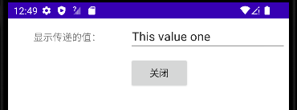

# 界面的交互

安卓应用一般具有若干个活动。每个活动显示一个界面，用户可通过该界面执行特定任务（例如查看地图或拍照）。如需将用户从一个活动转至另一活动，应用必须使用意图（Intent）定义应用执行的操作。当使用
startActivity() 等方法将意图传递至系统时，系统会使用意图识别和启动相应的应用组件。使用意图甚至可以让应用启动另一个应用包含的
活动。意图可以为“显式”，以便启动特定组件（特定的活动实例）；也可为“隐式”，以便启动任何可以处理预期操作（例如“拍摄照片”）的组件。本章介绍了如何使用
意图执行与其他应用的一些基本交互，例如启动另一个应用、接收来自该应用的结果以及使应用能够响应来自其他应用的意图。

## 理解意图

意图（Intent）是连接安卓组件的纽带，专门用于携带需要传递的信息。当某个组件创建一个意图对象并发送后，安卓系统会根据这个意图携带的信息激活对应的其他组件，也就是启动这些组件，执行这些组件的代码。这个意图对象中同时携带触发其他组件执行的条件信息和触发后该组件执行时所需要的信息。

### 意图的概念

安卓是一个基于有限资源的操作系统，安卓的基本设计理念是鼓励减少组件的耦合，因此安卓提供了意图机制，是一种通用的消息系统。安卓的一个应用程序与其他的应用程序之间通过传递意图对象来执行行为和产生事件。通过意图的消息触发、消息传递、消息响应来实现窗口跳转、传递数据或调用外部程序，进行应用程序的激活和调用。安卓的基础组件活动、服务和广播接收器，都可以通过定义意图的消息，实现在各组件之间的程序跳转和数据传递，也就是意图的消息可以激活其他组件。从程序的角度来看，在安卓中，意图相当于各个活动之间或其他类型基础组件的桥梁，可以传递数据，还可以通过意图启动另外一个基础组件。比如说从一个窗口点击一个链接，用浏览器打开另一个页面时，既要启动浏览器程序，又要把链接传递给浏览器，安卓应用程序就可以在第一个活动中创建一个意图对象，在意图对象把链接的数据封装，然后通过安卓系统传递给浏览器程序，并启动浏览器。

抽象地说，意图消息是同一个应用程序或不同应用程序运行后，组件间进行绑定的一种能力。通过意图消息，把不同的组件与用户的操作联系起来，比如说在一个活动上点击一个按钮就打开另一个显示照片的活动，而点击链接则打开一个浏览器。具体来说，意图对象包含要执行的操作或需要传递的消息，或者在广播的情况下，包含一些已经发生或正在发生的事情的描述。举个例子，在一个联系人维护的应用中，当我们在一个联系人列表屏幕上，点击某个联系人后，希望能够跳出此联系人的详细信息屏幕，在两个活动之间，需要传递联系人的信息，这个工作由意图完成。下面介绍意图具体可以携带那些信息。

### 意图的组成

一个意图对象就是一个信息包。它包含了接收这个意图对象的组件所感兴趣的信息（如要执行的行为和行为相关的数据）和安卓系统感兴趣的信息（如处理这个意图对象的组件的分类和有关如何启动目标活动的指令）。意图为这些不同的信息定义了对应的属性，通过设定所需的属性值就可以把数据从一个活动传递到另一个活动。意图对象可绑定信息包含下面这些，但是意图对象在绑定信息时，并不是所有的信息都必须设置，而只是选定需要携带的信息绑定到意图对象，也就是设定意图对象的对应属性的值。

  - ComponentName（组件名）：需要启动的活动的名字

意图的组件名称对象由ComponentName类封装。也就是说，意图定义了一个属性描述意图将要激活或启动的安卓组件名称，这个组件可以是一个活动、服务、广播接收器或者内容提供器。意图的这个属性值是一个ComponentName类的对象，无法直接访问它，但可以通过getComponentName()获取。ComponentName类包含两个String成员，分别代表安卓组件的全称类名和包名，包名必须和AndroidManifest.xml文件中标记中的对应信息一致。这个意图对象所要激活或启动的安卓组件，已经在AndroidManifest.xml中进行了描述。对于意图，组件名并不是必须的。如果一个意图对象添加了组件名，则称该意图为“显示意图”，这样的意图在传递的时候会直接根据组件名去寻找目标组件。如果没有添加组件名，则称为“隐式意图”，安卓会根据意图中的其他信息来确定响应该意图的组件。这打个比方，老师在让学生回答问题时，老师说：“Tom回答问题”，这就是显示意图，直接指出了回答问题的人；老师说：“第二排第三个同学回答问题”，这就是隐式意图，给出了回答问题学生的条件，学生根据自己的座位来确认是谁来回答问题。

  - Action（行为）：指定了要访问的活动需要做什么

行为是描述要求安卓系统所执行行为的一个属性，值是一个字符串常量，代表安卓组件所可能执行的一些操作，比如说启动活动、发出警告等等。安卓系统中已经预定义了一些行为常量，开发者也可以定义自己的行为描述。安卓定义了一套标准行为值，其中最重要的和最常用的行为操作是ACTION\_MAIN和ACTION\_EDIT，见表
5-1。

<table>
<tbody>
<tr class="odd">
<td>标准的活动行为</td>
<td>标准的广播行为</td>
</tr>
<tr class="even">
<td>
ACTION_MAIN

ACTION_VIEW

ACTION_ATTACH_DATA

ACTION_EDIT

ACTION_PICK

ACTION_CHOOSER

ACTION_GET_CONTENT

ACTION_DIAL

ACTION_CALL

ACTION_SEND

ACTION_SENDTO

ACTION_ANSWER

ACTION_INSERT

ACTION_DELETE

ACTION_RUN

ACTION_SYNC

ACTION_PICK_ACTIVITY

ACTION_SEARCH

ACTION_WEB_SEARCH

ACTION_FACTORY_TEST
</td>
<td>
ACTION_TIME_TICK

ACTION_TIME_CHANGED

ACTION_TIMEZONE_CHANGED

ACTION_BOOT_COMPLETED

ACTION_PACKAGE_ADDED

ACTION_PACKAGE_CHANGED

ACTION_PACKAGE_REMOVED

ACTION_PACKAGE_RESTARTED

ACTION_PACKAGE_DATA_CLEARED

ACTION_UID_REMOVED

ACTION_BATTERY_CHANGED

ACTION_POWER_CONNECTED

ACTION_POWER_DISCONNECTED

ACTION_SHUTDOWN
</td>
</tr>
</tbody>
</table>

表 5-1 标准的行为

假如这个属性定义了ACTION\_MAIN行为，则表示接收意图对象传递信息的活动进行初始化和启动操作，并且不需要数据输入也没有返回值输出。假如这个属性定义了ACTION\_BATTERY\_LOW行为，当电池电量低时，系统会使用意图对象传递这个信息给广播接收器组件。在Java中使用setAction()来设置意图的行为属性，使用getAction()来获得行为属性。

  - Data（数据）：需要传递的数据

数据部分描述了安卓系统执行时，所激活的其他组件执行时需要的数据、数据MIME类型和URI，不同的行为对应不同的操作数据。例如，如果行为字段是ACTION\_EDIT，数据字段将包含将显示用于编辑的文档的URI；如果行为是ACTION\_CALL，数据字段将是一个tel:URI和将拨打的号码；如果行为是ACTION\_VIEW，数据字段是一个http:URI，接收活动将被调用去下载和显示URI指向的数据。

下面是行为和后面携带相关数据的例子：

  - > ACTION\_VIEW content://contacts/people/1 -- 显示标识为"1"的联系人信息

  - > ACTION\_DIAL content://contacts/people/1 --显示可填写的电话拨号器

  - > ACTION\_DIAL tel:123 -- 显示带有号码的拨号器

  - > ACTION\_EDIT content://contacts/people/1 -- 编辑标识为"1"的联系人信息

  - > ACTION\_VIEW content://contacts/people/ -- 显示联系人列表

当安卓系统根据一个意图匹配对应的组件时，通常知道数据的类型（它的MIME类型）和它的URI很重要。例如，一个能够显示图像数据的组件，就不应该在播放一个音频文件时被激活。在许多情况下，能够从URI中推测数据类型，特别是content:URIs，它表示位于设备上的数据且被ContentProvider控制。但是也能够显示地设置类型，使用意图的setData()方法指定数据的URI，setType()指定MIME类型，setDataAndType()指定数据的URI和MIME类型。被激活执行的活动中，获取意图对象后，通过意图的getData()读取URI，getType()读取类型。数据的类型是由行为的值决定的，下面给出几个例子可以看出行为部分的不同，决定了数据部分的值不同。

  - Category（类别）：给出一些行为的额外执行信息

主要描述被求组件或执行行为的额外信息。安卓也为类别定义了一系列的静态常量字符串来表示意图不同类别，其中标准的类别定义见表 5-2。

<table>
<tbody>
<tr class="odd">
<td>标准类别</td>
<td>标准附加信息</td>
</tr>
<tr class="even">
<td>
CATEGORY_DEFAULT

CATEGORY_BROWSABLE

CATEGORY_TAB

CATEGORY_ALTERNATIVE

CATEGORY_SELECTED_ALTERNATIVE

CATEGORY_LAUNCHER

CATEGORY_INFO

CATEGORY_HOME

CATEGORY_PREFERENCE

CATEGORY_TEST

CATEGORY_CAR_DOCK

CATEGORY_DESK_DOCK

CATEGORY_LE_DESK_DOCK

CATEGORY_HE_DESK_DOCK

CATEGORY_CAR_MODE

CATEGORY_APP_MARKET
</td>
<td>
EXTRA_ALARM_COUNT

EXTRA_BCC

EXTRA_CC

EXTRA_CHANGED_COMPONENT_NAME

EXTRA_DATA_REMOVED

EXTRA_DOCK_STATE

EXTRA_DOCK_STATE_HE_DESK

EXTRA_DOCK_STATE_LE_DESK

EXTRA_DOCK_STATE_CAR

EXTRA_DOCK_STATE_DESK

EXTRA_DOCK_STATE_UNDOCKED

EXTRA_DONT_KILL_APP

EXTRA_EMAIL

EXTRA_INITIAL_INTENTS

EXTRA_INTENT

EXTRA_KEY_EVENT

EXTRA_ORIGINATING_URI

EXTRA_PHONE_NUMBER

EXTRA_REFERRER

EXTRA_REMOTE_INTENT_TOKEN

EXTRA_REPLACING

EXTRA_SHORTCUT_ICON

EXTRA_SHORTCUT_ICON_RESOURCE

EXTRA_SHORTCUT_INTENT

EXTRA_STREAM

EXTRA_SHORTCUT_NAME

EXTRA_SUBJECT

EXTRA_TEMPLATE

EXTRA_TEXT

EXTRA_TITLE

EXTRA_UID
</td>
</tr>
</tbody>
</table>

表 5-2 标准的类别和额外数据

  - Extras（附件信息）：需要传递的额外信息，以键值对形式传递

主要描述组件的扩展信息或额外的数据。安卓定义了标准的额外数据常量，见表
5-2。额外信息采用键值对的结构，以Bundle对象的形式保存在意图当中。附加信息其实是一个类型安全的容器，其实现就是将HashMap做了一层封装。意图对象有一系列的putXXX()方法用于插入各种附加数据和一系列的getXXX()用于读取数据。这些方法与Bundle对象的方法类似。额外数据可以作为一个Bundle，使用putExtra()和getExtra()方法安装和读取，例如如果要执行发送电子邮件这个行为，可以将电子邮件的标题、正文等保存在额外数据里，传给电子邮件发送组件。

  - Flags（标记）：标记活动启动的方式

主要标示如何触发目标组件以及如何看待被触发的目标组件。例如标示被触发的组件应该属于哪一个任务或者触发的组件是否是最近的活动等等，标记可以是多个标示符的组合。安卓有各种各样的标志，许多指示安卓系统如何去启动一个活动（例如活动应该属于那个任务）和启动之后如何对待它（例如是否属于最近的活动列表）。所有这些标志都定义在意图类中。其可用的常量包括：FLAG\_ACTIVITY\_CLEAR\_TOP、FLAG\_ACTIVITY\_NEW\_TASK、FLAG\_ACTIVITY\_NO\_HISTORY、FLAG\_ACTIVITY\_SINGLE\_TOP。

### 意图的解析

当一个活动创建并发出一个意图对象后，其他的活动或基础组件可能因为与这个意图对象携带的信息相关而被启动。一个活动或其它基础组件实现在各组件之间的程序跳转和数据传递，可以通过意图的两种不同方式来实现：显示和隐式。

  - 显式意图

指在活动或其他组件创建意图对象时，通过组件名显式地设定所希望启动、激活或接收这个意图对象的目标组件（如服务）名称，当这个活动发送这个意图对象后，由安卓系统自动启动或激活组件名指定的安卓组件，接收这个意图对象携带的其他信息。因为有时开发者不知道其他应用的组件名称，显式常用于自己应用内部的消息传递，比如应用中一个活动启动一个相关的服务或者启动一个相关的活动。

  - 隐式意图

创建意图对象的组件，并不指定目标组件的名字，即组件名字段为空，当这个活动发送这个意图对象后，安卓系统通过意图对象中的其他信息与目标组件的意图过滤器中的设置相匹配，来启动或激活相关的活动、服务或广播接收器等目标组件。隐式意图经常用于激活其它应用程序中的组件。

对于接收隐式的意图的安卓组件来说，需要在AndroidManifest.xml中设定接收意图对象的策略。当安卓系统在处理意图对象时，把意图对象中携带的信息与应用程序中组件设定的意图过滤策略逐个相比较，判断该组件是否符合启动或接收的条件。也就是说，通过设定意图过滤策略条件，可以指示安卓系统在什么时候启动并把意图对象传递给自己。下面是一个使用意图过滤器的例子。

> \<activity android:name=".IntentExampleActivity"\>
> 
> \<intent-filter\>
> 
> \<action android:name="com.android.activity.MY\_ACTION"/\>
> 
> \<category android:name="android.intent.category.DEFAULT"/\>
> 
> \</intent-filter\>
> 
> \</activity\>

码 5‑1

这是在AndroidManifest.xml文件中IntentExampleActivity的声明代码。当系统中其他的活动发送出一个意图对象，并且这个意图对象的行为属性的值为“MY\_ACTION”时，安卓系统会启动IntentExampleActivity应用程序。如果一个组件没有声明任何意图过滤器，它仅能接收显式的意图，也就是被显示意图对象启动或激活；而声明了意图过滤器的组件可以接收显式和隐式的意图。并非意图对象中所有的信息都会用于过滤器的匹配，只有行为、数据（包括URI和数据类型）、类别三个字段才被考虑。下面具体讨论一下意图过滤器和它的检测方法。

意图过滤器是由\<intent-filter\>标记来设置的。活动、服务、广播接收器为了告知安卓系统能够处理哪些隐式意图，可以设置一个或多个条件，说明该组件可接收的意图对象，过滤掉不想接收的隐式意图对象。除了广播接收器通过调用Context.registerReceiver()动态地注册，直接创建一个IntentFilter对象外，其他的意图过滤器必须在AndroidManifest.xml文件中进行声明。可用于意图过滤器的意图字段有三个：行为、数据和类别。在安卓系统通过组件的意图过滤器检测隐式意图时，要检测所有这三个字段，其中任何一个字段匹配失败，系统都不会把这个隐式意图给该组件。但每个字段可以用意图过滤器设置多个条件，每个设定的条件之间相互独立，只要其他组件发送出的隐式意图对象符合其中的一个条件，就能够被安卓系统启动或接收。

在AndroidManifest.xml文件中，对Action字段设置过滤条件，在\<intent-filter\>元素下使用\<action\>子元素及其属性android:name来设置可接收的Action字段的值。例如：

> \<intent-filter \>
> 
> \<action android:name="com.example.project.SHOW\_CURRENT" /\>
> 
> \<action android:name="com.example.project.SHOW\_RECENT" /\>
> 
> \<action android:name="com.example.project.SHOW\_PENDING" /\>
> 
> \</intent-filter\>

码 5‑2 行为检测

根据例子设置的过滤策略，只要行为字段的值符合上面列出之一的意图，都可以被这个组件接收。虽然一个意图对象的行为只有一个值，但是一个过滤器可以列出不止一个，接收多种类型行为的意图对象。值得注意的是，\<intent-filter\>元素下必须至少包含一个\<action\>子元素，否则它将阻塞所有的意图。要通过检测，意图对象中指定的行为必须匹配意图过滤器的行为列表中的一个。如果过滤器没有\<action\>子元素，将没有一个意图匹配，所有的意图都会检测失败，没有意图能够通过过滤器。类似行为检测，在\<intent-filter\>元素下使用\<category\>子元素及其属性android:name列出可接收的类别字段的值，例如：

> \<intent-filter . . . \>
> 
> \<category android:name="android.intent.category.DEFAULT" /\>
> 
> \<category android:name="android.intent.category.BROWSABLE" /\>
> 
> . . .
> 
> \</intent-filter\>

码 5‑3 类别检测

在意图对象中可以含有多个类别，\<Intent-filter\>中可以设置多个\<category\>，只有意图中的所有类别都能匹配到\<Intent-filter\>中的\<category\>，意图才能通过检测。也就是说，如果意图对象中的类别集合是\<Intent-filter\>中\<category\>的集合的子集时，意图对象才能通过检查。如果意图对象中没有设置类别的值，则它能通过所有\<Intent-filter\>的\<category\>检查。如果一个意图能够通过不止一个组件的\<Intent-filter\>，系统可能会询问哪个组件被激活。如果找不到目标组件，会产生一个异常。在\<intent-filter\>元素下使用\<data\>元素及其属性可接收的Data字段的值，例如：

> \<intent-filter . . . \>
> 
> \<data android:mimeType="video/mpeg" android:scheme="http" . . . /\>
> 
> \<data android:mimeType="audio/mpeg" android:scheme="http" . . . /\>
> 
> . . .
> 
> \</intent-filter\>

码 5‑4 数据检测

每个\<data\>元素可以指定一个URI和数据类型（MIME类型）。对应于URI的scheme、host、port、path四个部分，\<data\>元素分别使用属性android:scheme、android:host、android:port、android:path来设置，下面是URI的格式为：

  - scheme://host:port/path 

一个例子：

  - content://com.example.project:200/folder/subfolder/etc 

scheme是content，host是"com.example.project"，port是200，path是"folder/subfolder/etc"。host和port一起构成URI的authority，如果host没有指定，port也被忽略。 这四个属性都是可选的，但它们之间并不都是完全独立的。要让authority有意义，scheme必须也要指定。要让path有意义，scheme和authority也都必须要指定。比较意图对象和过滤器的URI时，仅仅比较过滤器中出现的URI属性。例如，如果一个过滤器仅指定了scheme，所有此scheme的URI都匹配过滤器；如果一个过滤器指定了scheme和authority，但没有指定path，所有匹配scheme和authority的URIs都通过检测，而不管它们的path；如果四个属性都指定了，要都匹配才能算是匹配。然而，过滤器中的path可以包含通配符来要求匹配path中的一部分。\<data\>元素的mimeType属性指定数据的MIME类型。意图对象和过滤器都可以用"\*"通配符匹配子类型字段，例如"text/\*"，"audio/\*"表示任何子类型。在Data检测时，系统既要检测URI，也要检测MIME类型，检测的规则如下：

  - 一个意图对象既不包含URI，也不包含MIME类型：仅当过滤器也不指定任何URs和MIME类型时，才不能通过检测；否则都能通过。

  - 一个意图对象包含URI，但不包含MIME类型：仅当过滤器也不指定MIME类型，同时它们的URI匹配，才能通过检测。例如，mailto:和tel:都不指定实际数据。

  - 一个意图对象包含MIME类型，但不包含URI：仅当过滤器也只包含MIME类型且与意图相同，才通过检测。

  - 一个意图对象既包含URI，也包含MIME类型（或MIME类型能够从URI推断出）：MIME类型部分，只有与过滤器中之一匹配才算通过；URI部分，它的URI要出现在过滤器中，或者它有content:或file: URI，又或者过滤器没有指定URI。换句话说，如果它的过滤器仅列出了数据类型，组件假定支持content:和file: 。

如果一个意图能够通过不止一个组件的\<Intent-filter\>，系统可能会询问哪个组件被激活。如果找不到目标组件，会产生一个异常。例如，允许用户浏览便签，查看每条便签的内容，这个程序在Manifest文件中可以按码
5‑5来设置意图过滤器，使其可以根据需要被系统激活。

> \<manifest xmlns:android="http://schemas.android.com/apk/res/android"
> 
> package="com.android.notepad"\>
> 
> \<application android:icon="@drawable/app\_notes"
> 
> android:label="@string/app\_name"\>
> 
> \<provider class=".NotePadProvider"
> 
> android:authorities="com.google.provider.NotePad" /\>
> 
> \<activity class=".NotesList"
> android:label="@string/title\_notes\_list"\>
> 
> \<intent-filter\>
> 
> \<action android:name="android.intent.action.MAIN" /\>
> 
> \<category android:name="android.intent.category.LAUNCHER"
> 
> \</category\>
> 
> \</intent-filter\>
> 
> \<intent-filter\>
> 
> \<action android:name="android.intent.action.VIEW" /\>
> 
> \<action android:name="android.intent.action.EDIT" /\>
> 
> \<action android:name="android.intent.action.PICK" /\>
> 
> \<category android:name="android.intent.category.DEFAULT" /\>
> 
> \<data android:mimeType="vnd.android.cursor.dir/vnd.google.note" /\>
> 
> \</intent-filter\>
> 
> \<intent-filter\>
> 
> \<action android:name="android.intent.action.GET\_CONTENT"
> 
> \</action\>
> 
> \<category android:name="android.intent.category.DEFAULT" /\>
> 
> \<data android:mimeType="vnd.android.cursor.item/vnd.google.note" /\>
> 
> \</intent-filter\>
> 
> \</activity\>
> 
> \<activity class=".NoteEditor" android:label="@string/title\_note"\>
> 
> \<intent-filter android:label="@string/resolve\_edit"\>
> 
> \<action android:name="android.intent.action.VIEW" /\>
> 
> \<action android:name="android.intent.action.EDIT" /\>
> 
> \<category android:name="android.intent.category.DEFAULT" /\>
> 
> \<data android:mimeType="vnd.android.cursor.item/vnd.google.note" /\>
> 
> \</intent-filter\>
> 
> \<intent-filter\>
> 
> \<action android:name="android.intent.action.INSERT" /\>
> 
> \<category android:name="android.intent.category.DEFAULT" /\>
> 
> \<data android:mimeType="vnd.android.cursor.dir/vnd.google.note" /\>
> 
> \</intent-filter\>
> 
> \</activity\>
> 
> \<activity class=".TitleEditor"
> android:label="@string/title\_edit\_title"
> 
> android:theme="@android:style/Theme.Dialog"\>
> 
> \<intent-filter android:label="@string/resolve\_title"\>
> 
> \<action android:name="com.android.notepad.action.EDIT\_TITLE" /\>
> 
> \<category android:name="android.intent.category.DEFAULT" /\>
> 
> \<category android:name="android.intent.category.ALTERNATIVE" /\>
> 
> \<category
> android:name="android.intent.category.SELECTED\_ALTERNATIVE" /\>
> 
> \<data android:mimeType="vnd.android.cursor.item/vnd.google.note" /\>
> 
> \</intent-filter\>
> 
> \</activity\>
> 
> \</application\>
> 
> \</manifest\>

码 5‑5应用程序的意图过滤器设置

在码
5‑5中，可知此应用程序定义了三个活动，每一个活动都定义了多个意图模板。其中命名为com.android.notepad.NotesList的第一个活动行为进入应用程序的主入口，通过定义三个意图过滤器可以做三件事情。第一个意图过滤模板代码如下：

> \<intent-filter\>
> 
> \<action android:name="android.intent.action.MAIN" /\>
> 
> \<category android:name="android.intent.category.LAUNCHER" /\>
> 
> \</intent-filter\>

码 5‑6 第一个意图过滤

行为设置为标准MAIN，表示这个活动提供了进入应用程序的顶级入口，类别设置为LAUNCHER表示这个入口应该列入应用程序启动列表。第二个意图过滤模板代码如下：

> \<intent-filter\>
> 
> \<action android:name="android.intent.action.VIEW" /\>
> 
> \<action android:name="android.intent.action.EDIT" /\>
> 
> \<action android:name="android.intent.action.PICK" /\>
> 
> \<category android:name="android.intent.category.DEFAULT" /\>
> 
> \<data mimeType:name="vnd.android.cursor.dir/vnd.google.note" /\>
> 
> \</intent-filter\>

码 5‑7 第二个意图过滤

行为设置为VIEW、EDIT和PICK表示这个活动可以对便签目录所作的操作，允许用户浏览、编辑和挑选便签。Category设置DEFAULT
表示，如果这个活动的组件名没有显示说明，还需要通过Context.startActivity()方法来启动这个活动。第三个意图过滤模板代码如下：

> \<intent-filter\>
> 
> \<action android:name="android.intent.action.GET\_CONTENT" /\>
> 
> \<category android:name="android.intent.category.DEFAULT" /\>
> 
> \<data android:mimeType="vnd.android.cursor.item/vnd.google.note" /\>
> 
> \</intent-filter\>

码 5‑8 第三个意图过滤

vnd.android.cursor.item/vnd.google.note是指示vnd.android.cursor.item资源中确切指定的一个URI，也就是vnd.google.note。数据的type的设置表示指定类型的数据可以被这个活动检索。行为设置为GET\_CONTENT与PICK类似，这个设置表示当type为vnd.android.cursor.item/vnd.google.note时，返回给调用者一个用户选择的便笺，而用户不需要知道便笺从哪里读取的。通过这三个过滤模板的设置，如果系统中出现携带下面信息的意图，NotesList这个活动就会被激活执行：

  - { action=android.app.action.MAIN }，与此意图匹配的活动，将会被当作进入应用的顶级入口。

  - { action=android.app.action.MAIN,
    category=android.app.category.LAUNCHER
    }，这是目前LAUNCHER实际使用的意图，用于生成LAUNCHER的顶级列表。

  - { action=android.app.action.VIEW,
    data=content://com.google.provider.NotePad/notes
    }，显示"content://com.google.provider.NotePad/notes"下的所有便笺的列表，使用者可以遍历列表，并且察看某便笺的详细信息。

  - { action=android.app.action.PICK,
    data=content://com.google.provider.NotePad/notes
    }，显示"content://com.google.provider.NotePad/notes"下的便笺列表，让用户可以在列表中选择一个，然后将选择便笺的
    URL返回给调用者。

  - {action=android.app.action.GET\_CONTENT,
    type=vnd.android.cursor.item/vnd.google.note }。

#### 显示定义

使用显示定义意图，实现关于对话框功能：

  - 在主页面，用户点击关于按钮时，弹出一个对话框显示信息。

  - 在关于对话框，点击OK按钮，返回主页面。

下面先给出关键的意图创建代码，方便在完整的程序代码中查看，这里直接给出了意图的组件名称。

> //显示方式声明意图，直接启动
> 
> SecondActivityIntentit=new
> Intent(MainActivity.this,AboutActivity.class);
> 
> //启动活动
> 
> startActivity(it);

码 5‑9

完成这个功能，需要几个步骤：

① 定义主活动的布局，设置一个显示信息的文本框TextView和关于按钮，见码 5‑10。

> \<?xml version="1.0" encoding="utf-8"?\>
> 
> \<LinearLayout
> xmlns:android="http://schemas.android.com/apk/res/android"
> 
> android:orientation="vertical"
> 
> android:layout\_width="fill\_parent"
> 
> android:layout\_height="fill\_parent" \>
> 
> \<TextView
> 
> android:layout\_width="fill\_parent"
> 
> android:layout\_height="wrap\_content"
> 
> android:text="@string/hello" /\>
> 
> \<Button
> 
> android:id="@+id/btn"
> 
> android:layout\_width="wrap\_content"
> 
> android:layout\_height="wrap\_content"
> 
> android:text="@string/about\_button" /\>
> 
> \</LinearLayout\>

码 5‑10 explicit\_intent\_main\_layout.xml

② 定义点击按钮后出现的第二个活动的布局，设置一个显示信息的文本框TextView和OK钮，见码 5‑11。

> \<?xml version="1.0" encoding="utf-8"?\>
> 
> \<LinearLayout
> xmlns:android="http://schemas.android.com/apk/res/android"
> 
> android:orientation="vertical"
> 
> android:layout\_width="fill\_parent"
> 
> android:layout\_height="fill\_parent" \>
> 
> \<TextView
> 
> android:layout\_width="fill\_parent"
> 
> android:layout\_height="wrap\_content"
> 
> android:text="@string/about\_button\_show" /\>
> 
> \<Button
> 
> android:id="@+id/secondBtn"
> 
> android:layout\_width="wrap\_content"
> 
> android:layout\_height="wrap\_content"
> 
> android:text="OK" /\>
> 
> \</LinearLayout\>

码 5‑11 explicit\_intent\_second\_layout.xml

③ 定义主活动，导入布局资源定义的界面，并在OnClickListener() 方法中编写点击按钮后的事件处理代码，见码 5‑12。

> import android.app.Activity;
> 
> import android.content.Intent;
> 
> import android.os.Bundle;
> 
> import android.view.View;
> 
> import android.view.View.OnClickListener;
> 
> import android.widget.Button;
> 
> public class ExplicitMainActivity extends Activity {
> 
> private Button btn;
> 
> @Override
> 
> public void onCreate(Bundle savedInstanceState) {
> 
> super.onCreate(savedInstanceState);
> 
> setContentView(R.layout. explicit\_intent\_main);
> 
> btn = (Button)findViewById(R.id.btn);
> 
> //响应按钮btn事件
> 
> btn.setOnClickListener(new OnClickListener() {
> 
> @Override
> 
> public void onClick(View v) {
> 
> //显示方式声明意图，直接启动SecondActivity
> 
> Intent it = new Intent(MainActivity.this,SecondActivity.class);
> 
> //启动活动
> 
> startActivity(it);
> 
> }
> 
> });
> 
> }
> 
> }

码 5‑12 ExplicitMainActivity.java

④ 定义第二个用户界面活动，导入布局资源定义的界面，并在OnClickListener()
方法中编写点击OK按钮后的返回主界面的事件处理代码，见码
5‑13。

> import android.app.Activity;
> 
> import android.content.Intent;
> 
> import android.os.Bundle;
> 
> import android.view.View;
> 
> import android.view.View.OnClickListener;
> 
> import android.widget.Button;
> 
> public class ExplicitSecondActivity extends Activity {
> 
> private Button secondBtn;
> 
> @Override
> 
> protected void onCreate(Bundle savedInstanceState) {
> 
> super.onCreate(savedInstanceState);
> 
> setContentView(R.layout. explicit\_intent\_second);
> 
> secondBtn=(Button)findViewById(R.id.secondBtn);
> 
> //响应按钮secondBtn事件
> 
> secondBtn.setOnClickListener(new OnClickListener() {
> 
> @Override
> 
> public void onClick(View v) {
> 
> //显示方式声明意图，直接启动MainActivity
> 
> Intent intent = new Intent(SecondActivity.this,MainActivity.class);
> 
> //启动Activity
> 
> startActivity(intent);
> 
> }
> 
> });
> 
> }
> 
> }

码 5‑13 ExplicitSecondActivity.java

完成上述4步之后，在AndroidManifest.xml中注册，运行此程序，可以看到通过显示意图的作用，可以在两个界面之间跳转。通过这个例子可以看出，所谓显示意图，就是通过创建意图对象，直接告诉系统要启动哪一个活动或其他组件。

#### 隐式定义

在上面的例子中，我们使用显示意图实现了界面的跳转。下面尝试使用隐式意图来实现上个例子同样的功能，学习行为检测的使用,下面先给出关键的意图创建代码方便在完整的程序代码中查看。

> //实例化意图
> 
> Intentit=newIntent();
> 
> //设置Intent的行为属性——自定义的Action
> 
> it.setAction("com.android.activity.MY\_ACTION");
> 
> //启动活动
> 
> startActivity(it);

码 5‑14

在Androidmanifest.xml中的主界面声明中的代码如下：

> \<activity android:name=".AboutActivity"\>
> 
> \<intent-filter\>
> 
> \<action android:name="com.android.activity.MY\_ACTION"/\>
> 
> \<category android:name="android.intent.category.DEFAULT"/\>
> 
> \</intent-filter\>
> 
> \</activity\>

码 5‑15

完成这个功能，需要几个步骤：

① 定义主活动的布局，设置一个显示信息的文本框TextView和About按钮，见码 5‑16。

② 定义点击按钮后出现的第二个活动的布局，设置一个显示信息的文本框TextView和OK钮，见码 5‑16。

③ 定义主活动，导入布局资源定义的界面，并在OnClickListener()
方法中编写点击按钮后的事件处理代码，创建意图对象，设置意图对象的行为字段的值为com.android.activity.MY\_ACTION，见码
5‑16。

> import android.app.Activity;
> 
> import android.content.Intent;
> 
> import android.os.Bundle;
> 
> import android.view.View;
> 
> import android.view.View.OnClickListener;
> 
> import android.widget.Button;
> 
> public class ImplicitMainActivity extends Activity {
> 
> private Button btn;
> 
> @Override
> 
> public void onCreate(Bundle savedInstanceState) {
> 
> super.onCreate(savedInstanceState);
> 
> setContentView(R.layout. implicit\_intent\_second\_layout);
> 
> btn = (Button) findViewById(R.id.btn);
> 
> // 响应按钮btn事件
> 
> btn.setOnClickListener(new OnClickListener() {
> 
> @Override
> 
> public void onClick(View v) {
> 
> // 实例化意图
> 
> Intent it = new Intent();
> 
> //设置Intent的行为属性
> 
> it.setAction("com.android.activity.MY\_ACTION");
> 
> // 启动活动
> 
> startActivity(it);
> 
> }
> 
> });
> 
> }
> 
> }

码 5‑16 ImplicitMainActivity.java

④ 定义第二个用户界面活动，导入布局资源定义的界面，见码 5‑17。

> import android.app.Activity;
> 
> import android.os.Bundle;
> 
> public class ImplicitSecondActivity extends Activity {
> 
> @Override
> 
> protected void onCreate(Bundle savedInstanceState) {
> 
> super.onCreate(savedInstanceState);
> 
> setContentView(R.layout. implicit\_intent\_second\_layout);
> 
> }
> 
> }

码 5‑17 ImplicitSecondActivity.java

#### 应用选择器

如果有多个应用响应隐式意图，则用户可以选择要使用的应用，并将其设置为该操作的默认选项。如果用户可能希望每次使用相同的应用执行某项操作（例如，打开网页时，用户往往倾向于仅使用一种网络浏览器），则选择默认选项的功能十分有用。但是，如果多个应用可以响应
Intent，且用户可能希望每次使用不同的应用，则应采用显式方式显示选择器对话框。选择器对话框会要求用户选择用于操作的应用（用户无法为该操作选择默认应用）。例如当应用使用
ACTION\_SEND 操作执行“共享”时，用户根据目前的状况可能需要使用另一不同的应用，因此应当始终使用选择器对话框，如图 5‑1所示。

图 5‑1 选择器对话框

要显示选择器，使用 createChooser() 创建 Intent，并将其传递给
startActivity()，如下例所示。此示例将显示一个对话框，其中有响应传递给
createChooser() 方法的 Intent 的应用列表，并且将提供的文本用作对话框标题。

> Intent sendIntent = new Intent(Intent.ACTION\_SEND);
> 
> ...
> 
> // Always use string resources for UI text.
> 
> // This says something like "Share this photo with"
> 
> String title = getResources().getString(R.string.chooser\_title);
> 
> // Create intent to show the chooser dialog
> 
> Intent chooser = Intent.createChooser(sendIntent, title);
> 
> // Verify the original intent will resolve to at least one activity
> 
> if (sendIntent.resolveActivity(getPackageManager()) \!= null) {
> 
> startActivity(chooser);
> 
> }

码 5‑18

### 数据传递

启动另一个活动（无论是应用中的活动还是其他应用中的活动）不一定是单向操作。也可以启动另一个活动并接收返回的结果。例如，应用可启动相机应用并接收拍摄的照片作为结果，或者可以启动“通讯录”应用以便用户选择联系人，并且将接收联系人详细信息作为结果。虽然所有
API 级别的 Activity 类均提供底层 startActivityForResult() 和 onActivityResult()
API，但安卓强烈建议使用 AndroidX Activity 和 Fragment 中引入的 Activity Result
API。Activity Result API 提供了用于注册结果、启动结果以及在系统分派结果后对其进行处理的组件。

在启动活动以获取结果时，可能会出现进程和活动因内存不足而被销毁的情况；如果是使用相机等内存密集型操作，几乎可以确定会出现这种情况。因此，Activity
Result API
会将结果回调从之前启动另一个活动的代码位置分离开来。由于在重新创建进程和活动时需要使用结果回调，因此每次创建活动时都必须无条件注册回调，即使启动另一个活动的逻辑仅基于用户输入内容或其他业务逻辑也是如此。位于
ComponentActivity 或 Fragment 中时，Activity Result API 会提供
registerForActivityResult() API，用于注册结果回调。registerForActivityResult()接受
ActivityResultContract和ActivityResultCallback作为参数，并返回
ActivityResultLauncher，供用来启动另一个活动。

ActivityResultContract 定义生成结果所需的输入类型以及结果的输出类型。这些 API
可为拍照和求权限等基本意图操作提供默认协定。还可以创建自己的自定义协定。ActivityResultCallback
是单一方法接口，带有 onActivityResult() 方法，可接受 ActivityResultContract 中定义的输出类型的对象：

> // GetContent creates an ActivityResultLauncher\<String\> to allow you
> to pass
> 
> // in the mime type you'd like to allow the user to select
> 
> ActivityResultLauncher\<String\> mGetContent =
> registerForActivityResult(new GetContent(),
> 
> new ActivityResultCallback\<Uri\>() {
> 
> @Override
> 
> public void onActivityResult(Uri uri) {
> 
> // Handle the returned Uri
> 
> }
> 
> });

码 5‑19

如果有多个使用不同协定或需要单独回调的活动结果调用，则可以多次调用 registerForActivityResult()，以注册多个
ActivityResultLauncher 实例。每次创建片段或活动时，都必须按照相同的顺序调用
registerForActivityResult()，才能确保将生成的结果传递给正确的回调。在片段或活动创建完毕之前可安全地调用
registerForActivityResult()，因此在为返回的 ActivityResultLauncher
实例声明成员变量时可以直接使用它。注意：虽然在片段或活动创建完毕之前可安全地调用
registerForActivityResult()，但在片段或活动的生命周期变为 CREATED 状态之前，无法启动
ActivityResultLauncher。虽然 registerForActivityResult()
会注册回调，但它不会启动另一个活动并发出结果求。这些操作由返回的
ActivityResultLauncher 实例负责。如果存在输入内容，启动器会接受与 ActivityResultContract
的类型匹配的输入内容。调用launch()会启动生成结果的过程。当用户完成后续活动并返回时，系统将执行
ActivityResultCallback中的onActivityResult()，如以下示例所示：

> ActivityResultLauncher\<String\> mGetContent =
> registerForActivityResult(new GetContent(),
> 
> new ActivityResultCallback\<Uri\>() {
> 
> @Override
> 
> public void onActivityResult(Uri uri) {
> 
> // Handle the returned Uri
> 
> }
> 
> });
> 
> @Override
> 
> public void onCreate(@Nullable savedInstanceState: Bundle) {
> 
> // ...
> 
> Button selectButton = findViewById(R.id.select\_button);
> 
> selectButton.setOnClickListener(new OnClickListener() {
> 
> @Override
> 
> public void onClick(View view) {
> 
> // Pass in the mime type you'd like to allow the user to select
> 
> // as the input
> 
> mGetContent.launch("image/\*");
> 
> }
> 
> });
> 
> }

码 5‑20

除了传递输入内容之外，launch()的重载版本还允许传递 ActivityOptionsCompat。注意：由于在调用 launch()与触发
onActivityResult()回调的两个时间点之间，进程和活动可能会被销毁，因此处理结果所需的任何其他状态都必须与这些 API
分开保存和恢复。

虽然 ComponentActivity 和 Fragment 类通过实现 ActivityResultCaller 接口来允许使用
registerForActivityResult()，但也可以直接使用 ActivityResultRegistry 在未实现
ActivityResultCaller 的单独类中接收活动结果。例如，可能需要实现一个
LifecycleObserver，用于处理协定的注册和启动器的启动：

> class MyLifecycleObserver implements DefaultLifecycleObserver {
> 
> private final ActivityResultRegistry mRegistry;
> 
> private ActivityResultLauncher\<String\> mGetContent;
> 
> MyLifecycleObserver(@NonNull ActivityResultRegistry registry) {
> 
> mRegistry = registry;
> 
> }
> 
> public void onCreate(@NonNull LifecycleOwner owner) {
> 
> // ...
> 
> mGetContent = mRegistry.register(“key”, owner, new GetContent(),
> 
> new ActivityResultCallback\<Uri\>() {
> 
> @Override
> 
> public void onActivityResult(Uri uri) {
> 
> // Handle the returned Uri
> 
> }
> 
> });
> 
> }
> 
> public void selectImage() {
> 
> // Open the activity to select an image
> 
> mGetContent.launch("image/\*");
> 
> }
> 
> }
> 
> class MyFragment extends Fragment {
> 
> private MyLifecycleObserver mObserver;
> 
> @Override
> 
> void onCreate(Bundle savedInstanceState) {
> 
> // ...
> 
> mObserver = new
> MyLifecycleObserver(requireActivity().getActivityResultRegistry());
> 
> getLifecycle().addObserver(mObserver);
> 
> }
> 
> @Override
> 
> void onViewCreated(@NonNull View view, @Nullable Bundle
> savedInstanceState) {
> 
> Button selectButton = findViewById(R.id.select\_button);
> 
> selectButton.setOnClickListener(new OnClickListener() {
> 
> @Override
> 
> public void onClick(View view) {
> 
> mObserver.selectImage();
> 
> }
> 
> });
> 
> }
> 
> }

码 5‑21

使用 ActivityResultRegistry时，强烈建议使用可接受 LifecycleOwner 作为参数的 API，因为
LifecycleOwner 会在生命被销毁时自动移除已注册的启动器。不过，如果 LifecycleOwner 不存在，每个
ActivityResultLauncher 类都允许手动调用 unregister() 作为替代。

虽然包含一些预先构建的可用 ActivityResultContract 类，但可以使用自己的协定，提供所需要的精确类型安全 API。每个
ActivityResultContract 都需要定义输入和输出类，如果不需要任何输入可使用 Void作为输入类型。每个协定都必须实现
createIntent() 方法，该方法接受 Context 和输入内容作为参数，并构造将与 startActivityForResult()
配合使用的 Intent。每个协定还必须实现 parseResult()，这会根据指定的 resultCode（如
Activity.RESULT\_OK 或 Activity.RESULT\_CANCELED）和意图生成输出内容。如果无需调用
createIntent()、启动另一个活动并借助 parseResult() 来构建结果即可确定指定输入内容的结果，协定可以选择性地实现
getSynchronousResult()。

> public class PickRingtone extends ActivityResultContract\<Integer,
> Uri\> {
> 
> @NonNull
> 
> @Override
> 
> public Intent createIntent(@NonNull Context context, @NonNull Integer
> ringtoneType) {
> 
> Intent intent = new Intent(Intent.ACTION\_GET\_CONTENT);
> 
> intent.putExtra(RingtoneManager.EXTRA\_RINGTONE\_TYPE,
> ringtoneType.intValue());
> 
> return intent;
> 
> }
> 
> @Override
> 
> public Uri parseResult(int resultCode, @Nullable Intent result) {
> 
> if (resultCode \!= Activity.RESULT\_OK || result == null) {
> 
> return null;
> 
> }
> 
> return
> result.getParcelableExtra(RingtoneManager.EXTRA\_RINGTONE\_PICKED\_URI);
> 
> }
> 
> }

码 5‑22

如果不需要自定义协定，则可以使用 StartActivityForResult 协定。这是一个通用协定，它可接受任何意图作为输入内容并返回
ActivityResult，能够在回调中提取 resultCode 和 Intent，如以下示例所示：

> ActivityResultLauncher\<Intent\> mStartForResult =
> registerForActivityResult(new StartActivityForResult(),
> 
> new ActivityResultCallback\<ActivityResult\>() {
> 
> @Override
> 
> public void onActivityResult(ActivityResult result) {
> 
> if (result.getResultCode() == Activity.RESULT\_OK) {
> 
> Intent intent = result.getData();
> 
> // Handle the Intent
> 
> }
> 
> }
> 
> });
> 
> @Override
> 
> public void onCreate(@Nullable savedInstanceState: Bundle) {
> 
> // ...
> 
> Button startButton = findViewById(R.id.start\_button);
> 
> startButton.setOnClickListener(new OnClickListener() {
> 
> @Override
> 
> public void onClick(View view) {
> 
> // The launcher with the Intent you want to start
> 
> mStartForResult.launch(new Intent(this,
> ResultProducingActivity.class));
> 
> }
> 
> });
> 
> }

使用意图实现数据传递无论是显示还是隐式，都需要有以下几个步骤：

(1)定义传递数据的活动，也就是通过布局文件设计活动的界面，并创建相互转换的几个活动，他们之间需要数据转换或需要在某种情况下进行切换。

(2)在活动中创建意图，设定所传递元素的值，即需传递的数据；或者设定所要切换的活动

(3)声明活动以及意图过滤器，这一步在manifest.xml中声明所创建的活动，并且根据显示还是隐式的设置设定相应的意图过滤器

无论是显式还是隐式意图，除了可以启动和激活其他的组件之外，还可以同时携带需要传递到另一个组件的信息，比如说在一个活动中提供给用户输入界面，完成的多个信息输入，然后启动另一个活动，在第二个活动上进行信息的处理和输出。要实现这种功能，可以在第一个活动创建意图对象，设置意图的启动条件，也就是设置显式意图或隐式意图的过滤条件，同时把用户输入的信息也放入这个意图。这样在第二个活动接收这个意图时，就可以从意图对象中读出用户输入的信息了。类似的信息可以在意图对象的Extra字段中存储。下面这个例子实现在DataTransferFirstActivity和DataTransferSecondActivity之间传递用户输入信息的功能，码
5‑24在这里给出意图对象设置的主要代码，可以按照前面隐式的意图使用方式来编写应用程序。

> import android.content.ComponentName;
> 
> import android.content.Intent;
> 
> import android.os.Bundle;
> 
> import android.util.Log;
> 
> import android.view.View;
> 
> import android.view.View.OnClickListener;
> 
> import android.widget.Button;
> 
> import android.widget.EditText;
> 
> import android.widget.Toast;
> 
> import androidx.activity.result.ActivityResultLauncher;
> 
> import androidx.activity.result.contract.ActivityResultContracts;
> 
> import androidx.appcompat.app.AppCompatActivity;
> 
> import com.example.ch05.R;
> 
> public class DataTransferFirstActivity extends AppCompatActivity {
> 
> private static final String TAG = "DataTransferFirstActivity";
> 
> private final ActivityResultLauncher\<Intent\> mStartForResult =
> registerForActivityResult(new
> ActivityResultContracts.StartActivityForResult(),
> 
> result -\> {
> 
> final int resultCode = result.getResultCode();
> 
> final Intent data = result.getData();
> 
> Log.d(TAG, " resultCode: " + resultCode + " data: " + data);
> 
> if (result.getResultCode() == AppCompatActivity.RESULT\_OK) {
> 
> if (data.hasExtra("returnKey")) {
> 
> Toast.makeText(
> 
> this,
> 
> "通过第一个按钮返回的结果："
> 
> \+ data.getExtras().getString("returnKey"),
> 
> Toast.LENGTH\_LONG).show();
> 
> }
> 
> }
> 
> });
> 
> private final ActivityResultLauncher\<Intent\> mStartForResult2 =
> registerForActivityResult(new
> ActivityResultContracts.StartActivityForResult(),
> 
> result -\> {
> 
> final int resultCode = result.getResultCode();
> 
> final Intent data = result.getData();
> 
> Log.d(TAG, " resultCode: " + resultCode + " data: " + data);
> 
> if (result.getResultCode() == AppCompatActivity.RESULT\_OK) {
> 
> // 処理成功時
> 
> if (data.hasExtra("returnKey")) {
> 
> Toast.makeText(
> 
> this,
> 
> "通过第二个按钮返回的结果："
> 
> \+ data.getExtras().getString("returnKey"),
> 
> Toast.LENGTH\_LONG).show();
> 
> }
> 
> }
> 
> });
> 
> private Intent i;
> 
> private EditText edittext01;
> 
> private EditText edittext02;
> 
> private Button button01;
> 
> private Button button02;
> 
> @Override
> 
> public void onCreate(Bundle savedInstanceState) {
> 
> super.onCreate(savedInstanceState);
> 
> setContentView(R.layout.c05\_activity\_first\_layout);
> 
> i = new Intent();
> 
> i.setComponent(new ComponentName(
> 
> "com.example.ch05",
> 
> "com.example.ch05.intent.DataTransferSecondActivity"));
> 
> edittext01 = (EditText) findViewById(R.id.edittext01);
> 
> edittext02 = (EditText) findViewById(R.id.edittext02);
> 
> button01 = (Button) findViewById(R.id.button01);
> 
> button01.setOnClickListener(new OnClickListener() {
> 
> @Override
> 
> public void onClick(View v) {
> 
> // TODO Auto-generated method stub
> 
> i.putExtra("Value", edittext01.getText().toString());
> 
> mStartForResult.launch(i);
> 
> }
> 
> });
> 
> button02 = (Button) findViewById(R.id.button02);
> 
> button02.setOnClickListener(new OnClickListener() {
> 
> @Override
> 
> public void onClick(View v) {
> 
> // TODO Auto-generated method stub
> 
> i.putExtra("Value", edittext02.getText().toString());
> 
> mStartForResult2.launch(i);
> 
> }
> 
> });
> 
> }
> 
> }

码 5‑23 DataTransferFirstActivity

第二个活动代码如下：

> import android.content.Intent;
> 
> import android.os.Bundle;
> 
> import android.view.View;
> 
> import android.widget.EditText;
> 
> import androidx.appcompat.app.AppCompatActivity;
> 
> import com.example.ch05.R;
> 
> public class DataTransferSecondActivity extends AppCompatActivity {
> 
> private static final String TAG = "DataTransferSecondActivity";
> 
> /\*\* Called when the activity is first created. \*/
> 
> @Override
> 
> public void onCreate(Bundle bundle) {
> 
> super.onCreate(bundle);
> 
> setContentView(R.layout.c05\_activity\_second\_layout);
> 
> Bundle extras = getIntent().getExtras();
> 
> if (extras == null) {
> 
> return;
> 
> }
> 
> String value = extras.getString("Value");
> 
> if (value \!= null) {
> 
> EditText text = (EditText) findViewById(R.id.input);
> 
> text.setText(value);
> 
> }
> 
> }
> 
> public void onClick(View view) {
> 
> finish();
> 
> }
> 
> @Override
> 
> public void finish() {
> 
> Intent data = new Intent();
> 
> // Return some hard-coded values
> 
> data.putExtra("returnKey", "You could be better then you are. ");
> 
> setResult(RESULT\_OK, data);
> 
> super.finish();
> 
> }
> 
> }

码 5‑24 DataTransferSecondActivity

<table>
<tbody>
<tr class="odd">
<td>

图 5‑2第一个活动
</td>
<td>

图 5‑3 第二个活动
</td>
</tr>
</tbody>
</table>

### 常用意图

通过描述在某个意图对象中执行的简单操作（如“查看地图”或“拍摄照片”）来启动另一应用中的某个活动，这种称作隐式意图，因为它并不指定要启动的应用组件，而是指定一项操作并提供执行该操作所需的一些数据。当调用
startActivity() 或 startActivityForResult()
并向其传递隐式意图时，系统会将意图解析为可处理该意图的应用并启动其对应的活动。如果有多个应用可处理意图，系统会为用户显示一个对话框，供其选择要使用的应用。本节介绍几种可用于执行常见操作的隐式意图，按处理意图的应用类型分成不同部分。此外，每个部分还介绍如何创建意图过滤器来公布应用执行相应操作的能力。注意：如果设备上没有可接收隐式意图的应用，应用将在调用
startActivity() 时崩溃，意图对象事先调用
resolveActivity()验证是否存在可接收意图的应用，如果结果为非空，则至少有一个应用能够处理该意图，并且可以安全调用startActivity()。如果结果为空，则不应使用该意图，如有可能应禁用调用该意图的功能。

#### 闹钟

如需创建新闹铃，使用 ACTION\_SET\_ALARM 操作并使用下文介绍的 extra 指定时间和消息等闹铃详细信息。注意：Android
2.3（API 级别 9）及更低版本上只提供小时、分钟和消息，其他的额外信息是在更新版本的平台上新增的。

  - 行为：ACTION\_SET\_ALARM

  - 数据URI：无

  - MIME类型：无

  - 附加信息：
    
      - EXTRA\_HOUR：闹铃的小时。
    
      - EXTRA\_MINUTES：闹铃的分钟。
    
      - EXTRA\_MESSAGE：用于标识闹铃的自定义消息。
    
      - EXTRA\_DAYS：一个 ArrayList，其中包括应重复触发该闹铃的每个工作日。每一天都必须使用 Calendar
        类中的某个整型值（如 MONDAY）进行声明。对于一次性闹铃，无需指定此。
    
      - EXTRA\_RINGTONE：一个 content: URI，用于指定闹铃使用的铃声，也可指定
        VALUE\_RINGTONE\_SILENT 以不使用铃声。如需使用默认铃声，则无需指定此。
    
      - EXTRA\_VIBRATE：一个布尔型值，用于指定该闹铃触发时是否振动。
    
      - EXTRA\_SKIP\_UI：一个布尔型值，用于指定响应闹铃的应用在设置闹铃时是否应跳过其 UI。若为
        true，则应用应跳过任何确认 UI，直接设置指定的闹铃。

示例 Intent：

> public void createAlarm(String message, int hour, int minutes) {
> 
> Intent intent = new Intent(AlarmClock.ACTION\_SET\_ALARM)
> 
> .putExtra(AlarmClock.EXTRA\_MESSAGE, message)
> 
> .putExtra(AlarmClock.EXTRA\_HOUR, hour)
> 
> .putExtra(AlarmClock.EXTRA\_MINUTES, minutes);
> 
> if (intent.resolveActivity(getPackageManager()) \!= null) {
> 
> startActivity(intent);
> 
> }
> 
> }

码 5‑25

注意：为了调用 ACTION\_SET\_ALARM意图，应用必须具有 SET\_ALARM 权限：

> \<uses-permission
> android:name="com.android.alarm.permission.SET\_ALARM" /\>

码 5‑26

示例意图过滤器：

> \<activity ...\>
> 
> \<intent-filter\>
> 
> \<action android:name="android.intent.action.SET\_ALARM" /\>
> 
> \<category android:name="android.intent.category.DEFAULT" /\>
> 
> \</intent-filter\>
> 
> \</activity\>

如需创建倒计时器，使用 ACTION\_SET\_TIMER 操作并使用下文介绍的附加信息指定持续时间等定时器详细信息。注意：此意图在
Android 4.4（API 级别 19）中添加。

  - 行为：ACTION\_SET\_TIMER

  - 数据 URI：无

  - MIME 类型：无

  - 附加信息：
    
      - EXTRA\_LENGTH：以秒为单位的定时器定时长度。
    
      - EXTRA\_MESSAGE：用于标识定时器的自定义消息。
    
      - EXTRA\_SKIP\_UI：一个布尔型值，用于指定响应定时器的应用在设置定时器时是否应跳过其界面。若为
        true，则应用应跳过任何确认界面，直接启动指定的定时器。

示例 Intent：

> public void startTimer(String message, int seconds) {
> 
> Intent intent = new Intent(AlarmClock.ACTION\_SET\_TIMER)
> 
> .putExtra(AlarmClock.EXTRA\_MESSAGE, message)
> 
> .putExtra(AlarmClock.EXTRA\_LENGTH, seconds)
> 
> .putExtra(AlarmClock.EXTRA\_SKIP\_UI, true);
> 
> if (intent.resolveActivity(getPackageManager()) \!= null) {
> 
> startActivity(intent);
> 
> }
> 
> }

码 5‑27

注意：为了调用 ACTION\_SET\_TIMER Intent，应用必须具有 SET\_ALARM 权限（见码 5‑26）。

示例意图过滤器：

> \<activity ...\>
> 
> \<intent-filter\>
> 
> \<action android:name="android.intent.action.SET\_TIMER" /\>
> 
> \<category android:name="android.intent.category.DEFAULT" /\>
> 
> \</intent-filter\>
> 
> \</activity\>

码 5‑28

如需显示闹铃列表，使用 ACTION\_SHOW\_ALARMS
行为。尽管调用此意图的应用并不多（使用它的主要是系统应用），但任何充当闹钟的应用都应实现此意图过滤器，并通过显示现有闹铃列表作出响应。注意：此意图在
Android 4.4（API 级别 19）中添加。

  - 行为：ACTION\_SHOW\_ALARMS

  - 数据 URI：无

  - MIME 类型：无

示例意图过滤器：

> \<activity ...\>
> 
> \<intent-filter\>
> 
> \<action android:name="android.intent.action.SHOW\_ALARMS" /\>
> 
> \<category android:name="android.intent.category.DEFAULT" /\>
> 
> \</intent-filter\>
> 
> \</activity\>

码 5‑29

#### 日历

如需向用户的日历添加新事件，使用 ACTION\_INSERT 行为并指定具有 Events.CONTENT\_URI 的数据
URI。然后就可以使用下文介绍的附加信息指定事件的各类详细信息。

  - 行为：ACTION\_INSERT

  - 数据 URI：Events.CONTENT\_URI

  - MIME 类型："vnd.android.cursor.dir/event"

  - 附加信息：
    
      - EXTRA\_EVENT\_ALL\_DAY：一个布尔型值，指定此事件是否为全天事件。
    
      - EXTRA\_EVENT\_BEGIN\_TIME：事件的开始时间（从新纪年开始计算的毫秒数）。
    
      - EXTRA\_EVENT\_END\_TIME：事件的结束时间（从新纪年开始计算的毫秒数）。
    
      - TITLE：事件标题。
    
      - DESCRIPTION：事件说明。
    
      - EVENT\_LOCATION：事件地点。
    
      - EXTRA\_EMAIL：以逗号分隔的受邀者电子邮件地址列表。可使用
        CalendarContract.EventsColumns 类中定义的常量指定许多其他事件详细信息。

示例 Intent：

> public void addEvent(String title, String location, long begin, long
> end) {
> 
> Intent intent = new Intent(Intent.ACTION\_INSERT)
> 
> .setData(Events.CONTENT\_URI)
> 
> .putExtra(Events.TITLE, title)
> 
> .putExtra(Events.EVENT\_LOCATION, location)
> 
> .putExtra(CalendarContract.EXTRA\_EVENT\_BEGIN\_TIME, begin)
> 
> .putExtra(CalendarContract.EXTRA\_EVENT\_END\_TIME, end);
> 
> if (intent.resolveActivity(getPackageManager()) \!= null) {
> 
> startActivity(intent);
> 
> }
> 
> }

码 5‑30

示例意图过滤器：

> \<activity ...\>
> 
> \<intent-filter\>
> 
> \<action android:name="android.intent.action.INSERT" /\>
> 
> \<data android:mimeType="vnd.android.cursor.dir/event" /\>
> 
> \<category android:name="android.intent.category.DEFAULT" /\>
> 
> \</intent-filter\>
> 
> \</activity\>

码 5‑31

#### 相机

如需打开相机应用并接收拍摄的照片或视频，使用 ACTION\_IMAGE\_CAPTURE 或 ACTION\_VIDEO\_CAPTURE
行为。此外，还可在 EXTRA\_OUTPUT中指定希望相机将照片或视频保存到的 URI 位置。

  - 行为：ACTION\_IMAGE\_CAPTURE 或ACTION\_VIDEO\_CAPTURE

  - 数据 URI：无

  - MIME 类型：无

  - 附加信息：
    
      - EXTRA\_OUTPUT：相机应用应将照片或视频文件保存到的 URI 位置（以 Uri 对象形式）。

当相机应用成功将焦点归还给活动（应用收到 onActivityResult() 回调）时，可以按通过 EXTRA\_OUTPUT 值指定的
URI 访问照片或视频。注意：当使用 ACTION\_IMAGE\_CAPTURE
拍摄照片时，相机可能还会在结果意图中返回缩小尺寸的照片副本（缩略图），这个副本以
Bitmap 形式保存在名为 "data" 的附加信息字段中。示例 Intent：

> static final int REQUEST\_IMAGE\_CAPTURE = 1;
> 
> static final Uri locationForPhotos;
> 
> public void capturePhoto(String targetFilename) {
> 
> Intent intent = new Intent(MediaStore.ACTION\_IMAGE\_CAPTURE);
> 
> intent.putExtra(MediaStore.EXTRA\_OUTPUT,
> 
> Uri.withAppendedPath(locationForPhotos, targetFilename));
> 
> if (intent.resolveActivity(getPackageManager()) \!= null) {
> 
> startActivityForResult(intent, REQUEST\_IMAGE\_CAPTURE);
> 
> }
> 
> }
> 
> @Override
> 
> protected void onActivityResult(int requestCode, int resultCode,
> Intent data) {
> 
> if (requestCode == REQUEST\_IMAGE\_CAPTURE && resultCode ==
> RESULT\_OK) {
> 
> Bitmap thumbnail = data.getParcelableExtra("data");
> 
> // Do other work with full size photo saved in locationForPhotos
> 
> ...
> 
> }
> 
> }

码 5‑32

如需了解有关如何使用此意图拍摄照片的详细信息，包括如何创建与输出位置相适应的 Uri，阅读只拍摄照片或只拍摄视频。示例意图过滤器：

> \<activity ...\>
> 
> \<intent-filter\>
> 
> \<action android:name="android.media.action.IMAGE\_CAPTURE" /\>
> 
> \<category android:name="android.intent.category.DEFAULT" /\>
> 
> \</intent-filter\>
> 
> \</activity\>

码 5‑33

处理此意图时，活动应检查传入意图中有无 EXTRA\_OUTPUT，然后将拍摄的图像或视频保存在该附加信息指定的位置，并调用带意图的
setResult()，该意图将经过压缩的缩略图包括在名为 "data" 的附加信息中。

如需以静态图像模式打开相机应用，使用 INTENT\_ACTION\_STILL\_IMAGE\_CAMERA 行为。

  - 行为：INTENT\_ACTION\_STILL\_IMAGE\_CAMERA

  - 数据 URI：无

  - MIME 类型：无

  - 附加信息：无

示例 Intent：

> public void capturePhoto() {
> 
> Intent intent = new
> Intent(MediaStore.INTENT\_ACTION\_STILL\_IMAGE\_CAMERA);
> 
> if (intent.resolveActivity(getPackageManager()) \!= null) {
> 
> startActivityForResult(intent, REQUEST\_IMAGE\_CAPTURE);
> 
> }
> 
> }

码 5‑34

示例意图过滤器：

> \<activity ...\>
> 
> \<intent-filter\>
> 
> \<action android:name="android.media.action.STILL\_IMAGE\_CAMERA" /\>
> 
> \<category android:name="android.intent.category.DEFAULT" /\>
> 
> \</intent-filter\>
> 
> \</activity\>

码 5‑35

如需以视频模式打开相机应用，使用 INTENT\_ACTION\_VIDEO\_CAMERA 行为。

  - 行为：INTENT\_ACTION\_VIDEO\_CAMERA

  - 数据 URI：无

  - MIME 类型：无

  - 附加信息：无

示例 Intent：

> public void capturePhoto() {
> 
> Intent intent = new Intent(MediaStore.INTENT\_ACTION\_VIDEO\_CAMERA);
> 
> if (intent.resolveActivity(getPackageManager()) \!= null) {
> 
> startActivityForResult(intent, REQUEST\_IMAGE\_CAPTURE);
> 
> }
> 
> }

码 5‑36

示例意图过滤器：

> \<activity ...\>
> 
> \<intent-filter\>
> 
> \<action android:name="android.media.action.VIDEO\_CAMERA" /\>
> 
> \<category android:name="android.intent.category.DEFAULT" /\>
> 
> \</intent-filter\>
> 
> \</activity\>

码 5‑37

#### 联系人

如需让用户选择联系人和为应用提供对所有联系人信息的访问权限，使用 ACTION\_PICK 行为，并将 MIME 类型指定为
Contacts.CONTENT\_TYPE。传送至onActivityResult() 回调的结果意图包含指向所选联系人的 content:
URI。响应会利用 Contacts Provider API 为应用授予该联系人的临时读取权限，即使应用不具备 READ\_CONTACTS
权限也没有关系。提示：如果只需要访问某一条联系人信息（如电话号码或电子邮件地址），改为参见下一节中如何选择特定联系人数据的内容。

  - 行为：ACTION\_PICK

  - 数据 URI：无

  - MIME 类型：Contacts.CONTENT\_TYPE

示例 Intent：

> static final int REQUEST\_SELECT\_CONTACT = 1;
> 
> public void selectContact() {
> 
> Intent intent = new Intent(Intent.ACTION\_PICK);
> 
> intent.setType(ContactsContract.Contacts.CONTENT\_TYPE);
> 
> if (intent.resolveActivity(getPackageManager()) \!= null) {
> 
> startActivityForResult(intent, REQUEST\_SELECT\_CONTACT);
> 
> }
> 
> }
> 
> @Override
> 
> protected void onActivityResult(int requestCode, int resultCode,
> Intent data) {
> 
> if (requestCode == REQUEST\_SELECT\_CONTACT && resultCode ==
> RESULT\_OK) {
> 
> Uri contactUri = data.getData();
> 
> // Do something with the selected contact at contactUri
> 
> ...
> 
> }
> 
> }

码 5‑38

如需了解有关在获得联系人 URI 后如何检索联系人详情的信息，阅读检索联系人详情。主要，使用以上意图检索联系人 URI
时，读取该联系人的详情并不需要 READ\_CONTACTS 权限。

如需让用户选择某一条具体的联系人信息，如电话号码、电子邮件地址或其他数据类型，使用 ACTION\_PICK 行为，并将 MIME
类型指定为下列其中一个内容类型（如
CommonDataKinds.Phone.CONTENT\_TYPE），以获取联系人的电话号码。如果只需要检索一种类型的联系人数据，则将此方法与来自
ContactsContract.CommonDataKinds 类的 CONTENT\_TYPE 配合使用要比使用
Contacts.CONTENT\_TYPE 更高效（如上一部分所示），因为结果可直接访问所需数据，无需对联系人提供程序执行更复杂的查询。

传送至的 onActivityResult() 回调的结果意图包含指向所选联系人数据的 content:
URI。响应会为的应用授予该联系人数据的临时读取权限，即使的应用不具备
READ\_CONTACTS 权限也没有关系。

  - 行为：ACTION\_PICK

  - 数据 URI：无

  - MIME 类型：
    
      - CommonDataKinds.Phone.CONTENT\_TYPE：从有电话号码的联系人中选取。
    
      - CommonDataKinds.Email.CONTENT\_TYPE：从有电子邮件地址的联系人中选取。
    
      - CommonDataKinds.StructuredPostal.CONTENT\_TYPE：从有邮政地址的联系人中选取。
    
      - 或者 ContactsContract 下众多其他 CONTENT\_TYPE 值中的一个。

示例 Intent：

> static final int REQUEST\_SELECT\_PHONE\_NUMBER = 1;
> 
> public void selectContact() {
> 
> // Start an activity for the user to pick a phone number from contacts
> 
> Intent intent = new Intent(Intent.ACTION\_PICK);
> 
> intent.setType(CommonDataKinds.Phone.CONTENT\_TYPE);
> 
> if (intent.resolveActivity(getPackageManager()) \!= null) {
> 
> startActivityForResult(intent, REQUEST\_SELECT\_PHONE\_NUMBER);
> 
> }
> 
> }
> 
> @Override
> 
> protected void onActivityResult(int requestCode, int resultCode,
> Intent data) {
> 
> if (requestCode == REQUEST\_SELECT\_PHONE\_NUMBER && resultCode ==
> RESULT\_OK) {
> 
> // Get the URI and query the content provider for the phone number
> 
> Uri contactUri = data.getData();
> 
> String\[\] projection = new String\[\]{CommonDataKinds.Phone.NUMBER};
> 
> Cursor cursor = getContentResolver().query(contactUri, projection,
> 
> null, null, null);
> 
> // If the cursor returned is valid, get the phone number
> 
> if (cursor \!= null && cursor.moveToFirst()) {
> 
> int numberIndex = cursor.getColumnIndex(CommonDataKinds.Phone.NUMBER);
> 
> String number = cursor.getString(numberIndex);
> 
> // Do something with the phone number
> 
> //...
> 
> }
> 
> }
> 
> }

码 5‑39

如需显示已知联系人的详情，使用 ACTION\_VIEW 行为，并使用 content: URI 作为意图数据指定联系人。初次检索联系人 URI
的方法主要有两种：使用 ACTION\_PICK 返回的联系人
URI，如上一节所示（此方法不需要任何应用权限）；直接访问所有联系人的列表，如检索联系人列表所述（此方法需要
READ\_CONTACTS 权限）

  - 行为：ACTION\_VIEW

  - 数据 URI：content:\<URI\>

  - MIME 类型：无。该类型是从联系人 URI 推断得出。

示例 Intent：

> public void viewContact(Uri contactUri) {
> 
> Intent intent = new Intent(Intent.ACTION\_VIEW, contactUri);
> 
> if (intent.resolveActivity(getPackageManager()) \!= null) {
> 
> startActivity(intent);
> 
> }
> 
> }

码 5‑40

如需编辑已知联系人，使用 ACTION\_EDIT 行为，使用 content: URI
作为意图数据指定联系人，并将额外信息中由常量指定的任何已知联系人信息包括在
ContactsContract.Intents.Insert 中。初次检索联系人 URI 的方法主要有两种：使用 ACTION\_PICK
返回的联系人 URI，如上所示（此方法不需要任何应用权限）；直接访问所有联系人的列表，如检索联系人列表所述（此方法需要
READ\_CONTACTS 权限）

  - 行为：ACTION\_EDIT

  - 数据 URI：content:\<URI\>

  - MIME 类型：该类型是从联系人 URI 推断得出。

  - 额外信息：ContactsContract.Intents.Insert 中定义的一个或多个，以便填充联系人详情字段。

示例 Intent：

> public void editContact(Uri contactUri, String email) {
> 
> Intent intent = new Intent(Intent.ACTION\_EDIT);
> 
> intent.setData(contactUri);
> 
> intent.putExtra(Intents.Insert.EMAIL, email);
> 
> if (intent.resolveActivity(getPackageManager()) \!= null) {
> 
> startActivity(intent);
> 
> }
> 
> }

码 5‑41

如需插入新联系人，使用ACTION\_INSERT行为，将Contacts.CONTENT\_TYPE 指定为 MIME
类型，并将额外信息中由常量指定的任何已知联系人信息包括在
ContactsContract.Intents.Insert 中。

  - 行为：ACTION\_INSERT

  - 数据 URI：无

  - MIME 类型：Contacts.CONTENT\_TYPE

  - 额外信息：ContactsContract.Intents.Insert 中定义的一个或多个。

示例 Intent：

> public void insertContact(String name, String email) {
> 
> Intent intent = new Intent(Intent.ACTION\_INSERT);
> 
> intent.setType(Contacts.CONTENT\_TYPE);
> 
> intent.putExtra(Intents.Insert.NAME, name);
> 
> intent.putExtra(Intents.Insert.EMAIL, email);
> 
> if (intent.resolveActivity(getPackageManager()) \!= null) {
> 
> startActivity(intent);
> 
> }
> 
> }

码 5‑42

#### 电子邮件

如需撰写电子邮件，根据其是否包括附件使用以下其中一项行为，并使用下列额外信息键加入收件人和主题等电子邮件详情。

  - 行为：
    
      - ACTION\_SENDTO（适用于不带附件）
    
      - ACTION\_SEND（适用于带一个附件）
    
      - ACTION\_SEND\_MULTIPLE（适用于带多个附件）

  - 数据 URI：无

  - MIME 类型：
    
      - "text/plain"
    
      - "\*/\*"

  - 额外信息：
    
      - Intent.EXTRA\_EMAIL：包含所有“主送”收件人电子邮件地址的字符串数组。
    
      - Intent.EXTRA\_CC：包含所有“抄送”收件人电子邮件地址的字符串数组。
    
      - Intent.EXTRA\_BCC：包含所有“密件抄送”收件人电子邮件地址的字符串数组。
    
      - Intent.EXTRA\_SUBJECT：包含电子邮件主题的字符串。
    
      - Intent.EXTRA\_TEXT：包含电子邮件正文的字符串。
    
      - Intent.EXTRA\_STREAM：指向附件的 Uri。如果使用的是 ACTION\_SEND\_MULTIPLE
        行为，应将其改为包含多个 Uri 对象的 ArrayList。

示例 Intent：

> public void composeEmail(String\[\] addresses, String subject, Uri
> attachment) {
> 
> Intent intent = new Intent(Intent.ACTION\_SEND);
> 
> intent.setType("\*/\*");
> 
> intent.putExtra(Intent.EXTRA\_EMAIL, addresses);
> 
> intent.putExtra(Intent.EXTRA\_SUBJECT, subject);
> 
> intent.putExtra(Intent.EXTRA\_STREAM, attachment);
> 
> if (intent.resolveActivity(getPackageManager()) \!= null) {
> 
> startActivity(intent);
> 
> }
> 
> }

码 5‑43

如果想确保意图只由电子邮件应用（而非其他短信或社交应用）进行处理，则需使用 ACTION\_SENDTO 行为并加入 "mailto:"
数据架构。例如：

> public void composeEmail(String\[\] addresses, String subject) {
> 
> Intent intent = new Intent(Intent.ACTION\_SENDTO);
> 
> intent.setData(Uri.parse("mailto:")); // only email apps should handle
> this
> 
> intent.putExtra(Intent.EXTRA\_EMAIL, addresses);
> 
> intent.putExtra(Intent.EXTRA\_SUBJECT, subject);
> 
> if (intent.resolveActivity(getPackageManager()) \!= null) {
> 
> startActivity(intent);
> 
> }
> 
> }

码 5‑44

示例 Intent 过滤器：

> \<activity ...\>
> 
> \<intent-filter\>
> 
> \<action android:name="android.intent.action.SEND" /\>
> 
> \<data android:type="\*/\*" /\>
> 
> \<category android:name="android.intent.category.DEFAULT" /\>
> 
> \</intent-filter\>
> 
> \<intent-filter\>
> 
> \<action android:name="android.intent.action.SENDTO" /\>
> 
> \<data android:scheme="mailto" /\>
> 
> \<category android:name="android.intent.category.DEFAULT" /\>
> 
> \</intent-filter\>
> 
> \</activity\>

码 5‑45

#### 文件存储

如需求用户选择文档或照片等文件并向的应用返回文件引用，使用 ACTION\_GET\_CONTENT 行为并指定所需 MIME
类型。向的应用返回的文件引用对活动的当前生命周期而言是瞬态引用，因此如果想稍后进行访问，就必须导入可在稍后读取的副本。用户还可利用此意图在进程中创建新文件（例如，用户可以不选择现有照片，而是用相机拍摄新照片）。传送至的
onActivityResult() 方法的结果意图包括的数据具有指向该文件的 URI。该 URI 可以是任何类型，如 http:
URI、file: URI 或 content: URI。不过，如果想将可选择的文件限定为可从内容提供程序 (content: URI)
访问的文件，以及通过 openFileDescriptor() 以文件流形式提供的文件，则应该为意图添加
CATEGORY\_OPENABLE 类别。在 Android 4.3（API 级别 18）及更高版本上，还可以通过为意图添加
EXTRA\_ALLOW\_MULTIPLE 并将其设置为 true，允许用户选择多个文件。然后就可以在由 getClipData() 返回的
ClipData 对象中访问每一个选定的文件。

  - 行为：ACTION\_GET\_CONTENT

  - 数据URI：无

  - MIME 类型：与用户应选择的文件类型对应的 MIME 类型。

  - 附加信息：
    
      - EXTRA\_ALLOW\_MULTIPLE：一个布尔型值，声明用户是否可以一次选择多个文件。
    
      - EXTRA\_LOCAL\_ONLY：一个布尔型值，声明是否返回的文件必须直接存在于设备上，而不是需要从远程服务下载。

  - 类别（可选）
    
      - CATEGORY\_OPENABLE：只返回可通过 openFileDescriptor() 以文件流形式表示的“可打开”文件。

用于获取照片的示例 Intent：

> static final int REQUEST\_IMAGE\_GET = 1;
> 
> public void selectImage() {
> 
> Intent intent = new Intent(Intent.ACTION\_GET\_CONTENT);
> 
> intent.setType("image/\*");
> 
> if (intent.resolveActivity(getPackageManager()) \!= null) {
> 
> startActivityForResult(intent, REQUEST\_IMAGE\_GET);
> 
> }
> 
> }
> 
> @Override
> 
> protected void onActivityResult(int requestCode, int resultCode,
> Intent data) {
> 
> if (requestCode == REQUEST\_IMAGE\_GET && resultCode == RESULT\_OK) {
> 
> Bitmap thumbnail = data.getParcelable("data");
> 
> Uri fullPhotoUri = data.getData();
> 
> // Do work with photo saved at fullPhotoUri
> 
> ...
> 
> }
> 
> }

码 5‑46

用于返回照片的示例意图过滤器：

> \<activity ...\>
> 
> \<intent-filter\>
> 
> \<action android:name="android.intent.action.GET\_CONTENT" /\>
> 
> \<data android:type="image/\*" /\>
> 
> \<category android:name="android.intent.category.DEFAULT" /\>
> 
> \<\!-- The OPENABLE category declares that the returned file is
> accessible
> 
> from a content provider that supports OpenableColumns
> 
> and ContentResolver.openFileDescriptor() --\>
> 
> \<category android:name="android.intent.category.OPENABLE" /\>
> 
> \</intent-filter\>
> 
> \</activity\>

码 5‑47

在 Android 4.4 或更高版本上运行时，可以不必检索必须导入应用的文件副本（使用 ACTION\_GET\_CONTENT
行为），而是使用 ACTION\_OPEN\_DOCUMENT 行为并指定 MIME
类型，求打开由另一个应用管理的文件。如果还需要允许用户创建应用可写入的新文档，可改用
ACTION\_CREATE\_DOCUMENT 行为。例如，ACTION\_CREATE\_DOCUMENT意图允许用户选择他们想在哪里创建新
PDF 文档（在另一个管理文档存储的应用内），而不是从现有文档中进行选择。的应用随后会收到其可以写入新文档的 URI 位置。尽管从
ACTION\_GET\_CONTENT 行为传递至的 onActivityResult() 方法的意图可能返回任何类型的 URI，来自
ACTION\_OPEN\_DOCUMENT 和 ACTION\_CREATE\_DOCUMENT 的结果意图始终将所选文件指定为
DocumentsProvider 支持的 content: URI。可以通过 openFileDescriptor() 打开该文件，并使用
DocumentsContract.Document 中的列查询其详细信息。返回的 URI
会为的应用授予对文件的长期读取权限（还可能会授予写入权限）。因此，如果想读取现有文件而不将其副本导入的应用，或者想就地打开和编辑文件，特别适合使用
ACTION\_OPEN\_DOCUMENT 行为（而不是使用 ACTION\_GET\_CONTENT）。

还可以通过为意图添加 EXTRA\_ALLOW\_MULTIPLE 并将其设置为 true，允许用户选择多个文件。如果用户只选择一项，就可以从
getData() 检索该项目。如果用户选择多项，则 getData() 返回 null，此时必须改为从 getClipData() 返回的
ClipData 对象检索每个项目。注意：的意图必须指定 MIME 类型，并且必须声明 CATEGORY\_OPENABLE
类别。必要时，可以使用 EXTRA\_MIME\_TYPES extra 添加一个 MIME
类型数组来指定多个 MIME类型。如果这样做，必须将 setType() 中的主 MIME 类型设置为 "\*/\*"。

  - 行为；ACTION\_OPEN\_DOCUMENT 或ACTION\_CREATE\_DOCUMENT

  - 数据 URI：无

  - MIME 类型：与用户应选择的文件类型对应的 MIME 类型。

  - 附加消息：
    
      - EXTRA\_MIME\_TYPES：与的应用求的文件类型对应的 MIME 类型数组。当使用此附加消息时，必须在
        setType() 中将主 MIME 类型设置为 "\*/\*"。
    
      - EXTRA\_ALLOW\_MULTIPLE：一个布尔型值，声明用户是否可以一次选择多个文件。
    
      - EXTRA\_TITLE：供与 ACTION\_CREATE\_DOCUMENT 配合使用，用于指定初始文件名。
    
      - EXTRA\_LOCAL\_ONLY：一个布尔型值，声明是否返回的文件必须直接存在于设备上，而不是需要从远程服务下载。

  - 类别：
    
      - CATEGORY\_OPENABLE：只返回可通过 openFileDescriptor() 以文件流形式表示的“可打开”文件。

用于获取照片的示例 Intent：

> static final int REQUEST\_IMAGE\_OPEN = 1;
> 
> public void selectImage() {
> 
> Intent intent = new Intent(Intent.ACTION\_OPEN\_DOCUMENT);
> 
> intent.setType("image/\*");
> 
> intent.addCategory(Intent.CATEGORY\_OPENABLE);
> 
> // Only the system receives the ACTION\_OPEN\_DOCUMENT, so no need to
> test.
> 
> startActivityForResult(intent, REQUEST\_IMAGE\_OPEN);
> 
> }
> 
> @Override
> 
> protected void onActivityResult(int requestCode, int resultCode,
> Intent data) {
> 
> if (requestCode == REQUEST\_IMAGE\_OPEN && resultCode == RESULT\_OK) {
> 
> Uri fullPhotoUri = data.getData();
> 
> // Do work with full size photo saved at fullPhotoUri
> 
> ...
> 
> }
> 
> }

码 5‑48

第三方应用实际上无法通过 ACTION\_OPEN\_DOCUMENT
行为响应意图，而是由系统接收此意图，然后在统一用户界面中显示各类应用提供的所有文件。如需在该界面中提供的应用的文件，并允许其他应用打开这些文件，必须实现一个
DocumentsProvider，并加入一个 PROVIDER\_INTERFACEIntent 过滤器
("android.content.action.DOCUMENTS\_PROVIDER")。例如：

> \<provider ...
> 
> android:grantUriPermissions="true"
> 
> android:exported="true"
> 
> android:permission="android.permission.MANAGE\_DOCUMENTS"\>
> 
> \<intent-filter\>
> 
> \<action android:name="android.content.action.DOCUMENTS\_PROVIDER" /\>
> 
> \</intent-filter\>
> 
> \</provider\>

码 5‑49

#### 叫车

如需叫一台出租车，使用 ACTION\_RESERVE\_TAXI\_RESERVATION
行为。注意：应用必须请求用户确认，然后才能完成操作。

  - 行为：ACTION\_RESERVE\_TAXI\_RESERVATION

  - 数据 URI：无

  - MIME 类型：无

  - 附加信息：无

示例 Intent：

> public void callCar() {
> 
> Intent intent = new
> Intent(ReserveIntents.ACTION\_RESERVE\_TAXI\_RESERVATION);
> 
> if (intent.resolveActivity(getPackageManager()) \!= null) {
> 
> startActivity(intent);
> 
> }
> 
> }

码 5‑50

示例意图过滤器：

> \<activity ...\>
> 
> \<intent-filter\>
> 
> \<action
> android:name="com.google.android.gms.actions.RESERVE\_TAXI\_RESERVATION"
> /\>
> 
> \<category android:name="android.intent.category.DEFAULT" /\>
> 
> \</intent-filter\>
> 
> \</activity\>

码 5‑51

#### 地图

如需打开地图，使用 ACTION\_VIEW 行为，并通过下文介绍的其中一个架构在意图数据中指定位置信息。

  - 行为：ACTION\_VIEW

  - 数据 URI：
    
      - geo:latitude,longitude：显示给定经度和纬度处的地图。示例："geo:47.6,-122.3"
    
      - geo:latitude,longitude?z=zoom：按特定缩放级别显示给定经度和纬度处的地图。缩放级别为 1
        时显示以给定纬度、经度为中心的全球地图。最高（最精确）缩放级别为
        23。示例："geo:47.6,-122.3?z=11"
    
      - geo:0,0?q=lat,lng(label)：显示给定经度和纬度处带字符串标签的地图。示例："geo:0,0?q=34.99,-106.61(Treasure)"
    
      - geo:0,0?q=my+street+address：显示“我的街道地址”的位置（可能是具体地址或位置查询）。示例："geo:0,0?q=1600+Amphitheatre+Parkway%2C+CA"

注意：geo URI 中传递的所有字符串都必须编码。例如，字符串 1st & Pike, Seattle 应编码为
1st%20%26%20Pike%2C%20Seattle。字符串中的空格可使用 %20 编码或替换为加号 (+)。

  - MIME 类型：无

示例 Intent：

> public void showMap(Uri geoLocation) {
> 
> Intent intent = new Intent(Intent.ACTION\_VIEW);
> 
> intent.setData(geoLocation);
> 
> if (intent.resolveActivity(getPackageManager()) \!= null) {
> 
> startActivity(intent);
> 
> }
> 
> }

码 5‑52

示例意图过滤器：

> \<activity ...\>
> 
> \<intent-filter\>
> 
> \<action android:name="android.intent.action.VIEW" /\>
> 
> \<data android:scheme="geo" /\>
> 
> \<category android:name="android.intent.category.DEFAULT" /\>
> 
> \</intent-filter\>
> 
> \</activity\>

码 5‑53

#### 音乐视频

如需播放音乐文件，使用 ACTION\_VIEW 行为，并在意图数据中指定文件的 URI 位置。

  - 行为：ACTION\_VIEW

  - 数据 URI：
    
      - file:\<URI\>
    
      - content:\<URI\>
    
      - http:\<URL\>

  - MIME 类型
    
      - "audio/\*"
    
      - "application/ogg"
    
      - "application/x-ogg"
    
      - "application/itunes"
    
      - 或者应用可能需要的任何其他类型。

示例 Intent：

> public void playMedia(Uri file) {
> 
> Intent intent = new Intent(Intent.ACTION\_VIEW);
> 
> intent.setData(file);
> 
> if (intent.resolveActivity(getPackageManager()) \!= null) {
> 
> startActivity(intent);
> 
> }
> 
> }

码 5‑54

示例意图过滤器：

> \<activity ...\>
> 
> \<intent-filter\>
> 
> \<action android:name="android.intent.action.VIEW" /\>
> 
> \<data android:type="audio/\*" /\>
> 
> \<data android:type="application/ogg" /\>
> 
> \<category android:name="android.intent.category.DEFAULT" /\>
> 
> \</intent-filter\>
> 
> \</activity\>

码 5‑55

如需基于搜索查询播放音乐，使用 INTENT\_ACTION\_MEDIA\_PLAY\_FROM\_SEARCH
Intent。应用可能会触发此意图来响应用户的音乐播放语音命令。接收此意图的应用会在其库存音乐内搜索与给定查询匹配的现有内容，并在找到后开始播放该内容。此意图应该包括
EXTRA\_MEDIA\_FOCUS 字符串，以指定预期搜索模式。例如，搜索模式可指定搜索的目标是艺术家姓名还是歌曲名称。

  - 行为：INTENT\_ACTION\_MEDIA\_PLAY\_FROM\_SEARCH

  - 数据 URI：无

  - MIME 类型：无

  - 附加信息：
    
      - MediaStore.EXTRA\_MEDIA\_FOCUS（必需）：表示搜索模式（用户是否在寻找特定艺术家、专辑、歌曲或播放列表）。大多数搜索模式都需要额外的附加信息。例如，如果用户有意收听某一首歌曲，意图可能需要额外增加三个附加信息：歌曲名称、艺术家和专辑。对于
        EXTRA\_MEDIA\_FOCUS 的每个值，此意图都支持下列搜索模式：（1）Any -
        "vnd.android.cursor.item/\*"：播放任意音乐。接收意图的应用应该根据智能选择（如用户最后收听的播放列表）播放音乐；额外附加信息：QUERY（必需）-
        一个空字符串。始终提供此附加信息以实现向后兼容性：不了解搜索模式的现有应用可将此意图作为非结构化搜索进行处理。（2）Unstructured
        -
        "vnd.android.cursor.item/\*"：播放通过非结构化搜索查询找到的特定歌曲、专辑或类型。当应用无法识别用户想要收听的内容类型时，可能会生成一个具有此搜索模式的
        Intent。应用应尽可能使用更确切的搜索模式。额外附加信息：QUERY（必需）-
        一个包含艺术家、专辑、歌曲名称或类型任意组合的字符串。（3）Genre
        -Audio.Genres.ENTRY\_CONTENT\_TYPE：播放特定类型的音乐。额外附加信息："android.intent.extra.genre"（必需）-
        类型；QUERY（必需）-
        类型。始终提供此附加信息以实现向后兼容性：不了解搜索模式的现有应用可将此意图作为非结构化搜索进行处理。（4）Artist
        -Audio.Artists.ENTRY\_CONTENT\_TYPE：播放特定艺术家的音乐。额外附加信息：EXTRA\_MEDIA\_ARTIST（必需）-
        艺术家；"android.intent.extra.genre" - 类型；QUERY（必需）-
        一个包含艺术家或类型任意组合的字符串。始终提供此附加信息以实现向后兼容性：不了解搜索模式的现有应用可将此意图作为非结构化搜索进行处理。（5）Album
        -Audio.Albums.ENTRY\_CONTENT\_TYPE：播放特定专辑的音乐。额外附加信息：EXTRA\_MEDIA\_ALBUM（必需）-
        专辑；EXTRA\_MEDIA\_ARTIST - 艺术家；"android.intent.extra.genre" -
        类型；QUERY（必需）-
        一个包含专辑或艺术家任意组合的字符串。始终提供此额外信息以实现向后兼容性：不了解搜索模式的现有应用可将此意图作为非结构化搜索进行处理。（6）Song
        -
        "vnd.android.cursor.item/audio"：播放特定歌曲。额外附加信息：EXTRA\_MEDIA\_ALBUM
        - 专辑；EXTRA\_MEDIA\_ARTIST - 艺术家；"android.intent.extra.genre" -
        类型；EXTRA\_MEDIA\_TITLE（必需）- 歌曲名称；QUERY（必需）-
        一个包含专辑、艺术家、类型或名称任意组合的字符串。始终提供此额外信息以实现向后兼容性：不了解搜索模式的现有应用可将此意图作为非结构化搜索进行处理。（7）Playlist
        - Audio.Playlists.ENTRY\_CONTENT\_TYPE：播放特定播放列表或符合额外 extra
        指定的某些条件的播放列表。额外信息：EXTRA\_MEDIA\_ALBUM -
        专辑；EXTRA\_MEDIA\_ARTIST - 艺术家；"android.intent.extra.genre"
        - 类型；"android.intent.extra.playlist" - 播放列表；EXTRA\_MEDIA\_TITLE
        - 播放列表所基于的歌曲名称；QUERY（必需）- 一个包含专辑、艺术家、类型、播放列表或名称任意组合的字符串。始终提供此
        extra，以实现向后兼容性：不了解搜索模式的现有应用可将此意图作为非结构化搜索进行处理。

示例 Intent：如果用户想收听特定艺术家的音乐，搜索应用可生成以下意图：

> public void playSearchArtist(String artist) {
> 
> Intent intent = new
> Intent(MediaStore.INTENT\_ACTION\_MEDIA\_PLAY\_FROM\_SEARCH);
> 
> intent.putExtra(MediaStore.EXTRA\_MEDIA\_FOCUS,
> 
> MediaStore.Audio.Artists.ENTRY\_CONTENT\_TYPE);
> 
> intent.putExtra(MediaStore.EXTRA\_MEDIA\_ARTIST, artist);
> 
> intent.putExtra(SearchManager.QUERY, artist);
> 
> if (intent.resolveActivity(getPackageManager()) \!= null) {
> 
> startActivity(intent);
> 
> }
> 
> }

码 5‑56

示例 Intent 过滤器：

> \<activity ...\>
> 
> \<intent-filter\>
> 
> \<action android:name="android.media.action.MEDIA\_PLAY\_FROM\_SEARCH"
> /\>
> 
> \<category android:name="android.intent.category.DEFAULT" /\>
> 
> \</intent-filter\>
> 
> \</activity\>

码 5‑57

处理此意图时，活动应通过检查传入意图中
EXTRA\_MEDIA\_FOCUS的值来确定搜索模式。活动识别出搜索模式后，应该读取该特定搜索模式额外附加信息的值。应用随后便可利用这些信息在其库存音乐内进行搜索，以播放与搜索查询匹配的内容。例如：

> protected void onCreate(Bundle savedInstanceState) {
> 
> //...
> 
> Intent intent = this.getIntent();
> 
> if
> (intent.getAction().compareTo(MediaStore.INTENT\_ACTION\_MEDIA\_PLAY\_FROM\_SEARCH)
> == 0) {
> 
> String mediaFocus =
> intent.getStringExtra(MediaStore.EXTRA\_MEDIA\_FOCUS);
> 
> String query = intent.getStringExtra(SearchManager.QUERY);
> 
> // Some of these extras may not be available depending on the search
> mode
> 
> String album = intent.getStringExtra(MediaStore.EXTRA\_MEDIA\_ALBUM);
> 
> String artist =
> intent.getStringExtra(MediaStore.EXTRA\_MEDIA\_ARTIST);
> 
> String genre = intent.getStringExtra("android.intent.extra.genre");
> 
> String playlist =
> intent.getStringExtra("android.intent.extra.playlist");
> 
> String title = intent.getStringExtra(MediaStore.EXTRA\_MEDIA\_TITLE);
> 
> // Determine the search mode and use the corresponding extras
> 
> if (mediaFocus == null) {
> 
> // 'Unstructured' search mode (backward compatible)
> 
> playUnstructuredSearch(query);
> 
> } else if (mediaFocus.compareTo("vnd.android.cursor.item/\*") == 0) {
> 
> if (query.isEmpty()) {
> 
> // 'Any' search mode
> 
> playResumeLastPlaylist();
> 
> } else {
> 
> // 'Unstructured' search mode
> 
> playUnstructuredSearch(query);
> 
> }
> 
> } else if
> (mediaFocus.compareTo(MediaStore.Audio.Genres.ENTRY\_CONTENT\_TYPE) ==
> 0) {
> 
> // 'Genre' search mode
> 
> playGenre(genre);
> 
> } else if
> (mediaFocus.compareTo(MediaStore.Audio.Artists.ENTRY\_CONTENT\_TYPE)
> == 0) {
> 
> // 'Artist' search mode
> 
> playArtist(artist, genre);
> 
> } else if
> (mediaFocus.compareTo(MediaStore.Audio.Albums.ENTRY\_CONTENT\_TYPE) ==
> 0) {
> 
> // 'Album' search mode
> 
> playAlbum(album, artist);
> 
> } else if (mediaFocus.compareTo("vnd.android.cursor.item/audio") == 0)
> {
> 
> // 'Song' search mode
> 
> playSong(album, artist, genre, title);
> 
> } else if
> (mediaFocus.compareTo(MediaStore.Audio.Playlists.ENTRY\_CONTENT\_TYPE)
> == 0) {
> 
> // 'Playlist' search mode
> 
> playPlaylist(album, artist, genre, playlist, title);
> 
> }
> 
> }
> 
> }

码 5‑58

#### 创建笔记

如需创建新笔记，使用 ACTION\_CREATE\_NOTE
行为并使用下文定义的附加信息指定笔记详情，例如主题和正文。注意：应用必须请求用户确认，然后才能完成操作。

  - 行为：ACTION\_CREATE\_NOTE

  - 数据 URI：无

  - MIME 类型:
    
      - PLAIN\_TEXT\_TYPE
    
      - "\*/\*"

  - 附加信息
    
      - EXTRA\_NAME：一个表示笔记标题或主题的字符串。
    
      - EXTRA\_TEXT：一个表示笔记正文的字符串。

示例 Intent：

> public void createNote(String subject, String text) {
> 
> Intent intent = new Intent(NoteIntents.ACTION\_CREATE\_NOTE)
> 
> .putExtra(NoteIntents.EXTRA\_NAME, subject)
> 
> .putExtra(NoteIntents.EXTRA\_TEXT, text);
> 
> if (intent.resolveActivity(getPackageManager()) \!= null) {
> 
> startActivity(intent);
> 
> }
> 
> }

码 5‑59

示例意图过滤器：

> \<activity ...\>
> 
> \<intent-filter\>
> 
> \<action android:name="com.google.android.gms.actions.CREATE\_NOTE"
> /\>
> 
> \<category android:name="android.intent.category.DEFAULT" /\>
> 
> \<data android:mimeType="\*/\*" /\>
> 
> \</intent-filter\>
> 
> \</activity\>

码 5‑60

#### 电话

如需打开电话应用并拨打电话号码，使用 ACTION\_DIAL 行为，并使用下文定义的 URI
架构指定电话号码。电话应用打开时会显示电话号码，但用户必需按拨打电话按钮才能开始通话。如需直接拨打电话，使用
ACTION\_CALL 行为，并使用下文定义的 URI
架构指定电话号码。电话应用打开时便会拨打电话，用户无需按拨打电话按钮。ACTION\_CALL
行为需要在清单文件中添加 CALL\_PHONE 权限：

> \<uses-permission android:name="android.permission.CALL\_PHONE" /\>

码 5‑61

  - 行为：
    
      - ACTION\_DIAL - 打开拨号器或电话应用。
    
      - ACTION\_CALL - 拨打电话（需要 CALL\_PHONE 权限）

  - 数据 URI
    
      - tel:\<phone-number\>
    
      - voicemail:\<phone-number\>

  - MIME 类型：无

有效电话号码是指符合 IETF RFC 3966 规定的号码。举例来说，有效电话号码包括下列号码：

  - tel:2125551212

  - tel:(212) 555 1212

电话的拨号器能够很好地对号码结构进行标准化，因此并不严格要求 Uri.parse()
方法中必须使用所述结构。如果尚未试用过的结构或者不确定是否可以处理，改用
Uri.fromParts()方法。

示例 Intent：

> public void dialPhoneNumber(String phoneNumber) {
> 
> Intent intent = new Intent(Intent.ACTION\_DIAL);
> 
> intent.setData(Uri.parse("tel:" + phoneNumber));
> 
> if (intent.resolveActivity(getPackageManager()) \!= null) {
> 
> startActivity(intent);
> 
> }
> 
> }

码 5‑62

#### 搜索

如需支持在的应用环境内进行搜索，使用 SEARCH\_ACTION 行为在的应用中声明一个意图过滤器，如下文示例意图过滤器中所示。

  - 行为："com.google.android.gms.actions.SEARCH\_ACTION"，支持来自 Google Voice
    Actions 的搜索查询。

  - 附加信息：
    
      - QUERY：一个包含搜索查询的字符串。

示例意图过滤器：

> \<activity android:name=".SearchActivity"\>
> 
> \<intent-filter\>
> 
> \<action
> android:name="com.google.android.gms.actions.SEARCH\_ACTION"/\>
> 
> \<category android:name="android.intent.category.DEFAULT"/\>
> 
> \</intent-filter\>
> 
> \</activity\>

码 5‑63

如需发起网页搜索，使用 ACTION\_WEB\_SEARCH 行为，并在 SearchManager.QUERY中指定搜索字符串。

  - 行为：ACTION\_WEB\_SEARCH

  - 数据 URI：无

  - MIME 类型：无

  - 额外信息：
    
      - SearchManager.QUERY：搜索字符串。

示例 Intent：

> public void searchWeb(String query) {
> 
> Intent intent = new Intent(Intent.ACTION\_WEB\_SEARCH);
> 
> intent.putExtra(SearchManager.QUERY, query);
> 
> if (intent.resolveActivity(getPackageManager()) \!= null) {
> 
> startActivity(intent);
> 
> }
> 
> }

码 5‑64

#### 设置

如需在的应用要求用户更改内容时打开某个系统设置屏幕，使用下列其中一个意图操作打开与操作名称对应的设置屏幕。

  - 行为
    
      - ACTION\_SETTINGS
    
      - ACTION\_WIRELESS\_SETTINGS
    
      - ACTION\_AIRPLANE\_MODE\_SETTINGS
    
      - ACTION\_WIFI\_SETTINGS
    
      - ACTION\_APN\_SETTINGS
    
      - ACTION\_BLUETOOTH\_SETTINGS
    
      - ACTION\_DATE\_SETTINGS
    
      - ACTION\_LOCALE\_SETTINGS
    
      - ACTION\_INPUT\_METHOD\_SETTINGS
    
      - ACTION\_DISPLAY\_SETTINGS
    
      - ACTION\_SECURITY\_SETTINGS
    
      - ACTION\_LOCATION\_SOURCE\_SETTINGS
    
      - ACTION\_INTERNAL\_STORAGE\_SETTINGS
    
      - ACTION\_MEMORY\_CARD\_SETTINGS

  - 数据 URI 架构：无

  - MIME 类型：无

示例 Intent：

> public void openWifiSettings() {
> 
> Intent intent = new Intent(Settings.ACTION\_WIFI\_SETTINGS);
> 
> if (intent.resolveActivity(getPackageManager()) \!= null) {
> 
> startActivity(intent);
> 
> }
> 
> }

码 5‑65

#### 短信

如需发起短信或彩信，使用以下其中一个意图操作，并使用下列额外信息键指定电话号码、主题和消息正文等消息详情。

  - 行为：ACTION\_SENDTO 或ACTION\_SEND 或ACTION\_SEND\_MULTIPLE

  - 数据 URI：
    
      - sms:\<phone\_number\>
    
      - smsto:\<phone\_number\>
    
      - mms:\<phone\_number\>
    
      - mmsto:\<phone\_number\>：
    
      - 以上每一个架构的处理方式都相同。

  - MIME 类型
    
      - "text/plain"
    
      - "image/\*"
    
      - "video/\*"

  - 附加信息
    
      - "subject"：表示消息主题的字符串（通常只适用于彩信）。
    
      - "sms\_body"：表示消息正文的字符串。
    
      - EXTRA\_STREAM：指向要附加的图像或视频的
        Uri。如果使用的是ACTION\_SEND\_MULTIPLE行为，此附加信息应为指向要附加的图像/视频
        Uri 的 ArrayList。

示例 Intent：

> public void composeMmsMessage(String message, Uri attachment) {
> 
> Intent intent = new Intent(Intent.ACTION\_SENDTO);
> 
> intent.setType(HTTP.PLAIN\_TEXT\_TYPE);
> 
> intent.putExtra("sms\_body", message);
> 
> intent.putExtra(Intent.EXTRA\_STREAM, attachment);
> 
> if (intent.resolveActivity(getPackageManager()) \!= null) {
> 
> startActivity(intent);
> 
> }
> 
> }

码 5‑66

如果想确保意图只由短信应用（而非其他电子邮件或社交应用）进行处理，则需使用 ACTION\_SENDTO 行为并加入 "smsto:"
数据架构。例如：

> public void composeMmsMessage(String message, Uri attachment) {
> 
> Intent intent = new Intent(Intent.ACTION\_SEND);
> 
> intent.setData(Uri.parse("smsto:")); // This ensures only SMS apps
> respond
> 
> intent.putExtra("sms\_body", message);
> 
> intent.putExtra(Intent.EXTRA\_STREAM, attachment);
> 
> if (intent.resolveActivity(getPackageManager()) \!= null) {
> 
> startActivity(intent);
> 
> }
> 
> }

码 5‑67

示例意图过滤器：

> \<activity ...\>
> 
> \<intent-filter\>
> 
> \<action android:name="android.intent.action.SEND" /\>
> 
> \<data android:type="text/plain" /\>
> 
> \<data android:type="image/\*" /\>
> 
> \<category android:name="android.intent.category.DEFAULT" /\>
> 
> \</intent-filter\>
> 
> \</activity\>

码 5‑68

注意：如果要开发短信/彩信应用，必须为几项额外操作实现意图过滤器，才能在 Android 4.4
及更高版本上成为默认短信应用。如需了解详细信息，参见
Telephony 处的文档。

#### 浏览器

如需打开网页，使用 ACTION\_VIEW 行为，并在意图数据中指定网址。

  - 行为：ACTION\_VIEW

  - 数据 URI：
    
      - http:\<URL\>
    
      - https:\<URL\>

  - MIME 类型
    
      - "text/plain"
    
      - "text/html"
    
      - "application/xhtml+xml"
    
      - "application/vnd.wap.xhtml+xml"

示例 Intent：

> public void openWebPage(String url) {
> 
> Uri webpage = Uri.parse(url);
> 
> Intent intent = new Intent(Intent.ACTION\_VIEW, webpage);
> 
> if (intent.resolveActivity(getPackageManager()) \!= null) {
> 
> startActivity(intent);
> 
> }
> 
> }

码 5‑69

示例意图过滤器：

> \<activity ...\>
> 
> \<intent-filter\>
> 
> \<action android:name="android.intent.action.VIEW" /\>
> 
> \<\!-- Include the host attribute if you want your app to respond
> 
> only to URLs with your app's domain. --\>
> 
> \<data android:scheme="http" android:host="www.example.com" /\>
> 
> \<category android:name="android.intent.category.DEFAULT" /\>
> 
> \<\!-- The BROWSABLE category is required to get links from web pages.
> --\>
> 
> \<category android:name="android.intent.category.BROWSABLE" /\>
> 
> \</intent-filter\>
> 
> \</activity\>

码 5‑70

提示：如果的安卓用提供与的网站相似的功能，为指向的网站的 URL
加入一个意图过滤器。如果用户安装的应用，点击电子邮件或其他网页中指向的网站的链接时，将会打开的安卓应用而不是的网页。

#### 案例

通过意图不仅可以启动本项目中的应用程序，还可以通过不同的设定，启动系统提供的应用程序，利用系统定义的功能。具体的启动和激活方式，可以使用显示意图，也可以使用隐式意图的行为、类别和数据的任意一种过滤条件设置。例如，在下面的代码中定义了一个URI，并把这个URI作为新创建的意图对象的Data，并将意图的行为设置为ACTION\_VIEW。通过这样的设置，当前的活动发送出这个意图之后，就可以启动系统的浏览器，并通过浏览器打开链接的网页。

> Uri uri=Uri.parse(“http://developer.android.com");
> 
> Intent it=new Intent(Intent.ACTION\_VIEW,uri);
> 
> startActivity(it);

码 5‑71

在下面的例子中定义了一个单选列表界面，简单调用浏览器、电话拨号、日历等系统应用程序，见。通过这个例子，可以了解如何利用意图启动和激活常用的系统应用程序。首先定义应用程序的界面布局，然后创建用户界面活动（见码
5‑72）。

> import android.content.Intent;
> 
> import android.net.Uri;
> 
> import android.os.Bundle;
> 
> import android.view.View;
> 
> import android.widget.RadioGroup;
> 
> import androidx.appcompat.app.AppCompatActivity;
> 
> import com.example.ch05.R;
> 
> public class ActionDataActivity extends AppCompatActivity {
> 
> private RadioGroup mRadioGroup;
> 
> /\*\*
> 
> \* Called when the activity is first created.
> 
> \*/
> 
> @Override
> 
> public void onCreate(Bundle savedInstanceState) {
> 
> super.onCreate(savedInstanceState);
> 
> setContentView(R.layout.c05\_implicit\_intent\_layout);
> 
> mRadioGroup = (RadioGroup) findViewById(R.id.action);
> 
> }
> 
> public void onClick(View view) {
> 
> int position = mRadioGroup.getCheckedRadioButtonId();
> 
> Intent intent = null;
> 
> switch (position) {
> 
> case R.id.RadioButton0:
> 
> intent = new Intent(Intent.ACTION\_VIEW,
> 
> Uri.parse("http://github.com"));
> 
> break;
> 
> case R.id.RadioButton1:
> 
> intent = new Intent(Intent.ACTION\_CALL,
> 
> Uri.parse("tel:(+010)1234578"));
> 
> break;
> 
> case R.id.RadioButton2:
> 
> intent = new Intent(Intent.ACTION\_DIAL,
> 
> Uri.parse("tel:(+010)1234578"));
> 
> startActivity(intent);
> 
> break;
> 
> case R.id.RadioButton3:
> 
> intent = new Intent(Intent.ACTION\_VIEW,
> 
> Uri.parse("geo:50.123,7.1434"));
> 
> break;
> 
> case R.id.RadioButton4:
> 
> intent = new Intent(Intent.ACTION\_VIEW,
> 
> Uri.parse("geo:0,0?q=query"));
> 
> break;
> 
> case R.id.RadioButton5:
> 
> intent = new Intent("android.media.action.IMAGE\_CAPTURE");
> 
> break;
> 
> case R.id.RadioButton6:
> 
> intent = new Intent(Intent.ACTION\_VIEW,
> 
> Uri.parse("content://contacts/people/"));
> 
> break;
> 
> case R.id.RadioButton7:
> 
> intent = new Intent(Intent.ACTION\_EDIT,
> 
> Uri.parse("content://contacts/people/1"));
> 
> break;
> 
> }
> 
> if (intent \!= null) {
> 
> startActivity(intent);
> 
> }
> 
> }
> 
> }

码 5‑72 ActionDataActivity.java

图 5‑4

前面只列出了主要的布局文件代码和活动定义的代码，如果要让程序顺利、正常执行，还需要定义字符串等资源，活动也需要在AndroidMenifest.xml文件中注册。通过前面的例子，讨论了如何运用意图对象启动和激活其他的组件，如何在组件之间发送和接收消息。在应用程序设计中，可以根据需要灵活运用意图的各种功能。

## 广播接收器

广播机制是一种广泛运用的在应用程序之间传输信息的机制，广播接收器是安卓系统中负责接收广播消息并对消息做出反应的组件，可以将广播接收器理解为广播接收者，用于接收程序所发出的承载各种各样广播消息的意图，其在本质上相当于一个监听器，监听接收广播消息，然后再做出处理。广播消息既可以是系统发出，也可以由用户应用程序产生。

### 基本概念

多数的广播是系统发起的，如地域变换、电量不足、来电来信等。程序也可以播放一个广播。广播接收器没有用户界面，可以接受到信息后启动活动或者通过通知管理通知用户，也可以通过其他多种方式通知用户，例如开启背景灯、振动设备、播放声音等，最典型的是在状态栏显示一个图标，这样用户就可以单击它打开看通知内容。如果是用户应用程序发送广播消息，在意图对象创建后，启动广播接收器的方式有两种：通过sendBroadcast()方法启动和通过sendOrderedBroadcast()方法启动。这两者的区别就是前者是发送一个普通的广播，后者是发送一个有序的广播。广播接收器在安卓应用程序中，与其他三大组件活动、服务和内容提供者一样，是以一段独立的程序代码存在于应用程序项目中，如果要在程序中能够启动和运行，必须要在安卓项目中注册。应用可以通过两种方式接收广播：清单声明的接收器和上下文注册的接收器。

  - 清单声明的接收器

如果在清单中声明广播接收器，系统会在广播发出后启动应用（如果应用尚未运行）。**注意：如果应用以 API 级别 26
或更高级别的平台版本为目标，则不能使用清单为隐式广播（没有明确针对应用的广播）声明接收器，但一些不受此限制的隐式广播除外。**在大多数情况下，可以使用调度作业来代替。要在清单中声明广播接收器，执行以下步骤：

  - 在应用清单中指定 \<receiver\> 元素，意图过滤器指定接收器所订阅的广播操作。

> \<receiver android:name=".MyBroadcastReceiver"
> android:exported="true"\>
> 
> \<intent-filter\>
> 
> \<action android:name="android.intent.action.BOOT\_COMPLETED"/\>
> 
> \<action android:name="android.intent.action.INPUT\_METHOD\_CHANGED"
> /\>
> 
> \</intent-filter\>
> 
> \</receiver\>

码 5‑73

  - 创建 BroadcastReceiver 子类并实现 onReceive(Context,
    Intent)。以下示例中的广播接收器会记录并显示广播的内容：

> public class MyBroadcastReceiver extends BroadcastReceiver {
> 
> private static final String TAG = "MyBroadcastReceiver";
> 
> @Override
> 
> public void onReceive(Context context, Intent intent) {
> 
> StringBuilder sb = new StringBuilder();
> 
> sb.append("Action: " + intent.getAction() + "\\n");
> 
> sb.append("URI: " +
> intent.toUri(Intent.URI\_INTENT\_SCHEME).toString() + "\\n");
> 
> String log = sb.toString();
> 
> Log.d(TAG, log);
> 
> Toast.makeText(context, log, Toast.LENGTH\_LONG).show();
> 
> }
> 
> }

码 5‑74

系统软件包管理器会在应用安装时注册接收器。然后，该接收器会成为应用的一个独立入口点，这意味着如果应用当前未运行，系统可以启动应用并发送广播。系统会创建新的
BroadcastReceiver 组件对象来处理它接收到的每个广播。此对象仅在调用 onReceive(Context, Intent)
期间有效。一旦从此方法返回代码，系统便会认为该组件不再活跃。

  - 上下文注册的接收器

要使用上下文注册接收器，请执行以下步骤：

  - 创建 BroadcastReceiver 的实例。

> BroadcastReceiver br = new MyBroadcastReceiver();

码 5‑75

  - 创建 IntentFilter 并调用 registerReceiver(BroadcastReceiver,
    IntentFilter) 来注册接收器。注意：要注册本地广播，调用
    LocalBroadcastManager.registerReceiver(BroadcastReceiver,
    IntentFilter)：

> IntentFilter filter = new
> IntentFilter(ConnectivityManager.CONNECTIVITY\_ACTION);
> 
> filter.addAction(Intent.ACTION\_AIRPLANE\_MODE\_CHANGED);
> 
> this.registerReceiver(br, filter);

码 5‑76

只要注册上下文有效，上下文注册的接收器就会接收广播。例如，如果在活动上下文中注册，只要活动没有被销毁就会收到广播。

如果在应用上下文中注册，只要应用在运行，就会收到广播。要停止接收广播，调用
unregisterReceiver(android.content.BroadcastReceiver)，当不再需要接收器或上下文不再有效时，务必注销接收器。请注意注册和注销接收器的位置，比方说，如果使用活动上下文在
onCreate(Bundle) 中注册接收器，则应在
onDestroy()中注销，以防接收器从活动上下文中泄露出去。如果在onResume()中注册接收器，则应在
onPause()中注销，以防多次注册接收器（如果不想在暂停时接收广播，这样可以减少不必要的系统开销）。不要在
onSaveInstanceState(Bundle)
中注销，因为如果用户在历史记录堆栈中后退，则不会调用此方法。安卓为应用提供三种方式来发送广播：

  - sendOrderedBroadcast(Intent, String)

该方法一次向一个接收器发送广播，当接收器逐个顺序执行时，接收器可以向下传递结果，也可以完全中止广播，使其不再传递给其他接收器。接收器的运行顺序可以通过匹配的意图过滤器的
android:priority 属性来控制；具有相同优先级的接收器将按随机顺序运行。

  - sendBroadcast(Intent)

该方法会按随机的顺序向所有接收器发送广播。这称为常规广播。这种方法效率更高，但也意味着接收器无法从其他接收器读取结果，无法传递从广播中收到的数据，也无法中止广播。

  - LocalBroadcastManager.sendBroadcast

该方法会将广播发送给与发送器位于同一应用中的接收器。如果您不需要跨应用发送广播，请使用本地广播。这种实现方法的效率更高（无需进行进程间通信），而且您无需担心其他应用在收发您的广播时带来的任何安全问题。

以下代码段展示了如何通过创建意图并调用sendBroadcast(Intent) 来发送广播。

> Intent intent = new Intent();
> 
> intent.setAction("com.example.broadcast.MY\_NOTIFICATION");
> 
> intent.putExtra("data","Notice me senpai\!");
> 
> sendBroadcast(intent);

码 5‑77

广播消息封装在 Intent 对象中。意图的行为字符串必须提供应用的 Java 软件包名称语法，并唯一标识广播事件。可以使用
putExtra(String, Bundle) 向意图附加其他信息。也可以对意图调用
setPackage(String)，将广播限定到同一组织中的一组应用。可以通过权限将广播限定到拥有特定权限的一组应用，可以对广播的发送器或接收器施加限制。当调用
sendBroadcast(Intent, String) 或 sendOrderedBroadcast(Intent, String,
BroadcastReceiver, Handler, int, String, Bundle)
时，可以指定权限参数。接收器若要接收此广播，则必须通过其清单中的标记请求该权限，如果存在危险以后再被授予该权限。例如，以下代码会发送广播：

> sendBroadcast(new Intent("com.example.NOTIFY"),
> 
> Manifest.permission.SEND\_SMS);

码 5‑78

要接收此广播，接收方应用必须请求如下权限：

> \<uses-permission android:name="android.permission.SEND\_SMS"/\>

码 5‑79

可以指定现有的系统权限（如 SEND\_SMS），也可以使用 \<permission\>
元素定义自定义权限。注意：自定义权限将在安装应用时注册。定义自定义权限的应用必须在使用自定义权限的应用之前安装。如果在注册广播接收器时指定了权限参数（通过
registerReceiver(BroadcastReceiver, IntentFilter, String, Handler) 或清单中的
\<receiver\> 标记指定），则广播方必须通过其清单中的 \<uses-permission\>
标记请求该权限才能向该接收器发送意图，如果存在危险，以后再授予该权限。例如，假设接收方应用具有如下所示的清单声明的接收器：

> \<receiver android:name=".MyBroadcastReceiver"
> 
> android:permission="android.permission.SEND\_SMS"\>
> 
> \<intent-filter\>
> 
> \<action android:name="android.intent.action.AIRPLANE\_MODE"/\>
> 
> \</intent-filter\>
> 
> \</receiver\>

码 5‑80

或者接收方应用具有如下所示的上下文注册的接收器：

> IntentFilter filter = new
> IntentFilter(Intent.ACTION\_AIRPLANE\_MODE\_CHANGED);
> 
> registerReceiver(receiver, filter, Manifest.permission.SEND\_SMS, null
> );

码 5‑81

那么，发送方应用必须请求如下权限，才能向这些接收器发送广播：

> \<uses-permission android:name="android.permission.SEND\_SMS"/\>

码 5‑82

如果要使用广播接收器的功能，首先在需要发送信息的地方创建意图对象，把要携带的信息和用于过滤的信息载入意图对象中，然后通过调用方法把意图对象以广播方式发送出去。当意图发送以后，所有已经注册的广播接收器会检查注册时的IntentFilter是否与发送的意图相匹配，若匹配则就会调用广播接收器的onReceive()方法。所以当定义一个广播接收器的时候，都需要实现onReceive()方法。安卓系统中定义了很多标准的广播行为来响应系统的广播事件，见表
5-1。这些行为可以在应用程序中指定意图的行为字段。随着安卓平台的发展，它会不定期地更改系统广播的行为方式。如果应用以安卓7.0或更高版本为目标平台，或者安装在搭载安卓7.0
或更高版本的设备上，请注意以下更改。从安卓9.0，NETWORK\_STATE\_CHANGED\_ACTION广播不再接收有关用户位置或个人身份数据的信息。此外，如果应用安装在搭载安卓9.0
或更高版本的设备上，则通过 WLAN 接收的系统广播不包含 SSID、BSSID、连接信息或扫描结果。要获取这些信息，调用
getConnectionInfo()。从安卓8.0开始，系统对清单声明的接收器施加了额外的限制。如果您的应用以安卓8.0
或更高版本为目标平台，那么对于大多数隐式广播（没有明确针对您的应用的广播），您不能使用清单来声明接收器。当用户正在活跃地使用您的应用时，您仍可使用上下文注册的接收器。安卓7.0（API
级别 24）及更高版本不发送以下系统广播：ACTION\_NEW\_PICTURE、ACTION\_NEW\_VIDEO。此外，以安卓7.0
及更高版本为目标平台的应用必须使用 registerReceiver(BroadcastReceiver, IntentFilter)
注册 CONNECTIVITY\_ACTION 广播。无法在清单中声明接收器。

下面通过简单的例子来学习在应用程序中其他组件如何创建和使用广播消息，如何使用不同的注册方式来设置广播接收器的过滤条件，处理广播信息，如何使用广播接收器来处理系统广播信息。

### 举个例子

广播接收器的动态注册方式采用在Java程序代码中调用活动的方法来注册，因为是在程序运行过程中才注册，所以称为动态注册。注册时所需要信息同样包括广播接收器和意图过滤器，以及行为条件。动态注册方式与静态注册方式不同，因为在程序运行中注册，所以当应用程序关闭后，广播接收器就不再进行监听。下面这个例子通过按钮事件，在Java程序中动态实现广播接收器的注册和注销，见**图
5‑6**。

**图** **5‑7** 动态实现广播接收器的注册和注销界面

要实现这个例子的功能，需要作下面一些工作：

①定义具有三个按钮的用户界面的布局文件main.xml，和相关的资源文件，代码略。

②定义用户界面的活动，导入布局文件，并根据按钮不同的功能，在按钮点击事件处理代码中实现不同的功能，见码 5‑79。

> import android.content.Intent;
> 
> import android.content.IntentFilter;
> 
> import android.os.Bundle;
> 
> import android.view.View;
> 
> import android.view.View.OnClickListener;
> 
> import android.widget.Button;
> 
> import androidx.appcompat.app.AppCompatActivity;
> 
> import com.example.ch05.R;
> 
> public class RegisterBroadcastActivity extends AppCompatActivity {
> 
> // 定义Action常量
> 
> protected static final String ACTION =
> "com.example.ch05.REGISTER\_ACTION";
> 
> private Button btnBroadcast;
> 
> private Button registerReceiver;
> 
> private Button unregisterReceiver;
> 
> private TestReceiver receiver;
> 
> @Override
> 
> public void onCreate(Bundle savedInstanceState) {
> 
> super.onCreate(savedInstanceState);
> 
> setContentView(R.layout.c05\_broadcast\_register);
> 
> btnBroadcast = (Button) findViewById(R.id.btnBroadcast);
> 
> // 创建事件监听器
> 
> btnBroadcast.setOnClickListener(new OnClickListener() {
> 
> @Override
> 
> public void onClick(View v) {
> 
> Intent intent = new Intent();
> 
> intent.setAction(ACTION);
> 
> intent.putExtra("message", "Hello mobile world");
> 
> sendBroadcast(intent);
> 
> }
> 
> });
> 
> registerReceiver = (Button) findViewById(R.id.btnregisterReceiver);
> 
> // 创建事件监听器
> 
> registerReceiver.setOnClickListener(new OnClickListener() {
> 
> @Override
> 
> public void onClick(View v) {
> 
> receiver = new TestReceiver();
> 
> IntentFilter filter = new IntentFilter();
> 
> filter.addAction(ACTION);
> 
> // 动态注册BroadcastReceiver
> 
> registerReceiver(receiver, filter);
> 
> }
> 
> });
> 
> unregisterReceiver = (Button)
> findViewById(R.id.btnunregisterReceiver);
> 
> // 创建事件监听器
> 
> unregisterReceiver.setOnClickListener(new OnClickListener() {
> 
> @Override
> 
> public void onClick(View v) {
> 
> // 注销BroadcastReceiver
> 
> unregisterReceiver(receiver);
> 
> }
> 
> });
> 
> }
> 
> @Override
> 
> protected void onPause() {
> 
> // TODO Auto-generated method stub
> 
> super.onPause();
> 
> unregisterReceiver(receiver);
> 
> }
> 
> }

码 5‑87 RegisterBroadcastActivity.java

③定义广播接收器，处理广播消息，见码 5‑80。

> import android.content.BroadcastReceiver;
> 
> import android.content.Context;
> 
> import android.content.Intent;
> 
> import android.util.Log;
> 
> public class TestReceiver extends BroadcastReceiver {
> 
> private static final String tag = "TestReceiver";
> 
> @Override
> 
> public void onReceive(Context context, Intent intent) {
> 
> Utils.logThreadSignature(tag);
> 
> Log.d("TestReceiver", "intent=" + intent);
> 
> String message = intent.getStringExtra("message");
> 
> Log.d(tag, message);
> 
> }
> 
> }

码 5‑88 TestReceiver.java

④程序代码编写完成后，不要忘记还需要在AndroidMenifest.xml文件中注册才能够运行。

执行前面的代码，出现用户界面后可以分步测试观察结果日志，了解动态注册对广播接收器功能的影响。（1）首先点击“发送广播”按钮的时候，因为程序没有注册TestReceiver，所以TestReceiver不会监听处理任何广播信息，LogCat没有输出任何信息。（2）点击“注册广播接收器”按钮，程序会执行此按钮事件处理代码，动态地注册TestReceiver；再点击“发送广播”按钮，TestReceiver会监听系统中的广播意图，并检测是否与注册的过滤条件匹配，这里发送的意图的行为字段的值与动态注册的意图过滤器条件相同，系统会调用其onReceive()方法处理这个广播消息，则LogCat会增添新的日志信息。（3）点击“注销广播监听器”按钮，程序会执行此按钮事件处理代码，动态地注销TestReceiver，TestReceiver恢复到没有注册时的情况；再点击“发送广播”，LogCat没有输出任何信息。

## 小结

本章主要介绍了安卓系统中用于界面交互的组件意图和广播接收器。意图是安卓的一个基础组件。通过意图的消息创建、消息触发、消息传递和消息响应，安卓系统实现窗口跳转、传递数据或调用外部程序，进行应用程序的激活和调用。安卓的三大基础组件活动、服务、广播接收器，都可以通过定义意图的消息，实现在各组件之间的程序跳转和数据传递。意图对象中同时携带触发其他组件执行的条件信息和触发后该组件执行时所需要的信息。使用意图来实现程序跳转和数据传递有两种不同方式：显式和隐式。

广播接收器是安卓系统中负责接收广播消息并对消息做出反应的组件。广播接收器没有用户界面，可以接受到信息后启动活动或者通过通知管理器提示用户，也可以通过其他多种方式。多数的广播是系统发起，如果是用户应用程序发送广播消息，在意图对象创建后，启动BroadcastRecevicer的方式主要有两种：sendBroadcast()方法和sendOrderedBroadcast()方法。
