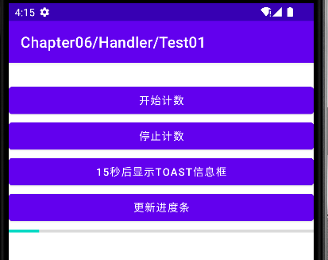
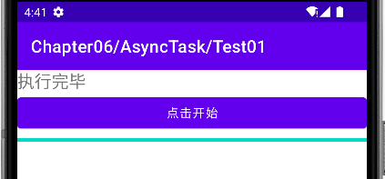
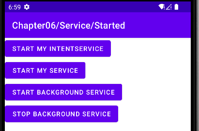
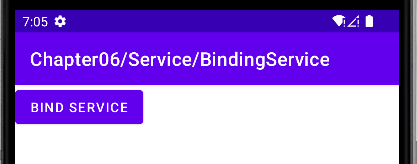
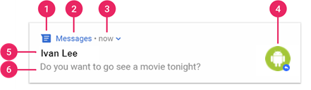

# 多任务与通知

## 基本概念

在安卓系统中，如果有一个应用程序组件是第一次被启动，而且这时候，应用程序也没有其他组件在运行，则安卓系统会为应用程序创建一个Linux进程，这个Linux进程只包含一个线程。举个例子，如果一个应用程序启动了第一个活动，这个活动里有一个文本框和一个按钮，这时安卓系统会为应用程序创建一个单个线程的Linux进程，初始化这个文本框和按钮，当这个应用程序启动另一个活动时，初始化图形组件的还是这个已经创建好的线程，不会再创建新的。也就是说，这个应用程序会一直单线程单任务运行图形组件的初始化和与图形组件相关的操作。

默认情况下，同一个应用程序的所有组件都运行在同一个进程和线程里，这个线程叫做主线程。如果一个组件启动时，应用程序的其他组件已经在运行了，则此组件会在已有的进程和线程中启动运行。如果希望安卓应用程序实现多任务，可以通过代码指定组件运行在其他进程里，或为进程创建额外的线程。下面介绍安卓的进程调度机制。

### 进程

默认情况下，同一个应用程序内的所有组件都是运行在同一个进程中的，大部分应用程序都是按照这种方式运行的。但在具体应用中，很多时候需要通过在AndroidManifest.xml文件中进行设置，指定某个特定组件归属于哪个进程。可以通过AndroidManifest.xml文件设定应用程序归属的进程。AndroidManifest.xml文件中的每种组件元素——\<activity\>、\<service\>、\<receiver\>和\<provider\>——都支持定义android:process属性，用于指定组件运行的进程。设置这个属性就可实现每个组件在各自的进程中运行，或者某几个组件共享一个进程而其他组件运行于独立的进程。设置这个属性也可以让不同应用程序的组件运行在同一个进程中，这就实现了多个应用程序共享同一个Linux用户ID、赋予同样的权限。\<application\>元素也支持android:process属性，用于指定所有组件的默认进程。

安卓一个重要并且特殊的特性就是，一个应用的进程的生命周期不是由应用程序自身直接控制的，而是由系统根据运行中的应用的一些特征来决定的，包括这些应用程序对用户的重要性、系统的全部可用内存。大部分情况下，每个安卓应用程序都将运行在自己的Linux进程当中。当这个应用的某些代码需要执行时，进程就会被创建，并且将保持运行，直到该进程不再需要，而系统需要释放它所占用的内存，为其他应用所用时才停止。

安卓系统试图尽可能长时间地保持应用程序进程，但为了新建或者运行更加重要的进程，总是需要清除过时进程来回收内存。为了决定保留或终止哪个进程，根据进程内运行的组件及这些组件的状态，系统把每个进程都划入一个重要性层次结构中。重要性最低的进程首先会被清除，然后是下一个最低的，依此类推，这都是回收系统资源所必需的。重要性层次结构共有五个级，以下列表按照重要程度列出了各类进程，其中第一类进程是最重要的，将最后一个被终止：前台进程\>可见进程\>服务进程\>后台进程\>空进程。

  - 前台进程：用户当前操作所必须的进程。满足以下任一条件时，进程被视作处于前台：
    
      - 正在与用户交互的活动进程（例如：活动的onResume()方法已被调用）。
    
      - 正在与用户交互的活动绑定的服务进程。
    
      - 正在运行前台Service进程，例如服务被startForeground()方法调用。
    
      - 正在运行生命周期回调方法的服务，例如：onCreate()、onStart()或onDestroy()。
    
      - 正在运行onReceive()方法的广播接收器。

一般而言，任何时刻只有很少的前台进程同时运行。只有当内存不足以维持它们同时运行时，作为最后的策略他们才会被终止。通常，终止一些前台进程是为了保证用户界面的及时响应。

  - 可见进程

如果进程没有任何前台组件、但仍会影响用户在屏幕上所见内容的进程，我们称为可见进程。满足以下任一条件时，进程被认为是可见的：如果活动不在前台但用户仍然可见，比如当前台活动打开了一个对话框，而之前的活动还允许显示在后面，但是已经无法与用户进行交互了，例如活动的onPause()方法被调用了；一个绑定到可见或前台活动的服务进程。可见进程被认为是非常重要的进程，除非无法维持所有前台进程同时运行了，它们是不会被终止的。

  - 服务进程

对于由startService()方法启动的服务进程不会升级为上述两种级别。尽管服务进程不直接和用户所见内容关联，但他们通常在执行一些用户关心的操作，比如在后台播放音乐或从网络下载数据等，因此除非内存不足以维持所有前台、可见进程同时运行，系统会保持服务进程的运行。

  - 后台进程

包含目前用户不可见活动的进程，例如活动的onStop()方法已被调用。这些进程对用户体验没有直接的影响，系统可能在任意时间终止它们，以回收内存供前台进程、可见进程及服务进程使用。通常会有很多后台进程在运行，所以被保存在一个最近最少使用列表中，以确保最近被用户使用的活动最后一个被终止。如果一个活动正确实现了生命周期方法，并保存了当前的状态，则终止此类进程不会对用户体验产生可见的影响，因为在用户返回时活动会恢复所有可见的状态。

  - 空进程

不含任何活动应用程序组件的进程，保留这种进程的唯一目的就是用作缓存，以改善下次在此进程中运行组件的启动时间。为了在进程缓存和内核缓存间平衡系统整体资源，系统经常会终止这种进程。依据进程中目前活跃组件的重要程度，安卓会给进程评估一个尽可能高的级别。例如，如果一个进程中运行着一个服务和一个用户可见的活动，则此进程会被评定为可见进程而不是服务进程。此外，一个进程的级别可能会由于其它进程的依赖而被提高，为其它进程提供服务的进程级别永远不会低于使用此服务的进程。因为运行服务的进程级别是高于后台活动进程的，所以，如果活动需要启动一个长时间运行的操作，则为其启动一个服务会比简单地创建一个工作线程更好些，尤其是在此操作时间比活动本身存在时间还要长久的情况下。

### 线程

应用程序启动时，系统会为其创建一个名为“main”的主线程。主线程非常重要，因为其负责把事件分发给相应的用户界面（包括屏幕绘图事件），也是应用程序与安卓界面组件包（来自android.widget和android.view包）进行交互的线程，因此主线程有时也被叫做界面线程。系统并不会为每个组件的实例都创建单独的线程。运行于同一个进程中的所有组件都是界面线程中实例化的，对每个组件的系统调用也都是由界面线程分发的。

如果应用程序在与用户交互的同时需要执行繁重的任务，用户单线程模式可能会导致运行性能很低下；比如说，在查询数据库时，应用程序就需要做两件事，一是需要与数据库连接，访问数据库，获取查询结果；第二件事是要初始化显示界面的组件，把获取的数据给显示出来。因为是单线程，就必须先做完第一件事后才能做第二件事。这个过程有可能因为网络状况或数据库繁忙，在访问数据库、获取结果数据时花费比较长的时间，导致不能执行用户显示界面的初始化，使得用户界面呈现出静止状态。这种状态称为界面线程阻塞。如果界面线程被阻塞超过一定时间（目前大约是5秒钟），用户就会被提示
“应用程序没有响应”（ANR）对话框，就是这个对话框。

**图** **7‑1 界面线程阻塞**

安卓的单线程模式遵守的两个规则

  - 不要阻塞界面线程。

  - 不要在界面线程之外访问安卓的界面组件包。

这样程序才能有友好的界面顺利运行。一般稍微复杂一点的应用程序，特别是需要网络访问或数据库访问的应用程序，都需要使用多任务的方式。在安卓应用程序中，创建的活动、服务、广播接收器等都是在主线程(界面线程)处理的，但一些比较耗时的操作，如I/O读写的大文件读写，数据库操作以及网络下载需要很长时间，为了不阻塞用户界面，出现ANR的响应提示窗口，这个时候可以考虑创建一个工作线程来解决，继承Thread类或者实现Runnable接口。

## 实现多任务

安卓多任务的调度和实现采用消息驱动机制。熟悉Windows编程的朋友可能知道Windows程序是消息驱动的，并且有全局的消息循环系统。而安卓应用程序也是消息驱动的，谷歌参考了Windows系统，也在安卓系统中实现了消息循环机制。安卓通过Looper、Handler、MessageQueue和Message来实现消息循环机制，安卓消息循环是针对线程的，就是说主线程和工作线程都可以有自己的消息队列和消息循环。

### 实现原理

对于多线程的安卓应用程序来说有两类线程：一类是主线程，也就是界面线程；另一类是工作线程，也就是主线程或工作线程所创建的线程。安卓的线程间消息处理机制主要是用来处理主线程跟工作线程间通信的，图
6.1是线程间通信原理图。安卓应用程序是通过消息来驱动的，即在应用程序的主线程中有一个消息循环，负责处理消息队列中的消息，比如当从网上下载文件时，为了不使主线程被阻塞，通常需要创建一个子线程来负责下载任务，同时在下载的过程将下载进度以百分比的形式在应用程序的界面上显示出来，这样既不会阻塞主线程的运行，又能获得良好的用户体验，但是安卓应用程序的子线程是不可以操作主线程的界面的，那么这个负责下载任务的子线程应该如何在应用程序界面上显示下载的进度呢？如果我们能够在子线程中往主线程的消息队列中发送消息，那么问题就迎刃而解了，因为发往主线程消息队列的消息最终是由主线程来处理的，在处理这个消息时，就可以在应用程序界面上显示下载进度了。

　　图 7‑2线程间通信原理

线程之间和进程之间是不能直接传递消息的，必须通过对消息队列和消息循环的操作来完成。安卓消息循环是针对线程的，每个线程都可以有自己的消息队列和消息循环。安卓提供了Handler
类和 Looper 类来来访问消息队列Message
Queue。Looper类是用来封装消息循环和消息队列的一个类，负责管理线程的消息队列和消息循环，用于在安卓线程中进行消息处理。Looper对象是什么呢?其实安卓中每一个线程都对应一个Looper，Looper可以帮助线程维护一个消息队列，是负责在多线程之间传递消息的一个循环器，线程通过looper对象可以读写某个消息循环队列。使用Looper.myLooper()得到当前线程的Looper对象，使用Looper.getMainLooper()可以获得当前进程的主线程的Looper对象。

一个线程可以存在，也可以不存在一个消息队列和一个消息循环，工作线程默认是没有消息循环和消息队列的，如果想让工作线程具有消息队列和消息循环，需要在线程中首先调用Looper.prepare()来创建消息队列，然后调用Looper.loop()进入消息循环，见码
7‑1。

> import android.os.Bundle;
> 
> import android.os.Handler;
> 
> import android.os.Looper;
> 
> import android.os.Message;
> 
> import android.util.Log;
> 
> import android.view.View;
> 
> import android.view.View.OnClickListener;
> 
> import androidx.appcompat.app.AppCompatActivity;
> 
> import com.example.ch06.R;
> 
> public class LooperThreadActivity extends AppCompatActivity {
> 
> private final int MSG\_HELLO = 0;
> 
> private Handler mHandler;
> 
> @Override
> 
> public void onCreate(Bundle savedInstanceState) {
> 
> super.onCreate(savedInstanceState);
> 
> setContentView(R.layout.c06\_handler\_test03);
> 
> new CustomThread().start();// 新建并启动CustomThread实例
> 
> findViewById(R.id.send\_btn).setOnClickListener(new OnClickListener()
> {
> 
> @Override
> 
> public void onClick(View v) {// 点击界面时发送消息
> 
> String str = "hello";
> 
> Log.d("Test", "MainThread is ready to send msg:" + str);
> 
> mHandler.obtainMessage(MSG\_HELLO, str).sendToTarget();//
> 发送消息到CustomThread实例
> 
> }
> 
> });
> 
> }
> 
> class CustomThread extends Thread {
> 
> @Override
> 
> public void run() {
> 
> // 建立消息循环的步骤
> 
> Looper.prepare();// 1、初始化Looper
> 
> mHandler = new Handler() {// 2、绑定handler到CustomThread实例的Looper对象
> 
> public void handleMessage(Message msg) {// 3、定义处理消息的方法
> 
> switch (msg.what) {
> 
> case MSG\_HELLO:
> 
> Log.d("Test", "CustomThread receive msg:"
> 
> \+ (String) msg.obj);
> 
> }
> 
> }
> 
> };
> 
> Looper.loop();// 4、启动消息循环
> 
> }
> 
> }
> 
> }

码 7‑1 CustomThread.java

通过码
7‑1的设置，工作线程CustomThread就具有了消息队列和消息循环的处理机制了，可以在Handler中进行消息处理。代码中定义的Handler对象，其作用是把消息加入特定的消息队列中，并分发和处理该消息队列中的消息。

> 2022-03-24 11:22:21.536 7370-7370/com.example.ch06 D/Test: MainThread
> is ready to send msg:hello
> 
> 2022-03-24 11:22:21.536 7370-7495/com.example.ch06 D/Test:
> CustomThread receive msg:hello

码 7‑2 日志输出

每个活动是一个界面线程，运行于主线程中。安卓系统在启动的时候会为活动创建一个消息队列和消息循环。一个活动中可以创建多个工作线程或者其他的组件，如果这些线程或者组件把他们的消息放入活动的主线程消息队列，那么该消息就会在主线程中处理了。因为主线程一般负责界面的更新操作，并且安卓系统中的界面控件都是单线程模式，多线程控制需要程序员实现，也就是非线程安全的，所以这种方式可以很好的实现安卓界面更新。在安卓系统中这种机制有着广泛的运用，一个工作线程是通过Handle对象把消息放入主线程的消息队列。只要Handler对象由主线程的Looper创建，那么调用Handler的sendMessage()等方法，就会把消息放入主线程的消息队列。在主线程中调用Handle的handleMessage()方法来处理消息，在这个方法中实现主线程的界面控件的操作，从而实现了工作线程和主线程之间的调度。在活动LooperThreadActivity中定义了Handler对象mHandler，并定义了一个工作进程CustomThread，在工作进程中使用对象mHandler的sendMessage()发送了一条消息到主线程的消息队列。

> 2022-03-24 11:22:21.536 7370-7370/com.example.ch06 D/Test: MainThread
> is ready to send msg:hello
> 
> 2022-03-24 11:22:21.536 7370-7495/com.example.ch06 D/Test:
> CustomThread receive msg:hello

码 7‑3 日志调试输出

可以看到有两条调试信息，显示了在这个活动运行过程中，各个模块所处的线程情况。在这个例子中，主线程在onCreate()方法中通过“new
CustomThread().start()”启动了工作线程，工作线程CustomThread中run()方法执行代码，访问了主线程Handler对象mHandler，并在调用Handler的对象mHandler时，向主线程消息队列加入了一条消息。因为Handler对象管理的Looper对象是线程安全的，不管是加入消息到消息队列和从队列读出消息都是有同步对象保护的，由于这里没有修改Handler对象，所以Handler对象不可能会出现数据不一致的问题。

工作线程和主线程运行在不同的线程中，所以必须要注意这两个线程间的竞争关系。在主线程中构造Handler对象，并且启动工作线程之后不要再修改，否则会出现数据不一致。这样在工作线程中可以放心的调用发送消息sendMessage()方法传递消息，Handler对象的handleMessage()方法将会在主线程中调用。在这个方法可以安全的调用主线程中任何变量和函数，进而完成更新界面的任务。安卓有两种方式实现多线程操作界面：

  - 第一种是创建新线程Thread，用Handler负责线程间的通信和消息。

  - 第二种方式AsyncTask异步执行任务。

### Handler

首先来看看如何使用Handle实现多任务。android.os.Handler是安卓中处理定时操作的核心类。通过Handler类，可以提交和处理一个Runnable对象。这个对象的run()方法可以立刻执行，也可以在指定时间之后执行（可以称为预约执行）。Handler类有两种主要用途：

  - 按照时间计划，在未来某时刻，对处理一个消息或执行某个Runnable实例。

  - 把一个对另外线程对象的操作请求放入消息队列中，从而避免线程间冲突。

当一个进程启动时，主线程独立执行一个消息队列，该队列管理着应用顶层的对象（例如活动、广播接收器等等）和所有创建的窗口。可以创建自己的一个线程，并通过Handler来与主线程进行通信。这可以通过在新的线程中调用主线程的Handler的postXXX()和sendMessage()方法来实现，使用post()方法实现多任务的主要步骤如下：

① 创建一个Handler对象

② 将要执行的操作写在线程对象的run()方法中

③ 使用post()方法运行线程对象

④ 如果需要循环执行，需要在线程对象的run()方法中再次调用post()方法。

> import android.os.Bundle;
> 
> import android.os.Handler;
> 
> import android.os.Looper;
> 
> import android.os.Message;
> 
> import android.util.Log;
> 
> import android.view.View;
> 
> import android.view.View.OnClickListener;
> 
> import android.widget.Button;
> 
> import android.widget.ProgressBar;
> 
> import android.widget.TextView;
> 
> import android.widget.Toast;
> 
> import androidx.appcompat.app.AppCompatActivity;
> 
> import com.example.ch06.R;
> 
> public class HandlerActivity extends AppCompatActivity implements
> OnClickListener {
> 
> private static final String TAG = "HandlerActivity";
> 
> private Handler countHandler = new Handler();
> 
> private TextView tvCount;
> 
> private ProgressBar mProgressBar;
> 
> private int count = 0;
> 
> private Runnable mRunToast = new Runnable() {
> 
> @Override
> 
> public void run() {
> 
> Toast.makeText(HandlerActivity.this, "15秒后显示Toast提示信息",
> 
> Toast.LENGTH\_LONG).show();
> 
> }
> 
> };
> 
> private Runnable mRunCount = new Runnable() {
> 
> @Override
> 
> public void run() {
> 
> // TODO Auto-generated method stub
> 
> tvCount.setText("Count：" + String.valueOf(++count));
> 
> countHandler.postDelayed(this, 1000);
> 
> }
> 
> };
> 
> private Runnable mUpateProgressBarThread = new Runnable() {
> 
> int i = 0;
> 
> @Override
> 
> public void run() {
> 
> log("Begin Thread");
> 
> i = i + 10;
> 
> // 得到一个消息对象，Message类是有Android操作系统提供
> 
> Message msg = updateProgressBarHandler.obtainMessage();
> 
> // 将msg对象的arg1参数的值设置为i,用arg1和arg2这两个成员变量传递消息，优点是系统性能消耗较少
> 
> msg.arg1 = i;
> 
> try {
> 
> // 设置当前显示睡眠1秒
> 
> Thread.sleep(1000);
> 
> } catch (InterruptedException e) {
> 
> // TODO Auto-generated catch block
> 
> e.printStackTrace();
> 
> }
> 
> // 将msg对象加入到消息队列当中
> 
> updateProgressBarHandler.sendMessage(msg);
> 
> if (i == 100) {
> 
> // 如果当i的值为100时，就将线程对象从handler当中移除
> 
> updateProgressBarHandler
> 
> .removeCallbacks(mUpateProgressBarThread);
> 
> }
> 
> }
> 
> };
> 
> // 使用匿名内部类来复写Handler当中的handleMessage方法
> 
> private Handler updateProgressBarHandler = new
> Handler(Looper.getMainLooper()) {
> 
> @Override
> 
> public void handleMessage(Message msg) {
> 
> mProgressBar.setProgress(msg.arg1);
> 
> updateProgressBarHandler.post(mUpateProgressBarThread);
> 
> }
> 
> };
> 
> @Override
> 
> public void onClick(View view) {
> 
> switch (view.getId()) {
> 
> case R.id.btnStart:
> 
> countHandler.postDelayed(mRunCount, 1000);
> 
> break;
> 
> case R.id.btnStop:
> 
> countHandler.removeCallbacks(mRunCount);
> 
> break;
> 
> case R.id.btnShowToast:
> 
> countHandler.postAtTime(mRunToast,
> 
> android.os.SystemClock.uptimeMillis() + 15 \* 1000);
> 
> break;
> 
> case R.id.btnUpdateProgressBar:
> 
> mProgressBar.setVisibility(View.VISIBLE);
> 
> updateProgressBarHandler.post(mUpateProgressBarThread);
> 
> break;
> 
> }
> 
> }
> 
> @Override
> 
> public void onCreate(Bundle savedInstanceState) {
> 
> super.onCreate(savedInstanceState);
> 
> setContentView(R.layout.c06\_handler\_test01);
> 
> ((Button) findViewById(R.id.btnStart)).setOnClickListener(this);
> 
> ((Button) findViewById(R.id.btnStop)).setOnClickListener(this);
> 
> ((Button) findViewById(R.id.btnShowToast)).setOnClickListener(this);
> 
> ((Button) findViewById(R.id.btnUpdateProgressBar))
> 
> .setOnClickListener(this);
> 
> mProgressBar = (ProgressBar) findViewById(R.id.progressBar1);
> 
> tvCount = (TextView) findViewById(R.id.tvCount);
> 
> }
> 
> private void log(String msg) {
> 
> Log.d(TAG, msg);
> 
> }
> 
> }

码 7‑4 HandlerActivity.java

  - postDelayed (Runnable r, Object token, long delayMillis)

使 Runnable添加到消息队列中，在经过指定的时间后运行。可运行对象将在附加此处理程序的线程上运行。时基是
SystemClock.uptimeMillis()。在深度睡眠中花费的时间会增加执行的额外延迟。

  - removeCallbacks (Runnable r)

删除消息队列中所有待处理的Runnable。

  - postAtTime (Runnable r, long uptimeMillis)

使 Runnable添加到消息队列中，在uptimeMillis 给定的特定时间运行。时基是
SystemClock.uptimeMillis()。在深度睡眠中花费的时间会增加执行的额外延迟。 可运行对象将在附加此处理程序的线程上运行。

图 7‑3

### AsyncTask

> 版本提示（适配 Android 16 / API 36）：AsyncTask 已在 Android 11（API 30）弃用。本节保留用于理解历史代码，新的项目应优先使用 Kotlin 协程（Coroutine）+ ViewModel，或使用 WorkManager/ExecutorService 实现异步任务。

用Handler类来在子线程中更新界面线程虽然避免了在主线程进行耗时计算，但费时的任务操作总会启动一些匿名的子线程，太多的子线程给系统带来巨大的负担，随之带来一些性能问题。因此安卓提供了一个工具类AsyncTask来实现异步执行任务。AsyncTask类擅于处理一些后台的比较耗时的任务，给用户带来良好用户体验的，不再需要子线程和Handler就可以完成异步操作并且刷新用户界面。如果要使用AsyncTask，需要创建AsyncTask类，并实现其中的抽象方法以及重写某些方法。利用AsyncTask不需要自己来写后台线程，无需终结后台线程，但是AsyncTask的方式对循环调用的方式并不太合适。

AsyncTask
旨在使主线程能够正确和轻松地使用，然而最常见的用例是集成到界面中，这会导致上下文泄漏、错过回调或配置更改时崩溃。AsyncTask在不同版本的平台上也有不一致的行为，doInBackground()会吞下异常，并且没有提供太多直接使用Executor的实用程序。AsyncTask
被设计为围绕 Thread 和 Handler 的辅助类，并不构成通用线程框架。 AsyncTasks
最适合用于短时间的操作（最多几秒钟）。如果需要保持线程长时间运行，强烈建议使用
java.util.concurrent 包提供的各种 API，例如Executor、ThreadPoolExecutor 和
FutureTask。

异步任务由在后台线程上运行的计算定义，其结果在主线程上发布。异步任务由 3 个泛型定义，称为 Params、Progress 和
Result，以及四个步骤，称为 onPreExecute、doInBackground、onProgressUpdate 和
onPostExecute。AsyncTask是抽象类，AsyncTask定义了三种泛型：Params、Progress和Result，含义分别为：

  - Params：表示启动任务执行的输入参数，比如HTTP请求的URL。

  - Progress：表示后台任务执行的百分比。

  - Result：表示后台执行任务最终返回的结果，比如String、Integer等。

通过继承一个AsyncTask类来定义一个异步任务类，安卓提供一个让程序员编写后台操作更为容易和透明AsyncTask，使得后台线程能够在界面主线程外进行处理。使用AsyncTask，需要创建AsyncTask类，并实现其中的抽象方法以及重写某些方法。利用AsyncTask不需要自己来写后台线程，无需终结后台线程，AsyncTask实现多任务。下面的例子是实现进度条的更新，实现步骤：

① 使用execute()方法触发异步任务的执行。

② 使用onPreExecute()表示执行预处理，比如绘制一个进度条控件。

③ 使用doInBackground()用于执行较为费时的操作，这个方法是AsyncTask的关键，必须覆盖重写。

④ 使用onProgressUpdate()对进度条控件根据进度值做出具体的响应。

⑤ 使用onPostExecute() 可以对后台任务的结果做出处理。

> import android.os.AsyncTask;
> 
> import android.os.Bundle;
> 
> import android.view.View;
> 
> import android.view.View.OnClickListener;
> 
> import android.widget.Button;
> 
> import android.widget.ProgressBar;
> 
> import android.widget.TextView;
> 
> import androidx.appcompat.app.AppCompatActivity;
> 
> import com.example.ch06.R;
> 
> public class AsyncTaskActivity extends AppCompatActivity implements
> OnClickListener {
> 
> private Button Btn;
> 
> private TextView txt;
> 
> private int count = 0;
> 
> private boolean isRunning = false;
> 
> private ProgressBar progressBar;
> 
> /\*\*
> 
> \* Called when the activity is first created.
> 
> \*/
> 
> @Override
> 
> public void onCreate(Bundle savedInstanceState) {
> 
> super.onCreate(savedInstanceState);
> 
> setContentView(R.layout.c06\_async\_task\_test01);
> 
> Btn = (Button) findViewById(R.id.button1);
> 
> txt = (TextView) findViewById(R.id.textView1);
> 
> progressBar = (ProgressBar) findViewById(R.id.progressBar1);
> 
> Btn.setOnClickListener(this);
> 
> }
> 
> public void onClick(View arg0) {
> 
> // TODO Auto-generated method stub
> 
> TimeTickLoad timetick = new TimeTickLoad();
> 
> timetick.execute(1000);
> 
> }
> 
> private class TimeTickLoad extends AsyncTask\<Integer, Integer,
> String\> {
> 
> // 后面尖括号内分别是参数（例子里是线程休息时间），进度(publishProgress用到)，返回值 类型
> 
> @Override
> 
> protected void onPreExecute() {
> 
> // 第一个执行方法
> 
> super.onPreExecute();
> 
> txt.setText("开始执行后台操作...");
> 
> progressBar.setVisibility(View.VISIBLE);
> 
> }
> 
> @Override
> 
> protected String doInBackground(Integer... params) {
> 
> // 第二个执行方法,onPreExecute()执行完后执行
> 
> for (int i = 0; i \<= 10; i++) {
> 
> publishProgress(i \* 10);
> 
> try {
> 
> Thread.sleep(params\[0\]);
> 
> } catch (InterruptedException e) {
> 
> e.printStackTrace();
> 
> }
> 
> }
> 
> return "执行完毕";
> 
> }
> 
> @Override
> 
> protected void onProgressUpdate(Integer... progress) {
> 
> super.onProgressUpdate(progress);
> 
> // 这个函数在doInBackground调用publishProgress时触发，虽然调用时只有一个参数
> 
> // 但是这里取到的是一个数组,所以要用progesss\[0\]来取值
> 
> // 第n个参数就用progress\[n\]来取值
> 
> progressBar.setProgress(progress\[0\]);
> 
> }
> 
> @Override
> 
> protected void onPostExecute(String result) {
> 
> // doInBackground返回时触发，换句话说，就是doInBackground执行完后触发
> 
> // 这里的result就是上面doInBackground执行后的返回值，所以这里是"执行完毕"
> 
> super.onPostExecute(result);
> 
> txt.setText(result);
> 
> }
> 
> }
> 
> }

码 7‑5 AsyncTaskActivity.java

图 7‑4 AsyncTask

### 并发包

java.util.concurrent 包含许多线程安全、测试良好、高性能的并发构建块。创建 java.util.concurrent
的目的就是要实现 Collection
框架对数据结构所执行的并发操作。通过提供一组可靠的、高性能并发构建块，开发人员可以提高并发类的线程安全、可伸缩性、性能、可读性和可靠性。实用程序类在并发编程中通常很有用，包括一些小的标准化可扩展框架，以及一些提供有用功能但在其他方面乏味或难以实现的类。以下是主要组件的简要说明：

  - 执行器

Executor 是一个简单的标准化接口，用于定义自定义的类线程子系统，包括线程池、异步 I/O 和轻量级任务框架。根据正在使用的具体
Executor 类，任务可能在新创建的线程、现有的任务执行线程或调用执行的线程中执行，并且可能顺序执行或并发执行。
ExecutorService 提供了更完善的异步任务执行框架。 ExecutorService 管理任务的排队和调度，并允许受控关闭。
ScheduledExecutorService 子接口和相关接口增加了对延迟和定期任务执行的支持。ExecutorServices
提供了安排异步执行任何表示为 Callable 的函数的方法，Callable 是 Runnable
的结果承载模拟。Future
返回函数的结果，允许确定执行是否已完成，并提供取消执行的方法。RunnableFuture
是一个拥有run()方法的 Future，该方法在执行时设置其结果。类 ThreadPoolExecutor 和
ScheduledThreadPoolExecutor
提供了可调的、灵活的线程池。Executors类为最常见的执行器种类和配置提供工厂方法，以及一些使用它们的实用方法。其他基于
Executors的实用程序包括具体类 FutureTask，它提供了 Future的通用可扩展实现，以及
ExecutorCompletionService，它有助于协调异步任务组的处理。ForkJoinPool 类提供了一个
Executor，主要用于处理 ForkJoinTask
及其子类的实例。这些类采用工作窃取调度程序，该调度程序为符合计算密集型并行处理中通常存在的限制的任务获得高吞吐量。

  - 队列

ConcurrentLinkedQueue 类提供了一个高效的可扩展线程安全非阻塞 FIFO 队列。 ConcurrentLinkedDeque
类类似，但另外支持 Deque 接口。java.util.concurrent 中的五个实现支持扩展 BlockingQueue
接口，该接口定义了 put 和 take
的阻塞版本：LinkedBlockingQueue、ArrayBlockingQueue、SynchronousQueue、PriorityBlockingQueue
和 DelayQueue。不同的类涵盖了生产者-消费者、消息传递、并行任务和相关并发设计的最常见使用上下文。扩展接口 TransferQueue
和实现 LinkedTransferQueue
引入了同步传输方法（以及相关功能），其中生产者可以选择阻塞等待其消费者。BlockingDeque
接口扩展了 BlockingQueue 以支持 FIFO 和 LIFO（基于堆栈）操作。 LinkedBlockingDeque
类提供了一个实现。

  - 定时

TimeUnit 类提供了多个粒度（包括纳秒）来指定和控制基于超时的操作。其中大多数类都包含基于超时和无限期等待的操作。
在所有使用超时的情况下，超时指定方法在指示它超时之前应该等待的最短时间。
实现尽最大努力在超时发生后尽快检测到超时。
但是，在检测到超时和在该超时后再次实际执行的线程之间可能会经过不确定的时间量。
所有接受超时参数的方法都将小于或等于零的值视为根本不等待。 要永远等待，可以使用 Long.MAX\_VALUE 的值。

  - 同步器

五个类帮助常见的专用同步习惯用法。

  - Semaphore 是一个经典的并发工具。

  - CountDownLatch 是一个非常简单但非常常用的实用程序，用于阻塞直到给定数量的信号、事件或条件成立。

  - CyclicBarrier 是一个可重置的多路同步点，在某些并行编程风格中很有用。

  - Phaser 提供了一种更灵活的屏障形式，可用于控制多个线程之间的分阶段计算。

  - Exchanger 允许两个线程在一个集合点交换对象，并且在多个管道设计中很有用。

<!-- end list -->

  - 并发集合

除了队列之外，这个包还提供设计用于多线程上下文的集合实现：ConcurrentHashMap、ConcurrentSkipListMap、ConcurrentSkipListSet、CopyOnWriteArrayList
和 CopyOnWriteArraySet。当期望许多线程访问给定的集合时，ConcurrentHashMap 通常比同步的 HashMap
更可取，而 ConcurrentSkipListMap 通常比同步的 TreeMap
更可取。当预期的读取和遍历次数大大超过对列表的更新次数时，CopyOnWriteArrayList
比同步的 ArrayList 更可取。

此包中的某些类使用的“并发”前缀是一种简写，表示与类似“同步”类的几个不同之处。例如 java.util.Hashtable 和
Collections.synchronizedMap(new HashMap()) 是同步的，但是 ConcurrentHashMap
是并发的。并发集合是线程安全的，但不受单个排除锁的控制。在 ConcurrentHashMap
的特殊情况下，它安全地允许任意数量的并发读取以及大量的并发写入。当需要通过单个锁阻止对集合的所有访问时，“同步”类可能很有用，但代价是可伸缩性较差。在期望多个线程访问公共集合的其他情况下，“并发”版本通常更可取。当集合不共享或仅在持有其他锁时才可访问时，非同步集合更可取。大多数并发
Collection 实现（包括大多数队列）也不同于通常的 java.util 约定，因为它们的 Iterators 和
Spliterators 提供弱一致而不是快速失败遍历：

  - 它们可能与其他操作同时进行

  - 他们永远不会抛出 ConcurrentModificationException

  - 它们保证遍历元素，因为它们在构造时就存在一次，并且可能（但不保证）反映构造后的任何修改。

## 理解服务

服务是安卓的四大组件之一，用于支持安卓系统的后台进程。服务是一个能够在后台执行长时间运行的操作应用程序组件，不提供用户界面，安卓的其它应用的组件可以在后台启动一个服务运行，即使用户切换到另一个应用此服务也会继续运行。安卓服务组件就像是Windows系统服务或者Unix的守护进程，这些都是后台进程而不是可见。服务不能与用户交互，也不能自己启动，需要调用Context.startService()或bindService()来启动，在后台运行。当应用程序需要进行某种不要的前台显示的计算或数据处理时，就可以启动一个服务来完成，每个服务都继承自android.app包下的Service类。每个服务都必须在AndroidManifest.xml中通过\<service\>进行声明。服务具有自己的生命周期，服务的生命周期是与活动生命周期分离的，当活动被暂停、停止或者销毁时，服务组件还可以继续处理其他任务，例如一个服务可以处理网络事务、播放音乐、执行文件I/O、或者跟内容提供器交互，所有这些都是在后台完成的。

安卓支持服务有两个原因，一是允许方便的执行后台任务，还有就是实现同一设备上应用之间的跨进程通信。基于这两个原因，安卓系统支持两种类型服务，分别是本地服务和远程服务。本地服务是指只可以被驻留服务的应用访问的服务，而不能被本设备上的其他应用访问；远程服务既可以被其所驻留的应用访问，也可以被设备上的其他应用访问。例如在开发一个邮件应用时，我们可以创建一个本地服务实现邮件的发送，这是由于邮件的发送需要网络连接，这是一个耗时操作，需要后台执行；另外一种情况，如果一个设备上很多程序都需要一个通用的翻译功能，可以创建一个远程服务实现翻译功能，而不是在每个应用中都实现这个功能。

安卓
SDK包括了Service类，其中的代码封装了服务的行为，但是服务与上面介绍的AsyncTask不同，一个Service对象不会自动创建自己的线程，而是运行在服务的宿主进程的主线程中。这就意味着如果服务要做一些频繁的CPU工作（如MP3的回放或网络操作）就会阻塞主线程，应该在这个服务中创建一个新的线程来做这项工作。通过使用一个单独的线程，会减少应用程序不响应（ANR）的错误风险，并且应用程序的主线程能够保留给用户，专用于跟活动的交互，如果要创建一个服务，有两种方式：

  - 启动方式(startService)，通过startService()方法启动

  - 绑定方式(bindService)，通过bindService()方法启动

应用程序组件可以通过调用Context.startService()方法获得服务，这个过程也是使服务生效的过程，例如在活动中调用startService()方法。可以通过调用Context.startService()启动服务；然后通过调用Context.stopService()或Service.stopSelf()停止服务。服务一旦启动，生命周期就独立于启动它的组件，直到被显式停止或被系统回收。通常一个被启动的服务只有一个单一操作，并且不给调用者返回结果，例如这个服务可能在网络上下载或上传文件。当操作完成的时候，服务应该自己终止。如果仅以启动方式使用的服务，这个服务需要具备自管理的能力，且不需要通过方法调用向外部组件提供数据或功能。

应用程序组件也可以通过调用bindService()方法启动和绑定一个服务，通过ServiceConnection或直接获取服务中的状态和数据信息，例如使用活动的bindService()方法。被绑定的服务会提供一个允许组件跟服务交互的客户端接口，用于发送请求、获取结果、甚至是跨进程的进程间通信实现远程服务。应用组件绑定服务后，可以使用ServiceConnection获取服务对象，并且调用服务中的方法。应用组件通过Context.bindService()方法绑定服务，并且建立ServiceConnection；通过Context.unbindService()方法解除绑定，并且停止ServiceConnection。如果在绑定过程中服务没有启动，Context.bindService()会自动启动服务。同一个服务可以绑定多个ServiceConnection，这样可以同时为多个不同的组件提供服务。一个被绑定服务的运行时间跟绑定它的应用程序组件一样长。多个组件能够绑定一个服务，但是只有所有这些绑定被解绑后，这个服务才被销毁。

这两种获得服务的方法并不是完全独立的，在某些情况下可以混合使用。例如在MP3播放器中，我们可以通过Context.startService()方法启动音乐播放的后台服务，但在播放过程中如果用户需要暂停音乐播放，则需要通过Context.bindService()获取ServiceConnection和服务对象，进而通过调用服务对象中的方法暂停音乐播放，并保存相关信息。在这种情况下，如果调用Context.stopService()并不能够停止服务，需要在所有的ServiceConnection关闭后，服务才能够真正的停止。无论使用上述两种方式的一种，还是同时使用这两种方式获得服务，都需要使用到意图，这与获得活动组件的方式相同。

简单地说，服务是一种即使用户未与应用交互也可在后台运行的组件，因此只有在需要服务时才应创建服务。如果必须在主线程之外执行操作，但只在用户与应用交互时执行此操作，则应创建新线程，例如只是想在活动运行的同时播放一些音乐，则可在
onCreate()中创建线程，在onStart()中启动线程运行，然后在onStop()中停止线程。还可考虑使用
HandlerThread、ExecutorService 或 Coroutine，而非传统的 Thread
类。请记住，如果确实要使用服务，则默认情况下它仍会在应用的主线程中运行，因此如果服务执行的是密集型或阻止性操作，则仍应在服务内创建新线程。

### [生命周期](http://blog.csdn.net/fireofstar/article/details/7299443)

虽然服务的生命周期比活动的生命周期简单，但服务的生命周期非常重要。因为服务在后台运行，有时用户甚至意识不到它的存在，所以我们更多关注于服务如何创建和销毁。服务的生命周期根据创建一个服务的方式不同而有所不同，见图
7‑5，分别是启动方式和绑定方式。

**图** **7‑5
服务的[生命周期](http://blog.csdn.net/fireofstar/article/details/7299443)**

使用startService()创建服务时，一个组件调用startService()方法创建服务，然后服务会持续运行，直到调用stopSelf()方法或stopService()方法结束。使用绑定方式(bindService)创建服务时，当有一个组件调用bindService()方法时，服务就会被绑定，客户端通过IBinder接口与服务通信。客户端能够调用unbindService()方法来解除与服务的绑定。可以有多个客户端绑定到一个服务上，但是当所有的绑定都被解除以后，系统才会销毁这个服务，而服务不需要终止自己。这两种是完全独立的，能够绑定一个已经用startService()方法启动的服务，例如可以通过调用startService()方法启动后台的音乐服务，这个方法使用意图标识了要播放的音乐；之后如果用户想要进行一些播放器的控制时，或想要获取有关当前歌曲信息时，可以在一个活动中通过调用bindService()方法来绑定这个服务，这时直到所有的客户端解绑后，stopService()或stopSelf()方法才能实际终止这个服务。  

> 版本提示（Android 8.0+）：应用在后台时，系统对后台服务启动有严格限制。长时间任务通常应使用 WorkManager；确需立即对用户可感知任务执行时，应使用前台服务（Foreground Service）并及时调用 startForeground() 显示通知。

要创建一个服务，必须创建一个Service类的子类。服务实现中，需要重写一些处理服务生命周期关键特征的回调方法，并且给组件提供一种合适的绑定服务的机制，需要重写的回调方法包括：

  - onStartCommand()

当一个组件通过调用startService()方法请求启动一个服务时，系统会调用这个服务的onStartCommand()方法。一旦这个方法执行了，那么这个服务就被启动，并在满足平台限制的前提下继续运行。实现了这个方法，当服务的工作结束时，必须调用stopSelf()方法或stopService()方法来终止服务。如果只让服务提供绑定的能力，不需要实现这个方法。

  - onBind()

当一个组件想通过调用bindService()方法跟这个服务（如执行RPC）绑定时，系统会调用这个方法。在这个方法的实现中，必须通过返回一个IBinder对象给客户提供一个用户跟服务进行交互的接口。这个方法必须实现，但是如果你不允许绑定，那么这个方法应该返回null。

  - onCreate()

当服务被第一次创建时，系统会调用这个方法来执行一次安装过程。这个方法在onStartCommand()或onBind()方法之前调用。如果服务正在运行，这个方法就不会被调用。

  - onDestroy()

当服务不再使用或正在销毁时，系统会调用这个方法。服务需要使用这个方法来实现一些清理资源的工作，如清理线程、被注册的监听器、接受器等。这是服务能够接受的最后的调用。

如果组件通过调用startService()方法启动服务，这样会调用服务onStartCommand()方法，那么这个服务就会一直运行，一直到自己用stopSelf()方法终止服务；或另一个组件通过调用stopService()方法来终止它。如果一个组件调用bindService()方法来创建这个服务，并且没有调用onStartCommand()方法，那么这个服务的运行时间与绑定它的组件运行时间一样长，一旦这个服务从所有的客户端解绑，系统就会销毁它，而不需服务自己或其他组件停止。

安卓系统只有在内存不足，并且为用户提供界面响应而必须释放系统资源时，才会强制终止一个服务。如果服务是被一个正在与用户进行交互的活动绑定，那么它被杀死的可能性很小；如果这个服务被声明运行在前台，那么其也几乎不能被杀死。但是，如果这个服务被启动并且长时间运行，那么随着时间的推移系统会降低它在后台任务列表中位置，并且这个服务将很容易被杀死；如果服务是组件通过startService()方法启动了，那么我们必须把它设计成能够通过系统妥善地处理重启。如果系统为了释放资源杀死了服务，就需要当资源可用时怎样有效重启服务，当然这依赖于onStartCommand()方法的返回值。像活动一样，服务也有生命周期回调方法，可以通过实现这些回调方法来监测服务内状态的改变，在合适的时机执行工作。码
7‑6示例了每个生命周期的回调方法。

> public class ExampleService extends Service {
> 
> int mStartMode; // indicates how to behave if the service is killed
> 
> IBinder mBinder; // interface for clients that bind
> 
> boolean mAllowRebind; // indicates whether onRebind should be used
> 
> @Override
> 
> public void
> [onCreate](http://developer.android.com/reference/android/app/Service.html#onCreate\(\))()
> {
> 
> // The service is being created
> 
> }
> 
> @Override
> 
> public int onStartCommand(Intent intent, int flags, int startId) {
> 
> // The service is starting, due to a call to startService()
> 
> return mStartMode;
> 
> }
> 
> @Override
> 
> public IBinder
> [onBind](http://developer.android.com/reference/android/app/Service.html#onBind\(android.content.Intent\))(Intent
> intent) {
> 
> // A client is binding to the service with bindService()
> 
> return mBinder;
> 
> }
> 
> @Override
> 
> public boolean onUnbind(Intent intent) {
> 
> // All clients have unbound with unbindService()
> 
> return mAllowRebind;
> 
> }
> 
> @Override
> 
> public void onRebind(Intent intent) {
> 
> // A client is binding to the service with bindService(),
> 
> // after onUnbind() has already been called
> 
> }
> 
> @Override
> 
> public void onDestroy() {
> 
> // The service is no longer used and is being destroyed
> 
> }
> 
> }

码 7‑6 ExampleService.java

像活动一样，所有的服务都必须在应用程序的清单文件中声明。要声明服务就要给\<application\>元素添加一个\<service\>子元素，例如：

> \<manifest ... \>
> 
> ...
> 
> \<application ... \>
> 
> \<service android:name=".ExampleService" /\>
> 
> ...
> 
> \</application\>
> 
> \< /manifest\>

码 7‑7

在\<service\>元素中还包括了一些其他的属性定义，如启动服务所需的许可和服务应该运行在哪个进程中。android:name属性是唯一必须的属性，它指定了这个服务的类名。一旦应用发布了，就不应该改变这个名字，因为如果修改了，就会中断那些使用意图引用这个服务的功能。关于在清单文件中声明服务的更多信息，参考\<service\>元素的说明。

就像活动一样，一个服务也能够定义意图过滤器，允许其他组件使用隐含的意图来调用这个服务。通过声明意图过滤器，安装在用户设备上的任何应用程序组件都能在符合条件下启动该服务。

### 创建服务

安卓的一个组件可以通过调用startService()方法创建一个启动类型的Service，并调用服务的onStartCommand()方法来启动服务。服务被启动后，具有独立于启动组件的生命周期。  

在较新系统版本中，这一机制还受到后台执行限制：  

  - Android 8.0（API 26）及以上：后台应用不能随意启动后台服务。  
  - Android 12（API 31）及以上：对前台服务启动时机与行为有更严格约束。  
  - Android 14（API 34）及以上：前台服务类型（foregroundServiceType）与权限要求更严格。  

因此，新的应用应将“可延迟后台任务”优先迁移到 WorkManager，把 Service 主要用于“用户可感知、需要立即执行”的任务。

活动之类的应用程序组件在通过调用startService()方法来启动服务时，需要给指定的Service传递一个意图对象，携带一些服务所使用的数据。服务在onStartCommand()方法中接受这个意图对象，例如一个活动需要把一些数据保存到在线数据库中，这个活动就能启动一个服务，并且把要保存的数据通过一个意图对象传递给startService()方法。这个服务在onStartCommand()方法中接受这个意图对象，连接到互联网，并且执行数据库事务。当事务结束，这个服务就自己终止并销毁。

但是，服务运行的进程与声明它的应用程序的进程是同一个进程，并且是在应用程序的主线程中。默认情况下，如果服务要执行密集或阻塞操作，而用户又要跟同一个应用程序的一个活动进行交互，那么这个服务就会降低活动的性能。要避免影响应用程序的性能，需要在服务的内部启动一个新的线程。创建启动类型的服务，通常可以通过两种方式来实现：

  - 继承Service

Service是所有服务的基类。当通过继承这个类创建启动类型服务时，重要的是要给这个服务创建一个新的线程，避免其占用应用程序的主线程，影响正在运行的活动的性能。

  - 历史方案：IntentService（已弃用）

IntentService是Service类的子类，可以使用工作线程依次处理启动请求。  

> 版本提示（Android 11 / API 30 起）：IntentService 已弃用。新代码应优先使用 WorkManager；如需进程内串行任务，可使用 Coroutine + Dispatcher/Executor + Service 组合。

#### WorkManager（推荐）

在新项目中，原来由 IntentService 处理的“可延迟后台任务”应优先迁移到 WorkManager。WorkManager 提供了系统感知的任务调度能力，能够在应用进程被杀后继续执行，并自动适配不同 Android 版本的后台执行限制。

下面给出一个等价于“后台模拟下载 5 秒”的最小示例。首先定义一个 Worker：

> import android.content.Context;
> 
> import androidx.annotation.NonNull;
> import androidx.work.Data;
> import androidx.work.Worker;
> import androidx.work.WorkerParameters;
> 
> public class DownloadWorker extends Worker {
> 
> public static final String KEY_URL = "key_url";
> 
> public DownloadWorker(@NonNull Context context, @NonNull WorkerParameters params) {
> super(context, params);
> }
> 
> @NonNull
> @Override
> public Result doWork() {
> String url = getInputData().getString(KEY_URL);
> try {
> // 模拟耗时任务，例如下载或同步
> Thread.sleep(5000);
> return Result.success();
> } catch (InterruptedException e) {
> // 被中断时让系统按策略重试
> return Result.retry();
> }
> }
> 
> public static Data buildInput(String url) {
> return new Data.Builder().putString(KEY_URL, url).build();
> }
> }

码 7‑8 DownloadWorker.java

然后在页面中提交任务：

> import androidx.work.Constraints;
> import androidx.work.ExistingWorkPolicy;
> import androidx.work.NetworkType;
> import androidx.work.OneTimeWorkRequest;
> import androidx.work.WorkManager;
> 
> Constraints constraints = new Constraints.Builder()
> .setRequiredNetworkType(NetworkType.CONNECTED)
> .build();
> 
> OneTimeWorkRequest request =
> new OneTimeWorkRequest.Builder(DownloadWorker.class)
> .setConstraints(constraints)
> .setInputData(DownloadWorker.buildInput("https://example.com/file.zip"))
> .addTag("download_task")
> .build();
> 
> WorkManager.getInstance(this).enqueue(request);

码 7‑9 EnqueueWork.java

如果需要避免重复入队，可使用唯一任务名：

> WorkManager.getInstance(this).enqueueUniqueWork(
> "sync_once",
> ExistingWorkPolicy.KEEP,
> request
> );

码 7‑10 EnqueueUniqueWork.java

与 IntentService 相比，WorkManager 的优势在于：

  - 自动遵循系统后台限制，跨版本行为更稳定。  
  - 支持约束条件（网络、电量、充电状态等）与重试策略。  
  - 支持链式任务与唯一任务，便于避免重复执行。  

如果任务必须“立即执行且用户可感知”（如运动追踪、导航、通话），应使用前台服务，而不是 WorkManager。

#### Service

如果任务不适合 WorkManager（例如需要与前台通知深度协作，或需要更细粒度地控制服务生命周期），可以定义 Service 的子类自行管理线程与队列。码
7‑11示例展示了继承 Service 的方式：它对每个启动请求分发后台处理逻辑，并在处理完成后主动结束对应请求。

> public class HelloService extends Service {
> 
> private Looper mServiceLooper;
> 
> private ServiceHandler mServiceHandler;
> 
> // Handler that receives messages from the thread
> 
> private final class ServiceHandler extends Handler {
> 
> public ServiceHandler(Looper looper) {
> 
> super(looper);
> 
> }
> 
> @Override
> 
> public void handleMessage(Message msg) {
> 
> // Normally we would do some work here, like download a file.
> 
> // For our sample, we just sleep for 5 seconds.
> 
> long endTime = System.currentTimeMillis() + 5\*1000;
> 
> while (System.currentTimeMillis() \< endTime) {
> 
> synchronized (this) {
> 
> try {
> 
> wait(endTime - System.currentTimeMillis());
> 
> } catch (Exception e) {
> 
> }
> 
> }
> 
> }
> 
> // Stop the service using the startId, so that we don't stop
> 
> // the service in the middle of handling another job
> 
> stopSelf(msg.arg1);
> 
> }
> 
> }
> 
> @Override
> 
> public void onCreate() {
> 
> // Start up the thread running the service. Note that we create a
> 
> // separate thread because the service normally runs in the process's
> 
> // main thread, which we don't want to block. We also make it
> 
> // background priority so CPU-intensive work will not disrupt our UI.
> 
> HandlerThread thread = new HandlerThread("ServiceStartArguments",
> 
> Process.THREAD\_PRIORITY\_BACKGROUND);
> 
> thread.start();
> 
> // Get the HandlerThread's Looper and use it for our Handler
> 
> mServiceLooper = thread.getLooper();
> 
> mServiceHandler = new ServiceHandler(mServiceLooper);
> 
> }
> 
> @Override
> 
> public int onStartCommand(Intent intent, int flags, int startId) {
> 
> Toast.makeText(this, "service starting", Toast.LENGTH\_SHORT).show();
> 
> // For each start request, send a message to start a job and deliver
> the
> 
> // start ID so we know which request we're stopping when we finish the
> job
> 
> Message msg = mServiceHandler.obtainMessage();
> 
> msg.arg1 = startId;
> 
> mServiceHandler.sendMessage(msg);
> 
> // If we get killed, after returning from here, restart
> 
> return START\_STICKY;
> 
> }
> 
> @Override
> 
> public IBinder onBind(Intent intent) {
> 
> // We don't provide binding, so return null
> 
> return null;
> 
> }
> 
> @Override
> 
> public void onDestroy() {
> 
> Toast.makeText(this, "service done", Toast.LENGTH\_SHORT).show();
> 
> }
> 
> }

码 7‑11 HelloService.java

在码
7‑11中，服务创建时会调用onCreate()方法。在onCreate()方法中创建Handler线程(HandlerThread)后启动此线程，然后获取当前线程的Looper对象来初始化服务的mServiceLooper，并创建mServicehandler对象。当一个组件通过调用startService()方法请求启动一个服务时，系统会调用这个服务的onStartCommand()方法。对于每一个启动服务的请求，都会产生一条带有startId和Intent参数的Message，并发送到MessageQueue中。ServiceHandler
通过继承Handle来实现服务请求的多任务处理。继承Service类实现服务比WorkManager方案需要更多手动管理工作，但也带来更高控制力。在码
7‑11例子中没有同时并行多个请求；如果业务需要并行处理，可以为每个请求创建新的线程并立即运行，而不必等待前一个请求完成。请注意，onStartCommand()
方法必须返回整型数。整型数用于描述系统在终止服务后如何重建服务。从 onStartCommand()
返回的值必须是以下常量之一：

  - START\_NOT\_STICKY

如果系统在 onStartCommand()
返回后终止服务，则除非有待传递的挂起意图，否则系统不会重建服务。这是最安全的选项，可以避免在不必要时以及应用能够轻松重启所有未完成的作业时运行服务。

  - START\_STICKY

如果系统在 onStartCommand() 返回后终止服务，则其会重建服务并调用
onStartCommand()，但不会重新传递最后一个意图。相反，除非有挂起意图要启动服务，否则系统会调用包含空意图的
onStartCommand()。在此情况下，系统会传递这些意图。此常量适用于不执行命令、但无限期运行并等待作业的媒体播放器（或类似服务）。

  - START\_REDELIVER\_INTENT

如果系统在 onStartCommand() 返回后终止服务，则其会重建服务，并通过传递给服务的最后一个意图调用
onStartCommand()。所有挂起意图均依次传递。此常量适用于主动执行应立即恢复的作业（例如下载文件）的服务。

#### 启动和终止

安卓的一个组件可以通过调用startService()方法创建一个启动类型的服务，并调用服务的onStartCommand()方法来启动服务。当一个服务定义完成后，可以在其它组件中通过创建符合条件的意图对象或显示指定要启动的服务，并将其传递给startService()方法。对于可延迟任务，也可以在活动中直接提交 WorkManager 任务。下面示例同时演示了这两种触发方式。

> import android.content.Intent;
> 
> import android.os.Bundle;
> 
> import android.util.Log;
> 
> import android.view.View;
> 
> import android.widget.Button;
> 
> import androidx.appcompat.app.AppCompatActivity;
> import androidx.work.OneTimeWorkRequest;
> import androidx.work.WorkManager;
> 
> import com.example.ch06.R;
> 
> public class StartServiceActivity extends AppCompatActivity {
> 
> private static final String TAG = "StartServiceActivity";
> 
> private int counter = 1;
> 
> private Button button1;
> 
> private Button button2;
> 
> private Button button3;
> 
> private Button button4;
> 
> @Override
> 
> protected void onCreate(Bundle savedInstanceState) {
> 
> // TODO Auto-generated method stub
> 
> super.onCreate(savedInstanceState);
> 
> setContentView(R.layout.c06\_started\_service\_layout);
> 
> button1 = (Button) findViewById(R.id.service\_button1);
> 
> button2 = (Button) findViewById(R.id.service\_button2);
> 
> button3 = (Button) findViewById(R.id.service\_button3);
> 
> button4 = (Button) findViewById(R.id.service\_button4);
> 
> /\*
> 
> \* 增加事件响应
> 
> \*/
> 
> button1.setOnClickListener(new Button.OnClickListener() {
> 
> public void onClick(View v) {
> 
> OneTimeWorkRequest request =
> new OneTimeWorkRequest.Builder(DownloadWorker.class)
> .setInputData(DownloadWorker.buildInput("https://example.com/file.zip"))
> .addTag("download_task_from_ui")
> .build();
> 
> WorkManager.getInstance(StartServiceActivity.this).enqueue(request);
> 
> }
> 
> });
> 
> button2.setOnClickListener(new Button.OnClickListener() {
> 
> public void onClick(View v) {
> 
> Intent intent = new Intent(StartServiceActivity.this,
> 
> HelloService.class);
> 
> startService(intent);
> 
> }
> 
> });
> 
> button3.setOnClickListener(new Button.OnClickListener() {
> 
> public void onClick(View v) {
> 
> Log.v(TAG, "Starting service... counter = " + counter);
> 
> Intent intent = new Intent(StartServiceActivity.this,
> 
> BackgroundService.class);
> 
> intent.putExtra("counter", counter++);
> 
> startService(intent);
> 
> }
> 
> });
> 
> button4.setOnClickListener(new Button.OnClickListener() {
> 
> public void onClick(View v) {
> 
> stopService();
> 
> }
> 
> });
> 
> }
> 
> @Override
> 
> public void onDestroy() {
> 
> stopService();
> 
> super.onDestroy();
> 
> }
> 
> private void stopService() {
> 
> Log.v(TAG, "Stopping service...");
> 
> if (stopService(new Intent(StartServiceActivity.this,
> 
> BackgroundService.class)))
> 
> Log.v(TAG, "stopService was successful");
> 
> else
> 
> Log.v(TAG, "stopService was unsuccessful");
> 
> }
> 
> }

码 7‑12 启动和终止

服务一旦运行，就能够使用广播通知或状态栏通知来告知用户。通常，状态栏通知是用来告知后台任务完成的最好的技术（如文件下载完成），并且用户能够采取相应的动作。启动类型的服务必须管理它自己的生命周期，除非系统要回收系统内存，否则系统不会终止或销毁这个服务。因此而这种类型的服务必须通过调用stopSelf()方法或另一个组件通过调用stopService()方法才能终止。一旦用stopSelf()方法或stopService()方法请求终止服务，那么系统一有可能就会销毁这个服务。

启动服务必须管理自己的生命周期。换言之，除非必须回收内存资源，否则系统不会停止或销毁服务，并且服务在 onStartCommand()
返回后仍会继续运行。服务必须通过调用 stopSelf() 自行停止运行，或由另一个组件通过调用 stopService()
来停止它。一旦请求使用 stopSelf() 或 stopService() 来停止服务，系统便会尽快销毁服务。如果服务同时处理多个对
onStartCommand()
的请求，则不应在处理完一个启动请求之后停止服务，因为可能已收到新的启动请求（在第一个请求结束时停止服务会终止第二个请求）。为避免此问题，可以使用
stopSelf(int) 确保服务停止请求始终基于最近的启动请求。换言之，在调用 stopSelf(int) 时，需传递与停止请求 ID
相对应的启动请求 ID（传递给 onStartCommand()的 startId）。此外，如果服务在能够调用
stopSelf(int) 之前收到新启动请求，则ID不匹配，服务也不会停止。

图 7‑6 启动和终止

### 绑定服务

绑定类型服务允许组件（如活动）绑定服务，实现发送请求、接收响应以及执行进程间通信。一个典型的绑定类型的服务只跟它所绑定的应用程序组件同时存在，并且不在后台无限期的运行。绑定类型的服务是客户端和服务端之间交互的服务端。要创建绑定类型的服务，首先要定义接口，用于指定客户端怎样跟服务进行通信。服务和客户端的之间的接口必须是一个IBinder接口的实现，并且要求必须从onBind()回调方法返回这个IBinder接口对象。一旦客户端收到了IBinder对象，它就能通过这个接口开始与服务进行交互。多个客户端能够同时绑定这个服务。当客户端完成与服务的交互时，它调用unbindService()方法来解绑。一旦没有客户端绑定这个服务了，系统就会销毁它。

客户端通过调用bindService()方法绑定服务。客户端绑定服务时，必须提供ServiceConnection类的对象，并且实现其方法，用来监视服务端的连接。bindService()方法不带有返回值，并立即返回，但是当安卓系统在客户端和服务端创建连接时，它会在ServiceConnection方法上调用onServiceConnected()方法来发送客户端跟服务端进行交互用的IBinder对象。

多个客户端能够连接到同一个服务上，但是只在第一个客户端绑定时，系统调用服务的onBind()方法来发送获取对象。然后系统会给其他任何绑定的客户端发送相同的IBinder对象，而不会再次调用onBind()方法。当最后的客户端从服务上解绑，系统就会销毁这个服务但这个服务也通过startService()方法启动了情况除外。在实现绑定类型的服务时，最重要的部分是定义onBind()回调方法返回的接口。有很多不同的方法能够定义服务的IBinder接口，在这一节下面的内容中会分别讨论这些技术，有三种方法能够定义这个接口。

  - 继承Binder

如果我们的服务对应用程序来说是私有服务，并且跟客户端运行在同一个进程中，也就是为本地服务，那么就应该通过继承Binder类来创建接口，并且通过onBind()方法返回这个接口的一个实例。客户端接收这个Binder对象，并且能够直接访问其实现的或Service中的公共方法。如果只是在后台我们自己应用程序提供服务，这是首选方法。只有被其他应用程序或者跨进程使用时，我们才考虑使用其他方法。

  - 使用Message

如果接口要跨越不同进程来进行工作，那么能用信使给服务创建接口。在这种方式中，服务定义了响应不同消息对象类型的处理器。这个处理器是一个信使的基础，它能够跟客户端共享一个IBinder对象，允许客户端使用Message对象给服务端发送命令。另外，客户端能够定义一个自己的信使，以便服务端能够给客户端发送消息。这是执行进程间通信（IPC）最简单的方法，因为信使队列的所有请求都在一个单线程中，因此不需要针对线程安全来设计你的服务。

  - 使用AIDL

AIDL为接口定义语言（Android Interface Definition
Language），用来将对象分解成操作系统能够理解的原语，并且将他们在进程之间编组，完成进程间通信。Message技术实际上是基于AIDL架构。就像前面提到的，Message在一个单线程中创建了一个所有客户端请求的队列，因此服务每次只能接收一个请求。但是，如果想要同时处理多个请求，那么我们可以直接使用AIDL。这种情况下，我们的服务必须是多线程的并且要线程安全。要使用直接AIDL，就必须创建一个定义编程接口的.aidl文件。安卓
SDK使用这个文件生成一个实现文件中定义的接口和处理IPC的抽象类，然后你能够在你的服务中进行扩展。大多数应用程序不应该使用AIDL方法来创建绑定类型的服务，因为它可能需要多线程的能力，并可能导致更复杂的实现，因此AIDL不适用于大多数应用程序。

1.  **Binder类**

如果只在应用程序的局部使用服务，并且不需要跨进程工作，程序员可以实现自己的Binder类，用它直接为客户端提供访问服务。通常，客户端和服务端只是在同一个应用和进程中工作，不为第三方应用程序提供服务。例如，对于一个需要良好工作的播放音乐的应用程序，就需要把在后台工作的播放音乐的服务与应用自己的一个活动绑定。使用继承Binder类来定义服务的IBinder接口的步骤如下：

  - (1)在服务中创建一个Binder的实例：
    
      - 这个实例包含客户端可以调用的public方法；
    
      - 这个实例返回当前Service对象，其包含客户端可以调用的public方法；
    
      - 这个实例返回Service类中的一个类对象，而这个类对象包含Client可以调用的public方法。

  - (2)在Service类的onBind()方法中返回这个Binder实例。

  - (3)在客户端的onServiceConnected()方法中获得这个Binder实例，并通过这个Binder实例调用服务端的public方法。

服务端和客户端必须在同一个应用，原因是客户端能够转换返回的对象，并正确的调用自己的APIs。服务端和客户端也必须是在同一个进程中，因为这种技术不执行任何跨进程处理。码
7‑13是通过继承Binder绑定服务的一个简单例子。

> import java.util.Random;
> 
> import android.app.Service;
> 
> import android.content.Intent;
> 
> import android.os.Binder;
> 
> import android.os.IBinder;
> 
> public class LocalService extends Service {
> 
> // Binder given to clients
> 
> private final IBinder mBinder = new LocalBinder();
> 
> // Random number generator
> 
> private final Random mGenerator = new Random();
> 
> /\*\*
> 
> \* Class used for the client Binder. Because we know this service
> always
> 
> \* runs in the same process as its clients, we don't need to deal with
> IPC.
> 
> \*/
> 
> public class LocalBinder extends Binder {
> 
> LocalService getService() {
> 
> // Return this instance of LocalService so clients can call public
> 
> // methods
> 
> return LocalService.this;
> 
> }
> 
> }
> 
> @Override
> 
> public IBinder onBind(Intent intent) {
> 
> return mBinder;
> 
> }
> 
> /\*\* method for clients \*/
> 
> public int getRandomNumber() {
> 
> return mGenerator.nextInt(100);
> 
> }
> 
> }

码 7‑13 **LocalService.java**

在码 7‑13中，LocalBinder对象给客户端提供了getService()方法，并在LocalService
的成员变量定义时，通过实例化
IBinder变量返回当前服务的实例，使得客户端用这个方法能够获取LocalService服务的当前实例。这样就允许客户端调用服务中的public方法。完成服务本身的定义后，第三步就是从客户端绑定定义完成的服务。所谓客户端就是需要与服务绑定的活动之类的组件，需要在组件中做几个工作：

  - 重写两个回调方法onServiceConnected()和OnServiceDisconnected()，实现ServiceConnection()。

  - 调用bindService()，传给它ServiceConnection的实现。

  - 使用接口定义的方法们调用服务。

  - 在需要与Service断开绑定连接时，调用unbindService()。

码
7‑14中，活动代码绑定了LocalService服务，并且在点击一个按钮时调用了服务public方法：getRandomNumber()方法。

> import android.content.ComponentName;
> 
> import android.content.Context;
> 
> import android.content.Intent;
> 
> import android.content.ServiceConnection;
> 
> import android.os.Bundle;
> 
> import android.os.IBinder;
> 
> import android.view.View;
> 
> import android.widget.Toast;
> 
> import androidx.appcompat.app.AppCompatActivity;
> 
> import com.example.ch06.R;
> 
> public class BindingServiceActivity extends AppCompatActivity {
> 
> LocalService mService;
> 
> boolean mBound = false;
> 
> /\*\*
> 
> \* Defines callbacks for service binding, passed to bindService()
> 
> \*/
> 
> private ServiceConnection mConnection = new ServiceConnection() {
> 
> @Override
> 
> public void onServiceConnected(ComponentName className, IBinder
> service) {
> 
> // We've bound to LocalService, cast the IBinder and get
> 
> // LocalService instance
> 
> LocalService.LocalBinder binder = (LocalService.LocalBinder) service;
> 
> mService = binder.getService();
> 
> mBound = true;
> 
> }
> 
> @Override
> 
> public void onServiceDisconnected(ComponentName arg0) {
> 
> mBound = false;
> 
> }
> 
> };
> 
> @Override
> 
> protected void onCreate(Bundle savedInstanceState) {
> 
> super.onCreate(savedInstanceState);
> 
> setContentView(R.layout.c06\_bind\_service\_layout);
> 
> }
> 
> @Override
> 
> protected void onStart() {
> 
> super.onStart();
> 
> // Bind to LocalService
> 
> Intent intent = new Intent(this, LocalService.class);
> 
> bindService(intent, mConnection, Context.BIND\_AUTO\_CREATE);
> 
> }
> 
> @Override
> 
> protected void onStop() {
> 
> super.onStop();
> 
> // Unbind from the service
> 
> if (mBound) {
> 
> unbindService(mConnection);
> 
> mBound = false;
> 
> }
> 
> }
> 
> /\*\*
> 
> \* Called when a button is clicked (the button in the layout file
> attaches
> 
> \* to this method with the android:onClick attribute)
> 
> \*/
> 
> public void onButtonClick(View v) {
> 
> if (mBound) {
> 
> // Call a method from the LocalService.
> 
> // However, if this call were something that might hang, then this
> 
> // request should
> 
> // occur in a separate thread to avoid slowing down the activity
> 
> // performance.
> 
> int num = mService.getRandomNumber();
> 
> Toast.makeText(this, "number: " + num, Toast.LENGTH\_SHORT).show();
> 
> }
> 
> }
> 
> }

码 7‑14 **BindingActivity.java**

码 7‑14显示了客户端怎样使用ServiceConnection接口和onServiceConnected回调方法的实现来绑定服务的。

图 7‑7 绑定服务

1.  **Messenger类**

如果服务需要与远程进程通信，就可以使用Messenger对象来给服务提供接口，使用这种方式定义服务与客户端的接口需要的步骤如下。

  - (1)在服务内部实现 Handler 接口，用于处理从每一个客户端发送过的来请求。

  - (2)使用这个 Handler 创建一个 Messenger对象。

  - (3)这个Messenger在服务的onBind() 方法中创建一个IBinder 实例，返回给客户端。

  - (4)客户端使用从服务返回的 IBinder 实例来初始化一个 Messenger， 然后用其给服务发送Messager对象。

  - (5)服务在它的处理器（Handler）的handleMessage()方法中依次接收每个Message对象，进行处理。

使用这种方法中，客户端没有调用服务端的任何方法，相反客户端会给发送服务端Message对象，服务端会在它的处理器中接受这些消息对象。下面是一个例子说明了如何使用Messenger接口定义绑定的服务，见码
7‑15。

> import android.app.Notification;
> 
> import android.app.NotificationManager;
> 
> import android.app.PendingIntent;
> 
> import android.app.Service;
> 
> import android.content.Intent;
> 
> import android.os.Handler;
> 
> import android.os.IBinder;
> 
> import android.os.Message;
> 
> import android.os.Messenger;
> 
> import android.os.RemoteException;
> 
> import android.widget.Toast;
> 
> import com.example.ch06.R;
> 
> import java.util.ArrayList;
> 
> public class MessengerService extends Service {
> 
> /\*\*
> 
> \* Command to the service to register a client, receiving callbacks
> 
> \* from the service. The Message's replyTo field must be a Messenger
> of
> 
> \* the client where callbacks should be sent.
> 
> \*/
> 
> static final int MSG\_REGISTER\_CLIENT = 1;
> 
> /\*\*
> 
> \* Command to the service to unregister a client, ot stop receiving
> callbacks
> 
> \* from the service. The Message's replyTo field must be a Messenger
> of
> 
> \* the client as previously given with MSG\_REGISTER\_CLIENT.
> 
> \*/
> 
> static final int MSG\_UNREGISTER\_CLIENT = 2;
> 
> /\*\*
> 
> \* Command to service to set a new value. This can be sent to the
> 
> \* service to supply a new value, and will be sent by the service to
> 
> \* any registered clients with the new value.
> 
> \*/
> 
> static final int MSG\_SET\_VALUE = 3;
> 
> /\*\*
> 
> \* Target we publish for clients to send messages to IncomingHandler.
> 
> \*/
> 
> final Messenger mMessenger = new Messenger(new IncomingHandler());
> 
> /\*\*
> 
> \* For showing and hiding our notification.
> 
> \*/
> 
> NotificationManager mNM;
> 
> /\*\*
> 
> \* Keeps track of all current registered clients.
> 
> \*/
> 
> ArrayList\<Messenger\> mClients = new ArrayList\<Messenger\>();
> 
> /\*\*
> 
> \* Holds last value set by a client.
> 
> \*/
> 
> int mValue = 0;
> 
> @Override
> 
> public void onCreate() {
> 
> mNM = (NotificationManager) getSystemService(NOTIFICATION\_SERVICE);
> 
> // Display a notification about us starting.
> 
> showNotification();
> 
> }
> 
> @Override
> 
> public void onDestroy() {
> 
> // Cancel the persistent notification.
> 
> mNM.cancel(R.string.remote\_service\_started);
> 
> // Tell the user we stopped.
> 
> Toast.makeText(this, R.string.remote\_service\_stopped,
> Toast.LENGTH\_SHORT).show();
> 
> }
> 
> /\*\*
> 
> \* When binding to the service, we return an interface to our
> messenger
> 
> \* for sending messages to the service.
> 
> \*/
> 
> @Override
> 
> public IBinder onBind(Intent intent) {
> 
> return mMessenger.getBinder();
> 
> }
> 
> /\*\*
> 
> \* Show a notification while this service is running.
> 
> \*/
> 
> private void showNotification() {
> 
> // In this sample, we'll use the same text for the ticker and the
> expanded notification
> 
> CharSequence text = getText(R.string.remote\_service\_started);
> 
> // The PendingIntent to launch our activity if the user selects this
> notification
> 
> PendingIntent contentIntent = PendingIntent.getActivity(this, 0,
> 
> new Intent(this, MessengerService.class),
> PendingIntent.FLAG\_IMMUTABLE);
> 
> // Set the info for the views that show in the notification panel.
> 
> Notification notification = new Notification.Builder(this)
> 
> .setSmallIcon(R.drawable.stat\_sample) // the status icon
> 
> .setTicker(text) // the status text
> 
> .setWhen(System.currentTimeMillis()) // the time stamp
> 
> .setContentTitle(getText(R.string.local\_service\_label)) // the label
> of the entry
> 
> .setContentText(text) // the contents of the entry
> 
> .setContentIntent(contentIntent) // The intent to send when the entry
> is clicked
> 
> .build();
> 
> // Send the notification.
> 
> // We use a string id because it is a unique number. We use it later
> to cancel.
> 
> mNM.notify(R.string.remote\_service\_started, notification);
> 
> }
> 
> /\*\*
> 
> \* Handler of incoming messages from clients.
> 
> \*/
> 
> class IncomingHandler extends Handler {
> 
> @Override
> 
> public void handleMessage(Message msg) {
> 
> switch (msg.what) {
> 
> case MSG\_REGISTER\_CLIENT:
> 
> mClients.add(msg.replyTo);
> 
> break;
> 
> case MSG\_UNREGISTER\_CLIENT:
> 
> mClients.remove(msg.replyTo);
> 
> break;
> 
> case MSG\_SET\_VALUE:
> 
> mValue = msg.arg1;
> 
> for (int i = mClients.size() - 1; i \>= 0; i--) {
> 
> try {
> 
> mClients.get(i).send(Message.obtain(null,
> 
> MSG\_SET\_VALUE, mValue, 0));
> 
> } catch (RemoteException e) {
> 
> // The client is dead. Remove it from the list;
> 
> // we are going through the list from back to front
> 
> // so this is safe to do inside the loop.
> 
> mClients.remove(i);
> 
> }
> 
> }
> 
> break;
> 
> default:
> 
> super.handleMessage(msg);
> 
> }
> 
> }
> 
> }
> 
> }

码 7‑15 **MessengerService.java**

码 7‑15中 IncomingHandler
类里定义的handleMessage()方法，能够接受客户端输入Message对象，并根据Message的“what”成员属性作出判断。客户端需要做的所有工作就是基于服务端返回的IBinder对象创建一个Messenger对象，并且使用这个Messenger对象的send()方法发送消息。下面的例子是一个简单的活动代码，它作为客户端绑定服务，并且给服务发送MSG\_SAY\_HELLO消息，见码
7‑15。

> import android.content.ComponentName;
> 
> import android.content.Context;
> 
> import android.content.Intent;
> 
> import android.content.ServiceConnection;
> 
> import android.os.Bundle;
> 
> import android.os.Handler;
> 
> import android.os.IBinder;
> 
> import android.os.Message;
> 
> import android.os.Messenger;
> 
> import android.os.RemoteException;
> 
> import android.view.View;
> 
> import android.widget.Button;
> 
> import android.widget.TextView;
> 
> import android.widget.Toast;
> 
> import androidx.appcompat.app.AppCompatActivity;
> 
> import com.example.ch06.R;
> 
> public class MessengerServiceActivity {
> 
> // BEGIN\_INCLUDE(bind)
> 
> /\*\*
> 
> \* Example of binding and unbinding to the remote service.
> 
> \* This demonstrates the implementation of a service which the client
> will
> 
> \* bind to, interacting with it through an aidl interface.
> 
> \*
> 
> \* Note that this is implemented as an inner class only keep the
> sample
> 
> \* all together; typically this code would appear in some separate
> class.
> 
> \*/
> 
> public static class Binding extends AppCompatActivity {
> 
> /\*\* Messenger for communicating with service. \*/
> 
> Messenger mService = null;
> 
> /\*\* Flag indicating whether we have called bind on the service. \*/
> 
> boolean mIsBound;
> 
> /\*\* Some text view we are using to show state information. \*/
> 
> TextView mCallbackText;
> 
> /\*\*
> 
> \* Handler of incoming messages from service.
> 
> \*/
> 
> class IncomingHandler extends Handler {
> 
> @Override
> 
> public void handleMessage(Message msg) {
> 
> switch (msg.what) {
> 
> case MessengerService.MSG\_SET\_VALUE:
> 
> mCallbackText.setText("Received from service: " + msg.arg1);
> 
> break;
> 
> default:
> 
> super.handleMessage(msg);
> 
> }
> 
> }
> 
> }
> 
> /\*\*
> 
> \* Target we publish for clients to send messages to IncomingHandler.
> 
> \*/
> 
> final Messenger mMessenger = new Messenger(new IncomingHandler());
> 
> /\*\*
> 
> \* Class for interacting with the main interface of the service.
> 
> \*/
> 
> private ServiceConnection mConnection = new ServiceConnection() {
> 
> public void onServiceConnected(ComponentName className,
> 
> IBinder service) {
> 
> // This is called when the connection with the service has been
> 
> // established, giving us the service object we can use to
> 
> // interact with the service. We are communicating with our
> 
> // service through an IDL interface, so get a client-side
> 
> // representation of that from the raw service object.
> 
> mService = new Messenger(service);
> 
> mCallbackText.setText("Attached.");
> 
> // We want to monitor the service for as long as we are
> 
> // connected to it.
> 
> try {
> 
> Message msg = Message.obtain(null,
> 
> MessengerService.MSG\_REGISTER\_CLIENT);
> 
> msg.replyTo = mMessenger;
> 
> mService.send(msg);
> 
> // Give it some value as an example.
> 
> msg = Message.obtain(null,
> 
> MessengerService.MSG\_SET\_VALUE, this.hashCode(), 0);
> 
> mService.send(msg);
> 
> } catch (RemoteException e) {
> 
> // In this case the service has crashed before we could even
> 
> // do anything with it; we can count on soon being
> 
> // disconnected (and then reconnected if it can be restarted)
> 
> // so there is no need to do anything here.
> 
> }
> 
> // As part of the sample, tell the user what happened.
> 
> Toast.makeText(Binding.this, R.string.remote\_service\_connected,
> 
> Toast.LENGTH\_LONG).show();
> 
> }
> 
> public void onServiceDisconnected(ComponentName className) {
> 
> // This is called when the connection with the service has been
> 
> // unexpectedly disconnected -- that is, its process crashed.
> 
> mService = null;
> 
> mCallbackText.setText("Disconnected.");
> 
> // As part of the sample, tell the user what happened.
> 
> Toast.makeText(Binding.this, R.string.remote\_service\_disconnected,
> 
> Toast.LENGTH\_LONG).show();
> 
> }
> 
> };
> 
> void doBindService() {
> 
> // Establish a connection with the service. We use an explicit
> 
> // class name because there is no reason to be able to let other
> 
> // applications replace our component.
> 
> bindService(new Intent(Binding.this,
> 
> MessengerService.class), mConnection, Context.BIND\_AUTO\_CREATE);
> 
> mIsBound = true;
> 
> mCallbackText.setText("Binding.");
> 
> }
> 
> void doUnbindService() {
> 
> if (mIsBound) {
> 
> // If we have received the service, and hence registered with
> 
> // it, then now is the time to unregister.
> 
> if (mService \!= null) {
> 
> try {
> 
> Message msg = Message.obtain(null,
> 
> MessengerService.MSG\_UNREGISTER\_CLIENT);
> 
> msg.replyTo = mMessenger;
> 
> mService.send(msg);
> 
> } catch (RemoteException e) {
> 
> // There is nothing special we need to do if the service
> 
> // has crashed.
> 
> }
> 
> }
> 
> // Detach our existing connection.
> 
> unbindService(mConnection);
> 
> mIsBound = false;
> 
> mCallbackText.setText("Unbinding.");
> 
> }
> 
> }
> 
> // END\_INCLUDE(bind)
> 
> /\*\*
> 
> \* Standard initialization of this activity. Set up the UI, then wait
> 
> \* for the user to poke it before doing anything.
> 
> \*/
> 
> @Override
> 
> protected void onCreate(Bundle savedInstanceState) {
> 
> super.onCreate(savedInstanceState);
> 
> setContentView(R.layout.messenger\_service\_binding);
> 
> // Watch for button clicks.
> 
> Button button = (Button)findViewById(R.id.bind);
> 
> button.setOnClickListener(mBindListener);
> 
> button = (Button)findViewById(R.id.unbind);
> 
> button.setOnClickListener(mUnbindListener);
> 
> mCallbackText = (TextView)findViewById(R.id.callback);
> 
> mCallbackText.setText("Not attached.");
> 
> }
> 
> private View.OnClickListener mBindListener = new
> View.OnClickListener() {
> 
> public void onClick(View v) {
> 
> doBindService();
> 
> }
> 
> };
> 
> private View.OnClickListener mUnbindListener = new
> View.OnClickListener() {
> 
> public void onClick(View v) {
> 
> doUnbindService();
> 
> }
> 
> };
> 
> }
> 
> }

码 7‑16 ActivityMessenger.java

在前面的例子中，通过Message定义接口，实现了客户端向服务发送消息，服务中的Handler对消息作出响应和处理。但这个例子实现的仅是单向通信，即客户端给服务发送消息，并没有实现服务处理完成后向客户端发送消息，如果需要服务给客户端发送消息又该如何实现呢？这个实现的过程与前面5步类似，只是客户端和服务在实现过程中角色有所变化，可以接着上面的步骤继续来实现双向通信。

  - (6)在客户端中创建一个Handler对象，用于处理服务发过来的消息

  - (7)使用客户端中的这个Handler对象创建一个客户端自己的Messenger对象

  - (8)在前面第4步，客户端获取了服务的Messenger对象，并通过其来给服务发送消息。在向服务发送消息之前，将Message对象的replyTo字段设置成第7步创建的Messenger对象。

  - (9)服务的Handler处理Message时，将Message对象的replyTo字段提取出来，并使用其给客户端发送消息。

这样我们就实现了客户端和服务的双向通信，客户端和服务都有自己的Handler和Messenger对象，使得对方可以给自己发送消息，客户端的Messenger是通过Message的replyTo传递给服务的。

图 7‑8 Messenger服务

## 通知管理

通知即是一个消息，可以在应用程序界面显示其图形标记提示用户。例如当用户操作应用时，如果有电话、短信或者邮件到达，可以向系统提交一个通知，它会首先以图标的形式显示在设备的状态栏位置，在手机的状态栏上就会出现一个小图标，提示用户处理这个消息，如**图
7‑6**所示。用户手从上方滑动状态栏就可以展开查看通知的详细信息，并进行处理。

**图** **7‑9通知**

### 基本概念

通知可以在不同的位置以不同的格式显示，例如，状态栏中的图标、抽屉式通知栏中比较详细的条目、应用图标上的标志，以及在配对的穿戴式设备上自动显示。发出通知后，通知会先以图标的形式显示在状态栏中（图
7‑7）。用户可以在状态栏向下滑动以打开抽屉式通知栏（图 7‑8），并在其中查看更多详情及对通知执行操作。

<table>
<tbody>
<tr class="odd">
<td>

图 7‑10 通知图标显示在状态栏的左侧
</td>
<td>

图 7‑11 抽屉式通知栏中的通知
</td>
</tr>
</tbody>
</table>

用户可以向下拖动抽屉式通知栏中的某条通知以查看展开后的视图，其中会显示更多内容以及操作按钮。在应用或用户关闭通知之前，通知会一直显示在抽屉式通知栏中。从安卓5.0
开始，通知可以短暂地显示在浮动窗口中，称之为提醒式通知（图
7‑10）。这种行为通常适用于用户应立即知晓的重要通知，而且仅在设备未锁定时才会显示。

<table>
<tbody>
<tr class="odd">
<td>

图 7‑12显示在前台应用前面的提醒式通知
</td>
<td>

图 7‑13 锁定屏幕上已隐藏敏感内容的通知
</td>
</tr>
</tbody>
</table>

提醒式通知会在应用发出通知后立即出现，稍后便会消失，但仍照常显示在抽屉式通知栏中。例如，以下情况可能会触发提醒式通知：

  - 用户的活动处于全屏模式（应用使用 [fullScreenIntent](https://developer.android.com/reference/android/app/Notification#fullScreenIntent)）。

  - 通知的优先级很高，且在搭载安卓7.1（API 级别 25）及更低版本的设备上使用铃声或振动。

  - 在搭载安卓8.0（API 级别 26）及更高版本的设备上，通知渠道的重要程度比较高。

从安卓5.0 开始，通知可以显示在锁定屏幕上（图
7‑10）。可以采用编程方式设置应用在安全锁定屏幕上所发布通知的详情可见等级，甚至可以设置通知是否显示在锁定屏幕上。用户可以通过系统设置来选择锁定屏幕通知的详情可见等级，包括选择停用所有锁定屏幕通知。从安卓8.0
开始，用户可以选择停用或启用各个通知渠道的锁定屏幕通知。在搭载安卓8.0（API 级别
26）及更高版本的设备上支持的启动器中，应用图标通过在相应的应用启动器图标上显示彩色“标志”（又称“通知圆点”）来表示有新通知。用户可以长按应用图标来查看该应用的通知，然后用户可以从该长按菜单中关闭通知或者对通知执行操作，与抽屉式通知栏类似。

<table>
<tbody>
<tr class="odd">
<td>

图 7‑14 通知标志和长按菜单
</td>
<td>

图 7‑15包含基本详情的通知
</td>
</tr>
</tbody>
</table>

通知的设计由系统模板决定，应用只需要定义模板中各个部分的内容即可。通知的部分详情仅在展开后的视图中显示。图
7‑12展示了通知最常见的部分，具体如下所示：

  - （1）小图标：必须提供，通过 setSmallIcon() 进行设置。

  - （2）应用名称：由系统提供。

  - （3）时间戳：由系统提供，但可以使用 setWhen() 替换它或者使用 setShowWhen(false) 隐藏它。

  - （4）大图标：可选内容（通常仅用于联系人照片，勿将其用于应用图标），通过 setLargeIcon() 进行设置。

  - （5）标题：可选内容，通过 setContentTitle() 进行设置。

  - （6）文本：可选内容，通过 setContentText() 进行设置。

安卓建议使用系统模板，以确保设计能够很好地兼容所有设备。不过，如有必要可以创建自定义通知布局。尽管并非强制要求，但每个通知都应在被点按时打开相应的应用活动。除了这种默认的通知操作之外，还可以添加可在通知中完成与应用相关任务的操作按钮，通常不需要打开活动，如图
7‑13所示。

<table>
<tbody>
<tr class="odd">
<td>

图 7‑16 包含操作按钮的通知
</td>
<td>

图 7‑17适合更多文本的展开式通知
</td>
</tr>
</tbody>
</table>

从安卓7.0（API 级别 24）开始，还可以添加直接在通知中回复消息或输入其他文字的操作。从安卓 10（API 级别
29）开始，平台可以自动生成操作按钮，此类按钮包含基于意图的建议操作。用户可能会在设备的锁定屏幕上看到通知操作。如果指定的通知操作会导致应用启动活动或发送直接回复，用户必须先解锁设备，然后应用才能调用该通知操作。在安卓
12（API 级别
31）及更高版本中，可以配置通知操作，使设备必须获得解锁才能让应用调用该操作，无论该操作启动的是哪个工作流。此选项有助于为锁定设备上的通知增添一层额外的安全保障。如需在应用调用指定的通知操作之前要求解锁设备，在创建通知操作时将 “true”传入 setAuthenticationRequired()，如以下代码段所示：

> Notification moreSecureNotification = new Notification.Builder(
> 
> context, NotificationListenerVerifierActivity.TAG)
> 
> .addAction(...)
> 
> // This notification always requests authentication when invoked
> 
> // from a lock screen.
> 
> .setAuthenticationRequired(true)
> 
> .build();

码 7‑17

默认情况下，通知的文字内容会被截断以放在一行。如果需要长一些的通知，可以通过应用其他模板启用更大的展开式文本区域，如图
7‑14所示。还可以使用图片、收件箱样式、聊天对话或媒体播放控件来创建展开式通知。

为了使用户在后续更新时不会遭遇多个通知或多余的通知轰炸，不妨考虑更新现有通知（而不是发出新通知），或者考虑使用收件箱样式的通知来显示会话更新。不过，如有必要发出多个通知，则应将这些孤立的通知分为一组（图
7‑15）（可在搭载安卓 7.0
及更高版本的设备上这样做）。借助通知组，可以以一条摘要的形式在抽屉式通知栏中将多个通知收拢成一条通知消息。用户便可以展开通知以查看每个通知的详情。用户可以逐级展开通知组以及其中的每条通知以查看详情。注意：如果同一应用发出
4 条或更多条通知且未指定分组，系统会自动将这些通知分为一组。

<table>
<tbody>
<tr class="odd">
<td>

图 7‑18 收起和展开后的通知组
</td>
<td>

图 7‑19 时钟应用及该应用的某个渠道的通知设置
</td>
</tr>
</tbody>
</table>

从安卓 8.0（API 级别
26）开始，必须为所有通知分配渠道，否则通知将不会显示。通过将通知归类到不同的渠道中，用户可以停用应用的特定通知渠道（而非停用所有通知），还可以控制每个渠道的视觉和听觉选项，所有这些操作都在安卓系统设置中完成（如图
7‑16所示）。用户还可以长按通知以更改所关联渠道的行为。在搭载安卓 7.1（API 级别
25）及更低版本的设备上，用户仅可以按应用来管理通知（在搭载安卓
7.1 及更低版本的设备上，每个应用其实只有一个渠道）。
一个应用可以有多个通知渠道（每个渠道对应于该应用发出的每类通知）。应用还可以创建通知渠道来响应应用的用户做出的选择。例如，可以为用户在短信应用中创建的每个会话组设置单独的通知渠道。在搭载安卓
8.0 及更高版本的设备上，渠道还可用于指定通知的重要程度等级。因此，发布到同一通知渠道的所有通知的行为都相同。

Android 利用通知的重要程度来决定通知应在多大程度上干扰用户（视觉上和听觉上）。通知的重要程度越高，干扰程度就越高。在搭载安卓
8.0（API 级别
26）及更高版本的设备上，通知的重要程度由通知发布到的渠道的“importance”决定。用户可以在系统设置中更改通知渠道的重要程度（图
7‑17）。 在搭载安卓 7.1（API 级别 25）及更低版本的设备上，每条通知的重要程度均由通知的“priority”决定。

<table>
<tbody>
<tr class="odd">
<td>

图 7‑20 在搭载安卓 8.0 及更高版本的设备上，用户可以更改每个渠道的重要程度
</td>
<td>

图 7‑21 用户可以根据系统级类别（左侧）和短信发送者或来电者（右侧）允许显示通知。
</td>
</tr>
</tbody>
</table>

可能的重要程度等级如下所示：

  - 紧急：发出提示音，并以提醒式通知的形式显示。

  - 高：发出提示音。

  - 中：无提示音。

  - 低：无提示音，且不会在状态栏中显示。

无论重要程度如何，所有通知都会在非干扰性的系统界面位置显示，例如显示在抽屉式通知栏中，以及在启动器图标上作为标志显示，但可以修改通知标志的外观。

从安卓 5.0（API 级别
21）开始，用户可以启用勿扰模式，以关闭所有通知的提示音和振动。通知仍会在系统界面中照常显示，除非用户另有指定。勿扰模式包含
3 种不同的级别：

  - 完全静音：阻止所有提示音和振动（包括闹钟、音乐、视频和游戏）。

  - 仅限闹钟：阻止所有提示音和振动，闹钟除外。

  - 仅限优先事项：用户可以配置哪些系统级类别可以打扰他们（如仅限闹钟、提醒、活动、来电或短信等）。对于短信和来电，用户还可以选择根据发送者或来电者进行过滤（图
    7‑18）。

在搭载安卓 8.0（API 级别
26）及更高版本的设备上，用户还可以通过按渠道替换勿扰模式来允许特定于应用的类别（又称渠道）显示通知。例如，付款类应用可能会有与取款和存款相关的通知渠道。用户便可以选择允许在优先模式下显示取款通知和/或存款通知。在搭载安卓
7.1（API 级别
25）及更低版本的设备上，用户可以按应用（而不是按渠道）允许显示通知。要针对上述用户设置合理配置通知，必须设置系统级类别和渠道。

如果应用正在运行“前台服务”（一种长时间在后台运行且用户可以察觉到的服务，如媒体播放器），则需要发出通知。不能像关闭其他通知那样关闭这种通知。要移除此类通知，必须停止运行服务或者将其从“前台”状态中移除。

从安卓8.1（API 级别
27）开始，应用无法每秒发出一次以上的通知提示音。如果应用在一秒内发出了多条通知，这些通知都会按预期显示，但是每秒中只有第一条通知发出提示音。不过，安卓还对通知更新频率设定了限制。如果过于频繁地发布有关某条通知的更新（不到一秒内发布多个），系统可能会放弃部分更新。

自安卓 1.0
开始，通知系统界面以及与通知相关的API就在不断发展。如需在使用最新通知API功能的同时仍然支持旧版设备，使用支持库通知API：NotificationCompat 及其子类，以及 NotificationManagerCompat。这样一来，就无需编写条件代码来检查API级别，因为这些API会为代劳。NotificationCompat 随着平台的发展不断更新，旨在纳入最新的方法。需要注意的是，某个方法在 NotificationCompat 中可用并不能保证可以在旧版设备上提供相应功能。在某些情况下，调用新引入的API会导致旧版设备出现空操作。例如，NotificationCompat.addAction() 仅在搭载安卓4.1（API
级别 16）及更高版本的设备上显示操作按钮。下面总结了安卓通知的一些最重要的行为变化。

  - Android 4.1，API 级别 16
    
      - 推出了展开式通知模板（称为通知样式），可以提供较大的通知内容区域来显示信息。用户可以通过单指向上/向下滑动的手势来展开通知。
    
      - 还支持以按钮的形式向通知添加其他操作。
    
      - 允许用户在设置中按应用关闭通知。

  - Android 4.4，API 级别 19 和 20
    
      - 向API中添加了通知监听器服务。
    
      - API 级别 20 中新增了安卓 Wear（现已更名为 Wear OS）支持。

  - Android 5.0，API 级别 21
    
      - 推出了锁定屏幕和提醒式通知。
    
      - 用户现在可以将手机设为勿扰模式，并配置允许哪些通知在设备处于“仅限优先事项”模式时打扰他们。
    
      - 向API集添加了通知是否在锁定屏幕上显示的方法 (setVisibility())，以及指定通知文本的“公开”版本的方法。
    
      - 添加了 setPriority() 方法，告知系统通知的“干扰性”（例如，将其设为“高”可使通知以提醒式通知的形式显示）。
    
      - 向安卓 Wear（现已更名为 Wear
        OS）设备添加了通知堆栈支持。使用 setGroup() 将通知放入堆栈。注意，平板电脑和手机尚不支持通知堆栈。通知堆栈以后会称为组或
        Bundle。

  - Android 7.0，API 级别 24
    
      - 重新设置了通知模板的样式以强调主打图片和头像。
    
      - 添加了三个通知模板：一个用于短信应用，另外两个用于借助展开式选项和其他系统装饰来装饰自定义内容视图。
    
      - 向手持设备（手机和平板电脑）添加了对通知组的支持。使用与安卓 5.0（API 级别 21）中推出的安卓 Wear（现已更名为
        Wear OS）通知堆栈相同的API。
    
      - 用户可以使用内嵌回复功能直接在通知内进行回复（他们输入的文本将转发到通知的父应用）。

  - Android 8.0，API 级别 26
    
      - 现在必须将各个通知放入特定渠道中。
    
      - 现在，用户可以按渠道关闭通知，而非关闭来自某个应用的所有通知。
    
      - 包含有效通知的应用将在主屏幕/启动器屏幕上相应应用图标的上方显示通知“标志”。
    
      - 现在，用户可以从抽屉式通知栏中暂停某个通知。可以为通知设置自动超时时间。
    
      - 还可以设置通知的背景颜色。
    
      - 部分与通知行为相关的API已从 Notification 移至 NotificationChannel。例如，在搭载安卓 8.0
        及更高版本的设备中，使用 NotificationChannel.setImportance()，而非 NotificationCompat.Builder.setPriority()。

### 创建通知

在用户未使用应用时，通知可向他们及时提供有关应用事件的简短信息。本节介绍如何针对安卓4.0（API 级别
14）及更高版本创建具备各种功能的通知。注意，本节的代码使用了安卓支持库中的 NotificationCompat API。这些API允许添加仅在较新版本安卓上可用的功能，同时仍向后兼容安卓4.0（API
级别 14）。但是，诸如内嵌回复操作等部分新功能在较旧版本上会导致发生空操作。虽然使用 Android Studio
创建的大部分项目包含使用 NotificationCompat 所必需的依赖项，但还是应该验证模块级 build.gradle 文件是否包含以下依赖项：

> dependencies {
> 
> implementation "com.android.support:support-compat:28.0.0"
> 
> }

码 7‑18

注意：com.android.support 组中的其他库也将 support-compat 包含为传递依赖项。因此，如果已在使用其他支持库API，或许能够访问 NotificationCompat，而不需要具有与以上所示完全一样的依赖项。

#### 基本通知

最基本、精简形式（也称为折叠形式）的通知会显示一个图标、一个标题和少量内容文本。在本部分中，将了解如何创建用户点击后可启动应用中的活动的通知。

图 7‑22带有标题和文本的通知

首先，需要使用 NotificationCompat.Builder 对象设置通知内容和渠道。以下示例显示了如何创建包含下列内容的通知：

  - 小图标，通过 setSmallIcon() 设置。这是所必需的唯一用户可见内容。

  - 标题，通过 setContentTitle() 设置。

  - 正文文本，通过 setContentText() 设置。

  - 通知优先级，通过 setPriority() 设置。优先级确定通知在安卓7.1 和更低版本上的干扰程度。对于安卓8.0
    和更高版本，必须设置渠道重要性。

> NotificationCompat.Builder builder = new
> NotificationCompat.Builder(this, CHANNEL\_ID)
> 
> .setSmallIcon(R.drawable.notification\_icon)
> 
> .setContentTitle(textTitle)
> 
> .setContentText(textContent)
> 
> .setPriority(NotificationCompat.PRIORITY\_DEFAULT);

码 7‑19

注意，NotificationCompat.Builder 构造函数要求提供渠道 ID。这是兼容安卓8.0（API 级别
26）及更高版本所必需的，但会被较旧版本忽略。默认情况下，通知的文本内容会被截断以放在一行。如果想要更长的通知，可以使用 setStyle() 添加样式模板来启用可展开的通知。例如，以下代码会创建更大的文本区域：

> NotificationCompat.Builder builder = new
> NotificationCompat.Builder(this, CHANNEL\_ID)
> 
> .setSmallIcon(R.drawable.notification\_icon)
> 
> .setContentTitle("My notification")
> 
> .setContentText("Much longer text that cannot fit one line...")
> 
> .setStyle(new NotificationCompat.BigTextStyle()
> 
> .bigText("Much longer text that cannot fit one line..."))
> 
> .setPriority(NotificationCompat.PRIORITY\_DEFAULT);

码 7‑20

必须先通过向 createNotificationChannel() 传递 NotificationChannel 的实例在系统中注册应用的通知渠道，然后才能在安卓8.0
及更高版本上提供通知，因此以下代码会被 SDK\_INT 版本上的条件阻止：

> private void createNotificationChannel() {
> 
> // Create the NotificationChannel, but only on API 26+ because
> 
> // the NotificationChannel class is new and not in the support library
> 
> if (Build.VERSION.SDK\_INT \>= Build.VERSION\_CODES.O) {
> 
> CharSequence name = getString(R.string.channel\_name);
> 
> String description = getString(R.string.channel\_description);
> 
> int importance = NotificationManager.IMPORTANCE\_DEFAULT;
> 
> NotificationChannel channel = new NotificationChannel(CHANNEL\_ID,
> name, importance);
> 
> channel.setDescription(description);
> 
> // Register the channel with the system; you can't change the
> importance
> 
> // or other notification behaviors after this
> 
> NotificationManager notificationManager =
> getSystemService(NotificationManager.class);
> 
> notificationManager.createNotificationChannel(channel);
> 
> }
> 
> }

码 7‑21

由于必须先创建通知渠道，然后才能在安卓8.0
及更高版本上发布任何通知，因此应在应用启动时立即执行这段代码。反复调用这段代码是安全的，因为创建现有通知渠道不会执行任何操作。注意，NotificationChannel 构造函数需要一个“importance”，它会使用 NotificationManager 类中的一个常量。此参数确定出现任何属于此渠道的通知时如何打断用户，但还必须使用 setPriority() 设置优先级，才能支持安卓7.1
和更低版本（如上所示）。虽然必须按本文所示设置通知重要性/优先级，但系统不能保证会获得提醒行为。在某些情况下，系统可能会根据其他因素更改重要性级别，并且用户始终可以重新定义指定渠道适用的重要性级别。每个通知都应该对点按操作做出响应，通常是在应用中打开对应于该通知的活动。为此，必须指定通过 PendingIntent 对象定义的内容意图，并将其传递给 setContentIntent()。以下代码段展示了如何创建基本
Intent，以在用户点按通知时打开活动：

> // Create an explicit intent for an Activity in your app
> 
> Intent intent = new Intent(this, AlertDetails.class);
> 
> intent.setFlags(Intent.FLAG\_ACTIVITY\_NEW\_TASK |
> Intent.FLAG\_ACTIVITY\_CLEAR\_TASK);
> 
> PendingIntent pendingIntent = PendingIntent.getActivity(this, 0,
> intent, 0);
> 
> NotificationCompat.Builder builder = new
> NotificationCompat.Builder(this, CHANNEL\_ID)
> 
> .setSmallIcon(R.drawable.notification\_icon)
> 
> .setContentTitle("My notification")
> 
> .setContentText("Hello World\!")
> 
> .setPriority(NotificationCompat.PRIORITY\_DEFAULT)
> 
> // Set the intent that will fire when the user taps the notification
> 
> .setContentIntent(pendingIntent)
> 
> .setAutoCancel(true);

码 7‑22

注意，此代码会调用 setAutoCancel()，它会在用户点按通知后自动移除通知。以上所示的 setFlags() 方法可帮助保留用户在通过通知打开应用后的预期导航体验。但是否要使用这一方法取决于要启动的活动类型，类型可能包括：

  - 专用于响应通知的活动。用户在正常使用应用时不会无缘无故想导航到这个活动，因此该活动会启动一个新任务，而不是添加到应用的现有任务和返回堆栈。这就是以上示例中创建的意图类型。

  - 应用的常规应用流程中存在的活动。在这种情况下，启动活动时应创建返回堆栈，以便保留用户对返回和向上按钮的预期。

如需显示通知，调用 NotificationManagerCompat.notify()，并将通知的唯一 ID
和 NotificationCompat.Builder.build() 的结果传递给它。例如：

> NotificationManagerCompat notificationManager =
> NotificationManagerCompat.from(this);
> 
> // notificationId is a unique int for each notification that you must
> define
> 
> notificationManager.notify(notificationId, builder.build());

码 7‑23

记得保存传递到 NotificationManagerCompat.notify() 的通知
ID，因为如果之后想要更新或移除通知，将需要使用这个
ID。注意：从安卓8.1（API 级别
27）开始，应用每秒最多只能发出一次通知提示音。如果应用在一秒内发出了多条通知，这些通知都会按预期显示，但是每秒中只有第一条通知发出提示音。

#### 操作按钮

一个通知最多可以提供三个操作按钮，让用户能够快速响应，例如暂停提醒，甚至回复短信，但这些操作按钮不应该重复用户在点按通知时执行的操作。

<table>
<tbody>
<tr class="odd">
<td>

图 7‑23 带有一个操作按钮的通知
</td>
<td>

图 7‑24 点按“回复”按钮会打开文本输入框
</td>
</tr>
</tbody>
</table>

如需添加操作按钮，将 addAction() 传递给 PendingIntent 方法。这就像在设置通知的默认点按操作，不同的是不会启动活动，而是可以完成各种其他任务，例如启动在后台执行作业的 BroadcastReceiver，这样该操作就不会干扰已经打开的应用。例如，以下代码演示了如何向特定接收者发送广播：

> Intent snoozeIntent = new Intent(this, MyBroadcastReceiver.class);
> 
> snoozeIntent.setAction(ACTION\_SNOOZE);
> 
> snoozeIntent.putExtra(EXTRA\_NOTIFICATION\_ID, 0);
> 
> PendingIntent snoozePendingIntent =
> 
> PendingIntent.getBroadcast(this, 0, snoozeIntent, 0);
> 
> NotificationCompat.Builder builder = new
> NotificationCompat.Builder(this, CHANNEL\_ID)
> 
> .setSmallIcon(R.drawable.notification\_icon)
> 
> .setContentTitle("My notification")
> 
> .setContentText("Hello World\!")
> 
> .setPriority(NotificationCompat.PRIORITY\_DEFAULT)
> 
> .setContentIntent(pendingIntent)
> 
> .addAction(R.drawable.ic\_snooze, getString(R.string.snooze),
> 
> snoozePendingIntent);

码 7‑24

注意：在安卓10（API 级别
29）和更高版本中，如果应用不提供自己的通知操作按钮，则平台会自动生成通知操作按钮。如果不希望应用通知显示任何建议的回复或操作，可以使用 setAllowGeneratedReplies() 和 setAllowSystemGeneratedContextualActions() 选择停用系统生成的回复和操作。

Android 7.0（API 级别
24）中引入的直接回复操作允许用户直接在通知中输入文本，然后会直接提交给应用，而不必打开活动。例如，可以使用直接回复操作让用户从通知内回复短信或更新任务列表。直接回复操作在通知中显示为一个额外按钮，可打开文本输入。当用户完成输入后，系统会将文本回复附加到为通知操作指定的
Intent，然后将意图发送到应用。如需创建支持直接回复的通知操作，按照如下所述操作：

(1)创建一个可添加到通知操作的 RemoteInput.Builder 实例。此类的构造函数接受系统用作文本输入键的字符串。之后，手持式设备应用使用该键检索输入的文本。

> // Key for the string that's delivered in the action's intent.
> 
> private static final String KEY\_TEXT\_REPLY = "key\_text\_reply";
> 
> String replyLabel = getResources().getString(R.string.reply\_label);
> 
> RemoteInput remoteInput = new RemoteInput.Builder(KEY\_TEXT\_REPLY)
> 
> .setLabel(replyLabel)
> 
> .build();

码 7‑25

(2)为回复操作创建 PendingIntent。

> // Build a PendingIntent for the reply action to trigger.
> 
> PendingIntent replyPendingIntent =
> 
> PendingIntent.getBroadcast(getApplicationContext(),
> 
> conversation.getConversationId(),
> 
> getMessageReplyIntent(conversation.getConversationId()),
> 
> PendingIntent.FLAG\_UPDATE\_CURRENT);

码 7‑26

注意：如果重复使用 PendingIntent，则用户回复的会话可能不是他们所认为的会话。必须为每个会话提供一个不同的请求代码，或者提供对任何其他会话的回复意图调用 equals() 时不会返回 true 的
Intent。会话 ID 会作为意图的 extra
包的一部分被频繁传递，但调用 equals() 时会被忽略。使用 addRemoteInput() 将 RemoteInput 对象附加到操作上。

> // Create the reply action and add the remote input.
> 
> NotificationCompat.Action action =
> 
> new NotificationCompat.Action.Builder(R.drawable.ic\_reply\_icon,
> 
> getString(R.string.label), replyPendingIntent)
> 
> .addRemoteInput(remoteInput)
> 
> .build();

码 7‑27

(3)对通知应用操作并发出通知。

> // Build the notification and add the action.
> 
> Notification newMessageNotification = new
> Notification.Builder(context, CHANNEL\_ID)
> 
> .setSmallIcon(R.drawable.ic\_message)
> 
> .setContentTitle(getString(R.string.title))
> 
> .setContentText(getString(R.string.content))
> 
> .addAction(action)
> 
> .build();
> 
> // Issue the notification.
> 
> NotificationManagerCompat notificationManager =
> NotificationManagerCompat.from(this);
> 
> notificationManager.notify(notificationId, newMessageNotification);

码 7‑28

当用户触发通知操作时，系统会提示用户输入回复，如图
7‑21所示。如需从通知回复界面接收用户输入，调用 RemoteInput.getResultsFromIntent() 并传入 BroadcastReceiver 收到的 Intent：

> private CharSequence getMessageText(Intent intent) {
> 
> Bundle remoteInput = RemoteInput.getResultsFromIntent(intent);
> 
> if (remoteInput \!= null) {
> 
> return remoteInput.getCharSequence(KEY\_TEXT\_REPLY);
> 
> }
> 
> return null;
> 
> }

码 7‑29

处理完文本后，必须使用相同的 ID
和标记（如果使用）调用 NotificationManagerCompat.notify() 来更新通知。若要隐藏直接回复界面并向用户确认他们的回复已收到并得到正确处理，则必须完成该操作。

> // Build a new notification, which informs the user that the system
> 
> // handled their interaction with the previous notification.
> 
> Notification repliedNotification = new Notification.Builder(context,
> CHANNEL\_ID)
> 
> .setSmallIcon(R.drawable.ic\_message)
> 
> .setContentText(getString(R.string.replied))
> 
> .build();
> 
> // Issue the new notification.
> 
> NotificationManagerCompat notificationManager =
> NotificationManagerCompat.from(this);
> 
> notificationManager.notify(notificationId, repliedNotification);

码 7‑30

在处理这个新通知时，使用传递给接收者的 onReceive() 方法的上下文。还应通过调用 setRemoteInputHistory() 将回复附加到通知底部。但如果要构建即时通讯应用，应创建消息式通知，并在会话中附加新消息。通知可以包含动画形式的进度指示器，向用户显示正在进行的操作的状态。

图 7‑25 操作期间和操作结束后的进度条。

如果可以估算操作在任何时间点的完成进度，应通过调用 setProgress(max, progress,
false) 使用指示器的“确定性”形式（如图
7‑22所示）。第一个参数“max”是完成值（如
100）；第二个参数“progress”是当前完成的进度，最后一个参数表明这是一个确定性进度条。随着操作的继续，持续使用“progress”的更新值调用 setProgress(max,
progress, false) 并重新发出通知。

> NotificationManagerCompat notificationManager =
> NotificationManagerCompat.from(this);
> 
> NotificationCompat.Builder builder = new
> NotificationCompat.Builder(this, CHANNEL\_ID);
> 
> builder.setContentTitle("Picture Download")
> 
> .setContentText("Download in progress")
> 
> .setSmallIcon(R.drawable.ic\_notification)
> 
> .setPriority(NotificationCompat.PRIORITY\_LOW);
> 
> // Issue the initial notification with zero progress
> 
> int PROGRESS\_MAX = 100;
> 
> int PROGRESS\_CURRENT = 0;
> 
> builder.setProgress(PROGRESS\_MAX, PROGRESS\_CURRENT, false);
> 
> notificationManager.notify(notificationId, builder.build());
> 
> // Do the job here that tracks the progress.
> 
> // Usually, this should be in a
> 
> // worker thread
> 
> // To show progress, update PROGRESS\_CURRENT and update the
> notification with:
> 
> // builder.setProgress(PROGRESS\_MAX, PROGRESS\_CURRENT, false);
> 
> // notificationManager.notify(notificationId, builder.build());
> 
> // When done, update the notification one more time to remove the
> progress bar
> 
> builder.setContentText("Download complete")
> 
> .setProgress(0,0,false);
> 
> notificationManager.notify(notificationId, builder.build());

码 7‑31

操作结束时，“progress”应该等于“max”。可以在操作完成后仍显示进度条，也可以将其移除。无论哪种情况，都记得更新通知文本，显示操作已完成。如需移除进度条，调用 setProgress(0,
0,
false)。注意：由于进度条要求应用持续更新通知，因此该代码通常应在后台服务中运行。如需显示不确定性进度条（不指示完成百分比的进度条），调用 setProgress(0,
0,
true)。结果会产生一个与上述进度条样式相同的指示器，区别是这个进度条是一个不指示完成情况的持续动画。在调用 setProgress(0,
0,
false) 之前，进度动画会一直运行，调用后系统会更新通知以移除活动指示器。同时，记得更改通知文本，表明操作已完成。注意：如果实际需要下载一个文件，应考虑使用 DownloadManager，它会提供自己的通知来跟踪下载进度。

安卓使用一些预定义的系统范围类别来确定在用户启用勿扰模式后是否发出指定通知来干扰客户。如果通知属于 NotificationCompat 中定义的预定义通知类别之一（例如 CATEGORY\_ALARM、CATEGORY\_REMINDER、CATEGORY\_EVENT 或 CATEGORY\_CALL），应通过将相应类别传递到 setCategory() 来进行声明。

> NotificationCompat.Builder builder = new
> NotificationCompat.Builder(this, CHANNEL\_ID)
> 
> .setSmallIcon(R.drawable.notification\_icon)
> 
> .setContentTitle("My notification")
> 
> .setContentText("Hello World\!")
> 
> .setPriority(NotificationCompat.PRIORITY\_DEFAULT)
> 
> .setCategory(NotificationCompat.CATEGORY\_MESSAGE);

码 7‑32

系统使用这些关于通知类别的信息来决定当设备处于勿扰模式时是否显示通知。但是，设置系统范围类别并不是必需操作，仅在通知符合 NotificationCompat 中定义的类别之一时才应这样做。

#### 紧急消息

应用可能需要显示紧急的时效性消息，例如来电或响铃警报。在这些情况下，可以将全屏意图与通知关联。调用通知时，根据设备的锁定状态，用户会看到以下情况之一：

  - 如果用户设备被锁定，会显示全屏活动，覆盖锁屏。

  - 如果用户设备处于解锁状态，通知以展开形式显示，其中包含用于处理或关闭通知的选项。

注意：包含全屏意图的通知有很强的干扰性，因此这类通知只能用于最紧急的时效性消息。注意：如果应用的目标平台是安卓10（API 级别
29）或更高版本，必须在应用清单文件中请求 USE\_FULL\_SCREEN\_INTENT 权限，以便系统启动与时效性通知关联的全屏活动。以下代码段展示了如何将通知与全屏意图关联：

> Intent fullScreenIntent = new Intent(this, ImportantActivity.class);
> 
> PendingIntent fullScreenPendingIntent =
> PendingIntent.getActivity(this, 0,
> 
> fullScreenIntent, PendingIntent.FLAG\_UPDATE\_CURRENT);
> 
> NotificationCompat.Builder builder = new
> NotificationCompat.Builder(this, CHANNEL\_ID)
> 
> .setSmallIcon(R.drawable.notification\_icon)
> 
> .setContentTitle("My notification")
> 
> .setContentText("Hello World\!")
> 
> .setPriority(NotificationCompat.PRIORITY\_DEFAULT)
> 
> .setFullScreenIntent(fullScreenPendingIntent, true);

码 7‑33

如需控制锁定屏幕中通知的可见详情级别，调用 setVisibility() 并指定以下值之一：

  - VISIBILITY\_PUBLIC 显示通知的完整内容。

  - VISIBILITY\_SECRET 不在锁定屏幕上显示该通知的任何部分。

  - VISIBILITY\_PRIVATE 显示基本信息，例如通知图标和内容标题，但隐藏通知的完整内容。

当设置 VISIBILITY\_PRIVATE 时，还可以提供通知内容的备用版本，以隐藏特定详细信息。例如，短信应用可能会显示一条通知，提示“有
3
条新短信”，但是隐藏了短信内容和发件人。如需提供此备用通知，首先像平时一样使用 NotificationCompat.Builder 创建备用通知。然后使用 setPublicVersion() 将备用通知附加到普通通知中。但是，对于通知在锁定屏幕上是否可见，用户始终拥有最终控制权，甚至可以根据应用的通知渠道来控制公开范围。

如需在发出此通知后对其进行更新，再次调用 NotificationManagerCompat.notify()，并将之前使用的具有同一 ID
的通知传递给该方法。如果之前的通知已被关闭，则系统会创建一个新通知。可以选择性调用 setOnlyAlertOnce()，这样通知只会在通知首次出现时打断用户（通过声音、振动或视觉提示），而之后更新则不会再打断用户。注意：Android
会在更新通知时应用速率限制。如果过于频繁地发布对某条通知的更新（不到一秒内发布多条通知），系统可能会丢弃部分更新。

除非发生以下情况之一，否则通知仍然可见：

  - 用户关闭通知。

  - 用户点击通知，且在创建通知时调用了 setAutoCancel()。

  - 针对特定的通知 ID 调用了 cancel()。此方法还会删除当前通知。

  - 调用了 cancelAll() 方法，该方法将移除之前发出的所有通知。

  - 如果在创建通知时使用 setTimeoutAfter() 设置了超时，系统会在指定持续时间过后取消通知。如果需要，可以在指定的超时持续时间过去之前取消通知。

#### 时效性

在特定情况下，应用可能需要立即引起用户的注意，例如闹钟正在响铃或有来电时。以前可能已出于此目的配置了应用，也就是当应用在后台运行时启动活动。要在运行安卓10（API
级别 29）或更高版本的设备上提供类似的行为，需要完成下面描述的步骤。创建通知时，务必添加描述性标题和消息。还可以选择提供全屏
intent。以下代码段中显示了示例通知：

> Intent fullScreenIntent = new Intent(this, CallActivity.class);
> 
> PendingIntent fullScreenPendingIntent =
> PendingIntent.getActivity(this, 0,
> 
> fullScreenIntent, PendingIntent.FLAG\_UPDATE\_CURRENT);
> 
> NotificationCompat.Builder notificationBuilder =
> 
> new NotificationCompat.Builder(this, CHANNEL\_ID)
> 
> .setSmallIcon(R.drawable.notification\_icon)
> 
> .setContentTitle("Incoming call")
> 
> .setContentText("(919) 555-1234")
> 
> .setPriority(NotificationCompat.PRIORITY\_HIGH)
> 
> .setCategory(NotificationCompat.CATEGORY\_CALL)
> 
> // Use a full-screen intent only for the highest-priority alerts where
> you
> 
> // have an associated activity that you would like to launch after the
> user
> 
> // interacts with the notification. Also, if your app targets Android
> 10
> 
> // or higher, you need to request the USE\_FULL\_SCREEN\_INTENT
> permission in
> 
> // order for the platform to invoke this notification.
> 
> .setFullScreenIntent(fullScreenPendingIntent, true);
> 
> Notification incomingCallNotification = notificationBuilder.build();

码 7‑34

向用户显示通知时，他们可以选择是确认还是关闭应用的提醒。例如，用户可以选择是接受还是拒绝来电。注意：系统界面可以选择在用户使用设备时显示提醒式通知，而不是启动全屏
intent。如果通知正在进行（例如来电），将该通知与前台服务相关联。以下代码段展示了如何显示与前台服务关联的通知：

> // Provide a unique integer for the "notificationId" of each
> notification.
> 
> startForeground(notificationId, notification);

码 7‑35

#### 最佳做法

使用下文所列的最佳做法作为快速参考，了解在为消息和聊天应用创建通知时应注意哪些要点。

  - 使用 MessagingStyle

从安卓7.0（API 级别 24）起，Android
提供了专用于消息内容的通知样式模板。使用 [NotificationCompat.MessagingStyle](https://developer.android.com/reference/androidx/core/app/NotificationCompat.MessagingStyle) 类，可以更改在通知中显示的多个标签，包括会话标题、其他消息和通知的内容视图。以下代码段展示了如何使用 MessagingStyle 类自定义通知的样式。

> Notification notification = new Notification.Builder(this,
> CHANNEL\_ID)
> 
> .setStyle(new NotificationCompat.MessagingStyle("Me")
> 
> .setConversationTitle("Team lunch")
> 
> .addMessage("Hi", timestamp1, null) // Pass in null for user.
> 
> .addMessage("What's up?", timestamp2, "Coworker")
> 
> .addMessage("Not much", timestamp3, null)
> 
> .addMessage("How about lunch?", timestamp4, "Coworker"))
> 
> .build();

码 7‑36

从安卓8.0（API 级别
26）起，使用 NotificationCompat.MessagingStyle 类的通知会在采用折叠形式时显示更多内容。还可以使用 addHistoricMessage() 方法，通过向与消息相关的通知添加历史消息为会话提供上下文。

使用 NotificationCompat.MessagingStyle 时：

  - 调用 MessagingStyle.setConversationTitle()，为超过两个用户的群聊设置标题。一个好的会话标题可能是群组名称，也可能是会话参与者的列表（如果没有具体名称）。否则，消息可能会被误以为属于与会话中最近消息发送者的一对一会话。

  - 使用 MessagingStyle.setData() 方法包含媒体消息，如图片等。目前支持 image/\* 格式的 MIME 类型。

<!-- end list -->

  - 使用直接回复，直接回复允许用户以内嵌方式回复消息。
    
      - 在用户通过内嵌回复操作回复后，使用 MessagingStyle.addMessage() 更新 MessagingStyle 通知，并且不要撤消或取消通知。不取消通知可以让用户从通知发送多个回复。
    
      - 如需让内嵌回复操作与穿戴系统兼容，调用 Action.WearableExtender.setHintDisplayInlineAction(true)。
    
      - 通过向通知添加历史消息，使用 addHistoricMessage() 方法向直接回复会话提供上下文。

  - 启用智能回复
    
      - 如需启用智能回复，对回复操作调用 setAllowGeneratedResponses(true)。这样，在通知桥接到穿戴设备后，用户就能使用智能回复响应。智能回复响应由一个完全在手表上的机器学习模型使用 NotificationCompat.MessagingStyle 通知提供的上下文生成，不会将数据上传到互联网上来生成回复。

  - 添加通知元数据
    
      - 分配通知元数据以告知系统如何在设备处于勿扰模式时处理应用通知。例如，使用 addPerson() 或 setCategory(Notification.CATEGORY\_MESSAGE) 方法替换勿扰模式。

### 展开式通知

基本通知通常包括标题、一行文本，以及用户可以执行的一项或多项响应操作。如需提供更多信息，还可以应用本页介绍的多个通知模板之一来创建大型展开式通知。首先，使用创建通知中介绍的所有基本内容创建通知。然后，使用一个样式对象调用
setStyle()，并提供与每个模板相对应的信息。

如需在通知中添加图片，将 NotificationCompat.BigPictureStyle 的一个实例传递给 setStyle()。

> Notification notification = new NotificationCompat.Builder(context,
> CHANNEL\_ID)
> 
> .setSmallIcon(R.drawable.new\_post)
> 
> .setContentTitle(imageTitle)
> 
> .setContentText(imageDescription)
> 
> .setStyle(new NotificationCompat.BigPictureStyle()
> 
> .bigPicture(myBitmap))
> 
> .build();

如需使该图片仅在通知收起时显示为缩略图（如图 7‑23所示），调用 setLargeIcon() 并向其传递图片，同时调用
BigPictureStyle.bigLargeIcon() 并向其传递 null，这样大图标就会在通知展开时消失：

> Notification notification = new NotificationCompat.Builder(context,
> CHANNEL\_ID)
> 
> .setSmallIcon(R.drawable.new\_post)
> 
> .setContentTitle(imageTitle)
> 
> .setContentText(imageDescription)
> 
> .setLargeIcon(myBitmap)
> 
> .setStyle(new NotificationCompat.BigPictureStyle()
> 
> .bigPicture(myBitmap)
> 
> .bigLargeIcon(null))
> 
> .build();

码 7‑37

<table>
<tbody>
<tr class="odd">
<td>

图 7‑26 NotificationCompat.BigPictureStyle
</td>
<td>

图 7‑27 NotificationCompat.BigTextStyle
</td>
</tr>
</tbody>
</table>

应用 NotificationCompat.BigTextStyle，以在通知的展开内容区域显示文本（图 7‑24）：

> Notification notification = new NotificationCompat.Builder(context,
> CHANNEL\_ID)
> 
> .setSmallIcon(R.drawable.new\_mail)
> 
> .setContentTitle(emailObject.getSenderName())
> 
> .setContentText(emailObject.getSubject())
> 
> .setLargeIcon(emailObject.getSenderAvatar())
> 
> .setStyle(new NotificationCompat.BigTextStyle()
> 
> .bigText(emailObject.getSubjectAndSnippet()))
> 
> .build();

码 7‑38

提示：如需对文本添加格式（粗体、斜体、换行等等），可以使用 HTML 标记添加样式。

如果想添加多个简短摘要行（例如收到的电子邮件中的摘要），对通知应用
NotificationCompat.InboxStyle。这样，就可以添加多条内容文本，并且每条文本均截断为一行，而不是显示为
NotificationCompat.BigTextStyle 提供的一个连续文本行。如需添加新行，最多可调用 addLine() 6
次。如果添加的行超过 6 行，仅显示前 6 行。

> Notification notification = new NotificationCompat.Builder(context,
> CHANNEL\_ID)
> 
> .setSmallIcon(R.drawable.new\_mail)
> 
> .setContentTitle("5 New mails from " + sender.toString())
> 
> .setContentText(subject)
> 
> .setLargeIcon(aBitmap)
> 
> .setStyle(new NotificationCompat.InboxStyle()
> 
> .addLine(messageSnippet1)
> 
> .addLine(messageSnippet2))
> 
> .build();

码 7‑39

提示：通过使用 HTML 标记添加样式（例如加粗主题），可以区分每行中的消息主题和消息内容。

应用 NotificationCompat.MessagingStyle 可显示任意人数之间依序发送的消息（图
7‑25）。这是即时通讯应用的理想之选，因为它通过单独处理发送人姓名和消息文本为每条消息提供一致的布局，而且每条消息可以在多行中显示。如需添加新消息，调用
addMessage()，并传入消息文本、接收时间和发送人姓名。也可以将这些信息作为
NotificationCompat.MessagingStyle.Message 对象传递。

> NotificationCompat.MessagingStyle.Message message1 =
> 
> new NotificationCompat.MessagingStyle.Message(messages\[0\].getText(),
> 
> messages\[0\].getTime(),
> 
> messages\[0\].getSender());
> 
> NotificationCompat.MessagingStyle.Message message2 =
> 
> new NotificationCompat.MessagingStyle.Message(messages\[1\].getText(),
> 
> messages\[1\].getTime(),
> 
> messages\[1\].getSender());
> 
> Notification notification = new NotificationCompat.Builder(context,
> CHANNEL\_ID)
> 
> .setSmallIcon(R.drawable.new\_message)
> 
> .setStyle(new
> NotificationCompat.MessagingStyle(resources.getString(R.string.reply\_name))
> 
> .addMessage(message1)
> 
> .addMessage(message2))
> 
> .build();

码 7‑40

<table>
<tbody>
<tr class="odd">
<td>

图 7‑28 NotificationCompat.MessagingStyle
</td>
<td>

图 7‑29 NotificationCompat.MediaStyle
</td>
</tr>
</tbody>
</table>

注意：使用 NotificationCompat.MessagingStyle 时，为 setContentTitle() 和
setContentText() 赋予的任何值均会被忽略。

可以调用 setConversationTitle()
以添加显示在会话上方的标题。这可能是用户创建的群组名称，也可能是会话参与者的列表（如果没有具体名称）。不要为一对一聊天设置会话标题，因为如果有此字段，系统会将其当做表明会话是群组的提示。此样式仅适用于搭载安卓7.0（API
级别 24）及更高版本的设备。如上所示，使用兼容性内容库 (NotificationCompat) 时，采用 MessagingStyle
的通知会自动回退到支持的扩展通知样式。在为聊天会话创建此类通知时，还应添加直接回复操作。

应用 NotificationCompat.MediaStyle 可显示媒体播放控件和曲目信息（图 7‑26）。最多可调用
addAction() 5 次，以显示最多 5 个单独的图标按钮。调用 setLargeIcon()
可设置专辑封面。与其他通知样式不同，MediaStyle
还允许通过指定三个操作按钮（这些操作按钮也应在收起的视图中显示）修改收起尺寸的内容视图。为此，向
setShowActionsInCompactView() 提供操作按钮索引。如果通知表示活动媒体会话，另外使用
setMediaSession() 在通知上附加 MediaSession.Token。然后，Android
会将其识别为表示活动媒体会话的通知并相应地做出响应（例如，通过在锁定屏幕中显示专辑封面）。

> Notification notification = new NotificationCompat.Builder(context,
> CHANNEL\_ID)
> 
> // Show controls on lock screen even when user hides sensitive
> content.
> 
> .setVisibility(NotificationCompat.VISIBILITY\_PUBLIC)
> 
> .setSmallIcon(R.drawable.ic\_stat\_player)
> 
> // Add media control buttons that invoke intents in your media service
> 
> .addAction(R.drawable.ic\_prev, "Previous", prevPendingIntent) // \#0
> 
> .addAction(R.drawable.ic\_pause, "Pause", pausePendingIntent) // \#1
> 
> .addAction(R.drawable.ic\_next, "Next", nextPendingIntent) // \#2
> 
> // Apply the media style template
> 
> .setStyle(new android.support.v4.media.app.Notification.MediaStyle()
> 
> .setShowActionsInCompactView(1 /\* \#1: pause button \*/)
> 
> .setMediaSession(mediaSession.getSessionToken()))
> 
> .setContentTitle("Wonderful music")
> 
> .setContentText("My Awesome Band")
> 
> .setLargeIcon(albumArtBitmap)
> 
> .build();

码 7‑41

### 启动活动 

当从通知启动活动 时，必须保留用户的预期导航体验。点按“返回”应该让用户通过应用的正常工作流程返回到主屏幕，而打开“最近”屏幕应该将活动
显示为一项单独的任务。为了保留该导航体验，应该在新的任务中启动活动。创建通知一文中介绍了为通知设置点按行为的基本方法，而此页面介绍了如何为通知的操作设置
PendingIntent，以便它可以创建新的任务和返回堆栈。但是，具体操作取决于需要启动的活动类型：

  - 常规活动

这类活动是应用的正常用户体验流程的一部分。因此，当用户从通知转到这类活动时，新任务应包括完整的返回堆栈，以便用户可以按“返回”按钮并沿应用层次结构向上导航。

  - 特殊活动

只有当活动从通知启动时，用户才可以看到此类活动。从某种意义上来说，这类活动通过提供通知本身难以显示的信息来扩展通知界面。因此，这类活动不需要返回堆栈。

如需从通知启动常规活动，使用 TaskStackBuilder 设置 PendingIntent，以便它可以创建新的返回堆栈，如下所示。

(1)定义应用的活动层次结构

通过向应用清单文件中的每个 \<activity\> 元素添加 android:parentActivityName
属性来定义活动的自然层次结构。例如：

> \<activity
> 
> android:name=".MainActivity"
> 
> android:label="@string/app\_name" \>
> 
> \<intent-filter\>
> 
> \<action android:name="android.intent.action.MAIN" /\>
> 
> \<category android:name="android.intent.category.LAUNCHER" /\>
> 
> \</intent-filter\>
> 
> \</activity\>
> 
> \<\!-- MainActivity is the parent for ResultActivity --\>
> 
> \<activity
> 
> android:name=".ResultActivity"
> 
> android:parentActivityName=".MainActivity" /\>
> 
> ...
> 
> \</activity\>

码 7‑42

(2)构建包含返回堆栈的 PendingIntent

如需启动包含活动的返回堆栈的活动，需要创建 TaskStackBuilder 的实例并调用
addNextIntentWithParentStack()，向其传递要启动的活动的
Intent。只要为每个活动定义了父活动（如上文所述），就可以调用
getPendingIntent() 来接收包含整个返回堆栈的 PendingIntent。

> // Create an Intent for the activity you want to start
> 
> Intent resultIntent = new Intent(this, ResultActivity.class);
> 
> // Create the TaskStackBuilder and add the intent, which inflates the
> back stack
> 
> TaskStackBuilder stackBuilder = TaskStackBuilder.create(this);
> 
> stackBuilder.addNextIntentWithParentStack(resultIntent);
> 
> // Get the PendingIntent containing the entire back stack
> 
> PendingIntent resultPendingIntent =
> 
> stackBuilder.getPendingIntent(0, PendingIntent.FLAG\_UPDATE\_CURRENT | PendingIntent.FLAG\_IMMUTABLE);

码 7‑43

如有必要，可以通过调用 TaskStackBuilder.editIntentAt()
向堆栈中的意图对象添加参数。有时候需要这样做，以确保在用户向上导航到返回堆栈中的活动时，该活动显示有意义的数据。然后，可以像往常一样将
PendingIntent 传递到通知中：

> NotificationCompat.Builder builder = new
> NotificationCompat.Builder(this, CHANNEL\_ID);
> 
> builder.setContentIntent(resultPendingIntent);
> 
> ...
> 
> NotificationManagerCompat notificationManager =
> NotificationManagerCompat.from(this);
> 
> notificationManager.notify(NOTIFICATION\_ID, builder.build());

码 7‑44

由于从通知启动的特殊活动不需要返回堆栈，因此可以通过调用 getActivity() 创建
PendingIntent，但还应确保在清单中定义了相应的任务选项。

(1)在清单中，将以下属性添加到 \<activity\> 元素。

  - android:taskAffinity=""：与将在代码中使用的 FLAG\_ACTIVITY\_NEW\_TASK
    标记结合使用，将此属性设置为空，可确保这类活动不会进入应用的默认任务。具有应用默认亲和性的任何现有任务都不会受到影响。

  - android:excludeFromRecents="true"：用于从“最近”中排除新任务，以免用户意外返回它。

例如：

> \<activity
> 
> android:name=".ResultActivity"
> 
> android:launchMode="singleTask"
> 
> android:taskAffinity=""
> 
> android:excludeFromRecents="true"\>
> 
> \</activity\>

(2)构建并发出通知：

  - 创建可启动活动的 Intent。

  - 通过使用 FLAG\_ACTIVITY\_NEW\_TASK 和 FLAG\_ACTIVITY\_CLEAR\_TASK 标记调用
    setFlags()，将活动设置为在新的空任务中启动。

  - 通过调用 getActivity() 创建 PendingIntent。

例如：

> Intent notifyIntent = new Intent(this, ResultActivity.class);
> 
> // Set the Activity to start in a new, empty task
> 
> notifyIntent.setFlags(Intent.FLAG\_ACTIVITY\_NEW\_TASK
> 
> | Intent.FLAG\_ACTIVITY\_CLEAR\_TASK);
> 
> // Create the PendingIntent
> 
> PendingIntent notifyPendingIntent = PendingIntent.getActivity(
> 
> this, 0, notifyIntent, PendingIntent.FLAG\_UPDATE\_CURRENT | PendingIntent.FLAG\_IMMUTABLE
> 
> );

码 7‑45

(3)然后，可以像往常一样将 PendingIntent 传递到通知中：

> NotificationCompat.Builder builder = new
> NotificationCompat.Builder(this, CHANNEL\_ID);
> 
> builder.setContentIntent(notifyPendingIntent);
> 
> ...
> 
> NotificationManagerCompat notificationManager =
> NotificationManagerCompat.from(this);
> 
> notificationManager.notify(NOTIFICATION\_ID, builder.build());

码 7‑46

### 一组通知

从安卓7.0（API 级别 24）开始，可以在一个通知组中显示相关通知（以前称为“捆绑式”通知）（图
7‑15）。例如，如果应用针对收到的电子邮件显示通知，应将所有通知放入同一个通知组，以便它们可以收起。为了支持较低版本，还可以添加摘要通知，该摘要通知会单独显示以总结所有单独的通知
- 通常最好使用收件箱样式的通知实现此目的。注意：通知组与通知渠道组不同。如果用例满足以下所有条件，应使用通知组：

  - 子级通知是完整通知，可以单独显示，无需通知组摘要。

  - 单独显示子级通知有一个好处。例如：
    
      - 它们是可操作的，具体操作特定于每条通知。
    
      - 用户看到的每条通知中都包含更多信息。

如果通知不符合上述条件，应考虑使用新信息更新现有通知，或创建消息样式的通知，在同一会话中显示多项更新。注意：如果应用发出 4
条或更多条通知且未指定通知组，那么在安卓7.0
及更高版本上，系统会自动将这些通知分为一组。如需创建通知组，为该通知组定义一个唯一标识符字符串。然后，对于想要添加到通知组中的每条通知，只需调用
setGroup() 并传入通知组名称即可。例如：

> String GROUP\_KEY\_WORK\_EMAIL = "com.android.example.WORK\_EMAIL";
> 
> Notification newMessageNotification = new
> NotificationCompat.Builder(MainActivity.this, CHANNEL\_ID)
> 
> .setSmallIcon(R.drawable.new\_mail)
> 
> .setContentTitle(emailObject.getSenderName())
> 
> .setContentText(emailObject.getSubject())
> 
> .setLargeIcon(emailObject.getSenderAvatar())
> 
> .setGroup(GROUP\_KEY\_WORK\_EMAIL)
> 
> .build();

码 7‑47

默认情况下，系统会根据通知的发布时间对其进行排序，但可以通过调用 setSortKey() 更改通知顺序。如果通知组的提醒应由其他通知处理，调用
setGroupAlertBehavior()。例如，如果只希望通知组摘要发出提醒，那么通知组中的所有子级都应具有通知组提醒行为
GROUP\_ALERT\_SUMMARY。其他选项包括 GROUP\_ALERT\_ALL 和 GROUP\_ALERT\_CHILDREN。

在安卓7.0（API 级别
24）及更高版本上，系统会使用每条通知中的文本摘要，自动为通知组创建摘要。用户可以展开此通知以查看每条单独的通知，如图
1
所示。要支持无法显示嵌套通知组的较低版本，必须另外创建一条通知来充当摘要。这是显示的唯一通知，系统会隐藏所有其他通知。因此，此摘要应包含所有其他通知的片段，供用户点按以打开应用。注意：通知组摘要的行为在某些设备类型（例如穿戴式设备）上可能会有所不同。为确保在所有设备和版本上实现最佳体验，务必在创建通知组时添加通知组摘要。如需添加通知组摘要，按以下步骤操作：

(1)使用通知组说明创建新通知 - 通常最好使用收件箱样式的通知实现此目的。

(2)通过调用 setGroup() 将摘要通知添加到通知组中。

(3)通过调用 setGroupSummary(true) 指定将其用作通知组摘要。

例如：

> //use constant ID for notification used as group summary
> 
> int SUMMARY\_ID = 0;
> 
> String GROUP\_KEY\_WORK\_EMAIL = "com.android.example.WORK\_EMAIL";
> 
> Notification newMessageNotification1 =
> 
> new NotificationCompat.Builder(MainActivity.this, CHANNEL\_ID)
> 
> .setSmallIcon(R.drawable.ic\_notify\_email\_status)
> 
> .setContentTitle(emailObject1.getSummary())
> 
> .setContentText("You will not believe...")
> 
> .setGroup(GROUP\_KEY\_WORK\_EMAIL)
> 
> .build();
> 
> Notification newMessageNotification2 =
> 
> new NotificationCompat.Builder(MainActivity.this, CHANNEL\_ID)
> 
> .setSmallIcon(R.drawable.ic\_notify\_email\_status)
> 
> .setContentTitle(emailObject2.getSummary())
> 
> .setContentText("Please join us to celebrate the...")
> 
> .setGroup(GROUP\_KEY\_WORK\_EMAIL)
> 
> .build();
> 
> Notification summaryNotification =
> 
> new NotificationCompat.Builder(MainActivity.this, CHANNEL\_ID)
> 
> .setContentTitle(emailObject.getSummary())
> 
> //set content text to support devices running API level \< 24
> 
> .setContentText("Two new messages")
> 
> .setSmallIcon(R.drawable.ic\_notify\_summary\_status)
> 
> //build summary info into InboxStyle template
> 
> .setStyle(new NotificationCompat.InboxStyle()
> 
> .addLine("Alex Faarborg Check this out")
> 
> .addLine("Jeff Chang Launch Party")
> 
> .setBigContentTitle("2 new messages")
> 
> .setSummaryText("janedoe@example.com"))
> 
> //specify which group this notification belongs to
> 
> .setGroup(GROUP\_KEY\_WORK\_EMAIL)
> 
> //set this notification as the summary for the group
> 
> .setGroupSummary(true)
> 
> .build();
> 
> NotificationManagerCompat notificationManager =
> NotificationManagerCompat.from(this);
> 
> notificationManager.notify(emailNotificationId1,
> newMessageNotification1);
> 
> notificationManager.notify(emailNotificationId2,
> newMessageNotification2);
> 
> notificationManager.notify(SUMMARY\_ID, summaryNotification);

码 7‑48

摘要通知 ID
应保持不变，以便其仅发布一次；这样，如果摘要信息发生更改（后续在通知组中添加通知会使现有摘要发生更新），就可以之后再对其进行更新。

### 通知渠道 

从安卓8.0（API 级别
26）开始，所有通知都必须分配到相应的渠道。对于每个渠道，可以设置应用于其中的所有通知的视觉和听觉行为。然后，用户可以更改这些设置，并确定应用中的哪些通知渠道应具有干扰性或应该可见。可以在系统设置中找到每个应用的通知渠道的用户设置（如图
7‑16所示）。注意：界面将通知渠道称作“类别”。创建通知渠道后，便无法更改通知行为，此时用户拥有完全控制权。不过，仍然可以更改渠道的名称和说明。

应该为需要发送的每种不同类型的通知各创建一个渠道。还可以创建通知渠道来反映应用的用户做出的选择。例如，可以为用户在短信应用中创建的每个会话组设置不同的通知渠道。如果以安卓8.0（API
级别 26）为目标平台，则必须实现一个或多个通知渠道。如果 targetSdkVersion 设置为 25
或更低级别，那么当应用在搭载安卓8.0（API 级别
26）或更高版本的设备上运行时，其行为方式与在搭载安卓7.1（API 级别
25）或更低版本的设备上相同。注意：如果以安卓8.0（API 级别
26）为目标平台，并在未指定通知渠道的情况下发布了一条通知，则该通知不会显示且系统会记录错误。注意：可以在安卓8.0（API
级别 26）中启用一个新设置，以便当以安卓8.0（API 级别
26）为目标平台的应用尝试在无通知渠道的情况下发布通知时，在屏幕上显示一个消息框形式的警告。如需为搭载安卓8.0（API
级别 26）的开发设备启用该设置，依次转到“设置 \> 开发者选项”，然后启用显示通知渠道警告。如需创建通知渠道，按以下步骤操作：

(1)构建一个具有唯一渠道 ID、用户可见名称和重要性级别的 NotificationChannel 对象。

(2)使用 setDescription() 指定用户在系统设置中看到的说明（可选）。

(3)注册通知渠道，方法是将该渠道传递给 createNotificationChannel()。

注意：应该通过对 SDK\_INT 版本设置条件来防护此代码，以使其仅在安卓8.0（API 级别
26）及更高版本上运行，因为支持库中不提供通知渠道API。

> private void createNotificationChannel() {
> 
> // Create the NotificationChannel, but only on API 26+ because
> 
> // the NotificationChannel class is new and not in the support library
> 
> if (Build.VERSION.SDK\_INT \>= Build.VERSION\_CODES.O) {
> 
> CharSequence name = getString(R.string.channel\_name);
> 
> String description = getString(R.string.channel\_description);
> 
> int importance = NotificationManager.IMPORTANCE\_DEFAULT;
> 
> NotificationChannel channel = new NotificationChannel(CHANNEL\_ID,
> name, importance);
> 
> channel.setDescription(description);
> 
> // Register the channel with the system; you can't change the
> importance
> 
> // or other notification behaviors after this
> 
> NotificationManager notificationManager =
> getSystemService(NotificationManager.class);
> 
> notificationManager.createNotificationChannel(channel);
> 
> }
> 
> }

创建采用其原始值的现有通知渠道不会执行任何操作，因此可以放心地在启动应用时调用此代码。默认情况下，发布到此渠道的所有通知都使用由
NotificationManagerCompat 类中的重要性级别（如 IMPORTANCE\_DEFAULT 和
IMPORTANCE\_HIGH）定义的视觉和听觉行为。参阅下文，详细了解重要性级别）。如果希望进一步自定义渠道的默认通知行为，可以在
NotificationChannel 上调用 enableLights()、setLightColor() 和
setVibrationPattern()
等方法。但注意，创建渠道后，将无法更改这些设置，而且对于是否启用相应行为，用户拥有最终控制权。还可以通过调用
createNotificationChannels()
在一次操作中创建多个通知渠道。注意：除了将每条通知添加到应用专属渠道之外，还应考虑将每条通知添加到某个系统级类别（例如“闹钟”和“提醒”）中。

渠道重要性会影响在渠道中发布的所有通知的干扰级别，因此必须在 NotificationChannel 构造函数中指定渠道重要性。可以使用从
IMPORTANCE\_NONE(0) 到 IMPORTANCE\_HIGH(4)
的五个重要性级别之一。为渠道指定的重要性级别会应用到在其中发布的所有通知消息。如需支持搭载安卓7.1（API
级别 25）或更低版本的设备，还必须使用 NotificationCompat 类中的优先级常量针对每条通知调用
setPriority()。重要性 (NotificationManager.IMPORTANCE\_\*) 和优先级常量
(NotificationCompat.PRIORITY\_\*) 会映射到用户可见的重要性选项（如表 1 中所示）。

| 用户可见的重要性级别           | 重要性（Android 8.0 及更高版本） | 优先级（Android 7.1 及更低版本）         |
| -------------------- | ---------------------- | ------------------------------ |
| 紧急：发出提示音，并以浮动通知的形式显示 | IMPORTANCE\_HIGH       | PRIORITY\_HIGH 或 PRIORITY\_MAX |
| 高：发出提示音              | IMPORTANCE\_DEFAULT    | PRIORITY\_DEFAULT              |
| 中：无提示音               | IMPORTANCE\_LOW        | PRIORITY\_LOW                  |
| 低：无提示音，且不会在状态栏中显示。   | IMPORTANCE\_MIN        | PRIORITY\_MIN                  |

表 7‑1 渠道重要性级别

将渠道提交至 NotificationManager 后，便无法更改重要性级别。不过，用户可以随时更改他们对应用渠道的偏好设置。

用户可以修改通知渠道的设置，其中包括振动和提醒提示音等行为。如果想了解用户对通知渠道所应用的设置，按以下步骤操作：

(1)通过调用 getNotificationChannel() 或 getNotificationChannels()来获取
NotificationChannel 对象。

(2)查询特定的渠道设置，例如 getVibrationPattern()、getSound()和 getImportance()。

接下来，如果检测到某项渠道设置禁止应用的预期行为，可以建议用户更改该设置，并提供一项用于打开渠道设置的操作。创建通知渠道后，便无法以编程方式更改通知渠道的视觉和听觉行为，只有用户可以通过系统设置更改渠道行为。为了让用户轻松访问这些通知设置，应在应用的设置界面中添加一个用于打开这些系统设置的项。可以通过一个使用
ACTION\_CHANNEL\_NOTIFICATION\_SETTINGS
操作的意图打开通知渠道的系统设置。例如，以下示例代码展示了如何将用户重定向到通知渠道的设置：

> Intent intent = new
> Intent(Settings.ACTION\_CHANNEL\_NOTIFICATION\_SETTINGS);
> 
> intent.putExtra(Settings.EXTRA\_APP\_PACKAGE, getPackageName());
> 
> intent.putExtra(Settings.EXTRA\_CHANNEL\_ID,
> myNotificationChannel.getId());
> 
> startActivity(intent);

码 7‑49

注意，该 intent 需要两个提取项，分别用于指定应用的软件包名称（也称为应用 ID）和要修改的渠道。

可以通过调用 deleteNotificationChannel() 删除通知渠道。以下示例代码演示了如何完成此过程：

> NotificationManager notificationManager =
> 
> (NotificationManager) getSystemService(Context.NOTIFICATION\_SERVICE);
> 
> // The id of the channel.
> 
> String id = "my\_channel\_01";
> 
> notificationManager.deleteNotificationChannel(id);

码 7‑50

注意：作为一种垃圾内容防范机制，通知设置屏幕会显示已删除渠道的数量。可以通过重新安装应用或清除与应用副本相关联的数据，清除开发设备上的测试渠道。

如果希望进一步整理渠道在设置界面中的外观，则可以创建渠道分组。当应用支持多个用户帐号（例如用于工作资料）时，强烈建议这么做，因为这么做可以为每个帐号各创建一个通知渠道分组。这样一来，用户便可以轻松识别和控制具有相同名称的多个通知渠道了。

图 7‑30包含个人帐号和工作帐号分组的通知渠道设置

例如，社交网络应用可能包含对个人帐号和工作帐号的支持。在这种情况下，每个帐号可能都需要具有相同功能和名称的多个通知渠道，如下所示：

  - 具有两个渠道的个人帐号：
    
      - 新评论
    
      - 帖子推荐

  - 具有两个渠道的企业帐号：
    
      - 新评论
    
      - 帖子推荐

整理每个帐号的通知渠道并对其分组可以确保用户能够轻松区分它们。每个通知渠道分组都需要一个在软件包内独一无二的
ID，以及一个用户可见名称。以下代码段演示了如何创建通知渠道分组。

> // The id of the group.
> 
> String groupId = "my\_group\_01";
> 
> // The user-visible name of the group.
> 
> CharSequence groupName = getString(R.string.group\_name);
> 
> NotificationManager notificationManager =
> 
> (NotificationManager) getSystemService(Context.NOTIFICATION\_SERVICE);
> 
> mNotificationManager.createNotificationChannelGroup(new
> NotificationChannelGroup(groupId, groupName));

码 7‑51

创建新分组后，可以调用 setGroup() 以将新的 NotificationChannel
对象与该分组相关联。将渠道提交至通知管理器后，便无法更改通知渠道和分组之间的关联。

### Android 13+ 通知权限与 Android 12+ PendingIntent 要求

从 Android 13（API 33）开始，普通通知需要运行时权限 `POST_NOTIFICATIONS`。应用首次发送通知前，应先请求该权限，并处理“拒绝/仅本次允许”等用户选择。未获授权时，即使渠道已创建，通知也可能不显示。  

从 Android 12（API 31）开始，创建 `PendingIntent` 时必须显式指定可变性：  

  - 默认优先 `FLAG_IMMUTABLE`（更安全，推荐）。  
  - 只有在必须修改内容（如 RemoteInput 直接回复等）时才使用 `FLAG_MUTABLE`。  

另外，从 Android 12 开始，通知点击后的“中转启动活动”（notification trampoline）受到限制。推荐做法是让通知直接启动 `Activity`，或把耗时逻辑放到 `BroadcastReceiver`/`Service` 中执行。

### Android 14+ 前台服务与精确闹钟注意事项

在 Android 14（API 34）及以上版本，前台服务需要更精确地声明类型（`foregroundServiceType`），并满足对应权限与使用场景约束。  

如果业务确实需要精确闹钟（例如日历提醒、闹钟），请关注 `SCHEDULE_EXACT_ALARM`/`USE_EXACT_ALARM` 的平台与商店政策要求；多数可延迟任务应继续使用 WorkManager。

### 通知标志 

从 8.0（API 级别
26）开始，当关联的应用有活动通知时，启动器图标上会显示通知标志（也称为通知圆点）。用户可以长按应用图标以显示通知（以及任何应用快捷方式），如图
7‑11所示。默认情况下，这些圆点会显示在支持圆点的启动器应用中，应用无需执行任何操作。然而，在某些情况下，可能不希望显示通知圆点，或者想要精确控制要在其中显示哪些通知。在某些情况下，通知并不适合显示标志，可以通过对
NotificationChannel 对象调用
setShowBadge(false)，针对每个渠道停用标志。例如，可能希望在以下情况下停用通知标志：

  - 持续显示的通知：大多数持续显示的通知（例如图片处理、媒体播放控件或当前导航说明）都不适合显示为标志。

  - 日历提醒：避免当前时间发生标志事件。

  - 时钟或闹钟事件：避免与当前闹钟相关的标志通知。

以下示例代码说明了如何针对某个通知渠道隐藏标志：

> String id = "my\_channel\_01";
> 
> CharSequence name = getString(R.string.channel\_name);
> 
> String description = getString(R.string.channel\_description);
> 
> int importance = NotificationManager.IMPORTANCE\_LOW;
> 
> NotificationChannel mChannel = new NotificationChannel(id, name,
> importance);
> 
> mChannel.setDescription(description);
> 
> mChannel.setShowBadge(false);
> 
> NotificationManager notificationManager =
> 
> (NotificationManager) getSystemService(Context.NOTIFICATION\_SERVICE);
> 
> notificationManager.createNotificationChannel(mChannel);

码 7‑52

默认情况下，长按菜单上显示的数字会随着通知数量递增（如图
7‑13所示），但可以针对自己的应用替换此数字。例如，如果仅使用一个通知表示多条新信息，但希望此处的计数代表新信息总数，这种情况下，替换该数字可能会很有用。如需设置自定义数字，对通知调用
setNumber()，如下所示：

> Notification notification = new
> NotificationCompat.Builder(MainActivity.this, CHANNEL\_ID)
> 
> .setContentTitle("New Messages")
> 
> .setContentText("You've received 3 new messages.")
> 
> .setSmallIcon(R.drawable.ic\_notify\_status)
> 
> .setNumber(messageCount)
> 
> .build();

码 7‑53

长按菜单会显示与通知关联的大图标或小图标。默认情况下，系统会显示大图标，但是可以调用
Notification.Builder.setBadgeIconType() 并传入 BADGE\_ICON\_SMALL 常量以显示小图标。

> Notification notification = new
> NotificationCompat.Builder(MainActivity.this, CHANNEL\_ID)
> 
> .setContentTitle("New Messages")
> 
> .setContentText("You've received 3 new messages.")
> 
> .setSmallIcon(R.drawable.ic\_notify\_status)
> 
> .setBadgeIconType(NotificationCompat.BADGE\_ICON\_SMALL)
> 
> .build();

码 7‑54

如果应用创建了一条与应用快捷方式重复的通知，可以调用 setShortcutId()，从而在通知处于活动状态时暂时隐藏该快捷方式。

### 自定义

为了确保通知在不同的安卓版本上都能呈现最佳的视觉效果，应始终使用标准通知模板构建通知。但是，如果系统模板不能满足需求，可以提供自己的通知布局。如果希望在通知中提供更多内容，还可以考虑使用某个展开式通知模板，而不是构建自定义布局。注意：使用自定义通知布局时，特别注意确保自定义布局适用于不同的设备屏幕方向和分辨率。虽然对于所有界面布局，此建议都适用，但它对通知布局而言尤为重要，因为抽屉式通知栏中的空间非常有限。自定义通知布局的可用高度取决于通知视图。通常情况下，收起后的视图布局的高度上限为
64 dp，展开后的视图布局的高度上限为 256 dp。

如果需要自定义布局，可以将 NotificationCompat.DecoratedCustomViewStyle
应用于通知。借助此API，可以为通常由标题和文本内容占据的内容区域提供自定义布局，同时仍对通知图标、时间戳、子文本和操作按钮使用系统装饰。该API的工作方式与展开式通知模板类似，都是基于基本通知布局，如下所示：

  - 使用 NotificationCompat.Builder 构建基本通知。

  - 调用 setStyle()，向其传递一个 NotificationCompat.DecoratedCustomViewStyle 实例。

  - 将自定义布局扩充为 RemoteViews 的实例。

  - 调用 setCustomContentView() 以设置收起后通知的布局。

还可以选择调用 setCustomBigContentView()
为展开后通知设置不同的布局。注意：如果要为媒体播放控件创建自定义通知，采纳同样的建议，但改用
NotificationCompat.DecoratedMediaCustomViewStyle 类。

> // Get the layouts to use in the custom notification
> 
> RemoteViews notificationLayout = new RemoteViews(getPackageName(),
> R.layout.notification\_small);
> 
> RemoteViews notificationLayoutExpanded = new
> RemoteViews(getPackageName(), R.layout.notification\_large);
> 
> // Apply the layouts to the notification
> 
> Notification customNotification = new
> NotificationCompat.Builder(context, CHANNEL\_ID)
> 
> .setSmallIcon(R.drawable.notification\_icon)
> 
> .setStyle(new NotificationCompat.DecoratedCustomViewStyle())
> 
> .setCustomContentView(notificationLayout)
> 
> .setCustomBigContentView(notificationLayoutExpanded)
> 
> .build();

码 7‑55

注意，通知的背景颜色可能会因设备和版本而异。因此，应始终在自定义布局中应用支持库样式，例如对文本使用
TextAppearance\_Compat\_Notification，对标题使用
TextAppearance\_Compat\_Notification\_Title。这些样式会适应颜色的变化，因此不会出现黑色文本采用黑色背景或白色文本采用白色背景的情况。例如：

> \<TextView
> 
> android:layout\_width="wrap\_content"
> 
> android:layout\_height="match\_parent"
> 
> android:layout\_weight="1"
> 
> android:text="@string/notification\_title"
> 
> android:id="@+id/notification\_title"
> 
> style="@style/TextAppearance.Compat.Notification.Title" /\>

码 7‑56

另外，避免在 RemoteViews
对象上设置背景图片，因为可能会导致文本颜色无法读取。如果不希望使用标准通知图标和标题装饰通知，按照上述步骤使用
setCustomBigContentView()，但不要调用
setStyle()。注意：建议不要使用未经装饰的通知，因为这会使通知与它的其余部分不匹配，进而导致通知在向通知区域应用了不同样式的不同设备上显示时，出现严重的布局兼容性问题。如需支持低于安卓4.1（API
级别 16）的安卓版本，还应调用 setContent()，向其传递同一 RemoteViews 对象。

## 小结

本章主要介绍了安卓系统多任务的机制和服务这个基本的组件。安卓多任务的调度和实现采用消息驱动机制。应用程序启动时，系统会为其创建一个名为“main”的主线程。默认情况下，同一个应用程序的所有组件都运行在同一个进程的这个主线程里。如果希望安卓应用程序实现多任务，可以通过代码指定组件运行在其他进程里，或为进程创建额外的线程。安卓线程之间和进程之间是不能直接传递消息的，必须通过对消息队列和消息循环的操作来完成。安卓消息循环是针对线程的，每个线程都可以有自己的消息队列和消息循环。安卓提供了Handler
类和 Looper
类来来访问消息队。安卓有两种常见方式实现多线程操作界面：第一种是创建线程/线程池（Thread、HandlerThread、ExecutorService）并通过Handler或主线程调度器回传结果；第二种是使用Coroutine等现代并发工具。AsyncTask在 Android 11（API 30）起已弃用，适合仅用于理解历史代码。

服务是安卓的四大组件之一。服务不能与用户交互，也不能自己启动，需要调用Context.startService()或Context.bindService()来启动。新版本安卓对后台服务启动和前台服务使用做了更严格的限制：对可延迟任务，推荐使用 WorkManager；对用户可感知且需要立即执行的任务，使用前台服务并按要求声明类型和权限。

通知是一个消息，以图标或文字的形式显示在设备的状态栏位置提示用户。安卓系统的
NotificationCompat.Builder类用于创建Notification对象。所有通知都必须分配到相应的渠道。对于每个渠道，可以设置应用于其中的所有通知的视觉和听觉行为。适配新版本时还应注意：Android 13+ 需要 `POST_NOTIFICATIONS` 运行时权限，Android 12+ 需要为 `PendingIntent` 显式声明可变性。
