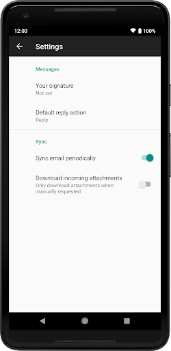

# 数据和文件存储

任何应用程序都可以通过文件系统存储文件，其它应用程序可以来读取这些文件，当然这可能需要访问权限的设置。安卓提供几种持久化应用程序数据的选择，具体选择那种方式依赖于具体的需求，例如数据应该是应用程序私有的还是共享的，或者数据所需要的存储空间等。在安卓中，应用程序的所有数据对其他应用程序都是私有的，其他应用只有通过设置权限才可以获取数据。安卓系统提供了几种本地数据的存储方式，如果要将这些数据共享，安卓通过定义内容提供者，能够把私有数据共享给其他应用程序。内容提供器是一种为了开放应用程序的数据读写，具有访问权限的可选组件，可以通过该改组件实现私有数据的读写访问。内容提供器提供了请求和修改数据的标准语法和读取返回数据的标准机制。

## 存储空间概述

安卓使用的文件系统类似于其他平台上基于磁盘的文件系统，该系统提供了以下几种保存应用数据的选项：

  - 应用专属文件

存储仅供应用使用的文件，可以存储到内部存储卷中的专属目录或外部存储空间中的其他专属目录。使用内部存储空间中的目录保存其他应用不应访问的敏感信息。

  - 内容类型：仅供应用使用的文件

  - 访问方法：从内部存储空间访问，可以使用 getFilesDir() 或 getCacheDir() 方法；从外部存储空间访问，可以使用
    getExternalFilesDir() 或 getExternalCacheDir() 方法

  - 所需权限： 从内部存储空间访问不需要任何权限，如果应用在搭载安卓4.4（API 级别
    19）或更高版本的设备上运行，从外部存储空间访问不需要任何权限

  - 其他应用是否可以访问： 否

  - 卸载应用时是否移除文件：是

<!-- end list -->

  - 媒体
    
      - 内容类型：可共享的媒体文件（图片、音频文件、视频）
    
      - 访问方法：MediaStore API
    
      - 所需权限：在安卓13（API 级别 33）及更高版本中，按媒体类型申请权限：图片
        `READ_MEDIA_IMAGES`、视频 `READ_MEDIA_VIDEO`、音频 `READ_MEDIA_AUDIO`；在安卓12（API 级别 32）及更低版本中使用
        `READ_EXTERNAL_STORAGE`（旧设备写入共享媒体可能还涉及 `WRITE_EXTERNAL_STORAGE`）。如果仅需让用户选择少量照片或视频，优先使用系统照片选择器（Photo Picker），通常无需申请读媒体权限
    
      - 其他应用是否可以访问： 否
    
      - 卸载应用时是否移除文件：是

  - 文档和其他文件
    
      - 内容类型：其他类型的可共享内容，包括已下载的文件
    
      - 访问方法：存储访问框架
    
      - 所需权限：无
    
      - 其他应用是否可以访问： 是，可以通过系统文件选择器访问
    
      - 卸载应用时是否移除文件：否

  - 偏好设置

以键值对形式存储私有原始数据。

  - 内容类型：键值对

  - 访问方法：Jetpack Preferences 库

  - 所需权限： 无

  - 其他应用是否可以访问： 否

  - 卸载应用时是否移除文件：是

<!-- end list -->

  - 数据库

使用 Room 持久性库将结构化数据存储在专用数据库中。

  - 内容类型：结构化数据

  - 访问方法：Room 持久性库

  - 所需权限： 无

  - 其他应用是否可以访问： 否

  - 卸载应用时是否移除文件：是

应根据具体需求选择解决方案：

(1)数据需要占用多少空间？内部存储空间中用于存储应用专属数据的空间有限。如果需要保存大量数据，请使用其他类型的存储空间。

(2)数据访问需要达到怎样的可靠程度？如果应用的基本功能需要某些数据（例如应用启动时需要的数据），可以将相应数据存放到内部存储目录或数据库中。存储在外部存储空间中的应用专属文件并非一直可以访问，因为有些设备允许用户移除提供外部存储空间的实体设备。

(3)需要存储哪类数据？如果数据仅供应用使用，应使用应用专属存储空间。对于可分享的媒体内容，应使用共享的存储空间，以便其他应用可以访问相应内容。对于结构化数据，应使用偏好设置（适合键值对数据）或数据库（适合包含2个以上列的数据）。

(4)数据是否应仅供应用使用？在存储敏感数据（不可通过任何其他应用访问的数据）时，应使用内部存储空间、偏好设置或数据库。内部存储空间的一个额外优势是用户无法看到相应数据。

安卓提供两类物理存储位置：内部存储空间和外部存储空间。在大多数设备上，内部存储空间小于外部存储空间。不过，所有设备上的内部存储空间都是始终可用的，因此在存储应用所依赖的数据时更为可靠。可移除卷（例如
SD 卡）在文件系统中属于外部存储空间。安卓使用路径（例如
/sdcard）表示这些存储设备。注意：可用于保存文件的确切位置可能因设备而异。因此，请勿使用硬编码的文件路径。默认情况下，应用本身存储在内部存储空间中。不过，如果
APK 非常大，也可以在应用的清单文件中指明偏好设置，以便将应用安装到外部存储空间：

\<manifest ...

android:installLocation="preferExternal"\>

...

\</manifest\>

码 7‑1

安卓定义了以下与存储相关的权限：`READ_EXTERNAL_STORAGE`、`WRITE_EXTERNAL_STORAGE`（历史权限）和 `MANAGE_EXTERNAL_STORAGE`（特殊高风险权限）。  

在新版安卓中，权限模型已从“按路径授权”转向“按数据类型和用途授权”：

  - 安卓13（API 33）及以上：访问共享媒体应按类型申请 `READ_MEDIA_IMAGES`、`READ_MEDIA_VIDEO`、`READ_MEDIA_AUDIO`。  
  - 安卓11（API 30）及以上：`WRITE_EXTERNAL_STORAGE` 对大多数场景不再提供额外访问能力。  
  - `MANAGE_EXTERNAL_STORAGE` 仅适用于文件管理器、备份还原、杀毒等核心场景，且会受到应用商店严格审核。  

这种基于用途的存储模型可增强用户隐私保护，因为应用只能访问其实际需要的数据范围。

为了让用户更好地管理自己的文件并减少混乱，以安卓10（API 级别
29）及更高版本为目标平台的应用在默认情况下被授予了对外部存储空间的分区访问权限（即分区存储）。此类应用只能访问外部存储空间上的应用专属目录，以及本应用所创建的特定类型的媒体文件。注意：如果应用在运行时请求与存储空间相关的权限，面向用户的对话框会表明应用正在请求对外部存储空间的广泛访问，即使已启用分区存储也是如此。

除非应用需要访问存储在应用专属目录和 MediaStore API
可以访问的目录之外的文件，否则请使用分区存储。如果将应用专属文件存储在外部存储空间中，则可以将这些文件存放在外部存储空间中的应用专属目录内，以便更加轻松地采用分区存储。这样，在启用分区存储后，应用将可以继续访问这些文件。

### 2026 版本适配要点

面向最新 Android（截至 2026 年）时，建议优先采用以下策略：

  - 首选 Photo Picker：如果业务只需要用户选择图片/视频（例如头像、晒单、发布动态），优先使用系统照片选择器，避免申请广泛媒体读取权限。  
  - 使用分区存储 + MediaStore：共享媒体读写走 MediaStore，应用私有文件放 `getFilesDir()` / `getExternalFilesDir()`。  
  - 降低高风险权限依赖：非必要不要申请 `MANAGE_EXTERNAL_STORAGE`，否则会带来较高上架审核风险。  
  - 敏感数据默认内部存储：令牌、账号缓存、业务密钥等放内部目录，并结合 Jetpack Security 加密。  
  - 偏好数据逐步迁移 DataStore：新代码优先使用 DataStore，降低 SharedPreferences 同步阻塞和类型安全问题。

## 专属存储空间

在很多情况下，应用会创建其他应用不需要访问或不应访问的文件。系统提供以下位置，用于存储此类应用专属文件：

(1)内部存储空间目录：这些目录既包括用于存储持久性文件的专属位置，也包括用于存储缓存数据的其他位置。系统会阻止其他应用访问这些位置，并且在**安卓**10（API
级别 29）及更高版本中，系统会对这些位置进行加密。这些特征使得这些位置非常适合存储只有应用本身才能访问的敏感数据。

(2)外部存储空间目录：这些目录既包括用于存储持久性文件的专属位置，也包括用于存储缓存数据的其他位置。虽然其他应用可以在具有适当权限的情况下访问这些目录，但存储在这些目录中的文件仅供应用使用。如果明确打算创建其他应用能够访问的文件，应用应改为将这些文件存储在外部存储空间的共享存储空间部分。

如果用户卸载应用，系统会移除保存在应用专属存储空间中的文件。由于这一行为，不应使用此存储空间保存用户希望独立于应用而保留的任何内容。例如，如果应用允许用户拍摄照片，用户会希望即使卸载应用后仍可访问这些照片。因此，应改为使用共享存储空间将此类文件保存到适当的媒体集合中。注意：如需进一步保护应用专属文件，请使用
Android Jetpack 中包含的 Security 库对这些静态文件进行加密。加密密钥专属于应用。

在应用程序保存文件有两个目的。一种目的只是针对某种应用使用，不能被其他应用使用，其为私有文件，例如电子阅读应用使用的文件具有特殊的格式，只能被电子阅读应用使用。另外一种目的不是针对特定应用的，可以被其他应用使用，其为公共文件，例如照相机产生的图片文件，可以被图像编辑应用或者其他应用使用。当需要对文件操作时，我们要根据这两个目的正确选择内部存储或是外部存储。一般来说应用程序都会使用两种文件夹，一种是在内部存储上，用来保存私有数据；还有一种是在扩展存储上，用来保存公共数据。当然应用程序的私有数据也可以保存扩展存储上。扩展存储一般是可移动的存储介质，而且缺少安全保护，所以可以用来保存公共数据。移动设备的内部存储由生产厂商固化在设备上，其存储空间是受到限制的，一般不会很大，而且不能扩展，所以需要考虑将一些文件保存在扩展存储上。具体哪些文件保存在扩展存储上，与文件的大小和用途等多个方面的因素有关。

### 内部存储

对于每个应用，系统都会在内部存储空间中提供目录，应用可以在该存储空间中整理其文件。一个目录专为应用的持久性文件而设计，而另一个目录包含应用的缓存文件。应用不需要任何系统权限即可读取和写入这些目录中的文件。其他应用无法访问存储在内部存储空间中的文件。这使得内部存储空间非常适合存储其他应用不应访问的应用数据。但是，请注意，这些目录的空间通常比较小。在将应用专属文件写入内部存储空间之前，应用应查询设备上的可用空间。应用的普通持久性文件位于可以使用上下文对象的
filesDir 属性访问的目录中。此框架提供了多种方法帮助在此目录中访问和存储文件。可以使用 File API
访问和存储文件。为确保应用的性能不受影响，请勿多次打开和关闭同一文件。以下代码段演示了如何使用
File API：

File file = new File(context.getFilesDir(), filename);

码 7‑2

除使用 File API 之外，还可以调用 openFileOutput() 获取会写入 filesDir 目录中的文件的
FileOutputStream。以下代码段展示了如何将一些文本写入文件：

String filename = "myfile";

String fileContents = "Hello world\!";

try (FileOutputStream fos = context.openFileOutput(filename,
Context.MODE\_PRIVATE)) {

fos.write(fileContents.toByteArray());

}

码 7‑3

将文件保存在设备内部存储器中，默认情况下这些文件是相应程序私有的，对其他程序不透明，对用户也是不透明的。当程序卸载后，这些文件就会被删除。在内部存储器上保存数据时，不需要设置任何权限，应用程序始终有权读写它在内部存储器目录中保存的文件。安卓提供的文件存储权限：

  - Context.MODE\_APPEND：追加方式存储

  - Context.MODE\_PRIVATE：私有方式存储，其他应用无法访问

  - 注意：`Context.MODE_WORLD_READABLE` 与 `Context.MODE_WORLD_WRITEABLE` 已废弃且不适用于现代应用。如需跨应用共享文件，请使用 `FileProvider` + URI 授权，或使用存储访问框架（SAF）。

应用程序的内部存储目录是在安卓文件系统的特定位置，是由应用程序的包名称来指定的。从技术上来说，如果把该文件模式设置为可读的，那么另外一个应用程序是可以读取你的内部文件的。但是，如果其他的应用程序知道应用程序的包名和文件名，还是不能浏览应用程序内部目录，除非把该文件设置为可读或可写，否则其他的应用程序不能够对其进行读写访问，因此在内部存储器上只要文件使用了MODE\_PRIVATE模式，那么其他的应用程序就不会访问到它们。

注意：在搭载**安卓**7.0（API 级别 24）或更高版本的设备上，除非将 Context.MODE\_PRIVATE 文件模式传递到
openFileOutput()，否则会发生
SecurityException。如需允许其他应用访问存储在内部存储空间内此目录中的文件，请使用具有
FLAG\_GRANT\_READ\_URI\_PERMISSION 属性的 FileProvider。如需以信息流的形式读取文件，请使用
openFileInput()：

FileInputStream fis = context.openFileInput(filename);

InputStreamReader inputStreamReader =

new InputStreamReader(fis, StandardCharsets.UTF\_8);

StringBuilder stringBuilder = new StringBuilder();

try (BufferedReader reader = new BufferedReader(inputStreamReader)) {

String line = reader.readLine();

while (line \!= null) {

stringBuilder.append(line).append('\\n');

line = reader.readLine();

}

} catch (IOException e) {

// Error occurred when opening raw file for reading.

} finally {

String contents = stringBuilder.toString();

}

码 7‑4

注意：如果在安装时需要以信息流的形式访问文件，请将文件保存在项目的 /res/raw 目录中。可以使用 openRawResource()
打开这些文件，传入带有 R.raw 前缀的文件名作为资源 ID。此方法将返回一个
InputStream，可以使用它读取文件。无法写入原始文件。可以通过调用
fileList() 获取包含 filesDir 目录中所有文件名称的数组，如以下代码段所示：

Array\<String\> files = context.fileList();

码 7‑5

还可以通过以下方式创建嵌套目录或打开内部目录：在基于 Kotlin 的代码中调用 getDir()，或在基于 Java
的代码中将根目录和新目录名称传递到 File 构造函数：

File directory = context.getFilesDir();

File file = new File(directory, filename);

码 7‑6

注意：filesDir
始终是此新目录的父级目录。如果只需要暂时存储敏感数据，应使用应用在内部存储空间中的指定缓存目录保存数据。与所有应用专属存储空间一样，当用户卸载应用后，系统会移除存储在此目录中的文件，但也可以更早地移除此目录中的文件。注意：此缓存目录旨在存储应用的少量敏感数据。如需确定应用当前可用的缓存空间大小，请调用
getCacheQuotaBytes()。如需创建缓存文件，请调用 File.createTempFile()：

File.createTempFile(filename, null, context.getCacheDir());

码 7‑7

应用会使用上下文对象的 cacheDir 属性和 File API 访问此目录中的文件：

File cacheFile = new File(context.getCacheDir(), filename);

码 7‑8

注意：当设备的内部存储空间不足时，安卓可能会删除这些缓存文件以回收空间。因此，请在读取前检查缓存文件是否存在。即使安卓有时会自行删除缓存文件，也不应依赖系统清理这些文件。始终应该维护内部存储空间中的应用缓存文件。如需从内部存储空间内的缓存目录中移除文件，请使用以下方法之一：

  - 对代表该文件的 File 对象使用 delete() 方法：

cacheFile.delete();

码 7‑9

  - 应用上下文的 deleteFile() 方法，并传入文件名：

context.deleteFile(cacheFileName);

码 7‑10

当设备的内部存储空间不足的时候，安卓可能会删除这些缓存文件来回收存储空间。但是最好不要依赖系统来给自动清理这些文件，而是自己来维护缓存文件，把存储空间的耗费限定在合理的范围内，如1MB。当用户卸载应用程序时，这些文件会被删除。为了避免出现IOException，通常调用getFreeSpace()和getTotalSpace()方法来分别获取存储器的当前剩余的空间和总空间大小。当然也不是必须要调用该方法，另一种方式是可以在写入文件的时候捕获IOException异常来解决。在应用程序设计中，注意调用delete()方法清理不需要的文件。如果文件位于内部存储器上，可以通过Context来定位，调用deleteFile()来删除该文件。当用户卸载掉应用程序时，所有保存在内部存储器上的文件，以及通过getExternalFilesDir()方法保存在外部存储器上的文件都将被删除。而通过getCacheDir()方法生成的临时文件，需要手动删除。

### 外部存储

如果内部存储空间不足以存储应用专属文件，请考虑改为使用外部存储空间。系统会在外部存储空间中提供目录，应用可以在该存储空间中整理仅在应用内对用户有价值的文件。一个目录专为应用的持久性文件而设计，而另一个目录包含应用的缓存文件。在**安卓**4.4（API
级别
19）或更高版本中，应用无需请求任何与存储空间相关的权限即可访问外部存储空间中的应用专属目录。卸载应用后，系统会移除这些目录中存储的文件。注意：我们无法保证可以访问这些目录中的文件，例如从设备中取出可移除的
SD 卡后，就无法访问其中的文件。如果应用的功能取决于这些文件，应改为将文件存储在内部存储空间中。在搭载安卓9（API 级别
28）或更低版本的设备上，只要应用具有适当的存储权限，就可以访问属于其他应用的应用专用文件。为了让用户更好地管理自己的文件并减少混乱，以**安卓**10（API
级别
29）及更高版本为目标平台的应用在默认情况下被授予了对外部存储空间的分区访问权限（即分区存储）。启用分区存储后，应用将无法访问属于其他应用的应用专属目录。

由于外部存储空间位于用户可能能够移除的物理卷上，因此在尝试从外部存储空间读取应用专属数据或将应用专属数据写入外部存储空间之前，请验证该卷是否可访问。可以通过调用
Environment.getExternalStorageState() 查询该卷的状态。如果返回的状态为
MEDIA\_MOUNTED，那么就可以在外部存储空间中读取和写入应用专属文件。如果返回的状态为
MEDIA\_MOUNTED\_READ\_ONLY，只能读取这些文件。例如，以下方法可用于确定存储空间的可用性：

// Checks if a volume containing external storage is available

// for read and write.

private boolean isExternalStorageWritable() {

return
Environment.getExternalStorageState().equals(Environment.MEDIA\_MOUNTED);

}

// Checks if a volume containing external storage is available to at
least read.

private boolean isExternalStorageReadable() {

return
Environment.getExternalStorageState().equals(Environment.MEDIA\_MOUNTED)
||

Environment.getExternalStorageState().equals(Environment.MEDIA\_MOUNTED\_READ\_ONLY);

}

码 7‑11

在没有可移除外部存储空间的设备上，请使用以下命令启用虚拟卷，以测试外部存储空间可用性逻辑：

adb shell sm set-virtual-disk true

码 7‑12

有时分配内部存储分区作为外部存储空间的设备也会提供 SD
卡插槽。这意味着设备具有多个可能包含外部存储空间的物理卷，因此需要选择用于应用专属存储空间的物理卷。如需访问其他位置，请调用
ContextCompat.getExternalFilesDirs()。如代码段中所示，返回数组中的第一个元素被视为主外部存储卷。除非该卷已满或不可用，否则请使用该卷。

File\[ \] externalStorageVolumes =

ContextCompat.getExternalFilesDirs(getApplicationContext(), null);

File primaryExternalStorage = externalStorageVolumes\[0\];

码 7‑13

注意：如果应用在搭载安卓4.3（API 级别
18）或更低版本的设备上使用，则该数组仅包含一个表示主外部存储卷的元素。如需从外部存储设备访问应用专用文件，请调用
getExternalFilesDir()。为确保应用的性能不受影响，请勿多次打开和关闭同一文件。以下代码段演示了如何调用
getExternalFilesDir()：

File appSpecificExternalDir = new
File(context.getExternalFilesDir(null), filename);

码 7‑14

注意：在安卓11（API 级别
30）及更高版本中，应用无法在外部存储设备上创建自己的应用专用目录。如需将应用专属文件添加到外部存储空间中的缓存，请获取对
externalCacheDir 的引用：

File externalCacheFile = new File(context.getExternalCacheDir(),
filename);

码 7‑15

如需从外部缓存目录中移除文件，请对代表该文件的 File 对象使用 delete() 方法：

externalCacheFile.delete();

码 7‑16

如果支持使用仅在应用内对用户有价值的媒体文件，最好将这些文件存储在外部存储空间中的应用专属目录中，如以下代码段所示：

@Nullable

File getAppSpecificAlbumStorageDir(Context context, String albumName) {

// Get the pictures directory that's inside the app-specific directory
on

// external storage.

File file = new File(context.getExternalFilesDir(

Environment.DIRECTORY\_PICTURES), albumName);

if (file == null || \!file.mkdirs()) {

Log.e(LOG\_TAG, "Directory not created");

}

return file;

}

码 7‑17

请务必使用 DIRECTORY\_PICTURES 等 API
常量提供的目录名称。这些目录名称可确保系统正确处理文件。如果没有适合文件的预定义子目录名称，可以改为将
null 传递到 getExternalFilesDir()。这将返回外部存储空间中的应用专属根目录。

### 查看可用空间

许多用户的设备上没有太多可用的存储空间，因此应用应谨慎使用空间。如果事先知道要存储的数据量，可以通过调用
getAllocatableBytes() 查出设备可以为应用提供多少空间。getAllocatableBytes()
的返回值可能大于设备上的当前可用空间量。这是因为系统已识别出可以从其他应用的缓存目录中移除的文件。如果有足够的空间保存应用数据，请调用
allocateBytes()。否则，应用可以请求用户从设备移除一些文件或从设备移除所有缓存文件。以下代码段展示了应用如何查询设备上的可用空间的示例：

// App needs 10 MB within internal storage.

private static final long NUM\_BYTES\_NEEDED\_FOR\_MY\_APP = 1024 \*
1024 \* 10L;

StorageManager storageManager =

getApplicationContext().getSystemService(StorageManager.class);

UUID appSpecificInternalDirUuid =
storageManager.getUuidForPath(getFilesDir());

long availableBytes =

storageManager.getAllocatableBytes(appSpecificInternalDirUuid);

if (availableBytes \>= NUM\_BYTES\_NEEDED\_FOR\_MY\_APP) {

storageManager.allocateBytes(

appSpecificInternalDirUuid, NUM\_BYTES\_NEEDED\_FOR\_MY\_APP);

} else {

// To request that the user remove all app cache files instead, set

// "action" to ACTION\_CLEAR\_APP\_CACHE.

Intent storageIntent = new Intent();

storageIntent.setAction(ACTION\_MANAGE\_STORAGE);

}

码 7‑18

注意：无需检查可用空间即可保存文件。可以尝试立即写入文件，然后在出现 IOException
时将其捕获。如果不知道所需的确切空间量，则可能需要执行此操作。例如，如果在保存文件前更改了文件的编码（将
PNG 图片转换为 JPEG
格式），则不会事先得知文件的大小。应用可以声明并创建一个自定义**活动**，该**活动**在启动后可让用户管理应用存储在用户设备上的数据。可以在清单文件中使用
android:manageSpaceActivity
属性声明此自定义“管理空间”activity。文件管理器应用可以调用此**活动**，即使应用未导出此**活动**，也就是说，当**活动**将
android:exported 设置为 false 时，仍然可以调用。如需请求用户在设备上选择文件进行移除，请调用包含
ACTION\_MANAGE\_STORAGE 操作的
intent。此意图会向用户显示提示。如果需要，此提示可以显示设备上的可用空间量。如需显示此人性化信息，请使用以下计算结果：

StorageStatsManager.getFreeBytes() / StorageStatsManager.getTotalBytes()

码 7‑19

或者，可以请求用户从设备上的所有应用中清除缓存文件。为此，请调用包含
ACTION\_CLEAR\_APP\_CACHE操作的意图。注意：ACTION\_CLEAR\_APP\_CACHE意图操作会严重影响设备的电池续航时间，并且可能会从设备上移除大量的文件。

## 共享存储空间

如果用户数据可供或应可供其他应用访问，并且即使在用户卸载应用后也可对其进行保存，请使用共享存储空间。安卓提供用于存储和访问以下类型的可共享数据的
API：

  - 媒体内容：系统提供标准的公共目录来存储这些类型的文件，这样用户就可以将所有照片保存在一个公共位置，将所有音乐和音频文件保存在另一个公共位置，依此类推。应用可以使用此平台的
    MediaStore API 访问此内容。

  - 文档和其他文件：系统有一个特殊目录，用于包含其他文件类型，例如 PDF 文档和采用 EPUB
    格式的图书。应用可以使用此平台的存储访问框架访问这些文件。

  - 数据集：在**安卓**11（API 级别
    30）及更高版本中，系统会缓存多个应用可能使用的大型数据集。这些数据集可为机器学习和媒体播放等用例提供支持。应用可以使用
    BlobStoreManager API 访问这些共享数据集。

### 媒体内容

为了提供更丰富的用户体验，许多应用允许用户提供和访问位于外部存储卷上的媒体。框架提供经过优化的媒体集合索引，称为媒体库，使可以更轻松地检索和更新这些媒体文件。即使应用已卸载，这些文件仍会保留在用户的设备上。注意：如果应用支持使用仅在应用内对用户有价值的媒体文件，最好将这些文件存储在外部存储空间中的应用专属目录中。如需与媒体库抽象互动，使用从应用上下文中检索到的
ContentResolver 对象：

String\[\] projection = new String\[\] {

media-database-columns-to-retrieve

};

String selection = sql-where-clause-with-placeholder-variables;

String\[\] selectionArgs = new String\[\] {

values-of-placeholder-variables

};

String sortOrder = sql-order-by-clause;

Cursor cursor = getApplicationContext().getContentResolver().query(

MediaStore.media-type.Media.EXTERNAL\_CONTENT\_URI,

projection,

selection,

selectionArgs,

sortOrder

);

while (cursor.moveToNext()) {

// Use an ID column from the projection to get

// a URI representing the media item itself.

}

码 7‑20

系统会自动扫描外部存储卷，并将媒体文件添加到以下明确定义的集合中：

  - 图片（包括照片和屏幕截图），存储在 DCIM/ 和 Pictures/ 目录中。系统将这些文件添加到 MediaStore.Images
    表格中。

  - 视频，存储在 DCIM/、Movies/ 和 Pictures/ 目录中。系统将这些文件添加到 MediaStore.Video
    表格中。

  - 音频文件，存储在 Alarms/、Audiobooks/、Music/、Notifications/、Podcasts/ 和
    Ringtones/ 目录中。此外，系统还可以识别 Music/ 或 Movies/ 目录中的音频播放列表，以及 Recordings/
    目录中的录音。系统将这些文件添加到 MediaStore.Audio 表格中。录音目录在**安卓**11（API 级别
    30）及更低版本中不可用。

  - 下载的文件，存储在 Download/ 目录中。在搭载**安卓**10（API 级别 29）及更高版本的设备上，这些文件存储在
    MediaStore.Downloads 表格中。此表格在**安卓**9（API 级别 28）及更低版本中不可用。

媒体库还包含一个名为 MediaStore.Files 的集合。其内容取决于应用是否使用分区存储（适用于以**安卓**10
或更高版本为目标平台的应用）：

  - 如果启用了分区存储，集合只会显示应用创建的照片、视频和音频文件。大多数开发者无需使用 MediaStore.Files
    即可查看其他应用的媒体文件，但如果有特定要求，则可以声明
    READ\_EXTERNAL\_STORAGE 权限。不过，建议使用 MediaStore API 打开应用尚未创建的文件。

  - 如果分区存储不可用或未使用，集合将显示所有类型的媒体文件。

在对媒体文件执行操作之前，确保应用已声明访问这些文件所需的权限。不过注意，应用不得声明不需要或不使用的权限。用于访问应用内媒体文件的权限模型取决于应用是否使用分区存储（适用于以**安卓**10
或更高版本为目标平台的应用）。如果应用使用分区存储，则应仅针对搭载**安卓**9（API 级别
28）或更低版本的设备请求存储相关权限。可以通过将
android:maxSdkVersion 属性添加到应用清单文件中的权限声明来应用此条件：

\<uses-permission
android:name="android.permission.WRITE\_EXTERNAL\_STORAGE"

android:maxSdkVersion="28" /\>

码 7‑21

勿为搭载**安卓**10 或更高版本的设备不必要地请求存储相关权限。应用可以提供明确定义的媒体集合，包括
MediaStore.Downloads
集合，而无需请求任何存储相关权限。例如，如果正在开发一款相机应用，无需请求存储相关权限，因为应用拥有将写入媒体库的图片。如需访问由其他应用创建的文件，必须满足以下所有条件：

  - 应用已获得 READ\_EXTERNAL\_STORAGE 权限。

  - 这些文件位于以下其中一个明确定义的媒体集合中：
    
      - MediaStore.Images
    
      - MediaStore.Video
    
      - MediaStore.Audio

注意：只要文件可通过 MediaStore.Images、MediaStore.Video 或 MediaStore.Audio
查询查看，则表示该文件也可以通过 MediaStore.Files 查询查看。如果应用需要访问
MediaStore.Downloads
集合中某个并非由其创建的文件，必须使用存储访问框架。如需详细了解如何使用此框架，参阅有关如何访问文档和其他文件的指南。

如果应用在搭载**安卓**9 或更低版本的设备上使用，或者应用暂时停用分区存储，必须请求 READ\_EXTERNAL\_STORAGE
权限才能访问媒体文件。如果要修改媒体文件，还必须请求 WRITE\_EXTERNAL\_STORAGE
权限。注意：如果应用有用例未包含在分区存储范围内，提交功能请求并暂时选择停用分区存储。

如果应用以**安卓**10（API 级别 29）或更高版本为目标平台，为了使应用从照片中检索未编辑的 Exif 元数据，需要在应用的清单中声明
ACCESS\_MEDIA\_LOCATION 权限，然后在运行时请求此权限。注意：由于在运行时请求
ACCESS\_MEDIA\_LOCATION 权限，因此无法保证应用可以访问照片中未编辑的 Exif
元数据。应用需要用户明确同意才能访问此信息。

如需更可靠地访问媒体文件，尤其是在应用缓存来自媒体库的URI或数据时，检查媒体库版本与上次同步媒体数据时相比是否发生了变化。如需执行此更新检查，调用
getVersion()。返回的版本是一个唯一字符串，该字符串会在媒体库发生重大变化时随之变化。如果返回的版本与上次同步的版本不同，重新扫描并重新同步应用的媒体缓存。在应用进程启动时完成此项检查。无需在每次查询媒体库时都检查版本。不要对有关版本号的任何实现详情做任何假设。注意：媒体库版本号不会因应用端更改（例如应用添加媒体文件）而发生变化。有另外一种方法可帮助检测媒体文件的更新。

如需查找满足一组特定条件（例如时长为 5 分钟或更长时间）的媒体，使用类似于以下代码段中所示的类似 SQL 的选择语句：

// Need the READ\_EXTERNAL\_STORAGE permission if accessing video files
that your

// app didn't create.

// Container for information about each video.

class Video {

private final Uri uri;

private final String name;

private final int duration;

private final int size;

public Video(Uri uri, String name, int duration, int size) {

this.uri = uri;

this.name = name;

this.duration = duration;

this.size = size;

}

}

List\<Video\> videoList = new ArrayList\<Video\>();

Uri collection;

if (Build.VERSION.SDK\_INT \>= Build.VERSION\_CODES.Q) {

collection =
MediaStore.Video.Media.getContentUri(MediaStore.VOLUME\_EXTERNAL);

} else {

collection = MediaStore.Video.Media.EXTERNAL\_CONTENT\_URI;

}

String\[\] projection = new String\[\] {

MediaStore.Video.Media.\_ID,

MediaStore.Video.Media.DISPLAY\_NAME,

MediaStore.Video.Media.DURATION,

MediaStore.Video.Media.SIZE

};

String selection = MediaStore.Video.Media.DURATION +

" \>= ?";

String\[\] selectionArgs = new String\[\] {

String.valueOf(TimeUnit.MILLISECONDS.convert(5, TimeUnit.MINUTES));

};

String sortOrder = MediaStore.Video.Media.DISPLAY\_NAME + " ASC";

try (Cursor cursor = getApplicationContext().getContentResolver().query(

collection,

projection,

selection,

selectionArgs,

sortOrder

)) {

// Cache column indices.

int idColumn =
cursor.getColumnIndexOrThrow(MediaStore.Video.Media.\_ID);

int nameColumn =

cursor.getColumnIndexOrThrow(MediaStore.Video.Media.DISPLAY\_NAME);

int durationColumn =

cursor.getColumnIndexOrThrow(MediaStore.Video.Media.DURATION);

int sizeColumn =
cursor.getColumnIndexOrThrow(MediaStore.Video.Media.SIZE);

while (cursor.moveToNext()) {

// Get values of columns for a given video.

long id = cursor.getLong(idColumn);

String name = cursor.getString(nameColumn);

int duration = cursor.getInt(durationColumn);

int size = cursor.getInt(sizeColumn);

Uri contentUri = ContentUris.withAppendedId(

MediaStore.Video.Media.EXTERNAL\_CONTENT\_URI, id);

// Stores column values and the contentUri in a local object

// that represents the media file.

videoList.add(new Video(contentUri, name, duration, size));

}

}

码 7‑22

在应用中执行此类查询时，注意以下几点：

  - 在工作线程中调用 query() 方法。

  - 缓存列索引，以免每次处理查询结果中的行时都需要调用 getColumnIndexOrThrow()。

  - 将 ID 附加到内容 URI，如代码段所示。

  - 搭载**安卓**10 及更高版本的设备需要在 MediaStore API 中定义的列名称。如果应用中的某个依赖库需要 API
    中未定义的列名称（例如 "MimeType"），使用 CursorWrapper 在应用的进程中动态转换列名称。

如果应用显示多个媒体文件，并请求用户选择其中一个文件，加载文件的预览版本（或缩略图）会比加载文件本身效率更高。如需加载给定媒体文件的缩略图，使用
loadThumbnail() 并传入想加载的缩略图的大小，如以下代码段所示：

// Load thumbnail of a specific media item.

Bitmap thumbnail =

getApplicationContext().getContentResolver().loadThumbnail(

content-uri, new Size(640, 480), null);

码 7‑23

用于打开媒体文件的具体逻辑取决于媒体内容最佳表示形式是文件描述符、文件流还是直接文件路径：

  - 文件描述符

如需使用文件描述符打开媒体文件，使用类似于以下代码段所示的逻辑：

// Open a specific media item using ParcelFileDescriptor.

ContentResolver resolver = getApplicationContext()

.getContentResolver();

// "rw" for read-and-write;

// "rwt" for truncating or overwriting existing file contents.

String readOnlyMode = "r";

try (ParcelFileDescriptor pfd =

resolver.openFileDescriptor(content-uri, readOnlyMode)) {

// Perform operations on "pfd".

} catch (IOException e) {

e.printStackTrace();

}

码 7‑24

  - 文件流

如需使用文件流打开媒体文件，使用类似于以下代码段所示的逻辑：

// Open a specific media item using InputStream.

ContentResolver resolver = getApplicationContext()

.getContentResolver();

try (InputStream stream = resolver.openInputStream(content-uri)) {

// Perform operations on "stream".

}

码 7‑25

  - 直接文件路径

为了帮助应用更顺畅地使用第三方媒体库，安卓11（API 级别 30）及更高版本允许使用 MediaStore API 以外的 API
访问共享存储空间中的媒体文件。不过，可以改为使用以下任一 API 直接访问媒体文件：

  - File API。

  - 原生库，例如 fopen()。

如果没有任何与存储空间相关的权限，可以访问应用专属目录中的文件，并可使用 File API 访问归因于应用的媒体文件。如果应用尝试使用 File
API 访问文件但没有必要的权限，就会发生 FileNotFoundException。如需在搭载安卓10（API 级别
29）的设备上访问共享存储空间中的其他文件，建议在应用的清单文件中将
requestLegacyExternalStorage 设置为 true 以暂时停用分区存储。如需在安卓10
上使用原生文件方法访问媒体文件，还必须请求
READ\_EXTERNAL\_STORAGE 权限。访问媒体内容时，注意以下几部分中介绍的注意事项。

  - 缓存的数据

如果应用缓存了媒体库中的URI或数据，定期检查媒体库的更新。此检查可让应用端缓存数据与系统端提供程序数据保持同步。

  - 性能

当使用直接文件路径依序读取媒体文件时，其性能与 MediaStore API
相当。但是，当使用直接文件路径随机读取和写入媒体文件时，进程的速度可能最多会慢一倍。在此类情况下，我们建议改为使用
MediaStore API。

  - DATA 列

当访问现有媒体文件时，可以使用逻辑中 DATA
列的值。这是因为，此值包含有效的文件路径。但是，不要假设文件始终可用。准备好处理可能发生的任何基于文件的
I/O 错误。另一方面，如需创建或更新媒体文件，勿使用 DATA 列的值。改用 DISPLAY\_NAME 和 RELATIVE\_PATH
列的值。

  - 存储卷

以安卓10
或更高版本为目标平台的应用可以访问系统为每个外部存储卷分配的唯一名称。此命名系统可帮助高效地整理内容并将内容编入索引，还可让控制新媒体文件的存储位置。

以下几种卷尤为有用，需要特别注意：

  - VOLUME\_EXTERNAL 卷用于提供设备上所有共享存储卷的视图。可以读取此合成卷的内容，但无法修改这些内容。

  - VOLUME\_EXTERNAL\_PRIMARY 卷代表设备上的主要共享存储卷。可以读取和修改此卷的内容。

可以通过调用 MediaStore.getExternalVolumeNames() 查看其他存储卷：

Set\<String\> volumeNames = MediaStore.getExternalVolumeNames(context);

String firstVolumeName = volumeNames.iterator().next();

码 7‑26

某些照片和视频的元数据中会包含位置信息，其中显示了拍摄照片的位置或录制视频的位置。如需在应用中访问此位置信息，使用一个 API
来获取照片位置信息，另一个 API
用于视频位置信息。如果应用使用分区存储，系统会默认隐藏位置信息。如需访问这些信息，完成以下步骤：

  - (1)在应用的清单中请求 ACCESS\_MEDIA\_LOCATION 权限。

  - (2)通过调用 setRequireOriginal()，从 MediaStore 对象获取照片的确切字节，并传入照片的
    URI，如以下代码段所示：

Uri photoUri = Uri.withAppendedPath(

MediaStore.Images.Media.EXTERNAL\_CONTENT\_URI,

cursor.getString(idColumnIndex));

final double\[\] latLong;

// Get location data using the Exifinterface library.

// Exception occurs if ACCESS\_MEDIA\_LOCATION permission isn't granted.

photoUri = MediaStore.setRequireOriginal(photoUri);

InputStream stream = getContentResolver().openInputStream(photoUri);

if (stream \!= null) {

ExifInterface exifInterface = new ExifInterface(stream);

double\[\] returnedLatLong = exifInterface.getLatLong();

// If lat/long is null, fall back to the coordinates (0, 0).

latLong = returnedLatLong \!= null ? returnedLatLong : new double\[2\];

// Don't reuse the stream associated with

// the instance of "ExifInterface".

stream.close();

} else {

// Failed to load the stream, so return the coordinates (0, 0).

latLong = new double\[2\];

}

码 7‑27

如需访问视频元数据中的位置信息，使用 MediaMetadataRetriever 类，如以下代码段所示。应用无需请求任何其他权限即可使用此类。

MediaMetadataRetriever retriever = new MediaMetadataRetriever();

Context context = getApplicationContext();

// Find the videos that are stored on a device by querying the video
collection.

try (Cursor cursor = context.getContentResolver().query(

collection,

projection,

selection,

selectionArgs,

sortOrder

)) {

int idColumn =
cursor.getColumnIndexOrThrow(MediaStore.Video.Media.\_ID);

while (cursor.moveToNext()) {

long id = cursor.getLong(idColumn);

Uri videoUri = ContentUris.withAppendedId(

MediaStore.Video.Media.EXTERNAL\_CONTENT\_URI, id);

extractVideoLocationInfo(videoUri);

}

}

private void extractVideoLocationInfo(Uri videoUri) {

try {

retriever.setDataSource(context, videoUri);

} catch (RuntimeException e) {

Log.e(APP\_TAG, "Cannot retrieve video file", e);

}

// Metadata should use a standardized format.

String locationMetadata = retriever.extractMetadata(

MediaMetadataRetriever.METADATA\_KEY\_LOCATION);

}

码 7‑28

某些应用允许用户彼此分享媒体文件。例如，用户可以通过社交媒体应用与朋友分享照片和视频。如需共享媒体文件，按照内容提供器创建指南中的建议使用
content:// URI。

当以安卓10
或更高版本为目标平台的应用启用了分区存储时，系统会将每个媒体文件归因于一个应用，这决定了应用在未请求任何存储权限时可以访问的文件。每个文件只能归因于一个应用。因此，如果应用创建的媒体文件存储在照片、视频或音频文件媒体集合中，应用便可以访问该文件。但是，如果用户卸载并重新安装应用，必须请求
READ\_EXTERNAL\_STORAGE
才能访问应用最初创建的文件。此权限请求是必需的，因为系统认为文件归因于以前安装的应用版本，而不是新安装的版本。

如需将媒体项添加到现有集合，调用类似于以下内容的代码。此代码段可在搭载安卓10 或更高版本的设备上访问
VOLUME\_EXTERNAL\_PRIMARY 卷。这是因为在这些设备上，只能修改主要卷的内容，如存储卷部分所述。

// Add a specific media item.

ContentResolver resolver = getApplicationContext()

.getContentResolver();

// Find all audio files on the primary external storage device.

Uri audioCollection;

if (Build.VERSION.SDK\_INT \>= Build.VERSION\_CODES.Q) {

audioCollection = MediaStore.Audio.Media

.getContentUri(MediaStore.VOLUME\_EXTERNAL\_PRIMARY);

} else {

audioCollection = MediaStore.Audio.Media.EXTERNAL\_CONTENT\_URI;

}

// Publish a new song.

ContentValues newSongDetails = new ContentValues();

newSongDetails.put(MediaStore.Audio.Media.DISPLAY\_NAME,

"My Song.mp3");

// Keeps a handle to the new song's URI in case we need to modify it

// later.

Uri myFavoriteSongUri = resolver

.insert(audioCollection, newSongDetails);

码 7‑29

如果应用执行可能非常耗时的操作（例如写入媒体文件），那么在处理文件时对其进行独占访问非常有用。在搭载安卓10 或更高版本的设备上，应用可以通过将
IS\_PENDING 标记的值设为 1 来获取此独占访问权限。如此一来，只有应用可以查看该文件，直到应用将 IS\_PENDING 的值改回
0。以下代码段基于前面的代码段进行构建。以下代码段显示了在与 MediaStore.Audio 集合对应的目录中存储一首较长的歌曲时如何使用
IS\_PENDING 标记：

// Add a media item that other apps shouldn't see until the item is

// fully written to the media store.

ContentResolver resolver = getApplicationContext()

.getContentResolver();

// Find all audio files on the primary external storage device.

Uri audioCollection;

if (Build.VERSION.SDK\_INT \>= Build.VERSION\_CODES.Q) {

audioCollection = MediaStore.Audio.Media

.getContentUri(MediaStore.VOLUME\_EXTERNAL\_PRIMARY);

} else {

audioCollection = MediaStore.Audio.Media.EXTERNAL\_CONTENT\_URI;

}

ContentValues songDetails = new ContentValues();

newSongDetails.put(MediaStore.Audio.Media.DISPLAY\_NAME,

"My Workout Playlist.mp3");

newSongDetails.put(MediaStore.Audio.Media.IS\_PENDING, 1);

Uri songContentUri = resolver

.insert(audioCollection, songDetails);

try (ParcelableFileDescriptor pfd =

resolver.openFileDescriptor(songContentUri, "w", null)) {

// Write data into the pending audio file.

}

// Now that we're finished, release the "pending" status, and allow
other apps

// to play the audio track.

songDetails.clear();

songDetails.put(MediaStore.Audio.Media.IS\_PENDING, 0);

resolver.update(songContentUri, songDetails, null, null);

码 7‑30

当应用在搭载安卓10 的设备上存储媒体时，系统默认按照类型对媒体进行整理。例如，新图片文件默认存放在
Environment.DIRECTORY\_PICTURES 目录中，该目录与 MediaStore.Images
集合相对应。如果应用知道应该存储文件的特定位置，例如名为
Pictures/MyVacationPictures 的相册，可以设置
MediaColumns.RELATIVE\_PATH，为系统提供关于新写入文件存储位置的提示。注意：尽管可以将通用文件存储在
Documents/ 文件夹或 Download/ 文件夹中（包括非媒体文件），但最好还是对这些用例使用存储访问框架
(SAF)。如需更新应用拥有的媒体文件，运行类似于以下内容的代码：

// Updates an existing media item.

long mediaId = // MediaStore.Audio.Media.\_ID of item to update.

ContentResolver resolver = getApplicationContext()

.getContentResolver();

// When performing a single item update, prefer using the ID

String selection = MediaStore.Audio.Media.\_ID + " = ?";

// By using selection + args we protect against improper escaping of

// values. Here, "song" is an in-memory object that caches the song's

// information.

String\[\] selectionArgs = new String\[\] { getId().toString() };

// Update an existing song.

ContentValues updatedSongDetails = new ContentValues();

updatedSongDetails.put(MediaStore.Audio.Media.DISPLAY\_NAME,

"My Favorite Song.mp3");

// Use the individual song's URI to represent the collection that's

// updated.

int numSongsUpdated = resolver.update(

myFavoriteSongUri,

updatedSongDetails,

selection,

selectionArgs);

码 7‑31

如果分区存储不可用或未启用，上述代码段中所示的过程也适用于不属于应用的文件。注意：可以在调用 update() 的过程中通过更改
MediaColumns.RELATIVE\_PATH 或 MediaColumns.DISPLAY\_NAME
在磁盘上移动文件。如果需要使用原生库编写媒体文件，将与文件相关联的文件描述符从基于
Java 或基于 Koltin 的代码传入原生代码。以下代码段演示了如何将媒体对象的文件描述符传入应用的原生代码：

Uri contentUri = ContentUris.withAppendedId(

MediaStore.Audio.Media.EXTERNAL\_CONTENT\_URI,

cursor.getLong(Integer.parseInt(BaseColumns.\_ID)));

String fileOpenMode = "r";

ParcelFileDescriptor parcelFd =

resolver.openFileDescriptor(contentUri, fileOpenMode);

if (parcelFd \!= null) {

int fd = parcelFd.detachFd();

// Pass the integer value "fd" into your native code. Remember to call

// close(2) on the file descriptor when you're done using it.

}

码 7‑32

如果应用使用分区存储，它通常无法更新其他应用存放到媒体库中的媒体文件。不过，仍可通过捕获平台抛出的
RecoverableSecurityException
来征得用户同意修改文件。然后，可以请求用户授予应用对此特定内容的写入权限，如以下代码段所示：

try {

ParcelFileDescriptor imageFd = getContentResolver()

.openFileDescriptor(image-content-uri, "w");

setGrayscaleFilter(imageFd);

} catch (SecurityException securityException) {

if (Build.VERSION.SDK\_INT \>= Build.VERSION\_CODES.Q) {

RecoverableSecurityException recoverableSecurityException;

if (securityException instanceof RecoverableSecurityException) {

recoverableSecurityException =

(RecoverableSecurityException)securityException;

} else {

throw new RuntimeException(

securityException.getMessage(), securityException);

}

IntentSender intentSender =recoverableSecurityException.getUserAction()

.getActionIntent().getIntentSender();

startIntentSenderForResult(intentSender, image-request-code,

null, 0, 0, 0, null);

} else {

throw new RuntimeException(

securityException.getMessage(), securityException);

}

}

码 7‑33

每当应用需要修改并非由其创建的媒体文件时，都完成此过程。或者，如果应用在安卓11
或更高版本上运行，可以允许用户向应用授予对一组媒体文件的写入权限。按照如何管理媒体文件组部分中所述的方式调用
createWriteRequest()
方法。如果应用有其他用例未包含在分区存储范围内，提交功能请求并暂时停用分区存储。如需从媒体库中移除应用不再需要的某个项目，使用类似于以下代码段所示的逻辑：

// Remove a specific media item.

ContentResolver resolver = getApplicationContext()

getContentResolver();

// URI of the image to remove.

Uri imageUri = "...";

// WHERE clause.

String selection = "...";

String\[\] selectionArgs = "...";

// Perform the actual removal.

int numImagesRemoved = resolver.delete(

imageUri,

selection,

selectionArgs);

码 7‑34

如果分区存储不可用或未启用，可以使用上述代码段移除其他应用拥有的文件。但是，如果启用了分区存储，就需要为应用要移除的每个文件捕获
RecoverableSecurityException，如更新媒体项部分所述。如果应用在安卓11
或更高版本上运行，可以允许用户选择一组要移除的媒体文件。按照如何管理媒体文件组部分中所述的方式调用
createTrashRequest() 方法或 createDeleteRequest()
方法。如果应用有其他用例未包含在分区存储范围内，提交功能请求并暂时停用分区存储。与以前的时间点相比，应用可能需要识别包含应用添加或修改的媒体文件的存储卷。如需以最可靠的方式检测这些更改，将相关存储卷传入
getGeneration()。只要媒体库版本保持不变，此方法的返回值就会单调递增。特别是，getGeneration()
比媒体列中的日期更可靠，如 DATE\_ADDED 和 DATE\_MODIFIED。
这是因为，当应用调用 setLastModified()
或用户更改系统时钟时，这些媒体列值可能会发生变化。注意：在依赖于
getGeneration() 的值之前，先检查媒体库是否存在更新。如果媒体库版本已更改，执行完全同步传递。在安卓11
及更高版本中，可以要求用户选择一组媒体文件，然后通过一次操作更新这些媒体文件。这些方法可在各种设备上提供更好的一致性，并且可让用户更轻松地管理其媒体合集。提供此“批量更新”功能的方法包括：

  - createWriteRequest()

用户向应用授予对指定媒体文件组的写入访问权限的请求。

  - createFavoriteRequest()

用户将设备上指定的媒体文件标记为“收藏”的请求。对该文件具有读取访问权限的任何应用都可以看到用户已将该文件标记为“收藏”。

  - createTrashRequest()

用户将指定的媒体文件放入设备垃圾箱的请求。垃圾箱中的内容会在系统定义的时间段后被永久删除。注意：如果应用是设备 OEM
的预安装图库应用，可以将文件放入垃圾箱而不显示对话框。如需执行该操作，直接将
IS\_TRASHED 设置为 1。

  - createDeleteRequest()

用户立即永久删除指定的媒体文件（而不是先将其放入垃圾箱）的请求。

系统在调用以上任何一个方法后，会构建一个 PendingIntent
对象。应用调用此意图后，用户会看到一个对话框，请求用户同意应用更新或删除指定的媒体文件。例如，以下是构建
createWriteRequest() 调用的方法：

List\<Uri\> urisToModify = /\* A collection of content URIs to modify.
\*/

PendingIntent editPendingIntent =
MediaStore.createWriteRequest(contentResolver,

urisToModify);

// Launch a system prompt requesting user permission for the operation.

startIntentSenderForResult(editPendingIntent.getIntentSender(),

EDIT\_REQUEST\_CODE, null, 0, 0, 0);

码 7‑35

评估用户的响应。如果用户提供了同意声明，继续执行媒体操作。否则，向用户说明应用为何需要获取相应权限：

@Override

protected void onActivityResult(int requestCode, int resultCode,

@Nullable Intent data) {

...

if (requestCode == EDIT\_REQUEST\_CODE) {

if (resultCode == Activity.RESULT\_OK) {

/\* Edit request granted; proceed. \*/

} else {

/\* Edit request not granted; explain to the user. \*/

}

}

}

码 7‑36

可以对 createFavoriteRequest()、createTrashRequest() 和 createDeleteRequest()
使用相同的通用模式。用户可能会信任特定的应用来执行媒体管理，如频繁地修改媒体文件。如果应用以安卓11
或更高版本为目标平台且不是设备的默认图库应用，则每次应用尝试修改或删除文件时，都必须向用户显示一个确认对话框。如果应用以安卓12（API
级别 31）或更高版本为目标平台，可以请求用户授予应用媒体管理特殊权限。此权限允许应用执行以下各项操作，而无需针对每项文件操作提示用户：

  - 使用 createWriteRequest() 修改文件。

  - 使用 createTrashRequest() 将文件移入和移出回收站。

  - 使用 createDeleteRequest() 删除文件。

为此，完成以下步骤：

  - 在应用的清单文件中声明 MANAGE\_MEDIA 权限和 READ\_EXTERNAL\_STORAGE 权限。为了调用
    createWriteRequest() 而不显示确认对话框，同时声明 ACCESS\_MEDIA\_LOCATION 权限。

  - 在应用中，向用户显示一个界面，说明为什么他们可能需要向应用授予媒体管理访问权限。

  - 调用
    ACTION\_REQUEST\_MANAGE\_MEDIA意图操作。这样会将用户引导至系统设置中的媒体管理应用屏幕。在此处，用户可以授予特殊应用访问权限。

### 其他文件

在搭载安卓4.4（API 级别
19）及更高版本的设备上，应用可以使用存储访问框架与包括外部存储卷和云端存储空间在内的文档提供器互动。此框架支持用户与系统选择器互动，从而选择文档提供器以及供应用创建、打开或修改的特定文档和其他文件。由于用户参与选择应用可以访问的文件或目录，因此该机制无需任何系统权限，同时用户控制和隐私保护也得到了增强。此外，这些文件存储在应用专属目录和媒体库之外，在应用卸载后仍会保留在设备上。使用存储访问框架涉及以下步骤：

  - (1)应用调用包含存储相关操作的 intent。此操作对应于框架支持的特定用例。

  - (2)用户看到一个系统选择器，供其浏览文档提供器并选择将执行存储相关操作的位置或文档。

  - (3)应用获得对代表用户所选位置或文档的URI的读写访问权限。利用该 URI，应用可以在选择的位置执行操作。

注意：如果应用访问的是外部存储卷中的媒体文件，考虑使用媒体库，它可以提供访问此类文件的便捷接口。不过，如果应用使用媒体库，必须请求
READ\_EXTERNAL\_STORAGE 权限才能访问其他应用的媒体文件。在搭载安卓9（API 级别
28）或更低版本的设备上，应用必须请求
READ\_EXTERNAL\_STORAGE 权限才能访问任何媒体文件，包括由应用创建的媒体文件。

介绍了存储访问框架支持的访问文件和其他文档的不同用例。另外，还介绍了如何在用户选择的位置执行操作。存储访问框架支持以下访问文件和其他文档的用例。

  - 创建新文件：ACTION\_CREATE\_DOCUMENT意图操作支持用户将文件保存在特定位置。

  - 打开文档或文件：ACTION\_OPEN\_DOCUMENT意图操作支持用户选择要打开的特定文档或文件。

  - 授予对目录内容的访问权限：ACTION\_OPEN\_DOCUMENT\_TREE意图操作在安卓5.0（API 级别
    21）及更高版本中提供，支持用户选择特定目录，授予应用对该目录中所有文件和子目录的访问权限。

以下几个部分分别提供了关于每个用例的配置指导。

使用
ACTION\_CREATE\_DOCUMENT意图操作加载系统文件选择器，支持用户选择要写入文件内容的位置。此流程类似于其他操作系统使用的“另存为”对话框中使用的流程。注意：ACTION\_CREATE\_DOCUMENT
无法覆盖现有文件。如果应用尝试保存同名文件，系统会在文件名的末尾附加一个数字并将其包含在一对括号中。例如，如果应用尝试将名为
confirmation.pdf 的文件保存到已有同名文件的目录中，系统会以 confirmation(1).pdf
作为名称来保存新文件。在配置意图时，应指定文件的名称和 MIME
类型，并且还可以根据需要使用
EXTRA\_INITIAL\_URI意图附加信息指定文件选择器在首次加载时应显示的文件或目录的
URI。以下代码段展示了如何创建和调用用于创建文件的意图：

// Request code for creating a PDF document.

private static final int CREATE\_FILE = 1;

private void createFile(Uri pickerInitialUri) {

Intent intent = new Intent(Intent.ACTION\_CREATE\_DOCUMENT);

intent.addCategory(Intent.CATEGORY\_OPENABLE);

intent.setType("application/pdf");

intent.putExtra(Intent.EXTRA\_TITLE, "invoice.pdf");

// Optionally, specify a URI for the directory that should be opened in

// the system file picker when your app creates the document.

intent.putExtra(DocumentsContract.EXTRA\_INITIAL\_URI,
pickerInitialUri);

startActivityForResult(intent, CREATE\_FILE);

}

码 7‑37

应用可以使用文档作为存储单元，供用户在其中输入可能要与同伴分享或要导入到其他文档的数据。例如，用户打开办公文档或打开另存为 EPUB
文件的图书。在此类情况下，通过调用
ACTION\_OPEN\_DOCUMENT意图来支持用户选择要打开的文件，此意图会打开系统的文件选择器应用。若要仅显示应用支持的文件类型，指定
MIME 类型。此外，还可以根据需要使用 EXTRA\_INITIAL\_URI意图附加信息指定文件选择器在首次加载时应显示的文件的
URI。以下代码段展示了如何创建和调用用于打开 PDF 文档的意图：

// Request code for selecting a PDF document.

private static final int PICK\_PDF\_FILE = 2;

private void openFile(Uri pickerInitialUri) {

Intent intent = new Intent(Intent.ACTION\_OPEN\_DOCUMENT);

intent.addCategory(Intent.CATEGORY\_OPENABLE);

intent.setType("application/pdf");

// Optionally, specify a URI for the file that should appear in the

// system file picker when it loads.

intent.putExtra(DocumentsContract.EXTRA\_INITIAL\_URI,
pickerInitialUri);

startActivityForResult(intent, PICK\_PDF\_FILE);

}

码 7‑38

在安卓11（API 级别 30）及更高版本中，不能使用
ACTION\_OPEN\_DOCUMENT意图操作来请求用户从以下目录中选择单独的文件：

  - Android/data/ 目录及其所有子目录。

  - Android/obb/ 目录及其所有子目录。

注意：本部分介绍的意图操作在安卓5.0（API 级别
21）及更高版本中提供。文件管理和媒体创建应用通常在目录层次结构中管理文件组。如需在应用中提供此功能，使用
ACTION\_OPEN\_DOCUMENT\_TREE意图操作，它支持用户授予应用对整个目录树的访问权限，但在安卓11（API 级别
30）及以上版本中会有一些例外情况。然后，应用便可以访问所选目录及其任何子目录中的任何文件。使用
ACTION\_OPEN\_DOCUMENT\_TREE
时，应用只能访问用户所选目录中的文件。无权访问位于用户所选目录之外的其他应用的文件。借助这种由用户控制的访问权限，用户可以确切选择自己想要与应用共享的具体内容。可以根据需要使用
EXTRA\_INITIAL\_URI意图附加信息指定文件选择器在首次加载时应显示的目录的
URI。以下代码段展示了如何创建和调用用于打开目录的意图：

public void openDirectory(Uri uriToLoad) {

// Choose a directory using the system's file picker.

Intent intent = new Intent(Intent.ACTION\_OPEN\_DOCUMENT\_TREE);

// Optionally, specify a URI for the directory that should be opened in

// the system file picker when it loads.

intent.putExtra(DocumentsContract.EXTRA\_INITIAL\_URI, uriToLoad);

startActivityForResult(intent, your-request-code);

}

码 7‑39

注意：如果在使用 ACTION\_OPEN\_DOCUMENT\_TREE 访问的目录中遍历大量文件，应用的性能可能会降低。在安卓11（API
级别 30）及更高版本中，不能使用 ACTION\_OPEN\_DOCUMENT\_TREE意图操作来请求访问以下目录：

  - 内部存储卷的根目录。

  - 设备制造商认为可靠的各个 SD 卡卷的根目录，无论该卡是模拟卡还是可移除的卡。可靠的卷是指应用在大多数情况下可以成功访问的卷。

  - Download 目录。

此外，在安卓11（API 级别 30）及更高版本中，不能使用
ACTION\_OPEN\_DOCUMENT\_TREE意图操作来请求用户从以下目录中选择单独的文件：

  - Android/data/ 目录及其所有子目录。

  - Android/obb/ 目录及其所有子目录。

在用户使用系统的文件选择器选择文件或目录后，可以在 onActivityResult() 中使用以下代码检索所选项目的 URI：

@Override

public void onActivityResult(int requestCode, int resultCode,

Intent resultData) {

if (requestCode == your-request-code

&& resultCode == Activity.RESULT\_OK) {

// The result data contains a URI for the document or directory that

// the user selected.

Uri uri = null;

if (resultData \!= null) {

uri = resultData.getData();

// Perform operations on the document using its URI.

}

}

}

码 7‑40

获取对所选项目URI的引用后，应用可以对该项目执行多项操作。例如，可以访问该项目的元数据，在原位置修改该项目，以及删除该项目。以下几个部分介绍了如何对用户选择的文件完成各种操作。不同的内容提供器支持对文档执行不同的操作，例如复制文档或查看文档的缩略图。如需确定指定提供器支持哪些操作，查看
Document.COLUMN\_FLAGS
的值。应用的界面只会显示提供器支持的选项。当应用打开文件进行读取或写入时，系统会向应用授予对该文件的URI的访问权限，该授权在用户重启设备之前一直有效。但是，假设应用是图片编辑应用，而且希望用户能够直接从应用中访问他们最近修改的
5
张图片，那么在用户重启设备后，就必须让用户返回到系统选择器来查找这些文件。如需在设备重启后保留对文件的访问权限并提供更出色的用户体验，应用可以“获取”系统提供的永久性URI访问权限，如以下代码段所示：

final int takeFlags = intent.getFlags()

& (Intent.FLAG\_GRANT\_READ\_URI\_PERMISSION

| Intent.FLAG\_GRANT\_WRITE\_URI\_PERMISSION);

// Check for the freshest data.

getContentResolver().takePersistableUriPermission(uri, takeFlags);

码 7‑41

注意：如果关联的文档被移动或删除，即使调用了
takePersistableUriPermission()，应用也无法保留对该URI的访问权限。在此类情况下，需要再次请求权限才能重新获得对该URI的访问权限。获得文档的URI后，便可以访问该文档的元数据。以下代码段用于获取URI所指定文档的元数据，并将其记入日志：

public void dumpImageMetaData(Uri uri) {

// The query, because it only applies to a single document, returns only

// one row. There's no need to filter, sort, or select fields,

// because we want all fields for one document.

Cursor cursor = getActivity().getContentResolver()

.query(uri, null, null, null, null, null);

try {

// moveToFirst() returns false if the cursor has 0 rows. Very handy for

// "if there's anything to look at, look at it" conditionals.

if (cursor \!= null && cursor.moveToFirst()) {

// Note it's called "Display Name". This is

// provider-specific, and might not necessarily be the file name.

String displayName = cursor.getString(

cursor.getColumnIndex(OpenableColumns.DISPLAY\_NAME));

Log.i(TAG, "Display Name: " + displayName);

int sizeIndex = cursor.getColumnIndex(OpenableColumns.SIZE);

// If the size is unknown, the value stored is null. But because an

// int can't be null, the behavior is implementation-specific,

// and unpredictable. So as

// a rule, check if it's null before assigning to an int. This will

// happen often: The storage API allows for remote files, whose

// size might not be locally known.

String size = null;

if (\!cursor.isNull(sizeIndex)) {

// Technically the column stores an int, but cursor.getString()

// will do the conversion automatically.

size = cursor.getString(sizeIndex);

} else {

size = "Unknown";

}

Log.i(TAG, "Size: " + size);

}

} finally {

cursor.close();

}

}

码 7‑42

获取对文档URI的引用后，可以打开文档进行进一步处理。以下代码段显示了如何在已获得 Bitmap 文件的URI的情况下打开该文件：

private Bitmap getBitmapFromUri(Uri uri) throws IOException {

ParcelFileDescriptor parcelFileDescriptor =

getContentResolver().openFileDescriptor(uri, "r");

FileDescriptor fileDescriptor =
parcelFileDescriptor.getFileDescriptor();

Bitmap image = BitmapFactory.decodeFileDescriptor(fileDescriptor);

parcelFileDescriptor.close();

return image;

}

码 7‑43

注意：应在后台线程而非界面线程上完成此操作。打开位图后，可以在 ImageView 中显示该位图。以下代码段显示了如何在已获得
InputStream 对象的URI的情况下打开该对象。在此代码段中，系统会将文件行读取到字符串中：

private String readTextFromUri(Uri uri) throws IOException {

StringBuilder stringBuilder = new StringBuilder();

try (InputStream inputStream =

getContentResolver().openInputStream(uri);

BufferedReader reader = new BufferedReader(

new InputStreamReader(Objects.requireNonNull(inputStream)))) {

String line;

while ((line = reader.readLine()) \!= null) {

stringBuilder.append(line);

}

}

return stringBuilder.toString();

}

码 7‑44

可以使用存储访问框架在原位置修改文本文档。注意：DocumentFile 类的 canWrite()
方法并不一定表明应用可以修改文档。这是因为，只要
Document.COLUMN\_FLAGS 包含 FLAG\_SUPPORTS\_DELETE 或
FLAG\_SUPPORTS\_WRITE，此方法就会返回 true。若要确定应用是否可以修改给定文档，直接查询
FLAG\_SUPPORTS\_WRITE 的值。以下代码段会覆盖给定URI所代表的文档的内容：

private void alterDocument(Uri uri) {

try {

ParcelFileDescriptor pfd = getActivity().getContentResolver().

openFileDescriptor(uri, "w");

FileOutputStream fileOutputStream =

new FileOutputStream(pfd.getFileDescriptor());

fileOutputStream.write(("Overwritten at " + System.currentTimeMillis() +

"\\n").getBytes());

// Let the document provider know you're done by closing the stream.

fileOutputStream.close();

pfd.close();

} catch (FileNotFoundException e) {

e.printStackTrace();

} catch (IOException e) {

e.printStackTrace();

}

}

码 7‑45

如果获得了文档的 URI，并且该文档的 Document.COLUMN\_FLAGS 包含
SUPPORTS\_DELETE，便可以删除该文档。例如：

DocumentsContract.deleteDocument(applicationContext.contentResolver,
uri);

码 7‑46

getMediaUri() 方法可提供与给定文档提供程序URI等效的媒体 URI。这两个URI指的是同一个基础项。使用媒体库
URI，可以更轻松地访问共享存储空间中的媒体文件。注意：此方法不授予任何新权限。应用必须具有必要的权限才能访问给定的文档提供程序
URI，例如打开文档。getMediaUri() 方法支持 ExternalStorageProvider URI。在安卓12（API 级别
31）及更高版本中，此方法还支持 MediaDocumentsProvider URI。在安卓7.0（API 级别
25）及更高版本中，应用可以使用存储访问框架提供的虚拟文件。即使虚拟文件没有二进制文件表示形式，应用也可以通过以下方法打开文件中的内容：将虚拟文件强制转换为其他文件类型，或使用
ACTION\_VIEW意图操作查看这些文件。为了打开虚拟文件，客户端应用需要包含用于处理此类文件的特殊逻辑。如果想要获取文件的字节表示形式（例如，为了预览文件），需要从文档提供器请求其他
MIME 类型。注意：由于应用无法使用 openInputStream() 方法直接打开虚拟文件，因此在创建包含
ACTION\_OPEN\_DOCUMENT 或 ACTION\_OPEN\_DOCUMENT\_TREE 操作的意图时，勿使用
CATEGORY\_OPENABLE 类别。在用户做出选择后，使用结果数据中的URI来确定文件是否为虚拟文件，如以下代码段所示：

private boolean isVirtualFile(Uri uri) {

if (\!DocumentsContract.isDocumentUri(this, uri)) {

return false;

}

Cursor cursor = getContentResolver().query(

uri,

new String\[\] { DocumentsContract.Document.COLUMN\_FLAGS },

null, null, null);

int flags = 0;

if (cursor.moveToFirst()) {

flags = cursor.getInt(0);

}

cursor.close();

return (flags & DocumentsContract.Document.FLAG\_VIRTUAL\_DOCUMENT) \!=
0;

}

码 7‑47

在验证文档为虚拟文件后，可以将其强制转换为另一种 MIME 类型，例如
"image/png"。以下代码段展示了如何查看某个虚拟文件是否可以表示为图片，如果可以则从该虚拟文件获取输入流：

private InputStream getInputStreamForVirtualFile(Uri uri, String
mimeTypeFilter)

throws IOException {

ContentResolver resolver = getContentResolver();

String\[\] openableMimeTypes = resolver.getStreamTypes(uri,
mimeTypeFilter);

if (openableMimeTypes == null ||

openableMimeTypes.length \< 1) {

throw new FileNotFoundException();

}

return resolver

.openTypedAssetFileDescriptor(uri, openableMimeTypes\[0\], null)

.createInputStream();

}

码 7‑48

## 键值对数据

当应用程序需要保存配置偏好时，不同软件系统都有对应的解决方法。例如 Microsoft
Windows 系统常用 .ini 文件，J2EE 应用常用 properties 或 XML。安卓提供了 SharedPreferences
存储方式，适合保存轻量级键值对配置（例如开关状态、最近选择项）。在现代安卓中，这类数据默认是应用私有数据，不应设计为“全局共享访问”。

应用程序通常包括允许用户修改应用程序的特性和行为的设置功能，例如一些应用程序允许用户指定通知是否启用或指定多久使用云同步数据。如果要为应用程序提供设置共享偏好的功能（见**图
7‑1**），需要使用安卓的偏好API来构建统一的接口。

**图** **7‑1 特性和行为的设置**

如果有想要保存的相对较小键值对集合，可以使用 SharedPreferences API。SharedPreferences
对象指向包含键值对的文件，并提供读写这些键值对的简单方法。每个 SharedPreferences
文件均由框架管理，通常应保持为应用私有文件。介绍了如何使用 SharedPreferences API
存储和检索简单值。注意：SharedPreferences API
用于读写键值对，不要将它们与**偏好**API
混淆，后者可帮助构建用于显示应用设置的界面（虽然它们也使用
SharedPreferences 保存用户设置）。  

> 版本提示：新项目建议优先使用 Jetpack DataStore（Preferences 或 Proto）替代 SharedPreferences，以获得更好的异步能力、错误处理和类型安全。  

可以通过调用以下方法之一创建新的共享偏好设置文件或访问已有共享偏好设置文件：

  - getSharedPreferences() -
    如果需要多个由名称（使用第一个参数指定）标识的共享偏好设置文件，则使用此方法。可以从应用中的任何
    Context 调用此方法。

  - getPreferences() -
    如果只需使用**活动**的一个共享首选项，从**活动**中使用此方法。由于这会检索属于该**活动**的默认共享偏好设置文件，因此无需提供名称。

例如，以下代码可访问由资源字符串 R.string.preference\_file\_key
标识的共享偏好设置文件，并在私有模式下打开该文件，以便只有应用可以访问该文件：

Context context = getActivity();

SharedPreferences sharedPref = context.getSharedPreferences(

getString(R.string.preference\_file\_key), Context.MODE\_PRIVATE);

码 7‑49

为共享偏好设置文件命名时，应使用可唯一标识应用的名称。一种简单的方法是将应用 ID 作为文件名的前缀。例如
"com.example.myapp.PREFERENCE\_FILE\_KEY"。或者，如果只需要**活动**的一个共享偏好设置文件，则可以使用
getPreferences() 方法：

SharedPreferences sharedPref =
getActivity().getPreferences(Context.MODE\_PRIVATE);

码 7‑50

注意：自 API 级别 17 起，MODE\_WORLD\_READABLE 和 MODE\_WORLD\_WRITEABLE 模式已被弃用。
从安卓7.0（API 级别 24）开始，如果使用这些模式，安卓会抛出
SecurityException。如果应用需要与其他应用共享私有文件，可以通过
FLAG\_GRANT\_READ\_URI\_PERMISSION 使用 FileProvider。如果使用
SharedPreferences API 保存应用设置，则应改用 getDefaultSharedPreferences()
获取整个应用的默认共享偏好设置文件。如需了解详情，参阅设置开发者指南。如需写入共享偏好设置文件，通过对
SharedPreferences 调用 edit() 以创建一个 SharedPreferences.Editor。注意：通过对
EncryptedSharedPreferences 对象（而不是 SharedPreferences 对象）调用 edit()
方法，可以更安全地修改共享偏好设置。如需了解详情，参阅有关如何更安全地处理数据的指南。传递想要使用
putInt() 和 putString() 等方法写入的键和值。然后，调用 apply() 或 commit() 以保存更改。例如：

SharedPreferences sharedPref =
getActivity().getPreferences(Context.MODE\_PRIVATE);

SharedPreferences.Editor editor = sharedPref.edit();

editor.putInt(getString(R.string.saved\_high\_score\_key),
newHighScore);

editor.apply();

码 7‑51

apply() 会立即更改内存中的 SharedPreferences 对象，但会将更新异步写入磁盘。或者，也可以使用 commit()
将数据同步写入磁盘。但是，由于 commit()
是同步的，应避免从主线程调用它，因为它可能会暂停界面呈现。如需从共享偏好设置文件中检索值，调用
getInt() 和 getString() 等方法，为想要的值提供键；如果键不存在，则可以选择返回默认值。例如：

SharedPreferences sharedPref =
getActivity().getPreferences(Context.MODE\_PRIVATE);

int defaultValue =
getResources().getInteger(R.integer.saved\_high\_score\_default\_key);

int highScore =
sharedPref.getInt(getString(R.string.saved\_high\_score\_key),
defaultValue);

码 7‑52

### 偏好设置界面

当开发移动应用时，通常需要存储用户的偏好参数，并且在应用程序运行时使用这些参数。由于这是一个经常性的应用模式，安卓创建了一个偏好框架，提供一种机制使开发者能够很容易地显示、保存和操纵用户的偏好。使用该框架，在XML文件中就可以定义丰富的用户界面，可以称这些界面为设置，用来帮助用户选择自己的偏好。前面章节中讲述的界面控件大多是View类的子类，而设置界面是由偏好对象构建的，都是Preference的子类。与View类界面控件类似，通过XML文件定义不同类型的偏好对象。一个偏好设置界面由一个或多个偏好对象组成。每个偏好对象就是设置界面上一个项目，为用户提供合适界面改变偏好设置，例如CheckBoxPreference对象是复选框类型的设置界面；而ListPreference提供了一个单选的模态窗体。每一个偏好都以键值对的形式保存在应用程序默认的共享偏好文件中。当用户改变设置时，系统会更新共享偏好文件中对应的值，读取共享偏好文件中数据，可以根据用户的共享参数改变应用程序的行为。

#### 偏好库概述

设置使用户能够改变应用的功能和行为。设置可以影响后台行为，例如应用与云同步数据的频率；设置的影响还可能更为深远，例如改变用户界面的内容和呈现方式。建议使用AndroidX
Preference Library
将用户可配置设置集成至应用中。此库管理界面，并与存储空间交互，因此只需定义用户可以配置的单独设置。此库自带Material主题，可在不同的设备和操作系统版本之间提供一致的用户体验。**偏好**是Preference
Library的基础构建基块。设置屏幕包含**偏好**层次结构。可将此层次结构定义为 XML
资源，或通过代码构建层次结构。以下部分将介绍如何使用AndroidX
Preference Library
构建简单的设置屏幕。注意：本指南假定使用androidx.preference:preference:1.1.0-alpha04或更高版本。该库的旧版本可能不支持某些功能。以下示例展示通过XML定义的简单层次结构：

\<PreferenceScreen

xmlns:app="http://schemas.android.com/apk/res-auto"\>

\<SwitchPreferenceCompat

app:key="notifications"

app:title="Enable message notifications"/\>

\<Preference

app:key="feedback"

app:title="Send feedback"

app:summary="Report technical issues or suggest new features"/\>

\</PreferenceScreen\>

码 7‑53

注意：根标签必须为 \<PreferenceScreen\>，XML 资源必须放置于 res/xml/
目录。该层级结构包含两个单独的偏好：一个支持用户切换设置的
SwitchPreferenceCompat，还有一个没有微件的基础**偏好**。构建层次结构时，每个**偏好**都应配有唯一的密钥。

若要从 XML 属性中扩充层次结构，则需要先创建一个 PreferenceFragmentCompat，替换
onCreatePreferences()，然后提供 XML 资源进行扩充，如以下示例所示：

public class MySettingsFragment extends PreferenceFragmentCompat {

@Override

public void onCreatePreferences(Bundle savedInstanceState, String
rootKey) {

setPreferencesFromResource(R.xml.preferences, rootKey);

}

}

码 7‑54

然后，与对其他**片段**进行的操作一样，可以将此**片段**添加到**活动**：

public class MySettingsActivity extends AppCompatActivity {

@Override

protected void onCreate(Bundle savedInstanceState) {

super.onCreate(savedInstanceState);

getSupportFragmentManager()

.beginTransaction()

.replace(R.id.settings\_container, new MySettingsFragment())

.commit();

}

}

码 7‑55

如果设置屏幕庞大繁杂，用户将难以找到想要更改的具体设置。**偏好**库可以从以下方面帮助更好地整理设置屏幕。如果单单一个屏幕上就有多个相关的偏好，可以使用
PreferenceCategory 将它们归为一组。每个 PreferenceCategory
都会显示一个类别标题，并在视觉上与其他元素区分开来。如需在XML中定义
PreferenceCategory，使用 PreferenceCategory 封装**偏好**标记，如下所示：

\<PreferenceScreen

xmlns:app="http://schemas.android.com/apk/res-auto"\>

\<PreferenceCategory

app:key="notifications\_category"

app:title="Notifications"\>

\<SwitchPreferenceCompat

app:key="notifications"

app:title="Enable message notifications"/\>

\</PreferenceCategory\>

\<PreferenceCategory

app:key="help\_category"

app:title="Help"\>

\<Preference

app:key="feedback"

app:summary="Report technical issues or suggest new features"

app:title="Send feedback"/\>

\</PreferenceCategory\>

\</PreferenceScreen\>

码 7‑56

<table>
<tbody>
<tr class="odd">
<td>

图 7‑2 按类别划分的偏好设置
</td>
<td>

图 7‑3 包含两个类别的简单层次结构
</td>
<td>

图 7‑4 拆分为多个屏幕的层次结构
</td>
</tr>
</tbody>
</table>

如果有大量的偏好或泾渭分明的类别，可以分不同的屏幕显示。每个屏幕都应该是一个
PreferenceFragmentCompat，拥有自己单独的层次结构。然后，初始屏幕上的偏好可关联至含有相关偏好的子屏幕。图
7‑3显示了一个简单的层次结构，它包含两个类别：“Messages”和“Sync”。 图
7‑4显示了拆分为多个屏幕的同一组偏好。如需关联含有**偏好**的屏幕，可以在
XML 中声明 app:fragment，或使用 Preference.setFragment()。设置应在点按**偏好**时启动的
PreferenceFragmentCompat 的完整软件包名称，如下所示：

\<Preference

app:fragment="com.example.SyncFragment"

.../\>

码 7‑57

当用户点按带有关联**片段**的**偏好**时，系统会调用接口方法
PreferenceFragmentCompat.OnPreferenceStartFragmentCallback.onPreferenceStartFragment()。应在该元素所在的**活动**中实现此方法，并在此方法中处理显示新屏幕的操作。注意：如果没有实现
onPreferenceStartFragment()，系统将使用后备实现。虽然在大多数情况下这不会导致问题，但强烈建议实现此方法，以便全面配置**片段**对象之间的转换效果，并更新**活动**工具栏中显示的标题（如适用）。典型实现一般如下所示：

public class MyActivity extends AppCompatActivity implements

PreferenceFragmentCompat.OnPreferenceStartFragmentCallback {

...

@Override

public boolean onPreferenceStartFragment(PreferenceFragmentCompat
caller, Preference pref) {

// Instantiate the new Fragment

final Bundle args = pref.getExtras();

final Fragment fragment =
getSupportFragmentManager().getFragmentFactory().instantiate(

getClassLoader(),

pref.getFragment());

fragment.setArguments(args);

fragment.setTargetFragment(caller, 0);

// Replace the existing Fragment with the new Fragment

getSupportFragmentManager().beginTransaction()

.replace(R.id.settings\_container, fragment)

.addToBackStack(null)

.commit();

return true;

}

}

码 7‑58

系统不再支持在同一 XML 资源中使用嵌套的 \<PreferenceScreen\>
来声明嵌套层次结构。应改用嵌套的**片段**对象。相对地，如果需要深入自定义每个屏幕，或者希望在各个屏幕之间切换时执行完整的**活动**转换，则可以为每个
PreferenceFragmentCompat
使用单独的**活动**。这样一来，就可以全面自定义每个**活动**及其对应的设置屏幕。对于大多数应用不建议这么做，而应使用前面介绍的片段。可以在
onCreatePreferences() 中以编程方式创建层次结构，如以下示例所示：

@Override

public void onCreatePreferences(Bundle savedInstanceState, String
rootKey) {

Context context = getPreferenceManager().getContext();

PreferenceScreen screen =
getPreferenceManager().createPreferenceScreen(context);

SwitchPreferenceCompat notificationPreference = new
SwitchPreferenceCompat(context);

notificationPreference.setKey("notifications");

notificationPreference.setTitle("Enable message notifications");

Preference feedbackPreference = new Preference(context);

feedbackPreference.setKey("feedback");

feedbackPreference.setTitle("Send feedback");

feedbackPreference.setSummary("Report technical issues or suggest new
features");

screen.addPreference(notificationPreference);

screen.addPreference(feedbackPreference);

setPreferenceScreen(screen);

}

添加 PreferenceCategory 的方法与此类似，如下所示。切记要将子级添加到 PreferenceCategory，而不是根
PreferenceScreen：

@Override

public void onCreatePreferences(Bundle savedInstanceState, String
rootKey) {

Context context = getPreferenceManager().getContext();

PreferenceScreen screen =
getPreferenceManager().createPreferenceScreen(context);

SwitchPreferenceCompat notificationPreference = new
SwitchPreferenceCompat(context);

notificationPreference.setKey("notifications");

notificationPreference.setTitle("Enable message notifications");

PreferenceCategory notificationCategory = new
PreferenceCategory(context);

notificationCategory.setKey("notifications\_category");

notificationCategory.setTitle("Notifications");

screen.addPreference(notificationCategory);

notificationCategory.addPreference(notificationPreference);

Preference feedbackPreference = new Preference(context);

feedbackPreference.setKey("feedback");

feedbackPreference.setTitle("Send feedback");

feedbackPreference.setSummary("Report technical issues or suggest new
features");

PreferenceCategory helpCategory = new PreferenceCategory(context);

helpCategory.setKey("help");

helpCategory.setTitle("Help");

screen.addPreference(helpCategory);

helpCategory.addPreference(feedbackPreference);

setPreferenceScreen(screen);

}

码 7‑59

#### 自定义偏好

介绍了如何在层次结构中自定义 Preferences。如需访问单独的 Preference（例如在获取或设置**偏好**值时），使用
PreferenceFragmentCompat.findPreference()。此方法会在整个层次结构中搜索具有指定键的
Preference。举例来说，假设一个 EditTextPreference 的键为“signature”：

\<EditTextPreference

app:key="signature"

app:title="Your signature"/\>

码 7‑60

可以使用以下代码检索此偏好：

@Override

public void onCreatePreferences(Bundle savedInstanceState, String
rootKey) {

setPreferencesFromResource(R.xml.preferences, rootKey);

EditTextPreference signaturePreference = findPreference("signature");

// do something with this preference

}

码 7‑61

可以控制当用户导航到设置屏幕时可以看到哪些偏好。例如，如果某个**偏好**仅在对应的功能启用时才有意义，不妨在该功能停用时隐藏该偏好。如需仅在符合某项条件时显示偏好，首先要在
XML 中将**偏好**可见性设置为 false，如以下示例所示：

\<EditTextPreference

app:key="signature"

app:title="Your signature"

app:isPreferenceVisible="false"/\>

码 7‑62

接下来，当符合相应条件时，在 onCreatePreferences() 中显示 Preference：

@Override

public void onCreatePreferences(Bundle savedInstanceState, String
rootKey) {

setPreferencesFromResource(R.xml.preferences, rootKey);

if(/\*some feature\*/) {

EditTextPreference signaturePreference = findPreference("signature");

if (signaturePreference \!= null) {

signaturePreference.setVisible(true);

}

}

}

码 7‑63

如果某个**偏好**会保留数据，则应该在其“摘要”中显示当前值，以帮助用户更好地了解**偏好**的当前状态。例如，EditTextPreference
应显示当前保存的文本值，ListPreference 应显示当前选中的列表条目。可能还有需要根据内部或外部应用状态更新其摘要的
Preferences，例如显示版本号的 Preference。可以使用 SummaryProvider
实现此功能。ListPreference 和 EditTextPreference
包含一个自动将已保存的**偏好**值显示为摘要的简单 SummaryProvider
实现。如果没有保存任何值，则显示为“Not set”。可以通过设置 app:useSimpleSummaryProvider="true"，从
XML 中启用这些实现。或者也可以通过代码启用：使用
ListPreference.SimpleSummaryProvider.getInstance() 和
EditTextPreference.SimpleSummaryProvider.getInstance() 获取简单的
SummaryProvider 实例，然后在**偏好**上进行设置，如以下示例所示：

listPreference.setSummaryProvider(ListPreference.SimpleSummaryProvider.getInstance());

editTextPreference.setSummaryProvider(EditTextPreference.SimpleSummaryProvider.getInstance());

码 7‑64

无论**偏好**何时提出摘要请求，都可以创建自己的 SummaryProvider 并替换
provideSummary()，以便对摘要进行自定义。例如，下面的
EditTextPreference 会将已保存值的长度显示为摘要：

图 7‑5

举例来说，假设存在以下 EditTextPreference：

\<EditTextPreference

app:key="counting"

app:title="Counting preference"/\>

码 7‑65

在 onCreatePreferences() 中，新建 SummaryProvider，然后替换 provideSummary()
以返回要显示的摘要：

EditTextPreference countingPreference = findPreference("counting");

if (countingPreference \!= null) {

countingPreference.setSummaryProvider(new
SummaryProvider\<EditTextPreference\>() {

@Override

public CharSequence provideSummary(EditTextPreference preference) {

String text = preference.getText();

if (TextUtils.isEmpty(text)){

return "Not set";

}

return "Length of saved value: " + text.length();

}

});

}

码 7‑66

偏好摘要现在会显示已保存值的长度，如果不存在已保存的值，则显示“Not set”。在 EditTextPreference
对话框中，可以通过附加 OnBindEditTextListener
来自定义文本字段行为。系统在向用户显示对话框时会调用此监听器。例如，可以自定义对话框以仅接受数字。首先，需要创建
EditTextPreference：

\<EditTextPreference

app:key="number"

app:title="Numbers only preference"/\>

码 7‑67

接下来，在 onCreatePreferences() 中新建 OnBindEditTextListener，然后替换
onBindEditText() 以自定义系统向用户显示的 EditText。

EditTextPreference numberPreference = findPreference("number");

if (numberPreference \!= null) {

numberPreference.setOnBindEditTextListener(

new EditTextPreference.OnBindEditTextListener() {

@Override

public void onBindEditText(@NonNull EditText editText) {

editText.setInputType(InputType.TYPE\_CLASS\_NUMBER);

}

});

}

码 7‑68

现在，当系统向用户显示对话框时，键盘会以纯数字模式打开，因此用户只能将数字输入到 EditText
中。在点按时，偏好可产生特定操作。例如，偏好可以用作指向应用某个单独部分的链接。如需为**偏好**添加操作，可以直接在**偏好**上设置意图，或设置
OnPreferenceClickListener
以实现更具体的逻辑。可以在**偏好**上设置意图，以在每次点按**偏好**时启动新的**片段**、活动或单独的应用。这等同于将
Context.startActivity() 与给定的意图结合使用。可以使用嵌套 \<intent\> 标记在 XML
中设置意图。下方示例定义了启动**活动**的意图：

\<Preference

app:key=”activity”

app:title="Launch activity"\>

\<intent

android:targetPackage="com.example"

android:targetClass="com.example.ExampleActivity"/\>

\</Preference\>

码 7‑69

或者，也可以在**偏好**上直接使用setIntent()，如下所示：

Intent intent = new Intent(getContext(), ExampleActivity.class);

activityPreference.setIntent(intent);

码 7‑70

还可以通过 XML 添加带有意图的附加信息：

\<Preference

app:key=”activity”

app:title="Launch activity"\>

\<intent

android:targetPackage="com.example"

android:targetClass="com.example.ExampleActivity"\>

\<extra

android:name="example\_key"

android:value="example\_value"/\>

\</intent\>

\</Preference\>

码 7‑71

以下为**偏好**的示例，其中带有启动网页的意图：

\<Preference

app:key=”webpage”

app:title="View webpage"\>

\<intent

android:action="android.intent.action.VIEW"

android:data="http://www.google.com" /\>

\</Preference\>

码 7‑72

Intent intent = new Intent(Intent.ACTION\_VIEW);

intent.setData(Uri.parse("http://www.google.com"));

webpagePreference.setIntent(intent);

OnPreferenceClickListener

码 7‑73

可以在**偏好**上设置 OnPreferenceClickListener，当点按**偏好**时，此操作会为
onPreferenceClick()
添加回调。例如，如果有更复杂的逻辑可以用于处理导航，则可以使用监听器导航到另一个**片段**或**活动**。如需设置
OnPreferenceClickListener，使用与下方所示内容类似的代码：

onClickPreference.setOnPreferenceClickListener(preference -\> {

// do something

return true;

});

码 7‑74

#### 使用偏好值

介绍如何存储和使用由**偏好**库保存的偏好值，介绍会如何保留数据。默认情况下，偏好使用 SharedPreferences
保存值。对于在应用会话期间保存的文件，可通过 SharedPreferences API
读取和写入简单的键值对。**偏好**库使用不公开的 SharedPreferences
实例，因此只有应用可以访问它。举例来说，我们假设存在以下
SwitchPreferenceCompat：

\<SwitchPreferenceCompat

app:key="notifications"

app:title="Enable message notifications"/\>

码 7‑75

当用户将此开关切换至 On 状态时，系统将使用 "notifications" : "true" 键值对更新 SharedPreferences
文件。注意，所用键与为**偏好**设置的键相同。如需详细了解 SharedPreferences
API，参阅保存键值对数据。如需了解在安卓上存储数据的不同方式，参阅数据和文件存储概览。虽然**偏好**库默认通过
SharedPreferences 保留数据，但 SharedPreferences
并不总是理想的解决方案。例如，如果应用要求用户登录，可能需要在云中保留应用设置，以便在其他设备和平台上体现这些设置。同样，如果应用具有特定于设备的配置选项，那么设备上的每个用户都会有单独的设置，此时
SharedPreferences 就不是太理想的解决方案。借助
PreferenceDataStore，可以使用自定义存储后端来保留**偏好**值。如要检索正在使用的
SharedPreferences 对象，调用
PreferenceManager.getDefaultSharedPreferences()。此方法可从应用中的任意位置调用。例如，假设一个
EditTextPreference 的键为“signature”：

\<EditTextPreference

app:key="signature"

app:title="Your signature"/\>

码 7‑76

可以按照如下所示全局检索此**偏好**的已保存值：

SharedPreferences sharedPreferences =

PreferenceManager.getDefaultSharedPreferences(this /\* Activity context
\*/);

String name = sharedPreferences.getString(“signature”, "");

码 7‑77

如要监听**偏好**值的更改，可以在以下两个接口中选择一个：

  - Preference.OnPreferenceChangeListener

  - SharedPreferences.OnSharedPreferenceChangeListener

下表说明了这两个接口的差别：

| OnPreferenceChangeListener                       | OnSharedPreferenceChangeListener |
| ------------------------------------------------ | -------------------------------- |
| 针对每个**偏好**进行设置                                   | 应用于所有偏好                          |
| 当某个**偏好**即将要更改其已保存值时进行调用。这包括待处理值与当前已保存值相同的情况。    | 仅在已保存的**偏好**值发生更改时调用。            |
| 仅通过**偏好**库调用。应用的其他部分可能会更改已保存的值。                  | 每当已保存的值发生更改时调用（即使执行更改的是应用的其他部分）。 |
| 在待处理值保存之前调用。                                     | 在值已保存之后调用。                       |
| 在使用 SharedPreferences 或 PreferenceDataStore 时调用。 | 仅在使用 SharedPreferences 时调用。      |

表 7‑1

通过实现
OnPreferenceChangeListener，可以监听**偏好**的值即将发生更改的情况。监听到更改后，可以验证是否应该进行此更改，例如以下代码演示了如何监听键为“name”的
EditTextPreference 的值发生更改的情况：

@Override

public boolean onPreferenceChange(Preference preference, Object
newValue) {

Log.e("preference", "Pending Preference value is: " + newValue);

return true;

}

码 7‑78

接下来，需要直接使用 setOnPreferenceChangeListener() 设置此监听器，如下所示：

preference.setOnPreferenceChangeListener(...);

码 7‑79

在使用SharedPreferences保留**偏好**值时，还可以使用
SharedPreferences.OnSharedPreferenceChangeListener
监听更改，这样就可以监听由**偏好**保存的值发生更改的情况，例如在与服务器同步设置时。以下示例演示了如何监听键为“name”的
EditTextPreference 的值发生更改的情况：

@Override

public void onSharedPreferenceChanged(SharedPreferences
sharedPreferences, String key) {

if (key.equals(“signature”)) {

Log.i(TAG, “Preference value was updated to: “ +
sharedPreferences.getString(key, ""));

}

}

码 7‑80

此外，还必须通过 registerOnSharedPreferenceChangedListener() 注册监听器，如下所示：

getPreferenceManager().getSharedPreferences().registerOnSharedPreferenceChangeListener(...);

码 7‑81

警告：为避免意外的垃圾回收，必须存储对监听器的强引用。在调用
registerOnSharedPreferenceChangeListener() 时，SharedPreferenceManager
不会存储对监听器的强引用。为解决这一问题，可以直接在 PreferenceFragmentCompat 中实现
onSharedPreferenceChanged()。还可以创建一个实例变量，如下所示：

SharedPreferences.OnSharedPreferenceChangeListener listener =

new SharedPreferences.OnSharedPreferenceChangeListener() {...}

码 7‑82

为正确管理**活动**或**片段**的生命周期，应该在onResume()和onPause()回调中注册和取消注册此监听器，如下所示：

@Override

public void onResume() {

super.onResume();

getPreferenceManager().getSharedPreferences().registerOnSharedPreferenceChangeListener(this);

}

@Override

public void onPause() {

super.onPause();

getPreferenceManager().getSharedPreferences().unregisterOnSharedPreferenceChangeListener(this);

}

码 7‑83

虽然建议使用 SharedPreferences
保留**偏好**对象，但也可以使用自定义数据存储区。举例来说，如果应用将值保留在数据库中，或者值是特定于设备的，那么自定义数据存储区会非常有用。如要实现自定义数据存储区，先创建一个扩展
PreferenceDataStore 的类。以下示例创建了一个处理 String 值的数据存储区：

public class DataStore extends PreferenceDataStore {

@Override

public void putString(String key, @Nullable String value) {

// Save the value somewhere

}

@Override

@Nullable

public String getString(String key, @Nullable String defValue) {

// Retrieve the value

}

}

码 7‑84

注意：只能替换**偏好**对象使用的方法。试图调用尚未实现的方法会导致
UnsupportedOperationException。务必在主线程以外运行任何耗时的操作，以避免阻塞界面。由于包含数据存储区的**片段**或**活动**可能会在保留值的过程中被销毁，因此应该序列化数据，以免丢失用户更改的任何值。

实现数据存储区后，必须在 onCreatePreferences()
中设置新的数据存储区，以便**偏好**对象使用数据存储区来保留值，而不是使用默认的
SharedPreferences。可以为每个**偏好**或整个层次结构启用数据存储区。如要为特定**偏好**启用自定义数据存储区，对该**偏好**调用
setPreferenceDataStore()，如以下示例所示：

Preference preference = findPreference(“key”);

if (preference \!= null) {

preference.setPreferenceDataStore(dataStore);

}

码 7‑85

如要为整个层次结构启用自定义数据存储区，对 PreferenceManager 调用 setPreferenceDataStore()：

PreferenceManager preferenceManager = getPreferenceManager();

preferenceManager.setPreferenceDataStore(dataStore);

码 7‑86

为特定**偏好**设置的数据存储区会替换针对相应层次结构设置的任何数据存储区。在大多数情况下，应为整个层次结构设置数据存储区。

## 结构化数据

处理大量结构化数据的应用可极大地受益于在本地保留这些数据。最常见的使用场景是缓存相关的数据，这样一来，当设备无法访问网络时，用户仍然可以在离线状态下浏览该内容。Room
持久性库在 SQLite 上提供了一个抽象层，以便在充分利用 SQLite 的强大功能的同时，能够流畅地访问数据库。具体来说，Room
具有以下优势：

  - 针对 SQL 查询的编译时验证。

  - 可最大限度减少重复和容易出错的样板代码的方便注解。

  - 简化了数据库迁移路径。

出于这些方面的考虑，我们强烈建议使用 Room，而不是直接使用 SQLite API。

### Room概述

如需在应用中使用 Room，将以下依赖项添加到应用的 build.gradle 文件：

dependencies {

def room\_version = "2.4.2"

implementation "androidx.room:room-runtime:$room\_version"

annotationProcessor "androidx.room:room-compiler:$room\_version"

// optional - RxJava2 support for Room

implementation "androidx.room:room-rxjava2:$room\_version"

// optional - RxJava3 support for Room

implementation "androidx.room:room-rxjava3:$room\_version"

// optional - Guava support for Room, including Optional and
ListenableFuture

implementation "androidx.room:room-guava:$room\_version"

// optional - Test helpers

testImplementation "androidx.room:room-testing:$room\_version"

// optional - Paging 3 Integration

implementation "androidx.room:room-paging:2.5.0-alpha01"

}

码 7‑87

Room 包含三个主要组件：

  - 数据库类，用于保存数据库并作为应用持久性数据底层连接的主要访问点。

  - 数据实体，用于表示应用的数据库中的表。

  - 数据访问对象 (DAO)，提供应用可用于查询、更新、插入和删除数据库中的数据的方法。

数据库类为应用提供与该数据库关联的 DAO 的实例。反过来，应用可以使用 DAO
从数据库中检索数据，作为关联的数据实体对象的实例。此外，应用还可以使用定义的数据实体更新相应表中的行，或者创建新行供插入。图
7‑6说明了 Room 的不同组件之间的关系。

图 7‑6 Room 库架构的示意图。

介绍了具有单个数据实体和单个 DAO 的 Room 数据库实现示例。以下代码定义了一个 User 数据实体。User
的每个实例都代表应用数据库中 user 表中的一行。

@Entity

public class User {

@PrimaryKey

public int uid;

@ColumnInfo(name = "first\_name")

public String firstName;

@ColumnInfo(name = "last\_name")

public String lastName;

}

如需详细了解 Room 中的数据实体，参阅使用 Room 实体定义数据。以下代码定义了一个名为 UserDao 的 DAO。UserDao
提供了应用的其余部分用于与 user 表中的数据交互的方法。

@Dao

public interface UserDao {

@Query("SELECT \* FROM user")

List\<User\> getAll();

@Query("SELECT \* FROM user WHERE uid IN (:userIds)")

List\<User\> loadAllByIds(int\[\] userIds);

@Query("SELECT \* FROM user WHERE first\_name LIKE :first AND " +

"last\_name LIKE :last LIMIT 1")

User findByName(String first, String last);

@Insert

void insertAll(User... users);

@Delete

void delete(User user);

}

码 7‑88

以下代码定义了用于保存数据库的 AppDatabase 类。 AppDatabase
定义数据库配置，并作为应用对持久性数据的主要访问点。数据库类必须满足以下条件：

  - 该类必须带有 @Database 注解，该注解包含列出所有与数据库关联的数据实体的 entities 数组。

  - 该类必须是一个抽象类，用于扩展 RoomDatabase。

  - 对于与数据库关联的每个 DAO 类，数据库类必须定义一个具有零参数的抽象方法，并返回 DAO 类的实例。

@Database(entities = {User.class}, version = 1)

public abstract class AppDatabase extends RoomDatabase {

public abstract UserDao userDao();

}

码 7‑89

注意：如果应用在单个进程中运行，在实例化 AppDatabase 对象时应遵循单例设计模式。每个 RoomDatabase
实例的成本相当高，而几乎不需要在单个进程中访问多个实例。如果应用在多个进程中运行，在数据库构建器调用中包含
enableMultiInstanceInvalidation()。这样，如果在每个进程中都有一个 AppDatabase
实例，可以在一个进程中使共享数据库文件失效，并且这种失效会自动传播到其他进程中
AppDatabase 的实例。定义数据实体、DAO 和数据库对象后，可以使用以下代码创建数据库实例：

AppDatabase db = Room.databaseBuilder(getApplicationContext(),

AppDatabase.class, "database-name").build();

码 7‑90

然后，可以使用 AppDatabase 中的抽象方法获取 DAO 的实例，转而可以使用 DAO 实例中的方法与数据库进行交互：

UserDao userDao = db.userDao();

List\<User\> users = userDao.getAll();

码 7‑91

2.1.0 及更高版本的 Room 持久性库为 SQLite 数据库视图提供了支持，从而允许将查询封装到类中。Room
将这些查询支持的类称为视图，在 DAO
中使用时，它们的行为与简单数据对象的行为相同。注意：与实体类似，可以针对视图运行
SELECT 语句。不过，无法针对视图运行 INSERT、UPDATE 或 DELETE 语句。如需创建视图，将 @DatabaseView
注释添加到类中。将注释的值设为类应该表示的查询。以下代码段提供了一个视图示例：

@DatabaseView("SELECT user.id, user.name, user.departmentId," +

"department.name AS departmentName FROM user " +

"INNER JOIN department ON user.departmentId = department.id")

data class UserDetail(

val id: Long,

val name: String?,

val departmentId: Long,

val departmentName: String?

)

码 7‑92

如需将此视图添加为应用数据库的一部分，在应用的 @Database 注释中添加 views 属性：

@Database(entities = \[User::class\],

views =\[UserDetail::class\], version = 1)

abstract class AppDatabase : RoomDatabase() {

abstract fun userDao(): UserDao

}

码 7‑93

有时，可能希望应用启动时数据库中就已经加载了一组特定的数据。这称为预填充数据库。 在 Room 2.2.0 及更高版本中，可以使用 API
方法在初始化时用设备文件系统中预封装的数据库文件中的内容预填充 Room 数据库。注意：内存中 Room 数据库不支持使用
createFromAsset() 或 createFromFile() 预填充数据库。

如需从位于应用 assets/ 目录中的任意位置的预封装数据库文件预填充 Room 数据库，先从 RoomDatabase.Builder
对象调用 createFromAsset() 方法，然后再调用 build()：

Room.databaseBuilder(appContext, AppDatabase.class, "Sample.db")

.createFromAsset("database/myapp.db")

.build()

码 7‑94

createFromAsset() 方法接受包含从 assets/
目录到预封装数据库文件的相对路径的字符串参数。注意：从某个资源预填充时，Room
会验证数据库，以便确保其架构与预封装数据库的架构相匹配。在创建预封装数据库文件时，应导出数据库的架构以作为参考。如需从位于设备文件系统任意位置（应用的
assets/ 目录除外）的预封装数据库文件预填充 Room 数据库，先从 RoomDatabase.Builder 对象调用
createFromFile() 方法，然后再调用 build()：

Room.databaseBuilder(appContext, AppDatabase.class, "Sample.db")

.createFromFile(File("mypath"))

.build()

码 7‑95

createFromFile() 方法接受代表预封装数据库文件的 File 参数。Room
会创建指定文件的副本，而不是直接打开它，因此确保应用具有该文件的读取权限。注意：从文件系统预填充时，Room
会验证数据库，以确保其架构与预封装数据库的架构相匹配。在创建预封装数据库文件时，应导出数据库的架构以作为参考。

### 实体定义

当使用 Room 持久性库存储应用数据时，可以定义实体来表示要存储的对象。每个实体都对应于关联的 Room
数据库中的一个表，并且实体的每个实例都表示相应表中的一行数据。这意味着可以使用
Room 实体定义数据库架构，而无需编写任何 SQL 代码。可以将每个 Room 实体定义为带有 @Entity 注解的类。Room
实体包含数据库中相应表中的每一列的字段，包括构成主键的一个或多个列。以下代码是一个简单实体的示例，定义了一个 User
表，其中包含 ID 列、名字列和姓氏列：

@Entity

public class User {

@PrimaryKey

public int id;

public String firstName;

public String lastName;

}

码 7‑96

注意：要保留某个字段，Room 必须拥有该字段的访问权限。可以通过将某个字段设为公开或为其提供 getter 和 setter 方法，确保
Room 能够访问该字段。默认情况下，Room 将类名称用作数据库表名称。如果希望表具有不同的名称，设置 @Entity 注解的
tableName 属性。同样，Room 默认使用字段名称作为数据库中的列名称。如果希望列具有不同的名称，将 @ColumnInfo
注解添加到该字段并设置 name 属性。以下示例演示了表和列的自定义名称：

@Entity(tableName = "users")

public class User {

@PrimaryKey

public int id;

@ColumnInfo(name = "first\_name")

public String firstName;

@ColumnInfo(name = "last\_name")

public String lastName;

}

码 7‑97

注意：SQLite 中的表和列名称不区分大小写。

每个 Room 实体都必须定义一个主键，用于唯一标识相应数据库表中的每一行。执行此操作的最直接方式是使用 @PrimaryKey
为单个列添加注解：

@PrimaryKey

public int id;

码 7‑98

注意：如果需要 Room 为实体实例分配自动 ID，将 @PrimaryKey 的 autoGenerate 属性设为
true。如果需要通过多个列的组合对实体实例进行唯一标识，则可以通过列出 @Entity 的
primaryKeys 属性中的以下列定义一个复合主键：

@Entity(primaryKeys = {"firstName", "lastName"})

public class User {

public String firstName;

public String lastName;

}

码 7‑99

默认情况下，Room 会为实体中定义的每个字段创建一个列。 如果某个实体中有不想保留的字段，则可以使用 @Ignore
为这些字段添加注解，如以下代码段所示：

@Entity

public class User {

@PrimaryKey

public int id;

public String firstName;

public String lastName;

@Ignore

Bitmap picture;

}

码 7‑100

如果实体继承了父实体的字段，则使用 @Entity 属性的 ignoredColumns 属性通常会更容易：

@Entity(ignoredColumns = "picture")

public class RemoteUser extends User {

@PrimaryKey

public int id;

public boolean hasVpn;

}

码 7‑101

Room 支持多种类型的注解，可让更轻松地搜索数据库表中的详细信息。除非应用的 minSdkVersion 低于
16，否则使用全文搜索。如果应用需要通过全文搜索 (FTS)
快速访问数据库信息，使用虚拟表（使用 FTS3 或 FTS4 SQLite
扩展模块）为实体提供支持。如需使用 Room 2.1.0 及更高版本中提供的这项功能，将 @Fts3 或 @Fts4
注解添加到给定实体，如以下代码段所示：

// Use \`@Fts3\` only if your app has strict disk space requirements or
if you

// require compatibility with an older SQLite version.

@Fts4

@Entity(tableName = "users")

public class User {

// Specifying a primary key for an FTS-table-backed entity is optional,
but

// if you include one, it must use this type and column name.

@PrimaryKey

@ColumnInfo(name = "rowid")

public int id;

@ColumnInfo(name = "first\_name")

public String firstName;

}

码 7‑102

注意：启用 FTS 的表始终使用 INTEGER 类型的主键且列名称为“rowid”。如果是由 FTS
表支持的实体定义主键，则必须使用相应的类型和列名称。如果表支持以多种语言显示的内容，使用
languageId 选项指定用于存储每一行语言信息的列：

@Fts4(languageId = "lid")

@Entity(tableName = "users")

public class User {

// ...

@ColumnInfo(name = "lid")

int languageId;

}

码 7‑103

Room 提供了用于定义由 FTS 支持的实体的其他几个选项，包括结果排序、令牌生成器类型以及作为外部内容管理的表。如果应用必须支持不允许使用由
FTS3 或 FTS4 表支持的实体的 SDK 版本，仍可以将数据库中的某些列编入索引，以加快查询速度。如需为实体添加索引，在 @Entity
注解中添加 indices 属性，列出要在索引或复合索引中包含的列的名称。以下代码段演示了此注解过程：

@Entity(indices = {@Index("name"),

@Index(value = {"last\_name", "address"})})

public class User {

@PrimaryKey

public int id;

public String firstName;

public String address;

@ColumnInfo(name = "last\_name")

public String lastName;

@Ignore

Bitmap picture;

}

码 7‑104

有时，数据库中的某些字段或字段组必须是唯一的。 可以通过将 @Index 注解的 unique 属性设为
true，强制实施此唯一性属性。以下代码示例可防止表格具有包含
firstName 和 lastName 列的同一组值的两行。

@Entity(indices = {@Index(value = {"first\_name", "last\_name"},

unique = true)})

public class User {

@PrimaryKey

public int id;

@ColumnInfo(name = "first\_name")

public String firstName;

@ColumnInfo(name = "last\_name")

public String lastName;

@Ignore

Bitmap picture;

}

码 7‑105

添加基于 AutoValue 的对象。注意：此功能旨在用于基于 Java 的实体。如需在基于 Kotlin
的实体中实现相同的功能，最好改用数据类。在 Room 2.1.0
及更高版本中，可以将基于 Java 的不可变值类（使用 @AutoValue
进行注解）用作应用数据库中的实体。此支持在实体的两个实例被视为相等（如果这两个实例的列包含相同的值）时尤为有用。将带有
@AutoValue 注解的类用作实体时，可以使用 @PrimaryKey、@ColumnInfo、@Embedded 和 @Relation
为该类的抽象方法添加注解。但是，必须在每次使用这些注解时添加 @CopyAnnotations 注解，以便 Room
可以正确解释这些方法的自动生成实现。以下代码段展示了一个使用 @AutoValue
进行注解的类（Room 将其标识为实体）的示例：User.java

@AutoValue

@Entity

public abstract class User {

// Supported annotations must include \`@CopyAnnotations\`.

@CopyAnnotations

@PrimaryKey

public abstract long getId();

public abstract String getFirstName();

public abstract String getLastName();

// Room uses this factory method to create User objects.

public static User create(long id, String firstName, String lastName) {

return new AutoValue\_User(id, firstName, lastName);

}

}

码 7‑106

### 访问数据 

当使用 Room 持久性库存储应用的数据时，可以通过定义数据访问对象 (DAO) 与存储的数据进行交互。每个 DAO
都包含一些方法，这些方法提供对应用数据库的抽象访问权限。在编译时，Room
会自动为定义的 DAO 生成实现。通过使用
DAO（而不是查询构建器或直接查询）来访问应用的数据库，可以使关注点保持分离，这是一项关键的架构原则。DAO
还可让在测试应用时更轻松地模拟数据库访问。可以将每个 DAO
定义为一个接口或一个抽象类。对于基本用例，通常应使用接口。无论是哪种情况，都必须始终使用
@Dao 为 DAO 添加注解。DAO 不具有属性，但它们定义了一个或多个方法，可用于与应用数据库中的数据进行交互。以下代码是一个简单 DAO
的示例，它定义了在 Room 数据库中插入、删除和选择 User 对象的方法：

@Dao

public interface UserDao {

@Insert

void insertAll(User... users);

@Delete

void delete(User user);

@Query("SELECT \* FROM user")

List\<User\> getAll();

}

码 7‑107

有两种类型的 DAO 方法可以定义数据库交互：

  - 可让在不编写任何 SQL 代码的情况下插入、更新和删除数据库中行的便捷方法。

  - 可让编写自己的 SQL 查询以与数据库进行交互的查询方法。

以下部分演示了如何使用这两种类型的 DAO 方法定义应用所需的数据库交互。Room 提供了方便的注解，用于定义无需编写 SQL
语句即可执行简单插入、更新和删除的方法。如果需要定义更复杂的插入、更新或删除操作，或者需要查询数据库中的数据，改用查询方法。借助
@Insert 注释，可以定义将其参数插入到数据库中的相应表中的方法。以下代码展示了将一个或多个 User 对象插入数据库的有效 @Insert
方法示例：

@Dao

public interface UserDao {

@Insert(onConflict = OnConflictStrategy.REPLACE)

public void insertUsers(User... users);

@Insert

public void insertBothUsers(User user1, User user2);

@Insert

public void insertUsersAndFriends(User user, List\<User\> friends);

}

码 7‑108

@Insert 方法的每个参数必须是带有 @Entity 注解的 Room 数据实体类的实例或数据实体类实例的集合。调用 @Insert
方法时，Room 会将每个传递的实体实例插入到相应的数据库表中。如果 @Insert 方法接收单个参数，则会返回 long
值，这是插入项的新 rowId。如果参数是数组或集合，则该方法应改为返回由 long
值组成的数组或集合，并且每个值都作为其中一个插入项的
rowId。如需详细了解如何返回 rowId 值，参阅 @Insert 注解的参考文档以及 rowid 表的 SQLite 文档。

借助 @Update 注释，可以定义更新数据库表中特定行的方法。与 @Insert 方法类似，@Update 方法接受数据实体实例作为参数。
以下代码展示了一个 @Update 方法示例，该方法尝试更新数据库中的一个或多个 User 对象：

@Dao

public interface UserDao {

@Update

public void updateUsers(User... users);

}

码 7‑109

Room 使用主键将传递的实体实例与数据库中的行进行匹配。如果没有具有相同主键的行，Room 不会进行任何更改。@Update
方法可以选择性地返回 int 值，该值指示成功更新的行数。

借助 @Delete 注释，可以定义从数据库表中删除特定行的方法。与 @Insert 方法类似，@Delete 方法接受数据实体实例作为参数。
以下代码展示了一个 @Delete 方法示例，尝试从数据库中删除一个或多个 User 对象：

@Dao

public interface UserDao {

@Delete

public void deleteUsers(User... users);

}

码 7‑110

Room 使用主键将传递的实体实例与数据库中的行进行匹配。如果没有具有相同主键的行，Room 不会进行任何更改。@Delete
方法可以选择性地返回 int 值，该值指示成功删除的行数。

使用 @Query 注解，可以编写 SQL 语句并将其作为 DAO
方法公开。使用这些查询方法从应用的数据库查询数据，或者需要执行更复杂的插入、更新和删除操作。Room
会在编译时验证 SQL 查询。这意味着，如果查询出现问题，则会出现编译错误，而不是运行时失败。以下代码定义了一个方法，该方法使用简单的
SELECT 查询返回数据库中的所有 User 对象：

@Query("SELECT \* FROM user")

public User\[\] loadAllUsers();

码 7‑111

以下部分演示了如何针对典型用例修改此示例。在大多数情况下，只需要返回要查询的表中的列的子集。例如，界面可能仅显示用户的名字和姓氏，而不是该用户的每一条详细信息。为节省资源并简化查询的执行，应只查询所需的字段。借助
Room，可以从任何查询返回简单对象，前提是可以将一组结果列映射到返回的对象。例如，可以定义以下对象来保存用户的名字和姓氏：

public class NameTuple {

@ColumnInfo(name = "first\_name")

public String firstName;

@ColumnInfo(name = "last\_name")

@NonNull

public String lastName;

}

码 7‑112

然后，可以从查询方法返回该简单对象：

@Query("SELECT first\_name, last\_name FROM user")

public List\<NameTuple\> loadFullName();

码 7‑113

Room 知道该查询会返回 first\_name 和 last\_name 列的值，并且这些值会映射到 NameTuple
类的字段中。如果查询返回的列未映射到返回的对象中的字段，则 Room 会显示一条警告。大多数情况下，
DAO 方法需要接受参数，以便它们可以执行过滤操作。Room
支持在查询中将方法参数用作绑定参数。例如，以下代码定义了一个返回特定年龄以上的所有用户的方法：

@Query("SELECT \* FROM user WHERE age \> :minAge")

public User\[\] loadAllUsersOlderThan(int minAge);

码 7‑114

还可以在查询中传递多个参数或多次引用同一参数，如以下代码所示：

@Query("SELECT \* FROM user WHERE age BETWEEN :minAge AND :maxAge")

public User\[\] loadAllUsersBetweenAges(int minAge, int maxAge);

@Query("SELECT \* FROM user WHERE first\_name LIKE :search " +

"OR last\_name LIKE :search")

public List\<User\> findUserWithName(String search);

码 7‑115

某些 DAO 方法可能要求传入数量不定的参数，参数的数量要到运行时才知道。Room
知道参数何时表示集合，并根据提供的参数数量在运行时自动将其展开。例如，以下代码定义了一个方法，该方法返回了部分地区的所有用户的相关信息：

@Query("SELECT \* FROM user WHERE region IN (:regions)")

public List\<User\> loadUsersFromRegions(List\<String\> regions);

码 7‑116

部分查询可能需要访问多个表格才能计算出结果。可以在 SQL 查询中使用 JOIN
子句来引用多个表。以下代码定义了一种方法将三个表联接在一起，以便将当前已出借的图书返回给特定用户：

@Query("SELECT \* FROM book " +

"INNER JOIN loan ON loan.book\_id = book.id " +

"INNER JOIN user ON user.id = loan.user\_id " +

"WHERE user.name LIKE :userName")

public List\<Book\> findBooksBorrowedByNameSync(String userName);

码 7‑117

此外，还可以定义简单对象以从多个联接表返回列的子集，如返回表格列的子集中所述。以下代码定义了一个
DAO，其中包含一个返回用户姓名和借阅图书名称的方法：

@Dao

public interface UserBookDao {

@Query("SELECT user.name AS userName, book.name AS bookName " +

"FROM user, book " +

"WHERE user.id = book.user\_id")

public LiveData\<List\<UserBook\>\> loadUserAndBookNames();

// You can also define this class in a separate file, as long as you add
the

// "public" access modifier.

static class UserBook {

public String userName;

public String bookName;

}

}

码 7‑118

在 Room 2.4
及更高版本中，还可以通过编写返回多重映射的查询方法来查询多个表中的列，而无需定义其他数据类。参考查询多个表部分中的示例。可以直接从查询方法返回
User 和 Book 的映射，而不是返回保存有 User 和 Book 实例配对的自定义数据类的实例列表。

@Query(

"SELECT \* FROM user" +

"JOIN book ON user.id = book.user\_id"

)

public Map\<User, List\<Book\>\> loadUserAndBookNames();

码 7‑119

查询方法返回多重映射时，可以编写使用 GROUP BY 子句的查询，以便利用 SQL 的功能进行高级计算和过滤。例如，可以修改
loadUserAndBookNames() 方法，以便仅返回已借阅的三本或更多图书的用户：

@Query(

"SELECT \* FROM user" +

"JOIN book ON user.id = book.user\_id" +

"GROUP BY user.name WHERE COUNT(book.id) \>= 3"

)

public Map\<User, List\<Book\>\> loadUserAndBookNames();

码 7‑120

如果不需要映射整个对象，还可以通过在查询方法的 @MapInfo 注解中设置 keyColumn 和 valueColumn
属性，返回查询中特定列之间的映射：

@MapInfo(keyColumn = "userName", valueColumn = "bookName")

@Query(

"SELECT user.name AS username, book.name AS bookname FROM user" +

"JOIN book ON user.id = book.user\_id"

)

public Map\<String, List\<String\>\> loadUserAndBookNames();

码 7‑121

Room 提供了一些与其他 API 库集成的特殊返回值类型。Room 通过与 Paging 库集成来支持分页查询。在 Room
2.3.0-alpha01 及更高版本中，DAO 可以返回 PagingSource 对象以便与 Paging 3 搭配使用。

@Dao

interface UserDao {

@Query("SELECT \* FROM users WHERE label LIKE :query")

PagingSource\<Integer, User\> pagingSource(String query);

}

码 7‑122

如需详细了解如何为 PagingSource 选择类型参数，参阅选择键和值类型。如果应用的逻辑要求直接访问返回行，可以编写 DAO 方法以返回
Cursor 对象，如以下示例所示：

@Dao

public interface UserDao {

@Query("SELECT \* FROM user WHERE age \> :minAge LIMIT 5")

public Cursor loadRawUsersOlderThan(int minAge);

}

码 7‑123

注意：强烈建议不要使用 Cursor API，因为它无法保证行是否存在或行包含哪些值。只有当已具有需要光标且无法轻松重构的代码时，才使用此功能。

### 对象关系

由于 SQLite 是关系型数据库，因此可以定义各个实体之间的关系。尽管大多数对象关系映射库都允许实体对象互相引用，但 Room
明确禁止这样做。在 Room
中，可以通过两种方式定义和查询实体之间的关系：使用具有嵌入式对象的中间数据类或具有多重映射返回值类型的关系型查询方法来建立关系。在中间数据类方法中，可以定义数据类，以便在
Room
实体之间建立关系。此数据类保存一个实体的实例与另一个实体的实例之间的配对（作为嵌入式对象）。然后，查询方法可以返回此数据类的实例，以供应用使用。例如，可以定义
UserBook 数据类来表示已借阅特定图书的图书馆用户，并定义一个查询方法用于从数据库中检索 UserBook 实例的列表：

@Dao

public interface UserBookDao {

@Query("SELECT user.name AS userName, book.name AS bookName " +

"FROM user, book " +

"WHERE user.id = book.user\_id")

public LiveData\<List\<UserBook\>\> loadUserAndBookNames();

}

public class UserBook {

public String userName;

public String bookName;

}

码 7‑124

注意：Room 在 2.4
及更高版本中仅支持多重映射返回值类型。在多重映射返回值类型方法中，无需定义任何其他数据类，而是根据所需的映射结构为方法定义多重映射返回值类型，并直接在
SQL 查询中定义实体之间的关系。例如，以下查询方法会返回 User 和 Book 实例的映射，用于表示已借阅特定图书的图书馆用户：

@Query(

"SELECT \* FROM user" +

"JOIN book ON user.id = book.user\_id"

)

public Map\<User, List\<Book\>\> loadUserAndBookNames();

码 7‑125

Room 同时支持上述两种方法，应使用最适合应用的一种方法。本部分讨论了可能会倾向于使用其中一种的原因。中间数据类方法可让避免编写复杂的 SQL
查询，但由于需要额外的数据类，它还可能会导致代码复杂性增加。简而言之，多重映射返回值类型方法需要 SQL
查询完成更多工作；而中间数据类方法需要代码完成更多工作。如果没有使用中间数据类的特定理由，我们建议使用多重映射返回值类型方法。

演示了如何使用中间数据类方法定义关系。有时，可能希望在数据库逻辑中将某个实体或数据对象表示为一个紧密的整体，即使该对象包含多个字段也是如此。在这些情况下，可以使用
@Embedded 注释表示要分解为表格中的子字段的对象。然后，可以像查询其他各个列一样查询嵌套字段。例如， User 类可以包含一个
Address 类型的字段，它表示名为 street、city、state 和 postCode 的字段的组合。若要在表中单独存储组合列，在
User 类（带有 @Embedded 注释）中添加 Address 字段，如以下代码段所示：

public class Address {

public String street;

public String state;

public String city;

@ColumnInfo(name = "post\_code") public int postCode;

}

@Entity

public class User {

@PrimaryKey public int id;

public String firstName;

@Embedded public Address address;

}

码 7‑126

然后，表示 User 对象的表将包含具有以下名称的列：id、firstName、street、state、city 和
post\_code。注意：嵌套字段还可以包含其他嵌套字段。如果某个实体具有相同类型的多个嵌套字段，可以通过设置 prefix
属性确保每个列的唯一性。然后，Room 会将提供的值添加到嵌套对象中每个列名称的开头。

两个实体之间的一对一关系是指这样一种关系：父实体的每个实例都恰好对应于子实体的一个实例，反之亦然。例如，假设有一个音乐在线播放应用，用户在该应用中具有一个属于自己的歌曲库。每个用户只有一个库，而且每个库恰好对应于一个用户。因此，User
实体和 Library
实体之间就应存在一种一对一的关系。首先，为两个实体分别创建一个类。其中一个实体必须包含一个变量，且该变量是对另一个实体的主键的引用。

@Entity

public class User {

@PrimaryKey public long userId;

public String name;

public int age;

}

@Entity

public class Library {

@PrimaryKey public long libraryId;

public long userOwnerId;

}

码 7‑127

如需查询用户列表和对应的库，必须先在两个实体之间建立一对一关系。为此，创建一个新的数据类，其中每个实例都包含父实体的一个实例和与之对应的子实体实例。将
@Relation 注释添加到子实体的实例，同时将 parentColumn 设置为父实体主键列的名称，并将 entityColumn
设置为引用父实体主键的子实体列的名称。

public class UserAndLibrary {

@Embedded public User user;

@Relation(

parentColumn = "userId",

entityColumn = "userOwnerId"

)

public Library library;

}

码 7‑128

最后，向 DAO 类添加一个方法，用于返回将父实体与子实体配对的数据类的所有实例。该方法需要 Room 运行两次查询，因此应向该方法添加
@Transaction 注释，以确保整个操作以原子方式执行。

@Transaction

@Query("SELECT \* FROM User")

public List\<UserAndLibrary\> getUsersAndLibraries();

码 7‑129

两个实体之间的一对多关系是指这样一种关系：父实体的每个实例对应于子实体的零个或多个实例，但子实体的每个实例只能恰好对应于父实体的一个实例。在音乐在线播放应用示例中，假设用户可以将其歌曲整理到播放列表中。每个用户可以创建任意数量的播放列表，但每个播放列表只能由一个用户创建。因此，User
实体和 Playlist
实体之间应存在一种一对多关系。首先，为两个实体分别创建一个类。与上个示例中一样，子实体必须包含一个变量，且该变量是对父实体的主键的引用。

@Entity

public class User {

@PrimaryKey public long userId;

public String name;

public int age;

}

@Entity

public class Playlist {

@PrimaryKey public long playlistId;

public long userCreatorId;

public String playlistName;

}

码 7‑130

为了查询用户列表和对应的播放列表，必须先在两个实体之间建立一对多关系。为此，创建一个新的数据类，其中每个实例都包含父实体的一个实例和与之对应的所有子实体实例的列表。将
@Relation 注释添加到子实体的实例，同时将 parentColumn 设置为父实体主键列的名称，并将 entityColumn
设置为引用父实体主键的子实体列的名称。

public class UserWithPlaylists {

@Embedded public User user;

@Relation(

parentColumn = "userId",

entityColumn = "userCreatorId"

)

public List\<Playlist\> playlists;

}

码 7‑131

最后，向 DAO 类添加一个方法，用于返回将父实体与子实体配对的数据类的所有实例。该方法需要 Room 运行两次查询，因此应向该方法添加
@Transaction 注释，以确保整个操作以原子方式执行。

@Transaction

@Query("SELECT \* FROM User")

public List\<UserWithPlaylists\> getUsersWithPlaylists();

两个实体之间的多对多关系是指这样一种关系：父实体的每个实例对应于子实体的零个或多个实例，反之亦然。在音乐在线播放应用示例中，再次考虑用户定义的播放列表。
每个播放列表都可以包含多首歌曲，每首歌曲都可以包含在多个不同的播放列表中。因此，Playlist 实体和 Song 实体之间应存在多对多的关系。

首先，为两个实体分别创建一个类。多对多关系与其他关系类型均不同的一点在于，子实体中通常不存在对父实体的引用。因此，需要创建第三个类来表示两个实体之间的关联实体（即交叉引用表）。交叉引用表中必须包含表中表示的多对多关系中每个实体的主键列。在本例中，交叉引用表中的每一行都对应于
Playlist 实例和 Song 实例的配对，其中引用的歌曲包含在引用的播放列表中。

@Entity

public class Playlist {

@PrimaryKey public long playlistId;

public String playlistName;

}

@Entity

public class Song {

@PrimaryKey public long songId;

public String songName;

public String artist;

}

@Entity(primaryKeys = {"playlistId", "songId"})

public class PlaylistSongCrossRef {

public long playlistId;

public long songId;

}

码 7‑132

下一步取决于想如何查询这些相关实体。如果想查询播放列表和每个播放列表所含歌曲的列表，则应创建一个新的数据类，其中包含单个 Playlist
对象，以及该播放列表所包含的所有 Song
对象的列表。如果想查询歌曲和每首歌曲所在播放列表的列表，则应创建一个新的数据类，其中包含单个
Song 对象，以及包含该歌曲的所有 Playlist 对象的列表。在这两种情况下，都可以通过以下方法在实体之间建立关系：在上述每个类中的
@Relation 注释中使用 associateBy 属性来确定提供 Playlist 实体与 Song 实体之间关系的交叉引用实体。

public class PlaylistWithSongs {

@Embedded public Playlist playlist;

@Relation(

parentColumn = "playlistId",

entityColumn = "songId",

associateBy = @Junction(PlaylistSongCrossref.class)

)

public List\<Song\> songs;

}

public class SongWithPlaylists {

@Embedded public Song song;

@Relation(

parentColumn = "songId",

entityColumn = "playlistId",

associateBy = @Junction(PlaylistSongCrossref.class)

)

public List\<Playlist\> playlists;

}

码 7‑133

最后，向 DAO 类添加一个方法，用于提供应用所需的查询功能。

  - getPlaylistsWithSongs：该方法会查询数据库并返回查询到的所有 PlaylistWithSongs 对象。

  - getSongsWithPlaylists：该方法会查询数据库并返回查询到的所有 SongWithPlaylists 对象。

这两个方法都需要 Room 运行两次查询，因此应为这两个方法添加 @Transaction 注释，以确保整个操作以原子方式执行。

@Transaction

@Query("SELECT \* FROM Playlist")

public List\<PlaylistWithSongs\> getPlaylistsWithSongs();

@Transaction

@Query("SELECT \* FROM Song")

public List\<SongWithPlaylists\> getSongsWithPlaylists();

码 7‑134

注意：如果 @Relation 注释不适用于特定用例，可能需要在 SQL 查询中使用 JOIN
关键字来手动定义适当的关系。如需详细了解如何手动查询多个表，参阅使用
Room DAO 访问数据。

有时，可能需要查询包含三个或更多表格的集合，这些表格之间互相关联。在这种情况下，需要定义各个表之间的嵌套关系。在音乐在线播放应用示例中，假设想要查询所有用户、每个用户的所有播放列表以及每个用户的各个播放列表中包含的所有歌曲。用户与播放列表之间存在一对多关系，而播放列表与歌曲之间存在多对多关系。以下代码示例显示了代表这些实体以及播放列表与歌曲之间多对多关系的交叉引用表的类：

@Entity

public class User {

@PrimaryKey public long userId;

public String name;

public int age;

}

@Entity

public class Playlist {

@PrimaryKey public long playlistId;

public long userCreatorId;

public String playlistName;

}

@Entity

public class Song {

@PrimaryKey public long songId;

public String songName;

public String artist;

}

@Entity(primaryKeys = {"playlistId", "songId"})

public class PlaylistSongCrossRef {

public long playlistId;

public long songId;

}

码 7‑135

首先，按照常规方法使用数据类和 @Relation 注释在集合中的两个表格之间建立关系。以下示例展示了一个 PlaylistWithSongs
类，该类可在 Playlist 实体类和 Song 实体类之间建立多对多关系：

public class PlaylistWithSongs {

@Embedded public Playlist playlist;

@Relation(

parentColumn = "playlistId",

entityColumn = "songId",

associateBy = Junction(PlaylistSongCrossRef.class)

)

public List\<Song\> songs;

}

码 7‑136

定义表示此关系的数据类后，创建另一个数据类，用于在集合中的另一个表与第一个关系类之间建立关系，并将现有关系嵌套到新关系中。以下示例展示了一个
UserWithPlaylistsAndSongs 类，该类可在 User 实体类和 PlaylistWithSongs
关系类之间建立一对多关系：

public class UserWithPlaylistsAndSongs {

@Embedded public User user;

@Relation(

entity = Playlist.class,

parentColumn = "userId",

entityColumn = "userCreatorId"

)

public List\<PlaylistWithSongs\> playlists;

}

码 7‑137

UserWithPlaylistsAndSongs 类间接地在以下三个实体类之间建立了关系：User、Playlist 和 Song。图
7‑7展示了该关系。

图 7‑7 音乐在线播放应用示例中关系类的示意图。

如果集合中还有其他表，则可以创建类在剩余的每个表和关系类（此类可在之前的所有表之间建立关系）之间建立关系。这样会在要查询的所有表之间创建一系列嵌套关系。最后，向
DAO 类添加一个方法，用于提供应用所需的查询功能。该方法需要 Room 运行多次查询，因此应添加 @Transaction
注释，以便确保整个操作以原子方式执行。

@Transaction

@Query("SELECT \* FROM User")

public List\<UserWithPlaylistsAndSongs\>
getUsersWithPlaylistsAndSongs();

码 7‑138

## 小结

本章主要介绍了安卓系统的数据存储机制和存取方法。安卓应用程序可选择的本地数据存储方式包括：偏好数据、内部/外部文件和数据库。  

面向最新 Android 版本时，建议遵循以下原则：  

  - 文件访问遵循分区存储模型，应用私有数据优先放内部存储或应用专属目录。  
  - 共享媒体优先通过 MediaStore 访问；仅选择少量图片/视频时优先使用 Photo Picker。  
  - 避免申请高风险的 `MANAGE_EXTERNAL_STORAGE`，仅在确有核心文件管理场景时使用。  
  - 偏好数据新代码优先考虑 DataStore，存量代码可继续使用 SharedPreferences 并逐步迁移。  
  - 结构化数据优先使用 Room，按实体与 DAO 组织增删改查与事务逻辑。  

通过以上实践，可以在保证隐私与合规的前提下，获得更稳定的跨版本存储行为。
