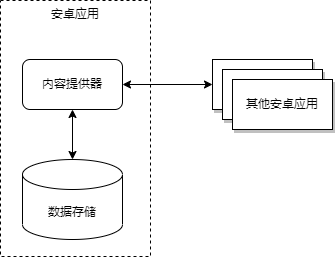
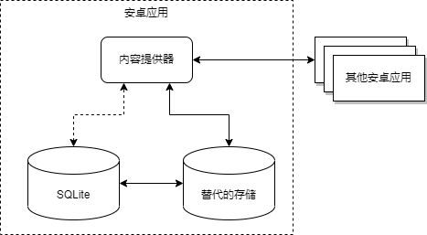

# 内容提供器

任何应用程序都可以通过文件系统或数据库存储文件，其它应用程序可以来读取这些文件（当然可能需要某些访问权限的设置）。在安卓上，应用程序的所有数据对其他应用程序都是私有的，其他应用只有通过设置权限才可以获取数据。安卓系统提供了几种本地数据的存储方式。如果要将这些数据共享的话，安卓通过定义内容提供器能够把私有数据公开给其他应用程序。内容提供器是一种为了开放应用程序的数据读写，具有访问权限的可选组件，可以通过这个组件实现私有数据的读写访问。内容提供器提供了请求和修改数据的标准语法和读取返回数据的标准机制。安卓为标准的数据类型提供了一些内容提供器，如图像、视频和音频文件，以及个人通讯录信息。安卓提供几种持久化应用程序数据的选择，具体选择那种方式依赖于具体的需求，例如数据应该是应用程序私有的还是共享的，或者数据所需要的存储空间等。

## 基本概念

一般情况下安卓应用程序的数据是私有的，其他应用程序不具有访问的权限。但很多时候安卓应用程序的服务包括数据的服务，某些数据希望开放给其他安卓应用程序使用。安卓系统解决这个问题的方法是定义一个通用的、格式统一的数据访问接口，使其他应用程序可以通过调用这个接口提供的方法，访问和修改数据。内容提供器是安卓系统提供给用户的一个接口，用于管理如何访问应用程序私有数据的存储库。这里的数据包括结构化存储数据和非结构化存储数据。

安卓系统所定义的访问数据资源的接口称为内容提供器，主要是被其他应用程序引用，为应用程序提供一个一致的、标准的数据访问接口，其中包含了处理进程间的联系和数据安全访问。应用程序向外部开放数据访问，都通过内容提供器来实现。内容提供程序管理对中央数据存储区的访问。提供程序是安卓应用的一部分，通常提供自己的界面来处理数据。但是，内容提供程序主要目的是供其他应用使用，这些应用使用提供程序客户端对象进行访问。提供程序与提供程序客户端共同提供一致的标准数据界面，该界面还可处理进程间通信并保护数据访问的安全性。通常，会在以下两种场景中使用内容提供程序：一种是通过实现代码访问其他应用中的现有内容提供程序；另一种是在应用中创建新的内容提供程序，从而与其他应用共享数据。内容提供器向外部应用程序呈现的数据就像一张二维表，就像是在关系数据库里一样。每行显示一些数据类型的实例，列的每行显示实例数据集合的字段，例如在安卓平台上有一个内置的用户词典，存储了用户想保存的非标准词的拼写，表
8-1显示了数据在内容提供器的表中可能看起来的样子。

|             |        |           |        |      |
| ----------- | ------ | --------- | ------ | ---- |
| Word        | app id | frequency | locale | \_ID |
| mapreduce   | user1  | 100       | en\_US | 1    |
| precompiler | user14 | 200       | fr\_FR | 2    |
| Applet      | user2  | 225       | fr\_CA | 3    |
| Const       | user1  | 225       | fr\_BR | 4    |
| Int         | user5  | 100       | en\_Uk | 5    |

表 8‑1

在表
8-1中，每行代表了一个不能在标准字典中找到的词，每一列代表了这个词的一个属性。第一行的是存储在内容提供器中的列名称。在这个内容提供器中，\_ID列作为主键列，由内容提供器自动管理维护。主键对于一个内容提供器并不是必须具备的，即使有主键，内容提供器也不必一定要使用\_ID作为主键的列名。但是，如果要把内容提供器中的数据通过用户界面显示出来，常常需要把内容提供器绑定到一个叫作ListView的用户界面控件上，这就必须有一个列名叫作\_ID。在后面讨论显示查询结果的部分，会对此有详细的解释。

内容提供器有助于应用管理其自身和其他应用所存储数据的访问，并提供与其他应用共享数据的方法。它们会封装数据，并提供用于定义数据安全性的机制。内容提供程序是一种标准接口，可将一个进程中的数据与另一个进程中运行的代码进行连。实现内容提供程序大有好处。最重要的是，通过配置内容提供程序，可以使其他应用安全地访问和修改应用数据（如图
8‑1所示）。

<table>
<tbody>
<tr class="odd">
<td>

图 8‑1 内容提供程序如何管理存储空间访问
</td>
<td>

图 8‑2迁移内容提供程序存储空间
</td>
</tr>
</tbody>
</table>

如果计划共享数据，则可使用内容提供程序。如果不打算共享数据，也可使用内容提供程序，因为它们可以提供很好的抽象，但无需如此。此抽象可让修改应用数据存储实现，同时不会影响依赖数据访问的其他现有应用。在此情况下，受影响的只有内容提供程序，而非访问该提供程序的应用。例如，可以将
SQLite 数据库换成其他存储空间（如图 8‑2所示）。许多其他类依赖于 ContentProvider 类：

  - AbstractThreadedSyncAdapter

  - CursorAdapter

  - CursorLoader

如果正在使用以上某个类，则还需在应用中实现内容提供程序。注意，使用同步适配器框架时，还可使用另一种方案：创建存根内容提供程序。如需了解有关此主题的更多信息，参阅创建存根内容提供程序。此外，在下列情况下，需要自定义内容提供程序：

  - 希望在自己的应用中实现自定义搜索建议

  - 需要使用内容提供程序向微件公开应用数据

  - 希望将自己应用内的复杂数据或文件复制并粘贴到其他应用中

安卓框架内的某些内容提供程序可管理音频、视频、图像和个人联系信息等数据。android.provider
软件包参考文档中列出了其中的部分提供程序。虽然存在一些限制，但任何安卓应用均可访问这些提供程序。内容提供程序可用于管理对各种数据存储源的访问，包括结构化数据（如
SQLite
关系型数据库）和非结构化数据（如图像文件）。内容提供程序可精细控制数据访问权限。可以选择仅在应用内限制对内容提供程序的访问，授予访问其他应用数据的权限，或配置读取和写入数据的不同权限。可以使用内容提供程序将细节抽象化，以用于访问应用中的不同数据源。例如，应用可能会在
SQLite
数据库中存储结构化记录，以及视频和音频文件。如果在应用中实现此开发模式，则可使用内容提供程序访问所有这类数据。另注意，CursorLoader
对象依赖于内容提供程序来运行异步查询，进而将结果返回至应用的界面层。如需了解有关使用 CursorLoader
在后台加载数据的更多信息，参阅使用 CursorLoader 运行查询。

应用程序使用访问提供器客户端对象来访问内容提供者的数据，可以称其为内容访问器。内容访问器的方法提供了基本的“CRUD”（创建，检索，更新和删除）数据存储的功能。因此在使用其他应用程序定义的内容提供器数据时，对于应用程序来说内容访问器的对象只是一个访问器，用于与内容提供器连接以及传递操作和参数，并不需要知道数据的具体存储结构，也不需要编码实现功能，具体的访问操作由内容提供器子类的同名方法来完成，这样其他应用程序只要了解内容提供器的数据二维表，就可以完成数据交互了。当然如果要访问内容提供器，应用程序必须在Manifest文件中添加特定的权限。这些将在内容提供器
权限中详细介绍。客户端应用程序进程中的内容访问器对象和内容提供器对象会自动处理进程间通信。内容提供器也会以二维表的形式，在存储的数据和数据的外部显示之间作为中间的抽象层。

在调用ContentProvider.query()方法时，第一个参数是Uri类的对象。Uri是安卓用来描述Content
URI的类。什么是Content URI呢？通用资源标志符Universal Resource Identifier,
简称"URI"。Content
URI就是内容提供器中数据的内容统一资源标识，能够在存储介质中唯一标识内容提供器中数据所在的具体位置。这有点类似通过web地址去访问网页。内容提供器对象通过URI来选择要访问内容提供器的表和数据，当调用内容访问器客户端的方法来访问内容提供器中的一个表时，会把这个表对应的URI标识作为参数传递给调用的方法。在安卓系统中，Content
URI主要分三个部分：scheme、authority 和path。其中authority又分为host和port（见**图 8.1**）。

**图** **8‑3 通用资源标识符URI结构**

一般来说，资源标识符的结构包括三个部分：协议类型、资源名称和路径。下面对照Internet的统一资源定位符，分别说明在Content
URI中这三部分的具体定义。

  - 协议类型

称为scheme，对应**图 8.1**中的A部分，表示资源的类型。如果是网站资源则为”HTTP://”，Content
URI则为”content://”。

  - 资源名称

称为authority，对应**图 8.1**中的B部分，表示资源的唯一名称。如果是网站资源则为域名，Content
URI中则是内容提供器的唯一标识名称，可以使用包和类名来定义内容提供器资源名称。

  - 路径

称为path，对应**图 8.1**中的C和D部分，表示资源中的数据。如果是网站资源则为服务器上网页的路径名，Content
URI中则是内容提供器中的表名或指定表中的记录。例如**图
8.1**中C和D都是用来指定路径，C一般用来指定数据库中表的名字，这里指出使用trains表中的数据，D可以用来指定数据库中的一条记录，这里指定了ID为122的记录，如果没有指定ID，就表示返回全部记录。

安卓内置的内容提供器通常有一个简单的子类型，例如通讯录的应用中，当创建一个电话号码时，可以设置MIME类型为vnd.android.cursor.item/phone\_v2，其中子类型为phone\_v2。内容提供器开发人员可以基于内容提供器资源名称和表名创建他们自己的子类型模式。例如考虑一个包含列车时刻表的内容提供器，内容提供器的资源名称为：com.example.trains，其包含的表有Line1、Line2和Line3。如果访问表Line1的Content
URI为：

> content://com.example.trains/Line1

则对于表Line1，内容提供器返回MIME类型为多条记录：

> vnd.android.cursor.dir/vnd.example.line1

如果访问表Line2的Content URI为：

> content://com.example.trains/Line2/5

则对于表Line2的行5，内容提供器返回MIME类型为单条记录：

> vnd.android.cursor.item/vnd.example.line2

ContentProvider类提供了两个方法返回MIME类型，其中getType()方法是必须实现的方法；如果使用内容提供器提供文件类型数据，需要实现getStreamTypes()方法。

MIME的英文全称是“Multipurpose Internet Mail
Extensions”，称为多用途互联网邮件扩展。这是一种互联网标准。在1992年，MIME最早应用于电子邮件系统，但后来也应用到浏览器。当用户访问网站资源时，服务器会返回资源的MIME类型，浏览器会根据MIME类型调用正确的程序来查看内容。内容提供器也为给定资源定义了MIME类型。每个MIME类型由两部分组成，前面是数据的大类别（例如audio代表声音数据、image代表图像数据、text代表文本数据等），后面定义具体的子类别，格式为：大类别/子类别，例如下面是一些常用的MIME类型。

  - text/html

  - text/css

  - text/xml

  - text/vnd.curl

  - application/pdf

  - application/rtf

  - application/vnd.ms-excel

Internet中有一个专门组织IANA来确认标准的MIME类型，在IANA互联网数字分配机构网站上可以看到已注册的类型和子类型的完整列表，网址如下：

> http://www.iana.org/assignments/media-types/

已注册的主要类型包括application、audio、example、message、model、multipart、text、video。如果供应商具有专用的数据格式，那么子类型名称将以vnd开头，例如微软Excel电子表格使用子类型vnd.ms-excel标识，而pdf被视为一种专用供应商标准，所以对它的标识没有任何供应商特定的前缀。Internet发展的太快，很多应用程序等不及IANA来确认他们使用的MIME类型为标准类型。因此他们使用在类别中以x-开头的方法标识这个类别还没有成为标准，例如：x-gzip，x-tar等。事实上这些类型运用的很广泛，已经成为了事实标准。只要客户机和服务器共同承认这个MIME类型，即使它是不标准的类型也没有关系，客户程序就能根据MIME类型，采用具体的处理手段来处理数据。而Web服务器和浏览器（包括操作系统）中，缺省都设置了标准的和常见的MIME类型，只有对于不常见的
MIME类型，才需要同时设置服务器和客户浏览器以进行识别。安卓遵循类似的约定来定义MIME类型，而且每个内容类型的MIME类型都具有两种形式：单条记录和多条记录。对于单条记录，MIME类型类似于：

> vnd.android.cursor.item/vnd.yourcompanyname.contenttype；

对于多条记录，MIME类型类似于：

> vnd.android.cursor.dir/vnd.yourcompanyname.contenttype

上面两个MIME类型中，vnd.android.cursor.dir表示返回多行结果；vnd.android.cursor.item表示返回单行结果，而子类型是指特定的内容提供器。

## 使用内容提供器

内容提供程序以一个或多个表的形式将数据呈现给外部应用，这些表与关系型数据库中的表类似。行表示提供程序收集的某种类型数据的实例，行中的每一列表示为一个实例所收集的单个数据。内容提供程序协调很多不同的
API 和组件对应用数据存储层的访问（如图 1 所示），其中包括：

  - 与其他应用共享对应用数据的访问

  - 向微件发送数据

  - 使用 SearchRecentSuggestionsProvider，通过搜索框架返回对应用的自定义搜索建议

  - 通过实现 AbstractThreadedSyncAdapter，将应用数据与服务器同步

  - 使用 CursorLoader 在界面中加载数据

<table>
<tbody>
<tr class="odd">
<td>

图 8‑4内容提供程序与其他组件的关系
</td>
<td>

图 8‑5 内容提供程序、其他类和存储空间之间的交互
</td>
</tr>
</tbody>
</table>

如需访问内容提供程序中的数据，可以客户端的形式使用应用的 Context 中的 ContentResolver
对象与提供程序进行通信。ContentResolver 对象会与提供程序对象（即实现
ContentProvider
的类的实例）通信。提供程序对象从客户端接收数据请求、执行请求的操作并返回结果。此对象的某些方法可调用提供程序对象（ContentProvider
某个具体子类的实例）中的同名方法。ContentResolver
方法可提供持久性存储空间的基本“CRUD”（创建、检索、更新和删除）功能。从界面访问
ContentProvider 的常用模式是使用 CursorLoader 在后台运行异步查询。界面中的活动或片段会调用查询的
CursorLoader，其转而使用 ContentResolver 获取
ContentProvider。如此一来，用户便可在查询运行时继续使用界面。如图
8‑5所示，此模式涉及很多不同对象的交互，以及底层存储机制。

应用程序通过内容访问器的对象访问内容提供器时，所使用的方法会调用内容提供器一个具体子类对象的相同名字的方法。例如，为了从用户字典的内容提供器中获得单词和它们出现的语言环境列表，可以使用ContentResolver.query()方法（见码
8‑1）。这个query()方法会调用在用户字典内容提供器中定义的ContentProvider.query()方法。

// 访问用户字典并返回游标

mCursor = getContentResolver().query(

UserDictionary.Words.CONTENT\_URI, // 词表的内容URI

mProjection, // 每行中返回数据的列的名称，

// null表示返回所有列的数据。

mSelectionClause // 过滤条件

mSelectionArgs, // 过滤条件的参数

mSortOrder); // 返回行的排序方式

码 8‑1 **ContentResolver.query()的调用**

表 8‑2展示 query(Uri,projection,selection,selectionArgs,sortOrder) 的参数如何匹配
SQL SELECT 语句：

| query() 参数    | SELECT 关键字/参数                | 备注                                |
| ------------- | ---------------------------- | --------------------------------- |
| Uri           | FROM table\_name             | Uri 映射至提供程序中名为 table\_name 的表。    |
| projection    | col,col,col,...              | projection 是检索到的每个行所应包含的列的数组。     |
| selection     | WHERE col = value            | selection 指定选择行的条件。               |
| selectionArgs | 没有完全等效项，选择参数会替换选择子句中的 ? 占位符。 |                                   |
| sortOrder     | ORDER BY col,col,...         | sortOrder 指定在返回的 Cursor 中各行的显示顺序。 |

表 8‑2Query() 与 SQL 查询的比较

内容 URI 用来在提供程序中标识数据。内容 URI
包括整个提供程序的符号名称（其授权）和指向表的名称（路径）。当调用客户端方法以访问提供程序中的表时，该表的内容
URI 将是其参数之一。在前面的代码行中，常量 CONTENT\_URI 包含用户字典的“字词”表的内容 URI。ContentResolver
对象会解析出 URI 的授权，并将该授权与已知提供程序的系统表进行比较，从而“解析”提供程序。然后，ContentResolver
可以将查询参数分派给正确的提供程序。ContentProvider 使用内容 URI
的路径部分选择需访问的表。通常，提供程序会为其公开的每个表显示一条路径。在前面的代码行中，“字词”表的完整
URI 是：

content://user\_dictionary/words

其中，user\_dictionary 字符串是提供程序的授权，words 字符串是表的路径。字符串
content://（架构）始终显示，并且会将其标识为内容 URI。

许多提供程序都允许通过将 ID 值追加到 URI 末尾以访问表中的单个行。例如，如需从用户字典中检索 \_ID 为 4 的行，可以使用以下内容
URI：

Uri singleUri =
ContentUris.withAppendedId(UserDictionary.Words.CONTENT\_URI,4);

在检索到很多行并且想要更新或删除其中某一行时，通常可以使用 ID 值。注意：Uri 和 Uri.Builder
类包含一些便捷方法，可用于根据字符串构建格式规范的 URI
对象。ContentUris 类包含一些便捷方法，可用于将 ID 值轻松追加至 URI 末尾。前段代码使用
withAppendedId() 将 ID 追加至 UserDictionary 的内容 URI 末尾。

### 获取数据

安卓应用程序通过Content URI定位，来获取内容提供器中所需要的数据。Content
URI对于内容提供器来说是唯一的，对于开发人员来说也是非常重要的。因此通常在内容提供器中将Content
URI定义为常量，方便开发人员的引用。下面是安卓系统预定义的一些内容提供器的Content URI常量。

> MediaStore.Images.Media.INTERNAL\_CONTENT\_URI
> 
> MediaStore.Images.Media.EXTERNAL\_CONTENT\_URI
> 
> ContactsContract.Contacts.CONTENT\_URI

码 8‑2

这些常量对应的Content URI的值如下：

> content://media/internal/images
> 
> content://media/external/images
> 
> content://com.android.contacts/contacts/

码 8‑3

安卓系统的内置通讯录内容提供器使用ContactsContract.Contacts.CONTENT\_URI常量来标识内容提供器中联系人数据。有了具体的Content
URI，为了从内容提供器中检索数据，需要两个基本步骤：

  - 步骤一给内容提供器申请读访问权限。

  - 步骤二定义将查询发送至提供程序的代码。

下面以用户词典的内容提供器为例，说明如何从其中获取数据。

（1）给提供器申请读访问权限

能够从内容提供器中获取数据的前提，首先是所访问的内容提供器允许其他应用程序的读访问。从内容提供器中获取数据，应用程序需要“读权限”。这个权限不能在应用程序运行时设置，需要在应用程序的Manifest文件中里预先声明需要的权限元素。如果指定了这个元素，当用户安装这个应用程序时，系统会隐式地付给其相应的权限。

Manifest文件中的权限声明元素是\<uses-permission\>元素，权限的值从将要访问内容提供器所定义的权限中选择，根据需求指定准确的权限名称。例如，用户字典的内容提供器的定义了权限android.permission.READ\_USER\_DICTIONARY，作为其可读取的权限。如果应用程序需要从用户字典的内容提供器读取数据，就需要在其Manifest文件里声明用户字典的内容提供器的可读取，代码如下：

> \<uses-permission android:name="
> android.permission.READ\_USER\_DICTIONARY" /\>

码 8‑4

（2）构造查询代码

权限申请完成后，从内容提供器中检索数据的第二步就是构建查询程序，接下来以用户词典的内容提供器为例，说明如何使用ContentResolver.query()获取其中的数据。由于ContentResolver.query()的参数对应于SElECT语句的结构，类似于关系数据库表的查询。因此如果要获取某个内容提供器中的数据，必须要清楚这个内容提供器可以提供什么数据内容，也就是明了这个二维表的结构。这可以从内容提供器的文档中查到。首先在应用程序中，对应ContentResolver.query()的参数，声明一些访问用户词典内容提供器所需要的一些变量（见码
8‑5）。

> public class TryAccessDictionary{
> 
> String\[\] mProjection = {
> 
> UserDictionary.Words.\_ID, // Contract class constant for the \_ID
> column name
> 
> UserDictionary.Words.WORD, // Contract class constant for the word
> column name
> 
> UserDictionary.Words.LOCALE // Contract class constant for the locale
> column name
> 
> };
> 
> // Defines a string to contain the selection clause
> 
> String mSelectionClause = null;
> 
> // Initializes an array to contain selection arguments
> 
> String\[\] mSelectionArgs = {""};
> 
> }

码 8‑5 变量声明

码 8‑6以用户字典提供程序为例，展示如何使用 ContentResolver.query()。提供程序客户端查询与 SQL
查询类似，并且包含一组需要返回的列、一组选择条件和排序顺序。对于指定待检索行的表达式，将其拆分为选择子句和选择参数。选择子句是逻辑和布尔表达式、列名称以及值（变量
mSelectionClause）的组合。如果指定可替换参数 ? 而非值，查询方法会从选择参数数组（变量
mSelectionArgs）中检索值。如果用户未输入字词，选择子句将设置为
null，查询会返回提供程序中的所有字词。如果用户输入了字词，选择子句将设置为
UserDictionary.Words.WORD + " =
?"，且选择参数数组的第一个元素将设置为用户输入的字词。定义好变量就可以编写获取数据的方法了。

private Cursor getWordDictionary(String mSearchString) {

String mSelectionClause;

String\[\] mSelectionArgs = new String\[1\];

if (TextUtils.isEmpty(mSearchString)) {

mSelectionClause = null;

mSelectionArgs = null;

} else {

mSelectionClause = UserDictionary.Words.WORD + " = ?";

mSelectionArgs\[0\] = mSearchString;

}

Cursor mCursor = getContentResolver().query(

UserDictionary.Words.CONTENT\_URI,

mProjection,

mSelectionClause,

mSelectionArgs,

mSortOrder);

return mCursor;

}

码 8‑6 **获取内容提供器数据**

此查询类似于以下 SQL 语句：

SELECT \_ID, word, locale FROM words WHERE word = \<userinput\> ORDER BY
word ASC;

码 8‑7

在此 SQL
语句中，会使用实际的列名称而非协定类常量。当调用ContentResolver.query()方法时，其实际调用了内容提供器中的ContentProvider.query()方法。ContentResolver.query()方法返回的结果是一个游标对象，下面详细说明其参数的作用。

  - Uri uri：对应内容提供器中的表名对对应的Content URI。

  - String\[\]
    projection：查询结果中包含的字段：这是一个数组，指定需要返回数据的列，如果为null则返回所有列。从效率上来说，如果不是用到所有的列，最好明确指定。

  - String
    selection：指定过滤数据的条件，其格式相当于SQL选择语句中的WHERE子句的条件表达式，如果为null，则表示返回所有行。一般来说查询数据的SQL表达式是有WHERE条件的，而ContentResolver.query()方法中的selection参数就对应WHERE条件，它是一个逻辑、布尔值、列名、数值的复合表达式。

  - String\[\]
    selectionArgs：如果在selection参数使用了？占位符号，表示这个位置需要指定一个条件值。而这个数值是由selectionArgs参数指定的。

  - String sortOrder：排序子句：指定数据行的排列规则，其格式相当于SQL语句的ORDER
    BY子句中的表达式。如果为null，则使用缺省的排序方式，或者不排序。

如果selection参数中有多个？占位符，selectionArgs参数中字符串数组的顺序与selection参数顺序一致。为什么需要通过这种方式传入条件参数呢？这是为了防止恶意输入SQL语句。如果内容提供器管理的数据保存在SQL数据库里，假设有外部不可信的数据插入到原始的SQL语句中，有可能导致恶意SQL输入，假设条件参数变量定义如下：

String mSelectionClause = "var = " + mUserInput;

如果mUserInput是一个需要用户输入的变量，这就为插入恶意的SQL语句提供了条件，例如用户可以在界面为mUserInput变量输入：

nothing; DROP TABLE \*;

这样在数据库上执行的就不止一条查询语句了，会执行DROP操作，就会导致内容提供器删除SQLite数据库里所有的表。为了解决这个问题，使用一个带有？作为可替的选择参数，然后在使用另一个的选择参数数组来组合定义查询方法。这样，用户的输入会直接绑定到查询方法的选择参数中，而不是作为SQL语句的一部分被解释。由于它没有被视为是SQL语句，用户输入不可以注入恶意的SQL。

（3）显示查询结果

ContentResolver.query()方法执行后，返回的是游标对象，这是一个查询结果集合。如果遍历这个游标对象，就可以读取结果集中的所有数据，输出查询结果。码
8‑7中使用Cursor的move()方法在结果集中移动游标指针，使用Cursor的getString()方法获取当前记录各字段的值，并在控制台输出个记录结果。

public void printQueryResult(Cursor c) {

if(cursor.moveToFirst() {

for(int i=0;i\<cursor.getCount();i++){

cursor.move(i);

String word = cursor.getString(0);

String user=cursor.getString(1);

String local=cursor.getString(2);

//输出用户信息

System.out.println(word+" : "+user+" : "+local+”\\n”);

}

}

码 8‑8 **输出查询结果**

如果没有与选择条件匹配的行，提供程序会返回 Cursor.getCount() 为 0的 Cursor 对象（空
Cursor）。如果出现内部错误，查询结果视具体提供程序而定。它可能会选择返回 null，或抛出
Exception。由于 Cursor 是行“列表”，因此显示 Cursor 内容的一个好方法是通过 SimpleCursorAdapter
将其与 ListView 关联。创建一个包含由查询检索到的 Cursor 的 SimpleCursorAdapter
对象，并将此对象设置为 ListView 的适配器：

// Defines a list of columns to retrieve from the Cursor and load into
an output row

String\[\] wordListColumns =

{

UserDictionary.Words.WORD, // Contract class constant containing the
word column name

UserDictionary.Words.LOCALE // Contract class constant containing the
locale column name

};

// Defines a list of View IDs that will receive the Cursor columns for
each row

int\[\] wordListItems = { R.id.dictWord, R.id.locale};

// Creates a new SimpleCursorAdapter

cursorAdapter = new SimpleCursorAdapter(

getApplicationContext(), // The application's Context object

R.layout.wordlistrow, // A layout in XML for one row in the ListView

mCursor, // The result from the query

wordListColumns, // A string array of column names in the cursor

wordListItems, // An integer array of view IDs in the row layout

0); // Flags (usually none are needed)

// Sets the adapter for the ListView

wordList.setAdapter(cursorAdapter);

码 8‑9

注意：如需通过 Cursor 支持 ListView，Cursor 必需包含名为 \_ID 的列。正因如此，即使 ListView 未显示
\_ID 列，前文显示的查询也会为“字词”表检索该列。此限制也解释了为什么大多数提供程序的每个表都有 \_ID
列。可以将查询结果用于其他任务，而不只是显示查询结果。例如，可以从用户字典中检索拼写，然后在其他提供程序中查找它们。如需执行此操作，需在
Cursor 中循环访问行：

// Determine the column index of the column named "word"

int index = mCursor.getColumnIndex(UserDictionary.Words.WORD);

/\*

\* Only executes if the cursor is valid. The User Dictionary Provider
returns null if

\* an internal error occurs. Other providers may throw an Exception
instead of returning null.

\*/

if (mCursor \!= null) {

/\*

\* Moves to the next row in the cursor. Before the first movement in the
cursor, the

\* "row pointer" is -1, and if you try to retrieve data at that position
you will get an

\* exception.

\*/

while (mCursor.moveToNext()) {

// Gets the value from the column.

newWord = mCursor.getString(index);

// Insert code here to process the retrieved word.

...

// end of while loop

}

} else {

// Insert code here to report an error if the cursor is null or the
provider threw an exception.

}

码 8‑10

Cursor 实现包含多个“获取”方法，用于从对象中检索不同类型的数据。例如，上一个代码段使用 getString()。它们还具有
getType() 方法，返回该列的数据类型的值。

### 修改数据

如果需要插入、更新或者删除数据，首先要考虑的还是权限的问题。需要为内容提供器定义不同的数据访问权限，以便其他应用能够访问其提供的数据。权限的定义可以保证用户能够知道应用程序中的哪些数据可以访问。基于内容提供器提供的说明，其他的应用程序可以根据自身的需求来申请权限去访问内容提供器，最后用户在安装此应用时会看到该应用请求获得的权限。如果包含内容提供器的应用没有指定任何权限，其他的应用程序是无法访问该内容提供器的数据的。但是无论是否指定了权限，包含内容提供器应用的其他组件拥有对该内容提供器的完全读写权限。

正如上面所说，
内容提供器在用户字典中使用android.permission.WRITE\_USER\_DICTIONARY权限来控制对数据的插入，更新和删除。为获得访问内容提供器的权限，应用程序在Manifest文件中需要使用uses-permission|标签。当安卓包管理器安装应用时，用户必须批准应用程序的所有权限请求。如果用户允许了，包管理器会继续安装流程；如果用户不允许，包管理器会终止安装。例如，在应用程序中插入、更新或者删除用户字典内容提供器的数据，需要在Manifest文件中声明android.permission.WRITE\_USER\_DICTIONARY权限，例如：

\<uses-permission
android:name="android.permission.WRITE\_USER\_DICTIONARY" /\>

码 8‑11

#### 插入数据

如果向内容提供器中插入数据，需要调用ContentResolver.insert()方法。这个方法向内容提供器中插入一行新数据，然后返回该行数据的资源标识符。ContentResolver.insert()方法的参数说明如下：

  - Uri url：资源标识符Content URI

  - ContentValues values：ContentValues对象，存有所要插入的新记录各字段的值。

使用ContentValue.put()分别给每个字段赋值，前一个参数是内容提供器定义的字段名称，后一个参数是给这个字段的赋值。码
8‑9中实现了给用户字典内容提供器添加一行新记录的功能。首先创建一个新的ContentValue对象，通过put()把值分别赋给各个字段。这条数据中并没有插入\_ID字段，那是因为它会自动的被增加到数据中。内容提供器会给每一行数据赋予一个唯一的\_ID,而它往往就被看作数据库表中的主键。

Uri mNewUri;

// Defines an object to contain the new values to insert

ContentValues mNewValues = new ContentValues();

/\*

\* Sets the values of each column and inserts the word. The

\* arguments to the "put" method are "column name" and "value"

\*/

mNewValues.put(UserDictionary.Words.APP\_ID, "example.user");

mNewValues.put(UserDictionary.Words.LOCALE, "en\_US");

mNewValues.put(UserDictionary.Words.WORD, "insert");

mNewValues.put(UserDictionary.Words.FREQUENCY, "100");

mNewUri = getContentResolver().insert(

UserDictionary.Words.CONTENT\_URI,

mNewValues // the values to insert

);

mCursor = getWordDictionary(null);

mCursorAdapter.changeCursor(mCursor);

Toast.makeText(this, "插入数据为" + mNewUri.getEncodedPath(),

Toast.LENGTH\_SHORT).show();

码 8‑12 **插入数据**

新行的数据会进入单个 ContentValues 对象中，该对象在形式上与单行 Cursor
类似。此对象中的列无需拥有相同的数据类型，如果不想指定值，则可以使用
ContentValues.putNull() 将列设置为 null。此段代码不会添加 \_ID
列，因为系统会自动维护此列。提供程序会向添加的每个行分配唯一的
\_ID 值。通常，提供程序会将此值用作表的主键。mNewUri中返回的内容 URI 会按以下格式标识新添加的行：

content://user\_dictionary/words/\<id\_value\>

其中的id\_value为新增行的\_ID。安卓系统还提供了自动检测资源标识符格式的API，例如调用[ContentUris.parseId()](http://developer.android.com/reference/android/content/ContentUris.html#parseId\(android.net.Uri\))方法，返回资源标识符的\_ID值。

#### 更新数据

如果要更新内容提供器中的数据，需要使用ContentResolver.update()方法。与插入数据类似，使用ContentValues对象来存储更新数据，同时与查询语句相同的条件参数。如果仅仅需要更新某些字段，只需要把这些字段的值添加到ContentValues对象中。如果需要清除一列的值，则把这列设为null。ContentResolver.update()方法的参数说明如下：

  - Uri uri：Content URI。

  - ContentValues values：带有记录更新值的ContentValues对象。

  - String where：WHERE子句，具体的条件值使用”?”替代。

  - String\[\]
    selectionArgs：WHERE子句中的参数，把whereClause中的”?”替换为具体的值，没有WHERE子句则为null。

ContentResolver.update()方法用来定义要更新的列和更新的值，如果要清除某一列的内容，使用ContentValues.putNull()方法将此值设为null。码
8‑10的例子中实现了对用户字典内容提供器表中记录的条件更新，选出“word”字段值中以“en”开头的记录，把其“local”字段更新为null。

// Defines an object to contain the updated values

ContentValues mUpdateValues = new ContentValues();

// Defines selection criteria for the rows you want to update

String mSelectionClause = UserDictionary.Words.LOCALE + "LIKE ?";

String\[\] mSelectionArgs = {"en\_%"};

// Defines a variable to contain the number of updated rows

int mRowsUpdated = 0;

/\*

\* Sets the updated value and updates the selected words.

\*/

mUpdateValues.putNull(UserDictionary.Words.LOCALE);

mRowsUpdated = getContentResolver().update(

UserDictionary.Words.CONTENT\_URI, // the user dictionary content URI

mUpdateValues // the columns to update

mSelectionClause // the column to select on

mSelectionArgs // the value to compare to

);

mCursor = getWordDictionary(null);

mCursorAdapter.changeCursor(mCursor);

System.out.println("更新行数为" + mRowsUpdated);

码 8‑13 **更新数据**

#### 删除数据

如果要删除内容提供器中的数据，需要使用ContentResolver.delete()方法。删除内容提供器中的数据与查询获取数据很类似，delete()方法不需要构造新的记录，只需要指定想删除行的选择条件参数，返回值是删除的行数。ContentResolver.delete()方法的参数说明如下：

  - Uri uri：Content URI。

  - String where：WHERE子句，具体的条件值使用“?“替代。

  - String\[\]
    selectionArgs：WHERE子句中的参数，把whereClause中的“?“替换为具体的值，没有WHERE子句则为null。

下面的代码删除“word”列中以“in”开头的单词。ContentResolver.delete()方法方法返回删除的行数。码
8‑11的例子中实现了对用户字典内容提供器表中记录的删除，删除“word”字段值中以“in”开头的记录。

mSelectionClause = UserDictionary.Words.WORD + " LIKE ?";

mSelectionArgs\[0\] = "in%";

// Defines a variable to contain the number of rows deleted

int mRowsDeleted;

// Deletes the words that match the selection criteria

mRowsDeleted = getContentResolver().delete(

UserDictionary.Words.CONTENT\_URI, // the user dictionary 资源标识符

mSelectionClause, // the column to select on

mSelectionArgs // the value to compare to

);

mCursor = getWordDictionary(null);

mCursorAdapter.changeCursor(mCursor);

System.out.println("删除行数为" + mRowsUpdated);

码 8‑14 删除数据

#### 批处理模式

安卓系统还提供了另外一种操作数据的方法，称为批模式。批模式可以一次在一个表中插入多行，或者插入行到多个表中，或者定义一个事务完成一系列跨处理边界的操作。如果要通过批模式访问内容管理者，需要创建包含ContentProviderOperation对象的操作数组，然后通过ContentResolver.applyBatch()方法，将操作数组派发到内容提供器上执行。ContentResolver.applyBatch()方法。操作数组中的ContentProviderOperation对象可以对应不同的表。ContentResolver.applyBatch()方法返回值为一个数组。ContentResolver.applyBatch()方法的参数说明如下：

  - String authority：字符串形式的Content URI中表的标识，指向需要操作的表。

  - ArrayList\<ContentProviderOperation\> operations：具体的操作。

码
8‑12中的例子，通过使用批处理模式对ContactsContract插入操作，说明了如何使用ContentResolver.applyBatch()方法。ContactsContract是安卓为通信录内容提供器。从安卓
2.0（API Level 5）开始，安卓平台提供了一个改进的Contacts
API，以适应一个联系人可以有多个帐户的需求，比如说手机通讯录和Gmail通讯录，两个通讯录中的两条记录可以是同一个人。新的Contacts
API主要是由ContactsContract及其相关的类来管理，联系人数据被放到三张表中：Data、RawContacts和Contacts。Data表存储了联系人的详细信息，表中的每一行存储一个特定类型的信息，比如Email、Address或Phone。RawContacts
用于关联联系人信息与账号，因为有可能手机的联系人信息是从不同的Gmail或者其他地方导入的，为互相区别并方便同步，特引入账号概念。Contacts
表中的一行表示一个联系人，它是RawContacts表中的一行或多行的数据的组合，这些RawContacts表中的行表示同一个人的不同的帐户信息。Contacts中的数据由系统组合RawContacts表中的数据自动生成。码
8‑12实现了从用户界面获取信息，然后把相应的信息插入通信录的功能。因为插入涉及Data、RawContacts和Contacts三个表，所以使用批处理来执行。

protected void createContactEntry() {

// Get values from UI

String name = mContactNameEditText.getText().toString();

String phone = mContactPhoneEditText.getText().toString();

String email = mContactEmailEditText.getText().toString();

int phoneType = mContactPhoneTypes.get(

mContactPhoneTypeSpinner.getSelectedItemPosition());

int emailType = mContactEmailTypes.get(

mContactEmailTypeSpinner.getSelectedItemPosition());;

ArrayList\<ContentProviderOperation\> ops = new
ArrayList\<ContentProviderOperation\>();

// 首先向RawContacts.CONTENT\_URI执行一个插入，

//目的是获取系统返回的rawContactId

ops.add(ContentProviderOperation.newInsert(RawContacts.CONTENT\_URI)

.withValue(RawContacts.ACCOUNT\_TYPE, mSelectedAccount.getType())

.withValue(RawContacts.ACCOUNT\_NAME,

mSelectedAccount.getName())

.build());

// 往data表写入姓名数据

ops.add(ContentProviderOperation.newInsert(Data.CONTENT\_URI)

.withValueBackReference(Data.RAW\_CONTACT\_ID, 0)

.withValue(Data.MIMETYPE,

CommonDataKinds.StructuredName.CONTENT\_ITEM\_TYPE)

.withValue(CommonDataKinds.StructuredName.DISPLAY\_NAME, name)

.build());

// 往data表写入电话数据

ops.add(ContentProviderOperation.newInsert(Data.CONTENT\_URI)

.withValueBackReference(Data.RAW\_CONTACT\_ID, 0)

.withValue(Data.MIMETYPE,

CommonDataKinds.Phone.CONTENT\_ITEM\_TYPE)

.withValue(CommonDataKinds.Phone.NUMBER, phone)

.withValue(CommonDataKinds.Phone.TYPE, phoneType)

.build());

// 往data表写入Email数据

ops.add(ContentProviderOperation.newInsert(Data.CONTENT\_URI)

.withValueBackReference(Data.RAW\_CONTACT\_ID, 0)

.withValue(Data.MIMETYPE,

CommonDataKinds.Email.CONTENT\_ITEM\_TYPE)

.withValue(CommonDataKinds.Email.DATA, email)

.withValue(CommonDataKinds.Email.TYPE, emailType)

.build());

try {

getContentResolver().applyBatch(AUTHORITY, ops);

} catch (Exception e) {

// 显示警告信息

Context ctx = getApplicationContext();

CharSequence txt = getString(R.string.contactCreationFailure);

int duration = Toast.LENGTH\_SHORT;

Toast toast = Toast.makeText(ctx, txt, duration);

toast.show();

}

}

码 8‑15 **使用批模式操作通信录**

在码
8‑12中，首先从界面获取要插入记录的姓名、电话、EMAIL、电话类型和EMAIL类型，然后创建新的ArrayList对象“ops”，这是一个ContentProviderOperation数组。这个数组用来存放多个数据库操作。如果要想完成一个操作，首先调用ContentProviderOperation的newInsert()方法创建一个构造插入语句的Builder对象。然后调用Builder中withValue()方法传入要插入的列和值。“ops”数组一共有四个ContentProviderOperation对象。第一个ContentProviderOperation对象使用的资源标识符为ContactsContract.RawContacts.CONTENT\_URI，这个资源表示获得联系人信息的账号（可以保存多个账号的联系人信息，例如Gmail、本地电话簿等）；后面三个ContentProviderOperation对象使用的资源标识符为ContactsContract.Data.CONTENT\_URI，这个资源表示联系人的元数据，这里保存了联系人的姓名、电话和EMAIL。账号和元数据之间具有父子关系，就是如果删除账号，则与其有关联的元数据都要被删除。一般来说，建立这种关联关系的方法是在元数据资源中创建指向账号资源主键的外键。通过withValueBackReference()方法建立这种关系。withValueBackReference()有两个参数，第一个参数是字符串类型，表示子表外键列名，第二参数是int类型，表示需要关联“ops”数组中的哪个ContentProviderOperation对象，是“ops”数组的索引（从0开始的整数）。

ContentProviderOperation对象中还包括newAssertQuery()、newDelet()和newUpdate()等方法，他们分别用来实现查询判定（如果传入期望值，可以判定查询结果与期望值是否相等）、删除和更新的操作。一旦提供了所有的参数后，就可以使用build()方法创建ContentProviderOperation对象。最后调用getContentResolver().applyBatch()方法，并且传入资源名称和操作数组对象ops执行所有的操作。内容提供程序可以提供多种不同的数据类型。用户字典提供程序仅提供文本，但提供程序也能提供以下格式：

  - 整数

  - 长整型 (long)

  - 浮点型

  - 长浮点型 (double)

提供程序经常使用的另一种数据类型是作为 64KB 字节的数组实施的二进制大型对象 (BLOB)。可以查看 Cursor
类的“获取”方法，从而查看可用数据类型。提供程序文档通常都会列出其每个列的数据类型。用户字典提供程序协定类
UserDictionary.Words 参考文档中列有其数据类型（如需详细了解协定类，参阅协定类部分）。也可通过调用
Cursor.getType() 确定数据类型。提供程序还会为其定义的每个内容 URI 维护
MIME（多用途互联网邮件扩展）数据类型信息。可以使用
MIME 类型信息查明应用是否可以处理提供程序提供的数据，或根据 MIME 类型选择处理类型。在使用包含复杂数据结构或文件的提供程序时，通常需要
MIME 类型。例如，联系人提供程序中的 ContactsContract.Data 表会使用 MIME
类型标记每行中存储的联系人数据类型。如需获取与内容 URI
对应的 MIME 类型，调用 ContentResolver.getType()。

### 通过意图

Intent 可以提供对内容提供程序的间接访问。即使应用没有访问权限，也可通过以下方式允许用户访问提供程序中的数据：从拥有权限的应用中返回结果
Intent，或者激活拥有权限的应用并允许用户使用该应用。即使没有适当的访问权限，也可通过以下方式访问内容提供程序中的数据：将 Intent
发送至拥有权限的应用，然后接收包含“URI”权限的结果 Intent。这些是特定内容 URI
的权限，将持续至接收该权限的活动结束。拥有永久权限的应用会在结果
Intent 中设置标记，从而授予临时权限：

  - 读取权限： FLAG\_GRANT\_READ\_URI\_PERMISSION

  - 写入权限： FLAG\_GRANT\_WRITE\_URI\_PERMISSION

注意：如果内容 URI 中包含提供程序的授权，这些标记不提供对提供程序的常规读取或写入访问权限。访问权限仅适用于 URI 本身。提供程序通过使用
\<provider\> 元素的 android:grantUriPermission 属性和 \<provider\> 元素的
\<grant-uri-permission\> 子元素，在其清单文件中定义内容 URI 的 URI 权限。权限概览指南更加详细地说明了 URI
权限机制。

例如，即使没有 READ\_CONTACTS
权限，也可以在联系人提供程序中检索联系人的数据。在向联系人发送电子生日祝福的应用中，可能希望执行此操作。相较于通过请求
READ\_CONTACTS 访问用户的所有联系人及其信息，可能更愿意让用户控制应用所使用的联系人。为此需完成以下过程：

  - (1)应用会使用 startActivityForResult() 方法发送包含 ACTION\_PICK 操作和
    CONTENT\_ITEM\_TYPE“联系人”MIME 类型的 Intent。

  - (2)由于此 Intent 与“联系人”应用“选择”Activity 的 Intent 过滤器相匹配，因此活动会显示在前台。

  - (3)在选择活动中，用户会选择需要更新的联系人。发生此情况时，选择活动会调用 setResult(resultcode,
    intent)，以设置用于返回至应用的 Intent。Intent 包含用户选择的联系人的内容 URI，以及“extra”标记
    FLAG\_GRANT\_READ\_URI\_PERMISSION。这些标记会为应用授予 URI 权限，以便读取内容 URI
    所指向联系人的数据。然后，选择活动会调用 finish()，将控制权交还给应用。

  - (4)活动会返回至前台，并且系统会调用此活动的 onActivityResult()
    方法。此方法会收到“联系人”应用中选择活动所创建的结果
    Intent。

  - (5)通过来自结果 Intent 的内容
    URI，可以读取来自联系人提供程序的联系人数据，即使未在清单文件中请求对该提供程序的永久读取访问权限。可以获取联系人的生日信息或其电子邮件地址，然后发送电子祝福。

如需允许用户修改无权访问的数据，一种简单方法是激活拥有权限的应用，并让用户使用该应用执行修改。例如，日历应用会接受 ACTION\_INSERT
Intent，以便激活应用的插入界面。可以在此 Intent（应用会使用该 Intent
预填充界面）中传递“extra”数据。由于周期性事件的语法较为复杂，因此如需将事件插入日历提供程序，首选方法是激活拥有
ACTION\_INSERT 的日历应用，然后让用户在该应用中插入事件。如果应用具有访问权限，可能仍想使用 Intent
在其他应用中显示数据。例如，日历应用接受
ACTION\_VIEW意图，用于显示特定的日期或事件。如此一来，便可显示日历信息，而无需创建自己的界面。如需向某应用发送意图，该应用无需与提供程序关联。例如，可以从联系人提供程序中检索联系人，然后向图像查看器发送
ACTION\_VIEW意图（包含用于联系人图像的内容 URI）。

## 创建内容提供器

前面两节介绍了内容提供器的基础和数据访问，如果要定义一个自己的内容提供器，需要实现ContentProvider类，并在Manifest文件里定义相应的元素。但是创建内容提供器是一个比较复杂的过程，并非在任何情况下都需要创建内容提供器。在构建内容提供器之前，需要考虑一些问题，判断是否有必要创建内容提供器。例如需要向其它应用程序提供复杂的数据或文件吗？需要复制复杂的数据给其它应用程序吗？需要通过搜索框架提供定制的搜索建议吗？如果只是在自己的应用中操作SQLite数据库，则不需要创建内容提供器，如果其他应用程序需要操作这部分数据，则需要创建内容提供器。

### 设计过程

下面是建立一个内容提供器的基本步骤和需要使用的API，还需要定义一个活动来测试内容提供器数据查询和操作。

#### 储存结构

内容提供器是一个操作结构化数据的接口。在创建接口之前，需要决定如何储存数据。内容提供器可以通过两种形式保存数据。一种是使用文件保存，数据通常需要写入文件，如：图片、音频、视频。文件存储在应用程序的私有空间里。为了响应其它应用程序的请求，内容提供器提供数据文件的句柄。还有一种是使用关系数据库，数据通常存储在数据库、数组或相似的结构中，它们都是以表的行列形式储存数据。行代表一个实体，如一个人或仓库中的一个产品。而列代表这个实体的数据，如人名、产品的价格。在安卓系统中，这种类型的数据通常是储存在SQLite数据库里。在创建内容提供器时，可以根据所存储的数据类型和数据服务，选择适当的数据存储类型。

如果选择使用文件存储数据，安卓系统提供了一系列有关文件操作的APIs。如果内容提供器预备提供的数据是位图文件或其他类型面向文件的数据，比较适合把数据存储在一个文件里并且直接提供，而不是通过表提供。其他应用程序在使用这些数据时，需要使用内容访问器文件方法来访问。

如果选择使用关系数据库存储数据，安卓系统提供了包含操作SQLite数据库的API，安卓系统中预定义的内容提供器就是使用关系数据库保存数据。SQLiteOpenHelper是创建数据库的帮助类，SQLiteDatabase是访问数据库的基类。虽然内容提供器对外的表现类似关系数据库，但是这对于内容提供器的内部实现来说并不是必须的。为了处理基于网络的数据，还可以使用Java.net和android.net里的API，把基于网络的数据同步到本地数据存储中，并且以表或文件的形式提供数据。

选择了数据的存储方式之后，一个重要的工作就是设计内容提供器表的数据结构。虽然主键对于一个内容提供器并不是必须具备的，即使有主键，内容提供器也不必一定要使用\_ID作为主键的列名。但是，如果要把内容提供器中的数据通过用户界面显示出来，常常需要把内容提供器绑定到一个叫作ListView的用户界面控件上，这就必须有一个列名叫做\_ID。

在内容提供器支持的数据类型中，Binary Large OBject
(BLOB)数据类型用于存储大小变化或数据结构变化的数据。例如，可以使用一个BLOB列来储存量一个protocol
buffer 或JSON
structure。对于这种类型的数据，可以使用BLOB来实现一个独立模式的表，定义一个主键和一个MIME类型的列，其它列定义为BLOB，BLOB列里的数据意义由MIME列来指定。这样可以在同一张表里存储不同的数据类型。

#### 资源标识

每一个内容提供器都使用资源标识符Content
URI来指定其中的数据。通过资源标识符，不仅可以唯一确定提供数据的内容提供器，还可以通过其中的路径来指定内容提供器中的表，甚至可以使用ID确切地访问指定表中的唯一行。而且内容提供器中的每个方法都有一个资源标识符作为参数，可以用来确定需要访问的表、行和文件。因此定义资源标识符是创建内容提供器很重要的部分。定义资源标识符主要考虑下面几个问题：

（1）内容提供器资源名的定义。

在安卓系统中，内容提供器应该具有唯一的资源名，作为其在安卓里的内部名。为了避免资源名的重复，资源名通常采用域名的格式。由于应用程序的包名也是按照这种格式设计的，因此，可以通过扩展包名的方式定义资源名。例如，应用程序的包名为com.example.\<appname\>，那么资源名称就可以定义为com.example.\<appname\>.provider。

（2）资源标识符的路径结构。

开发人员通常从资源名开始，在后面追加路径来指向具体的表。例如，在内容提供器中设计了两张表table1和table2，就可以使用下面的路径结构来指定对应的资源：com.example.\<appname\>.provider/table1和com.example.\<appname\>.provider/table2。路径可以有多个层次，不一定每个层次都指向表。

（3）处理资源标识符中的ID。

按照约定，通过使用带有ID值的资源标识符可以访问表中指定的一行。这个ID在资源标识符的末尾。一般来说，内容提供器的ID值与表中的\_ID值匹配，可以用来操作对应的数据行。当应用程序访问内容提供器时，这个约定是一个通用的设计模式。应用程序从内容提供器中查询数据返回游标对象，并且利用CursorAdapter在ListView中显示结果。定义CursorAdapter时，需要游标中有一列为\_ID。如果用户选取了ListView中的一行，希望可以查询或者修改对应的数据。这就需要应用程序从ListView的后台游标中得到这行\_ID值，然后附加到资源标识符的后面，然后发送访问请求给内容提供器，这样来完成对某一行数据的查询或修改。

不同资源标识符的模式对应不同的操作，所以需要识别不同资源标识符的模式。安卓的API中包含一个UriMatcher类，用来定义不同资源标识符的匹配模式。这个类把资源标识符的模式映射到一个整数，这样应用程序在switch语句中可以匹配对应整数来选择对应的操作。在做匹配的过程中，资源标识符模式使用了通配符，其中“\*”匹配一个字符串，可以任何长度的任何值；“\#”匹配一个字符串，可以是任何长度的数字。下面举例设计一组资源标识符，并且通过编码处理资源标识符，假定有一个内容提供器的资源名为com.example.app.provider，下面的资源标识符则指向具体的表：

content://com.example.app.provider/table1: A table called table1

content://com.example.app.provider/table2/dataset1: A table called
dataset1

content://com.example.app.provider/table2/dataset2: A table called
dataset2

content://com.example.app.provider/table3: A table called table3

码 8‑16

如果在上述的资源标识符后面加上ID，例如content://com.example.app.provider/table3/1则表示表table3中主键为1的行。对于com.example.app.provider来说，以下资源标识符的模式都是可用的：

  - content://com.example.app.provider/\*：表示匹配内容提供器的任何任何资源标识符。

  - content://com.example.app.provider/table2/\*：表示匹配dataset1和dataset2的资源标识符，不匹配表table1或table3的资源标识符。

  - content://com.example.app.provider/table3/\#：表示匹配table3中某行的资源标识符。

码
8‑14示例了UriMatcher的方法如何完成模式的匹配。这段代码中，针对表的资源标识符与单行的资源标识符实现了不同的处理方式，其中定义content://\<authority\>/\<path\>模式为表，定义content://\<authority\>/\<path\>/\<id\>模式为单行。UriMatcher的addURI()方法把资源名和路径映射到一个整数。match()方法返回了对应资源标识符的整数。然后通过一个switch语句根据不同整数来对应不同的模式，选择查询表或者单个记录。addURI()方法的参数说明如下：

  - String authority：Content URI的authority部分，也就是资源名。

  - tring path：Content URI的path部分，详细的表或记录路径。

  - int code：模式对应整数。

public class ExampleProvider extends ContentProvider {

//定义常量

private static final int PEOPLE = 1;

private static final int PEOPLE\_ID = 2;

private static final int PEOPLE\_PHONES = 3;

private static final int PEOPLE\_PHONES\_ID = 4;

private static final int PEOPLE\_CONTACTMETHODS = 7;

private static final int PEOPLE\_CONTACTMETHODS\_ID = 8;

private static final int DELETED\_PEOPLE = 20;

private static final int PHONES = 9;

private static final int PHONES\_ID = 10;

private static final int PHONES\_FILTER = 14;

private static final int CONTACTMETHODS = 18;

private static final int CONTACTMETHODS\_ID = 19;

private static final int CALLS = 11;

private static final int CALLS\_ID = 12;

private static final int CALLS\_FILTER = 15;

private static final UriMatcher sURIMatcher = new
UriMatcher(UriMatcher.NO\_MATCH);

//把资源标识符的模式映射到一个整数常量

static

{

sURIMatcher.addURI("contacts", "people", PEOPLE);

sURIMatcher.addURI("contacts", "people/\#", PEOPLE\_ID);

sURIMatcher.addURI("contacts", "people/\#/phones", PEOPLE\_PHONES);

sURIMatcher.addURI("contacts", "people/\#/phones/\#",
PEOPLE\_PHONES\_ID);

sURIMatcher.addURI("contacts", "people/\#/contact\_methods",
PEOPLE\_CONTACTMETHODS);

sURIMatcher.addURI("contacts", "people/\#/contact\_methods/\#",
PEOPLE\_CONTACTMETHODS\_ID);

sURIMatcher.addURI("contacts", "deleted\_people", DELETED\_PEOPLE);

sURIMatcher.addURI("contacts", "phones", PHONES);

sURIMatcher.addURI("contacts", "phones/filter/\*", PHONES\_FILTER);

sURIMatcher.addURI("contacts", "phones/\#", PHONES\_ID);

sURIMatcher.addURI("contacts", "contact\_methods", CONTACTMETHODS);

sURIMatcher.addURI("contacts", "contact\_methods/\#",
CONTACTMETHODS\_ID);

sURIMatcher.addURI("call\_log", "calls", CALLS);

sURIMatcher.addURI("call\_log", "calls/filter/\*", CALLS\_FILTER);

sURIMatcher.addURI("call\_log", "calls/\#", CALLS\_ID);

　　} 

　　

　　//使用match(url)获取定义的模式常量，根据常量值返回模式

public String getType(Uri url) {

int match = sURIMatcher.match(url);

switch (match)

{

case PEOPLE:

return "vnd.android.cursor.dir/person";

case PEOPLE\_ID:

return "vnd.android.cursor.item/person";

......

return "vnd.android.cursor.dir/snail-mail";

case PEOPLE\_ADDRESS\_ID:

return "vnd.android.cursor.item/snail-mail";

default:

return null;

}

}

  }

码 8‑17 定义和使用资源标识符模式

另外，ContentUris类提供了处理资源标识符中id部分的方法，Uri和Uri.Builder类中包含解析Uri对象，或者构建新对象的方法。

#### 实现类

定义自己的内容提供器，需要创建ContentProvider的子类，使用ContentProvider实例来处理其他应用的访问请求，并且管理结构化数据的访问。所有对内容提供器数据的访问，都通过所创建内容访问器对象，调用操作数据的方法，最终调用内容提供器中的具体方法来实现。因此，在子类里需要代码实现内容提供器提供六个抽象方法，具体来完成对内容提供器的数据操作，这六个抽象方法包括：query()、insert()、update()、delete()、getType()和oncreate()。除了onCreate()，其他方法都会被访问内容提供器的客户端应用程序调用。

  - query()

用来从内容提供器获取数据。通过参数来选择查询的表、返回行或列、结果排序。方法的查询结果返回游标对象。如果使用SQLite数据库存储数据，可以使用SQLiteDatabase类的query()方法来返回游标对象。如果没有匹配的行，也返回游标对象，但是其getCount()方法返回值为0。如果在查询中出现内部错误，将返回null。如果没有使用SQLite数据库保存数据，可以使用一个Cursor类的具体子类。例如，MatrixCursor类实现了游标的功能，其中每行数据是数组，可以使用addRow()方法添加新行。另外，由于用户程序访问内容提供器是跨进程通信，所以在进程间传递异常信息是非常重要的。IllegalArgumentException和NullPointerException可以在进程间通信，而且对于处理查询异常是非常有帮助的。

  - insert()

用来向内容提供器插入新行。使用参数选择表，获取使用的列值。返回一个新插入行的资源标识符。insert()方法向合适的表里添加行，使用ContentValues对象为列设置值。如果ContentValues里没有行名，内容提供器使用代码里或者数据库框架里的默认值。这个方法返回新行的资源标识符。使用withAppendedId()方法将新行的\_ID（或其它主键）附加到表的资源标识符后面。

  - delete()

用来删除行。使用参数选择删除的表和行，返回结果为删除的行数。delete()方法没有必要物理地删除行。

  - update()

用来更新存在的行。使用参数选择需要更新的表和行，然后更新其中列的值，返回结果为更新的行数。update()方法使用同insert()方法相同的ContentValues参数，同delete()和query()方法使用相同的selection和selectionArgs
参数。这样就可以允许在这些方法之前使用相同的代码。

  - onCreate()

初始化内容提供器。安卓系统在创建内容提供器之后就立即调用这个方法。注意直到内容访问器对象需要访问时，内容提供器才创建。

由于安卓系统在内容提供器启动的时候调用onCreate()，因此onCreate()方法不能有耗时太多的代码，避免延迟数据库的创建和数据加载。如果在
onCreate()里有耗时太多的任务，会减慢内容提供器的启动，也就会减慢其对其它应用程序的响应。下面一个例子，说明如何实现内容提供器的这些方法。这个例子实现了在方法ContentProvider.onCreate()里创建一个新的SQLiteOpenHelper对象来使用数据库，在打开数据库的时候创建表。这样，第一次调用getWritableDatabase()时，会自动调用方法SQLiteOpenHelper.onCreate()。代码
8.1实现ContentProvider.onCreate()方法。

public class ExampleProvider extends ContentProvider

    // Defines a handle to the database helper object.

    private MainDatabaseHelper mOpenHelper;

    // Defines the database name

    private static final String DBNAME = "mydb";

    // Holds the database object

    private SQLiteDatabase db;

    public boolean onCreate() {

        /\*

         \* Creates a new helper object. This method always returns
quickly.

         \* Notice that the database itself isn't created or opened

         \* until SQLiteOpenHelper.getWritableDatabase is called

         \*/

        mOpenHelper = new SQLiteOpenHelper(

            getContext(),        // the application context

            DBNAME,              // the name of the database)

            null,                // uses the default SQLite cursor

            1                    // the version number

        );

        return true;

    }

    ...

    // Implements the provider's insert method

    public Cursor insert(Uri uri, ContentValues values) {

        // Insert code here to determine which table to open, handle
error-checking, and so forth

        ...

        // Gets a writeable database.

        //This will trigger its creation if it doesn't already exist.

         db = mOpenHelper.getWritableDatabase();

    }

}

代码 8.1 实现ContentProvider.onCreate()方法

以下代码实现SQLiteOpenHelper.onCreate()：

...

// A string that defines the SQL statement for creating a table

private static final String SQL\_CREATE\_MAIN = "CREATE TABLE " +

    "main " +                       // Table's name

    "(" +                           // The columns in the table

    " \_ID INTEGER PRIMARY KEY, " +

    " WORD TEXT"

    " FREQUENCY INTEGER " +

    " LOCALE TEXT )";

...

/\*\*

 \* Helper class that actually creates and manages the provider's
underlying data repository.

 \*/

protected static final class MainDatabaseHelper extends SQLiteOpenHelper
{

    MainDatabaseHelper(Context context) {

        super(context, DBNAME, null, 1);

    }

    /\*

     \* Creates the data repository. This is called when the provider
attempts to open the

     \* repository and SQLite reports that it doesn't exist.

     \*/

    public void onCreate(SQLiteDatabase db) {

        // Creates the main table

        db.execSQL(SQL\_CREATE\_MAIN);

    }

}

码 8‑18

通过这个例子，可以看出ContentProvider.onCreate()和SQLiteOpenHelper.onCreate()的相互调用。在实现ContentProvider的抽象方法时，除了onCreate()外，需要考虑线程安全。

#### 其他内容

合约类（Contract类）是一个final
public的类，主要用于定义内容提供器使用的常量，例如资源标识符、表名、列名、MIME类型和其他一些媒体数据等。Contract类在内容提供器和其他应用程序之间建立了一个契约，保证内容提供器的数据资源能够被这些程序正确访问。这样，即使内容提供器中的这些常量中的值有变化，也不会影响外部程序的使用。由于Contract类通常使用带有语义的名字来命名常量，可以帮助开发人员减少使用列名或资源标识符的错误，而且还可以包含文档。集成开发环境（例如Eclipse）可以帮助开发人员选取常量名，并且显示相关文档。外部程序的开发者从应用程序中不能访问Contract类的class文件，但在编译时可以静态编译到应用程序中去。

ContentProvider类有两个方法返回MIME类型。一个是getType()，这是必须实现的方法。另一个为getStreamTypes()，如果内容提供器提供文件类型数据，就需要实现这个方法。getType()方法返回一个MIME格式的字符串，这个字符串描述了资源标识符参数对应的数据类型。资源标识符参数可以是一个具体的标识符，也可以是一个模式。如果参数为模式，则需要返回与这种模式相匹配的资源标识符关联的数据类型。如果是通常的数据类型，例如text、HTML或者JPEG，getType()方法返回标准的MIME类型。这些类型可从官方的网站（http://www.iana.org/assignments/media-types）上查找。如果是表中一行或多行数据类型，getType()方法返回安卓特定的MIME格式：

  - type部分：vnd

  - 子类型部分：
    
      - 单行的URI模式：android.cursor.item/
    
      - 多行的URI模式：android.cursor.dir/

  - 内容提供器说明的部分：vnd.\<name\>.\<type\>

> 其中name值必须是全局唯一的，type值必须对应一个资源标识符的模式。name可以选择公司的名字或应用程序包的部分名字，type标识可以关联资源标识的表，例如内容提供器的资源名为com.example.app.provider，表名是table1，则表示table1表里多行数据的MIME类型是：

vnd.android.cursor.dir/vnd.com.example.provider.table1

如果表示table1表的单行，MIME类型是：

vnd.android.cursor.item/vnd.com.example.provider.table1

如果内容提供器支持的是文件类型数据，需要实现getStreamTypes()方法。这个方法会根据资源标识符参数从内容提供器中返回包含MIME类型的字符串数组。可以通过参数来过滤MIME类型，仅返回客户端可以处理的MIME类型。例如，假定内容提供器支持.jpg、.png和.gif格式的图片文件。当应用程序调用ContentResolver.getStreamTypes()方法时，如果使用过滤字符串image/\*，表示这是一张图片，ContentProvider.getStreamTypes()方法返回的数组内容为{"image/jpeg",
"image/png",
"image/gif"}，如果应用程序仅仅需要文件.jpg，调用ContentResolver.getStreamTypes()方法的时候使用过滤字符串\*/jpeg，则返回的结果为{"image/jpeg"}。如果内容提供器中没有支持过滤字符串的MIME类型，getStreamTypes()方法返回null。针对不同类型的存储方式，安卓系统的存储安全和有效的权限的要点有下面几个。

  - 默认情况下，存储在设备内部存储上的数据文件是应用和提供程序的私有数据文件。

  - 创建的 SQLiteDatabase 数据库是应用和提供程序的私有数据库。

  - 默认情况下，保存到外部存储的数据文件是公用且可全局读取的数据文件。无法使用内容提供程序来限制对外部存储内文件的访问，因为其他应用可使用其他
    API 调用对这些文件执行读取和写入操作；

  - 如果某个方法调用用于打开或创建设备内部存储的文件或 SQLite
    数据库，则该调用可能会向所有其他应用同时授予读取和写入访问权限。如果将内部文件或数据库用作提供程序的存储区，并向其授予“可全局读取”或“可全局写入”访问权限，则在清单文件中为提供程序设置的权限不会保护数据。在内部存储中，文件和数据库的默认访问权限是“私有”，并且不应该为提供程序的存储区更改此权限。

如果要使用内部文件或数据库作为内容提供器的数据源，必须在Manifest文件中设置权限，把其访问权限设为world-readable或world-writeable，这些数据将不再受到保护。默认情况下内部储器文件和数据库的访问权限是“private”，对于内容提供器也不应该改变。如果要使用内容提供器的权限来控制对数据的访问，就应该将数据存储在内部文件，SQLite数据库，或云的数据中（例如，在远程服务器上），并保持文件和数据库的私有存储访问权限，怎样进行内容提供器的权限控制呢？如果不做任何权限设置，所有的应用程序可以读取或写入内容提供器，即使这些数据的存储访问权限是私有的，因为默认情况下内容提供器没有的权限集。内容提供器的权限集需要在Manifest中，使用内容提供器的属性和子元素来设置。在这里可以设置应用于整个内容提供器、特定的表、单一的记录或满足某些条件权限。在Manifest文件中，可以使用
\<permission\>元素为内容提供器定义一个或多个访问权限。为了这些权限的唯一性，可以用Java包名的方式定义android:name属性。例如，指定读权限的com.example.app.provider.permission.READ\_PROVIDER。以下列表描述了提供程序权限的作用域，从适用于整个提供程序的权限开始，逐渐细化。相较于作用域较大的权限，越细化的权限拥有更高的优先级：

  - 统一的读写提供程序级权限

一种同时控制对整个提供程序进行读取和写入访问的权限（通过 \<provider\> 元素的 android:permission 属性指定）。

  - 单独的读写提供程序级权限

针对整个提供程序的读取权限和写入权限。可以通过 \<provider\> 元素的 android:readPermission 属性和
android:writePermission 属性指定这些权限。这些权限优先于 android:permission 所需的权限。

  - 路径级权限

针对提供程序中内容 URI 的读取、写入或读取/写入权限。可以通过 \<provider\> 元素的 \<path-permission\>
子元素指定想控制的每个 URI。可以为指定的每个内容 URI
指定读取/写入权限、读取权限或写入权限，或同时指定这三种权限。读取权限和写入权限优先于读取/写入权限。此外，路径级权限优先于提供程序级权限。

  - 临时权限

一种权限级别，即使应用没有通常需要的权限，该权限级别也能授予对应用的临时访问权限。临时访问功能可减少应用需在其清单文件中请求的权限数量。启用临时权限时，只有持续访问所有数据的应用才需要提供程序的“永久”访问权限。假设需要权限来实现电子邮件提供程序和应用，并且允许外部图像查看器应用显示提供程序中的照片附件。为了在不请求权限的情况下为图像查看器提供必要的访问权限，可以为照片的内容
URI 设置临时权限。可以设计自己的电子邮件应用，以便该应用在用户想要显示照片时向图像查看器发送一个 Intent，其中包含照片的内容 URI
和权限标志。随后，图像查看器可查询电子邮件提供程序以检索照片，即使其没有对提供程序的正常读取权限也不受影响。如要启用临时权限，设置
\<provider\> 元素的 android:grantUriPermissions 属性，或者向 \<provider\>
元素添加一个或多个 \<grant-uri-permission\>
子元素。如果使用临时权限，则每当从提供程序中为某个已关联临时权限的内容
URI 移除支持时，都须调用
Context.revokeUriPermission()。该属性的值决定了可访问的提供程序范围。如果将该属性设置为
true，则系统会向整个提供程序授予临时权限，进而替换提供程序级或路径级权限所需的任何其他权限。如果将此标志设置为 false，则必须向
\<provider\> 元素添加 \<grant-uri-permission\> 子元素。每个子元素都会指定被授予临时权限的一个或多个内容
URI。如要向应用授予临时访问权限，意图必须包含 FLAG\_GRANT\_READ\_URI\_PERMISSION 和/或
FLAG\_GRANT\_WRITE\_URI\_PERMISSION 标志。需使用 setFlags() 方法对其进行设置。如果不存在
android:grantUriPermissions 属性，则假设其为 false。

与活动和服务组件一样，内容提供器的子类也必须在其应用程序的Manifest文件中进行声明，才能够在系统中起作用。在Manifest文件中声明内容提供器的元素为\<provider\>，使用android:name说明内容提供器的名称。除了前面所提到的访问权限的属性和元素，还包括其他属性。

### 一个实例

下面介绍一个内容提供器实例。为了更好了理解设计内容提供器的原则，使用一个完整的例子来讲解创建一个内容提供器的过程。这个例子的内容提供器创建，是基于上一章的SOLite学生信息数据库，这个数据库包括两张表students和departments，这两个表之间有外键约束。下面按照前一节的设计过程，逐步进行完成内容提供器的创建。

（1）选择储存结构

选择SQLite数据库。

（2）定义资源标识符

根据前一章SQLite数据库中定义的数据表，和自己定义的前缀定义所要创建的内容提供器的Content URI如下：

> content://com.pinecone.technology.studentprovider/students
> 
> content://com.pinecone.technology.studentprovider/departments

码 8‑19

这个定义在Contract类中实现。

（3）定义资源标识符模式

在内容提供器类内代码的第一部分定义资源标识符模式，前一部分是常量定义，后一部分模式定义（见码 8‑17）。

private static final String STUDENT\_TABLE = "students";

private static final String DEPARTMENT\_TABLE = "departments";

private static final int STUDENT = 1;

private static final int STUDENT\_ID = 2;

private static final int DEPARTMENT = 3;

private static final int DEPARTMENT\_ID = 4;

private static final UriMatcher MATCHER;

static {

MATCHER = new UriMatcher(UriMatcher.NO\_MATCH);

MATCHER.addURI(StudentsContract.AUTHORITY, "student", STUDENT);

MATCHER.addURI(StudentsContract.AUTHORITY, "student/\#", STUDENT\_ID);

MATCHER.addURI(StudentsContract.AUTHORITY, "department", DEPARTMENT);

MATCHER.addURI(StudentsContract.AUTHORITY, "department/\#",

DEPARTMENT\_ID);

}

码 8‑20 定义资源标识符模式

（4）定义合约类

根据内容提供器的需要，定义一些常量，例如Content URI、表名和列名（码 8‑18）。

public class StudentsContract {

public static final String AUTHORITY =
"com.pinecone.technology.studentprovider";

private StudentsContract() {

}

// inner class describing columns and their types

public static final class Student implements BaseColumns {

public static final Uri CONTENT\_URI = Uri.parse("content://"

\+ AUTHORITY + "/students");

// Expose a content URI for this provider. This URI will be used to

// access the ContentProvider

// from within application components using a ContentResolver

public static final String CONTENT\_TYPE =
"vnd.android.cursor.dir/student";

public static final String CONTENT\_ITEM\_TYPE =
"vnd.android.cursor.item/student";

/\*\*

\* SQL table columns

\*/

public static final String DEFAULT\_STUDENT\_SORT\_ORDER = "DeptId";

public static final String NAME = "StdName";

public static final String AGE = "Age";

public static final String DEPT = "DeptId";

}

public static final class Department implements BaseColumns {

public static final Uri CONTENT\_URI = Uri.parse("content://"

\+ AUTHORITY + "/departments");

// Expose a content URI for this provider. This URI will be used to

// access the ContentProvider

// from within application components using a ContentResolver

public static final String CONTENT\_TYPE =
"vnd.android.cursor.dir/department";

public static final String CONTENT\_ITEM\_TYPE =
"vnd.android.cursor.item/department";

/\*\*

\* SQL table columns

\*/

public static final String NAME = "DeptName";

public static final String DEFAULT\_DEPARTMENT\_SORT\_ORDER =
"DeptName";

}

}

码 8‑21 StudentsContract.java

（5）定义MIME类型

对应这个例子的两个表，定义四个MIME类型：

vnd.android.cursor.dir/student

vnd.android.cursor.item/student

vnd.android.cursor.dir/department

vnd.android.cursor.item/department

码 8‑22

这四个MIME类型在StudentsContract类中定义为常量（见码 8‑18）。

（6）定义内容提供器

定义内容提供器的子类StudentsProvider，首先定义资源标识符模式，然后具体实现内容提供器的6个抽象方法onCreate()、insert()、update()、delete()、query()和getType()（见码
8‑20）。

public class StudentsProvider extends ContentProvider {

private static final String STUDENT\_TABLE = "students";

private static final String DEPARTMENT\_TABLE = "departments";

private static final int STUDENT = 1;

private static final int STUDENT\_ID = 2;

private static final int DEPARTMENT = 3;

private static final int DEPARTMENT\_ID = 4;

private static final UriMatcher MATCHER;

private DatabaseHelper dbHelper = null;

static {

MATCHER = new UriMatcher(UriMatcher.NO\_MATCH);

MATCHER.addURI(StudentsContract.AUTHORITY, "student", STUDENT);

MATCHER.addURI(StudentsContract.AUTHORITY, "student/\#", STUDENT\_ID);

MATCHER.addURI(StudentsContract.AUTHORITY, "department", DEPARTMENT);

MATCHER.addURI(StudentsContract.AUTHORITY, "department/\#",

DEPARTMENT\_ID);

}

private static HashMap\<String, String\> sStudentProjectionMap;

static {

sStudentProjectionMap = new HashMap\<String, String\>();

sStudentProjectionMap.put(StudentsContract.Student.\_ID,

StudentsContract.Student.\_ID);

sStudentProjectionMap.put(StudentsContract.Student.NAME,

StudentsContract.Student.NAME);

sStudentProjectionMap.put(StudentsContract.Student.AGE,

StudentsContract.Student.AGE);

sStudentProjectionMap.put(StudentsContract.Department.NAME,

StudentsContract.Department.NAME);

}

@Override

public boolean onCreate() {

Log.d("Provider", "onCreate");

dbHelper = new DatabaseHelper(getContext());

return ((dbHelper == null) ? false : true);

}

/\*\*

\* Return the MIME type of the data at the given URI. This should start
with

\* "vnd.android.cursor.item" for a single record, or

\* "vnd.android.cursor.dir" for multiple items. This method can be
called

\* from multiple threads, as described in

\*/

@Override

public String getType(Uri url) {

final int match = MATCHER.match(url);

switch (match) {

case STUDENT:

return StudentsContract.Student.CONTENT\_TYPE;

case STUDENT\_ID:

return StudentsContract.Student.CONTENT\_ITEM\_TYPE;

case DEPARTMENT:

return StudentsContract.Department.CONTENT\_TYPE;

case DEPARTMENT\_ID:

return StudentsContract.Department.CONTENT\_ITEM\_TYPE;

default:

throw new IllegalArgumentException("Unsupported URI: " + url);

}

}

@Override

public Cursor query(Uri url, String\[\] projection, String selection,

String\[\] selectionArgs, String sort) {

Log.d("Provider", "query");

SQLiteQueryBuilder qb = new SQLiteQueryBuilder();

Cursor c = null;

String orderBy = null;

switch (MATCHER.match(url)) {

case STUDENT:

qb.setTables(STUDENT\_TABLE);

qb.setProjectionMap(sStudentProjectionMap);

if (TextUtils.isEmpty(sort)) {

orderBy = StudentsContract.Student.DEFAULT\_STUDENT\_SORT\_ORDER;

} else {

orderBy = sort;

}

break;

case STUDENT\_ID:

qb.setTables(STUDENT\_TABLE);

qb.setProjectionMap(sStudentProjectionMap);

qb.appendWhere(StudentsContract.Student.\_ID + "="

\+ url.getPathSegments().get(1));

break;

case DEPARTMENT:

qb.setTables(DEPARTMENT\_TABLE);

qb.setProjectionMap(sStudentProjectionMap);

if (TextUtils.isEmpty(sort)) {

orderBy = StudentsContract.Department.DEFAULT\_DEPARTMENT\_SORT\_ORDER;

} else {

orderBy = sort;

}

break;

case DEPARTMENT\_ID:

qb.setTables(DEPARTMENT\_TABLE);

qb.setProjectionMap(sStudentProjectionMap);

qb.appendWhere(StudentsContract.Department.\_ID + "="

\+ url.getPathSegments().get(1));

break;

}

c = qb.query(dbHelper.getReadableDatabase(), projection, selection,

selectionArgs, null, null, orderBy);

c.setNotificationUri(getContext().getContentResolver(), url);

return (c);

}

@Override

public Uri insert(Uri url, ContentValues initialValues) {

if (MATCHER.match(url) \!= STUDENT) {

throw new IllegalArgumentException("Unknown URI " + url);

}

if (initialValues.containsKey(StudentsContract.Student.NAME) == false) {

throw new SQLException(

"Failed to insert row because Book Name is needed " + url);

}

long rowID = dbHelper.getWritableDatabase().insert(STUDENT\_TABLE,

StudentsContract.Student.NAME, initialValues);

if (rowID \> 0) {

Uri uri = ContentUris.withAppendedId(

StudentsContract.Student.CONTENT\_URI, rowID);

getContext().getContentResolver().notifyChange(uri, null);

return (uri);

}

throw new SQLException("Failed to insert row into " + url);

}

@Override

public int delete(Uri url, String where, String\[\] whereArgs) {

SQLiteDatabase db = dbHelper.getWritableDatabase();

int count;

switch (MATCHER.match(url)) {

case STUDENT:

count = db.delete(STUDENT\_TABLE, where, whereArgs);

break;

case STUDENT\_ID:

String rowId = url.getPathSegments().get(1);

count = db.delete(

STUDENT\_TABLE,

StudentsContract.Student.\_ID

\+ "="

\+ rowId

\+ (\!TextUtils.isEmpty(where) ? " AND (" + where

\+ ')' : ""), whereArgs);

break;

default:

throw new IllegalArgumentException("Unknown URI " + url);

}

getContext().getContentResolver().notifyChange(url, null);

return (count);

}

@Override

public int update(Uri url, ContentValues values, String where,

String\[\] whereArgs) {

SQLiteDatabase db = dbHelper.getWritableDatabase();

int count;

switch (MATCHER.match(url)) {

case STUDENT:

count = db.update(STUDENT\_TABLE, values, where, whereArgs);

break;

case STUDENT\_ID:

String rowId = url.getPathSegments().get(1);

count = db.update(

STUDENT\_TABLE,

values,

StudentsContract.Student.\_ID

\+ "="

\+ rowId

\+ (\!TextUtils.isEmpty(where) ? " AND (" + where

\+ ')' : ""), whereArgs);

break;

default:

throw new IllegalArgumentException("Unknown URI " + url);

}

count = dbHelper.getWritableDatabase().update(STUDENT\_TABLE, values,

where, whereArgs);

getContext().getContentResolver().notifyChange(url, null);

return (count);

}

}

码 8‑23 StudentsProvider.java

（7）定义访问权限

内容提供器的访问权限在Manifest文件中声明\<provider\>时定义。默认状态下，所有的其他应用程序都可以访问这个内容提供器。

最后要在Manifest文件中注册内容提供器：

\<provider

android:name=".StudentsProvider "

android:authorities="com.androidbook.provider.StudentsProvider " /\>

}

码 8‑24

## 数据加载

查看数据库的查询结果或内容提供器获取数据时，每次查询的结果并不确定，需要实现数据的动态加载。安卓针对这一类的数据提供了一个机制，叫数据绑定。通过数据绑定，可以把动态的数据与称为AdapterView的图形控件连接起来，并自动根据数据的内容进行布局调整，按照某种规则显示给用户。在数据源和AdapterView之间起连接作用的类，在安卓系统中成为适配器。当想用合适的方式显示并操作一些数据（如数组，链表，数据库等）时，可以使用提供安卓适配器的视图（AdapterView），这种方式叫数据绑定（见**图
8.2**）。

**图** **8‑6 Adapter工作原理**

适配器就相当于一个通道，加了一些规则的通道，它可以使得流过通道的数据按照某种规则呈现出来。适配器（Adapter）是数据与数据显示控件（如ListView、Gallery、Spinner）之间的桥梁，用来将数据绑定到显示控件上进行显示。比如说，USB是一个适配器，它有一些读取数据的规则，如果插入鼠标，则系统会通过USB获取的信息识别其是鼠标，系统可以对鼠标的操作做出反应；如果是U盘，系统会通过USB获取的信息识别其是U盘，可以对它进行信息存取操作。这里的USB就相当于适配器，鼠标或U盘的信息，就是系统通过适配器获取的数据。同样的道理，通过安卓适配器的作用，安卓系统会识别出是数组还是数据库的数据，并根据适配器传递的信息做出合适的显示。

安卓提供多种适配器，开发时可以针对数据源的不同采用最方便的适配器，也可以自定义适配器完成复杂功能。使用这种机制，就可以把前面内容提供器的数据从用户界面上显示出来了。下面，首先介绍数据绑定的基本原理，然后介绍适合数据库数据显示的ListView图形控件。

### 基本原理

AdapterView是ViewGroup的子类，其中画廊（Gallery）、列表视图（ListView）、微调框控件（Spinner）和网格视图（GridView）等都是适配器视图AdapterView子类的例子，用来绑定到特定类型的数据并以一定的方式显示。AdapterView对象有两个主要责任：

  - 用数据填充布局

  - 响应用户的选择事件

常见的适配器有SimpleAdapter、SimpleCursorAdapter、ArrayAdapter，从名称可以看出ArrayAdapter使用数组做为数据源，SimpleCursorAdapter使用游标作为数据源，而SimpleAdapter将一个List做为数据源，可以让ListView进行更加个性化的显示。下面使用安卓下拉菜单Spinner控件，来举例说明数据绑定的机制。

（1）设置应用的布局文件

首先设计用户图形界面的布局文件，把显示数据结果的Spinner控件作为界面中的一个组件（见码 8‑22）。

\<?xml version="1.0" encoding="utf-8"?\>

\<LinearLayout
xmlns:android="http://schemas.android.com/apk/res/android"

android:layout\_width="fill\_parent"

android:layout\_height="fill\_parent"

android:orientation="vertical" \>

\<TextView

android:layout\_width="fill\_parent"

android:layout\_height="wrap\_content"

android:layout\_marginTop="10dip"

android:text="@string/planet\_prompt" /\>

\<Spinner

android:id="@+id/spinner"

android:layout\_width="fill\_parent"

android:layout\_height="wrap\_content"

android:drawSelectorOnTop="true"

android:prompt="@string/planet\_prompt" /\>

\</LinearLayout\>

码 8‑25 布局文件c07\_spinner.xml

2.  在活动中获得Spinner控件对象

在定义用户界面的活动子类中，通过布局文件码
8‑22中所定义的Spinner的id，在onCreate()方法中使用findViewById()获取Spinner对象。代码如下：

setContentView(R.layout.c07\_spinner);

Spinner s = (Spinner) findViewById(R.id.spinner);

码 8‑26

（3）实现Spinner与数据源的数据绑定

获取Spinner对象后，在此活动子类的onCreate()方法内实现数据绑定。

首先为Spinner控件创建适配器，获得arrays.xml资源文件中数组planets；接下来将数据显示界面声明为android.R.layout.simple\_spinner\_item布局模式，将此适配器与控件对象绑定。这个模式是为Spinner类预定义好的布局模式。然后创建下拉菜单（见码
8‑24）。

适配器ArrayAdapter是适用于数组数据的适配器，用外部数据创建一个适配器对象可以使用其createFromResource()方法。其参数说明如下：

  - Context context：应用程序的环境。

  - int textArrayResId：作为数据源的数组。

  - int textViewResId：用于创建视图的布局模式。

创建下拉菜单使用ArrayAdapter的setDropDownViewResource()方法，其参数说明如下：

  - int resource：布局资源定义的下拉菜单视图

ArrayAdapter\<CharSequence\> adapter =
ArrayAdapter.createFromResource(this,

R.array.planets, android.R.layout.simple\_spinner\_item);

adapter.setDropDownViewResource(android.R.layout.simple\_spinner\_dropdown\_item);

s.setAdapter(adapter);

码 8‑27 创建适配器

（4）定义数据源数组

在资源文件arrays.xml文件中定义数组Planets，并设置数组值（见码 8‑25）。

\<resources\>

\<string name="app\_name"\>Spinner\</string\>

\<string-array name="planets"\>

\<item\>Mercury\</item\>

\<item\>Venus\</item\>

\<item\>Earth\</item\>

\<item\>Mars\</item\>

\<item\>Jupiter\</item\>

\<item\>Saturn\</item\>

\<item\>Uranus\</item\>

\<item\>Neptune\</item\>

\<item\>Pluto\</item\>

\</string-array\>

\<string name="planet\_prompt"\>Select a planet\</string\>

\</resources\>

码 8‑28 **arrays.xml**

运行这个例子程序，就得到**图
8.3**显示的界面。这里的数据源，也就是arrays中定义的planets数组，通过ArrayAdapter这个适配器，与Spinner这个图形显示控件联系起来，使数组数据直接按照列表的形式显示，不必再做布局的设计。这个功能就是填充布局的作用。

**图** **8‑7 通过数组给列表赋值**

如果布局是动态的或者非预定义的，可以在运行时使用一个布局子类[AdapterView](http://developer.android.com/reference/android/widget/AdapterView.html)来填充布局。[AdapterView](http://developer.android.com/reference/android/widget/AdapterView.html)类的子类使用一个[适配器](http://developer.android.com/reference/android/widget/Adapter.html)将数据绑定到它的布局。[适配器](http://developer.android.com/reference/android/widget/Adapter.html)把数据源和[AdapterView](http://developer.android.com/reference/android/widget/AdapterView.html)布局之间的连接起来，适配器检索数据，例如把数据从数组或者数据库提取出来，将其转换成可以添加到AdapterView布局视图中的条目，通用的适配器布局包括[List
View](http://developer.android.com/guide/topics/ui/layout/listview.html)（**图
8.4** a）和Grid View（**图 8.4** b）

<table>
<tbody>
<tr class="odd">
<td>

a
</td>
<td>

b
</td>
</tr>
</tbody>
</table>

**图** **8‑8 ListView和GridView显示效果**

### ListView控件

ListView是AdapterView的子类，用于列表显示。ListView的定义有两种方式：

  - 继承ListActivity类，使用其内置的ListView对象。

  - 在布局文件中定义自定义视图的ListView。

ListActivity是一个专门显示ListView的Activity类，它内置了ListView对象，只要设置了数据源，就会自动地显示出来。虽然ListActivity内置了ListView对象，但依然可以在布局文件中自定义视图。自定义视图时，在布局文件中要注意设置ListView对象的id为"@id/android:list
"；而在Java代码里使用android.R.id.list来引用ListView视图。在使用ListActivity来显示ListView视图时，如果使用了自定的布局文件，通过setContentView()方法进行绑定，如果不使用自定义的布局文件，这个步骤可以省略。安卓系统提供了多种模板进行选择，例如：

  - Simple\_list\_item\_1表示每行有一个TextView

  - Simple\_list\_item\_2表示每行有两个TextView

  - Simple\_list\_item\_checked表示每行带CheckView的项

  - Simple\_list\_item\_multiple\_choise表示每行有一个TextView并可以多选

  - Simple\_list\_item\_single\_choice表示每行有一个TextView，但只能进行单选。

如果以上模板还无法满足的要求，那只能自定义模板了。自定义模板可以根据自己的需要定义成任意的格式，包括图片、方案及其他可显示的视图，而且还要考虑怎样进行视图的数据绑定。ListView是一个经常用到的控件，ListView里面的每个子项Item可以是一个字符串，也可以是一个组合控件。ListView要正常显示需要三个元素

  - 用来显示数据的ListView控件

  - 用来显示的数据

  - 用来将数据和ListView绑定的ListAdapter

对ListView进行数据绑定，必须选择使用适配器。其中最经常与ListView进行配合使用的有ArrayAdapter、CursorAdapter及SimpleAdapter等。下面这个例子，说明了如何使用ListView显示8.3.2节所创建的内容提供器的内容。

public class StudentsContract {

public static final String AUTHORITY =
"com.pinecone.technology.studentprovider";

private StudentsContract() {

}

// inner class describing columns and their types

public static final class Student implements BaseColumns {

public static final Uri CONTENT\_URI = Uri.parse("content://"

\+ AUTHORITY + "/students");

// Expose a content URI for this provider. This URI will be used to

// access the ContentProvider

// from within application components using a ContentResolver

public static final String CONTENT\_TYPE  
\= "vnd.android.cursor.dir/student";

public static final String CONTENT\_ITEM\_TYPE  
\= "vnd.android.cursor.item/student";

/\*\*

\* SQL table columns

\*/

public static final String DEFAULT\_STUDENT\_SORT\_ORDER = "DeptId";

public static final String NAME = "StdName";

public static final String AGE = "Age";

public static final String DEPT = "DeptId";

}

public static final class Department implements BaseColumns {

public static final Uri CONTENT\_URI = Uri.parse("content://"

\+ AUTHORITY + "/departments");

// Expose a content URI for this provider. This URI will be used to

// access the ContentProvider

// from within application components using a ContentResolver

public static final String CONTENT\_TYPE  
\= "vnd.android.cursor.dir/department";

public static final String CONTENT\_ITEM\_TYPE

\= "vnd.android.cursor.item/department";

/\*\*

\* SQL table columns

\*/

public static final String NAME = "DeptName";

public static final String DEFAULT\_DEPARTMENT\_SORT\_ORDER  
\= "DeptName";

}

}

码 8‑29 **StudentsContract.java**

public class MainActivity extends ListActivity {

private static final String TAG = "MainActivity";

private Cursor mCurser;

private SimpleCursorAdapter mCursorAdapter;

private ContentValues values;

@Override

protected void onCreate(Bundle savedInstanceState) {

super.onCreate(savedInstanceState);

values = new ContentValues();

values.put(StudentsContract.Student.NAME, "学生1");

values.put(StudentsContract.Student.AGE, "30");

values.put(StudentsContract.Student.DEPT, "3");

getContentResolver().insert(StudentsContract.Student.CONTENT\_URI,

values);

String\[\] mProjection = { StudentsContract.Student.\_ID,

StudentsContract.Student.NAME, StudentsContract.Student.AGE };

String mSelectionClause = null;

// Initializes an array to contain selection arguments

String\[\] mSelectionArgs = null;

mCurser = getContentResolver().query(

StudentsContract.Student.CONTENT\_URI, mProjection,

mSelectionClause, mSelectionArgs, null);

if (null == mCurser) {

Log.i(TAG, "Curser is null");

} else {

mCursorAdapter = new SimpleCursorAdapter(this,

android.R.layout.simple\_list\_item\_2, mCurser, new String\[\] {

StudentsContract.Student.NAME,

StudentsContract.Student.AGE }, new int\[\] {

android.R.id.text1, android.R.id.text2 }, 0);

}

setListAdapter(mCursorAdapter);

}

@Override

public boolean onCreateOptionsMenu(Menu menu) {

// Inflate the menu; this adds items to the action bar if it is present.

getMenuInflater().inflate(R.menu.main, menu);

return true;

}

}

码 8‑30 **MainActivity.java**

## 小结

本章主要介绍了安卓的四大基础组件之一内容提供器组件。内容提供器是安卓系统提供给用户的一个接口，用于管理如何访问应用程序私有数据的存储库。这里的数据包括结构化存储数据和非结构化存储数据。应用程序使用ContentResolver类客户端对象来访问内容提供器的数据，可以称其为内容提供器。内容访问器的方法提供了基本的“CRUD”（创建，检索，更新和删除）数据存储的功能。应用程序通过内容访问器的对象访问内容提供器时，所使用的方法会调用内容提供器一个具体子类对象的相同名字的方法。内容提供器对象通过URI来选择要访问内容提供器的表和数据，Content
URI就是内容提供器中数据的内容统一资源标识，能够在存储介质中唯一标识内容提供器中数据所在的具体位置。当想用合适的方式显示并操作一些数据（如数组、链表、数据库等）的时候，可以使用AdapterView来显示交互界面，这种方式叫数据绑定。内容提供器所提供的数据可以使用数据绑定的方式来显示。
