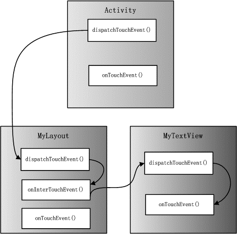

# 触摸和输入

触摸屏是智能手机和平板电脑最重要的输入输出工具，用户在与系统或应用程序交互过程中，大多数操作都是通过触摸屏来完成的。触摸屏由特殊材料制成，可以获取屏幕上的压力，并转换成屏幕坐标。这些信息可以被转换成数据，并被传递到软件里，所以应用程序需要经常处理用户的触摸输入，包括一个手指的触摸和多个手指的触摸。

> 版本说明（截至 2026 年）：本章示例按当前主流 Android 版本更新，重点兼容 Android 7.0+ 拖放 API 与 AndroidX 实践；文中旧接口会给出替代建议。

## 输入事件

在安卓中，从用户与应用的互动中截获事件的方法不止一种。对于界面内的事件，可以从用户与之互动的特定 View 对象中捕获事件。为此，View
类提供了多种方法。在用于构建布局的各种 View
类中，可能会注意到几种看起来适用于界面事件的公开回调方法。当该对象上发生相应的操作时，安卓框架会调用这些方法。例如，在用户轻触一个
View 对象（例如，按钮）时，系统对该对象调用 onTouchEvent() 方法。为截获此事件，必须扩展 View
类并替换该方法。然而，为处理此类事件而扩展每个 View 对象并不现实。正因如此，View
类还包含一系列嵌套接口以及可以更轻松定义的回调。这些接口称为事件监听器，是捕获用户与界面之间互动的票证。尽管使用事件监听器监听用户互动的频率会更高，但有时确实需要通过扩展
View 类来构建自定义组件。也许，想通过扩展 Button
类来满足更复杂的需求。在此情况下，将能够使用该类的事件处理程序为类定义默认事件行为。

事件监听器是 View 类中包含一个回调方法的接口。当用户与界面项目之间的互动触发已注册监听器的 View
对象时，安卓框架将调用这些方法。事件监听器接口中包含以下回调方法：

  - onClick()

在 View.OnClickListener
中。当用户轻触项目（在触摸模式下），或者使用导航键或轨迹球聚焦于项目，然后按适用的“Enter”键或按下轨迹球时，系统会调用此方法。

  - onLongClick()

在 View.OnLongClickListener
中。当用户轻触并按住项目（在触摸模式下）时，或者使用导航键或轨迹球聚焦于项目，然后按住适用的“Enter”键或按住轨迹球（持续一秒钟）时，系统会调用此方法。

  - onFocusChange()

在 View.OnFocusChangeListener 中。当用户使用导航键或轨迹球转到或离开项目时，系统会调用此方法。

  - onKey()

在 View.OnKeyListener 中。当用户聚焦于项目并按下或释放设备上的硬件按键时，系统会调用此方法。

  - onTouch()

在 View.OnTouchListener
中。当用户执行可视为触摸事件的操作时，包括按下、释放或屏幕上的任何移动手势（在项目边界内），系统会调用此方法。

  - onCreateContextMenu()

在 View.OnCreateContextMenuListener
中。当（因用户持续“长按”而）生成上下文菜单时，系统会调用此方法。参阅菜单开发者指南中有关上下文菜单的介绍。

这些方法是其相应接口的唯一成员。如要定义其中一个方法并处理事件，在活动 中实现嵌套接口或将其定义为匿名类。然后，将实现的实例传递给相应的
View.set...Listener() 方法。（例如，调用 setOnClickListener() 并向其传递
OnClickListener 的实现。）以下示例展示了如何为按钮注册点击监听器。

// Create an anonymous implementation of OnClickListener

private OnClickListener corkyListener = new OnClickListener() {

public void onClick(View v) {

// do something when the button is clicked

}

};

protected void onCreate(Bundle savedValues) {

...

// Capture our button from layout

Button button = (Button)findViewById(R.id.corky);

// Register the onClick listener with the implementation above

button.setOnClickListener(corkyListener);

...

}

码 9‑1

可能还会发现，将 OnClickListener 作为活动 的一部分来实现更为方便。这样可避免加载额外的类和分配对象。例如：

public class ExampleActivity extends Activity implements OnClickListener
{

protected void onCreate(Bundle savedValues) {

...

Button button = (Button)findViewById(R.id.corky);

button.setOnClickListener(this);

}

// Implement the OnClickListener callback

public void onClick(View v) {

// do something when the button is clicked

}

...

}

码 9‑2

注意，上述示例中的 onClick()
回调没有返回值，但一些其他事件监听器方法必须返回布尔值。具体原因取决于事件。对于以下事件监听器，必须返回布尔值的原因如下：

  - onLongClick()

此方法返回一个布尔值，指示是否已处理完事件，以及是否应将其继续传递下去。换言之，返回 true
表示已处理事件且事件应就此停止；如果尚未处理事件且/或事件应继续传递给其他任何点击监听器，则返回
false。

  - onKey()

此方法返回一个布尔值，指示是否已处理完事件，以及是否应将其继续传递下去。换言之，返回 true
表示已处理事件且事件应就此停止；如果尚未处理事件且/或事件应继续传递给其他任何按键监听器，则返回
false。

  - onTouch()

此方法返回一个布尔值，指示监听器是否处理完此事件。重要的是，此事件可以拥有多个分先后顺序的操作。因此，如果在收到 down 操作事件时返回
false，则表示并未处理完此事件，而且对其后续操作也不感兴趣。因此，无需执行事件内的任何其他操作，如手势或最终的 up 操作事件。

注意，硬件按键事件始终传递给目前处于焦点的 View 对象。它们从 View 层次结构的顶层开始分派，然后向下，直至到达合适的目的地。如果
View 对象（或 View 对象的子项）目前处于焦点，那么可以看到事件经由 dispatchKeyEvent() 方法的分派过程。除通过
View 对象捕获按键事件，还可使用 onKeyDown() 和 onKeyUp() 接收活动 内部的所有事件。

此外，考虑应用的文本输入时，记住：许多设备只有软件输入法。此类方法无需基于按键；某些可能使用语音输入、手写等。尽管输入法提供类似键盘的界面，但其通常不会触发
onKeyDown()
系列的事件。除非想将应用限制为只能在带有硬件键盘的设备上使用，否则，在设计界面时切勿要求必须通过特定按键进行控制。特别是，当用户按下返回键时，不要依赖这些方法验证输入；改用
IME\_ACTION\_DONE
等操作让输入法知晓应用预计会作何反应，以便其通过一种有意义的方式更改其界面。不要推断软件输入法应如何工作，只要相信它能为应用提供已设置格式的文本即可。注意：Android
会先调用事件处理程序，然后从类定义调用合适的默认处理程序。因此，如果从这些事件监听器返回
true，系统会停止将事件传播到其他事件监听器，还会阻止回调
View 对象中的默认事件处理程序。在返回 true 时确保需要终止事件。

如果从 View 构建自定义组件，则可定义几种回调方法，用作默认事件处理程序。在有关自定义 View
组件的文档中，将了解一些用于事件处理的常见回调，包括：

  - onKeyDown(int, KeyEvent)：在发生新的按键事件时调用。

  - onKeyUp(int, KeyEvent)：在发生 key up 事件时调用。

  - onTrackballEvent(MotionEvent)：在发生轨迹球动作事件时调用。

> 版本提示：轨迹球输入仅在早期设备常见，现代手机和平板几乎不再使用；新项目通常可忽略该回调。

  - onTouchEvent(MotionEvent)：在发生触屏动作事件时调用。

  - onFocusChanged(boolean, int, Rect)：在 View 对象获得或失去焦点时调用。

还有一些其他方法值得注意，尽管它们并非 View
类的一部分，但可能会直接影响所能采取的事件处理方式。因此，在管理布局内更复杂的事件时，不妨考虑使用以下其他方法：

  - Activity.dispatchTouchEvent(MotionEvent)：此方法允许 Activity
    在所有触摸事件分派给窗口之前截获它们。

  - ViewGroup.onInterceptTouchEvent(MotionEvent)：此方法允许 ViewGroup 监视分派给子级
    View 的事件。

  - ViewParent.requestDisallowInterceptTouchEvent(boolean)：对父级 View
    调用此方法，可指示不应使用 onInterceptTouchEvent(MotionEvent) 截获触摸事件。

当用户使用方向键或轨迹球导航界面时，须将焦点置于可操作项目上（如按钮），以便用户看到将接受输入的对象。但是，如果设备具有触摸功能且用户开始通过轻触界面与之互动，那么便不再需要突出显示项目或将焦点置于特定
View 对象上。因此，有一种互动模式称为“触摸模式”。对于支持触摸功能的设备，当用户轻触屏幕时，设备会立即进入触摸模式。只有
isFocusableInTouchMode() 为 true 的 View 对象才可聚焦，如文本编辑微件。对于其他可触摸的 View
对象（如按钮），在轻触时不会获得焦点，按下时仅会触发点击监听器。无论何时，只要用户点击方向键或滚动轨迹球，设备便会退出触摸模式，并找到一个
View
对象使其获得焦点。现在，用户可在不轻触屏幕的情况下继续与界面互动。整个系统（所有窗口和活动）都将保持触摸模式状态。如要查询当前状态，可以通过调用
isInTouchMode()，检查设备目前是否处于触摸模式。框架会处理常规焦点移动，以响应用户输入。其中包括：在移除或隐藏 View
对象或在新 View 对象可用时更改焦点。View 对象通过 isFocusable() 方法指示是否愿意获得焦点。如要设置
View 对象能否获得焦点，调用 setFocusable()。在触摸模式下，可以使用 isFocusableInTouchMode() 查询
View 对象是否允许获得焦点。可以使用 setFocusableInTouchMode() 对此进行更改。在搭载 Android 9（API
级别 28）或更高版本的设备上，活动
不会分配初始焦点。如有需要，必须显式求初始焦点。焦点移动所使用的算法会查找指定方向上距离最近的元素。在极少数情况下，默认算法可能与开发者的期望行为不一致。在这些情况下，可以用以下
XML 属性在布局文件中明确替换它们：nextFocusDown、nextFocusLeft、nextFocusRight 和
nextFocusUp。将其中一个属性添加到失去焦点的 View 对象。将该属性的值设定为应获得焦点的 View 对象的 ID。例如：

\<LinearLayout

android:orientation="vertical"

... \>

\<Button android:id="@+id/top"

android:nextFocusUp="@+id/bottom"

... /\>

\<Button android:id="@+id/bottom"

android:nextFocusDown="@+id/top"

... /\>

\</LinearLayout\>

码 9‑3

一般来说，在此垂直布局中，无论是从第一个按钮向上导航还是从第二个按钮向下导航，焦点都不会移到任何其他位置。现在，顶部按钮已将底部按钮定义为
nextFocusUp（反之亦然），因而导航焦点将按自上而下和自下而上的顺序循环往复。若要将某个 View
对象声明为界面中的可聚焦对象（通常情况下不是），在布局声明中将
android:focusable XML 属性添加到该 View 对象。将值设为 true。此外，还可以使用
android:focusableInTouchMode，声明 View 对象在触摸模式下可聚焦。如需求让特定 View 对象获得焦点，调用
requestFocus()。如需监听焦点事件（在 View 对象获得或失去焦点时收到通知），使用
onFocusChange()（如事件监听器部分中所述）。

## 触摸事件

触摸屏可以感知手指的触摸压力，识别手指是抬起、按下或者是移动；而且可以将触点转换成屏幕坐标，通过计算屏幕坐标的变化，可以识别触点的移动方式。当用户触摸屏幕时，触摸事件就会产生。什么是手势？手势是指系统可识别的，用户在对屏幕显示对象操作时，手指在触摸屏上抬起、按下或移动的方式。在安卓系统中支持的核心手势包括以下几种。

  - 触摸（Touch）：按下，抬起。触发项目的默认操作。

  - 长按（Long Press）：按下，等待，抬起。进入选择模式。使用户可以选择视图中的单个或者多个项目，并选择上下文操作栏的功能。

  - 滑动（Swipe）：按下，移动，抬起。滚动内容或者在同一层级的不同视图间切换。

  - 拖拽（Drag）：长按，移动，抬起。重新排列视图中的数据或者将数据移动到容器 (例如主屏幕上的目录) 中。

  - 双击（Double Touch）：快速两次触摸。放大内容。在文字选择中作为辅助手势。

  - 放大（Pinch Open）：用两个手指按住，向相互远离的方向移动，抬起。放大内容。

  - 缩小（Pinch Close）：用两个手指按住，向相互接近的方向移动，抬起。缩小内容。

**图** **9.1 手势种类**

在安卓系统中，触摸事件由MotionEvent类来描述。产生一个触摸事件，系统就会创建一个MotionEvent对象，该对象包含了触摸事件发生的时间和位置，以及发生触摸事件所在区域的压力、大小和方向。在应用中，MotionEvent对象会被传递到某些方法中，其中包括View类的onTouchEvent()方法。因为View类是很多控件的父类，这就意味着很多控件都可以通过MotionEvent与用户进行交换。例如，MapView控件可以接受触摸事件，允许用户平移动地图到感兴趣的地方；或者虚拟键盘对象接收触摸事件激活虚拟键，实现在界面中输入文本。从用户手指触摸设备屏幕开始，到手指离开设备屏幕结束，安卓系统会产生一系列与手指运动相关触摸事件，每个触摸事件都记录手指运动的信息，称这些触摸事件为一个事件序列。实际上，很多触摸屏设备可以同时记录多个手指的运动轨迹，这样每个运动轨迹都会产生一个触摸事件序列。每个序列是从用户触摸屏幕开始，当用户在屏幕上移动时，这个序列会持续添加；当手指从屏幕上抬起后，这个序列也就结束。

MotionEvent类中定义了动作常量表示触摸事件的动作类型，主要包括ACTION\_DOWN、ACTION\_UP、ACTION\_CANCEL、ACTION\_MOVE等。当用户首次触摸屏幕时，系统会将带有ACTION\_DOWN的触摸事件传递给相应的视图控件；当手指在屏幕上移动是ACTION\_MOVE；当抬起手指是ACTION\_UP；而且在手指抬起之前系统可能会产生很多ACTION\_MOVE的触摸事件。所有这些触摸事件都会产生相应的MotionEvent对象，其中包含了动作的种类、触摸发生的位置、触摸的压力、触摸的面积、动作发生的时间和初始ACTION\_DOWN的时间等属性。而ACTION\_OUTSIDE是一个特殊动作，是指当手指移动到在窗体之外时，系统仍然可以得到这样的触控事件。一般来说，一个手指触摸屏幕会触发了一个最简单的触摸事件序列首先应该是ACTION\_DOWN，然后会有多个ACTION\_MOVE，最后是一个ACTION\_UP结束。有些触摸屏设备可以在同一时间发现多个移动轨迹，称之为多点触控。安卓系统的MotionEvent类也支持多点触控。其中包括ACTION\_POINTER\_DOWN和ACTION\_POINTER\_UP两个动作常量，分别表示除第一个之外的手指在屏幕触摸时的动作，和除第一个之外的手指从屏幕抬起时的动作。

MotionEvent类使用两个属性来表示具体的触点，一个是触点ID，一个是触点索引，并提供许多方法用来查询每个触点位置以及其他属性，如getX(int)、getY(int)、getAxisValue(int)、getPointerId(int)、getToolType(int)等等。这些方法中大部分接收触点索引作为参数而不是触点ID。getPointerCount()方法可以获得指针总数量，而触点索引的取值范围是从0开始，到指针总数量减1结束。当发生多点触摸事件时，每个触点索引是会发生变化的，而触点ID在触摸点移动过程中不会发生变化。getPointerId(int)方法传入触点索引可以获得触点ID，而findPointerIndex(int)方法传入触点ID可以获得触点索引。当多点触控事件发生时，系统可能产生的事件见表
9-1。

| 触摸事件                              | 描述     |
| --------------------------------- | ------ |
| MotionEvent.ACTION\_DOWN          | 新的触摸事件 |
| MotionEvent.ACTION\_MOVE          | 移动手指   |
| MotionEvent.ACTION\_UP            | 手指抬起   |
| MotionEvent.ACTION\_CANCEL        | 删除事件   |
| MotionEvent.ACTION\_POINTER\_DOWN | 多点按下   |
| MotionEvent.ACTION\_POINTER\_UP   | 多点抬起   |

表 9-1 触控事件

由于应用程序的开发，在真机调试之前，都是在模拟机上调试的，在处理多点触控事件时，需要注意模拟机和真机上触屏事件有一些不同。

  - 屏幕的精度

在模拟机上的精度是整数，例如52\*20；而在真机上是有小数，例如42.8374\*25.293747。MotionEvent的位置由X轴和Y轴坐标组成的，X轴表示从视图左手边到触屏点的距离，Y轴表示从视图的顶端到触屏点的距离。

  - 触摸事件中压力描述

在模拟机上的压力值为0，而在真机上输出的压力值表示手指在触摸屏上向下的力度。如果使用小拇指的指尖轻轻触摸，则触摸事件的压力和大小比较小；如果用力使用大拇指，则触摸事件的压力和大小都是比较大的。触摸事件的压力和大小是在0和1之间。但是，对于不同的设备来说，没有一个绝对的值用来比较触摸事件的压力和尺寸的大小；而对于同一个设备来说，只能相对地比较触摸事件之间的压力和尺寸大小，不能拿一个绝对的值来确定压力和尺寸的大小。例如，在某些设备上这个值从来不超过0.8，而某些设备上这个值从来不超过0.2。

  - 触摸事件序列

在安卓中使用触摸屏时，如果应用程序在模拟器中运行，当鼠标当点击一次模拟器屏然后释放后，会先触发ACTION\_DOWN然后是ACTION\_UP这两个触摸事件，只有在屏幕上移动时才会触发ACTION\_MOVE的动作；但在真机中测试时，点击会首先产生ACTION\_DOWN触摸事件，如果手指不抬起的话即使不移动也会一直产生ACTION\_MOVE触摸事件，手指只有离开屏幕时才会产生ACTION\_UP触摸事件。

当手指触摸到设备的边界位置时，触摸事件的边界标记会被检测到。而安卓文档上说，当触摸到设备的边界时（顶、底、左和右）时，这个标记会被设置。但是有时getEdgeFlags()方法总是显示为0。实际上，有些硬件是很难检测到触摸在设备的边界上，所以安卓系统不可能设置这个参数。MotionEvent类提供了setEdgeFlags()方法，目的是可以自己来设置这个值。

## 事件传递

当触摸事件发生时，MotionEvent对象会作为参数被传递到应用程序中的相应方法中。在安卓系统中，ViewGroup、View、活动以及他们的子类都提供了处理触摸事件的回调方法。触摸事件与前面所接触的按钮、编辑框、菜单和动作条等图形控件的事件有所不同。当用户直接针对这些图形控件的进行键盘操作时，应用程序直接回调对应的注册监听器进行处理。但当触摸事件发生时，会遇到多种情况。例如屏幕中包含一个ViewGroup，而这个ViewGroup又包含一个子View时，安卓系统如何处理触摸事件呢？到底是ViewGroup来处理触摸事件，还是子View来处理触摸事件呢？如果一个视图控件注册了OnClickListener和OnLongClickListener监听器，分别实现了onClick()和onLongClick()方法，当用户触摸到屏幕上的这个个视图控件时，安卓系统如何区分应当使用onTouchEvent()方法，还是onClick()方法，或是onLongClick()方法来处理事件呢？

如果要解答这些的问题，需要深入理解触摸事件的传递和消费机制。在安卓系统中，同一个触摸事件可以按次序传递到不同视图控件，所以可以依次被视图控件处理，如果某视图控件完全响应而且不再传递这个触摸事件，则称为消费了触摸事件。真正理解了触摸事件的传递和消费机制，才能编写出正确响应界面操作的代码，尤其当屏幕上的不同视图控件，需要针对同一个界面触摸事件做出不同响应的时候。例如，应用程序在桌面上设置了一个控件，当用户针对控件做各种操作时，有时候桌面本身有的时候要对用户的操作做出响应，有时忽略。只有搞清楚事件触发和传递的机制才有可能保证在界面布局非常复杂的情况下，UI控件仍然能正确响应用户操作。在触摸事件处理时，一个用户的操作可能会被传递到不同的控件，或同一个控件的不同监听方法内进行处理。如果任何一个接收该事件的方法在处理完后返回了true，则该事件就算处理完成了，其他的视图或者监听方法就不会再有机会处理该事件了。

### 内外层次

一般来说，用户界面的树形结构是由多个View和ViewGroup形成的，它们之间具有由外向内的包含关系，而触摸事件可以在相邻的层次之间传递，传递方向先从外向内，然后从内向外。从外向内传递就是从最外层的根元素依次递归向其包含的子元素传递，一直到最内层子元素，或中间某个元素消费了触摸事件，结束了传递；从内向外就是从最内层子元素依次递归向外层传递，直到根元素或中间某个元素消费了触摸事件，结束了传递。安卓系统使用下面三个方法来处理触摸事件的传递：

public boolean dispatchTouchEvent(MotionEvent ev)

码 9‑4

这个方法是View、Activity和ViewGroup类中的方法，用来分发触摸事件。可以把这个方法作为一个控制器，由其决定如何路由触摸事件。View类中的dispatchTouchEvent()方法判断是将触摸事件传递给View.OnTouchListener.onTouchEvent()或者View.onTouchEvent()方法。ViewGroup类中的dispatchTouchEvent()方法覆盖了View.dispatchTouchEvent()方法，其包含了更复杂的算法用来弄清楚哪个子视图应该得到触摸事件，而且需要调用子视图的dispatchTouchEvent()方法。

public boolean onInterceptTouchEvent(MotionEvent ev)

码 9‑5

这个方法只是ViewGroup类中的方法，用来拦截触摸事件。ViewGroup一般都会包含View，而且ViewGroup和View都包含onTouchEvent()方法，如果onInterceptTouchEvent()返回true时，则执行此ViewGroup中的onTouchEvent()方法；如果onInterceptTouchEvent()返回false时，触摸事件将传递给View，由view的dispatchTouchEvent()再来开始这个事件的分发。

public boolean onTouchEvent(MotionEvent ev)

码 9‑6

这个方法可以用来处理触摸事件。该方法在View、ViewGroup以及Activity类中都有定义，并且所有的View子类全部重写了该方法，包括Layouts、Buttons、Lists、Surfaces、Clocks等等，这说明所有的这些组件都可以使用触摸事件进行交互，应用程序可以通过该方法处理手机屏幕的触摸事件。下面一个例子，可以测试这种触摸事件的传递方式。在一个自定义的布局中包含自定义的TextView控件，并且分别覆盖活动、自定义布局和TextView中的三个方法，方法的内容主要是日志输出和控制触摸事件的传递。首先，创建一个LinearLayout的子类，覆盖上面所列出的处理触摸事件的三个方法dispatchTouchEvent()、onInterceptTouchEvent()和onTouchEvent()，处理在这个布局上发生的触摸事件。当在不同的触摸事件发生时，根据事件的类型，输出带有事件处理方法和事件类型的日志信息（见码
9‑4）。

public class MyLayoutView extends LinearLayout {

private final String TAG = "MyLayoutView";

public MyLayoutView(Context context, AttributeSet attrs) {

super(context, attrs);

Log.d(TAG, TAG);

}

@Override

public boolean dispatchTouchEvent(MotionEvent ev) {

int action = ev.getAction();

switch (action) {

case MotionEvent.ACTION\_DOWN:

Log.d(TAG, "dispatchTouchEvent action:ACTION\_DOWN");

break;

case MotionEvent.ACTION\_MOVE:

Log.d(TAG, "dispatchTouchEvent action:ACTION\_MOVE");

break;

case MotionEvent.ACTION\_UP:

Log.d(TAG, "dispatchTouchEvent action:ACTION\_UP");

break;

case MotionEvent.ACTION\_CANCEL:

Log.d(TAG, "dispatchTouchEvent action:ACTION\_CANCEL");

break;

}

return super.dispatchTouchEvent(ev);

}

@Override

public boolean onInterceptTouchEvent(MotionEvent ev) {

int action = ev.getAction();

switch (action) {

case MotionEvent.ACTION\_DOWN:

Log.d(TAG, "onInterceptTouchEvent action:ACTION\_DOWN");

// return true;

break;

case MotionEvent.ACTION\_MOVE:

Log.d(TAG, "onInterceptTouchEvent action:ACTION\_MOVE");

break;

case MotionEvent.ACTION\_UP:

Log.d(TAG, "onInterceptTouchEvent action:ACTION\_UP");

break;

case MotionEvent.ACTION\_CANCEL:

Log.d(TAG, "onInterceptTouchEvent action:ACTION\_CANCEL");

break;

}

return false;

}

@Override

public boolean onTouchEvent(MotionEvent ev) {

int action = ev.getAction();

switch (action) {

case MotionEvent.ACTION\_DOWN:

Log.d(TAG, "onTouchEvent action:ACTION\_DOWN");

break;

case MotionEvent.ACTION\_MOVE:

Log.d(TAG, "onTouchEvent action:ACTION\_MOVE");

break;

case MotionEvent.ACTION\_UP:

Log.d(TAG, "onTouchEvent action:ACTION\_UP");

break;

case MotionEvent.ACTION\_CANCEL:

Log.d(TAG, "onTouchEvent action:ACTION\_CANCEL");

break;

}

return false;

}

}

码 9‑7 自定义布局

定义一个TextView
类的子类作为用户界面布局中的输入框，并覆盖其触摸事件处理的方法dispatchTouchEvent()和onTouchEvent，实现当在不同的触摸事件发生时，根据事件的类型，输出带有事件处理方法和事件类型的日志信息。

public class MyTextView extends TextView {

private final String TAG = "MyTextView";

public MyTextView(Context context, AttributeSet attrs) {

super(context, attrs);

Log.d(TAG, TAG);

}

@Override

public boolean dispatchTouchEvent(MotionEvent ev) {

int action = ev.getAction();

switch (action) {

case MotionEvent.ACTION\_DOWN:

Log.d(TAG, "dispatchTouchEvent action:ACTION\_DOWN");

break;

case MotionEvent.ACTION\_MOVE:

Log.d(TAG, "dispatchTouchEvent action:ACTION\_MOVE");

break;

case MotionEvent.ACTION\_UP:

Log.d(TAG, "dispatchTouchEvent action:ACTION\_UP");

break;

case MotionEvent.ACTION\_CANCEL:

Log.d(TAG, "dispatchTouchEvent action:ACTION\_CANCEL");

break;

}

return super.dispatchTouchEvent(ev);

}

@Override

public boolean onTouchEvent(MotionEvent ev) {

int action = ev.getAction();

switch (action) {

case MotionEvent.ACTION\_DOWN:

Log.d(TAG, "onTouchEvent action:ACTION\_DOWN");

break;

case MotionEvent.ACTION\_MOVE:

Log.d(TAG, "onTouchEvent action:ACTION\_MOVE");

break;

case MotionEvent.ACTION\_UP:

Log.d(TAG, "onTouchEvent action:ACTION\_UP");

break;

case MotionEvent.ACTION\_CANCEL:

Log.d(TAG, "onTouchEvent action:ACTION\_CANCEL");

break;

}

return true;

}

}

码 9‑8 自定义输入框

然后，定义用于测试的活动的布局文件，其中定义触摸事件传递的层次关系（码 9‑6）。

\<?xml version="1.0" encoding="utf-8"?\>

\<cn.edu.uibe.mcommerce.chapter11.motionEvent.MyLayoutView
xmlns:android="http://schemas.android.com/apk/res/android"

android:layout\_width="300dip"

android:layout\_height="200dip"

android:layout\_gravity="center"

android:background="\#ff0000"

android:gravity="center"

android:orientation="vertical"

android:tag="My Layout" \>

\<cn.edu.uibe.mcommerce.chapter11.motionEvent.motionEvent.MyTextView

android:id="@+id/tv"

android:layout\_width="200dip"

android:layout\_height="100dip"

android:background="\#00FF00"

android:gravity="center"

android:text="My TextView"

android:textColor="\#0000FF"

android:textSize="20sp"

android:textStyle="bold" /\>

\</cn.edu.uibe.mcommerce.chapter11.motionEvent.motionEvent.MyLayoutView\>

码 9‑9 XML布局文件

定义好布局文件后，创建一个活动，导入所定义的XML布局文件，运行应用程序，可以显示出**图 9.2**的界面。

**图** **9.2 运行效果**

**图
9.2**显示的界面中，从外到内包括一个活动（View）、一个自定义Layout（ViewGroup）和一个自定义的TextView（View）。深色部分是自定义布局，浅色部分是自定义的TextView。如果用手指触摸界面，就会产生一系列触摸事件。首先产生的是MotionEvent.ACTION\_DOWN事件，这是触摸事件系列的第一个事件。在触摸事件传递过程中，ACTION\_DOWN经过的界面元素实际上都是继承了View或者ViewGroup类，这两个类中都包含dispatchTouchEvent()方法，但是触摸事件处理的最外层却不是这些界面元素，而会首先调用当前活动的dispatchTouchEvent()方法，然后才将触摸事件传递给其中的View或者ViewGroup元素。这样，触摸事件首先从最外层View或者ViewGroup元素向内层View或者ViewGroup元素传递。

在触摸事件从外层的界面元素向内层的界面元素传递过程中，如果事件传递到继承了ViewGroup类的界面元素，则会调用ViewGroup类的onInterceptTouchEvent()方法，这个方法表示是否拦截触摸事件。如果这个方法返回true，表示这个ViewGroup拦截了事件的传递，触摸事件不会再往下传递给它的子View元素，而是由这个ViewGroup元素处理，调用其onTouchEvent()方法；如果在传递的过程中没有ViewGroup拦截事件，即经过的所有onInterceptTouchEvent()方法都返回false，那么触摸事件最终会传递至最内层的界面元素，一般是一个视图控件，当然也可以是一个ViewGroup元素（其内部不包含任何元素）。

如果最后事件传递到一个View元素，而非ViewGroup元素，那么会首先调用这个View的OnTouchListener()的onTouch()方法或者调用View的onTouchEvent()方法，其默认返回true；如果最后事件传递到一个ViewGroup元素，会调用它的onTouchEvent()方法，其默认返回false，这样就完成了触摸事件从外向里的传递。

在上面示例中的活动和自定义布局的三种方法方法的返回值都为false，则触摸事件传递到最内层的自定义TextView。由于自定义的TextView的onTouchEvent()返回值为true，所以触摸事件被消费。**图
9.3**示意了从外向内传递触摸事件的路径。

**图** **9.3** 从外向内传递触摸事件的路径

下面是这个过程的日志输出：

07-16 21:43:07.809: D/InterceptTouchActivity(18468): dispatchTouchEvent
action:ACTION\_DOWN

07-16 21:43:07.814: D/MyLayoutView(18468): dispatchTouchEvent
action:ACTION\_DOWN

07-16 21:43:07.814: D/MyLayoutView(18468): onInterceptTouchEvent
action:ACTION\_DOWN

07-16 21:43:07.814: D/MyTextView(18468): dispatchTouchEvent
action:ACTION\_DOWN

07-16 21:43:07.814: D/MyTextView(18468): onTouchEvent
action:ACTION\_DOWN

07-16 21:43:07.834: D/InterceptTouchActivity(18468): dispatchTouchEvent
action:ACTION\_MOVE

07-16 21:43:07.834: D/MyLayoutView(18468): dispatchTouchEvent
action:ACTION\_MOVE

07-16 21:43:07.834: D/MyLayoutView(18468): onInterceptTouchEvent
action:ACTION\_MOVE

07-16 21:43:07.834: D/MyTextView(18468): dispatchTouchEvent
action:ACTION\_MOVE

07-16 21:43:07.834: D/MyTextView(18468): onTouchEvent
action:ACTION\_MOVE

07-16 21:43:07.834: D/InterceptTouchActivity(18468): dispatchTouchEvent
action:ACTION\_UP

07-16 21:43:07.834: D/MyLayoutView(18468): dispatchTouchEvent
action:ACTION\_UP

07-16 21:43:07.834: D/MyLayoutView(18468): onInterceptTouchEvent
action:ACTION\_UP

07-16 21:43:07.834: D/MyTextView(18468): dispatchTouchEvent
action:ACTION\_UP

07-16 21:43:07.834: D/MyTextView(18468): onTouchEvent action:ACTION\_UP

码 9‑10

如果上面例子中自定义TextView的onTouchEvent()方法返回了false，则接下来的触摸事件，即ACTION\_DOWN的此事件系列的后续触摸事件，就不会再传递到这个View或者ViewGroup元素，而会在其父元素终止，并且调用其父元素的onTouchEvent()。这就是说，如果最内层界面元素的onTouchEvent()方法返回了false，则事件会自内向外再次传递，直到某个界面元素onTouchEvent()方法返回true。这时，此事件系列的后续触摸事件，也会直接由这个界面元素的onTouchEvent()方法来处理。如果自内向外的所有View或者ViewGroup界面元素的onTouchEvent()方法都返回false，那么ACTION\_DOWN的此事件系列的后续触摸事件，最后会由活动处理，即调用活动的onTouchEvent()方法，并且最终结束触摸事件的传递，这就是从内向外的触摸事件的传递。还是使用上面的例子，只是在码
9‑5中，将自定义TextView的onTouchEvent()方法返回值改为false，触摸事件就从内向外传递触摸事件（见**图
9.4**虚线所示）。

**图** **9.4** 从内向外传递触摸事件路径

下面是这个过程的日志输出：

07-16 22:17:55.110: D/InterceptTouchActivity(19689): dispatchTouchEvent
action:ACTION\_DOWN

07-16 22:17:55.114: D/MyLayoutView(19689): dispatchTouchEvent
action:ACTION\_DOWN

07-16 22:17:55.114: D/MyLayoutView(19689): onInterceptTouchEvent
action:ACTION\_DOWN

07-16 22:17:55.114: D/MyTextView(19689): dispatchTouchEvent
action:ACTION\_DOWN

07-16 22:17:55.114: D/MyTextView(19689): onTouchEvent
action:ACTION\_DOWN

07-16 22:17:55.114: D/MyLayoutView(19689): onTouchEvent
action:ACTION\_DOWN

07-16 22:17:55.114: D/InterceptTouchActivity(19689): onTouchEvent
action:ACTION\_DOWN

07-16 22:17:55.114: D/InterceptTouchActivity(19689): dispatchTouchEvent
action:ACTION\_UP

07-16 22:17:55.114: D/InterceptTouchActivity(19689): onTouchEvent
action:ACTION\_UP’

码 9‑11

如上面的示例一样，如果改变三种方法的返回值，会有不同的日志输出，可以尝试改变其他方法的返回值，体会一下触摸事件传递的原理。

### 同一层次

另一种响应触摸事件的方式，就是设置OnTouchListener监听器。OnTouchListener是用来处理屏幕触摸事件的监听接口，当在View的范围内触摸按下、抬起或滑动等动作时都会触发该事件，需要实现该接口的方法为：

public boolean onTouch(View v,MotionEvent event)

码 9‑12

其中，参数v为事件源对象；而参数event为手机屏幕触摸事件封装类的对象，其中封装了该事件的所有信息，例如触摸的位置、触摸的类型以及触摸的时间等。该对象会在用户触摸手机屏幕时被创建。当这个方法的返回值为true时，表示处理完触摸事件且不传递到其他回调方法，否则返回false。现在，应该回想一下第四章的内容。可能有人会问，如果用户点击界面会产生触摸事件吗？如果同时为一个控件注册了OnClickListener、OnLongClickListener和OnTouchListener，而且还覆盖了onTouchEvent()方法，触摸事件的传递顺序又是怎样的？实际上，当用户完成一次点击操作时，屏幕上的触摸传感器得到的按下和抬起信号，可以理解为发生了触摸事件的ACTION\_DOWN和ACTION\_UP操作。所以，在安卓中的点击事件是和触摸事件相关的。如果在一个View中覆盖了onClick()、onLongClick()及onTouchEvent()方法，则onTouchEvent()最先捕捉到ACTION\_DOWN事件的，其次才可能触发onClick()方法或者onLongClick()方法，以及后续的触摸事件。根据触摸事件处理的逻辑，下面对同时作用在控件上的监听器或onTouchEvent()方法的三种情况进行分析：

（1）OnClickListener、OnLongClickListener与onTouchEvent()同时作用在一个控件上。在实际操作中，是否执行onClick()和onLongClick()方法与触摸事件的ACTION\_DOWN和ACTION\_UP动作有关。

当一个点击事件发生时，事件发生的顺序为：

  - ACTION\_DOWN --\> ACTION\_UP --\> onClick()

如果发生了一个长按事件，就是按下界面控件保持一段时间，然后抬起，此时事件发生的顺序为：

  - ACTION\_DOWN --\> onLongClick()--\>ACTION\_UP

（2）OnTouchListener、onTouchEvent同时作用在一个控件上。首先执行OnTouchListener.onTouch()的方法，如果返回值为ture，则结束触摸事件的传递；如果返回值为false，则继续传递触摸事件到onTouchEvent()方法。

（3）第三种情况为OnClickListener、OnLongClickListener、OnTouchListener同时作用在一个控件上。由于执行onLongClick()方法是由单独的线程完成的，并且在ACTION\_UP之前，而onClick()的发生是在ACTION\_UP后，因此同一次用户触摸事件就有可能既发生onLongClick()又发生onClick()。对于这种情况，onLongClick()方法使用返回值表示是否消费了触摸事件。如果在onLongClick()方法返回结果为true，那么onClick事件就没有机会被触发了。如果onLongClick()方法返回false时的情况，一次触摸事件的基本时序：

  - onTouch(ACTION\_DOWN)--\>onLongClick()--\>onTouch(ACTION\_UP)--\>OnClick()

可以看到，在ACTION\_UP后仍然触发了onClick()方法。

## 速率跟踪

在安卓应用程序开发过程中，特别是游戏程序开发中，可能需要获取触摸点移动的速度。也就是当手指在触摸屏上的运动时，可能希望知道其移动的速度有多快。安卓提供了一个VelocityTracker帮助类，用来处理触摸事件序列，跟踪手指运动的速率。当需要跟踪速率时，首先使用VelocityTracker的静态方法VelocityTracker.obtain()获得VelocityTracker对象，然后可以使用VelocityTracker.addMovement(MotionEvent
event)方法添加触摸事件对象。可以在接收并且处理MotionEvent对象的方法（例如OnTouchListener的onTouch()方法或者onTouchEvent()方法），中添加addMovement(MotionEvent
event)。下面使用一个简单的例子，将触摸点移动的速度写入日志信息，在运行时可以从控制台看到相应的信息。具体实现见码
9‑10，其中touch\_velocity\_tracker.xml布局文件中可以只简单设置一个TextView。

public class VelocityTrackerActivity extends Activity {

private static final String TAG = "VelocityTracker";

/\*\* Called when the activity is first created. \*/

@Override

public void onCreate(Bundle savedInstanceState) {

super.onCreate(savedInstanceState);

setContentView(R.layout.touch\_velocity\_tracker);

}

private VelocityTracker vTracker = null;

public boolean onTouchEvent(MotionEvent event) {

int action = event.getAction();

switch (action) {

case MotionEvent.ACTION\_DOWN:

if (vTracker == null) {

vTracker = VelocityTracker.obtain();

} else {

vTracker.clear();

}

vTracker.addMovement(event);

break;

case MotionEvent.ACTION\_MOVE:

vTracker.addMovement(event);

vTracker.computeCurrentVelocity(1000);

Log.v(TAG, "X velocity is " + vTracker.getXVelocity()

\+ " pixels per second");

Log.v(TAG, "Y velocity is " + vTracker.getYVelocity()

\+ " pixels per second");

break;

case MotionEvent.ACTION\_UP:

case MotionEvent.ACTION\_CANCEL:

vTracker.recycle();

break;

}

return true;

}

}

码 9‑13 **使用VelocityTracker进行速率跟踪**

如果VelocityTracker中连续添加了两个MotionEvent对象，那么就可以计算这两个MotionEvent对象之间的数据变化，这些数据的变化反应了手指的运动速率。VelocityTracker两个方法getXVelocity()和getYVelocity()分别返回手指在X和Y方向上的速率。这两个方法的返回值表示单位时间段在X和Y方向上移动的像素。这个单位时间段可以是每毫秒或秒，也可以是一个设置的任意值。在使用这两个方法之前，需要VelocityTracker.类提供的computeCurrentVelocity(int
unit)方法，来设置跟踪速率时VelocityTracker所使用的时间单位。例如，如果想得到每毫秒的移动像素，给参数unit赋值为1；如果想得到每秒的，给参数unit赋值为1000。如果手指是朝着X方向的右侧移动或者Y方向的底部移动，getXVelocity()和getYVelocity()方法的返回值为正；如果手指是朝着X方向的左侧移动或者Y方向的顶部移动，getXVelocity()和getYVelocity()方法的返回值为负。如果结束VelocityTracker对象的使用，需要使用recycle()方法。

值得注意的是，当第一个ACTION\_DOWN触摸事件被加入到VelocityTracker时，速率计算的结果虽然是零，但是还是必须首先增加这个起点，这样后续的ACTION\_MOVE事件才可以计算速率。在ACTION\_UP被加入后，速率的计算结果还是会变成零。因此，不要在增加了ACTION\_UP触摸事件之后读取X和Y的速率。例如，当开发一个游戏程序实现用户在屏幕上扔物体时，应该在增加最后一个ACTION\_MOVE事件之后，才使用速率来计算物体的轨道。另一点就是跟踪速率很耗费资源。所以应该在使用完之后回收VelocityTracker对象，这样此对象还可以重新被使用。安卓系统可以允许有多个VelocityTracker对象同时存在，但是同样会占用更多的内存。当开始跟踪一个新的触摸序列时，也可以使用clear()方法使VelocityTracker对象回到初始状态。

## 多点触控

在2006年的TED大会上，Jeff
Han展示了一种具有多点触控技术的电脑屏幕。安卓也加入了多点触控功能，目前市面上只要使用电容屏触控原理的手机均可以支持多点触控技术，可以实现图片和页面缩放、手势操作等更好的用户体验。对于当前 Android 设备，多点触控已经是默认能力。多点触控和单点触控的基本原理是一致的。当手指触摸屏幕时，MotionEvent对象被创建，并且被传递到前面介绍的方法中。还是可以通过上面介绍的MotionEvent的getAction()、getDownTime()和getX()等方法来获取触摸事件的数据。当在屏幕上有多个触点时，MotionEvent对象必须包含所有触点的信息，但是getAction()方法得到的只是一个触点的动作值，而不是全部的触点。getDownTime()方法表示第一个手指按下的时间，如果有多个手指同时触摸屏幕，之后可能有的手指离开了屏幕，但是只要屏幕上还存在最后一个触点，这个时间值就一直保持不变。当使用getX()和getY()方法获取触摸事件发生的位置，以及使用getPressure()方法和getSize()方法获取触点压力和大小时，如果传入触点索引参数，就可以获得对应触点的信息。对于不带参数的方法调用，只能获得第一个触点的信息。

如果希望使用多点触控，首先要知道使用getPointerCount()方法获取当前屏幕上的触点数量。只要获得的触点数量大于1的话，就需要处理触点索引和触点ID。MotionEvent对象中包含了当前从索引为0开始的触点信息，一直到getPointerCount()方法返回的最大索引值。触点索引始终从0开始，如果有三个触点，则他们的索引分别为0、1和2。调用类似getX()的方法必须使用触点索引作为参数才可以获得指定的触点信息。触点ID也是一个整数，可以表示哪个触点被跟踪。当第一个手指触摸屏幕时，触点ID也是从0开始的，但是随着手指从屏幕上的移走或放下，当前这个值就有可能不是从0开始的了。这是由于安卓系统使用触点ID作为跟踪屏幕上不同手指的运动，触点ID可以固定的指定某个手指。为了说明这一点，假设由两个手指产生的一对触摸序列。序列产生的过程为：首先从手指1触摸开始，然后是手指2触摸；接着手指1移走，然后手指2移走。手指1触摸时，会得到触点ID为0，手指2触摸时，会得到触点ID为1，而他们的触点索引也相同。当手指1移走时，手指2的ID仍然为1，而这时手指2的触点索引就会变成0，这就是上面说的触点索引始终从0开始。这样就可以在应用程序里使用触点ID将触摸事件与特定的手指关联起来，以及涉及到的其他手指。在一个手势中，可以使用getPointerId()方法获得触点ID，用来在后续的触摸事件中跟踪手指。发生一系列的动作后，可以使用findPointerIndex()方法找到触点ID当前对应的触点索引，然后使用触点索引获取触摸事件的信息（见码
9‑11）。

private int mActivePointerId;

 

public boolean onTouchEvent(MotionEvent event) {

    ....

    // Get the pointer ID

    mActivePointerId = event.getPointerId(0);

    // ... Many touch events later...

    // Use the pointer ID to find the index of the active pointer

    // and fetch its position

    int pointerIndex = event.findPointerIndex(mActivePointerId);

    // Get the pointer's current position

    float x = event.getX(pointerIndex);

    float y = event.getY(pointerIndex);

}

码 9‑14 **使用getPointerId()方法**

另外，可以使用getActionMasked()方法获得触摸事件的动作。与getAction()方法不同，这个方法是为多点触控定义的。这个方法的返回结果经过掩码处理，去掉了触点索引的信息。可以使用getActionIndex()方法返回触摸事件的触点索引（见码
9‑12）

int action = event.getActionMasked();

// Get the index of the pointer associated with the action.

int index = event.getActionIndex();

int xPos = -1;

int yPos = -1;

Log.d(DEBUG\_TAG,"The action is " + actionToString(action));

           

if (event.getPointerCount() \> 1) {

    Log.d(DEBUG\_TAG,"Multitouch event");

    // The coordinates of the current screen contact, relative to

    // the responding View or Activity.  

    xPos = (int) event.getX(index);

    yPos = (int) event.getY(index);

} else {

    // Single touch event

    Log.d(DEBUG\_TAG,"Single touch event");

    xPos = (int) event.getX(index);

    yPos = (int) event.getY(index);

}

...

// Given an action int, returns a string description

public static String actionToString(int action) {

    switch (action) {

               

        case MotionEvent.ACTION\_DOWN: return "Down";

        case MotionEvent.ACTION\_MOVE: return "Move";

        case MotionEvent.ACTION\_POINTER\_DOWN: return "Pointer Down";

        case MotionEvent.ACTION\_UP: return "Up";

        case MotionEvent.ACTION\_POINTER\_UP: return "Pointer Up";

        case MotionEvent.ACTION\_OUTSIDE: return "Outside";

        case MotionEvent.ACTION\_CANCEL: return "Cancel";

    }

    return "";

}

码 9‑15 **使用getActionMasked()方法**

## 手势识别

手势也是一组触摸事件的序列，由基本触摸事件的动作组成。手势可以是简单的触摸事件序列，例如点击、滑屏等，也可以是自定义更复杂的触摸事件序列。基本的手势包括点击、长按、滑动、拖动、双击、缩放操作。每种手势都是用户的一种特定动作，触摸屏可以识别这些动作完成相应的功能。滑动就是手指在屏幕上拖动一个物体，快速地朝一个方向移动，然后抬起。在浏览图片的应用中会用到这种手势。当用户滑动触摸屏时，新的图片就会显示。安卓提供了GestureDetector类检测一些常见的手势，其中的方法包括onDown()、onLongPress()和onFling()等，另外使用ScaleGestureDetector类来实现缩放手势。

### 发现手势

当初始化GestureDetector对象时，需要传入一个实现了OnGestureListener接口的参数，当一个特定的手势被识别时，就会执行OnGestureListener中的各种手势的处理方法。为了使GestureDetector对象能够接收触摸事件，需要覆盖View或活动的onTouchEvent方法，并将所有的触摸事件传递到GestureDetector对象中（见码
9‑13）。

public class MainActivity extends Activity implements

        GestureDetector.OnGestureListener,

        GestureDetector.OnDoubleTapListener{

   

    private static final String DEBUG\_TAG = "Gestures";

    private GestureDetectorCompat mDetector;

    // Called when the activity is first created.

    @Override

    public void onCreate(Bundle savedInstanceState) {

        super.onCreate(savedInstanceState);

        setContentView(R.layout.activity\_main);

        // Instantiate the gesture detector with the

        // application context and an implementation of

        // GestureDetector.OnGestureListener

        mDetector = new GestureDetectorCompat(this,this);

        // Set the gesture detector as the double tap

        // listener.

        mDetector.setOnDoubleTapListener(this);

    }

    @Override

    public boolean onTouchEvent(MotionEvent event){

        this.mDetector.onTouchEvent(event);

        // Be sure to call the superclass implementation

        return super.onTouchEvent(event);

    }

@Override

//单击，触摸屏按下时立刻触发

    public boolean onDown(MotionEvent event) {

        Log.d(DEBUG\_TAG,"onDown: " + event.toString());

        return true;

    }

@Override

//滑动，触摸屏按下后快速移动并抬起，会先触发滚动手势，跟着触发一个滑动手势

    public boolean onFling(MotionEvent event1, MotionEvent event2,

            float velocityX, float velocityY) {

        Log.d(DEBUG\_TAG, "onFling: " +
event1.toString()+event2.toString());

        return true;

    }

    @Override

    public void onLongPress(MotionEvent event) {

        Log.d(DEBUG\_TAG, "onLongPress: " + event.toString());

    }

@Override

//滚动，触摸屏按下后移动

    public boolean onScroll(MotionEvent e1, MotionEvent e2, float
distanceX,

            float distanceY) {

        Log.d(DEBUG\_TAG, "onScroll: " + e1.toString()+e2.toString());

        return true;

    }

@Override

//短按，触摸屏按下后片刻后抬起，会触发这个手势，如果迅速抬起则不会

    public void onShowPress(MotionEvent event) {

        Log.d(DEBUG\_TAG, "onShowPress: " + event.toString());

    }

@Override

//抬起，手指离开触摸屏时触发(长按、滚动、滑动时，不会触发这个手势)

    public boolean onSingleTapUp(MotionEvent event) {

        Log.d(DEBUG\_TAG, "onSingleTapUp: " + event.toString());

        return true;

    }

@Override

// 双击，手指在触摸屏上迅速点击第二下时触发

    public boolean onDoubleTap(MotionEvent event) {

        Log.d(DEBUG\_TAG, "onDoubleTap: " + event.toString());

        return true;

    }

@Override

// 双击的按下跟抬起各触发一次

    public boolean onDoubleTapEvent(MotionEvent event) {

        Log.d(DEBUG\_TAG, "onDoubleTapEvent: " + event.toString());

        return true;

    }

@Override

// 单击确认，即很快的按下并抬起，但并不连续点击第二下

    public boolean onSingleTapConfirmed(MotionEvent event) {

        Log.d(DEBUG\_TAG, "onSingleTapConfirmed: " + event.toString());

        return true;

    }

}

码 9‑16 **使用GestureDetector类识别手势**

在码
9‑13中，如果OnGestureListener中方法执行的结果为true，表明已经处理触摸事件；如果为false，则触摸事件继续传递，直到成功处理为止。如果只想处理部分手势，可以继承SimpleOnGestureListener。SimpleOnGestureListener实现了OnGestureListener接口的所有方法，而且返回值都为false。因此只需要覆盖那些关心的方法就行了。不论是否使用OnGestureListener，最好的做法就是实现onDown()方法，并返回true。这是因为所有的手势都需要判断onDown()方法的返回值，如果在onDown()中返回false（这是SimpleOnGestureListener中的默认返回结果），系统认为忽略剩余的手势动作，SimpleOnGestureListener中的其他方法不会被调用。

### 缩放手势

从安卓
2.2开始引入了ScaleGestureDetector类，这个可以用来识别缩放手势。缩放手势有两种操作，一种是两个手指同时触摸屏幕，向相互远离的方向移动，然后同时离开屏幕，这是放大的操作；另一种是两个手指同时触摸屏幕，向相互靠近的方向移动，然后同时离开屏幕，这是缩小操作。下面使用例子来说明如何使用缩放手势，来缩放一个图标文件。首先定义XML布局文件（见**代码
9.1**）。

\<?xml version="1.0" encoding="utf-8"?\>

\<LinearLayout
xmlns:android="http://schemas.android.com/apk/res/android"

android:id="@+id/layout"

android:layout\_width="fill\_parent"

android:layout\_height="fill\_parent"

android:orientation="vertical" \>

\<ImageView

android:id="@+id/image"

android:layout\_width="match\_parent"

android:layout\_height="match\_parent"

android:scaleType="matrix"

android:src="@drawable/icon" /\>

\</LinearLayout\>

码 9‑17 **scale\_detector\_layout.xml**

**代码
9.1**布局文件中使用ImageView控件定义一个图片源，而且定义了一种矩阵缩放的方式。这个图片的大小是填充布局，这样图片不会被ImageView的边界剪切。**代码
9.2**是具体实现缩放手势的活动代码。

public class ScaleDetectorActivity extends Activity {

private static final String TAG = "ScaleDetector";

private ImageView image;

private ScaleGestureDetector mScaleDetector;

private float mScaleFactor = 1f;

private Matrix mMatrix = new Matrix();

@Override

public void onCreate(Bundle savedInstanceState) {

super.onCreate(savedInstanceState);

setContentView(R.layout.scale\_detector\_layout);

image = (ImageView) findViewById(R.id.image);

mScaleDetector = new ScaleGestureDetector(this, new ScaleListener());

}

@Override

public boolean onTouchEvent(MotionEvent ev) {

Log.v(TAG, "in onTouchEvent");

// Give all events to ScaleGestureDetector

mScaleDetector.onTouchEvent(ev);

return true;

}

private class ScaleListener extends

ScaleGestureDetector.SimpleOnScaleGestureListener {

@Override

public boolean onScale(ScaleGestureDetector detector) {

mScaleFactor \*= detector.getScaleFactor();

// Make sure we don't get too small or too big

mScaleFactor = Math.max(0.1f, Math.min(mScaleFactor, 5.0f));

Log.v(TAG, "in onScale, scale factor = " + mScaleFactor);

mMatrix.setScale(mScaleFactor, mScaleFactor);

image.setImageMatrix(mMatrix);

image.invalidate();

return true;

}

}

}

码 9‑18 **实现缩放手势**

码
9‑15在onCreate()中，获取了ImageView和ScaleGestureDetector对象。覆盖活动的onTouchEvent()方法。在这个方法中，将所有触摸事件传递给ScaleGestureDetector的onTouchEvent()方法，并且结果返回true。这样活动的onTouchEvent()方法可以不断地获得新的事件，并把事件传递给ScaleGestureDetector，通过所获得所有的触摸事件，识别出缩放手势。例子中，在自定义ScaleListener的onScale()方法中实现图片的缩放。实际上，OnScaleGestureListener监听器中有onScaleBegin()、onScale()和onScaleEnd()三个回调方法，分别表示手势开始、进行和结束三个过程。

在onScale()方法中传入ScaleGestureDetector对象，可以得到很多关于缩放操作的信息。mScaleFactor是缩放因子，在1的上下区间（最小值为0.1，最大值为5.0）浮动。当两个手指靠近时，此值会小于1；当两个手指分开时，此值会大于1。mScaleFactor的值从从1开始，随着手指的靠近或分开，图片逐渐变小或变小。如果mScaleFactor等于1，图片是正常的大小。还为mScaleFactor设置了最小值和最大值，防止图片过小或过大。

## 拖放处理

在对触摸屏操作中，将对象拖拽穿过屏幕是常用的操作。安卓提供了拖放框架，可使用拖放事件监听器View.OnDragListener来实现。对于新项目，建议在 Android 7.0（API 24）及以上使用 startDragAndDrop()；旧版设备可兼容使用 startDrag()。

使用安卓的拖放框架，允许用户通过一个图形化的拖放手势，把数据从当前布局中的一个视图上转移到另一个视图上。这个框架包含了一个拖动事件类，拖动监听器和一些辅助的方法和类。虽然这个框架主要是为了数据的移动而设计的，但是可以将这些移动的数据提供给其他的界面操作使用，例如可以创建一个当用户把一个彩色图标拖到另一个彩色图标上时，将颜色混合起来的应用。

### 拖放操作

当用户执行一些被当作是开始拖动数据的信号的手势时，一个拖放动作就开始了。作为回应，应用程序告诉系统拖动动作开始了。系统回调应用程序，获取正在被拖动图形的数据，创建一个拖动图形的暗色代表图形，成为拖动阴影。当用户的手指将拖动阴影移动到当前布局上时，系统创建发送拖动事件，并传递给拖动事件监听器对象，以及与布局中[View](http://developer.android.com/reference/android/view/View.html)相联系的拖动事件回调方法。一旦用户释放这个拖动阴影，系统就结束拖动操作。

安卓应用程序在处理拖放操作时，可以通过实现View.OnDragListener接口，创建拖动事件监听器。然后通过View类提供的setOnDragListener()方法，为View对象设置一个拖动事件监听器对象。每个View对象都可以有一个onDragEvent()
回调方法。应用程序通过调用View的startDragAndDrop()（或兼容场景下的startDrag()）方法告诉系统开始一个拖动，也就是告诉系统可以开始发送拖动事件了。一旦应用程序调用该方法，剩下的过程就是使用系统发送给布局中的视图对象的事件。

#### 拖放过程

拖放过程包括以下四个基本步骤或状态：

  - 开始

为了响应用户开始拖动的手势，应用程序通过调用
[startDragAndDrop()](https://developer.android.com/reference/android/view/View#startDragAndDrop\(android.content.ClipData,android.view.View.DragShadowBuilder,java.lang.Object,int\))（兼容旧版时可用 startDrag()）方法告诉系统开始一个拖动动作。该方法的参数提供被拖动的数据，描述被拖动数据的元数据以及一个绘制拖动阴影的回调方法。系统首先通过回调应用程序去获得一个拖动阴影。然后将这个拖动阴影显示在设备上。接着，系统发送一个操作类型为[ACTION\_DRAG\_STARTED](http://developer.android.com/reference/android/view/DragEvent.html#ACTION_DRAG_STARTED)的拖动事件，给当前布局中的所有视图对象的拖动事件监听器。为了继续接收拖动事件，包括一个可能的拖动事件，拖动事件监听器必须返回true。如果拖动事件监听器返回值为false，那么在当前操作中就接收不到拖动事件，直到系统发送一个操作类型为[ACTION\_DRAG\_ENDED](http://developer.android.com/reference/android/view/DragEvent.html#ACTION_DRAG_ENDED)的拖动事件。通过发送false，监听器告诉系统它对拖动操作不感兴趣，并且不想接收被拖动的数据。

  - 继续

用户继续拖动。当拖动阴影和视图对象的边界框相交时，系统会发送一个或多个拖动事件给视图对象的拖动事件监听器，当然该事件监听器已经注册。作为回应，监听器可以选择改变响应拖动事件的视图对象的外观。例如，如果事件表明阴影已经进入了视图的边界框（操作类型为[ACTION\_DRAG\_ENDED](http://developer.android.com/reference/android/view/DragEvent.html#ACTION_DRAG_ENDED)），那么监听器就可以高亮视图以作出回应。

  - 释放

用户在可以接收数据的视图的边界框内释放拖动阴影。系统发送一个操作的类型为
ACTION\_DROP拖动事件给视图对象的监听器。这个拖动事件包括调用 startDragAndDrop()/startDrag() 方法传给系统的数据。如果接收释放动作的代码执行成功，那么这个监听器会被期望返回true给系统。值得注意的是，只有接收拖动事件的视图已经注册了监听器，用户在这个视图的边界框内释放这个拖动阴影时，ACTION\_DROP事件才会发生。如果用户在其他情况下释放这个拖动阴影，[ACTION\_DROP](http://developer.android.com/reference/android/view/DragEvent.html#ACTION_DROP)的拖动事件就不会被发送。

  - 终止

在用户释放拖动阴影并且系统发送出一个操作类型为ACTION\_DROP的拖动事件之后，系统发送出一个操作类型为[ACTION\_DRAG\_ENDED](http://developer.android.com/reference/android/view/DragEvent.html#ACTION_DRAG_ENDED)的事件来表明这个拖动操作已经结束了。不管用户在哪里释放这个拖动阴影，这个步骤都会发生。这个事件会发送给每一个被注册为接收拖动事件的监听器，无论是否其接收了拖动视图。

#### 拖放事件

用户界面的视图对象通过实现View.OnDragListener接口的拖动事件监听器，或通过它自身的onDragEvent(DragEvent)回调方法来接收拖动事件。当系统回调这个方法或监听器时，会传递给他们一个拖动事件的对象。在安卓系统中，使用[DragEvent](http://developer.android.com/reference/android/view/DragEvent.html)类来描述拖动事件。

在大多数情况下，可能会想要使用监听器。因为实现一个监听器类，可以在几个不同的视图对象中使用它。当然，也可以将这个监听器类作为一个匿名内部类去实现。实现后的监听器需要在视图对象上注册，该对象才能够接收监听到拖动事件。注册监听器可以通过调用视图的setOnDragListener()这个方法来实现。

视图对象可以同时有一个监听器和一个回调方法。如果在这种情况下，系统会首先调用监听器。除非监听器返回的是false，要不然系统不会去调用回调方法。onDragEvent(DragEvent)方法和View.OnDragListener的结合跟触屏事件的[onTouchEvent()](http://developer.android.com/reference/android/view/View.html#onTouchEvent\(android.view.MotionEvent\))与View.OnTouchListener的结合是相似的。

当拖动事件发生时，系统创建一个[DragEvent](http://developer.android.com/reference/android/view/DragEvent.html)对象，并传递给相应的回调方法或监听器。这个对象包括拖放事件中正在发生事件的类型以及其他依赖这个事件类型的数据。监听器调用[getAction()](http://developer.android.com/reference/android/view/DragEvent.html#getAction\(\))这个方法就可以获得这个事件类型（见**表
9-2**）。

<table>
<tbody>
<tr class="odd">
<td>getAction()的值</td>
<td>意义</td>
</tr>
<tr class="even">
<td><a href="http://developer.android.com/reference/android/view/DragEvent.html#ACTION_DRAG_STARTED">ACTION_DRAG_STARTED</a></td>
<td>在应用程序调用 <a href="http://developer.android.com/reference/android/view/View.html#startDrag(android.content.ClipData,android.view.View.DragShadowBuilder,java.lang.Object,int)">startDrag()</a>并获得一个拖动阴影之后，视图对象的拖动事件监听器就会接收到这个事件类型的事件。</td>
</tr>
<tr class="odd">
<td><a href="http://developer.android.com/reference/android/view/DragEvent.html#ACTION_DRAG_ENTERED">ACTION_DRAG_ENTERED</a></td>
<td>当拖动阴影刚刚进入视图的边界框范围时，视图的拖动事件监听器就会接收到这个action类型的事件。这是当拖动阴影进入视图的边界框范围时监听器所接收到的第一个事件操作类型。如果监听器还行继续为拖动阴影进入视图边界框范围之这个动作接收拖动事件的话，那么必须返回true给系统。</td>
</tr>
<tr class="even">
<td><a href="http://developer.android.com/reference/android/view/DragEvent.html#ACTION_DRAG_LOCATION">ACTION_DRAG_LOCATION</a></td>
<td>当拖动阴影还在视图的边界框范围中，视图的拖动事件监听器就会在接收到<a href="http://developer.android.com/reference/android/view/DragEvent.html#ACTION_DRAG_ENTERED">ACTION_DRAG_ENTERED</a>事件之后接收到这个操作类型的事件。</td>
</tr>
<tr class="odd">
<td><a href="http://developer.android.com/reference/android/view/DragEvent.html#ACTION_DRAG_EXITED">ACTION_DRAG_EXITED</a></td>
<td>当视图的拖动事件监听器接收到<a href="http://developer.android.com/reference/android/view/DragEvent.html#ACTION_DRAG_ENTERED">ACTION_DRAG_ENTERED</a>这个事件，并且至少接收到一个ACTION_DRAG_LOCATION事件，那么在用户把拖动阴影移除视图的边界框范围之后，该监听器就会在接收到这个操作类型的事件。</td>
</tr>
<tr class="even">
<td><a href="http://developer.android.com/reference/android/view/DragEvent.html#ACTION_DROP">ACTION_DROP</a></td>
<td>
当用户在视图对象上释放拖动阴影时，该视图对象的拖动事件监听器就会接收到这个类型的拖动事件。这个操作类型只会发送给在回应 <a href="http://developer.android.com/reference/android/view/DragEvent.html#ACTION_DRAG_STARTED">ACTION_DRAG_STARTED</a>类型的拖动事件中返回true的那个视图对象的监听器。如果用户释放拖动阴影的那个视图没有注册监听器，或者用户在当前布局之外的任何对象上释放了拖动阴影，那么这个操作类型就不会被发送。

如果释放动作顺利，监听器应该返回true，否则应该返回false。
</td>
</tr>
<tr class="odd">
<td><a href="http://developer.android.com/reference/android/view/DragEvent.html#ACTION_DRAG_ENDED">ACTION_DRAG_ENDED</a></td>
<td>当系统结束拖动动作时，视图对象的拖动事件监听器就会接收到这个类型的拖动事件。这种操作类型不一定是前面有一个<a href="http://developer.android.com/reference/android/view/DragEvent.html#ACTION_DROP">ACTION_DROP</a>事件。如果系统发送一个<a href="http://developer.android.com/reference/android/view/DragEvent.html#ACTION_DROP">ACTION_DROP</a>，并接收到一个<a href="http://developer.android.com/reference/android/view/DragEvent.html#ACTION_DRAG_ENDED">ACTION_DRAG_ENDED</a>操作类型，并不意味着拖动事件的成功。监听器必须调用<a href="http://developer.android.com/reference/android/view/DragEvent.html">getResult()</a>方法来获取在回应 <a href="http://developer.android.com/reference/android/view/DragEvent.html#ACTION_DROP">ACTION_DROP</a>事件中返回的结果。如果ACTION_DROP事件没有被发送，那么<a href="http://developer.android.com/reference/android/view/DragEvent.html#getResult()">getResult()</a>就返回false。</td>
</tr>
</tbody>
</table>

表 9-2 DragEvent的事件类型

#### 拖放阴影

在拖动过程中，系统会显示一张用户拖动的图片。对数据移动而言，这张图片代表着那些正在被移动的数据。对其他操作而言，这张图片代表着拖动操作的某些环节。这张图片就被叫做是一个拖动阴影。拖动阴影可以通过在[View.DragShadowBuilder](http://developer.android.com/reference/android/view/View.DragShadowBuilder.html)中定义的方法创建，并调用应用程序定义的View.DragShadowBuilder里面的回调方法去获取一个拖动阴影。View.DragShadowBuilder类有两个构造方法：

  - [View.DragShadowBuilder(View)](http://developer.android.com/reference/android/view/View.DragShadowBuilder.html#View.DragShadowBuilder\(android.view.View\))

此构造方法接受的应用程序中的任意一个视图对象，并将此视图对象存储[View.DragShadowBuilder](http://developer.android.com/reference/android/view/View.DragShadowBuilder.html)对象中。因此在回调过程中，可以直接把它作为拖动阴影的。构造方法不必和用户选择开始一个拖动的视图对象（如果有的话）相关联。如果使用这个构造方法，不必去继承[View.DragShadowBuilder](http://developer.android.com/reference/android/view/View.DragShadowBuilder.html)类或覆盖它的方法。默认情况下，会得到一个与作为参数传递的那个视图有相同外表的拖动阴影，并且该拖动阴影会居中位于用户接触的屏幕上。

  - [View.DragShadowBuilder()](http://developer.android.com/reference/android/view/View.DragShadowBuilder.html#View.DragShadowBuilder\(\))

如果使用这个构造方法，在View.DragShadowBuilder
对象中没有一个视图对象是有效的（这个字段被设置为null）。如果使用该构造方法，不必继承View.DragShadowBuilder类或覆盖它的方法，可以得到一个不可见的拖动阴影，系统不会给出一个错误。[View.DragShadowBuilder](http://developer.android.com/reference/android/view/View.DragShadowBuilder.html)类有两个方法：

  - [onProvideShadowMetrics()](http://developer.android.com/reference/android/view/View.DragShadowBuilder.html#onProvideShadowMetrics\(android.graphics.Point,android.graphics.Point\))：系统在调用了android.view.View.DragShadowBuilder的startDrag()方法之后，立刻回调用该方法。用该方法给系统发送拖动阴影的规模和接触点。该方法有两个参数，其中dimensions表示一个[Point](http://developer.android.com/reference/android/graphics/Point.html)对象，指拖动阴影的宽为[x](http://developer.android.com/reference/android/graphics/Point.html#x)，高为[y](http://developer.android.com/reference/android/graphics/Point.html#y)；另一个参数touch\_point表示一个[Point](http://developer.android.com/reference/android/graphics/Point.html)对象，指拖动过程中，在用户手指之下的拖动阴影的位置，X轴坐标为[x](http://developer.android.com/reference/android/graphics/Point.html#x)，Y轴坐标为[y](http://developer.android.com/reference/android/graphics/Point.html#y)。

  - [onDrawShadow()](http://developer.android.com/reference/android/view/View.DragShadowBuilder.html#onDrawShadow\(android.graphics.Canvas\))：在调用了[onProvideShadowMetrics()](http://developer.android.com/reference/android/view/View.DragShadowBuilder.html#onProvideShadowMetrics\(android.graphics.Point,android.graphics.Point\))方法之后，系统立刻调用onDrawShadow()这个方法来获取拖动阴影。这个方法只有一个参数，一个Canvas对象，该对象是系统利用提供给
    onProvideShadowMetrics()方法里面的参数构造出来的。利用它可以在提供给的Canvas对象中绘制拖动阴影。

### 设计拖动

这一部分说明如何开始一个拖动，如何在拖动过程中回应事件，如何回应一个拖动事件以及如何结束一个拖放操作。

（1）开始拖动

用户用一个拖动的手势开始一个拖动，通常是一个在视图对象上的长按动作，作为回应需要做下面两件事情。

  - 为要移动的数据创建一个[ClipData](http://developer.android.com/reference/android/content/ClipData.html)
    和ClipData.Item对象。

当用户在一个视图上有一个长按动作时，需要创建一个[ClipData](http://developer.android.com/reference/android/content/ClipData.html)
和ClipData.Item对象，用于存储在[ClipDescription](http://developer.android.com/reference/android/content/ClipDescription.html)对象中的元数据。因为一个拖放动作不能表示数据的移动，可使用null来代替一个实际的数据。例如，下面一个例子说明了当在ImageView上有一个长按动作事件时，如何创建一个ClipData对象，来包含这个ImageView的标志或标签。以下就是这些片段，第二个片段说明了如何重写View.DragShadowBuilder这个类中的方法。

// Create a string for the ImageView label

private static final
[String](http://www.google.com/search?hl=en&q=allinurl%3AString+java.sun.com&btnI=I%27m%20Feeling%20Lucky)
IMAGEVIEW\_TAG = "icon bitmap"

// Creates a new ImageView

ImageView imageView = new ImageView(this);

// Sets the bitmap for the ImageView from an icon bit map (defined
elsewhere)

imageView.setImageBitmap(mIconBitmap);

// Sets the tag

imageView.setTag(IMAGEVIEW\_TAG);

...

// Sets a long click listener for the ImageView using an anonymous
listener object that

// implements the OnLongClickListener interface

imageView.setOnLongClickListener(new
[View](http://www.google.com/search?hl=en&q=allinurl%3AView+java.sun.com&btnI=I%27m%20Feeling%20Lucky).OnLongClickListener()
{

// Defines the one method for the interface, which is called when the
View is long-clicked

public boolean
onLongClick([View](http://www.google.com/search?hl=en&q=allinurl%3AView+java.sun.com&btnI=I%27m%20Feeling%20Lucky)
v) {

ClipData.Item item = new ClipData.Item(v.getTag());

ClipData dragData = new
ClipData(v.getTag(),ClipData.MIMETYPE\_TEXT\_PLAIN,item);

// Instantiates the drag shadow builder.

[View](http://www.google.com/search?hl=en&q=allinurl%3AView+java.sun.com&btnI=I%27m%20Feeling%20Lucky).DrawShadowBuilder
myShadow = new MyDragShadowBuilder(imageView);

// Starts the drag

v.startDragAndDrop(dragData, // the data to be dragged

myShadow, // the drag shadow builder

null, // no need to use local data

0 // flags (not currentlyused, set to 0)

);

}

}

码 9‑19 **创建ClipData对象**

  - 创建拖动阴影

创建一个View.DragShadowBuilder的子类MyDragShadowBuilder
，覆盖onDrawShadow()方法和onProvideShadowMetrics()方法，为拖动一个TextView创建了一个小的灰色矩形框拖动阴影（见**代码
9.4**）。

private static class MyDragShadowBuilder extends View.DragShadowBuilder
{

// The drag shadow image, defined as a drawable thing

private static Drawable shadow;

// Defines the constructor for myDragShadowBuilder

public MyDragShadowBuilder(View v) {

super(v);

// Creates a draggable image that will fill the Canvas provided by the
system.

shadow = new ColorDrawable(Color.LTGRAY);

}

@Override

public void onProvideShadowMetrics (Point size, Point touch)

private int width, height;

width = getView().getWidth() / 2;

height = getView().getHeight() / 2;

// The drag shadow is a ColorDrawable. This sets its dimensions to be

//the same as the Canvas that the system will provide. As a result, the

// drag shadow will fill the Canvas.

shadow.setBounds(0, 0, width, height);

size.set(width, height);

// Sets the touch point's position to be in the middle of the drag
shadow

touch.set(width / 2, height / 2);

}

@Override

public void onDrawShadow(Canvas canvas) {

// Draws the ColorDrawable in the Canvas passed in from the system.

shadow.draw(canvas);

}

}

码 9‑20 **覆盖View.DragShadowBuilder的方法**

其中onProvideShadowMetrics()方法中的代码实现了回调方法，把拖动阴影的位置和触摸点传递给系统；
onDrawShadow方法的代码实现了回调方法，基于系统根据onProvideShadowMetrics()方法中传递的位置，所构建的画布上画拖动阴影。这个继承View.DragShadowBuilder和覆盖其方法的过程并不是必须的，构造方法[View.DragShadowBuilder(View)](http://developer.android.com/reference/android/view/View.DragShadowBuilder.html#View.DragShadowBuilder\(android.view.View\))会创建一个默认的拖动阴影，这个拖动阴影与传递给它的View参数一样大，并且位于以接触点为中心的位置。

（2）响应拖动开始事件

在拖动过程中，系统将拖动事件传递给当前布局中的视图对象的拖动事件监听器。监听器应该调用[getAction()](http://developer.android.com/reference/android/view/DragEvent.html#getAction\(\))这个方法获取操作类型。在一个拖动开始时，这个方法返回[ACTION\_DRAG\_STARTED](http://developer.android.com/reference/android/view/DragEvent.html#ACTION_DRAG_STARTED)。当
[ACTION\_DRAG\_STARTED](http://developer.android.com/reference/android/view/DragEvent.html#ACTION_DRAG_STARTED)事件发生时，监听器需要进行下面的处理：

  - 调用[getClipDescription()](http://developer.android.com/reference/android/view/DragEvent.html#getClipDescription\(\))方法获取ClipDescription。

使用在[ClipDescription](http://developer.android.com/reference/android/content/ClipDescription.html)
中的MIME类型的方法查看监听器是否接收被拖动的数据。 如果拖放操作没有数据移动，这个步骤就不是必须的。

  - 如果监听器可以接收一个拖动事件，其必须返回true。

所谓监听器可以接收一个拖动事件，即这个监听器可以对拖动事件进行处理。设置返回值为true，告诉系统继续发送拖动事件给监听器。如果监听器不接收一个拖动，就会返回false，系统就会停止发送拖动事件，直到[ACTION\_DRAG\_ENDED](http://developer.android.com/reference/android/view/DragEvent.html#ACTION_DRAG_ENDED)事件发生。对于[ACTION\_DRAG\_STARTED](http://developer.android.com/reference/android/view/DragEvent.html#ACTION_DRAG_STARTED)事件，有一些[DragEvent](http://developer.android.com/reference/android/view/DragEvent.html)的方法是无效的，例如[getClipData()](http://developer.android.com/reference/android/view/DragEvent.html#getClipData\(\))、
[getX()](http://developer.android.com/reference/android/view/DragEvent.html#getX\(\))、
[getY()](http://developer.android.com/reference/android/view/DragEvent.html#getY\(\))和[getResult()](http://developer.android.com/reference/android/view/DragEvent.html#getResult\(\))。

（3）在拖动过程中处理事件

在拖动过程中，当监听器对[ACTION\_DRAG\_STARTED](http://developer.android.com/reference/android/view/DragEvent.html#ACTION_DRAG_STARTED)拖动事件的返回值为true时，监听器继续接收后续的拖动事件。监听器在拖动过程中接收到的拖动事件类型取决于拖放阴影的位置以及监听器视图的可见性。在拖动过程中，[getAction()](http://developer.android.com/reference/android/view/DragEvent.html#getAction\(\))返回的事件类型包括三个：

  - [ACTION\_DRAG\_ENTERED](http://developer.android.com/reference/android/view/DragEvent.html#ACTION_DRAG_ENTERED)

当接触点，即屏幕上位于用户手指下的那个点，进入监听器的视图的边界框范围内时，监听器会接收到这个事件。

  - [ACTION\_DRAG\_LOCATION](http://developer.android.com/reference/android/view/DragEvent.html#ACTION_DRAG_LOCATION)

一旦监听器接收到ACTION\_DRAG\_LOCATION事件，在它接收到ACTION\_DRAG\_EXITED事件之前，接触点每移动一次，它都会接收到一个新的[ACTION\_DRAG\_LOCATION](http://developer.android.com/reference/android/view/DragEvent.html#ACTION_DRAG_LOCATION)事件。方法[getX()](http://developer.android.com/reference/android/view/DragEvent.html#getX\(\))和[getY()](http://developer.android.com/reference/android/view/DragEvent.html#getY\(\))会返回接触点的X轴和Y轴的坐标。

  - [ACTION\_DRAG\_EXITED](http://developer.android.com/reference/android/view/DragEvent.html#ACTION_DRAG_EXITED)

在拖动阴影不再位于监听器视图的边界框范围之内时，这个事件会被发送给以前接收到ACTION\_DRAG\_ENTERED事件的监听器。当这些事件发生时，监听器可以不对任意一个作出反应。如果监听器返回一个值给系统，其也会被忽略掉。

（4）响应释放动作

当用户在某个视图上释放拖动阴影时，该视图会预先报告是否可以接收被拖动的内容，系统会将拖动事件分发给具有
[ACTION\_DROP](http://developer.android.com/reference/android/view/DragEvent.html#ACTION_DROP)操作类型的那个视图。监听器在事件处理时，需要做两个事情。一是调用[getClipData()](http://developer.android.com/reference/android/view/DragEvent.html#getClipData\(\))方法获取最初在[startDrag()](http://developer.android.com/reference/android/view/View.html#startDrag\(android.content.ClipData,android.view.View.DragShadowBuilder,java.lang.Object,int\))方法中应用的ClipData对象，并存储。如果拖放操作没有数据的移动，就不必进行这个操作。另一个是，如果释放动作已顺利完成，监听器应返回true；如果没有完成的话，则返回false。这个被返回的值成为[ACTION\_DRAG\_ENDED](http://developer.android.com/reference/android/view/DragEvent.html#)事件中[getResult()](http://developer.android.com/reference/android/view/DragEvent.html#getResult\(\))方法的返回值。需要注意的是，如果系统没有发送出ACTION\_DROP事件，那么[ACTION\_DRAG\_ENDED](http://developer.android.com/reference/android/view/DragEvent.html#ACTION_DRAG_ENDED)事件中getResult()方法的返回值就为false。对于[ACTION\_DROP](http://developer.android.com/reference/android/view/DragEvent.html#ACTION_DROP)事件来说，在释放动作的瞬间，getX()和[getY()](http://developer.android.com/reference/android/view/DragEvent.html#getY\(\))方法使用接收释放动作的视图上的坐标系统，返回拖动点的X轴和Y轴的坐标。系统允许用户在监听器不接收拖动事件的视图上释放拖动阴影。系统允许用户在应用程序UI的空区域或者应用程序之外的区域释放拖动阴影。

（5）回应一个拖动的结束

用户释放了拖动阴影后，系统会立即给应用程序中所有的拖动事件监听器发送[ACTION\_DRAG\_ENDED](http://developer.android.com/reference/android/view/DragEvent.html#ACTION_DRAG_ENDED)类型的拖动事件，表明拖动动作结束了。当这个[ACTION\_DRAG\_ENDED](http://developer.android.com/reference/android/view/DragEvent.html#ACTION_DRAG_ENDED)事件发生时，监听器需要进行下面的处理：如果监听器在操作期间改变了View对象的外观，应该把View对象重置为默认的外观，监听器向系统返回true。监听器也可以调用[getResult()](http://developer.android.com/reference/android/view/DragEvent.html#getResult\(\))方法来查找更多的相关操作。如果在响应[ACTION\_DROP](http://developer.android.com/reference/android/view/DragEvent.html#ACTION_DROP)类型的事件中监听器返回了true，那么[getResult()](http://developer.android.com/reference/android/view/DragEvent.html#getResult\(\))方法也会返回true。在其他的情况中，getResult()方法会返回false，包括系统没有发送[ACTION\_DROP](http://developer.android.com/reference/android/view/DragEvent.html#ACTION_DROP)事件的情况.

### 实现拖动

上一节介绍了如何在拖放操作的各个阶段对事件进行处理，下面使用一个简单的例子来说明如何实现拖放操作。实现拖放操作的步骤包括六步，包括创建应用程序可以根据实际的情况删减步骤。

1.  定义XML绘制图片

在res的drawable目录下，创建 shape.xml文件，作为正常的背景设置（见**代码 9.5**）。

XML文件中的\<shape\>元素用于定义形状。其子元素\<gradient\>定义该形状里面为渐变色填充，startColor起始颜色，endColor结束颜色，angle表示方向角度。子元素\<stroke\>定义\<shape\>中线的属性。
子元素\<corners\>为这个shape创建圆角。只有当形状为矩形时才能使用。另外还有子元素\<padding\>用于填充应用的视图对象（而不是形状），子元素\<size\>用于定义shape的尺寸，子元素\<solid\>用于定义填充颜色。各子元素分别具有自己的属性，可以根据设计来设定。

\<?xml version="1.0" encoding="UTF-8"?\>

\<shape xmlns:android="http://schemas.android.com/apk/res/android"

android:shape="rectangle" \>

\<stroke

android:width="2dp"

android:color="\#FFFFFFFF" /\>

\<gradient

android:angle="225"

android:endColor="\#DD2ECCFA"

android:startColor="\#DD000000" /\>

\<corners

android:bottomLeftRadius="7dp"

android:bottomRightRadius="7dp"

android:topLeftRadius="7dp"

android:topRightRadius="7dp" /\>

\</shape\>

码 9‑21 **shape.xml**

在res的drawable目录下，创建shape\_droptarget.xml文件，作为当被拖动对象进入到目标对象的范围内后，目标对象的背景（见**代码
9.6**）。

\<?xml version="1.0" encoding="UTF-8"?\>

\<shape xmlns:android="http://schemas.android.com/apk/res/android"

android:shape="rectangle" \>

\<stroke

android:width="2dp"

android:color="\#FFFF0000" /\>

\<gradient

android:angle="225"

android:endColor="\#DD2ECCFA"

android:startColor="\#DD000000" /\>

\<corners

android:bottomLeftRadius="7dp"

android:bottomRightRadius="7dp"

android:topLeftRadius="7dp"

android:topRightRadius="7dp" /\>

\</shape\>

码 9‑22 **shape\_droptarget.xml**

2.  定义布局等资源文件

定义活动显示的用户界面main.xml布局文件，界面使用网格布局，每个网格中使用前面定义的shape形状作为背景，放置一个图片（见**代码
9.7** ）。

\<?xml version="1.0" encoding="utf-8"?\>

\<GridLayout xmlns:android="http://schemas.android.com/apk/res/android"

android:layout\_width="match\_parent"

android:layout\_height="match\_parent"

android:columnCount="2"

android:columnWidth="300dp"

android:orientation="vertical"

android:rowCount="2"

android:stretchMode="columnWidth" \>

\<LinearLayout

android:id="@+id/topleft"

android:layout\_width="160dp"

android:layout\_height="200dp"

android:layout\_column="0"

android:layout\_row="0"

android:background="@drawable/shape" \>

\<ImageView

android:id="@+id/myimage1"

android:layout\_width="wrap\_content"

android:layout\_height="wrap\_content"

android:layout\_column="0"

android:layout\_row="0"

android:src="@drawable/ic\_launcher" /\>

\</LinearLayout\>

\<LinearLayout

android:id="@+id/topright"

android:layout\_width="160dp"

android:layout\_height="200dp"

android:layout\_column="1"

android:layout\_row="0"

android:background="@drawable/shape" \>

\<ImageView

android:id="@+id/myimage2"

android:layout\_width="wrap\_content"

android:layout\_height="wrap\_content"

android:layout\_column="0"

android:layout\_row="0"

android:src="@drawable/ic\_launcher" /\>

\</LinearLayout\>

\<LinearLayout

android:id="@+id/bottomleft"

android:layout\_width="160dp"

android:layout\_height="200dp"

android:layout\_column="0"

android:layout\_row="1"

android:background="@drawable/shape" \>

\<ImageView

android:id="@+id/myimage3"

android:layout\_width="wrap\_content"

android:layout\_height="wrap\_content"

android:src="@drawable/ic\_launcher" /\>

\</LinearLayout\>

\<LinearLayout

android:id="@+id/bottomright"

android:layout\_width="160dp"

android:layout\_height="200dp"

android:layout\_column="1"

android:layout\_row="1"

android:background="@drawable/shape" \>

\<ImageView

android:id="@+id/myimage4"

android:layout\_width="wrap\_content"

android:layout\_height="wrap\_content"

android:layout\_column="0"

android:layout\_row="0"

android:src="@drawable/ic\_launcher" /\>

\</LinearLayout\>

\</GridLayout\>

码 9‑23 **布局文件**

（3）创建或打开活动，获取定义的视图对象。

创建DragActivity作为主界面，导入布局文件main.xml（见**代码 9.8**）。

public class DragActivity extends Activity {

/\*\* Called when the activity is first created. \*/

@Override

public void onCreate(Bundle savedInstanceState) {

super.onCreate(savedInstanceState);

setContentView(R.layout.main);

}

}

码 9‑24 **主活动**

（4）定义或实现TouchListener

在DragActivity中自定义一个OnTouchListener
的监听器MyTouchListener，当接收到ACTION\_DOWN事件时，创建一个ClipData对象，使用View.DragShadowBuilder给当前所触摸的对象创建一个拖动阴影，设置开始拖动操作（见**代码
9.9**）。

private final class MyTouchListener implements OnTouchListener {

public boolean onTouch(View view, MotionEvent motionEvent) {

if (motionEvent.getAction() == MotionEvent.ACTION\_DOWN) {

ClipData data = ClipData.newPlainText("", "");

DragShadowBuilder shadowBuilder = new View.DragShadowBuilder(view);

if (Build.VERSION.SDK_INT >= Build.VERSION_CODES.N) {

view.startDragAndDrop(data, shadowBuilder, view, 0);

} else {

view.startDrag(data, shadowBuilder, view, 0);

}

view.setVisibility(View.INVISIBLE);

return true;

} else {

return false;

}

}

}

码 9‑25 **自定义OnTouchListener**

在这里也可以使用自定义OnLongClickListener来设置开始拖动操作，在其onLongClick()方法中创建ClipDate对象、创建拖动阴影，以及进行其他的相关初始设置。

（5）定义或实现DragListener

在DragActivity中自定义一个OnDragListener
的监听器MyDragListener，定义在拖动操作时，各事件发生时视图对象的工作（见代码
9.10）。当ACTION\_DRAG\_STARTED发生时，因为前面在onTouch()代码中已经做了拖动开始操作时的一些处理，这里就不做任何处理了；当被拖动的对象进入本视图对象的ACTION\_DRAG\_ENTERED事件发生时，将背景改变为shape\_droptarget.xml所定义的图片；当拖动释放的ACTION\_DROP事件发生时，将原来的拖动对象删除，加入到所拖动到的位置；当拖动操作结束的ACTION\_DRAG\_ENDED和ACTION\_DRAG\_EXITED事件发生时，将背景改回shape.xml定义的正常背景。

class MyDragListener implements OnDragListener {

Drawable enterShape =
getResources().getDrawable(R.drawable.shape\_droptarget);

Drawable normalShape = getResources().getDrawable(R.drawable.shape);

@Override

public boolean onDrag(View v, DragEvent event) {

int action = event.getAction();

switch (event.getAction()) {

case DragEvent.ACTION\_DRAG\_STARTED:

// Do nothing

break;

case DragEvent.ACTION\_DRAG\_ENTERED:

v.setBackground(enterShape);

break;

case DragEvent.ACTION\_DRAG\_EXITED:

v.setBackground(normalShape);

break;

case DragEvent.ACTION\_DROP:

// Dropped, reassign View to ViewGroup

View view = (View) event.getLocalState();

ViewGroup owner = (ViewGroup) view.getParent();

owner.removeView(view);

LinearLayout container = (LinearLayout) v;

container.addView(view);

view.setVisibility(View.VISIBLE);

break;

case DragEvent.ACTION\_DRAG\_ENDED:

v.setBackground(normalShape);

default:

break;

}

return true;

}

}

码 9‑26 自定义OnDragListener

（6）将监听器注册到视图对象

在DragActivity中，使用findViewById()方法，获取布局文件中定义的图片对象，并通过视图对象的setOnTouchListener()和setOnDragListener()方法，将前面所定义的监听器对象注册到视图对象上，完成整个程序的编写。

public class DragActivity extends Activity {

/\*\* Called when the activity is first created. \*/

@Override

public void onCreate(Bundle savedInstanceState) {

super.onCreate(savedInstanceState);

setContentView(R.layout.main);

findViewById(R.id.myimage1).setOnTouchListener(new MyTouchListener());

findViewById(R.id.myimage2).setOnTouchListener(new MyTouchListener());

findViewById(R.id.myimage3).setOnTouchListener(new MyTouchListener());

findViewById(R.id.myimage4).setOnTouchListener(new MyTouchListener());

findViewById(R.id.topleft).setOnDragListener(new MyDragListener());

findViewById(R.id.topright).setOnDragListener(new MyDragListener());

findViewById(R.id.bottomleft).setOnDragListener(new MyDragListener());

findViewById(R.id.bottomright).setOnDragListener(new MyDragListener());

}

private final class MyTouchListener implements OnTouchListener {

public boolean onTouch(View view, MotionEvent motionEvent) {

if (motionEvent.getAction() == MotionEvent.ACTION\_DOWN) {

ClipData data = ClipData.newPlainText("", "");

DragShadowBuilder shadowBuilder = new View.DragShadowBuilder(view);

if (Build.VERSION.SDK_INT >= Build.VERSION_CODES.N) {

view.startDragAndDrop(data, shadowBuilder, view, 0);

} else {

view.startDrag(data, shadowBuilder, view, 0);

}

view.setVisibility(View.INVISIBLE);

return true;

} else {

return false;

}

}

}

class MyDragListener implements OnDragListener {

Drawable enterShape =
getResources().getDrawable(R.drawable.shape\_droptarget);

Drawable normalShape = getResources().getDrawable(R.drawable.shape);

@Override

public boolean onDrag(View v, DragEvent event) {

int action = event.getAction();

switch (event.getAction()) {

case DragEvent.ACTION\_DRAG\_STARTED:

// Do nothing

break;

case DragEvent.ACTION\_DRAG\_ENTERED:

v.setBackground(enterShape);

break;

case DragEvent.ACTION\_DRAG\_EXITED:

v.setBackground(normalShape);

break;

case DragEvent.ACTION\_DROP:

// Dropped, reassign View to ViewGroup

View view = (View) event.getLocalState();

ViewGroup owner = (ViewGroup) view.getParent();

owner.removeView(view);

LinearLayout container = (LinearLayout) v;

container.addView(view);

view.setVisibility(View.VISIBLE);

break;

case DragEvent.ACTION\_DRAG\_ENDED:

v.setBackground(normalShape);

default:

break;

}

return true;

}

}

}

码 9‑27 DragActivity.java

1.  **小结**

本章主要介绍了安卓系统对于触摸屏的操作和处理。安卓系统中把用户对触摸屏的操作定义成不同的手势。手势是指系统可识别的，用户在对屏幕显示对象操作时，手指在触摸屏上抬起、按下或是移动的方式。在安卓系统中支持的核心手势包括：触摸（Touch）、长按（Long
Press）、滑动（Swipe）、拖拽（Drag）、双击（Double Touch）、放大（Pinch Open）和缩小（Pinch
Close）。

在安卓系统中，触摸事件由MotionEvent类来描述。产生一个触摸事件，系统就会创建一个MotionEvent对象。从用户手指触摸设备屏幕开始，到手指离开设备屏幕结束，安卓系统会产生一系列与手指运动相关触摸事件，每个触摸事件都记录手指运动的信息，称这些触摸事件为一个事件序列。每一个手势都是一个事件序列。

触摸事件的处理遵循触摸事件的传递和消费机制。触摸事件在用户界面的View和ViewGroup的相邻层次之间传递，传递方向先从外向内，然后从内向外。从外向内传递就是从最外层的根元素依次递归向其包含的子元素传递，一直到最内层子元素，或中间某个元素消费了触摸事件，结束了传递；从内向外就是从最内层子元素依次递归向外层传递，直到根元素或中间某个元素消费了触摸事件，结束了传递。对于触摸事件的处理包括速率跟踪、多点触控、手势识别和拖放处理。事件处理遵循触摸事件的传递和消费机制，具体实现可以采用事件监听的方式，也可以采用回调方法的方式处理。
