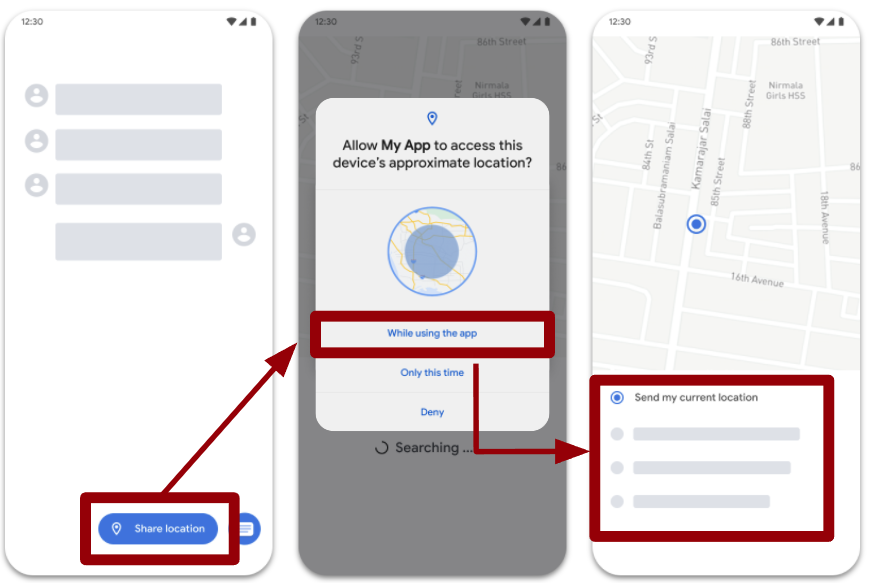
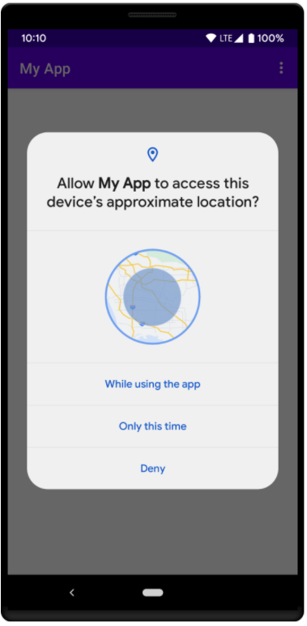
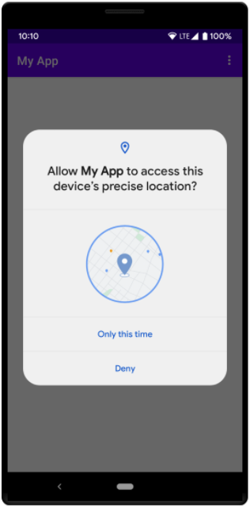

# 定位服务基础

安卓通过android.location包中的类为应用程序提供定位服务，定位框架中的核心组件就是定位服务系统，其提供了支撑底层设备的定位API。与其他系统服务一样，并不是直接实例化一个LocationManager对象，而是通过调用Context类的getSystemService(Context.LOCATION\_SERVICE)方法来获得一个LocationManager对象，这个方法会返回一个新的LocationManager对象。应用程序获取一个LocationManager对象后，就可以进行定位服务的各种操作，例如：

  - 查询所有定位提供者列表，获得最新的用户位置信息。

  - 周期性地注册、更新或注销用户当前位置：

## 请求位置权限

为了保护用户隐私，使用位置信息服务的应用必须请求位置权限。请求位置权限时，请遵循与请求任何其他运行时权限相同的最佳做法。请求位置权限时的一个重要区别在于，系统中包含与位置相关的多项权限。具体请求哪项权限以及请求相关权限的方式取决于应用用例的位置信息要求，本节介绍不同类型的位置信息要求，并就如何在每种情况下请求位置权限提供了指导，每项权限都具有以下特征组合：

  - 类别：前台位置信息或后台位置信息。

  - 精确度：确切位置或大致位置。

如果应用的某项功能仅分享或接收一次位置信息，或者只在特定的一段时间内分享或接收位置信息，则该功能需要前台位置信息访问权限，以下是此类情况的一些示例：

  - 在导航应用中，某项功能可让用户查询精细导航路线。

  - 在即时通讯应用中，某项功能可让用户与其他用户分享自己目前所在的位置。

如果应用的功能在下列某种情况下访问设备的当前位置信息，系统就会认为应用需要使用前台位置信息：

  - 属于应用的某个活动可见。

  - 应用的某个前台服务正在运行中。当有前台服务在运行时，系统会显示一条常驻通知来提醒用户注意。当应用被置于后台时（例如当用户按设备上的主屏幕按钮或关闭设备的显示屏时），其位置信息访问权限会得到保留。

此外，建议声明位置的前台服务类型，如以下代码段所示。在安卓10（API 级别 29）及更高版本中，必须声明此前台服务类型。

\<\!-- Recommended for Android 9 (API level 28) and lower. --\>

\<\!-- Required for Android 10 (API level 29) and higher. --\>

\<service

android:name="MyNavigationService"

android:foregroundServiceType="location" ... \>

\<\!-- Any inner elements would go here. --\>

\</service\>

码 ‑1

当应用请求 ACCESS\_COARSE\_LOCATION 权限或 ACCESS\_FINE\_LOCATION
权限时（如以下代码段所示），就是在声明需要获取前台位置信息：

\<manifest ... \>

\<\!-- Always include this permission --\>

\<uses-permission
android:name="android.permission.ACCESS\_COARSE\_LOCATION" /\>

\<\!-- Include only if your app benefits from precise location access.
--\>

\<uses-permission
android:name="android.permission.ACCESS\_FINE\_LOCATION" /\>

\</manifest\>

码 ‑2

如果应用中的某项功能会不断与其他用户分享位置信息或使用 Geofencing
API，则该应用需要后台位置信息访问权限。以下是此类情况的几个示例：

  - 在家庭位置信息分享应用中，某项功能可让用户与家庭成员持续分享位置信息。

  - 在 IoT 应用中，某项功能可让用户配置自己的家居设备，使其在用户离家时关机并在用户回家时重新开机。

除了前台位置信息部分所述的情况之外，如果应用在任何其他情况下访问设备的当前位置信息，系统就会认为应用需要使用后台位置信息。后台位置信息精确度与前台位置信息精确度相同，具体取决于应用声明的位置信息权限。在安卓10（API
级别 29）及更高版本中，必须在应用的清单中声明 ACCESS\_BACKGROUND\_LOCATION
权限，以便请求在运行时于后台访问位置信息。在较低版本的安卓系统中，当应用获得前台位置信息访问权限时，也会自动获得后台位置信息访问权限。

\<manifest ... \>

\<\!-- Required only when requesting background location access on

Android 10 (API level 29) and higher. --\>

\<uses-permission
android:name="android.permission.ACCESS\_BACKGROUND\_LOCATION" /\>

\</manifest\>

码 ‑3

安卓支持以下级别的位置信息精确度：

  - 大致位置

提供设备位置的估算值，将范围限定在大约 1.6 公里（1 英里）内。当声明 ACCESS\_COARSE\_LOCATION 权限（而非
ACCESS\_FINE\_LOCATION 权限）时，应用会使用这种级别的位置信息精确度。

  - 确切位置

提供尽可能准确的设备位置估算值，通常将范围限定在大约 50 米（160 英尺）内，有时精确到几米（10 英尺）范围以内。当声明
ACCESS\_FINE\_LOCATION
权限时，应用会使用这种级别的位置信息精确度。如果用户授予大致位置信息权限，应用只能获取大致位置信息（无论它声明了哪些位置信息权限）。当用户仅授予大致位置信息使用权时，应用应该仍会正常工作。如果应用中的某项功能确实需要使用
ACCESS\_FINE\_LOCATION 权限访问确切位置，可以请求用户允许该应用获取确切位置信息。

当应用中的功能需要位置信息访问权限时，请等到用户与该功能互动时再发出权限请求。本工作流遵循在上下文中请求运行时权限的最佳做法，如介绍如何请求应用权限的指南中所述。图
10‑1举例说明了如何执行此过程。该应用包含一项“分享位置信息”功能，需要前台位置信息访问权限。不过，在用户选择分享位置信息按钮之前，应用不会请求位置权限，如果用户选择仅在使用该应用时允许，系统就会启用该功能。

图 ‑1需要前台位置信息访问权限的位置信息分享功能。

用户只能授予大致位置信息使用权。在安卓12（API 级别 31）或更高版本中，用户仍可以请求该应用只检索大致位置信息，即使该应用请求
ACCESS\_FINE\_LOCATION 运行时权限也是如此。要处理这种可能会出现的用户行为，请勿单独请求
ACCESS\_FINE\_LOCATION 权限，而应在单个运行时请求中同时请求 ACCESS\_FINE\_LOCATION 权限和
ACCESS\_COARSE\_LOCATION 权限。如果尝试仅请求 ACCESS\_FINE\_LOCATION，系统会在某些安卓12
版本上忽略该请求，如果应用以安卓12 或更高版本为目标平台，系统会在 Logcat 中记录以下错误消息：

ACCESS\_FINE\_LOCATION must be requested with ACCESS\_COARSE\_LOCATION.

注意：为了更好地尊重用户隐私，建议仅请求
ACCESS\_COARSE\_LOCATION，即使只能访问大致位置信息，也可以满足大多数用例的要求。图
10‑2显示了应用以安卓12 为目标平台且仅请求 ACCESS\_COARSE\_LOCATION 时显示的面向用户的对话框。当应用同时请求
ACCESS\_FINE\_LOCATION 和 ACCESS\_COARSE\_LOCATION 时，系统权限对话框将为用户提供以下选项：

  - 确切位置：允许应用获取确切位置信息。

  - 大致位置：允许应用仅获取大致位置信息。

图
10‑3显示该对话框包含这两个选项的视觉提示，以帮助用户进行选择。用户确定位置信息精确度后，他们可以点按三个按钮中的一个来选择权限授予的时长。

<table>
<tbody>
<tr class="odd">
<td>

图 ‑2 应用仅请求 ACCESS_COARSE_LOCATION 时显示的系统权限对话框
</td>
<td>

图 ‑3 应用在单个运行时请求中同时请求 ACCESS_FINE_LOCATION 和 ACCESS_COARSE_LOCATION 时显示的系统权限对话框
</td>
</tr>
</tbody>
</table>

在安卓12 和更高版本中，用户可以转到系统设置，以设置任何应用的首选位置信息精确度，而不管该应用的目标 SDK
版本是什么。即使应用安装在搭载安卓11
或更低版本的设备上，用户随后又将该设备升级到安卓12
或更高版本，也是如此。注意：如果用户从权限对话框或在系统设置中将应用的位置信息使用权从确切位置降级到大致位置，系统会重启应用的进程。因此遵循有关请求运行时权限的最佳做法特别重要。该对话框仅涉及大致位置，并且包含三个按钮，它们上下分布。用户的选择会影响权限授予，表
10‑1显示了系统根据用户在运行时权限对话框中选择的选项向应用授予的权限：

|            | 确切位置                                             | 大致位置                     |
| ---------- | ------------------------------------------------ | ------------------------ |
| 仅在使用该应用时允许 | ACCESS\_FINE\_LOCATION、ACCESS\_COARSE\_LOCATION  | ACCESS\_COARSE\_LOCATION |
| 仅限这一次      | ACCESS\_FINE\_LOCATION 、ACCESS\_COARSE\_LOCATION | ACCESS\_COARSE\_LOCATION |
| 拒绝         | 无位置权限                                            | 无位置权限                    |

表 ‑1

如需确定系统已向应用授予的权限，请查看权限请求的返回值，可以在类似于下面的代码中使用 Jetpack
库，也可以使用平台库，在这种情况下自行管理权限请求代码。

ActivityResultLauncher\<String\[\]\> locationPermissionRequest =

registerForActivityResult(new ActivityResultContracts

.RequestMultiplePermissions(), result -\> {

Boolean fineLocationGranted = result.getOrDefault(

Manifest.permission.ACCESS\_FINE\_LOCATION, false);

Boolean coarseLocationGranted = result.getOrDefault(

Manifest.permission.ACCESS\_COARSE\_LOCATION,false);

if (fineLocationGranted \!= null && fineLocationGranted) {

// Precise location access granted.

} else if (coarseLocationGranted \!= null && coarseLocationGranted) {

// Only approximate location access granted.

} else {

// No location access granted.

}

}

);

// ...

// Before you perform the actual permission request, check whether your
app

// already has the permissions, and whether your app needs to show a
permission

// rationale dialog. For more details, see Request permissions.

locationPermissionRequest.launch(new String\[\] {

Manifest.permission.ACCESS\_FINE\_LOCATION,

Manifest.permission.ACCESS\_COARSE\_LOCATION

});

码 ‑4

可以要求用户将应用的访问权限从大致位置升级到确切位置，但是在让用户将应用的使用权升级到确切位置之前，需要考虑应用的用例是否确实需要这一级别的精确度。如果应用需要通过蓝牙或
Wi-Fi 将某个设备与附近的设备配对，考虑使用配套设备配对或蓝牙权限，而不是请求 ACCESS\_FINE\_LOCATION
权限。如需请求用户将应用的位置信息使用权从大致位置升级到确切位置，执行以下操作：

(1)如有必要，请说明应用为何需要获取权限。

(2)再次同时请求 ACCESS\_FINE\_LOCATION 和 ACCESS\_COARSE\_LOCATION
权限。由于用户已允许系统向应用授予大致位置信息使用权，因此这次系统对话框有所不同，图
10‑4和图 10‑5所示：

<table>
<tbody>
<tr class="odd">
<td>

图 ‑4 用户之前选择了大致位置和仅在使用该应用时允许
</td>
<td>

图 ‑5 用户之前选择了大致位置和仅限这一次
</td>
</tr>
</tbody>
</table>

即使应用中有多项功能需要位置信息使用权，可能其中也只有部分功能需要后台位置信息访问权限。因此，建议应用对位置权限执行递增请求，先请求前台位置信息访问权限，再请求后台位置信息访问权限。执行递增请求可以为用户提供更大的控制权和透明度，因为他们可以更好地了解应用中的哪些功能需要后台位置信息访问权限。注意：如果应用以安卓11（API
级别
30）或更高版本为目标平台，系统会强制执行此最佳做法。如果同时请求在前台访问位置信息的权限和在后台访问位置信息的权限，系统会忽略该请求，且不会向应用授予其中的任一权限。图
10‑6显示了旨在处理递增请求的应用示例，“显示当前位置”和“推荐附近地点”这两项功能都需要前台位置信息使用权，不过只有“推荐附近的地点”功能需要后台位置信息访问权限。执行递增请求的过程如下所示：

(1)首先应用应该引导用户留意到需要前台位置信息访问权限的功能，例如图 10‑1中的“分享位置信息”功能或图
10‑2中的“显示当前位置”功能。在应用有权访问前台位置信息之前，建议停止让用户访问需要后台位置信息访问权限的功能。

(2)稍后等到用户摸索需要后台位置信息使用权的功能时，可以届时再请求在后台访问位置信息的权限。

图 ‑6这两项功能都需要位置信息使用权，但只有“推荐附近地点”功能需要后台位置信息使用权。

注意如果应用中的某项功能从后台访问位置信息，请验证此类访问是否有必要，并考虑以其他方式获取该功能所需的信息。

<table>
<tbody>
<tr class="odd">
<td>

图 ‑7 设置页面包含一个名为始终允许的选项，用于授予后台位置信息使用权。
</td>
<td>

图 ‑8 提醒用户他们已授予应用后台位置信息使用权的通知
</td>
</tr>
</tbody>
</table>

权限对话框内容取决于目标 SDK 版本，在搭载安卓10（API 级别
29）的设备上，应用中的某项功能请求在后台访问位置信息时，系统权限对话框包含一个名为始终允许的选项，如果用户选择此选项，应用中的相应功能就会获得在后台访问位置信息的权限。但是，在安卓11（API
级别 30）及更高版本中，系统对话框不含始终允许选项，相反用户必须在设置页面上启用后台位置信息，如图
10‑7所示。请求在后台访问位置信息的权限时，可以遵循最佳做法，帮助用户导航到此设置页面，授予权限的过程取决于应用的目标
SDK 版本。

  - 以安卓11 或更高版本为目标平台的应用

如果应用尚未获得 ACCESS\_BACKGROUND\_LOCATION 权限并且
shouldShowRequestPermissionRationale() 返回 true，需要向用户显示包含以下内容的指导界面：

  - 明确说明应用功能需要在后台访问位置信息的原因。

  - 用于授予后台位置信息使用权的设置选项（例如，图 7 中的始终允许）的用户可见标签。可以调用
    getBackgroundPermissionOptionLabel()
    获取此标签。此方法的返回值会根据用户设备的语言偏好设置进行本地化。

  - 供用户拒绝授予权限的选项。如果用户拒绝应用在后台访问位置信息，他们应该能够继续使用应用。

用户可以通过点按系统通知来更改应用的位置信息设置

  - 以安卓10 或更低版本为目标平台的应用

当应用中的某项功能请求后台位置信息访问权限时，用户会看到一个系统对话框。此对话框包含一个选项，可用于导航到设置页面上的应用位置权限选项，只要应用已遵循有关请求位置信息权限的最佳做法，无需做出任何更改即可支持此行为。用户可能会影响后台位置信息的准确度，如果用户请求获取大致位置信息，用户在位置信息权限对话框中的选择也适用于后台位置信息。换言之，如果用户向应用授予
ACCESS\_BACKGROUND\_LOCATION
权限，但仅授予在前台访问大致位置信息的权限，那么应用在后台也只有大致位置信息的访问权限。后台位置信息授权提醒。在安卓10
及更高版本中，当应用中的功能在用户授予后台位置信息访问权限后首次在后台访问设备位置信息时，系统会安排向用户发送一条通知。此通知旨在提醒用户他们已允许应用始终有权访问设备位置信息，示例通知如图
10‑8所示。

## 获取位置信息

安卓设备获取位置可以使用GPS和安卓网络位置提供器（Android Network Location
Provider，NLP）。尽管GPS定位更精确，但缺点是只能在户外使用、耗电严重，并且其返回用户位置的速度远不能满足用户需求。网络位置提供器通过基站和Wi-Fi信号来获取位置信息，并且室内外均可使用，其速度更快、耗电更少。为了获取用户位置信息，可以同时使用GPS和安卓网络位置提供器，也可以二者任选其一。获取位置信息时要解决的问题，那么哪些因素决定了定位呢？获得用户信息是一个复杂的过程，有时候会发现获取的位置信息是错误的或者精度不高，原因有以下几种：

  - 多种位置源：GPS、Cell-ID和Wi-Fi都可以提供用户位置信息，每种源的精度是不同的，但是决定使用那个源，需要权衡精度、速度和电池的容量。

  - 用户的移动：当用户移动时，因为用户位置的改变必须经常定期获取用户位置，所以当用户在移动时，如果获取信息的频次越高，则用户位置信息越精确，但是高频次也会影响设备的运行效率和电量。

  - 变化的精度：从每个位置源获得的位置估算在精度方面也是不一致的。例如，从一个位置上，10秒前获得的位置或许比从相同的或者不同的源上获取的最新位置精度更高。

在活动的onCreate()方法中，按如下代码段所示，创建一体化位置信息提供程序客户端的一个实例。

private FusedLocationProviderClient fusedLocationClient;

// ..

@Override

protected void onCreate(Bundle savedInstanceState) {

// ...

fusedLocationClient =
LocationServices.getFusedLocationProviderClient(this);

}

码 ‑5

创建位置信息服务客户端后，就可以获取用户设备最近一次的已知位置。当应用连接到这些设备后，就可以使用一体化位置信息提供程序的
getLastLocation()方法来检索设备的位置。此调用返回的位置信息的准确度取决于在应用清单中设置的权限，如介绍如何请求位置权限的指南中所述。如需请求最近一次的已知位置，请调用
getLastLocation() 方法。以下代码段说明了这一请求以及简单的响应处理方法：

fusedLocationClient.getLastLocation()

.addOnSuccessListener(this, new OnSuccessListener\<Location\>() {

@Override

public void onSuccess(Location location) {

// Got last known location. In some rare situations this can be null.

if (location \!= null) {

// Logic to handle location object

}

}

});

码 ‑6

getLastLocation() 方法会返回一个 Task，供用来获取具有地理位置经纬度坐标的 Location
对象。在以下情况下，该位置信息对象可能为 null：

  - 设备设置中关闭了位置信息服务。即使之前检索到了最近一次的位置信息，结果也可能为 null，因为停用位置信息服务也会清除缓存。

  - 设备从未记录自己的位置信息，新设备或者已经恢复为出厂设置的设备可能会发生此情况。

  - 设备上的 Google Play
    服务已经重启，且在服务重启后，没有已请求位置信息的活跃一体化位置信息提供程序客户端。为避免这种情况，可以创建新客户端并自行请求位置信息更新。如需了解详情，请参阅接收位置信息更新。

选择最佳位置信息估算值，FusedLocationProviderClient
提供了多种检索设备位置信息的方法。根据应用的用例，从以下选项中选择一项：

  - getLastLocation()
    可更快地获取位置信息估算值，并最大限度地减少应用对电池用量的消耗。但是，如果最近没有其他客户端主动使用位置信息，则位置信息可能会过时。

  - getCurrentLocation() 可以更一致、更及时地获取更准确的位置信息。不过，这种方法会导致系统在设备上进行主动位置信息计算

推荐使用这种方法来获取最新位置信息，并建议尽可能使用这种方法。与使用 requestLocationUpdates()
自行启动和管理位置信息更新等替代方案相比，这种方法更安全。如果应用调用
requestLocationUpdates()，则在无法获取位置信息，或者获取新位置后请求未正确停止时，会消耗大量电量。在使用位置服务开发应用时，上面这些因素都需要考虑。但首先需要知道怎样获取位置信息。以下是android.location包中几个关于定位功能的比较重要的类：

  - LocationManager：提供访问系统定位服务。定位服务可以为应用程序提供周期性的设备的地理位置更新信息，或当设备进入某个地理范围时，发送应用程序说明的意图。

  - LocationProvider：是一个抽象类，是不同定位提供者的父类，提供当前位置信息，并存储在Location类中。Android设备有一些可用的LocationProvider，表
    10‑2列出了主要的LocationProvider。

|                  |                                  |
| ---------------- | -------------------------------- |
| LocationProvider | Description                      |
| network          | 使用移动网络或WI-Fi来确定最佳位置，在室内精度比GPS 高。 |
| gps              | 使用GPS接收器来确定最佳位置，通常比网络精度更高。       |
| passive          | 允许参与其他组件位置更新以节省能源。               |

表 ‑2 LocationProvider

  - LocationListener：提供定位信息发生改变时的回调功能。必须事先在定位管理器中注册监听器对象。

  - Criteria：使得应用能够通过在LocationProvider中设置的属性来选择合适的定位提供者。

在安卓中，可以通过回调的方法得到用户位置。使用LocationManager类，向其requestLocationUpdates()方法传入一个LocationListener对象，就可以获得位置更新。在LocationListener中，必须要实现响应的几个回调方法，以便当用户位置信息和服务状态的变化时LocationManager调用。码
10‑7使用一个简单的例子，说明了如何定义一个LocationListener，并且请求位置更新。

// Acquire a reference to the system Location Manager

LocationManager locationManager = (LocationManager)
this.getSystemService(Context.LOCATION\_SERVICE);

// Define a listener that responds to location updates

LocationListener locationListener = new LocationListener() {

public void onLocationChanged(Location location) {

// Called when a new location is found by the network location provider.

makeUseOfNewLocation(location);

}

public void onStatusChanged(String provider, int status, Bundle extras)
{}

public void onProviderEnabled(String provider) {}

public void onProviderDisabled(String provider) {}

};

// Register the listener with the Location Manager to receive location
updates

locationManager.requestLocationUpdates(LocationManager.NETWORK\_PROVIDER,
0, 0, locationListener);

码 ‑7 位置更新信息获取

在requestLocationUpdates()方法的第一个参数是位置服务的类型，也就是程序通过什么来获取用户的位置信息；第二个参数是两次位置提醒之间的最小时间间隔；第三个参数是两次位置提醒之间最小距离间隔（第二、三两个参数都为0表示尽可能频繁的请求位置信息）；第四个参数为LocationListener。例如每隔三十秒钟收集一次GPS信息，可以用下面的代码实现：

locationManager.requestLocationUpdates(LocationManager.GPS\_PROVIDER,30\*1000,
0, myListenGPS);

码 ‑8

码 10‑7中，选择的位置服务类型为NETWORK\_PROVIDER，而安卓系统提供两种位置服务类型，其中包括：

LocationManager.GPS\_PROVIDER

LocationManager.NETWORK\_PROVIDER

码 ‑9

应用程序如果要使用这两种方式的定位服务，需要通过系统设置，如**图 10‑9**。

**图** **10‑9 设置定位方式**

这两种方式的区别是什么呢？GPS\_PROVIDER提供精确的GPS定位，但在室内几乎无法定位而导致无法收集信息，即有定位盲区。GPS定位基本原理是测量出已知位置的卫星到用户接收机之间的距离，然后综合多颗卫星的数据就可知道接收机的具体位置。要达到这一目的，卫星的位置可以根据星载时钟所记录的时间在卫星星历中查出，所以使用必须在户外。而NETWORK\_PROVIDER为网络定位，其偏差较大，但无定位盲区，只要有网络一般都可以收集的到。网络定位简单来说就是当接入WI-FI就使用WI-FI定位，当前接入4G网就是基站定位。实际上基站和WI-FI有单独的定位方式，只不过系统都封装到了NETWORK\_PROVIDER方法中。除了requestLocationUpdates()方法，LocationManager类还提供了getLastKnownLocation()方法，来获取上一次获取到的位置信息，而并非当前的GPS位置信息。为了从NETWORK\_PROVIDER或GPS\_PROVIDER获取位置更新，必须声明在应用程序的Manifest文件中声明用户访问的ACCESS\_COARSE\_LOCATION或ACCESS\_FINE\_LOCATION权限。

> \<manifest ... \>
> 
> \<uses-permission
> 
> android:name="android.permission.ACCESS\_FINE\_LOCATION" /\>
> 
> ...
> 
> \</manifest\>

码 ‑10 定位服务用户权限设置

如果在应用程序中同时使用NETWORK\_PROVIDER和GPS\_PROVIDER，就只需声明ACCESS\_FINE\_LOCATION权限。ACCESS\_COARSE\_LOCATION只包含NETWORK\_PROVIDER的权限。

适当地使用位置信息能够为应用的用户带来好处。例如，如果应用要在用户步行或驾车时帮助他们寻路，或者如果应用要跟踪资产的位置，那么就需要定期获取设备的位置信息。除了地理位置（纬度和经度）之外，可能还需要向用户提供其他信息，如设备的方位（水平行进方向）、高度或速度。Location
对象中提供了这些信息以及更多信息，应用可以从一体化位置信息提供程序中检索这些信息。作为响应，API 会根据 WLAN 和
GPS（全球定位系统）等当前可用的位置信息提供程序，以可用的最佳位置信息定期更新应用。位置信息的准确度由提供程序、已请求的位置权限以及在位置信息请求中设置的选项决定。下面将介绍如何在一体化位置信息提供程序中使用
requestLocationUpdates() 方法请求对设备的位置信息进行定期更新。

获取最近一次的已知位置，设备最近一次的已知位置提供了一个方便的起点，可确保应用在开始定期位置信息更新之前具有已知位置。获取最近一次的已知位置一课将向介绍如何通过调用
getLastLocation() 获取最近一次的已知位置。下面几部分中的代码段假定应用已检索到最近一次的已知位置，并将其作为 Location
对象存储在全局变量 mCurrentLocation
中。发出位置信息请求，在请求位置信息更新之前，应用必须连接到位置信息服务并发出位置信息请求。更改位置信息设置一课将向介绍如何执行此操作。发出位置信息请求后，即可通过调用
requestLocationUpdates() 开始定期更新。根据请求的形式，一体化位置信息提供程序要么调用
LocationCallback.onLocationResult() 回调方法并向其传递 Location 对象的列表，要么发出一个
PendingIntent 并在其扩展数据中包含位置信息。更新的准确度和频率受已请求的位置权限以及在位置信息请求对象中设置的选项的影响。如何使用
LocationCallback 回调方法获取更新。调用 requestLocationUpdates()，并向其传递
LocationRequest 对象的实例和 LocationCallback。定义一个 startLocationUpdates()
方法，如以下代码示例所示：

@Override

protected void onResume() {

super.onResume();

if (requestingLocationUpdates) {

startLocationUpdates();

}

}

private void startLocationUpdates() {

fusedLocationClient.requestLocationUpdates(locationRequest,

locationCallback,

Looper.getMainLooper());

}

码 ‑11

注意，上面的代码段引用了布尔标志
requestingLocationUpdates，该标志用于跟踪用户已开启还是已关闭位置信息更新。如果用户已关闭位置信息更新，可以告知他们应用要求访问位置信息。定义位置信息更新回调，一体化位置信息提供程序会调用
LocationCallback.onLocationResult() 回调方法。传入参数包含 Location
对象列表，其中包含位置的纬度和经度。以下代码段展示了如何实现
LocationCallback 接口并定义该方法，然后获取位置信息更新的时间戳，并在应用的界面上显示纬度、经度和时间戳：

private LocationCallback locationCallback;

// ...

@Override

protected void onCreate(Bundle savedInstanceState) {

// ...

locationCallback = new LocationCallback() {

@Override

public void onLocationResult(LocationResult locationResult) {

if (locationResult == null) {

return;

}

for (Location location : locationResult.getLocations()) {

// Update UI with location data

// ...

}

}

};

}

码 ‑12

停止位置信息更新，应考虑当 活动不再获得焦点时（如当用户切换到另一个应用或切换到同一应用中的另一个
活动时）是否要停止位置信息更新。这样便于减少耗电量，前提是应用即使在后台运行时也不需要收集信息，下面介绍如何在活动的
onPause() 方法中停止更新。如需停止位置信息更新，调用 removeLocationUpdates()，并向其传递
LocationCallback，如以下代码示例所示：

@Override

protected void onPause() {

super.onPause();

stopLocationUpdates();

}

private void stopLocationUpdates() {

fusedLocationClient.removeLocationUpdates(locationCallback);

}

码 ‑13

使用布尔属性 requestingLocationUpdates 跟踪当前是否开启了位置信息更新。在活动的 onResume()
方法中，检查位置信息更新当前是否处于活跃状态，如果未处于活跃状态请将其激活：

@Override

protected void onResume() {

super.onResume();

if (requestingLocationUpdates) {

startLocationUpdates();

}

}

码 ‑14

保存活动的状态，设备配置的更改（如屏幕方向或语言的更改）可能会导致当前活动被销毁，因此应用必须存储重新创建该活动所需的所有信息。为了实现此目的，一种方法是使用存储在
Bundle 对象中的实例状态。以下代码示例展示了如何使用活动的 onSaveInstanceState() 回调保存实例状态：

@Override

protected void onSaveInstanceState(Bundle outState) {

outState.putBoolean(REQUESTING\_LOCATION\_UPDATES\_KEY,

requestingLocationUpdates);

// ...

super.onSaveInstanceState(outState);

}

码 ‑15

定义一个 updateValuesFromBundle() 方法，以从上一个活动实例恢复保存的值（如果有）。从
活动的onCreate()方法调用上述方法，如以下代码示例所示：

@Override

public void onCreate(Bundle savedInstanceState) {

// ...

updateValuesFromBundle(savedInstanceState);

}

private void updateValuesFromBundle(Bundle savedInstanceState) {

if (savedInstanceState == null) {

return;

}

// Update the value of requestingLocationUpdates from the Bundle.

if
(savedInstanceState.keySet().contains(REQUESTING\_LOCATION\_UPDATES\_KEY))
{

requestingLocationUpdates = savedInstanceState.getBoolean(

REQUESTING\_LOCATION\_UPDATES\_KEY);

}

// ...

// Update UI to match restored state

updateUI();

}

码 ‑16

如果应用需要请求位置信息或接收权限更新，设备就需要启用适当的系统设置，例如 GPS 或 WLAN 扫描。应用不应直接启用服务（例如设备的
GPS），而应指定所需的准确度/耗电量以及更新间隔，然后设备就会自动对系统设置进行相应的更改。这些设置通过 LocationRequest
数据对象定义。本节介绍如何使用 Settings Client
检查启用了哪些设置，以及如何向用户提供“位置信息设置“对话框，让用户只需点按一下就可以更新自己的设置。为了使用
Google Play 服务和一体化位置信息提供程序提供的位置信息服务，使用 Settings Client
连接应用，然后检查当前的位置信息设置，并视需要提示用户启用所需的设置。如果应用的功能需要使用位置信息服务，应用必须根据这些功能的用例请求位置权限。如需保存向一体化位置信息提供程序发送的请求的参数，需要创建
LocationRequest。这些参数用于确定位置信息请求的准确度。如需详细了解所有可用的位置信息请求选项，本节将介绍如何设置更新间隔、最快更新间隔和优先级，具体如下所述：

  - 更新间隔

setInterval() -
此方法以毫秒为单位，设置应用接收位置信息更新的频率。请注意，为了优化电池电量的使用，位置信息的更新频率可能会高于或低于此频率，此外也可能完全不更新位置信息（例如，当设备没有网络连接时）。

  - 最快更新间隔

setFastestInterval() - 此方法以毫秒为单位，设置应用处理位置信息更新的最快频率。除非以快于 setInterval()
中指定的频率接收更新对应用有益，否则无需调用此方法。

  - 优先级

setPriority() - 此方法设置请求的优先级，此优先级可以明确地提示 Google Play
服务提供的位置信息服务应该使用哪些位置信息来源。支持使用以下值：

  - PRIORITY\_BALANCED\_POWER\_ACCURACY - 使用此设置可以请求城市街区级别的定位精确度，即大约 100
    米。这是一个粗略的准确度，消耗的电量可能会比较少。使用此设置时，位置信息服务可能会使用 WLAN
    和手机基站来进行定位。但请注意，位置信息提供程序的选择还取决于许多其他因素，例如有哪些信息来源可用。

  - PRIORITY\_HIGH\_ACCURACY - 使用此设置可以请求尽可能精确的位置信息。使用此设置时，位置信息服务更有可能使用
    GPS 确定位置。

  - PRIORITY\_LOW\_POWER - 使用此设置可以请求城市级别的定位精确度，即大约 10
    公里。这是一个粗略的准确度，消耗的电量可能会比较少。

  - PRIORITY\_NO\_POWER -
    如果不希望增加耗电量，又想及时获得可用的位置信息更新，请使用此设置。使用此设置时，应用不会触发任何位置信息更新，但会接收其他应用触发的位置信息更新。

创建位置信息请求并设置相关参数，如以下代码示例中所示：

protected void createLocationRequest() {

LocationRequest locationRequest = LocationRequest.create();

locationRequest.setInterval(10000);

locationRequest.setFastestInterval(5000);

locationRequest.setPriority(LocationRequest.PRIORITY\_HIGH\_ACCURACY);

}

码 ‑17

将优先级 PRIORITY\_HIGH\_ACCURACY 与在应用清单中定义的 ACCESS\_FINE\_LOCATION 权限设置及
5000 毫秒（5
秒）的快速更新间隔配合使用，可让一体化位置信息提供程序返回准确度在几英尺以内的位置信息更新，这种方法适用于实时显示位置信息的地图应用。性能提示：如果应用在收到位置信息更新后会访问网络或执行其他长时间运行的工作，将最快间隔调整为较慢的值，此调整可防止应用收到更新却无法使用。待长时间运行的工作完成后，再重新将最快间隔设置为较快的值。

获得当前位置信息设置，连接到 Google Play 服务和位置信息服务 API
后，即可获得用户设备的当前位置信息设置。如需实现此目的，请创建一个
LocationSettingsRequest.Builder，并添加一个或多个位置信息请求，以下代码段展示了如何添加在上一步中创建的位置信息请求：

LocationSettingsRequest.Builder builder = new
LocationSettingsRequest.Builder()

.addLocationRequest(locationRequest);

码 ‑18

接下来，检查是否满足了当前的位置信息设置要求：

LocationSettingsRequest.Builder builder = new
LocationSettingsRequest.Builder();

// ...

SettingsClient client = LocationServices.getSettingsClient(this);

Task\<LocationSettingsResponse\> task =
client.checkLocationSettings(builder.build());

码 ‑19

Task对象完成后，应用可以通过查看 LocationSettingsResponse
对象中的状态代码，检查位置信息设置。如需更加详细地了解相关位置信息设置的当前状态，应用可以调用
LocationSettingsResponse 对象的 getLocationSettingsStates()
方法。提示用户更改位置信息设置，如需确定位置信息设置是否适合位置信息请求，将
OnFailureListener 添加至验证位置信息设置的 Task 对象，然后检查传递到 onFailure() 方法的 Exception
对象是否为 ResolvableApiException 类的实例，如果是就表示必须更改设置。接下来，通过调用
startResolutionForResult()
方法显示一个对话框，请求用户授予修改位置信息设置的权限。以下代码段展示了如何确定用户的位置信息设置是否允许位置信息服务创建
LocationRequest，以及如何在必要时向用户请求更改位置信息设置的权限：

task.addOnSuccessListener(this, new
OnSuccessListener\<LocationSettingsResponse\>() {

@Override

public void onSuccess(LocationSettingsResponse locationSettingsResponse)
{

// All location settings are satisfied. The client can initialize

// location requests here.

// ...

}

});

task.addOnFailureListener(this, new OnFailureListener() {

@Override

public void onFailure(@NonNull Exception e) {

if (e instanceof ResolvableApiException) {

// Location settings are not satisfied, but this can be fixed

// by showing the user a dialog.

try {

// Show the dialog by calling startResolutionForResult(),

// and check the result in onActivityResult().

ResolvableApiException resolvable = (ResolvableApiException) e;

resolvable.startResolutionForResult(MainActivity.this,

REQUEST\_CHECK\_SETTINGS);

} catch (IntentSender.SendIntentException sendEx) {

// Ignore the error.

}

}

}

});

码 ‑20

按照请求位置权限和隐私设置最佳做法页面中所述，应用应该只请求获得对于面向用户的功能所必需的位置权限，并以恰当的方式向用户披露请求的内容。大多数使用情形中，只有在用户与应用互动时才需要使用位置信息。如果应用需要在后台访问位置信息（例如在实现地理围栏时），请确保这种访问对使用应用的核心功能起到至关重要的作用，能为用户提供明确的好处，并且采用一种让用户清楚知道的方式完成。注意：Google
Play
商店已更新有关设备位置的政策，限制应用仅在实现核心功能所必需的情形下且在满足相关政策要求后才能请求后台位置信息访问权限。采用这些最佳做法并不能保证
Google Play
会批准应用在后台使用位置信息，详细了解与设备位置信息相关的政策变更。后台位置信息访问权限核对清单，使用以下核对清单确定潜在的后台位置信息访问逻辑：

  - 在应用的清单中，检查是否有 ACCESS\_COARSE\_LOCATION 权限和 ACCESS\_FINE\_LOCATION
    权限，验证应用是否需要这些位置权限。

如果应用以安卓10（API 级别 29）或更高版本为目标平台，检查是否有 ACCESS\_BACKGROUND\_LOCATION
权限，验证应用是否具有需要有关权限的功能。

  - 在代码中检查是否使用了位置信息访问 API（例如 Fused Location Provider API、Geofencing API
    或 LocationManager API），例如在以下结构中检查：
    
      - 后台服务
    
      - JobIntentService 对象
    
      - WorkManager 或 JobScheduler 任务
    
      - AlarmManager 操作
    
      - 从应用微件调用的待定意图

  - 如果应用会使用访问位置信息的 SDK 或库，则视为应用需要该访问权限。

评估后台位置信息访问权限，如果发现应用在后台访问了位置信息，请考虑执行以下操作：

  - 评估后台位置信息访问权限是否对应用的核心功能起到至关重要的作用。

  - 如果不需要在后台访问位置信息，请移除此权限。

如果应用以安卓10（API 级别 29）或更高版本为目标平台，请从应用的清单中移除 ACCESS\_BACKGROUND\_LOCATION
权限。移除此权限后，搭载安卓10 的设备上的应用将无法选择始终访问位置信息。

  - 确保用户知道应用在后台访问位置信息。在对用户而言并非显而易见的情形下，这一点尤为重要。

  - 如果可能，请重构位置信息访问逻辑，以便仅在用户可以看到应用的活动时请求访问位置信息。

限制后台位置信息更新次数，如果后台位置信息访问权限对应用至关重要，请注意：在搭载安卓8.0（API 级别
26）及更高版本的设备上，安卓系统为了延长设备电池的续航时间，采用了“后台位置信息限制”的设置。在这些版本的安卓系统中，如果应用在后台运行，其每小时只能接收几次位置信息更新。详细了解后台位置信息限制。

在开发应用的过程中，需要对获取用户位置的模型进行效率测试。最简单的测试就是使用Android真机设备，但是如果没有一个真正的物理设备，也可以使用安卓虚拟机的虚拟位置进行基于用户位置的测试。向应用提供模拟位置数据的方法主要有三种：Eclipse，DDMS或者模拟器控制台的“geo”命令行。由于提供模拟位置数据是使用的GPS的数据类型，所以必须使用GPS\_PROVIDER来获取位置更新，否则模拟数据无法工作。如果使用DDMS工具，可以使用多种方法模拟位置数据，其中包括向设备手动发送独立的经纬度；使用GPX文件向设备发送的一系列路径；使用KML文件向设备发送独立的一序列化的路径位置。如果使用模拟器控制台的“geo”命令行发送模拟位置数据，需要在安卓模拟器上装载应用，并打开SDK下的/tools目录下打开设备终端的控制台，连接到模拟器控制台：

> telnet localhost \<console-port\>

码 ‑21

然后向模拟控制台发送位置数据。“geo fix”发送固定的geo位置。这个命令接收十进制的经度和纬度，和一个可选的海拔（单位m），例如：

> geo fix -121.45356 46.51119 4392

码 ‑22

geo nmea发送一个NMEA 0183句子，例如：

> geo nmea
> $GPRMC,081836,A,3751.65,S,14507.36,E,000.0,360.0,130998,011.3,E\*62

码 ‑23

## 定位最佳策略

基于位置的应用可谓是数不胜数，但是由于很难提供最佳精度，用户位置的移动，多种方法获取用户位置和尽可能减少耗电量等原因，使得获取用户位置变得较为复杂。要既减少电池的耗电量，同时又获取极佳用户位置，必须定义一个长效模型来解决多种难题，说明应用如何获取用户的位置。当启动或停止监听位置更新，或使用缓存位置数据时此模型会被使用，下面是获取用户位置的典型流程：

（1）启动应用

（2）一段时间后，开始监听定位提供者获取位置信息

（3）通过去除不够准确的位置更新来保持以最佳状态去获取位置信息

（4）停止监听获取位置信息。

（5）采用最新最好的位置。

**图 10‑10**通过使用时间线展示了获取用户位置更新的流程时间线，这个时间线体现了应用监听用户位置更新的各个时间段和各个时间段发生的事件。

**图** **10‑10 用户位置更新**

在接收更新位置信息的这段时间，需要对一些关键点做出决策：

  - 决定开始监听更新的时刻

应用程序可以一启动就开始监听用户位置更新，也可以仅当用户触发特定的条件时才启动监听。但是要清楚意识到两点：第一点是长时间的监听位置更新可能导致耗电量急剧上升，第二点是短时间的监听又可能使得用户位置获取的准确度不够。如上所述，可以通过调用requestLocationUpdates()开始监听更新。

LocationProvider locationProvider = LocationManager.NETWORK\_PROVIDER;

//或者，使用LocationManager.GPS\_PROVIDER

locationManager.requestLocationUpdates(locationProvider, 0, 0,
locationListener);

码 ‑24

  - 通过最后可知位置快速修正

位置监听器接收第一次位置更新所花费的时间长得可能让用户难以忍受。除非位置监听器接收到一个更精确的位置信息，应用程序应该暂时使用缓存中的用户位置信息，这个信息可以通过调用getLastKnownLocation()方法来获取。

LocationProvider locationProvider = LocationManager.NETWORK\_PROVIDER;

Location lastKnownLocation =
locationManager.getLastKnownLocation(locationProvider);

码 ‑25

  - 决定停止监听更新的时刻

根据应用程序的不同，决定什么时候停止监听最新的策略可能非常简单，也可能十分复杂。在获取位置信息和使用位置信息之间加入一点时间的延迟，可能提高位置获取的准确度。持续监听会消耗大量的电量，因此只要获取了所需的信息，应该通过调用removeUpdates()停止监听更新。

//移除先前添加的监听

locationManager.removeUpdates(locationListener);

码 ‑26

  - 保持最佳的估算值

最新获取的位置信息可能是最精确的，但是由于位置修正的精确度经常变化，最新获取到的位置信息并不一定都是最准确的，因此需要基于一些规范添加选择位置信息的逻辑，这些规范可以根据具体的应用和现场测试的实例不同而有所变化，下面是确认位置修正可以采用的步骤：

（1）检查是否最近得到的位置信息明显比以前的要新。

（2）检查位置精度是好于还是差于之前的位置信息。

（3）检查最新的位置信息是来自于哪一个提供者，并且判断是否这个位置信息相比之前的更加准确可靠。

码 10‑27是符合上述逻辑的代码实现例子，说明了如何在应用程序中实现预定义好的策略和逻辑。

private static final int TWO\_MINUTES = 1000 \* 60 \* 2;

/\*\* 判断哪一种位置读取方式比当前的位置修复更加的准确

\* @param location 新位置

\* @param currentBestLocation 当前的位置，此位置需要和新位置进行比较

\*/

protected boolean isBetterLocation(Location location, Location
currentBestLocation) {

if (currentBestLocation == null) {

// A new location is always better than no location

return true;

}

 

//检查最新的位置是比较新还是比较旧

long timeDelta = location.getTime() - currentBestLocation.getTime();

boolean isSignificantlyNewer = timeDelta \> TWO\_MINUTES;

boolean isSignificantlyOlder = timeDelta \< -TWO\_MINUTES;

boolean isNewer = timeDelta \> 0;

 

//如果当前的位置信息来源于两分钟前，使用最新位置，

// 因为用户可能移动了

if (isSignificantlyNewer) {

return true;

//如果最新的位置也来源于两分钟前，那么此位置会更加的不准确。

} else if (isSignificantlyOlder) {

return false;

}

 

//检查最新的位置信息是更加的准确还是不准确

int accuracyDelta = (int) (location.getAccuracy() -
currentBestLocation.getAccuracy());

boolean isLessAccurate = accuracyDelta \> 0;

boolean isMoreAccurate = accuracyDelta \< 0;

boolean isSignificantlyLessAccurate = accuracyDelta \> 200;

 

//检查旧的位置和新的位置是否来自同一个Provider

boolean isFromSameProvider = isSameProvider(location.getProvider(),

currentBestLocation.getProvider());

 

//结合及时性和精确度，决定位置信息的质量

if (isMoreAccurate) {

return true;

} else if (isNewer && \!isLessAccurate) {

return true;

} else if (isNewer && \!isSignificantlyLessAccurate &&
isFromSameProvider) {

return true;

}

return false;

}

 

/\*\*\* 检查两个提供者是否是同一个\*/

private boolean
isSameProvider([String](http://www.google.com/search?hl=en&q=allinurl%3AString+java.sun.com&btnI=I%27m%20Feeling%20Lucky)
provider1,
[String](http://www.google.com/search?hl=en&q=allinurl%3AString+java.sun.com&btnI=I%27m%20Feeling%20Lucky)
provider2) {

if (provider1 == null) {

return provider2 == null;

}

return provider1.equals(provider2);

码 ‑27 位置修正判断逻辑

  - 调整模型来保存电量和数据交换

当测试应用程序的时候，可能会在模型是要提供更佳的位置信息还是更佳的效率之间做出选择调整。

  - 减少窗口的大小

在一个较小的窗口下监听位置更新，意味着与GPS或者网络定位服务进行更少的交互，这样就可以保存电池电量。但是这样会使得可选位置变少，从而导致获取最佳位置信息变得困难。

  - 减少位置提供者的更新频率

在窗口中减少更新出现的频率也可以提高电池使用效率，但是这样会牺牲精确度。两者之间的权衡要依赖于具体的实际应用。可以通过增加requestLocationUpdates()函数的第二个和第三个参数的值来减少更新的频率。

  - 仅支持一种位置信息提供者

根据应用程序的使用场景和对精度的要求，也许只需要在网络定位提供者和GPS之间选择一种提供者，而不是两者都需要。只和其中的一种服务进行交互可以大大的减少耗电的可能性。

## 信息获取实例

**前面对有关定位服务的位置信息服务进行了阐述，下面利用适用一个简单的例子把这些知识连贯起来。这个例子可以在屏幕上显示手机设备当前位置的经纬度，当按下按钮时屏幕显示出当前经纬度对应的地址信息，下面是具体的步骤。**

**（1）设置用户权限**

在应用程序的AndroidManifest.xml文件中，添加设置访问位置提供器的权限内容（见码 10‑10）。

2.  **定义布局等**资**源文件**

在/res/layout中定义用户界面的布局文件activity\_main.xml，在界面上定义一个按钮show\_address\_button，一个用于响应从位置提供其中获取当前位置信息后，在界面上显示当前位置的经纬度以及设备所在的地址。

（3）创建或打开活动，获取视图对象

创建显示用户界面的Activity子类ShowLocationActivity，并导入activity\_main.xml定义的布局文件，获取按钮对象，并分别赋值给showAddrBtn变量。

4.  获取LocationManager对象

从系统获取LocationManager对象，并创建Criteria对象，根据其精度和电池耗电量的标准，使用LocationManager的getBestProvider()方法选取系统最符合要求的LocationProvider（见码
10‑35）。

LocationManager locationManager = (LocationManager)
getSystemService(Context.LOCATION\_SERVICE);

Criteria criteria = new Criteria();

provider = locationManager.getBestProvider(criteria, false);

Location location = locationManager.getLastKnownLocation(provider);

码 ‑35 初始化提供位置服务的对象

（5）定义自己的LocationListener

在ShowLocationActivity中创建自己的MyLocationListener实现LocationListener的接口，当位置发生变化时，把经纬度显示在屏幕上（见码
10‑36）。

private class MyLocationListener implements LocationListener {

@Override

public void onLocationChanged(Location location) {

String showLocation = “Current Location \\n Latitude: " +
location.getLatitude()+ ”\\n Longitude: “+location.getLongitude();

Toast.makeText(this,showLocation ,

Toast.LENGTH\_SHORT).show();

}

@Override

public void onProviderEnabled(String provider) {

Toast.makeText(this, "Enabled new provider " + provider,

Toast.LENGTH\_SHORT).show();

}

@Override

public void onProviderDisabled(String provider) {

Toast.makeText(this, "Disabled provider " + provider,

Toast.LENGTH\_SHORT).show();

}

@Override

public void onStatusChanged(String provider, int status, Bundle extras)
{

Toast.makeText(this, "Provider status changed",
Toast.LENGTH\_SHORT).show();

}

}

码 ‑36 自定义位置监听器

（6）将MyLocationLister注册到当前的LocationManager对象

在ShowLocationActivity的onResume()方法中注册位置监听器，并设定位置更新信息获取的方式和间隔；在onPause()方法中删除监听器监听位置更新信息，在ShowLocationActivity界面处于暂停状态时减少电池耗电量（见码
10‑37）。

MyLocationListener myLtn = new MyLocationListener();

@Override

protected void onResume() {

super.onResume();

locationManager.requestLocationUpdates(provider, 400, 1, myltn);

}

@Override

protected void onPause() {

super.onPause();

locationManager.removeUpdates(myltn);

}

码 ‑37 注册监听器

（6）定义按钮的监听器

在ShowLocationActivity的onCreate()方法中使用匿名内部类的方式，定义showAddrBtn按钮的单击监听器，通过当前的经纬度获得确切的地址。由于实现经纬度与地址转化的代码比较繁琐，定义一个private的方法getAddress()来实现（见码
10‑38）。

protected void onCreate(){

.....

showAddrBtn.setOnClickListener(new OnClickListener() {

@Override

public void onClick(View v) {

Toast.makeText(this, "Address: " + getAddress(),

Toast.LENGTH\_SHORT).show();

}

});

private String getAddress(){

　　Location currentLoc = locationManager.getLastKnownLocation(provider);

　　

　　Geocoder geocoder = new Geocoder(getBaseContext(),
Locale.getDefault());

　　

try{

List\<String\> addresses = new ArrayList\<String\>();

List\<Address\> addr =
geocoder.getFromLocation(currentLoc.getLatitude(),currentLoc.getLongitude(),
3);

if(addr \!= null){

for(Address address:addr){

String placeName = address.getLocality();

String featureName = address.getFeatureName();

String country = address.getCountryName();

String road = address.getThoroughfare();

String locationInfo = String.format("\\n\[%s\] \[%s\] \[%s\] \[%s\]",
placeName,featureName,road,country);

}

}

return locationInfo;

}

catch(Exception e){

throw new RuntimeException(e);

}

码 ‑38 经纬度转换为地址

**运行**ShowLocationActivity，观察结果。

1.  **小结**

本章主要介绍了安卓应用程序如何使用实现定位服务。安卓通过android.location包中的类为应用程序提供定位服务。定位框架中的核心组件就是LocationManager系统服务，其提供了支撑底层设备的定位API。安卓设备可以使用GPS和安卓网络位置提供器来提供位置信息，提供与位置相关的服务。
