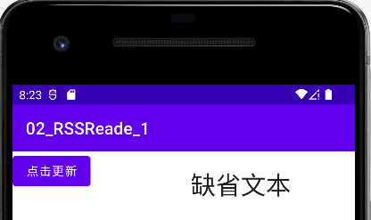
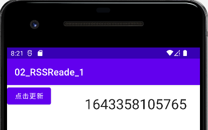
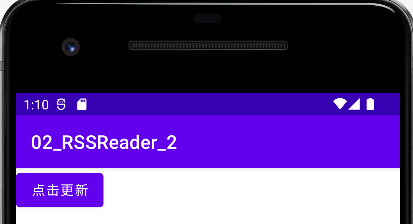
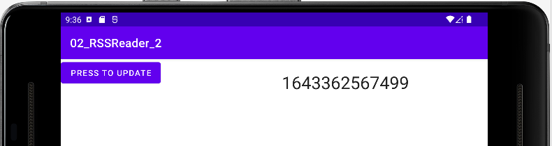
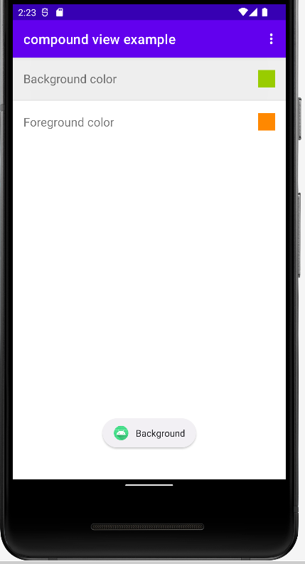
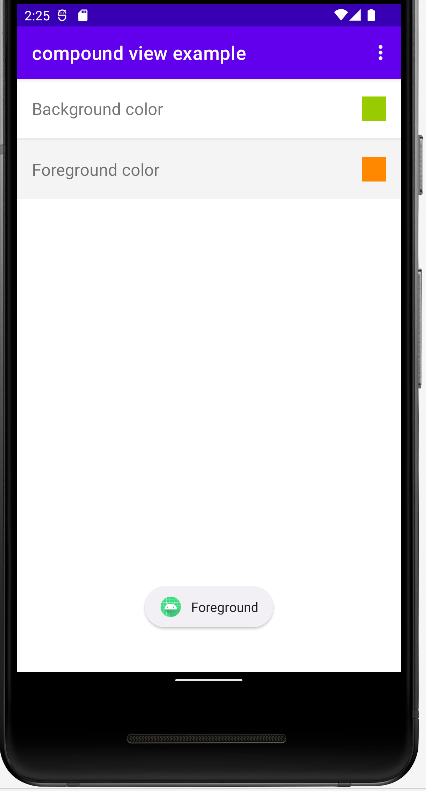
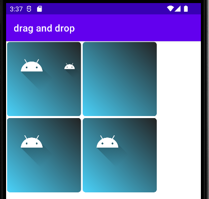
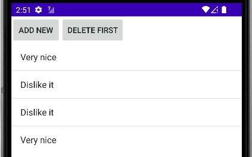
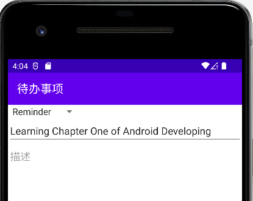

# 案例分析

> 版本说明（截至 2026 年）：本章案例按 AndroidX/Jetpack 实践进行整理。部分历史写法（如旧拖放接口、`ListActivity` 等）保留用于理解演进，并附带现代替代建议。

## 片段

### 练习1：使用片段

以下教程演示了如何在标准安卓应用程序中使用片段，基于 AndroidX Fragment 组件。应用程序根据纵向和横向模式使用不同数量的片段。在纵向模式下，主要活动显示一个片段，从这个片段用户可以导航到另一个包含另一个片段的活动；在横向模式下，主要活动并排显示两个片段。

#### 创建项目

使用以下数据创建一个新的安卓项目。

| 属性   | 值                         |
| ---- | ------------------------- |
| 项目名称 | 11\_RSSReader\_1          |
| 包名称  | com.example.ch11.rssreade |

表 11‑1

验证活动是否扩展Activity类，以确保没有使用向后兼容模式。如果扩展了另一个类，删除该项目并重新创建，确保在项目创建向导中取消选择“向后兼容性”标志。

#### 创建片段布局

在res/layout/文件夹中创建一个名为fragment\_rssitem\_detail.xml的新布局文件。

> \<?xml version="1.0" encoding="utf-8"?\>
> 
> \<LinearLayout
> xmlns:android="http://schemas.android.com/apk/res/android"
> 
> android:layout\_width="match\_parent"
> 
> android:layout\_height="match\_parent"
> 
> android:orientation="vertical" \>
> 
> \<TextView
> 
> android:id="@+id/detailsText"
> 
> android:layout\_width="wrap\_content"
> 
> android:layout\_height="match\_parent"
> 
> android:layout\_gravity="center\_horizontal|center\_vertical"
> 
> android:layout\_marginTop="20dip"
> 
> android:text="Default Text"
> 
> android:textAppearance="?android:attr/textAppearanceLarge"
> 
> android:textSize="30dip" /\>
> 
> \</LinearLayout\>

码 11‑1

id 必须正确，片段使用其来搜索TextView。创建一个名为fragment\_rsslist\_overview.xml的新布局文件。

> \<?xml version="1.0" encoding="utf-8"?\>
> 
> \<LinearLayout
> xmlns:android="http://schemas.android.com/apk/res/android"
> 
> android:layout\_width="match\_parent"
> 
> android:layout\_height="match\_parent"
> 
> android:orientation="vertical" \>
> 
> \<Button
> 
> android:id="@+id/updateButton"
> 
> android:layout\_width="wrap\_content"
> 
> android:layout\_height="wrap\_content"
> 
> android:text="Press to update"/\>
> 
> \</LinearLayout\>

码 11‑2

同样在这里，id 必须是正确的。

#### 创建片段类

创建以下用作片段的类，从开始DetailFragment。

> import androidx.fragment.app.Fragment;
> 
> import android.os.Bundle;
> 
> import android.view.LayoutInflater;
> 
> import android.view.View;
> 
> import android.view.ViewGroup;
> 
> import android.widget.TextView;
> 
> public class DetailFragment extends Fragment {
> 
> @Override
> 
> public View onCreateView(LayoutInflater inflater, ViewGroup container,
> 
> Bundle savedInstanceState) {
> 
> View view = inflater.inflate(R.layout.fragment\_rssitem\_detail,
> 
> container, false);
> 
> return view;
> 
> }
> 
> public void setText(String text) {
> 
> TextView view = (TextView) getView().findViewById(R.id.detailsText);
> 
> view.setText(text);
> 
> }
> 
> }

码 11‑3

创建MyListFragment类，尽管其名字不会显示项目列表，只有一个按钮，允许将当前时间发送到详细信息片段。

> import androidx.fragment.app.Fragment;
> 
> import android.content.Context;
> 
> import android.os.Bundle;
> 
> import android.view.LayoutInflater;
> 
> import android.view.View;
> 
> import android.view.ViewGroup;
> 
> import android.widget.Button;
> 
> public class MyListFragment extends Fragment {
> 
> private OnItemSelectedListener listener;
> 
> @Override
> 
> public View onCreateView(LayoutInflater inflater, ViewGroup container,
> 
> Bundle savedInstanceState) {
> 
> View view = inflater.inflate(R.layout.fragment\_rsslist\_overview,
> 
> container, false);
> 
> Button button = (Button) view.findViewById(R.id.updateButton);
> 
> button.setOnClickListener(new View.OnClickListener() {
> 
> @Override
> 
> public void onClick(View v) {
> 
> updateDetail();
> 
> }
> 
> });
> 
> return view;
> 
> }
> 
> public interface OnItemSelectedListener {
> 
> void onRssItemSelected(String text);
> 
> }
> 
> @Override
> 
> public void onAttach(Context context) {
> 
> super.onAttach(context);
> 
> if (context instanceof OnItemSelectedListener) {
> 
> listener = (OnItemSelectedListener) context;
> 
> } else {
> 
> throw new ClassCastException(context.toString()
> 
> \+ " must implement MyListFragment.OnItemSelectedListener");
> 
> }
> 
> }
> 
> // triggers update of the details fragment
> 
> public void updateDetail() {
> 
> // create fake data
> 
> String newTime = String.valueOf(System.currentTimeMillis());
> 
> // send data to activity
> 
> listener.onRssItemSelected(newTime);
> 
> }
> 
> }

码 11‑4

#### 更改主布局文件

更改现有的activity\_main.xml文件。

> \<?xml version="1.0" encoding="utf-8"?\>
> 
> \<LinearLayout
> xmlns:android="http://schemas.android.com/apk/res/android"
> 
> xmlns:tools="http://schemas.android.com/tools"
> 
> android:layout\_width="fill\_parent"
> 
> android:layout\_height="fill\_parent"
> 
> android:baselineAligned="false"
> 
> android:orientation="horizontal" \>
> 
> \<fragment
> 
> android:id="@+id/listFragment"
> 
> android:layout\_width="0dp"
> 
> android:layout\_weight="1"
> 
> android:layout\_height="match\_parent"
> 
> class="com.example.android.rssreader.MyListFragment"
> 
> tools:layout="@layout/fragment\_rsslist\_overview"\>
> 
> \</fragment\>
> 
> \<fragment
> 
> android:id="@+id/detailFragment"
> 
> android:layout\_width="0dp"
> 
> android:layout\_weight="2"
> 
> android:layout\_height="match\_parent"
> 
> class="com.example.android.rssreader.DetailFragment"
> 
> tools:layout="@layout/fragment\_rssitem\_detail"\>
> 
> \</fragment\>
> 
> \</LinearLayout\>

码 11‑5

tools: 标签是可选的，指向一个布局，以便 Android Studio 中的预览可以显示片段。

#### 主活动

更改MainActivity类，使其可以作为列表片段的回调并更新详细片段。

> import android.os.Bundle;
> 
> import androidx.appcompat.app.AppCompatActivity;
> 
> public class MainActivity extends AppCompatActivity implements
> MyListFragment.OnItemSelectedListener {
> 
> @Override
> 
> protected void onCreate(Bundle savedInstanceState) {
> 
> super.onCreate(savedInstanceState);
> 
> setContentView(R.layout.activity\_main);
> 
> }
> 
> @Override
> 
> public void onRssItemSelected(String text) {
> 
> DetailFragment fragment = (DetailFragment) getSupportFragmentManager()
> 
> .findFragmentById(R.id.detailFragment);
> 
> fragment.setText(text);
> 
> }
> 
> }

码 11‑6

#### 验证结果

启动应用程序，两个片段都应该以横向和纵向模式显示，可以使用模拟器控件来更改模拟器的方向。如果按下“点击更新”按钮，则会ListFragment更新DetailFragment。

<table>
<tbody>
<tr class="odd">
<td>

图 11‑1
</td>
<td>

图 11‑2
</td>
</tr>
</tbody>
</table>

### 练习2：片段取决于配置

如果以横向模式启动，MainActivity应该显示两个片段，如果以纵向模式启动则只应显示一个片段，在本练习中将调整应用程序以支持这一点。

#### 创建项目

使用以下数据创建一个新的安卓项目。

| 属性           | 值                         |
| ------------ | ------------------------- |
| Name         | 11\_RSSReader\_2          |
| Package name | com.example.ch02.rssreade |

表 11‑2

验证活动是否扩展Activity，以确保没有使用向后兼容模式。如果扩展了另一个类，删除该项目并重新创建，确保在项目创建向导中取消选择“向后兼容性”标志。

#### 为纵向模式创建活动布局

位于res/layout-port文件夹中创建布局文件activity\_main.xml。

> \<?xml version="1.0" encoding="utf-8"?\>
> 
> \<LinearLayout
> xmlns:android="http://schemas.android.com/apk/res/android"
> 
> xmlns:tools="http://schemas.android.com/tools"
> 
> android:layout\_width="match\_parent"
> 
> android:layout\_height="match\_parent"
> 
> tools:context=".RssfeedActivity"
> 
> android:orientation="vertical"\>
> 
> \<FrameLayout
> 
> android:id="@+id/fragment\_container"
> 
> android:layout\_width="match\_parent"
> 
> android:layout\_height="match\_parent"
> 
> android:orientation="horizontal"/\>
> 
> \</LinearLayout\>

码 11‑7

#### 定义一个依赖于资源选择器的布尔标志

使用以下设置在res/values文件夹中创建一个名为config.xml的文件。

> \<?xml version="1.0" encoding="utf-8"?\>
> 
> \<resources\>
> 
> \<bool name="twoPaneMode"\>true\</bool\>
> 
> \</resources\>

码 11‑8

为具有不同值的横向配置创建相同的文件，该文件位于res/values-port文件夹中。

> \<?xml version="1.0" encoding="utf-8"?\>
> 
> \<resources\>
> 
> \<bool name="twoPaneMode"\>false\</bool\>
> 
> \</resources\>

码 11‑9

#### 调整DetailFragment

调整DetailFragment类为以下内容：

> import android.os.Bundle;
> 
> import android.view.LayoutInflater;
> 
> import android.view.View;
> 
> import android.view.ViewGroup;
> 
> import android.widget.TextView;
> 
> import androidx.fragment.app.Fragment;
> 
> public class DetailFragment extends Fragment {
> 
> public static final String EXTRA\_TEXT = "text";
> 
> @Override
> 
> public View onCreateView(LayoutInflater inflater, ViewGroup container,
> 
> Bundle savedInstanceState) {
> 
> View view = inflater.inflate(R.layout.fragment\_rssitem\_detail,
> 
> container, false);
> 
> return view;
> 
> }
> 
> @Override
> 
> public void onActivityCreated(Bundle savedInstanceState) {
> 
> super.onActivityCreated(savedInstanceState);
> 
> Bundle bundle = getArguments();
> 
> if (bundle \!= null) {
> 
> String text = bundle.getString(EXTRA\_TEXT);
> 
> setText(text);
> 
> }
> 
> }
> 
> public void setText(String text) {
> 
> TextView view = (TextView) getView().findViewById(R.id.detailsText);
> 
> view.setText(text);
> 
> }
> 
> }

码 11‑10

#### 调整主活动

MainActivity如果处于单窗格模式，调整类以替换现有片段。

> import android.os.Bundle;
> 
> import androidx.appcompat.app.AppCompatActivity;
> 
> import androidx.fragment.app.Fragment;
> 
> import androidx.fragment.app.FragmentTransaction;
> 
> public class MainActivity extends AppCompatActivity implements
> 
> MyListFragment.OnItemSelectedListener {
> 
> @Override
> 
> protected void onCreate(Bundle savedInstanceState) {
> 
> super.onCreate(savedInstanceState);
> 
> setContentView(R.layout.activity\_main);
> 
> if (getResources().getBoolean(R.bool.twoPaneMode)) {
> 
> // all good, we use the fragments defined in the layout
> 
> return;
> 
> }
> 
> // if savedInstanceState is null we do some cleanup
> 
> if (savedInstanceState \!= null) {
> 
> // cleanup any existing fragments in case we are in detailed mode
> 
> getFragmentManager().executePendingTransactions();
> 
> Fragment fragmentById = getSupportFragmentManager().
> 
> findFragmentById(R.id.fragment\_container);
> 
> if (fragmentById \!= null) {
> 
> getSupportFragmentManager().beginTransaction()
> 
> .remove(fragmentById).commit();
> 
> }
> 
> }
> 
> MyListFragment listFragment = new MyListFragment();
> 
> getSupportFragmentManager().beginTransaction()
> 
> .replace(R.id.fragment\_container, listFragment).commit();
> 
> }
> 
> @Override
> 
> public void onRssItemSelected(String text) {
> 
> if (getResources().getBoolean(R.bool.twoPaneMode)) {
> 
> DetailFragment fragment = (DetailFragment) getSupportFragmentManager()
> 
> .findFragmentById(R.id.detailFragment);
> 
> fragment.setText(text);
> 
> } else {
> 
> // replace the fragment
> 
> // Create fragment and give it an argument for the selected article
> 
> DetailFragment newFragment = new DetailFragment();
> 
> Bundle args = new Bundle();
> 
> args.putString(DetailFragment.EXTRA\_TEXT, text);
> 
> newFragment.setArguments(args);
> 
> FragmentTransaction transaction =
> getSupportFragmentManager().beginTransaction();
> 
> // Replace whatever is in the fragment\_container view with this
> fragment,
> 
> // and add the transaction to the back stack so the user can navigate
> back
> 
> transaction.replace(R.id.fragment\_container, newFragment);
> 
> transaction.addToBackStack(null);
> 
> // Commit the transaction
> 
> transaction.commit();
> 
> }
> 
> }
> 
> }

码 11‑11

这种清理是必要的，因为使用两个片段和一个片段之间的动态切换。这是一个不寻常的场景，通常选择一个或两个片段是基于设备的最小宽度，并且在运行时不会改变，缓存片段以优化性能，因此需要FragmentManager确保删除现有的详细片段。

#### 验证结果

测试应用程序，如果以纵向模式运行应用程序，应该只会看到一个片段（如图 11‑3和图 11‑4），在水平模式下会看到两个片段（如图 11‑5）。

<table>
<tbody>
<tr class="odd">
<td>

图 11‑3
</td>
<td>

图 11‑4
</td>
<td>

图 11‑5
</td>
</tr>
</tbody>
</table>

切换模拟器的方向，在纵向和横向模式下按下按钮，并验证详细活动是否显示当前时间。

### 练习3：使用无头保留片段来存储状态

在本练习中，希望记住用户的最后选择，为此使用无头片段。

#### 创建项目

使用以下数据创建一个新的安卓项目。

| 属性           | 值                         |
| ------------ | ------------------------- |
| Name         | 11\_RSSReader\_3          |
| Package name | com.example.ch02.rssreade |

表 11‑3

#### 创建无头片段

创建一个名为SelectionStateFragment。

> import android.os.Bundle;
> 
> import android.view.LayoutInflater;
> 
> import android.view.View;
> 
> import android.view.ViewGroup;
> 
> import androidx.fragment.app.Fragment;
> 
> public class SelectionStateFragment extends Fragment {
> 
> public String lastSelection = "";
> 
> @Override
> 
> public View onCreateView(LayoutInflater inflater, ViewGroup container,
> Bundle savedInstanceState) {
> 
> return null;
> 
> }
> 
> @Override
> 
> public void onCreate(Bundle savedInstanceState) {
> 
> super.onCreate(savedInstanceState);
> 
> setRetainInstance(true);
> 
> }
> 
> }

码 11‑12

#### 存储最后选择的值

调整MainActivity为以下。

> import android.os.Bundle;
> 
> import androidx.appcompat.app.AppCompatActivity;
> 
> import androidx.fragment.app.Fragment;
> 
> import androidx.fragment.app.FragmentTransaction;
> 
> public class MainActivity extends AppCompatActivity implements
> 
> MyListFragment.OnItemSelectedListener {
> 
> SelectionStateFragment stateFragment;
> 
> @Override
> 
> protected void onCreate(Bundle savedInstanceState) {
> 
> super.onCreate(savedInstanceState);
> 
> setContentView(R.layout.activity\_main);
> 
> stateFragment =
> 
> (SelectionStateFragment) getSupportFragmentManager()
> 
> .findFragmentByTag("headless");
> 
> if (stateFragment == null) {
> 
> stateFragment = new SelectionStateFragment();
> 
> getSupportFragmentManager().beginTransaction()
> 
> .add(stateFragment, "headless").commit();
> 
> }
> 
> if (getResources().getBoolean(R.bool.twoPaneMode)) {
> 
> // restore state
> 
> if (stateFragment.lastSelection.length() \> 0) {
> 
> onRssItemSelected(stateFragment.lastSelection);
> 
> }
> 
> // otherwise all is good, we use the fragments defined in the layout
> 
> return;
> 
> }
> 
> // if savedInstanceState is null we do some cleanup
> 
> if (savedInstanceState \!= null) {
> 
> // cleanup any existing fragments in case we are in detailed mode
> 
> getSupportFragmentManager().executePendingTransactions();
> 
> Fragment fragmentById = getSupportFragmentManager().
> 
> findFragmentById(R.id.fragment\_container);
> 
> if (fragmentById \!= null) {
> 
> getSupportFragmentManager().beginTransaction()
> 
> .remove(fragmentById).commit();
> 
> }
> 
> }
> 
> MyListFragment listFragment = new MyListFragment();
> 
> getSupportFragmentManager().beginTransaction()
> 
> .replace(R.id.fragment\_container, listFragment).commit();
> 
> }
> 
> @Override
> 
> public void onRssItemSelected(String text) {
> 
> stateFragment.lastSelection = text;
> 
> if (getResources().getBoolean(R.bool.twoPaneMode)) {
> 
> DetailFragment fragment = (DetailFragment) getSupportFragmentManager()
> 
> .findFragmentById(R.id.detailFragment);
> 
> fragment.setText(text);
> 
> } else {
> 
> // replace the fragment
> 
> // Create fragment and give it an argument for the selected article
> 
> DetailFragment newFragment = new DetailFragment();
> 
> Bundle args = new Bundle();
> 
> args.putString(DetailFragment.EXTRA\_TEXT, text);
> 
> newFragment.setArguments(args);
> 
> FragmentTransaction transaction =
> getSupportFragmentManager().beginTransaction();
> 
> // Replace whatever is in the fragment\_container view with this
> fragment,
> 
> // and add the transaction to the back stack so the user can navigate
> back
> 
> transaction.replace(R.id.fragment\_container, newFragment);
> 
> transaction.addToBackStack(null);
> 
> // Commit the transaction
> 
> transaction.commit();
> 
> }
> 
> }
> 
> }

码 11‑13

#### 验证结果

测试应用程序，在水平模式下按下按钮并验证详细活动是否显示值，切换模拟器的方向两次并验证活动是否仍然显示相同的值。

### 练习4：使用动画进行片段过渡

可以定义用于片段过渡的动画，在本练习中将定义自定义动画并将其用于此目的。

#### 实现动画

在应用程序的res/animator文件夹中创建两个资源，应该调用第一个slide\_down.xml，如下所示：

> \<?xml version="1.0" encoding="utf-8"?\>
> 
> \<objectAnimator
> 
> xmlns:android="http://schemas.android.com/apk/res/android"
> 
> android:interpolator="@android:anim/accelerate\_decelerate\_interpolator"
> 
> android:propertyName="translationY"
> 
> android:valueType="floatType"
> 
> android:valueFrom="0"
> 
> android:valueTo="1280"
> 
> android:duration="@android:integer/config\_mediumAnimTime"/\>

码 11‑14

应该调用第二个slide\_up.xml，如下所示：

> \<?xml version="1.0" encoding="utf-8"?\>
> 
> \<objectAnimator
> 
> xmlns:android="http://schemas.android.com/apk/res/android"
> 
> android:interpolator="@android:anim/accelerate\_decelerate\_interpolator"
> 
> android:propertyName="translationY"
> 
> android:valueType="floatType"
> 
> android:valueFrom="1280"
> 
> android:valueTo="0"
> 
> android:duration="@android:integer/config\_mediumAnimTime"/\>

码 11‑15

replace在操作片段事务之前启用这些动画。

> FragmentTransaction transaction =
> getSupportFragmentManager().beginTransaction();
> 
> transaction.setCustomAnimations(R.animator.slide\_up,
> R.animator.slide\_down);
> 
> transaction.replace(R.id.fragment\_container, newFragment);
> 
> transaction.addToBackStack(null);
> 
> // Commit the transaction
> 
> transaction.commit();

码 11‑16

#### 验证结果

启动应用程序并确认片段转换正在使用动画。

## 自定义视图

安卓框架提供了几个默认视图。视图的基类是View，视图负责测量、布局和绘制自身及其子元素。视图还负责保存其界面状态和处理触摸事件。开发人员还可以创建自定义视图并在他们的应用程序中使用，可以通过以下方式创建自定义视图：

  - 复合视图：通过默认接线将视图组合

  - 自定义视图：创建自己的视图
    
      - 通过扩展现有视图，例如Button
    
      - 通过扩展View类

下图显示了安卓的默认视图层次结构：

图 11‑6 默认视图层次结构

通常创建视图是为了提供默认视图无法提供的用户界面体验，使用自定义视图允许开发人员进行某些性能优化，即在自定义布局的情况下，开发人员可以针对其用例优化布局管理器。

一旦活动获得焦点，其须将其布局层次结构的根节点提供给安卓系统，之后安卓系统启动绘图程序。绘图从布局的根节点开始，布局层次结构是按照声明顺序遍历的，即先绘制父级，再绘制子级，子级按声明顺序绘制。绘制布局是一个两遍过程，而两个过程总是一起发生：

  - 测量过程

在measure(int, int)\`方法中实现，发生在视图层次结构的自上而下遍历。每个视图都存储其测量值。

  - 布局传递

在layout(int, int, int,
int)方法中实现，也是视图层次结构自上而下的遍历。在此阶段，每个布局管理器负责定位其所有子级，其使用在测量过程中计算的尺寸。

布局管理器可以多次运行测量过程，例如LinearLayout支持在视图之间分配剩余空白空间的权重属性，并RelativeLayout多次测量子视图以解决布局文件中给定的约束。视图或活动可以通过调用requestLayout()方法来触发测量和布局传递。在测量和布局计算之后视图会自行绘制，可以使用View类中的
invalidate() 方法触发此操作。

自定义和复合视图可用于布局文件，为此需要在布局文件中使用全限定名，例如使用包名和类名：

> \<?xml version="1.0" encoding="utf-8"?\>
> 
> \<LinearLayout
> xmlns:android="http://schemas.android.com/apk/res/android"
> 
> android:layout\_width="match\_parent"
> 
> android:layout\_height="match\_parent"
> 
> android:orientation="vertical" \>
> 
> \<Button
> 
> android:id="@+id/button1"
> 
> android:layout\_width="wrap\_content"
> 
> android:layout\_height="wrap\_content"
> 
> android:text="Button" /\>
> 
> \< com.example.ch11.ownview.MyDrawView
> 
> android:id="@+id/myDrawView1"
> 
> android:layout\_width="wrap\_content"
> 
> android:layout\_height="wrap\_content" /\>
> 
> \</LinearLayout\>

码 11‑17

复合视图（也称为复合组件）是ViewGroup基于现有视图和一些预定义的视图交互预先配置的。组合视图还允许添加自定义 API
来更新和查询组合视图的状态。对于这样的控件，定义一个布局文件并将其分配给复合视图。在复合视图的实现中，可以预定义视图交互，将定义一个布局文件并扩展相应的
ViewGroup 类。在这个类中，膨胀布局文件并实现 View 连接逻辑。

出于性能原因，可能希望将组合视图重写为扩展的自定义视图，这通常可以使视图层次结构变平。在这种情况下，绘制视图需要更少的遍历，如果正确实施这可以显着加快。

通过扩展View类或其子类之一可以创建自定义视图。对于绘画视图使用onDraw() 方法，在此方法中会收到一个 Canvas
对象，该对象允许对其执行绘图操作，例如绘制线条、圆形、文本或位图。如果应该重新绘制视图，则调用
invalidate()方法触发对该视图方法onDraw()调用，要绘制 View的图形，通常使用 2D Canvas API。

布局管理器调用视图的onMeasure()方法，视图从布局管理器接收布局参数，布局管理器负责确定其所有子项的大小，视图必须调用方法
setMeasuredDimenstion(int, int) 。可以通过扩展 ViewGroup
类来实现自定义布局管理器，这允许实现更高效的布局管理器或实现安卓平台中当前缺少的效果。自定义布局管理器可以覆盖
onMeasure()和onLayout()方法并专门计算其子项，例如可以省略LinearLayout
中的耗时支持layout\_weight。将任何其他布局参数存储在 ViewGroup
实现的内部类中是一种很好的做法，例如ViewGroup.LayoutParams
实现布局的参数，LinearLayout.LayoutParams实现特定于LinearLayout的附加参数，例如layout\_weight参数。

安卓视图的生命周期与窗口相关的生命周期事件，如果视图附加到窗口的布局层次结构则显示视图，一个视图有几个生命周期回调函数。

  - onAttachedToWindow()

一旦窗口可用，就会调用。

  - onDetachedFromWindow()

当视图从其父视图中移除时使用，并且如果父视图附加到窗口，如果活动被回收（例如通过finished()方法调用）或视图被回收，就会发生这种情况。

  - onDetachedFromWindow()

该方法可用于停止动画并清理视图使用的资源。

遍历生命周期事件包括Animate、Measure、Layout和Draw。

图 11‑7 视图的生命周期

所有视图都必须知道如何测量和布局自己，requestLayout()方法调用告诉视图自己测量和布局，由于此操作可能会影响调用的其他视图的布局，因此requestLayout()也影响其父视图的布局。这个递归调用是不应该把布局嵌套到很深的原因，如果重新计算大量层次结构，测量和布局操作可能会很耗时。onMeasure()方法确定视图及其子项的大小，必须在返回之前通过setMeasuredDimension()方法设置维度。根据调用onLayout()方法的结果定位视图，onMeasure()此调用通常发生一次，而onMeasure()可能发生多次。视图无权访问活动的生命周期事件，如果视图想要了解这些事件，应该在视图中创建一个接口，可以在活动的生命周期方法中调用该接口。

为自定义视图定义附加属性，可以为复合视图或自定义视图定义附加属性。要定义其他属性，在res/values文件夹中创建attrs.xml文件，下面显示了为名为ColorOptionsView新视图定义的属性示例。

> \<?xml version="1.0" encoding="utf-8"?\>
> 
> \<resources\>
> 
> \<declare-styleable name="ColorOptionsView"\>
> 
> \<attr name="titleText" format="string" localization="suggested" /\>
> 
> \<attr name="valueColor" format="color" /\>
> 
> \</declare-styleable\>
> 
> \</resources\>

码 11‑18

要在布局文件中使用这些属性，必须在 XML
标头中声明它们。在下面的清单中，这是通过xmlns:custom部分代码完成的，这些属性也分配给视图。

> \<LinearLayout
> xmlns:android="http://schemas.android.com/apk/res/android"
> 
> xmlns:custom="http://schemas.android.com/apk/res-auto"
> 
> android:layout\_width="match\_parent"
> 
> android:layout\_height="match\_parent"
> 
> android:orientation="vertical"\>
> 
> \<\!-- Assume that this is your new component. It uses your new
> attributes --\>
> 
> \<com.example.ch11.compoundview.ColorOptionsView
> 
> android:layout\_width="match\_parent"
> 
> android:layout\_height="?android:attr/listPreferredItemHeight"
> 
> custom:titleText="Background color"
> 
> custom:valueColor="@android:color/holo\_green\_light" /\>
> 
> \</LinearLayout\>

码 11‑19

以下示例显示了组件如何访问这些属性。

> import android.annotation.SuppressLint;
> 
> import android.content.Context;
> 
> import android.content.res.TypedArray;
> 
> import android.util.AttributeSet;
> 
> import android.view.View;
> 
> import android.widget.ImageView;
> 
> public class ColorOptionsView extends View {
> 
> private View mValue;
> 
> private ImageView mImage;
> 
> public ColorOptionsView(Context context, AttributeSet attrs) {
> 
> super(context, attrs);
> 
> TypedArray a = context.obtainStyledAttributes(attrs,
> 
> R.styleable.ColorOptionsView, 0, 0);
> 
> String titleText =
> a.getString(R.styleable.ColorOptionsView\_titleText);
> 
> @SuppressLint("ResourceAsColor") int valueColor =
> a.getColor(R.styleable.ColorOptionsView\_valueColor,
> 
> android.R.color.holo\_blue\_light);
> 
> a.recycle();
> 
> // more stuff
> 
> }
> 
> }

码 11‑20

### 练习1：创建复合视图

#### 创建项目

使用以下数据创建一个新的安卓项目。

| 属性   | 值                             |
| ---- | ----------------------------- |
| 项目名称 | compound view example         |
| 包名称  | com.example.ch11.compoundview |

表 11‑4

#### 定义和使用附加属性

在res/values文件夹中创建以下名为attrs.xml的属性文件。

> \<?xml version="1.0" encoding="utf-8"?\>
> 
> \<resources\>
> 
> \<declare-styleable name="Options"\>
> 
> \<attr name="titleText" format="string" localization="suggested" /\>
> 
> \<attr name="valueColor" format="color" /\>
> 
> \</declare-styleable\>
> 
> \</resources\>

码 11‑21

将活动使用的布局文件更改为以下内容。

> \<LinearLayout
> xmlns:android="http://schemas.android.com/apk/res/android"
> 
> xmlns:tools="http://schemas.android.com/tools"
> 
> xmlns:custom="http://schemas.android.com/apk/res-auto"
> 
> android:layout\_width="match\_parent"
> 
> android:layout\_height="match\_parent"
> 
> android:divider="?android:attr/listDivider"
> 
> android:orientation="vertical"
> 
> android:showDividers="middle"
> 
> tools:context=".MainActivity" \>
> 
> \<com.example.ch11.compoundview.ColorOptionsView
> 
> android:id="@+id/view1"
> 
> android:layout\_width="match\_parent"
> 
> android:layout\_height="?android:attr/listPreferredItemHeight"
> 
> android:background="?android:selectableItemBackground"
> 
> android:onClick="onClicked"
> 
> custom:titleText="Background color"
> 
> custom:valueColor="@android:color/holo\_green\_light" /\>
> 
> \<com.example.ch11.compoundview.ColorOptionsView
> 
> android:id="@+id/view2"
> 
> android:layout\_width="match\_parent"
> 
> android:layout\_height="?android:attr/listPreferredItemHeight"
> 
> android:background="?android:selectableItemBackground"
> 
> android:onClick="onClicked"
> 
> custom:titleText="Foreground color"
> 
> custom:valueColor="@android:color/holo\_orange\_dark" /\>
> 
> \</LinearLayout\>

码 11‑22

#### 创建复合视图

为复合视图创建以下名为view\_color\_options.xml的布局文件。

> \<?xml version="1.0" encoding="utf-8"?\>
> 
> \<merge xmlns:android="http://schemas.android.com/apk/res/android" \>
> 
> \<TextView
> 
> android:layout\_width="0dp"
> 
> android:layout\_height="wrap\_content"
> 
> android:layout\_weight="1"
> 
> android:layout\_centerVertical="true"
> 
> android:layout\_marginLeft="16dp"
> 
> android:textSize="18sp"
> 
> /\>
> 
> \<View
> 
> android:layout\_width="26dp"
> 
> android:layout\_height="26dp"
> 
> android:layout\_centerVertical="true"
> 
> android:layout\_marginLeft="16dp"
> 
> android:layout\_marginRight="16dp"
> 
> /\>
> 
> \<ImageView
> 
> android:layout\_width="wrap\_content"
> 
> android:layout\_height="wrap\_content"
> 
> android:layout\_marginRight="16dp"
> 
> android:layout\_centerVertical="true"
> 
> android:visibility="gone"
> 
> /\>
> 
> \</merge\>

码 11‑23

创建复合视图：

> import android.content.Context;
> 
> import android.content.res.TypedArray;
> 
> import android.util.AttributeSet;
> 
> import android.view.Gravity;
> 
> import android.view.LayoutInflater;
> 
> import android.view.View;
> 
> import android.widget.ImageView;
> 
> import android.widget.LinearLayout;
> 
> import android.widget.TextView;
> 
> public class ColorOptionsView extends LinearLayout {
> 
> private View mValue;
> 
> private ImageView mImage;
> 
> public ColorOptionsView(Context context, AttributeSet attrs) {
> 
> super(context, attrs);
> 
> TypedArray a = context.obtainStyledAttributes(attrs,
> 
> R.styleable.Options, 0, 0);
> 
> String titleText = a.getString(R.styleable.Options\_titleText);
> 
> @SuppressWarnings("ResourceAsColor")
> 
> int valueColor = a.getColor(R.styleable.Options\_valueColor,
> 
> android.R.color.holo\_blue\_light);
> 
> a.recycle();
> 
> setOrientation(LinearLayout.HORIZONTAL);
> 
> setGravity(Gravity.CENTER\_VERTICAL);
> 
> LayoutInflater inflater = (LayoutInflater) context
> 
> .getSystemService(Context.LAYOUT\_INFLATER\_SERVICE);
> 
> inflater.inflate(R.layout.view\_color\_options, this, true);
> 
> TextView title = (TextView) getChildAt(0);
> 
> title.setText(titleText);
> 
> mValue = getChildAt(1);
> 
> mValue.setBackgroundColor(valueColor);
> 
> mImage = (ImageView) getChildAt(2);
> 
> }
> 
> public ColorOptionsView(Context context) {
> 
> this(context, null);
> 
> }
> 
> public void setValueColor(int color) {
> 
> mValue.setBackgroundColor(color);
> 
> }
> 
> public void setImageVisible(boolean visible) {
> 
> mImage.setVisibility(visible ? View.VISIBLE : View.GONE);
> 
> }
> 
> }

码 11‑24

#### 调整活动

将活动更改为以下代码并运行应用程序：

> import android.os.Bundle;
> 
> import android.view.Menu;
> 
> import android.view.View;
> 
> import android.widget.Toast;
> 
> import androidx.appcompat.app.AppCompatActivity;
> 
> public class MainActivity extends AppCompatActivity {
> 
> @Override
> 
> protected void onCreate(Bundle savedInstanceState) {
> 
> super.onCreate(savedInstanceState);
> 
> setContentView(R.layout.activity\_main);
> 
> }
> 
> @Override
> 
> public boolean onCreateOptionsMenu(Menu menu) {
> 
> // Inflate the menu; this adds items to the action bar if it is
> present.
> 
> getMenuInflater().inflate(R.menu.activity\_main, menu);
> 
> return true;
> 
> }
> 
> public void onClicked(View view) {
> 
> String text = view.getId() == R.id.view1 ? "Background" :
> "Foreground";
> 
> Toast.makeText(this, text, Toast.LENGTH\_SHORT).show();
> 
> }
> 
> }

码 11‑25

正在运行的应用程序应类似于以下屏幕截图：

<table>
<tbody>
<tr class="odd">
<td>

图 11‑8 点击Background color
</td>
<td>

图 11‑9点击Foreground color
</td>
</tr>
</tbody>
</table>

## 拖放操作

从 Android 4.0 开始，支持将视图拖放到其他视图或视图组上。要使用拖动视图，可以在拖动的视图上注册OnTouchListener 或
LongClickListener。在现代版本中优先使用 `startDragAndDrop()`（Android 7.0+），旧项目兼容场景可使用 `startDrag()`。还可以将DragShadowBuilder对象传递给拖动方法，此对象指定用于拖动操作的图片，例如可以直接传入视图，在拖动操作期间显示视图的图像，以下示例演示了在触摸侦听器中设置此拖动操作。

> // Assign the touch listener to your view which you want to move
> 
> findViewById(R.id.myimage1).setOnTouchListener(new MyTouchListener());
> 
> // This defines your touch listener
> 
> private final class MyTouchListener implements OnTouchListener {
> 
> public boolean onTouch(View view, MotionEvent motionEvent) {
> 
> if (motionEvent.getAction() == MotionEvent.ACTION\_DOWN) {
> 
> ClipData data = ClipData.newPlainText("", "");
> 
> DragShadowBuilder shadowBuilder = new View.DragShadowBuilder(
> 
> view);
> 
> view.startDragAndDrop(data, shadowBuilder, view, 0);
> 
> view.setVisibility(View.INVISIBLE);
> 
> return true;
> 
> } else {
> 
> return false;
> 
> }
> 
> }
> 
> }

码 11‑26

可以作为放置目标的视图会获得一个已分配的OnDragListener实例，在此拖放侦听器中会收到回调，作为预定义的拖放相关事件。

  - DragEvent.ACTION\_DRAG\_STARTED

  - DragEvent.ACTION\_DRAG\_ENTERED

  - DragEvent.ACTION\_DRAG\_EXITED

  - DragEvent.ACTION\_DROP

  - DragEvent.ACTION\_DRAG\_ENDED

带有OnDragListener的视图用作拖放区，通过 setOnDragListener()方法得到OnDragListener对象。

> findViewById(R.id.bottomright).setOnDragListener(new
> MyDragListener());
> 
> class MyDragListener implements OnDragListener {
> 
> Drawable enterShape = getResources().getDrawable(
> 
> R.drawable.shape\_droptarget);
> 
> Drawable normalShape = getResources().getDrawable(R.drawable.shape);
> 
> @Override
> 
> public boolean onDrag(View v, DragEvent event) {
> 
> int action = event.getAction();
> 
> switch (event.getAction()) {
> 
> case DragEvent.ACTION\_DRAG\_STARTED:
> 
> // do nothing
> 
> break;
> 
> case DragEvent.ACTION\_DRAG\_ENTERED:
> 
> v.setBackground(enterShape);
> 
> break;
> 
> case DragEvent.ACTION\_DRAG\_EXITED:
> 
> v.setBackground(normalShape);
> 
> break;
> 
> case DragEvent.ACTION\_DROP:
> 
> // Dropped, reassign View to ViewGroup
> 
> View view = (View) event.getLocalState();
> 
> ViewGroup owner = (ViewGroup) view.getParent();
> 
> owner.removeView(view);
> 
> LinearLayout container = (LinearLayout) v;
> 
> container.addView(view);
> 
> view.setVisibility(View.VISIBLE);
> 
> break;
> 
> case DragEvent.ACTION\_DRAG\_ENDED:
> 
> v.setBackground(normalShape);
> 
> default:
> 
> break;
> 
> }
> 
> return true;
> 
> }
> 
> }

码 11‑27

### 练习1：拖放

在本练习中将创建几个允许在其之间拖动视图的视图组。

#### 创建项目

使用以下数据创建一个新的安卓项目。

| 属性   | 值                            |
| ---- | ---------------------------- |
| 项目名称 | drag and drop                |
| 包名称  | com.example.ch11.draganddrop |

表 11‑5

#### 创建 XML Drawable

在本练习中，将使用XML可绘制对象。在这一部分中，将在 res/drawable 文件夹中创建几个 XML 可绘制对象，在此文件夹中创建以下
shape.xml 文件。

> \<?xml version="1.0" encoding="UTF-8"?\>
> 
> \<shape xmlns:android="http://schemas.android.com/apk/res/android"
> 
> android:shape="rectangle" \>
> 
> \<stroke
> 
> android:width="2dp"
> 
> android:color="\#FFFFFFFF" /\>
> 
> \<gradient
> 
> android:angle="225"
> 
> android:endColor="\#DD2ECCFA"
> 
> android:startColor="\#DD000000" /\>
> 
> \<corners
> 
> android:bottomLeftRadius="7dp"
> 
> android:bottomRightRadius="7dp"
> 
> android:topLeftRadius="7dp"
> 
> android:topRightRadius="7dp" /\>
> 
> \</shape\>

码 11‑28

同时创建以下 shape\_droptarget.xml 文件。

> \<?xml version="1.0" encoding="UTF-8"?\>
> 
> \<shape xmlns:android="http://schemas.android.com/apk/res/android"
> 
> android:shape="rectangle" \>
> 
> \<stroke
> 
> android:width="2dp"
> 
> android:color="\#FFFF0000" /\>
> 
> \<gradient
> 
> android:angle="225"
> 
> android:endColor="\#DD2ECCFA"
> 
> android:startColor="\#DD000000" /\>
> 
> \<corners
> 
> android:bottomLeftRadius="7dp"
> 
> android:bottomRightRadius="7dp"
> 
> android:topLeftRadius="7dp"
> 
> android:topRightRadius="7dp" /\>
> 
> \</shape\>

码 11‑29

#### 活动和布局

将活动的布局更改为以下代码：

> \<?xml version="1.0" encoding="utf-8"?\>
> 
> \<GridLayout
> xmlns:android="http://schemas.android.com/apk/res/android"
> 
> android:layout\_width="match\_parent"
> 
> android:layout\_height="match\_parent"
> 
> android:columnCount="2"
> 
> android:columnWidth="320dp"
> 
> android:orientation="vertical"
> 
> android:rowCount="2"
> 
> android:stretchMode="columnWidth" \>
> 
> \<LinearLayout
> 
> android:id="@+id/topleft"
> 
> android:layout\_width="160dp"
> 
> android:layout\_height="160dp"
> 
> android:layout\_row="0"
> 
> android:background="@drawable/shape" \>
> 
> \<ImageView
> 
> android:id="@+id/myimage1"
> 
> android:layout\_width="wrap\_content"
> 
> android:layout\_height="wrap\_content"
> 
> android:src="@drawable/ic\_launcher\_foreground" /\>
> 
> \</LinearLayout\>
> 
> \<LinearLayout
> 
> android:id="@+id/topright"
> 
> android:layout\_width="160dp"
> 
> android:layout\_height="160dp"
> 
> android:background="@drawable/shape" \>
> 
> \<ImageView
> 
> android:id="@+id/myimage2"
> 
> android:layout\_width="wrap\_content"
> 
> android:layout\_height="wrap\_content"
> 
> android:src="@drawable/ic\_launcher\_foreground" /\>
> 
> \</LinearLayout\>
> 
> \<LinearLayout
> 
> android:id="@+id/bottomleft"
> 
> android:layout\_width="160dp"
> 
> android:layout\_height="160dp"
> 
> android:background="@drawable/shape" \>
> 
> \<ImageView
> 
> android:id="@+id/myimage3"
> 
> android:layout\_width="wrap\_content"
> 
> android:layout\_height="wrap\_content"
> 
> android:src="@drawable/ic\_launcher\_foreground" /\>
> 
> \</LinearLayout\>
> 
> \<LinearLayout
> 
> android:id="@+id/bottomright"
> 
> android:layout\_width="160dp"
> 
> android:layout\_height="160dp"
> 
> android:background="@drawable/shape" \>
> 
> \<ImageView
> 
> android:id="@+id/myimage4"
> 
> android:layout\_width="wrap\_content"
> 
> android:layout\_height="wrap\_content"
> 
> android:src="@drawable/ic\_launcher\_foreground" /\>
> 
> \</LinearLayout\>
> 
> \</GridLayout\>

码 11‑30

将活动类更改为以下代码。

> import android.content.ClipData;
> 
> import android.os.Bundle;
> 
> import android.view.DragEvent;
> 
> import android.view.MotionEvent;
> 
> import android.view.View;
> 
> import android.view.ViewGroup;
> 
> import android.widget.LinearLayout;
> 
> import androidx.appcompat.app.AppCompatActivity;
> 
> public class MainActivity extends AppCompatActivity {
> 
> @Override
> 
> public void onCreate(Bundle savedInstanceState) {
> 
> super.onCreate(savedInstanceState);
> 
> setContentView(R.layout.activity\_main);
> 
> findViewById(R.id.myimage1).setOnTouchListener(new MyTouchListener());
> 
> findViewById(R.id.myimage2).setOnTouchListener(new MyTouchListener());
> 
> findViewById(R.id.myimage3).setOnTouchListener(new MyTouchListener());
> 
> findViewById(R.id.myimage4).setOnTouchListener(new MyTouchListener());
> 
> findViewById(R.id.topleft).setOnDragListener(new MyDragListener());
> 
> findViewById(R.id.topright).setOnDragListener(new MyDragListener());
> 
> findViewById(R.id.bottomleft).setOnDragListener(new MyDragListener());
> 
> findViewById(R.id.bottomright).setOnDragListener(new
> MyDragListener());
> 
> }
> 
> private final class MyTouchListener implements View.OnTouchListener {
> 
> public boolean onTouch(View view, MotionEvent motionEvent) {
> 
> if (motionEvent.getAction() == MotionEvent.ACTION\_DOWN) {
> 
> ClipData data = ClipData.newPlainText("", "");
> 
> View.DragShadowBuilder shadowBuilder = new View.DragShadowBuilder(
> 
> view);
> 
> view.startDragAndDrop(data, shadowBuilder, view, 0);
> 
> view.setVisibility(View.INVISIBLE);
> 
> return true;
> 
> } else {
> 
> return false;
> 
> }
> 
> }
> 
> }
> 
> class MyDragListener implements View.OnDragListener {
> 
> @Override
> 
> public boolean onDrag(View v, DragEvent event) {
> 
> int action = event.getAction();
> 
> switch (event.getAction()) {
> 
> case DragEvent.ACTION\_DRAG\_STARTED:
> 
> // do nothing
> 
> break;
> 
> case DragEvent.ACTION\_DRAG\_ENTERED:
> 
> v.setBackgroundResource(R.drawable.shape\_droptarget);
> 
> break;
> 
> case DragEvent.ACTION\_DRAG\_EXITED:
> 
> v.setBackgroundResource(R.drawable.shape);
> 
> break;
> 
> case DragEvent.ACTION\_DROP:
> 
> // Dropped, reassign View to ViewGroup
> 
> View view = (View) event.getLocalState();
> 
> ViewGroup owner = (ViewGroup) view.getParent();
> 
> owner.removeView(view);
> 
> LinearLayout container = (LinearLayout) v;
> 
> container.addView(view);
> 
> view.setVisibility(View.VISIBLE);
> 
> break;
> 
> case DragEvent.ACTION\_DRAG\_ENDED:
> 
> v.setBackgroundResource(R.drawable.shape);
> 
> default:
> 
> break;
> 
> }
> 
> return true;
> 
> }
> 
> }
> 
> }

码 11‑31

如果开始此活动 ，应该能够将ImageView拖到另一个容器中：

<table>
<tbody>
<tr class="odd">
<td>

图 11‑10
</td>
<td>

图 11‑11
</td>
</tr>
</tbody>
</table>

## Room框架

本节教程描述了如何使用Room框架来管理安卓应用程序中的 SQLite 数据库，还描述了 SQLite
数据库在安卓应用程序中的直接使用，演示如何使用现有的
ContentProvider 以及如何定义新的
ContentProvider，还描述了加载器框架的使用。SQLite是一个开源数据库。SQLite
支持标准的关系数据库功能，如 SQL 语法、事务和准备好的语句，数据库在运行时需要有限的内存（大约 250 KB），SQLite
支持以下数据类型：

  - TEXT（类似于Java中的String）

  - INTEGER（类似于Java中的long）

  - REAL（类似于 Java 中的 double ）

所有其他类型必须先转换为这些字段之一，然后才能保存到数据库中。SQLite
本身不会验证写入列的类型是否实际上是定义的类型，这意味着可以将整数写入字符串列，反之亦然。访问
SQLite 数据库涉及访问文件系统，这可能很慢，因此建议异步执行数据库操作。

使用Room作为SQL对象映射库，Room是谷歌提供的一个基于注解处理的 SQL
对象映射库，Room旨在抽象出底层数据库表和查询​​，因此其提供了一种创建和使用
SQLite 数据库的简单方法。其基于在数据库中持久化数据的最佳实践，例如默认情况下Room 不允许在主线程中访问数据库。Room
有三个主要组成部分：

  - 数据库

定义一个抽象的数据库类，它提供一个或多个数据访问对象。

  - 数据访问对象（DAO）

定义如何获取或更改数据库中值的接口。

  - 实体

表示数据库中的一个值对象。

数据库中的每个表定义一个 Java
类，注释为“@Entity”，主键必须注释为“@PrimaryKey”。对于每个注释为@Entity的Java类，必须定义一个接口作为数据库访问对象注释为“@Dao”，在此接口中定义带有注释的方法：

  - @Query

  - @Insert

  - @Delete

默认情况下，@Query/@Insert/@Delete 方法是否异步，取决于其返回类型和调用方式（例如 `suspend`、Flow、LiveData 或普通同步返回）。如果数据库语句错误，生成器会创建可读的错误消息。要将数据连接到界面，可以使用LiveData，LiveData是一个可观察的数据持有者，会在数据更改时通知观察者，以便可以更新用户界面。还可以定义类型转换器来定义如何将自定义类型转换为数据库已知的类型。@Ignore可用于忽略某些字段。Room
不支持实体之间的对象引用，以避免潜在的性能问题，即使不能使用直接关系，也可以在实体之间定义外键约束。

### 练习1：使用Room

本练习演示了如何使用 Room来持久化数据，还演示了使用外部约束来建模关系。

#### 创建项目

使用以下数据创建一个新的安卓项目。

| 属性   | 值                                |
| ---- | -------------------------------- |
| 项目名称 | Room Persistence                 |
| 包名称  | com.example.ch11.roompersistence |

表 11‑6

确保 `google()` 和 `mavenCentral()` 在仓库配置中可用（现代 Gradle 配置通常在 `settings.gradle` 的 `dependencyResolutionManagement` 中声明）。

> allprojects {
> 
> repositories {
> 
> google()
> 
> mavenCentral()
> 
> }
> 
> }

码 11‑32

将以下依赖项添加到app/build.gradle文件中。

> def lifecycle\_version = "2.4.1"
> 
> implementation "android.arch.lifecycle:extensions:$lifecycle\_version"
> 
> implementation
> "android.arch.persistence.room:runtime:$lifecycle\_version"
> 
> annotationProcessor
> "android.arch.lifecycle:compiler:$lifecycle\_version"
> 
> annotationProcessor
> "android.arch.persistence.room:compiler:$lifecycle\_version"

码 11‑33

#### 创建数据库类

创建数据对象：

> import androidx.room.Entity;
> 
> import androidx.room.PrimaryKey;
> 
> @Entity
> 
> public class User {
> 
> @PrimaryKey
> 
> public final int id;
> 
> public String name;
> 
> public int level;
> 
> public long skillPoints;
> 
> public User(int id, String name, long skillPoints) {
> 
> this.id = id;
> 
> this.name = name;
> 
> this.skillPoints = skillPoints;
> 
> this.level = 0;
> 
> }
> 
> }

码 11‑34

> import androidx.room.Entity;
> 
> import androidx.room.ForeignKey;
> 
> import androidx.room.Index;
> 
> import androidx.room.PrimaryKey;
> 
> @Entity(tableName = "trophy",
> 
> foreignKeys = {
> 
> @ForeignKey(
> 
> entity = User.class,
> 
> parentColumns = "id",
> 
> childColumns = "userId",
> 
> onDelete = ForeignKey.CASCADE
> 
> )},
> 
> indices = { @Index(value = "id")}
> 
> )
> 
> public class Trophy {
> 
> @PrimaryKey(autoGenerate = true)
> 
> long id;
> 
> public long userId;
> 
> String description;
> 
> public Trophy(long userId, String description) {
> 
> this.userId = userId;
> 
> this.description = description;
> 
> }
> 
> }

码 11‑35

创建以下 DAO 对象：

> import androidx.room.Dao;
> 
> import androidx.room.Insert;
> 
> import androidx.room.OnConflictStrategy;
> 
> import androidx.room.Query;
> 
> import androidx.room.Update;
> 
> import java.util.List;
> 
> @Dao
> 
> public interface UserDao {
> 
> @Insert(onConflict = OnConflictStrategy.REPLACE)
> 
> void addUser(User user);
> 
> @Query("select \* from user")
> 
> public List\<User\> getAllUser();
> 
> @Query("select \* from user where id = :userId")
> 
> public List\<User\> getUser(long userId);
> 
> @Update(onConflict = OnConflictStrategy.REPLACE)
> 
> void updateUser(User user);
> 
> @Query("delete from user")
> 
> void removeAllUsers();
> 
> }

码 11‑36

> import androidx.room.Dao;
> 
> import androidx.room.Insert;
> 
> import androidx.room.OnConflictStrategy;
> 
> import androidx.room.Query;
> 
> import androidx.room.Update;
> 
> import java.util.List;
> 
> @Dao
> 
> public interface TrophyDao {
> 
> @Insert(onConflict = OnConflictStrategy.REPLACE)
> 
> void addTrophy(Trophy trophy);
> 
> @Query("SELECT \* FROM trophy WHERE userId=:userId")
> 
> List\<Trophy\> findTrophiesForUser(int userId);
> 
> @Update(onConflict = OnConflictStrategy.REPLACE)
> 
> void updateTrophy(Trophy trophy);
> 
> @Query("delete from trophy where id = :id")
> 
> void delete(long id);
> 
> }

码 11‑37

创建AppDatabase类：

> import android.content.Context;
> 
> import androidx.room.Database;
> 
> import androidx.room.Room;
> 
> import androidx.room.RoomDatabase;
> 
> @Database(entities = {User.class, Trophy.class
> 
> }, version = 16, exportSchema = false)
> 
> public abstract class AppDatabase extends RoomDatabase {
> 
> private static AppDatabase INSTANCE;
> 
> public static AppDatabase getDatabase(Context context) {
> 
> if (INSTANCE == null) {
> 
> INSTANCE =
> 
> Room.databaseBuilder(context, AppDatabase.class, "userdatabase")
> 
> //Room.inMemoryDatabaseBuilder(context.getApplicationContext(),
> AppDatabase.class)
> 
> // To simplify the exercise, allow queries on the main thread.
> 
> // Don't do this on a real app\!
> 
> .allowMainThreadQueries()
> 
> // recreate the database if necessary
> 
> .fallbackToDestructiveMigration()
> 
> .build();
> 
> }
> 
> return INSTANCE;
> 
> }
> 
> public static void destroyInstance() {
> 
> INSTANCE = null;
> 
> }
> 
> public abstract UserDao userDao();
> 
> public abstract TrophyDao trophyDao();
> 
> }

码 11‑38

调整主活动以使用数据库：

> import android.os.Bundle;
> 
> import android.view.View;
> 
> import android.widget.TextView;
> 
> import android.widget.Toast;
> 
> import androidx.appcompat.app.AppCompatActivity;
> 
> import java.util.List;
> 
> public class MainActivity extends AppCompatActivity {
> 
> private User user;
> 
> private AppDatabase database;
> 
> @Override
> 
> protected void onCreate(Bundle savedInstanceState) {
> 
> super.onCreate(savedInstanceState);
> 
> setContentView(R.layout.activity\_main);
> 
> database = AppDatabase.getDatabase(getApplicationContext());
> 
> // cleanup for testing some initial data
> 
> database.userDao().removeAllUsers();
> 
> // add some data
> 
> List\<User\> users = database.userDao().getAllUser();
> 
> if (users.size() == 0) {
> 
> database.userDao().addUser(new User(1, "Test 1", 1));
> 
> user = database.userDao().getAllUser().get(0);
> 
> Toast.makeText(this, String.valueOf(user.id),
> Toast.LENGTH\_SHORT).show();
> 
> Trophy trophy = new Trophy(user.id, "Learned to use 3");
> 
> database.trophyDao().addTrophy(trophy);
> 
> database.userDao().addUser(new User(2, "Test 2", 2));
> 
> database.userDao().addUser(new User(3, "Test 3", 3));
> 
> }
> 
> updateFirstUserData();
> 
> }
> 
> private void updateFirstUserData() {
> 
> List\<User\> user = database.userDao().getAllUser();
> 
> List\<Trophy\> trophiesForUser =
> database.trophyDao().findTrophiesForUser(user.get(0).id);
> 
> TextView textView = findViewById(R.id.result);
> 
> Toast.makeText(this, trophiesForUser.toString(),
> Toast.LENGTH\_SHORT).show();
> 
> if (user.size() \> 0) {
> 
> textView.setText(user.get(0).name + " Skill points " +
> user.get(0).skillPoints + " Trophys " + trophiesForUser.size());
> 
> }
> 
> }
> 
> public void onClick(View view) {
> 
> if (view.getId() == R.id.addtrophybutton) {
> 
> // TODO add trophy
> 
> // TODO call updatefirstUserData
> 
> Toast.makeText(this, String.valueOf(user.id),
> Toast.LENGTH\_SHORT).show();
> 
> Trophy trophy = new Trophy(user.id, "More stuff");
> 
> database.trophyDao().addTrophy(trophy);
> 
> }
> 
> if (view.getId() == R.id.increaseskills) {
> 
> user.skillPoints++;
> 
> database.userDao().updateUser(user);
> 
> // TODO to skillpoints
> 
> }
> 
> // TODO call updatefirstUserData
> 
> updateFirstUserData();
> 
> }
> 
> @Override
> 
> protected void onDestroy() {
> 
> AppDatabase.destroyInstance();
> 
> super.onDestroy();
> 
> }
> 
> }

码 11‑39

定义布局：

> \<?xml version="1.0" encoding="utf-8"?\>
> 
> \<androidx.constraintlayout.widget.ConstraintLayout
> xmlns:android="http://schemas.android.com/apk/res/android"
> 
> xmlns:app="http://schemas.android.com/apk/res-auto"
> 
> xmlns:tools="http://schemas.android.com/tools"
> 
> android:id="@+id/relativeLayout"
> 
> android:layout\_width="match\_parent"
> 
> android:layout\_height="match\_parent"
> 
> tools:context=".MainActivity"\>
> 
> \<TextView
> 
> android:id="@+id/result"
> 
> android:layout\_width="wrap\_content"
> 
> android:layout\_height="wrap\_content"
> 
> android:layout\_marginStart="32dp"
> 
> android:text="Hello World\!"
> 
> app:layout\_constraintBottom\_toBottomOf="parent"
> 
> app:layout\_constraintLeft\_toLeftOf="parent"
> 
> app:layout\_constraintRight\_toRightOf="parent"
> 
> app:layout\_constraintStart\_toStartOf="parent"
> 
> app:layout\_constraintTop\_toTopOf="parent"
> 
> app:layout\_constraintVertical\_bias="0.022" /\>
> 
> \<Button
> 
> android:id="@+id/addtrophybutton"
> 
> android:layout\_width="179dp"
> 
> android:layout\_height="43dp"
> 
> android:layout\_marginStart="4dp"
> 
> android:layout\_marginTop="28dp"
> 
> android:onClick="onClick"
> 
> android:text="Update trophys"
> 
> app:layout\_constraintEnd\_toStartOf="@+id/increaseskills"
> 
> app:layout\_constraintHorizontal\_bias="0.157"
> 
> app:layout\_constraintStart\_toStartOf="parent"
> 
> app:layout\_constraintTop\_toBottomOf="@+id/result" /\>
> 
> \<Button
> 
> android:id="@+id/increaseskills"
> 
> android:layout\_width="158dp"
> 
> android:layout\_height="41dp"
> 
> android:layout\_marginTop="28dp"
> 
> android:layout\_marginEnd="28dp"
> 
> android:onClick="onClick"
> 
> android:text="Update skills"
> 
> app:layout\_constraintEnd\_toEndOf="parent"
> 
> app:layout\_constraintTop\_toBottomOf="@+id/result" /\>
> 
> \</androidx.constraintlayout.widget.ConstraintLayout\>

#### 验证结果

图 11‑12

### 练习2：使用SQLite

虽然可以直接使用 SQLite，但应该首选使用 Room 作为 SQL
对象映射库。Room的使用在很大程度上简化了数据库的处理。使用本节中描述的数据库
API 会带来一些挑战：

  - API 相对底层，需要大量的开发时间和精力。

  - 无法在编译时验证原始 SQL 查询。

  - 在 SQL 查询和数据对象之间进行转换需要大量样板代码。

android.database包含使用数据库所需的所有类，android.database.sqlite包含 SQLite
特定的类。要在安卓应用程序中创建和升级数据库，需要使用SQLiteOpenHelper子类，SQLiteDatabase对象是数据库的
Java
表示。在子类的构造函数中，在SQLiteOpenHelper.super()调用中指定数据库的名称和版本。在SQLiteOpenHelper子类中，需要覆盖以下方法：

  - onCreate()：如果数据库已被访问但尚未创建，则由框架调用。

  - onUpgrade()：如果数据库版本在应用程序代码中增加，则调用。此方法允许更新现有数据库模式或删除现有数据库并通过该onCreate()方法重新创建它。

该类SQLiteOpenHelper提供getReadableDatabase()和getWriteableDatabase()方法。它们允许对SQLiteDatabase数据库进行读或写访问。数据库表应使用表的主键标识符\_id，几个安卓功能依赖于这个标准。SQLiteDatabase是使用
SQLite 数据库的基类，提供了insert()、update()和delete()等方法来打开、查询、更新和关闭数据库。SQLite
中的更改是 ACID（原子的、一致的、隔离的、持久的），这意味着每个更新、插入和删除操作都是
ACID。这需要一些数据库处理开销，因此应该将 SQLite
数据库中的更新包装在一个事务中，并在几次操作后提交该事务。这可以显着提高性能。下面的代码演示了性能优化。

> db.beginTransaction();
> 
> try {
> 
> for (int i= 0; i\< values.lenght; i++){
> 
> // TODO prepare ContentValues object values
> 
> db.insert(your\_table, null, values);
> 
> // In case you do larger updates
> 
> yieldIfContededSafely()
> 
> }
> 
> db.setTransactionSuccessful();
> 
> } finally {
> 
> db.endTransaction();
> 
> }

码 11‑40

对于较大的数据更新，应该使用该 yieldIfContededSafely() 方法。SQLite
在事务期间锁定数据库。通过这个调用，安卓会检查是否有其他人查询数据，以及是否自动完成交易并打开一个新交易。这样其他进程可以访问其间的数据。还提供了execSQL()允许执行
SQL
语句的方法。该对象ContentValues允许为插入和更新定义键/值。key表示表列标识符，表示value该列中表记录的内容。可以通过rawQuery()和query()方法创建查询。
rawQuery()直接接受一个 SQL 选择语句作为输入。query()为指定 SQL
查询提供结构化接口。SQLiteQueryBuilder是帮助构建 SQL
查询的便利类，以下清单演示了不同调用的用法。

> Cursor cursor = getReadableDatabase().
> 
> rawQuery("select \* from todo where \_id = ?", new String\[\] { id });
> 
> return database.query(DATABASE\_TABLE,
> 
> new String\[\] { KEY\_ROWID, KEY\_CATEGORY, KEY\_SUMMARY,
> KEY\_DESCRIPTION },
> 
> null, null, null, null, null);

码 11‑41

该方法query()具有以下参数。

| 参数                       | 说明                                                 |
| ------------------------ | -------------------------------------------------- |
| String dbName            | 编译查询的表名。                                           |
| String\[\] columnNames   | 要返回的表列。传递null将返回所有列。                               |
| String whereClause       | 即过滤数据的选择，null 将选择所有数据。                             |
| String\[\] selectionArgs | 可以在whereClause中包含 ?，这些占位符将被 selectionArgs 数组中的值替换。 |
| String\[\] groupBy       | 声明如何对行进行分组的过滤器，null 将导致行不被分组。                      |
| String\[\] having        | 对分组进行过滤，null 表示没有过滤。                               |
| String\[\] orderBy       | 用于对数据进行排序的列，null 表示无排序。                            |

表 11‑7 query()参数说明

查询返回一个Cursor对象，代表查询的结果，基本上指向查询结果的一行。这样安卓可以有效地缓冲查询结果，因为不必将所有数据加载到内存中。要获取结果查询的元素数，使用该getCount()方法。要在各个数据行之间移动，可以使用moveToFirst()和moveToNext()方法，isAfterLast()方法确定是否已到达查询结果的末尾。Cursor提供类型化的getXXX()方法，例如getLong(columnIndex)访问getString(columnIndex)当前游标的列数据。Cursor还提供了getColumnIndexOrThrow(String)允许获取表列名的列索引的方法。Cursor需要通过close()方法调用关闭。

内容提供器可以向其他应用程序或组件提供数据。必须在应用程序的清单文件中声明提供程序。通过 `android:exported="false|true"` 属性，可以定义提供器是否可用于其他应用程序，访问通过
URI 提供的数据。资源的 URI 可以允许通过内容提供者对资源执行基本的 CRUD 操作（创建、读取、更新、删除）。数据可以存储在
SQlite 数据库、文件系统或远程服务器上。访问内容提供器的URI
是通过content://模式和提供者的名称空间的组合来定义的。这个名字空间是在清单文件中定义的。

要创建自定义内容提供程序，必须定义一个扩展类android.content.ContentProvider。必须在安卓清单文件中将此类声明为内容提供者。相应的条目必须指定android:authorities允许识别内容提供器的属性，是
URI 访问数据的基础，并且必须是唯一的。

> \<provider
> 
> android:authorities="com.exmple.ch11.todos.contentprovider"
> 
> android:name=".contentprovider.MyTodoContentProvider" \>
> 
> \</provider\>

码 11‑42

可以同时从多个程序访问内容提供者，因此必须以线程安全的方式实现其方法。SQlite
将整个数据库存储在安卓设备上的文件中。在模拟器或有根设备上，可以访问此文件，可以通过SQlite
客户端查询内容。sqlite 命令行访问最重要的命令是：

| 命令      | 描述                       |
| ------- | ------------------------ |
| .help   | 列出所有命令和选项。               |
| .exit   | 退出 sqlite3 命令。           |
| .schema | 显示用于创建当前数据库表的 CREATE 语句。 |

以下练习演示了如何直接使用 SQLite 数据库。它使用数据访问对象 (DAO) 来管理数据。生成的应用程序将如下所示。

#### 创建项目

| 属性   | 值                                  |
| ---- | ---------------------------------- |
| 项目名称 | SQLite Persistence                 |
| 包名称  | com.example.ch11.sqlitepersistence |

#### 数据库和数据模型

创建以下MySQLiteHelper类。

> import android.content.Context;
> 
> import android.database.sqlite.SQLiteDatabase;
> 
> import android.database.sqlite.SQLiteOpenHelper;
> 
> import android.util.Log;
> 
> public class MySQLiteHelper extends SQLiteOpenHelper {
> 
> public static final String TABLE\_COMMENTS = "comments";
> 
> public static final String COLUMN\_ID = "\_id";
> 
> public static final String COLUMN\_COMMENT = "comment";
> 
> private static final String DATABASE\_NAME = "commments.db";
> 
> private static final int DATABASE\_VERSION = 1;
> 
> // Database creation sql statement
> 
> private static final String DATABASE\_CREATE = "create table "
> 
> \+ TABLE\_COMMENTS + "( " + COLUMN\_ID
> 
> \+ " integer primary key autoincrement, " + COLUMN\_COMMENT
> 
> \+ " text not null);";
> 
> public MySQLiteHelper(Context context) {
> 
> super(context, DATABASE\_NAME, null, DATABASE\_VERSION);
> 
> }
> 
> @Override
> 
> public void onCreate(SQLiteDatabase database) {
> 
> database.execSQL(DATABASE\_CREATE);
> 
> }
> 
> @Override
> 
> public void onUpgrade(SQLiteDatabase db, int oldVersion, int
> newVersion) {
> 
> Log.w(MySQLiteHelper.class.getName(),
> 
> "Upgrading database from version " + oldVersion + " to "
> 
> \+ newVersion + ", which will destroy all old data");
> 
> db.execSQL("DROP TABLE IF EXISTS " + TABLE\_COMMENTS);
> 
> onCreate(db);
> 
> }
> 
> }

码 11‑43

创建Comment类。

> public class Comment {
> 
> private long id;
> 
> private String comment;
> 
> public long getId() {
> 
> return id;
> 
> }
> 
> public void setId(long id) {
> 
> this.id = id;
> 
> }
> 
> public String getComment() {
> 
> return comment;
> 
> }
> 
> public void setComment(String comment) {
> 
> this.comment = comment;
> 
> }
> 
> // Will be used by the ArrayAdapter in the ListView
> 
> @Override
> 
> public String toString() {
> 
> return comment;
> 
> }
> 
> }

码 11‑44

创建CommentsDataSource类。

> import java.util.ArrayList;
> 
> import java.util.List;
> 
> import android.content.ContentValues;
> 
> import android.content.Context;
> 
> import android.database.Cursor;
> 
> import android.database.SQLException;
> 
> import android.database.sqlite.SQLiteDatabase;
> 
> public class CommentsDataSource {
> 
> // Database fields
> 
> private SQLiteDatabase database;
> 
> private MySQLiteHelper dbHelper;
> 
> private String\[\] allColumns = { MySQLiteHelper.COLUMN\_ID,
> 
> MySQLiteHelper.COLUMN\_COMMENT };
> 
> public CommentsDataSource(Context context) {
> 
> dbHelper = new MySQLiteHelper(context);
> 
> }
> 
> public void open() throws SQLException {
> 
> database = dbHelper.getWritableDatabase();
> 
> }
> 
> public void close() {
> 
> dbHelper.close();
> 
> }
> 
> public Comment createComment(String comment) {
> 
> ContentValues values = new ContentValues();
> 
> values.put(MySQLiteHelper.COLUMN\_COMMENT, comment);
> 
> long insertId = database.insert(MySQLiteHelper.TABLE\_COMMENTS, null,
> 
> values);
> 
> Cursor cursor = database.query(MySQLiteHelper.TABLE\_COMMENTS,
> 
> allColumns, MySQLiteHelper.COLUMN\_ID + " = " + insertId, null,
> 
> null, null, null);
> 
> cursor.moveToFirst();
> 
> Comment newComment = cursorToComment(cursor);
> 
> cursor.close();
> 
> return newComment;
> 
> }
> 
> public void deleteComment(Comment comment) {
> 
> long id = comment.getId();
> 
> System.out.println("Comment deleted with id: " + id);
> 
> database.delete(MySQLiteHelper.TABLE\_COMMENTS,
> MySQLiteHelper.COLUMN\_ID
> 
> \+ " = " + id, null);
> 
> }
> 
> public List\<Comment\> getAllComments() {
> 
> List\<Comment\> comments = new ArrayList\<Comment\>();
> 
> Cursor cursor = database.query(MySQLiteHelper.TABLE\_COMMENTS,
> 
> allColumns, null, null, null, null, null);
> 
> cursor.moveToFirst();
> 
> while (\!cursor.isAfterLast()) {
> 
> Comment comment = cursorToComment(cursor);
> 
> comments.add(comment);
> 
> cursor.moveToNext();
> 
> }
> 
> // make sure to close the cursor
> 
> cursor.close();
> 
> return comments;
> 
> }
> 
> private Comment cursorToComment(Cursor cursor) {
> 
> Comment comment = new Comment();
> 
> comment.setId(cursor.getLong(0));
> 
> comment.setComment(cursor.getString(1));
> 
> return comment;
> 
> }
> 
> }

码 11‑45

#### 用户界面

将activity\_main.xml布局文件更改为以下内容。

> \<?xml version="1.0" encoding="utf-8"?\>
> 
> \<LinearLayout
> xmlns:android="http://schemas.android.com/apk/res/android"
> 
> android:layout\_width="match\_parent"
> 
> android:layout\_height="match\_parent"
> 
> android:orientation="vertical" \>
> 
> \<LinearLayout
> 
> android:id="@+id/group"
> 
> android:layout\_width="wrap\_content"
> 
> android:layout\_height="wrap\_content" \>
> 
> \<Button
> 
> android:id="@+id/add"
> 
> android:layout\_width="wrap\_content"
> 
> android:layout\_height="wrap\_content"
> 
> android:text="Add New"
> 
> android:onClick="onClick"/\>
> 
> \<Button
> 
> android:id="@+id/delete"
> 
> android:layout\_width="wrap\_content"
> 
> android:layout\_height="wrap\_content"
> 
> android:text="Delete First"
> 
> android:onClick="onClick"/\>
> 
> \</LinearLayout\>
> 
> \<ListView
> 
> android:id="@android:id/list"
> 
> android:layout\_width="match\_parent"
> 
> android:layout\_height="wrap\_content"
> 
> /\>
> 
> \</LinearLayout\>

改变MainActivity。

> 版本提示：`ListActivity` 已在 API 30 标记为弃用。新项目建议使用 `AppCompatActivity` + `RecyclerView`（或 `ListView`）实现同类界面。

> import java.util.List;
> 
> import java.util.Random;
> 
> import android.app.ListActivity;
> 
> import android.os.Bundle;
> 
> import android.view.View;
> 
> import android.widget.ArrayAdapter;
> 
> public class TestDatabaseActivity extends ListActivity {
> 
> private CommentsDataSource datasource;
> 
> @Override
> 
> public void onCreate(Bundle savedInstanceState) {
> 
> super.onCreate(savedInstanceState);
> 
> setContentView(R.layout.main);
> 
> datasource = new CommentsDataSource(this);
> 
> datasource.open();
> 
> List\<Comment\> values = datasource.getAllComments();
> 
> // use the SimpleCursorAdapter to show the
> 
> // elements in a ListView
> 
> ArrayAdapter\<Comment\> adapter = new ArrayAdapter\<Comment\>(this,
> 
> android.R.layout.simple\_list\_item\_1, values);
> 
> setListAdapter(adapter);
> 
> }
> 
> // Will be called via the onClick attribute
> 
> // of the buttons in main.xml
> 
> public void onClick(View view) {
> 
> @SuppressWarnings("unchecked")
> 
> ArrayAdapter\<Comment\> adapter = (ArrayAdapter\<Comment\>)
> getListAdapter();
> 
> Comment comment = null;
> 
> switch (view.getId()) {
> 
> case R.id.add:
> 
> String\[\] comments = new String\[\] { "Cool", "Very nice", "Hate it"
> };
> 
> int nextInt = new Random().nextInt(3);
> 
> // save the new comment to the database
> 
> comment = datasource.createComment(comments\[nextInt\]);
> 
> adapter.add(comment);
> 
> break;
> 
> case R.id.delete:
> 
> if (getListAdapter().getCount() \> 0) {
> 
> comment = (Comment) getListAdapter().getItem(0);
> 
> datasource.deleteComment(comment);
> 
> adapter.remove(comment);
> 
> }
> 
> break;
> 
> }
> 
> adapter.notifyDataSetChanged();
> 
> }
> 
> @Override
> 
> protected void onResume() {
> 
> datasource.open();
> 
> super.onResume();
> 
> }
> 
> @Override
> 
> protected void onPause() {
> 
> datasource.close();
> 
> super.onPause();
> 
> }
> 
> }

码 11‑46

#### 运行程序

安装应用程序并使用添加和删除按钮，重新启动应用程序以验证数据是否仍然存在。

图 11‑13

### 教程3：待办事项

将创建一个待办事项应用程序，允许用户自己输入任务，这些项目存储在 SQLite
数据库中，并通过内容提供程序访问。该应用程序由两个活动组成，一个用于查看所有待办事项的列表，另一个用于创建和更改特定的待办事项，主活动使用LoaderManager异步加载和管理游标。

#### 创建项目

使用以下数据创建一个新的安卓项目。

| 属性   | 值                      |
| ---- | ---------------------- |
| 项目名称 | to do list             |
| 包名称  | com.example.ch11.todos |

表 11‑8

#### 数据库类

创建包
com.example.ch11.todos.database，这个包将存储用于数据库处理的类。如前所述，每个表都有一个单独的类作为最佳实践，即使在此示例中只有一个表，仍将遵循此做法，这样就可以为数据库模式的增长做好准备。创建以下类，类还包含表名和列的常量。

> import android.database.sqlite.SQLiteDatabase;
> 
> import android.util.Log;
> 
> public class TodoTable {
> 
> public static final String TABLE\_TODO = "todo";
> 
> public static final String COLUMN\_ID = "\_id";
> 
> public static final String COLUMN\_CATEGORY = "category";
> 
> public static final String COLUMN\_SUMMARY = "summary";
> 
> public static final String COLUMN\_DESCRIPTION = "description";
> 
> // Database creation SQL statement
> 
> private static final String DATABASE\_CREATE = "create table "
> 
> \+ TABLE\_TODO
> 
> \+ "("
> 
> \+ COLUMN\_ID + " integer primary key autoincrement, "
> 
> \+ COLUMN\_CATEGORY + " text not null, "
> 
> \+ COLUMN\_SUMMARY + " text not null,"
> 
> \+ COLUMN\_DESCRIPTION
> 
> \+ " text not null"
> 
> \+ ");";
> 
> public static void onCreate(SQLiteDatabase database) {
> 
> database.execSQL(DATABASE\_CREATE);
> 
> }
> 
> public static void onUpgrade(SQLiteDatabase database, int oldVersion,
> 
> int newVersion) {
> 
> Log.w(TodoTable.class.getName(), "Upgrading database from version "
> 
> \+ oldVersion + " to " + newVersion
> 
> \+ ", which will destroy all old data");
> 
> database.execSQL("DROP TABLE IF EXISTS " + TABLE\_TODO);
> 
> onCreate(database);
> 
> }
> 
> }

码 11‑47

创建以下 TodoDatabaseHelper 类，该类扩展 SQLiteOpenHelper 并调用 TodoTable 助手类的静态方法。

> import android.content.Context;
> 
> import android.database.sqlite.SQLiteDatabase;
> 
> import android.database.sqlite.SQLiteOpenHelper;
> 
> public class TodoDatabaseHelper extends SQLiteOpenHelper {
> 
> private static final String DATABASE\_NAME = "todotable.db";
> 
> private static final int DATABASE\_VERSION = 1;
> 
> public TodoDatabaseHelper(Context context) {
> 
> super(context, DATABASE\_NAME, null, DATABASE\_VERSION);
> 
> }
> 
> // Method is called during creation of the database
> 
> @Override
> 
> public void onCreate(SQLiteDatabase database) {
> 
> TodoTable.onCreate(database);
> 
> }
> 
> // Method is called during an upgrade of the database,
> 
> // e.g. if you increase the database version
> 
> @Override
> 
> public void onUpgrade(SQLiteDatabase database, int oldVersion,
> 
> int newVersion) {
> 
> TodoTable.onUpgrade(database, oldVersion, newVersion);
> 
> }
> 
> }

码 11‑48

#### 内容提供器

使用内容提供器来访问数据库，不会像在前面的 SQlite 示例中那样编写数据访问对象 (DAO)，创建以下
MyTodoContentProvider 扩展类 ContentProvider。

> import android.content.ContentProvider;
> 
> import android.content.ContentResolver;
> 
> import android.content.ContentValues;
> 
> import android.content.UriMatcher;
> 
> import android.database.Cursor;
> 
> import android.database.sqlite.SQLiteDatabase;
> 
> import android.database.sqlite.SQLiteQueryBuilder;
> 
> import android.net.Uri;
> 
> import android.text.TextUtils;
> 
> import com.example.ch11.todos.database.TodoDatabaseHelper;
> 
> import com.example.ch11.todos.database.TodoTable;
> 
> import java.util.Arrays;
> 
> import java.util.HashSet;
> 
> public class MyTodoContentProvider extends ContentProvider {
> 
> public static final String CONTENT\_TYPE =
> ContentResolver.CURSOR\_DIR\_BASE\_TYPE
> 
> \+ "/todos";
> 
> public static final String CONTENT\_ITEM\_TYPE =
> ContentResolver.CURSOR\_ITEM\_BASE\_TYPE
> 
> \+ "/todo";
> 
> // used for the UriMacher
> 
> private static final int TODOS = 10;
> 
> private static final int TODO\_ID = 20;
> 
> private static final String AUTHORITY =
> "com.example.ch11.todos.contentprovider";
> 
> private static final String BASE\_PATH = "todos";
> 
> public static final Uri CONTENT\_URI = Uri.parse("content://" +
> AUTHORITY
> 
> \+ "/" + BASE\_PATH);
> 
> private static final UriMatcher sURIMatcher = new UriMatcher(
> 
> UriMatcher.NO\_MATCH);
> 
> static {
> 
> sURIMatcher.addURI(AUTHORITY, BASE\_PATH, TODOS);
> 
> sURIMatcher.addURI(AUTHORITY, BASE\_PATH + "/\#", TODO\_ID);
> 
> }
> 
> // database
> 
> private TodoDatabaseHelper database;
> 
> @Override
> 
> public boolean onCreate() {
> 
> database = new TodoDatabaseHelper(getContext());
> 
> return false;
> 
> }
> 
> @Override
> 
> public Cursor query(Uri uri, String\[\] projection, String selection,
> 
> String\[\] selectionArgs, String sortOrder) {
> 
> // Uisng SQLiteQueryBuilder instead of query() method
> 
> SQLiteQueryBuilder queryBuilder = new SQLiteQueryBuilder();
> 
> // check if the caller has requested a column which does not exists
> 
> checkColumns(projection);
> 
> // Set the table
> 
> queryBuilder.setTables(TodoTable.TABLE\_TODO);
> 
> int uriType = sURIMatcher.match(uri);
> 
> switch (uriType) {
> 
> case TODOS:
> 
> break;
> 
> case TODO\_ID:
> 
> // adding the ID to the original query
> 
> queryBuilder.appendWhere(TodoTable.COLUMN\_ID + "="
> 
> \+ uri.getLastPathSegment());
> 
> break;
> 
> default:
> 
> throw new IllegalArgumentException("Unknown URI: " + uri);
> 
> }
> 
> SQLiteDatabase db = database.getWritableDatabase();
> 
> Cursor cursor = queryBuilder.query(db, projection, selection,
> 
> selectionArgs, null, null, sortOrder);
> 
> // make sure that potential listeners are getting notified
> 
> cursor.setNotificationUri(getContext().getContentResolver(), uri);
> 
> return cursor;
> 
> }
> 
> @Override
> 
> public String getType(Uri uri) {
> 
> return null;
> 
> }
> 
> @Override
> 
> public Uri insert(Uri uri, ContentValues values) {
> 
> int uriType = sURIMatcher.match(uri);
> 
> SQLiteDatabase sqlDB = database.getWritableDatabase();
> 
> long id = 0;
> 
> switch (uriType) {
> 
> case TODOS:
> 
> id = sqlDB.insert(TodoTable.TABLE\_TODO, null, values);
> 
> break;
> 
> default:
> 
> throw new IllegalArgumentException("Unknown URI: " + uri);
> 
> }
> 
> getContext().getContentResolver().notifyChange(uri, null);
> 
> return Uri.parse(BASE\_PATH + "/" + id);
> 
> }
> 
> @Override
> 
> public int delete(Uri uri, String selection, String\[\] selectionArgs)
> {
> 
> int uriType = sURIMatcher.match(uri);
> 
> SQLiteDatabase sqlDB = database.getWritableDatabase();
> 
> int rowsDeleted = 0;
> 
> switch (uriType) {
> 
> case TODOS:
> 
> rowsDeleted = sqlDB.delete(TodoTable.TABLE\_TODO, selection,
> 
> selectionArgs);
> 
> break;
> 
> case TODO\_ID:
> 
> String id = uri.getLastPathSegment();
> 
> if (TextUtils.isEmpty(selection)) {
> 
> rowsDeleted = sqlDB.delete(
> 
> TodoTable.TABLE\_TODO,
> 
> TodoTable.COLUMN\_ID + "=" + id,
> 
> null);
> 
> } else {
> 
> rowsDeleted = sqlDB.delete(
> 
> TodoTable.TABLE\_TODO,
> 
> TodoTable.COLUMN\_ID + "=" + id
> 
> \+ " and " + selection,
> 
> selectionArgs);
> 
> }
> 
> break;
> 
> default:
> 
> throw new IllegalArgumentException("Unknown URI: " + uri);
> 
> }
> 
> getContext().getContentResolver().notifyChange(uri, null);
> 
> return rowsDeleted;
> 
> }
> 
> @Override
> 
> public int update(Uri uri, ContentValues values, String selection,
> 
> String\[\] selectionArgs) {
> 
> int uriType = sURIMatcher.match(uri);
> 
> SQLiteDatabase sqlDB = database.getWritableDatabase();
> 
> int rowsUpdated = 0;
> 
> switch (uriType) {
> 
> case TODOS:
> 
> rowsUpdated = sqlDB.update(TodoTable.TABLE\_TODO,
> 
> values,
> 
> selection,
> 
> selectionArgs);
> 
> break;
> 
> case TODO\_ID:
> 
> String id = uri.getLastPathSegment();
> 
> if (TextUtils.isEmpty(selection)) {
> 
> rowsUpdated = sqlDB.update(TodoTable.TABLE\_TODO,
> 
> values,
> 
> TodoTable.COLUMN\_ID + "=" + id,
> 
> null);
> 
> } else {
> 
> rowsUpdated = sqlDB.update(TodoTable.TABLE\_TODO,
> 
> values,
> 
> TodoTable.COLUMN\_ID + "=" + id
> 
> \+ " and "
> 
> \+ selection,
> 
> selectionArgs);
> 
> }
> 
> break;
> 
> default:
> 
> throw new IllegalArgumentException("Unknown URI: " + uri);
> 
> }
> 
> getContext().getContentResolver().notifyChange(uri, null);
> 
> return rowsUpdated;
> 
> }
> 
> private void checkColumns(String\[\] projection) {
> 
> String\[\] available = {TodoTable.COLUMN\_CATEGORY,
> 
> TodoTable.COLUMN\_SUMMARY, TodoTable.COLUMN\_DESCRIPTION,
> 
> TodoTable.COLUMN\_ID};
> 
> if (projection \!= null) {
> 
> HashSet\<String\> requestedColumns = new HashSet\<String\>(
> 
> Arrays.asList(projection));
> 
> HashSet\<String\> availableColumns = new HashSet\<String\>(
> 
> Arrays.asList(available));
> 
> // check if all columns which are requested are available
> 
> if (\!availableColumns.containsAll(requestedColumns)) {
> 
> throw new IllegalArgumentException(
> 
> "Unknown columns in projection");
> 
> }
> 
> }
> 
> }
> 
> }

码 11‑49

MyTodoContentProvider 实现 update()、 insert()和
delete()方法query()，这些方法或多或少直接映射到 SQLiteDatabase
接口，还具有 checkColumns() 验证查询是否仅请求有效列的方法，内容提供者在AndroidManifest.xml 文件中注册。

> \<application
> 
> \<\!-- Place the following after the Activity
> 
> Definition
> 
> \--\>
> 
> \<provider
> 
> android:name=".contentprovider.MyTodoContentProvider"
> 
> android:authorities="de.vogella.android.todos.contentprovider" \>
> 
> \</provider\>
> 
> \</application\>

码 11‑50

#### 定义资源

应用程序需要多种资源，首先在目录res/menu中定义一个菜单
listmenu.xml，如果使用安卓资源向导创建“listmenu.xml”文件，则会创建文件夹；如果手动创建文件，还需要手动创建文件夹。此
XML 文件将用于在应用程序中定义选项菜单，app:showAsAction="always" 属性将确保此菜单条目显示在应用程序的动作条中。

> \<?xml version="1.0" encoding="utf-8"?\>
> 
> \<menu xmlns:app="http://schemas.android.com/apk/res-auto"
> 
> xmlns:android="http://schemas.android.com/apk/res/android"\>
> 
> \<item
> 
> android:id="@+id/insert"
> 
> android:title="@string/menu\_insert"
> 
> app:showAsAction="always"\>\</item\>
> 
> \</menu\>

码 11‑51

用户将能够选择待办事项的优先级，对于优先级创建一个字符串数组， 在res/values文件夹中创建以下文件priority.xml。

> \<?xml version="1.0" encoding="utf-8"?\>
> 
> \<resources\>
> 
> \<string-array name="priorities"\>
> 
> \<item\>Urgent\</item\>
> 
> \<item\>Reminder\</item\>
> 
> \</string-array\>
> 
> \</resources\>

码 11‑52

还为应用程序定义附加字符串。下res/values编辑strings.xml。

> \<resources\>
> 
> \<string name="app\_name"\>待办事项\</string\>
> 
> \<string name="no\_todos"\>点击条目编辑维护详细内容\</string\>
> 
> \<string name="menu\_insert"\>增加项目\</string\>
> 
> \<string name="menu\_delete"\>删除项目\</string\>
> 
> \<string name="todo\_summary"\>标题\</string\>
> 
> \<string name="todo\_description"\>Delete Todo\</string\>
> 
> \<string name="todo\_edit\_summary"\>标题\</string\>
> 
> \<string name="todo\_edit\_description"\>描述\</string\>
> 
> \<string name="todo\_edit\_confirm"\>确定\</string\>
> 
> \</resources\>

码 11‑53

#### 定义布局

将定义三种布局，一个将用于显示列表中的一行；另外两个将用于活动中。行布局中有一个图标，将名为“reminder.png”的图标粘贴到res/drawable
文件夹中（ drawable-hdpi, drawable-mdpi, drawable-ldpi
）。如果没有可用的图标，可以复制由安卓向导创建的图标（在
res/drawable\* 文件夹中的
ic\_launcher.png）或重命名布局文件中的引用。注意，安卓开发者工具有时会更改此生成图标的名称，因此文件可能不会称为“ic\_launcher.png”。在文件夹
res/layout中创建“todo\_row.xml”布局文件。

> \<?xml version="1.0" encoding="utf-8"?\>
> 
> \<LinearLayout
> xmlns:android="http://schemas.android.com/apk/res/android"
> 
> android:layout\_width="match\_parent"
> 
> android:layout\_height="wrap\_content" \>
> 
> \<ImageView
> 
> android:id="@+id/icon"
> 
> android:layout\_width="30dp"
> 
> android:layout\_height="24dp"
> 
> android:layout\_marginLeft="4dp"
> 
> android:layout\_marginRight="8dp"
> 
> android:layout\_marginTop="8dp"
> 
> android:src="@drawable/reminder" \>
> 
> \</ImageView\>
> 
> \<TextView
> 
> android:id="@+id/label"
> 
> android:layout\_width="match\_parent"
> 
> android:layout\_height="wrap\_content"
> 
> android:layout\_marginTop="6dp"
> 
> android:lines="1"
> 
> android:text="@+id/TextView01"
> 
> android:textSize="24dp"
> 
> \>
> 
> \</TextView\>
> 
> \</LinearLayout\>

码 11‑54

修改activity\_main.xml 布局文件，此布局定义列表的外观。

> \<?xml version="1.0" encoding="utf-8"?\>
> 
> \<LinearLayout
> xmlns:android="http://schemas.android.com/apk/res/android"
> 
> android:layout\_width="match\_parent"
> 
> android:layout\_height="match\_parent"
> 
> android:orientation="vertical" \>
> 
> \<ListView
> 
> android:id="@+id/list"
> 
> android:layout\_width="match\_parent"
> 
> android:layout\_height="wrap\_content" \>
> 
> \</ListView\>
> 
> \<TextView
> 
> android:id="@+id/empty"
> 
> android:layout\_width="wrap\_content"
> 
> android:layout\_height="wrap\_content"
> 
> android:text="@string/no\_todos" /\>
> 
> \</LinearLayout\>

码 11‑55

创建 todo\_edit.xml 布局文件，TodoDetailActivity 此布局将用于显示和编辑活动中的单个待办事项 。

> \<?xml version="1.0" encoding="utf-8"?\>
> 
> \<LinearLayout
> xmlns:android="http://schemas.android.com/apk/res/android"
> 
> android:layout\_width="match\_parent"
> 
> android:layout\_height="match\_parent"
> 
> android:orientation="vertical" \>
> 
> \<Spinner
> 
> android:id="@+id/category"
> 
> android:layout\_width="wrap\_content"
> 
> android:layout\_height="wrap\_content"
> 
> android:entries="@array/priorities" \>
> 
> \</Spinner\>
> 
> \<LinearLayout
> 
> android:id="@+id/LinearLayout01"
> 
> android:layout\_width="match\_parent"
> 
> android:layout\_height="wrap\_content" \>
> 
> \<EditText
> 
> android:id="@+id/todo\_edit\_summary"
> 
> android:layout\_width="wrap\_content"
> 
> android:layout\_height="wrap\_content"
> 
> android:layout\_weight="1"
> 
> android:hint="@string/todo\_edit\_summary"
> 
> android:imeOptions="actionNext" \>
> 
> \</EditText\>
> 
> \</LinearLayout\>
> 
> \<EditText
> 
> android:id="@+id/todo\_edit\_description"
> 
> android:layout\_width="match\_parent"
> 
> android:layout\_height="match\_parent"
> 
> android:layout\_weight="1"
> 
> android:gravity="top"
> 
> android:hint="@string/todo\_edit\_description"
> 
> android:imeOptions="actionNext" \>
> 
> \</EditText\>
> 
> \<Button
> 
> android:id="@+id/todo\_edit\_button"
> 
> android:layout\_width="wrap\_content"
> 
> android:layout\_height="wrap\_content"
> 
> android:text="@string/todo\_edit\_confirm" \>
> 
> \</Button\>
> 
> \</LinearLayout\>

码 11‑56

#### 定义活动

将活动的编码更改为以下内容，首先 MainActivity.java。

> import android.content.Intent;
> 
> import android.database.Cursor;
> 
> import android.net.Uri;
> 
> import android.os.Bundle;
> 
> import android.view.ContextMenu;
> 
> import android.view.Menu;
> 
> import android.view.MenuInflater;
> 
> import android.view.MenuItem;
> 
> import android.view.View;
> 
> import android.widget.AdapterView;
> 
> import android.widget.ListView;
> 
> import androidx.appcompat.app.AppCompatActivity;
> 
> import androidx.cursoradapter.widget.SimpleCursorAdapter;
> 
> import androidx.loader.app.LoaderManager;
> 
> import androidx.loader.content.CursorLoader;
> 
> import androidx.loader.content.Loader;
> 
> import com.example.ch11.todos.contentprovider.MyTodoContentProvider;
> 
> import com.example.ch11.todos.database.TodoTable;
> 
> public class MainActivity extends AppCompatActivity implements
> 
> LoaderManager.LoaderCallbacks\<Cursor\>,
> AdapterView.OnItemClickListener {
> 
> private static final int ACTIVITY\_CREATE = 0;
> 
> private static final int ACTIVITY\_EDIT = 1;
> 
> private static final int DELETE\_ID = Menu.FIRST + 1;
> 
> // private Cursor cursor;
> 
> private SimpleCursorAdapter adapter;
> 
> private ListView list;
> 
> /\*\*
> 
> \* Called when the activity is first created.
> 
> \*/
> 
> @Override
> 
> public void onCreate(Bundle savedInstanceState) {
> 
> super.onCreate(savedInstanceState);
> 
> setContentView(R.layout.activity\_main);
> 
> list = (ListView) findViewById(R.id.list);
> 
> list.setDividerHeight(2);
> 
> list.setOnItemClickListener(this);
> 
> String\[\] from = new String\[\]{TodoTable.COLUMN\_SUMMARY};
> 
> // Fields on the UI to which we map
> 
> int\[\] to = new int\[\]{R.id.label};
> 
> LoaderManager.getInstance(this).initLoader(0, null, this);
> 
> adapter = new SimpleCursorAdapter(this, R.layout.todo\_row, null,
> from,
> 
> to, 0);
> 
> list.setAdapter(adapter);
> 
> registerForContextMenu(list);
> 
> }
> 
> // create the menu based on the XML defintion
> 
> @Override
> 
> public boolean onCreateOptionsMenu(Menu menu) {
> 
> MenuInflater inflater = getMenuInflater();
> 
> inflater.inflate(R.menu.listmenu, menu);
> 
> return true;
> 
> }
> 
> // Reaction to the menu selection
> 
> @Override
> 
> public boolean onOptionsItemSelected(MenuItem item) {
> 
> switch (item.getItemId()) {
> 
> case R.id.insert:
> 
> createTodo();
> 
> return true;
> 
> }
> 
> return super.onOptionsItemSelected(item);
> 
> }
> 
> @Override
> 
> public boolean onContextItemSelected(MenuItem item) {
> 
> switch (item.getItemId()) {
> 
> case DELETE\_ID:
> 
> AdapterView.AdapterContextMenuInfo info =
> (AdapterView.AdapterContextMenuInfo) item
> 
> .getMenuInfo();
> 
> Uri uri = Uri.parse(MyTodoContentProvider.CONTENT\_URI + "/"
> 
> \+ info.id);
> 
> getContentResolver().delete(uri, null, null);
> 
> list.setAdapter(adapter);
> 
> return true;
> 
> }
> 
> return super.onContextItemSelected(item);
> 
> }
> 
> private void createTodo() {
> 
> Intent i = new Intent(this, TodoDetailActivity.class);
> 
> startActivity(i);
> 
> }
> 
> // Opens the second activity if an entry is clicked
> 
> @Override
> 
> public void onItemClick(AdapterView\<?\> adapterView, View view, int
> i, long l) {
> 
> // super.onListItemClick(l, v, position, id);
> 
> Intent intent = new Intent(this, TodoDetailActivity.class);
> 
> Uri todoUri = Uri.parse(MyTodoContentProvider.CONTENT\_URI + "/" + l);
> 
> intent.putExtra(MyTodoContentProvider.CONTENT\_ITEM\_TYPE, todoUri);
> 
> startActivity(intent);
> 
> }
> 
> @Override
> 
> public void onCreateContextMenu(ContextMenu menu, View v,
> 
> ContextMenu.ContextMenuInfo menuInfo) {
> 
> super.onCreateContextMenu(menu, v, menuInfo);
> 
> menu.add(0, DELETE\_ID, 0, R.string.menu\_delete);
> 
> }
> 
> // creates a new loader after the initLoader () call
> 
> @Override
> 
> public Loader\<Cursor\> onCreateLoader(int id, Bundle args) {
> 
> String\[\] projection = {TodoTable.COLUMN\_ID,
> TodoTable.COLUMN\_SUMMARY};
> 
> CursorLoader cursorLoader = new CursorLoader(this,
> 
> MyTodoContentProvider.CONTENT\_URI, projection, null, null, null);
> 
> return cursorLoader;
> 
> }
> 
> @Override
> 
> public void onLoadFinished(Loader\<Cursor\> loader, Cursor data) {
> 
> adapter.swapCursor(data);
> 
> }
> 
> @Override
> 
> public void onLoaderReset(Loader\<Cursor\> loader) {
> 
> // data is not available anymore, delete reference
> 
> adapter.swapCursor(null);
> 
> }
> 
> }

码 11‑57

和TodoDetailActivity.java

> import android.content.ContentValues;
> 
> import android.database.Cursor;
> 
> import android.net.Uri;
> 
> import android.os.Bundle;
> 
> import android.text.TextUtils;
> 
> import android.view.View;
> 
> import android.widget.Button;
> 
> import android.widget.EditText;
> 
> import android.widget.Spinner;
> 
> import android.widget.Toast;
> 
> import androidx.appcompat.app.AppCompatActivity;
> 
> import com.example.ch11.todos.contentprovider.MyTodoContentProvider;
> 
> import com.example.ch11.todos.database.TodoTable;
> 
> public class TodoDetailActivity extends AppCompatActivity {
> 
> private Spinner mCategory;
> 
> private EditText mTitleText;
> 
> private EditText mBodyText;
> 
> private Uri todoUri;
> 
> @Override
> 
> protected void onCreate(Bundle bundle) {
> 
> super.onCreate(bundle);
> 
> setContentView(R.layout.todo\_edit);
> 
> mCategory = (Spinner) findViewById(R.id.category);
> 
> mTitleText = (EditText) findViewById(R.id.todo\_edit\_summary);
> 
> mBodyText = (EditText) findViewById(R.id.todo\_edit\_description);
> 
> Button confirmButton = (Button) findViewById(R.id.todo\_edit\_button);
> 
> Bundle extras = getIntent().getExtras();
> 
> // check from the saved Instance
> 
> todoUri = (bundle == null) ? null : (Uri) bundle
> 
> .getParcelable(MyTodoContentProvider.CONTENT\_ITEM\_TYPE);
> 
> // Or passed from the other activity
> 
> if (extras \!= null) {
> 
> todoUri = extras
> 
> .getParcelable(MyTodoContentProvider.CONTENT\_ITEM\_TYPE);
> 
> fillData(todoUri);
> 
> }
> 
> confirmButton.setOnClickListener(new View.OnClickListener() {
> 
> public void onClick(View view) {
> 
> if (TextUtils.isEmpty(mTitleText.getText().toString())) {
> 
> makeToast();
> 
> } else {
> 
> setResult(RESULT\_OK);
> 
> finish();
> 
> }
> 
> }
> 
> });
> 
> }
> 
> private void fillData(Uri uri) {
> 
> String\[\] projection = {TodoTable.COLUMN\_SUMMARY,
> 
> TodoTable.COLUMN\_DESCRIPTION, TodoTable.COLUMN\_CATEGORY};
> 
> Cursor cursor = getContentResolver().query(uri, projection, null,
> null,
> 
> null);
> 
> if (cursor \!= null) {
> 
> cursor.moveToFirst();
> 
> String category = cursor.getString(cursor
> 
> .getColumnIndexOrThrow(TodoTable.COLUMN\_CATEGORY));
> 
> for (int i = 0; i \< mCategory.getCount(); i++) {
> 
> String s = (String) mCategory.getItemAtPosition(i);
> 
> if (s.equalsIgnoreCase(category)) {
> 
> mCategory.setSelection(i);
> 
> }
> 
> }
> 
> mTitleText.setText(cursor.getString(cursor
> 
> .getColumnIndexOrThrow(TodoTable.COLUMN\_SUMMARY)));
> 
> mBodyText.setText(cursor.getString(cursor
> 
> .getColumnIndexOrThrow(TodoTable.COLUMN\_DESCRIPTION)));
> 
> // always close the cursor
> 
> cursor.close();
> 
> }
> 
> }
> 
> protected void onSaveInstanceState(Bundle outState) {
> 
> super.onSaveInstanceState(outState);
> 
> saveState();
> 
> outState.putParcelable(MyTodoContentProvider.CONTENT\_ITEM\_TYPE,
> todoUri);
> 
> }
> 
> @Override
> 
> protected void onPause() {
> 
> super.onPause();
> 
> saveState();
> 
> }
> 
> private void saveState() {
> 
> String category = (String) mCategory.getSelectedItem();
> 
> String summary = mTitleText.getText().toString();
> 
> String description = mBodyText.getText().toString();
> 
> // only save if either summary or description
> 
> // is available
> 
> if (description.length() == 0 && summary.length() == 0) {
> 
> return;
> 
> }
> 
> ContentValues values = new ContentValues();
> 
> values.put(TodoTable.COLUMN\_CATEGORY, category);
> 
> values.put(TodoTable.COLUMN\_SUMMARY, summary);
> 
> values.put(TodoTable.COLUMN\_DESCRIPTION, description);
> 
> if (todoUri == null) {
> 
> // New todo
> 
> todoUri = getContentResolver().insert(
> 
> MyTodoContentProvider.CONTENT\_URI, values);
> 
> } else {
> 
> // Update todo
> 
> getContentResolver().update(todoUri, values, null, null);
> 
> }
> 
> }
> 
> private void makeToast() {
> 
> Toast.makeText(TodoDetailActivity.this, "请添加标题",
> 
> Toast.LENGTH\_LONG).show();
> 
> }
> 
> }

码 11‑58

结果 AndroidManifest.xml 如下所示。

> \<?xml version="1.0" encoding="utf-8"?\>
> 
> \<manifest xmlns:android="http://schemas.android.com/apk/res/android"
> 
> package="com.example.ch11.todos"\>
> 
> \<application
> 
> android:allowBackup="true"
> 
> android:icon="@drawable/todo"
> 
> android:label="@string/app\_name"
> 
> android:roundIcon="@drawable/todo"
> 
> android:theme="@style/Theme.ToDoList"\>
> 
> \<activity
> 
> android:name=".MainActivity"
> 
> android:exported="true"\>
> 
> \<intent-filter\>
> 
> \<action android:name="android.intent.action.MAIN" /\>
> 
> \<category android:name="android.intent.category.LAUNCHER" /\>
> 
> \</intent-filter\>
> 
> \</activity\>
> 
> \<activity
> 
> android:name=".TodoDetailActivity"
> 
> android:windowSoftInputMode="stateVisible|adjustResize" \>
> 
> \</activity\>
> 
> \<provider
> 
> android:name=".contentprovider.MyTodoContentProvider"
> 
> android:authorities="com.example.ch11.todos.contentprovider"
> 
> android:exported="false" \>
> 
> \</provider\>
> 
> \</application\>
> 
> \</manifest\>

码 11‑59

#### 验证结果

启动应用程序，应该能够通过操作栏中的插入按钮输入新的待办事项，可以通过长按列表中现有的待办事项删除。要更改现有的待办事项，触摸相应的行，这将开始第二个编辑活动。

<table>
<tbody>
<tr class="odd">
<td>

图 11‑14
</td>
<td>

图 11‑15
</td>
<td>

图 11‑16
</td>
</tr>
</tbody>
</table>
